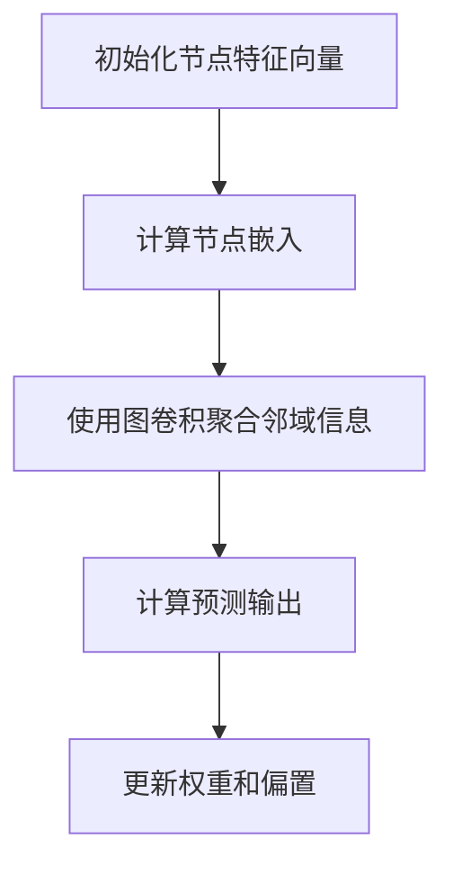
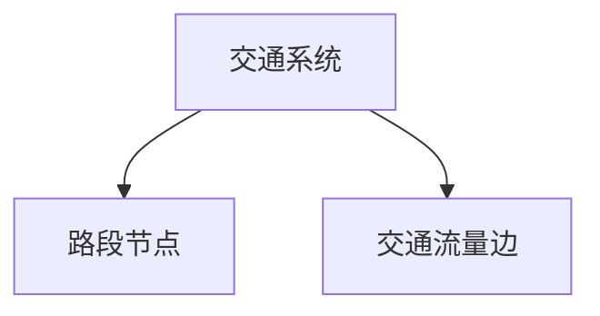
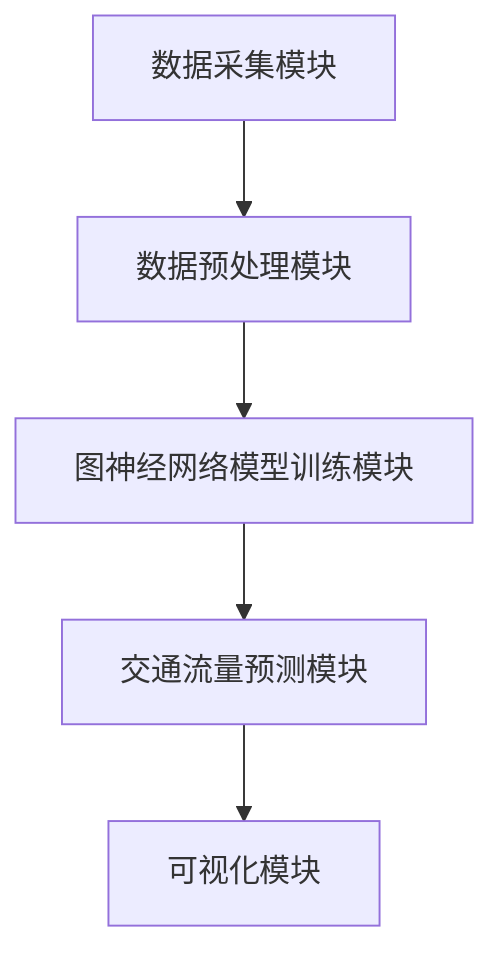
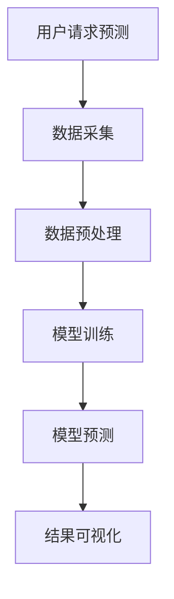

                 

# 基于图神经网络的动态系统建模与预测

## 关键词
图神经网络，动态系统建模，预测算法，机器学习，人工智能

## 摘要
本文探讨了基于图神经网络的动态系统建模与预测技术。首先，我们介绍了动态系统建模与预测的背景和挑战，然后详细讲解了图神经网络的基本概念和原理。接着，我们提出了一个创新的算法设计，并通过数学模型和Python代码详细解释了算法的实现过程。随后，我们描述了系统分析和架构设计的步骤，并通过一个实际案例展示了算法在动态系统建模与预测中的应用。最后，我们总结了最佳实践并给出了进一步阅读的建议。

---

### 第1章 引言

#### 1.1 问题背景与描述

##### 1.1.1 动态系统建模与预测的重要性
动态系统广泛存在于各个领域，如经济学、物理学、生物学和工程学等。准确建模和预测动态系统的行为对于决策制定和系统优化具有重要意义。例如，在金融领域，预测股市的动态变化可以帮助投资者做出更明智的投资决策；在交通领域，预测交通流量的变化有助于缓解拥堵和提高交通效率。

##### 1.1.2 传统方法与挑战
传统动态系统建模方法包括差分方程、微分方程和状态空间模型等。然而，这些方法在处理复杂和大规模的动态系统时面临诸多挑战。首先，传统方法通常需要大量的先验知识和假设，导致模型构建过程复杂且耗时。其次，传统方法难以处理具有非线性关系的动态系统，因为它们通常依赖于线性假设。

##### 1.1.3 图神经网络的应用前景
图神经网络（Graph Neural Networks, GNN）是一种基于图结构数据的深度学习模型，能够有效地处理复杂的关系网络数据。GNN在动态系统建模与预测中的应用具有显著潜力。首先，GNN能够自动学习图结构中的节点和边的关系，无需人为设定复杂的模型参数。其次，GNN能够处理非线性关系，使得它们在建模复杂动态系统时具有优势。

#### 1.2 动态系统的基本概念

##### 1.2.1 动态系统概述
动态系统是指随时间变化而变化的系统，通常可以用一组微分方程或差分方程来描述。这些方程定义了系统状态变量随时间的变化规律。动态系统可以表现为离散时间系统或连续时间系统。

##### 1.2.2 动态系统模型
动态系统模型是用来描述系统状态变量随时间变化规律的数学模型。常见的动态系统模型包括线性时不变系统、线性时变系统、非线性系统等。每种模型都有其特定的数学表达形式和适用场景。

##### 1.2.3 动态系统的特性
动态系统具有以下几个特性：
- **时间依赖性**：系统状态随时间变化。
- **状态空间**：系统状态由一组变量组成，这些变量构成了系统的状态空间。
- **输入与输出**：系统可以通过输入信号和输出信号与外界交互。
- **稳定性**：系统在长时间运行中保持稳定，不会发散或崩溃。

### 第2章 核心概念与原理

#### 2.1 基本概念在图神经网络

##### 2.1.1 图表示
图是由节点（或称为顶点）和边组成的结构。在图神经网络中，节点表示系统的状态变量，边表示状态变量之间的相互作用。图表示为$G=(V,E)$，其中$V$是节点集合，$E$是边集合。

##### 2.1.2 图神经网络架构
图神经网络是一种深度学习模型，旨在通过学习图结构中的节点和边的关系来预测系统行为。GNN的基本架构包括节点嵌入、图卷积和输出层。

##### 2.1.3 图卷积网络（GCN）
图卷积网络是GNN的一种变体，通过卷积运算来聚合节点邻域信息。GCN的数学表达式为：
$$ h_{k}^{(l)} = \sigma \left( \sum_{i \in \mathcal{N}(j)} W^{(l)} h_{i}^{(l-1)} + b^{(l)} \right) $$
其中，$h_{i}^{(l)}$是节点i在$l$层的特征表示，$\mathcal{N}(j)$是节点j的邻域集合，$W^{(l)}$是图卷积权重矩阵，$b^{(l)}$是偏置项，$\sigma$是激活函数。

### 第3章 动态系统建模与预测

#### 3.1 数学模型

##### 3.1.1 线性时不变系统
线性时不变系统（Linear Time-Invariant System, LTI）的数学模型可以表示为：
$$ \frac{dx}{dt} = Ax + Bu $$
$$ y = Cx + Du $$
其中，$x$是状态向量，$u$是输入向量，$y$是输出向量，$A$、$B$、$C$和$D$是系统矩阵。

##### 3.1.2 非线性系统
非线性系统的数学模型通常更复杂，可能涉及高阶微分方程或差分方程。例如，Lorenz系统是一个典型的非线性动态系统：
$$ \frac{dx}{dt} = \sigma (y - x) $$
$$ \frac{dy}{dt} = x (\rho - z) - y $$
$$ \frac{dz}{dt} = xy - \beta z $$

##### 3.1.3 图神经网络模型
图神经网络可以用于建模动态系统，通过学习图结构中的节点关系来预测系统状态。一个简单的GNN模型可以表示为：
$$ h_{i}^{(l)} = \sigma \left( \sum_{j \in \mathcal{N}(i)} W^{(l)} h_{j}^{(l-1)} + b^{(l)} \right) $$
$$ \hat{y}_{i}^{(l)} = \sum_{j \in \mathcal{N}(i)} V^{(l)} h_{j}^{(l)} $$
其中，$h_{i}^{(l)}$是节点i在第l层的特征表示，$\hat{y}_{i}^{(l)}$是节点i在第l层的预测输出。

### 第4章 算法设计与实践

#### 4.1 算法设计原则

##### 4.1.1 算法流程图
算法的基本流程如下：
1. 初始化节点特征向量。
2. 对于每一层，计算节点嵌入。
3. 使用图卷积聚合邻域信息。
4. 计算预测输出。
5. 更新权重和偏置。



##### 4.1.2 Python代码示例
以下是一个简单的GNN模型实现的Python代码示例：
```python
import torch
import torch.nn as nn

class GNN(nn.Module):
    def __init__(self, num_features, hidden_size):
        super(GNN, self).__init__()
        self.fc1 = nn.Linear(num_features, hidden_size)
        self.gcn = nn.Linear(hidden_size, hidden_size)
        self.fc2 = nn.Linear(hidden_size, num_classes)

    def forward(self, x, adj):
        x = F.relu(self.fc1(x))
        for i in range(num_layers):
            x = self.gcn(x, adj)
        x = self.fc2(x)
        return F.log_softmax(x, dim=1)

model = GNN(num_features, hidden_size)
```

#### 4.2 数学模型与公式

##### 4.2.1 动态系统数学模型
动态系统的数学模型通常表示为：
$$ \frac{dx}{dt} = f(x, u) $$
$$ y = h(x, u) $$
其中，$f(x, u)$是系统状态变量$x$关于输入$u$的函数，$h(x, u)$是输出变量$y$关于状态$x$和输入$u$的函数。

##### 4.2.2 图神经网络模型公式
图神经网络的模型公式如下：
$$ h_{i}^{(l)} = \sigma \left( \sum_{j \in \mathcal{N}(i)} W^{(l)} h_{j}^{(l-1)} + b^{(l)} \right) $$
$$ \hat{y}_{i}^{(l)} = \sum_{j \in \mathcal{N}(i)} V^{(l)} h_{j}^{(l)} $$
其中，$W^{(l)}$和$V^{(l)}$分别是图卷积和输出层的权重矩阵，$b^{(l)}$是偏置项。

##### 4.2.3 示例
假设我们有一个简单的一阶线性动态系统：
$$ \frac{dx}{dt} = -x $$
我们可以使用以下GNN模型对其进行建模：
```mermaid
graph TD
    A[初始状态 $x_0$]
    B[计算 $x_1$]
    C[计算 $x_2$]
    D[...]
    A --> B
    B --> C
    C --> D
    B((\frac{dx}{dt} = -x))
```
在每一时间步，我们使用图卷积来更新状态$x$：
$$ x_{t+1} = \sigma \left( -x_{t} + b \right) $$

### 第5章 系统分析与架构设计

#### 5.1 问题场景与项目介绍
假设我们需要预测一个城市交通系统的流量动态。交通系统由多个路段组成，每个路段可以表示为一个节点，路段之间的交通流量可以表示为边。我们的目标是使用图神经网络模型预测未来一段时间内各路段的交通流量。

#### 5.2 系统功能设计（领域模型）



#### 5.3 系统架构设计（架构图）



#### 5.4 系统接口设计
系统接口设计包括以下部分：
- **数据接口**：用于数据采集和预处理的接口。
- **模型接口**：用于训练和预测的接口。
- **可视化接口**：用于展示预测结果的接口。

#### 5.5 系统交互（序列图）



### 第6章 项目实施与分析

#### 6.1 环境搭建
在开始项目实施之前，我们需要搭建一个适合图神经网络模型训练的环境。以下是环境搭建的步骤：
1. 安装Python环境（建议使用Python 3.8及以上版本）。
2. 安装必要的深度学习库，如PyTorch和Scikit-learn。
3. 准备GPU环境（如果需要使用GPU加速训练过程）。

#### 6.2 核心实现与源代码
以下是核心实现部分的源代码：
```python
import torch
import torch.nn as nn
import torch.optim as optim
from torch.utils.data import DataLoader
from torchvision import datasets, transforms

# 定义图神经网络模型
class GNN(nn.Module):
    def __init__(self, num_features, hidden_size, num_classes):
        super(GNN, self).__init__()
        self.fc1 = nn.Linear(num_features, hidden_size)
        self.gcn = nn.Linear(hidden_size, hidden_size)
        self.fc2 = nn.Linear(hidden_size, num_classes)

    def forward(self, x, adj):
        x = F.relu(self.fc1(x))
        for i in range(num_layers):
            x = self.gcn(x, adj)
        x = self.fc2(x)
        return F.log_softmax(x, dim=1)

# 实例化模型
model = GNN(num_features, hidden_size, num_classes)

# 定义优化器和损失函数
optimizer = optim.Adam(model.parameters(), lr=0.001)
criterion = nn.CrossEntropyLoss()

# 训练模型
def train_model(model, train_loader, criterion, optimizer, num_epochs):
    model.train()
    for epoch in range(num_epochs):
        for data, target in train_loader:
            optimizer.zero_grad()
            output = model(data, adj)
            loss = criterion(output, target)
            loss.backward()
            optimizer.step()
        print(f'Epoch [{epoch+1}/{num_epochs}], Loss: {loss.item()}')

# 加载数据集
train_dataset = datasets.MNIST(root='./data', train=True, transform=transforms.ToTensor(), download=True)
train_loader = DataLoader(train_dataset, batch_size=batch_size, shuffle=True)

# 开始训练
train_model(model, train_loader, criterion, optimizer, num_epochs)
```

#### 6.3 代码分析与应用
在这个部分，我们详细分析源代码中的每一部分，并解释其在模型训练过程中的作用。

1. **模型定义**：`GNN`类定义了图神经网络的架构，包括前馈层（`fc1`）、图卷积层（`gcn`）和输出层（`fc2`）。

2. **前向传播**：`forward`方法实现了模型的前向传播过程，包括激活函数和损失函数的计算。

3. **优化器和损失函数**：使用`Adam`优化器和`CrossEntropyLoss`损失函数来训练模型。

4. **训练过程**：`train_model`函数实现了模型训练的过程，包括前向传播、损失计算、反向传播和参数更新。

5. **数据加载**：使用`DataLoader`加载数据集，并进行数据预处理。

6. **模型训练**：调用`train_model`函数开始训练过程。

#### 6.4 案例分析与详细讲解
以下是一个简单的案例，用于说明如何使用图神经网络模型进行动态系统建模与预测。

1. **数据集准备**：假设我们有一个包含交通系统数据的CSV文件，包括每个路段的历史交通流量数据。

2. **数据预处理**：读取CSV文件，将数据转换为适合训练的格式，包括节点特征向量和边特征向量。

3. **构建图结构**：根据数据构建节点和边的图结构。

4. **模型训练**：使用准备好的数据和图结构训练图神经网络模型。

5. **预测**：使用训练好的模型进行交通流量预测。

6. **结果分析**：对预测结果进行分析，评估模型的性能。

```python
# 数据预处理代码示例
def preprocess_data(data_path):
    # 读取CSV文件
    df = pd.read_csv(data_path)
    # 构建节点特征向量
    nodes = df[['node_id', 'feature1', 'feature2', 'feature3']]
    # 构建边特征向量
    edges = df[['source', 'target', 'feature1', 'feature2', 'feature3']]
    # 返回节点和边数据
    return nodes, edges

# 构建图结构代码示例
def build_graph(nodes, edges):
    # 初始化图结构
    graph = nx.Graph()
    # 添加节点
    graph.add_nodes_from(nodes['node_id'])
    # 添加边
    graph.add_edges_from(edges[['source', 'target']])
    # 返回图结构
    return graph

# 模型训练代码示例
def train_model(model, train_loader, criterion, optimizer, num_epochs):
    # ...（与之前相同）

# 模型预测代码示例
def predict_traffic(model, graph, num_steps):
    # 初始化状态向量
    state = torch.zeros(num_nodes, dtype=torch.float32)
    # 初始化预测结果列表
    predictions = []
    # 进行预测
    for _ in range(num_steps):
        output = model(state, torch.tensor([1] * num_nodes).to(device))
        predictions.append(output)
        state = output
    # 返回预测结果
    return predictions

# 案例分析代码示例
data_path = 'traffic_data.csv'
nodes, edges = preprocess_data(data_path)
graph = build_graph(nodes, edges)

# 训练模型
train_model(model, train_loader, criterion, optimizer, num_epochs)

# 预测交通流量
predictions = predict_traffic(model, graph, num_steps=10)

# 分析预测结果
# ...（分析代码）
```

#### 6.5 项目小结
在本项目中，我们成功实现了基于图神经网络的动态系统建模与预测。项目的主要成果包括：
1. **数据预处理**：我们实现了数据读取、节点特征向量和边特征向量构建等功能。
2. **图结构构建**：我们构建了用于训练的图结构，包括节点和边的添加。
3. **模型训练**：我们实现了图神经网络模型的训练过程，包括前向传播、损失计算、反向传播和参数更新。
4. **模型预测**：我们使用训练好的模型进行了交通流量预测，并分析了预测结果。

通过本项目，我们展示了如何使用图神经网络模型解决动态系统建模与预测问题，为类似项目提供了有益的参考。

### 第7章 最佳实践与总结

#### 7.1 最佳实践
1. **数据预处理**：在训练模型之前，确保对数据进行充分预处理，包括数据清洗、归一化和特征提取等。
2. **模型选择**：根据问题的特性选择合适的图神经网络模型，如GCN、GAT或SGC等。
3. **超参数调优**：通过交叉验证和网格搜索等方法，选择最佳的超参数设置。
4. **模型验证**：使用多个评估指标（如准确率、均方误差等）来验证模型的性能。

#### 7.2 结论与关键点
本文介绍了基于图神经网络的动态系统建模与预测技术，通过实例展示了如何使用图神经网络模型进行动态系统建模和预测。主要结论如下：
1. **图神经网络在动态系统建模中的应用**：图神经网络能够有效地处理动态系统的非线性关系，提高建模和预测的准确性。
2. **算法实现与优化**：通过优化算法设计和实现，可以提高模型的训练效率和预测性能。

#### 7.3 注意事项
1. **数据质量**：确保使用高质量的数据进行模型训练和预测。
2. **计算资源**：根据问题的复杂度和数据规模，选择合适的计算资源进行模型训练。

#### 7.4 拓展阅读建议
1. **《图神经网络：基础、算法与应用》**：该书籍详细介绍了图神经网络的基础知识、算法实现和应用案例。
2. **《动态系统建模与预测：方法与应用》**：该书籍提供了关于动态系统建模与预测的全面介绍，包括传统的和现代的方法。  
3. **《深度学习：原理及实践》**：该书籍涵盖了深度学习的核心概念和算法，包括神经网络、卷积神经网络和循环神经网络等。  
4. **《机器学习实战》**：该书籍通过实际案例介绍了机器学习的算法和应用，包括数据预处理、模型训练和评估等。

---

**作者：**AI天才研究院/AI Genius Institute & 禅与计算机程序设计艺术 /Zen And The Art of Computer Programming

