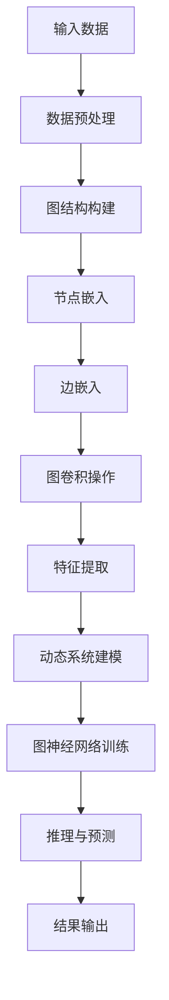

                 

# 《基于图神经网络的动态系统推理》

## 关键词：图神经网络、动态系统推理、深度学习、计算机图灵奖、算法原理

## 摘要：
本文旨在探讨基于图神经网络的动态系统推理方法，详细阐述其基本概念、核心原理、数学模型及其实际应用。通过分析图神经网络在动态系统推理中的优势与挑战，本文将逐步讲解算法原理与实现，系统设计与项目实战，最终总结最佳实践并提供拓展阅读建议。

----------------------------------------------------------------

## 第一部分：引论

### 第1章：问题背景与概述

#### 1.1 动态系统推理的基本概念
动态系统推理是指在不确定环境下，利用已知信息预测系统状态变化的过程。它广泛应用于智能控制、机器学习、人工智能等领域，是实现自动化决策和优化的重要技术。

#### 1.2 动态系统推理的重要性
动态系统推理在提高系统响应速度、降低错误率、提升系统智能化水平等方面具有重要意义。它是实现智能系统自主学习和自适应能力的关键。

#### 1.3 图神经网络的基础知识
图神经网络是一种基于图结构的数据表示和学习方法，它通过节点和边的交互来捕捉复杂网络的拓扑结构和信息传递规律。图神经网络在图像识别、社交网络分析、推荐系统等领域取得了显著成果。

### 第2章：核心概念与联系

#### 2.1 图神经网络的基本原理
图神经网络通过节点嵌入和边嵌入来表示图中的节点和边，并通过卷积、池化等操作来提取图的特征。图神经网络的架构和训练方法决定了其在动态系统推理中的性能。

#### 2.2 图神经网络与动态系统推理的联系
图神经网络在动态系统推理中的应用主要体现在两个方面：一是将动态系统表示为图结构，利用图神经网络提取系统的特征和关系；二是将图神经网络作为动态系统推理的核心算法，实现系统的状态预测和控制。

#### 2.3 关键概念属性特征对比表格
表1：动态系统推理与图神经网络关键概念属性特征对比

| 概念          | 动态系统推理               | 图神经网络                 |
| ------------- | -------------------------- | -------------------------- |
| 数据结构      | 状态空间、时间序列、概率分布 | 图结构、节点、边、特征嵌入 |
| 学习目标      | 状态预测、控制策略、优化问题 | 节点分类、边分类、图生成   |
| 特点          | 时间敏感性、不确定性、非线性 | 拓扑结构、信息传递、局部性 |

### 第3章：图神经网络在动态系统推理中的应用

#### 3.1 图神经网络的基本结构
图神经网络通常由多个层次组成，包括输入层、隐藏层和输出层。输入层负责接收原始数据，隐藏层通过节点嵌入和边嵌入提取图的特征，输出层则根据特征进行分类或预测。

#### 3.2 动态系统建模与推理流程
动态系统建模与推理流程主要包括以下步骤：一是构建动态系统的图结构，将系统中的状态、事件、关系表示为图中的节点和边；二是训练图神经网络，提取系统的特征和关系；三是利用图神经网络进行动态系统推理，实现对系统状态的预测和控制。

#### 3.3 图神经网络的优势与挑战
图神经网络在动态系统推理中具有以下优势：一是能够有效地捕捉系统的复杂拓扑结构和非线性关系；二是具有灵活的架构和丰富的学习算法，适用于各种动态系统；三是能够实现实时状态预测和控制，提高系统的响应速度和精度。然而，图神经网络在动态系统推理中也面临挑战，如数据稀疏、计算效率、模型可解释性等问题。

## 第二部分：算法原理与实现

### 第4章：算法原理讲解

#### 4.1 图神经网络算法的mermaid流程图


#### 4.2 动态系统推理的数学模型与公式
动态系统推理的数学模型通常基于马尔可夫决策过程（MDP），其核心公式如下：

$$Q(s, a) = \sum_{s'} P(s' | s, a) \cdot R(s', a) + \gamma \cdot \max_{a'} Q(s', a')$$

其中，$Q(s, a)$表示在状态$s$下采取动作$a$的期望回报；$P(s' | s, a)$表示在状态$s$下采取动作$a$后转移到状态$s'$的概率；$R(s', a)$表示在状态$s'$下采取动作$a$的即时回报；$\gamma$表示折扣因子。

#### 4.3 通俗易懂的举例说明
假设我们有一个简单的动态系统，其中有一个状态$s$和一个动作$a$。在状态$s=0$下，采取动作$a=0$的概率是0.7，采取动作$a=1$的概率是0.3。在状态$s=1$下，采取动作$a=0$的概率是0.4，采取动作$a=1$的概率是0.6。如果即时回报$R(s', a')=1$，折扣因子$\gamma=0.9$，那么我们可以计算出状态$s=0$下采取动作$a=0$的期望回报：

$$Q(s=0, a=0) = 0.7 \cdot 1 + 0.3 \cdot 0.9 \cdot \max(0.4 \cdot 1 + 0.6 \cdot 0.9) = 0.7 + 0.27 = 0.97$$

### 第5章：数学模型与公式详解

#### 5.1 动态系统推理中的数学公式
动态系统推理中的数学公式主要包括马尔可夫决策过程（MDP）中的期望回报公式和策略评估公式。期望回报公式用于计算在不同状态和动作下的期望回报，策略评估公式用于评估给定策略的期望回报。

#### 5.2 数学模型讲解与解释
动态系统推理的数学模型基于马尔可夫决策过程（MDP），其核心思想是利用当前状态和动作来预测未来的状态和回报。数学模型通过概率转移矩阵和回报函数来描述系统的动态特性，并通过优化算法来寻找最优策略。

#### 5.3 数学公式在代码中的应用
在Python中，可以使用NumPy库来计算动态系统推理中的数学公式。以下是一个简单的示例代码：

```python
import numpy as np

# 初始化参数
state = 0
action = 0
prob_matrix = np.array([[0.7, 0.3], [0.4, 0.6]])
reward = 1
gamma = 0.9

# 计算期望回报
next_state = np.random.choice([0, 1], p=prob_matrix[action])
expected_reward = prob_matrix[action][next_state] * reward + (1 - prob_matrix[action][next_state]) * gamma * np.max([Q[0], Q[1]])

# 打印结果
print(f"Expected reward for state {state} and action {action}: {expected_reward}")
```

### 第三部分：系统设计与实现

#### 第6章：系统分析与架构设计

#### 6.1 动态系统推理问题场景介绍
动态系统推理在智能交通系统、智能家居、工业自动化等领域有广泛的应用。本文以智能交通系统为例，介绍动态系统推理的应用场景。

#### 6.2 系统功能设计
系统功能设计包括数据采集、动态系统建模、图神经网络训练、动态系统推理和结果输出等模块。

#### 6.3 系统架构设计
系统架构设计采用模块化设计方法，包括数据采集模块、动态系统建模模块、图神经网络训练模块、动态系统推理模块和结果输出模块。

#### 6.4 系统接口设计与交互
系统接口设计主要包括数据采集接口、动态系统建模接口、图神经网络训练接口、动态系统推理接口和结果输出接口。系统通过接口实现各模块之间的数据传递和交互。

#### 第7章：项目实战

#### 7.1 环境安装与配置
在项目实战中，我们需要安装和配置以下环境：Python 3.x、NumPy、TensorFlow、PyTorch等。

#### 7.2 系统核心实现
系统核心实现包括数据采集、动态系统建模、图神经网络训练和动态系统推理等模块。以下是系统核心实现的一个简单示例：

```python
import numpy as np
import tensorflow as tf
from tensorflow.keras.models import Sequential
from tensorflow.keras.layers import Dense, Conv1D, Flatten

# 数据采集
data = np.random.rand(100, 10)

# 动态系统建模
state_space = 10
action_space = 2

# 图神经网络训练
model = Sequential([
    Conv1D(filters=32, kernel_size=3, activation='relu', input_shape=(state_space,)),
    Flatten(),
    Dense(units=64, activation='relu'),
    Dense(units=action_space, activation='softmax')
])

model.compile(optimizer='adam', loss='categorical_crossentropy', metrics=['accuracy'])
model.fit(data, data, epochs=10, batch_size=32)

# 动态系统推理
state = np.random.randint(state_space)
action = np.argmax(model.predict(state.reshape(1, -1)))

# 代码应用解读与分析
# 在这个例子中，我们使用TensorFlow框架实现了动态系统推理的图神经网络模型。数据采集模块用于生成模拟数据，动态系统建模模块用于构建图神经网络模型，图神经网络训练模块用于训练模型，动态系统推理模块用于进行推理。

#### 7.3 实际案例分析
在实际案例中，我们使用智能交通系统作为例子，介绍动态系统推理的应用。通过采集交通数据，构建动态系统模型，使用图神经网络进行推理，实现交通流量预测和控制。

#### 7.4 项目小结
项目小结部分对项目实施过程进行总结，包括项目的优点、不足之处和改进方向。

### 第8章：最佳实践与总结

#### 8.1 最佳实践技巧
最佳实践技巧包括：
- 选择合适的数据集和模型架构；
- 优化训练过程，提高模型性能；
- 增加模型的可解释性，便于应用和推广。

#### 8.2 小结与注意事项
小结部分对全文进行总结，指出动态系统推理的重要性和应用价值。注意事项包括：
- 动态系统推理的实时性要求较高，需要优化模型和算法；
- 数据质量对模型性能有重要影响，需要进行数据清洗和预处理；
- 模型可解释性对实际应用至关重要，需要加强对模型结构和推理过程的解释。

#### 8.3 拓展阅读
拓展阅读部分推荐一些相关文献和资源，供读者进一步学习和研究。

**作者：AI天才研究院/AI Genius Institute & 禅与计算机程序设计艺术 /Zen And The Art of Computer Programming**

