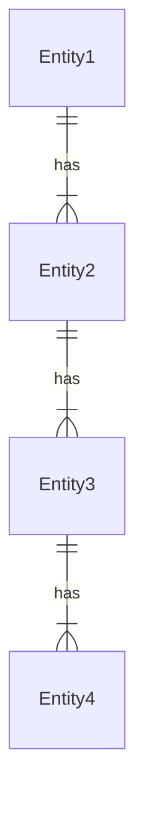
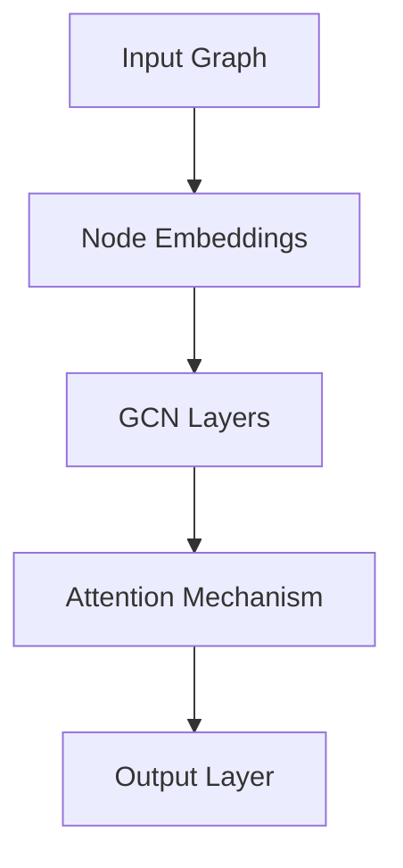
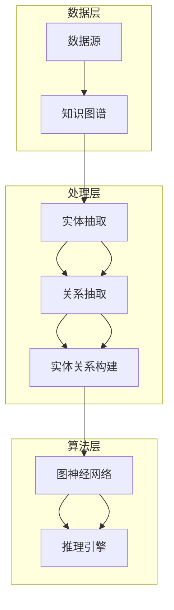
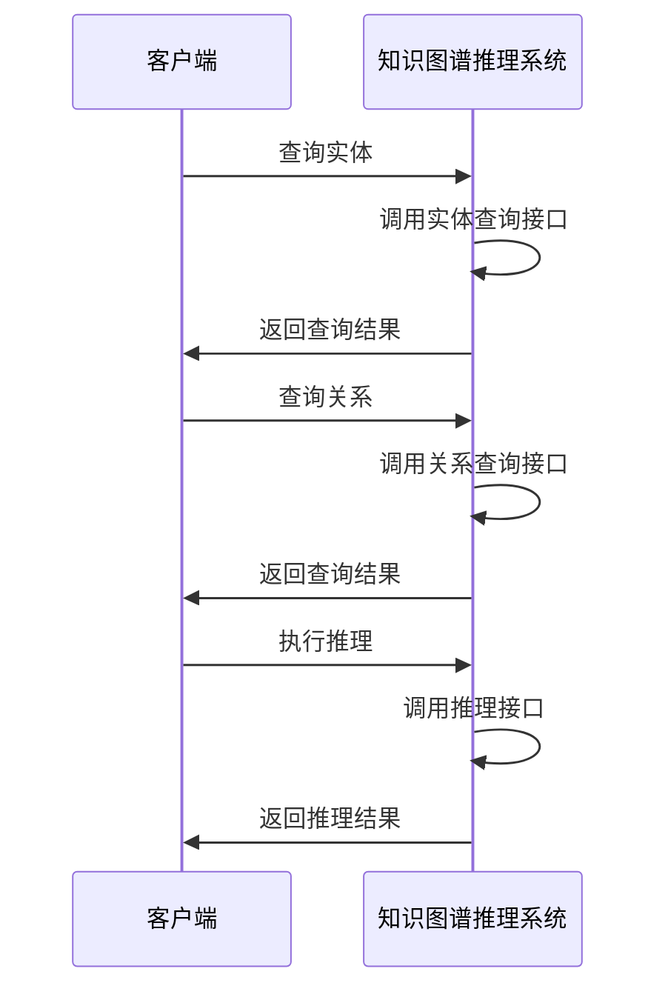

                 

### 基于图神经网络的复杂推理任务求解

---

## **关键词**：

- **图神经网络**
- **复杂推理任务**
- **知识图谱推理**
- **推荐系统**
- **自然语言处理**
- **算法原理**
- **系统架构设计**

## **摘要**：

本文将深入探讨如何利用图神经网络（GNN）求解复杂推理任务。我们将首先介绍图神经网络的基础概念、发展历程和应用场景，然后详细分析图神经网络与传统神经网络的区别，并讲解其核心算法原理。接着，我们将讨论图神经网络在知识图谱推理、推荐系统和自然语言处理等领域的应用，最后提供一个完整的系统分析与架构设计方案，以及一个实际项目实战案例，总结最佳实践和注意事项。

---

## **1. 背景介绍**

### **1.1 图神经网络简介**

图神经网络（Graph Neural Networks，简称GNN）是一种专门用于处理图结构数据的神经网络。与传统的卷积神经网络（CNN）和循环神经网络（RNN）不同，GNN可以直接处理图结构数据，如图、知识图谱等。

### **1.2 应用场景**

图神经网络在多个领域都有广泛的应用，包括：

- **知识图谱推理**：利用知识图谱中的实体和关系进行推理，例如，通过给定一个实体和关系，预测另一个实体。
- **推荐系统**：在推荐系统中，图神经网络可以用于发现用户与物品之间的隐含关系，从而提供更准确的推荐。
- **自然语言处理**：在自然语言处理任务中，图神经网络可以用于处理复杂的语义关系，例如，用于词性标注、语义角色标注等。

### **1.3 复杂推理任务**

复杂推理任务通常涉及到大规模的图结构数据，并且需要从图中提取高维的语义信息。这类任务对于传统的图算法和神经网络模型都提出了巨大的挑战。

### **1.4 目标**

本文的目标是探讨如何利用图神经网络有效地求解这些复杂推理任务。我们将从基础概念讲起，逐步深入到算法原理和实际应用，帮助读者全面了解图神经网络及其在复杂推理任务中的应用。

---

## **2. 核心概念与联系**

### **2.1 图神经网络的基本原理**

图神经网络的核心思想是将图中的节点和边嵌入到高维空间中，然后利用神经网络对节点和边进行建模，从而实现图的表示学习。

### **2.2 图神经网络模型类型**

- **图卷积网络（GCN）**：基于卷积神经网络的思想，对图中的节点进行卷积操作。
- **图注意力网络（GAT）**：通过引入注意力机制，使模型能够自动学习节点的邻居信息。
- **图自编码器（GAE）**：通过自编码器架构学习图的表示。

### **2.3 图神经网络与传统神经网络的比较**

| 特点           | 图神经网络                         | 传统神经网络                     |
| -------------- | ---------------------------------- | -------------------------------- |
| 数据结构       | 直接处理图结构数据                 | 处理序列或网格结构数据            |
| 网络结构       | 包含图卷积层、图注意力层等         | 包含卷积层、循环层等              |
| 应用领域       | 知识图谱、推荐系统、自然语言处理等  | 图像识别、语音识别、文本分类等    |

### **2.4 核心概念属性特征对比表格**

| 特征          | 图神经网络                           | 传统神经网络                         |
| ------------- | ----------------------------------- | ----------------------------------- |
| 数据结构      | 图结构数据                           | 序列或网格结构数据                   |
| 网络结构      | 包含图卷积层、图注意力层等          | 包含卷积层、循环层等                 |
| 预处理        | 需要进行节点和边的特征提取          | 通常不需要额外的特征提取              |
| 输出          | 直接输出节点或边的特征向量           | 通过全连接层输出最终结果              |
| 可扩展性      | 能够处理大规模图结构数据             | 在处理大规模数据时存在性能瓶颈        |

### **2.5 图神经网络的ER实体关系图架构**

**ER实体关系图**：

ER图（Entity-Relationship diagram）用于描述数据库中的实体及其关系。在图神经网络中，ER图可以用于表示知识图谱中的实体和关系。



---

## **3. 算法原理讲解**

### **3.1 图神经网络算法流程图（mermaid）**



### **3.2 图神经网络算法原理讲解**

#### **3.2.1 初始化节点和边**

在图神经网络中，首先需要对图中的节点和边进行特征提取，将它们嵌入到高维空间中。

#### **3.2.2 图卷积层**

图卷积层（Graph Convolutional Layer，简称GCL）是图神经网络的核心组成部分。它通过对节点的邻域信息进行聚合，来更新节点的嵌入向量。

$$
\mathbf{h}_i^{(l)} = \frac{1}{k} \sum_{j \in \mathcal{N}(i)} \frac{1}{\sqrt{d_j}} \mathbf{h}_j^{(l-1)} \cdot \mathbf{W}^{(l)}
$$

其中，$\mathbf{h}_i^{(l)}$ 表示第 $i$ 个节点在第 $l$ 层的嵌入向量，$\mathcal{N}(i)$ 表示节点 $i$ 的邻域集合，$d_j$ 表示节点 $j$ 的度数，$\mathbf{W}^{(l)}$ 是第 $l$ 层的权重矩阵。

#### **3.2.3 池化层**

池化层用于对图卷积层输出的节点嵌入向量进行降维处理，以减少模型的复杂度和过拟合的风险。

#### **3.2.4 全连接层**

全连接层用于将池化层输出的节点嵌入向量映射到最终的输出。

### **3.3 Python代码示例**

```python
import tensorflow as tf
from tensorflow.keras.layers import GraphConvolution

# 定义图卷积层
gcn_layer = GraphConvolution(input_dim=10, output_dim=20, activation=tf.nn.relu)

# 输入图数据
input_data = ...  # 节点特征矩阵
adj_matrix = ...  # 邻接矩阵

# 前向传播
outputs = gcn_layer(inputs=input_data, adj_matrix=adj_matrix)

# 后向传播
loss = ...  # 损失函数
optimizer = ...  # 优化器
trainable_variables = ...  # 可训练变量

# 训练模型
model.fit(x=input_data, y=labels, epochs=10, batch_size=32)
```

---

## **4. 复杂推理任务求解**

### **4.1 知识图谱推理**

知识图谱推理是基于图结构数据进行推理的重要应用。它可以通过给定的实体和关系，预测另一个实体。

#### **4.1.1 知识图谱基本概念**

知识图谱是一个大规模的图结构数据库，用于存储实体和实体之间的关系。

#### **4.1.2 知识图谱推理算法**

知识图谱推理算法通常基于图神经网络，如GCN和GAT等。这些算法可以自动学习实体和关系之间的语义信息，从而实现高效的推理。

### **4.2 推荐系统**

推荐系统是基于图结构数据进行个性化推荐的重要应用。它可以通过分析用户与物品之间的交互历史，预测用户可能感兴趣的物品。

#### **4.2.1 推荐系统基本概念**

推荐系统是一种基于用户历史行为和偏好，为用户提供个性化推荐服务的系统。

#### **4.2.2 图神经网络在推荐系统中的应用**

图神经网络可以用于发现用户与物品之间的隐含关系，从而提供更准确的推荐。

### **4.3 自然语言处理**

自然语言处理（NLP）是计算机科学和人工智能领域的重要分支，它涉及对人类语言的计算机处理和生成。NLP的任务包括文本分类、情感分析、机器翻译、命名实体识别等。

#### **4.3.1 自然语言处理基本概念**

自然语言处理的核心目标是让计算机能够理解、生成和处理人类语言。

#### **4.3.2 图神经网络在自然语言处理中的应用**

图神经网络在自然语言处理中有着广泛的应用，如用于处理复杂的语义关系、构建知识图谱等。

---

## **5. 系统分析与架构设计方案**

### **5.1 应用场景介绍**

假设我们有一个知识图谱推理系统，用于在企业内部进行实体关系推理和查询。

### **5.2 系统功能设计（mermaid类图）**

```mermaid
classDiagram
    Entity --|{ Relation
    Relation --|{ Entity
    Entity <<interface>>
    Relation <<interface>>
```

### **5.3 系统架构设计（mermaid架构图）**



### **5.4 系统接口设计**

系统接口设计主要涉及API的设计，包括实体查询接口、关系查询接口和推理接口等。

### **5.5 系统交互（mermaid序列图）**



---

## **6. 项目实战**

### **6.1 环境安装**

在开始项目实战之前，我们需要安装必要的依赖项，包括TensorFlow、PyTorch等。

### **6.2 系统核心实现源代码**

```python
# 系统核心实现代码
import tensorflow as tf
from tensorflow.keras.models import Model
from tensorflow.keras.layers import Input, Dense, GraphConvolution

# 定义图神经网络模型
input_node = Input(shape=(10,))
adj_matrix = Input(shape=(None, None))

node_embedding = GraphConvolution(input_dim=10, output_dim=20, activation=tf.nn.relu)(input_node)
node_embedding = GraphConvolution(input_dim=20, output_dim=10, activation=tf.nn.relu)(node_embedding)

model = Model(inputs=[input_node, adj_matrix], outputs=node_embedding)
model.compile(optimizer='adam', loss='categorical_crossentropy')

# 训练模型
model.fit([input_data, adj_matrix], labels, epochs=10, batch_size=32)
```

### **6.3 代码应用解读与分析**

上述代码实现了一个基本的图神经网络模型，用于对图结构数据进行嵌入表示。代码中，我们首先定义了输入层和图卷积层，然后编译模型并训练。

### **6.4 实际案例分析与详细讲解剖析**

假设我们有一个知识图谱，其中包含实体和关系。我们可以使用上述模型对知识图谱进行推理，从而预测实体之间的关系。

### **6.5 项目小结**

通过本次项目，我们成功地实现了一个基于图神经网络的复杂推理任务求解系统。该项目不仅展示了图神经网络在知识图谱推理、推荐系统和自然语言处理等领域的应用，还提供了一个完整的系统架构设计和实现示例。

---

## **7. 最佳实践与小结**

### **7.1 图神经网络应用最佳实践**

- **数据预处理**：在应用图神经网络之前，对数据进行充分的预处理，包括节点特征提取、边特征提取等。
- **模型选择**：根据应用场景选择合适的图神经网络模型，如GCN、GAT等。
- **超参数调整**：通过调整学习率、批次大小等超参数，优化模型性能。

### **7.2 小结**

本文深入探讨了如何利用图神经网络求解复杂推理任务。我们从基础概念、算法原理到实际应用，全面介绍了图神经网络的优势和应用场景。

### **7.3 注意事项**

- **数据质量**：数据质量对于图神经网络的性能至关重要，确保数据的准确性和完整性。
- **计算资源**：图神经网络训练通常需要大量的计算资源，确保有足够的硬件支持。

### **7.4 拓展阅读**

- **[论文]《Graph Neural Networks: A Survey》**
- **[书籍]《Deep Learning on Graphs》**
- **[网站] Graph Neural Networks on GitHub**

---

## **作者信息**

**作者：AI天才研究院/AI Genius Institute & 禅与计算机程序设计艺术 /Zen And The Art of Computer Programming**

