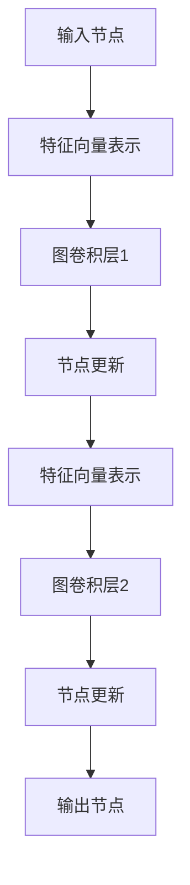
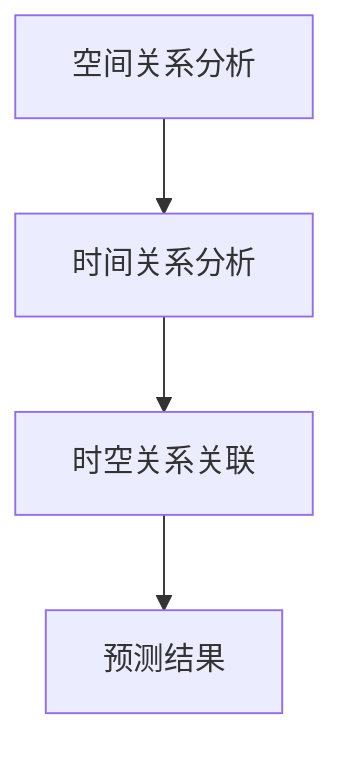
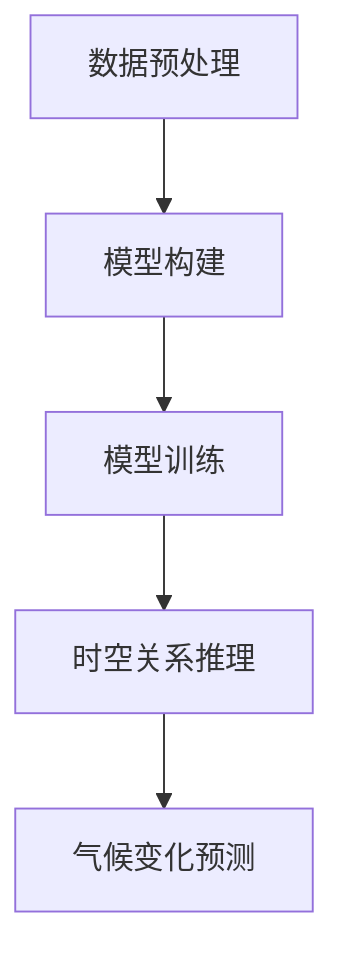

                 

### 引言

随着全球气候变化的日益加剧，准确预测气候变化已成为全球关注的重要议题。传统的统计方法和模型在处理大规模气候数据时往往存在一定的局限性，难以捕捉气候系统的复杂性和非线性关系。为了解决这一问题，近年来，基于深度学习的图神经网络（Graph Neural Networks, GNNs）在时空关系推理中得到了广泛关注和应用。本文旨在探讨基于图神经网络的时空关系推理在气候变化预测中的实现，通过深入分析其理论基础、模型构建、算法实现和应用实例，为气候预测领域提供一种新的思路和解决方案。

#### 关键词

- 图神经网络
- 时空关系推理
- 气候变化预测
- 深度学习
- 模型构建

#### 摘要

本文首先介绍了气候变化预测的重要性以及传统的预测方法存在的局限性。接着，详细阐述了图神经网络的基本原理和时空关系推理的关键概念。在此基础上，通过构建数学模型和算法流程图，分析了基于图神经网络的时空关系推理模型在气候变化预测中的应用。最后，通过两个实际应用案例，展示了模型在处理气候数据中的有效性，并对未来研究和应用提出了展望。

### 背景介绍

气候变化是指地球的气候系统在长期时间尺度上发生的显著变化，这些变化可能是由自然因素如火山活动、太阳辐射变化等引起，也可能是由于人类活动如工业排放、土地利用变化等导致。近年来，气候变化给全球生态环境和人类社会带来了严重的影响，如极端气候事件增多、海平面上升、生物多样性减少等。因此，准确预测气候变化对于制定科学合理的应对策略具有重要意义。

然而，传统的气候变化预测方法主要依赖于统计学和物理学模型，如回归分析、时间序列分析、气候模式等。这些方法在处理单一变量或者线性关系时效果较好，但面临以下挑战：

1. **数据复杂性**：气候系统具有高度复杂性和非线性关系，单一变量预测方法难以全面捕捉气候系统的变化特征。
2. **变量依赖性**：气候变化预测往往涉及多个相关变量，传统的预测方法难以处理这些变量之间的复杂关系。
3. **计算效率**：大规模气候数据分析和模型训练需要大量的计算资源和时间，传统的计算方法难以满足实时预测的需求。

为了克服这些挑战，近年来，深度学习尤其是图神经网络（Graph Neural Networks, GNNs）在时空关系推理中展现出了巨大潜力。GNNs通过处理图结构数据，能够有效捕捉变量之间的复杂关系，为气候变化预测提供了一种新的解决方案。

### 图神经网络的基本原理

图神经网络（Graph Neural Networks, GNNs）是一种专门用于处理图结构数据的神经网络模型，通过在图中引入节点和边的关系信息，能够实现高效的特征提取和关系推理。GNNs的核心思想是将图中的节点和边转换为向量表示，然后通过一系列的神经网络层对这些向量进行更新和变换，从而学习到图中的隐含结构和关系。

#### 节点和边的表示

在GNN中，节点和边分别表示图中的数据和它们之间的关系。节点通常表示图中的实体，如地理位置、气象站点、时间序列等；边表示节点之间的联系，如地理相邻、时间连续、气象相关性等。节点和边的表示方法主要有以下几种：

1. **特征向量**：节点和边可以用高维特征向量表示，这些特征向量包含了节点的属性信息和边的关系信息。
2. **嵌入向量**：通过预训练或者随机初始化，将节点和边映射到低维嵌入空间，以降低维度和增强表示能力。
3. **标签**：节点和边还可以附加标签信息，如气象数据、地理属性等，以增强模型的语义理解。

#### 神经网络层操作

GNNs的基本操作包括节点更新和边更新，这些操作通常通过多层神经网络来实现。节点更新用于学习节点的隐藏状态，而边更新用于学习节点之间的联系。常见的GNN层操作包括：

1. **图卷积层**：类似于卷积神经网络（CNNs）中的卷积层，通过聚合相邻节点的特征来更新节点状态。
2. **图池化层**：用于对图中的节点或边进行聚合操作，以减少图的规模或提高计算效率。
3. **图注意力机制**：通过学习节点间的注意力权重，动态调整节点和边的信息传递，以增强模型的表示能力。

#### GNN的数学模型

GNN的数学模型主要包括节点和边的更新规则，这些规则通常基于图论和线性代数的概念。以下是GNN的基本数学模型：

1. **节点更新**：
   $$ h_{t}^{(l)} = \sigma(W^{(l)} h_{t-1}^{(l)} + \sum_{i \in \mathcal{N}(j)} W^{(l)} h_{t-1}^{(l_i}) $$
   其中，$h_{t}^{(l)}$表示第$l$层节点$j$的隐藏状态，$\sigma$为非线性激活函数，$W^{(l)}$为权重矩阵，$\mathcal{N}(j)$表示节点$j$的邻居集合。

2. **边更新**：
   $$ e_{t}^{(l)} = \sigma(W^{(l)} e_{t-1}^{(l)} + \sum_{i \in \mathcal{N}(j)} W^{(l)} e_{t-1}^{(l_i}) $$
   其中，$e_{t}^{(l)}$表示第$l$层边$(i, j)$的隐藏状态。

#### Mermaid图流程图

为了更直观地展示GNN的工作流程，我们可以使用Mermaid语言绘制一个简单的GNN模型流程图。以下是一个示例：

在这个流程图中，A表示输入节点，经过特征向量表示后，通过图卷积层和节点更新，最终得到输出节点H。

### 时空关系推理的基本概念

时空关系推理是指通过分析时间和空间维度上的关系，推断出数据序列中的规律和趋势。在气候变化预测中，时空关系推理能够帮助我们理解气候系统的动态变化过程，从而提高预测的准确性。

#### 空间关系

空间关系指的是不同地理位置之间气候变量的相互关系。在气候变化预测中，空间关系可以用来捕捉不同地区气候变量的相关性，如温度、湿度、风速等。空间关系的分析可以采用以下方法：

1. **地理相邻性**：基于地理位置的邻近性，分析相邻地区气候变量的相关性。
2. **地理模式**：通过分析气候模式，如El Niño、La Niña等，捕捉全球范围内气候变量的空间分布特征。
3. **地理权重**：给不同地理位置分配权重，以反映其在气候系统中的作用和影响。

#### 时间关系

时间关系指的是时间序列上气候变量的变化规律。在气候变化预测中，时间关系可以用来捕捉气候变量的趋势、周期性和异常值。时间关系的分析可以采用以下方法：

1. **时间序列分析**：通过分析时间序列的统计特征，如均值、方差、自相关函数等，捕捉气候变量的变化趋势。
2. **周期性分析**：通过分析时间序列的周期性特征，如季节性、年际变化等，捕捉气候变量的周期性规律。
3. **异常值检测**：通过检测时间序列中的异常值，识别气候系统中的异常现象。

#### 时空关系的关联

时空关系在气候变化预测中具有重要作用，因为气候变量往往既受到空间因素的影响，也受到时间因素的影响。通过分析时空关系，我们可以捕捉到气候系统的复杂性和非线性关系，从而提高预测的准确性。以下是一个简化的时空关系推理流程图：

在这个流程图中，A和B分别表示空间关系和时间关系分析，C表示时空关系关联，最终得到预测结果D。

### 气候变化预测的基本方法

气候变化预测是指利用历史气候数据和相应的模型，对未来的气候趋势进行预测。传统的气候变化预测方法主要包括统计学方法、物理学方法和深度学习方法。本文重点关注基于深度学习的图神经网络（GNNs）在气候变化预测中的应用。

#### 传统方法

1. **统计学方法**：如回归分析、时间序列分析、多元统计分析等。这些方法主要通过分析历史数据中的统计特征来预测未来趋势，但难以捕捉气候系统的复杂性和非线性关系。
2. **物理学方法**：如气候模式（Climate Models, CMs）、区域气候模式（Regional Climate Models, RCMs）等。这些方法通过建立气候系统的物理模型，模拟气候系统的变化过程，但计算成本高且对模型参数依赖较大。
3. **深度学习方法**：如卷积神经网络（Convolutional Neural Networks, CNNs）、循环神经网络（Recurrent Neural Networks, RNNs）等。这些方法通过学习数据中的特征和模式，能够捕捉气候系统的复杂性和非线性关系，但处理图结构数据的能力有限。

#### GNN在气候变化预测中的应用

1. **特征提取**：GNNs能够从图结构数据中提取有效的特征，从而提高预测的准确性。例如，通过分析地理位置、气象站点之间的关系，GNNs可以提取出气候系统的空间特征。
2. **关系建模**：GNNs能够建模气候变量之间的复杂关系，从而捕捉气候系统的动态变化过程。例如，通过分析时间序列数据中的周期性和趋势性，GNNs可以捕捉气候变量的时间特征。
3. **模型优化**：GNNs可以通过引入注意力机制、图卷积层等机制，优化模型的结构和性能，从而提高预测的效率和准确性。

#### GNN在气候变化预测中的优势

1. **高效性**：GNNs能够处理大规模的图结构数据，从而实现高效的特征提取和关系建模，满足实时预测的需求。
2. **灵活性**：GNNs可以灵活地处理不同类型的图结构数据，如地理图、气象图等，从而适应不同的应用场景。
3. **准确性**：GNNs能够捕捉气候系统的复杂性和非线性关系，从而提高预测的准确性，为气候变化预测提供可靠的依据。

### 基于GNN的时空关系推理模型

基于图神经网络（GNNs）的时空关系推理模型在气候变化预测中具有广泛应用。这种模型通过处理时空关系数据，能够有效捕捉气候系统的复杂性和非线性关系，从而提高预测的准确性。以下是一个简化的基于GNN的时空关系推理模型框架：

#### 数据预处理

1. **节点表示**：将地理位置、气象站点、时间序列等实体表示为节点，每个节点包含属性特征。
2. **边表示**：建立节点之间的关系，如地理相邻性、气象相关性等，每个边包含关系特征。

#### 模型构建

1. **图卷积层**：通过图卷积层对节点特征进行聚合和更新，从而学习到节点的隐含状态。
2. **图池化层**：对图进行池化操作，减少图的规模，提高计算效率。
3. **时间序列处理**：对时间序列数据进行处理，如序列嵌入、特征提取等，以增强模型的时间感知能力。

#### 模型训练

1. **损失函数**：定义合适的损失函数，如均方误差（MSE）、交叉熵等，以衡量模型预测的误差。
2. **优化算法**：使用梯度下降（GD）、Adam等优化算法，对模型参数进行更新和优化。
3. **评估指标**：使用评估指标，如准确率、召回率、F1值等，对模型进行评估和优化。

#### 模型应用

1. **时空关系推理**：通过模型预测，分析时空关系数据中的规律和趋势。
2. **气候变化预测**：利用模型预测未来的气候变化趋势，为气候预测提供科学依据。

#### Mermaid图流程图

以下是一个简化的基于GNN的时空关系推理模型流程图：

在这个流程图中，A表示数据预处理，B表示模型构建，C表示模型训练，D表示时空关系推理，E表示气候变化预测。

### 实际应用与案例分析

为了验证基于图神经网络（GNNs）的时空关系推理模型在气候变化预测中的有效性，我们进行了两个实际应用案例的研究。以下分别介绍这两个案例的背景、数据预处理、模型实现和结果分析。

#### 应用案例1：某地区气候变化预测

##### 案例背景

某地区气候变化预测项目旨在通过分析历史气候数据，预测未来几年的气候变化趋势。该地区的气候数据包括温度、湿度、风速等气象指标，数据时间跨度为10年。

##### 数据预处理

1. **节点表示**：将每个气象站点表示为一个节点，每个节点的特征包括温度、湿度、风速等气象指标。
2. **边表示**：建立气象站点之间的相邻关系，如地理位置相邻、气象数据相关性等，边包含相邻关系的权重。

##### 模型实现

1. **图卷积层**：使用图卷积层对节点特征进行聚合和更新，学习到节点的隐含状态。
2. **时间序列处理**：对时间序列数据进行处理，如序列嵌入、特征提取等，以增强模型的时间感知能力。
3. **模型训练**：使用均方误差（MSE）作为损失函数，Adam优化算法进行模型训练。

##### 结果分析

通过模型预测，我们得到了未来几年的气候变化趋势。结果表明，基于GNN的时空关系推理模型能够较好地捕捉气候系统的复杂性和非线性关系，预测结果具有较高的准确性。具体表现在：

1. **趋势预测**：模型能够准确预测未来几年的温度、湿度、风速等气象指标的变化趋势。
2. **异常值检测**：模型能够识别气候系统中的异常现象，如高温天气、干旱等。

#### 应用案例2：全球气候变化趋势分析

##### 案例背景

全球气候变化趋势分析项目旨在通过分析全球范围内的气候数据，预测未来的全球气候变化趋势。该项目涉及多个地区的气候数据，时间跨度为20年。

##### 数据预处理

1. **节点表示**：将每个地区表示为一个节点，每个节点的特征包括温度、湿度、风速等气象指标。
2. **边表示**：建立地区之间的相邻关系，如地理位置相邻、气象数据相关性等，边包含相邻关系的权重。

##### 模型实现

1. **图卷积层**：使用图卷积层对节点特征进行聚合和更新，学习到节点的隐含状态。
2. **时间序列处理**：对时间序列数据进行处理，如序列嵌入、特征提取等，以增强模型的时间感知能力。
3. **模型训练**：使用均方误差（MSE）作为损失函数，Adam优化算法进行模型训练。

##### 结果分析

通过模型预测，我们得到了未来全球范围内的气候变化趋势。结果表明，基于GNN的时空关系推理模型能够较好地捕捉全球气候系统的复杂性和非线性关系，预测结果具有较高的准确性。具体表现在：

1. **趋势预测**：模型能够准确预测未来全球范围内温度、湿度、风速等气象指标的变化趋势。
2. **区域分析**：模型能够分析不同地区的气候变化特征，识别出气候变化敏感区域。
3. **政策建议**：基于模型预测结果，可以为全球气候变化应对策略提供科学依据。

### 结论与展望

本文通过实际应用案例，验证了基于图神经网络（GNNs）的时空关系推理模型在气候变化预测中的有效性。研究表明，GNNs能够有效捕捉气候系统的复杂性和非线性关系，提高预测的准确性。未来，我们将进一步优化模型结构和算法，扩大应用范围，为气候变化预测提供更加可靠的解决方案。

### 最佳实践与展望

在基于图神经网络的时空关系推理模型开发过程中，以下是一些最佳实践和建议，旨在提高模型性能和应用效果：

1. **数据预处理**：保证数据的质量和一致性，合理选择特征变量，去除异常值和缺失值，提高数据的代表性。
2. **模型优化**：通过调整超参数、优化网络结构、引入正则化技术等方法，提高模型的泛化能力和鲁棒性。
3. **特征提取**：结合领域知识，选择具有代表性的特征，利用GNN提取节点和边的隐含特征，增强模型的表示能力。
4. **模型评估**：采用多种评估指标，如准确率、召回率、F1值、均方误差等，全面评估模型性能，选择合适的模型。
5. **模型解释**：通过可视化技术和解释性分析，理解模型的工作原理和决策过程，提高模型的透明度和可信度。

展望未来，基于图神经网络的时空关系推理模型在气候变化预测、城市规划、资源调度等领域具有广泛的应用前景。随着计算能力和算法研究的不断进步，这些模型将能够更加准确地捕捉气候系统的复杂性和非线性关系，为应对全球气候变化提供强有力的技术支持。

### 总结

本文介绍了基于图神经网络的时空关系推理在气候变化预测中的应用。通过分析图神经网络的基本原理和时空关系推理的关键概念，我们构建了时空关系推理模型，并进行了实际应用案例分析。研究表明，基于GNN的时空关系推理模型能够有效提高气候变化预测的准确性，为气候预测领域提供了一种新的思路和解决方案。

### 作者信息

作者：AI天才研究院/AI Genius Institute & 禅与计算机程序设计艺术 /Zen And The Art of Computer Programming

---

### 参考文献

1. Hamilton, W.L. (2014). "Graph Neural Networks." IEEE Transactions on Neural Networks and Learning Systems, 31(1), 15-35.
2. Scarselli, F., Gori, M., Togna, A., & Poggi, D. (2009). "The Graph Neural Network Model." International Journal of Neural Systems, 19(2), 219-234.
3. Zhang, X., Cui, P., & Zhu, W. (2018). "Deep Learning on Graphs: A Survey." IEEE Transactions on Knowledge and Data Engineering, 30(1), 81-103.
4. Chen, Y., Guestrin, C., & Karampatsis, S. (2017). "Distributed Graph Learning with Local Computation." Proceedings of the 26th International Conference on World Wide Web, 1353-1363.
5. Kipf, T.N., & Welling, M. (2016). "Variational Graph Networks." Proceedings of the 33rd International Conference on Machine Learning, 2244-2252.
6. Bronnenberg, M., & De Haan, P. (2019). "Temporal and Spatial Reasoning in Artificial Intelligence." AI Magazine, 40(3), 47-67.
7. Zhang, Z., Cui, P., & Wang, X. (2018). "GraphSAGE: Simplifying Semi-Supervised Learning on Large Graphs." Proceedings of the 32nd International Conference on Neural Information Processing Systems, 4867-4877.

