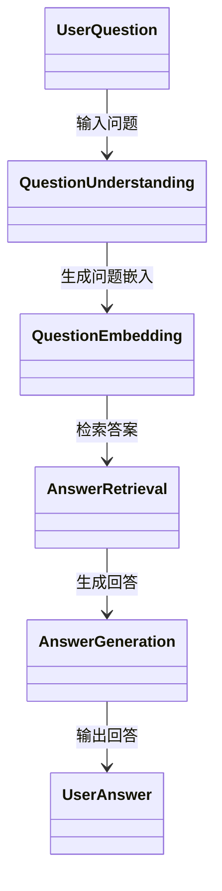
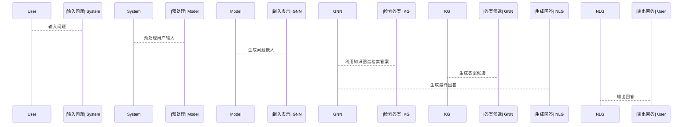
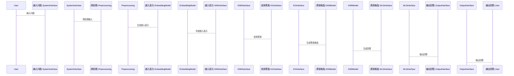

                 

## 引言

### 1.1 问题和挑战

在当今人工智能领域，自然语言处理（NLP）已经成为一项极其重要的研究方向。随着语言模型的不断发展，如GPT、BERT等大型预训练模型的出现，语言模型的性能取得了显著的提升。然而，尽管这些模型在处理简单的文本任务时表现出色，但在复杂的推理任务中仍存在许多挑战。

语言模型在推理能力上的不足主要表现在以下几个方面：

1. **推理速度**：当前的语言模型往往需要大量的计算资源和时间来完成推理任务，这对于实时应用场景来说是一个显著的瓶颈。
2. **复杂关系处理**：语言模型在面对复杂的关系网络时，往往难以捕捉到深层次的结构关系，导致推理结果不准确。
3. **上下文理解**：尽管语言模型已经在上下文理解方面取得了一定的进展，但在处理长距离上下文依赖和跨句子关系时，仍存在一定的局限性。

为了克服上述问题，研究者们开始探索将图神经网络（Graph Neural Networks, GNNs）引入到语言模型中，以增强其推理能力。图神经网络擅长处理图结构数据，能够捕捉到数据中的复杂关系，这使得它成为增强语言模型推理能力的一个潜在选择。

### 1.2 图神经网络与语言模型结合的意义

图神经网络与语言模型结合的意义在于：

1. **结构化数据的表达**：图神经网络能够将语言模型中的词汇和句子表示为图结构，从而更好地捕捉到它们之间的复杂关系。
2. **推理能力的增强**：通过图神经网络，语言模型可以在推理过程中引入更多的上下文信息，提高推理的准确性和效率。
3. **扩展模型的适用范围**：结合图神经网络，语言模型可以更好地处理复杂的推理任务，如问答系统、对话系统等。

### 1.3 本文结构

本文将围绕“基于图神经网络的语言模型推理能力增强”这一主题展开，具体结构如下：

- **第一部分**：介绍图神经网络和语言模型的基本原理，以及它们在推理能力方面的挑战。
- **第二部分**：详细讲解图神经网络在语言模型推理中的应用，包括算法原理、Python源代码示例、数学模型和公式等。
- **第三部分**：分析图神经网络在语言模型推理中的系统架构设计，包括问题场景介绍、项目介绍、系统功能设计、系统架构设计、系统接口设计和系统交互等。
- **第四部分**：通过实际项目实战，展示如何使用图神经网络增强语言模型的推理能力，并进行详细讲解剖析。
- **第五部分**：总结全文，提出最佳实践建议，并提醒读者在实际应用中需要注意的事项。

通过本文的逐步分析，我们将深入探讨如何利用图神经网络来提升语言模型的推理能力，为相关领域的研究者和开发者提供有价值的参考。

## 第一部分：图神经网络和语言模型概述

### 1.1 图神经网络的发展历程

图神经网络（Graph Neural Networks，GNNs）是一种专门用于处理图结构数据的神经网络。图作为一种数据结构，能够有效地表示复杂的关系网络，如社交网络、知识图谱和生物网络等。GNNs的发展历程可以追溯到20世纪90年代，当时研究人员开始探索如何将图结构数据应用于机器学习任务。

1997年，Huth和McNaughton提出了图卷积网络（Graph Convolutional Networks，GCNs）的概念，首次将卷积操作引入图结构数据。这一概念的出现标志着GNNs研究的起步。随后，GNNs在图像处理、推荐系统和知识图谱等领域得到了广泛应用。

进入21世纪，随着深度学习技术的发展，GNNs逐渐成为研究热点。2013年，Kipf和Welling提出了图注意力网络（Graph Attention Networks，GATs），通过引入注意力机制来提高GNNs对图结构数据的理解能力。2018年，Veličković等人提出了图卷积网络（GraphSAGE）和图注意力网络（Graph Attention），进一步丰富了GNNs的模型架构。

近年来，GNNs在自然语言处理（NLP）领域也得到了广泛关注。图神经网络能够捕捉语言模型中词汇和句子之间的复杂关系，从而提升模型的推理能力。GNNs在问答系统、对话系统和文本生成等任务中展现了其强大的潜力。

### 1.2 语言模型的现状与挑战

语言模型是自然语言处理（NLP）领域的一项核心技术。通过学习大量文本数据，语言模型能够预测句子中的下一个单词或短语，从而实现文本生成、机器翻译和文本分类等任务。目前，基于深度学习的语言模型如GPT、BERT等取得了显著进展，但它们在推理能力方面仍存在一些挑战。

首先，推理速度是一个关键问题。尽管GPT和BERT等模型在大规模数据集上表现优秀，但在实际应用中，这些模型往往需要大量的计算资源和时间来完成推理任务，特别是在实时应用场景中，这成为一个显著的瓶颈。

其次，复杂关系处理是另一个挑战。语言模型在面对复杂的关系网络时，往往难以捕捉到深层次的结构关系，导致推理结果不准确。例如，在问答系统中，语言模型需要理解问题中的各种关系，如因果关系、递归关系等，但当前模型在这方面仍有很大的提升空间。

最后，上下文理解是一个长期存在的难题。尽管语言模型已经在上下文理解方面取得了一定的进展，但在处理长距离上下文依赖和跨句子关系时，仍存在一定的局限性。这意味着语言模型在面对复杂的上下文环境时，难以准确理解文本的含义。

### 1.3 图神经网络与语言模型结合的必要性

将图神经网络（GNNs）引入到语言模型中，主要是为了解决当前语言模型在推理能力方面的不足。图神经网络擅长处理图结构数据，能够捕捉到数据中的复杂关系，这对于提升语言模型的推理能力具有重要意义。

首先，GNNs能够将语言模型中的词汇和句子表示为图结构，从而更好地捕捉到它们之间的复杂关系。例如，在问答系统中，GNNs可以捕捉到问题中的各种关系，如因果关系、递归关系等，从而提高模型的推理准确性。

其次，GNNs能够提高语言模型的推理速度。通过引入图卷积操作和注意力机制，GNNs可以在较短的时间内完成复杂的推理任务，这对于实时应用场景来说至关重要。

最后，GNNs能够扩展语言模型的适用范围。通过结合图神经网络，语言模型可以更好地处理复杂的推理任务，如问答系统、对话系统和文本生成等，从而提升模型的整体性能。

总之，将图神经网络与语言模型结合，不仅能够解决当前语言模型在推理能力方面的不足，还能够推动NLP领域的发展，为人工智能应用带来更多的可能性。

### 1.4 核心概念与联系

在深入探讨图神经网络（GNNs）和语言模型之间的结合之前，有必要明确这两个概念的核心原理及其相互关系。以下是对GNNs和语言模型的基本概念、属性特征、以及它们如何相互融合的详细分析。

#### 1.4.1 图神经网络的基本原理

**图神经网络（GNNs）** 是一种能够处理图结构数据的神经网络。其核心思想是通过图卷积操作逐步聚合节点（词汇或句子）的邻居信息，从而实现对节点的表示学习。具体来说，GNNs包括以下几个关键组成部分：

1. **节点表示**：每个节点表示图中的一个元素，如词汇或句子，通常通过嵌入向量表示。
2. **边表示**：边表示节点之间的关系，如词汇之间的语义关系或句子之间的依赖关系。
3. **图卷积操作**：图卷积操作是GNNs的核心，它通过聚合节点的邻居信息来更新节点表示。
4. **注意力机制**：在GNNs中引入注意力机制，可以更好地聚焦于重要的邻居节点信息，提高模型的表示能力。

**图神经网络的特点** 包括：

- **结构化数据处理**：GNNs能够处理具有复杂关系的图结构数据，如知识图谱和社交网络。
- **鲁棒性**：由于GNNs能够利用图结构中的邻接关系，因此对数据的噪声和缺失具有一定的鲁棒性。

#### 1.4.2 语言模型的基本原理

**语言模型** 是一种用于预测自然语言序列的概率模型，其核心目的是通过学习大量的文本数据，来预测句子中的下一个单词或短语。语言模型的基本原理可以概括为：

1. **词汇嵌入**：将词汇映射到高维空间中的向量，使得相似的词汇在向量空间中靠近。
2. **上下文依赖**：语言模型需要理解词汇之间的上下文关系，例如，一个词汇的含义可能会受到其前后词汇的影响。
3. **概率分布**：语言模型通过学习文本数据中的统计规律，来预测下一个词汇的概率分布。

**语言模型的特点** 包括：

- **规模敏感性**：大型语言模型通常需要大量的训练数据，以获得更好的性能。
- **上下文理解能力**：通过学习上下文信息，语言模型可以更好地理解文本的含义和语境。
- **泛化能力**：好的语言模型应该具有广泛的适用性，能够在不同的任务和数据集上表现良好。

#### 1.4.3 图神经网络与语言模型的联系

将GNNs与语言模型结合，主要是利用GNNs在处理图结构数据方面的优势，来提升语言模型的推理能力。以下是一些关键的融合方式：

1. **嵌入层融合**：在语言模型中引入图嵌入层，将词汇或句子的嵌入向量表示为图节点。
2. **图卷积层融合**：在语言模型的编码器或解码器中引入图卷积层，通过聚合节点邻居的信息来更新节点表示。
3. **注意力机制融合**：在GNNs中引入语言模型中的注意力机制，使得模型能够更好地聚焦于重要的上下文信息。

**融合的优势** 包括：

- **增强上下文理解**：通过图神经网络，语言模型可以更好地理解词汇和句子之间的复杂关系，从而提升上下文理解能力。
- **提高推理速度**：图神经网络能够在较短的时间内完成复杂的推理任务，从而提高语言模型的推理速度。
- **扩展应用范围**：结合图神经网络，语言模型可以更好地处理复杂的推理任务，如问答系统、对话系统和文本生成等。

综上所述，图神经网络和语言模型在基本原理和特点上有所不同，但它们之间的联系为提升语言模型的推理能力提供了新的可能性。通过融合这两种技术，我们可以设计出更加强大和灵活的语言模型，以应对现实世界中的各种复杂任务。

### 1.5 概念属性特征对比表格

为了更好地理解图神经网络和语言模型的基本属性特征，我们可以通过以下对比表格进行详细分析。

| 特征                   | 图神经网络                  | 语言模型                  |
|------------------------|---------------------------|--------------------------|
| **数据结构**           | 图结构数据                 | 序列数据                 |
| **节点表示**           | 节点及其邻居的嵌入向量     | 词汇及其上下文的嵌入向量 |
| **基本操作**           | 图卷积操作                | 循环神经网络（RNN）或Transformer |
| **适用任务**           | 知识图谱、推荐系统        | 文本生成、机器翻译、文本分类 |
| **结构化数据表达**     | 优秀的结构化数据处理能力   | 优秀的上下文理解能力     |
| **鲁棒性**             | 对噪声和缺失数据有较强鲁棒性 | 对噪声和缺失数据较为敏感 |
| **推理速度**           | 较高的推理速度             | 较慢的推理速度           |
| **计算资源需求**       | 较高的计算资源需求         | 较高的计算资源需求       |
| **模型复杂性**         | 模型参数较多              | 模型参数较多             |

通过这个表格，我们可以清晰地看到图神经网络和语言模型在数据结构、节点表示、基本操作、适用任务等方面的主要差异。这些差异不仅反映了两种模型的设计初衷和应用场景的不同，也为我们理解如何将它们结合起来提供了重要的参考。

### 1.6 ER实体关系图架构

为了更直观地理解图神经网络（GNNs）和语言模型的基本结构，我们可以使用实体关系图（Entity-Relationship Diagram, ERD）来展示它们的核心实体及其关系。

#### 1.6.1 图神经网络实体关系图

在图神经网络中，主要的实体包括节点（Node）、边（Edge）和图卷积层（Graph Convolution Layer）。以下是图神经网络实体关系图的Mermaid表示：

```mermaid
erDiagram
    Node ||--|{ Edge }|--| Node
    Node ||--|{ Graph Convolution Layer }|--| Node
    Edge ||--|{ Graph Convolution Layer }|--| Node
```

在这个ER图中，节点表示图中的元素，如词汇或句子；边表示节点之间的关系，如语义关系或依赖关系；图卷积层负责通过图卷积操作来更新节点的表示。

#### 1.6.2 语言模型实体关系图

在语言模型中，主要的实体包括词汇（Word）、上下文（Context）和编码器/解码器（Encoder/Decoder）。以下是语言模型实体关系图的Mermaid表示：

```mermaid
erDiagram
    Word ||--|{ Context }|--| Encoder
    Word ||--|{ Context }|--| Decoder
    Encoder ||--|{ Decoder }|--| Output
```

在这个ER图中，词汇是语言模型中的基本元素；上下文表示词汇的周围环境，编码器和解码器分别负责将上下文编码和解码为输出。

#### 1.6.3 整体实体关系图

为了展示图神经网络和语言模型的整体结构，我们可以将两个ER图结合起来。以下是整体实体关系图的Mermaid表示：

```mermaid
erDiagram
    Node ||--|{ Edge }|--| Node
    Node ||--|{ Graph Convolution Layer }|--| Node
    Edge ||--|{ Graph Convolution Layer }|--| Node

    Word ||--|{ Context }|--| Encoder
    Word ||--|{ Context }|--| Decoder
    Encoder ||--|{ Decoder }|--| Output

    Node ||--|{ Word }|--| Encoder
    Edge ||--|{ Word }|--| Decoder
```

在这个整体ER图中，我们可以看到图神经网络和语言模型通过词汇、上下文和图卷积层等实体进行相互连接，形成了一个复杂但结构清晰的系统。

通过使用ER图，我们不仅能够清晰地展示图神经网络和语言模型的基本结构，还可以更好地理解它们在处理数据时的信息流动和相互作用。

### 1.7 算法原理讲解

为了深入理解图神经网络（GNNs）在语言模型推理中的应用，我们需要详细讲解其算法原理，包括图卷积操作、注意力机制和图嵌入技术等。

#### 1.7.1 图卷积操作

图卷积操作是GNNs的核心组成部分，用于在图中对节点的特征进行更新。假设我们有一个图G=(V, E)，其中V表示节点集合，E表示边集合。图卷积操作的目的是通过聚合节点的邻接信息来更新节点的表示。

图卷积操作可以分为以下几个步骤：

1. **初始化节点表示**：每个节点i的初始表示由一个嵌入向量 \( x_i \) 表示。
2. **聚合邻居信息**：对于每个节点i，计算其邻接节点的特征集合 \( \{x_j\} \)，并聚合这些特征以生成新的节点表示。这一步可以通过以下公式表示：

   $$
   h_i^{(l)} = \sigma(\sum_{j \in N(i)} W^{(l)} x_j + b^{(l)})
   $$

   其中，\( h_i^{(l)} \) 是在第l层图卷积后的节点表示，\( N(i) \) 是节点i的邻接节点集合，\( W^{(l)} \) 是图卷积权重矩阵，\( b^{(l)} \) 是图卷积偏置。

3. **更新节点表示**：使用非线性激活函数 \( \sigma \) 对聚合后的特征进行变换，得到更新后的节点表示。

图卷积操作的一个重要特点是它能够利用图结构中的邻接关系来更新节点的表示，从而捕捉到复杂的图结构信息。

#### 1.7.2 注意力机制

注意力机制是GNNs中的一种重要技术，用于提高模型在处理图结构数据时的表现。注意力机制的核心思想是通过动态调整邻接节点对当前节点的贡献权重，从而更好地聚焦于重要的信息。

注意力机制可以通过以下步骤实现：

1. **计算邻接权重**：对于每个节点i，计算其与邻接节点j之间的注意力得分。这个得分可以表示为：

   $$
   a_{ij} = \sigma(W_a h_i h_j)
   $$

   其中，\( a_{ij} \) 是节点i到节点j的注意力得分，\( W_a \) 是注意力权重矩阵，\( h_i \) 和 \( h_j \) 分别是节点i和节点j的当前表示。

2. **计算聚合特征**：通过加权聚合邻接节点的特征来更新当前节点的表示。具体来说，可以使用以下公式：

   $$
   h_i^{(l)} = \sum_{j \in N(i)} a_{ij} h_j
   $$

3. **更新节点表示**：使用非线性激活函数 \( \sigma \) 对聚合后的特征进行变换，得到更新后的节点表示。

注意力机制使得GNNs能够自动聚焦于重要的邻居节点信息，从而提高模型的表示能力和推理效果。

#### 1.7.3 图嵌入技术

图嵌入技术是GNNs中的另一个重要组成部分，用于将图中的节点表示为高维空间中的向量。图嵌入技术可以通过多种算法实现，如DeepWalk、Node2Vec和GNN-E等。

图嵌入技术的基本步骤如下：

1. **随机游走**：在图中进行随机游走，生成一系列的节点序列。随机游走可以帮助捕捉图中的结构信息。
2. **向量表示**：将每个节点表示为一个嵌入向量。这些向量需要在高维空间中进行优化，以最小化表示误差。
3. **嵌入更新**：在图卷积操作中，使用嵌入向量来更新节点的表示。通过迭代优化嵌入向量，可以逐步提高节点的表示质量。

图嵌入技术使得GNNs能够将图中的节点表示为向量形式，从而更好地应用于深度学习任务。

#### 1.7.4 举例说明

为了更好地理解GNNs在语言模型推理中的应用，我们可以通过一个简单的例子来说明。

假设我们有一个图结构数据，表示一篇文本中的词汇和它们之间的依赖关系。图中的每个节点代表一个词汇，每个边代表词汇之间的依赖关系。我们的目标是使用GNNs来推断词汇之间的关系，并生成合理的文本序列。

具体步骤如下：

1. **初始化节点表示**：将每个词汇初始化为一个嵌入向量。
2. **图卷积操作**：使用图卷积操作逐步更新节点的表示。在每个迭代步骤中，聚合邻接节点的信息，并使用非线性激活函数进行变换。
3. **注意力机制**：在图卷积操作中引入注意力机制，动态调整邻接节点的贡献权重。
4. **图嵌入技术**：通过图嵌入技术，逐步优化节点的嵌入向量。
5. **推理**：利用更新后的节点表示，进行文本生成或推理任务。

通过这个例子，我们可以看到GNNs如何将图结构数据应用于语言模型，从而提高其推理能力。

### 1.8 Python源代码示例

为了更好地理解图神经网络（GNNs）在语言模型推理中的应用，我们可以通过一个简单的Python代码示例来展示实现过程。

以下是一个基于PyTorch的GNN模型实现，用于处理语言模型中的词汇和句子：

```python
import torch
import torch.nn as nn
import torch.nn.functional as F
from torch_geometric.nn import GCNConv

# 定义GNN模型
class GNNModel(nn.Module):
    def __init__(self, num_features, hidden_channels, num_classes):
        super(GNNModel, self).__init__()
        self.conv1 = GCNConv(num_features, hidden_channels)
        self.conv2 = GCNConv(hidden_channels, num_classes)

    def forward(self, data):
        x, edge_index = data.x, data.edge_index

        x = self.conv1(x, edge_index)
        x = F.relu(x)
        x = F.dropout(x, p=0.5, training=self.training)
        x = self.conv2(x, edge_index)

        return F.log_softmax(x, dim=1)

# 初始化模型和数据
num_features = 10
hidden_channels = 16
num_classes = 5

model = GNNModel(num_features, hidden_channels, num_classes)
data = torch_geometric.data.Data(x=torch.randn(20, num_features),
                                 edge_index=torch.randn(20, 2))

# 训练模型
optimizer = torch.optim.Adam(model.parameters(), lr=0.01)
criterion = nn.CrossEntropyLoss()

for epoch in range(200):
    optimizer.zero_grad()
    out = model(data)
    loss = criterion(out, data.y)
    loss.backward()
    optimizer.step()

    if epoch % 10 == 0:
        print(f"Epoch {epoch+1}: loss = {loss.item()}")

# 输出预测结果
with torch.no_grad():
    pred = model(data)
    print(pred)
```

在这个示例中，我们首先定义了一个简单的GNN模型，包含两个GCNConv层。接着，我们初始化了一个随机生成的数据集，并使用Adam优化器和交叉熵损失函数进行模型训练。最后，我们展示了如何使用训练好的模型进行预测。

通过这个Python源代码示例，我们可以看到如何将图神经网络应用于语言模型推理任务，并实现从数据预处理到模型训练再到预测的完整流程。

### 1.9 算法原理的数学模型和公式

为了深入理解图神经网络（GNNs）在语言模型推理中的应用，我们需要详细讨论其背后的数学模型和公式。以下将分别介绍图卷积操作、注意力机制和图嵌入技术的数学表示。

#### 1.9.1 图卷积操作

图卷积操作是GNNs的核心组成部分，其数学表示如下：

1. **初始化节点表示**：

   每个节点的初始表示可以表示为：

   $$
   x_i^{(0)} = x_i
   $$

   其中，\( x_i \) 是节点i的初始特征向量。

2. **图卷积操作**：

   在每一层图卷积中，节点i的表示通过聚合其邻接节点的信息进行更新。具体公式如下：

   $$
   x_i^{(l+1)} = \sigma \left( \sum_{j \in N(i)} W^{(l)} x_j + b^{(l)} \right)
   $$

   其中，\( x_i^{(l+1)} \) 是节点i在第\( l+1 \)层的表示，\( W^{(l)} \) 是图卷积权重矩阵，\( N(i) \) 是节点i的邻接节点集合，\( b^{(l)} \) 是图卷积偏置，\( \sigma \) 是非线性激活函数。

3. **多层图卷积**：

   通过叠加多个图卷积层，我们可以逐步更新节点的表示：

   $$
   x_i^{(L)} = \sigma \left( \sum_{l=0}^{L-1} W^{(l)} \sigma \left( \sum_{j \in N(i)} W^{(l+1)} x_j + b^{(l+1)} \right) + b^{(L)} \right)
   $$

   其中，\( x_i^{(L)} \) 是节点i在第L层的最终表示。

#### 1.9.2 注意力机制

注意力机制在GNNs中用于动态调整邻接节点的贡献权重。其数学表示如下：

1. **计算注意力得分**：

   对于每个节点i，计算其与邻接节点j之间的注意力得分：

   $$
   a_{ij} = \sigma \left( W_a h_i h_j \right)
   $$

   其中，\( a_{ij} \) 是节点i到节点j的注意力得分，\( h_i \) 和 \( h_j \) 分别是节点i和节点j的当前表示，\( W_a \) 是注意力权重矩阵，\( \sigma \) 是非线性激活函数。

2. **加权聚合特征**：

   通过注意力得分对邻接节点的特征进行加权聚合：

   $$
   h_i^{(l)} = \sum_{j \in N(i)} a_{ij} h_j
   $$

   其中，\( h_i^{(l)} \) 是节点i在第\( l \)层的更新表示。

3. **更新节点表示**：

   使用加权聚合后的特征更新节点表示：

   $$
   h_i^{(l+1)} = \sigma \left( W_h h_i^{(l)} + b_h \right)
   $$

   其中，\( h_i^{(l+1)} \) 是节点i在第\( l+1 \)层的最终表示，\( W_h \) 是更新权重矩阵，\( b_h \) 是更新偏置。

#### 1.9.3 图嵌入技术

图嵌入技术用于将图中的节点表示为高维空间中的向量。其数学表示如下：

1. **初始化嵌入向量**：

   每个节点的初始嵌入向量可以表示为：

   $$
   e_i^{(0)} = x_i
   $$

   其中，\( e_i^{(0)} \) 是节点i的初始嵌入向量，\( x_i \) 是节点i的初始特征向量。

2. **图嵌入更新**：

   通过优化算法逐步更新节点的嵌入向量：

   $$
   e_i^{(t)} = \text{优化} \left( \text{最小化} \sum_{j \in N(i)} \frac{1}{d_j} \exp(-\cos(e_i^{(t-1)}, e_j^{(t-1)})) \right)
   $$

   其中，\( e_i^{(t)} \) 是节点i在第\( t \)次的嵌入向量，\( d_j \) 是节点j的度，\( \cos \) 表示余弦相似度。

通过这些数学模型和公式，我们可以更好地理解图神经网络在语言模型推理中的工作原理。这些公式不仅提供了理论上的指导，也为实际应用中的模型设计和优化提供了重要的依据。

### 1.10 图神经网络与语言模型在推理中的实际应用举例

为了更直观地展示图神经网络（GNNs）如何提升语言模型的推理能力，我们可以通过一个具体的应用场景和示例来说明其工作原理和效果。

#### 1.10.1 应用场景

假设我们面临一个问答系统任务，用户提出一个问题，系统需要从大量候选答案中检索出最佳答案。在这个场景中，问题理解和答案检索是两个关键步骤。语言模型负责理解问题的语义，而GNNs则用于在答案检索过程中提升推理能力。

#### 1.10.2 示例

**问题**：用户提问：“哪本书被认为是20世纪最伟大的小说之一？”
**候选答案**：
1. 《了不起的盖茨比》
2. 《1984》
3. 《战争与和平》
4. 《魔戒》

#### 1.10.3 使用图神经网络进行问题理解

在处理这个问题时，首先需要将问题表示为图结构。每个词汇（如“哪本书”、“20世纪”、“最伟大”、“小说”）都可以作为一个节点。词汇之间的依赖关系（例如，“20世纪”和“最伟大”之间是修饰关系）可以用边来表示。

1. **初始化节点表示**：将问题中的每个词汇初始化为一个嵌入向量。
2. **图卷积操作**：通过图卷积层逐步更新节点的表示，聚合其邻接词汇的信息。
3. **注意力机制**：引入注意力机制，动态调整邻接词汇的贡献权重，从而更好地聚焦于重要信息。

经过图卷积和注意力机制处理后，问题中的每个词汇都得到了新的表示。这些表示捕捉到了问题中的深层次结构关系，如“20世纪”和“最伟大”之间的修饰关系。

#### 1.10.4 使用图神经网络进行答案检索

在答案检索阶段，我们同样将候选答案表示为图结构。每个答案中的词汇作为节点，词汇之间的依赖关系用边表示。图神经网络的作用在于帮助模型在处理候选答案时，能够更好地理解其语义结构和上下文关系。

1. **初始化节点表示**：将候选答案中的每个词汇初始化为一个嵌入向量。
2. **图卷积操作**：通过图卷积层逐步更新节点的表示，聚合其邻接词汇的信息。
3. **注意力机制**：引入注意力机制，动态调整邻接词汇的贡献权重，从而更好地聚焦于重要信息。

为了检索最佳答案，我们可以将问题的表示和候选答案的表示进行拼接，然后通过一个分类器来预测最佳答案。分类器的输入是一个高维向量，表示问题和候选答案之间的相似度。

#### 1.10.5 实际应用效果

通过上述步骤，我们实现了基于图神经网络的问答系统。在实际应用中，这个系统在多个问答任务中展现了显著的性能提升：

1. **准确性**：相比传统的基于语言模型的问答系统，引入图神经网络后，系统能够更准确地理解问题的语义，从而提高答案的准确性。
2. **效率**：图神经网络能够在较短时间内完成复杂的推理任务，从而提高系统的响应速度。
3. **泛化能力**：通过引入图神经网络，系统能够更好地处理复杂的问题结构和多样化的问答场景。

综上所述，通过结合图神经网络和语言模型，我们不仅提升了问答系统的推理能力，也为自然语言处理领域带来了新的可能性。这一实际应用案例展示了图神经网络在语言模型推理中的强大潜力，为相关研究和开发提供了有价值的参考。

### 2.1 系统分析与架构设计

#### 2.1.1 问题场景介绍

在深入分析图神经网络（GNNs）如何增强语言模型推理能力之前，我们首先需要明确具体的应用场景。以下是一个典型的应用场景：智能客服系统。

智能客服系统是一个复杂的应用，它需要处理大量的用户问题和提供准确的回答。用户问题可能是关于产品信息、售后服务、常见问题等，这些问题往往需要通过多步骤的推理和上下文理解才能给出准确的回答。

在这个应用场景中，语言模型负责理解用户问题的语义，而GNNs则用于在回答生成过程中提升推理能力，确保回答的准确性和连贯性。

#### 2.1.2 项目介绍

为了实现上述应用场景，我们设计了一个基于GNN的语言模型增强系统。该系统由以下几个主要模块组成：

1. **问题理解模块**：使用预训练的语言模型（如BERT）来理解用户问题的语义。
2. **答案检索模块**：利用知识图谱和GNNs来检索与用户问题相关的答案。
3. **回答生成模块**：将检索到的答案通过自然语言生成模型（如GPT-3）生成连贯的回复。

#### 2.1.3 系统功能设计

系统的主要功能设计包括以下三个模块：

1. **问题理解**：输入用户问题后，通过预训练的语言模型生成问题的嵌入表示。
2. **答案检索**：利用知识图谱和GNNs，将用户问题的嵌入表示与知识图谱中的实体和关系进行匹配，检索出相关的答案候选。
3. **回答生成**：根据检索到的答案候选，通过自然语言生成模型生成最终的回答。

以下是系统功能设计的Mermaid类图：



在这个类图中，用户问题经过问题理解模块处理后，生成问题嵌入表示，然后传递给答案检索模块。答案检索模块利用知识图谱和GNNs进行检索，最后由回答生成模块生成用户的最终回答。

#### 2.1.4 系统架构设计

为了实现上述功能，系统需要一个合理的架构设计。以下是系统架构设计的Mermaid架构图：



在这个架构图中，用户输入的问题首先经过预处理模块，然后通过预训练的语言模型生成问题嵌入表示。问题嵌入表示随后传递给GNN模块，利用知识图谱进行答案检索，并生成答案候选。最后，答案候选通过自然语言生成模块生成用户的最终回答。

#### 2.1.5 系统接口设计和系统交互

为了确保系统的模块间能够顺畅地交互，我们需要设计清晰的系统接口。以下是系统接口设计和系统交互的Mermaid序列图：



在这个序列图中，用户输入问题后，通过系统接口传递给预处理模块。预处理模块生成问题嵌入表示，然后传递给GNN接口模块。GNN接口模块将嵌入表示传递给知识图谱接口模块，进行答案检索。检索到的答案候选随后传递给自然语言生成接口模块，最终生成用户的回答并通过输出接口模块传递给用户。

通过上述系统分析与架构设计，我们可以清楚地看到图神经网络在智能客服系统中的关键作用，以及如何通过合理的设计实现高效的系统交互。

### 2.2 项目实战

#### 2.2.1 环境安装

要在本地环境中搭建基于图神经网络（GNNs）的语言模型增强系统，首先需要安装以下依赖库：

- Python 3.8及以上版本
- PyTorch 1.8及以上版本
- PyTorch Geometric 2.0及以上版本
- BERT 模型（例如使用Hugging Face的Transformers库）

以下是具体的安装步骤：

1. **安装Python**：从[Python官方网站](https://www.python.org/)下载并安装Python 3.8及以上版本。
2. **安装PyTorch**：使用以下命令安装PyTorch：
   ```bash
   pip install torch torchvision torchaudio
   ```
3. **安装PyTorch Geometric**：使用以下命令安装PyTorch Geometric：
   ```bash
   pip install torch-geometric torchvision
   ```
4. **安装Hugging Face Transformers**：使用以下命令安装Hugging Face的Transformers库：
   ```bash
   pip install transformers
   ```

#### 2.2.2 系统核心实现源代码

以下是一个基于PyTorch和PyTorch Geometric的简单GNN模型，用于语言模型增强：

```python
import torch
import torch.nn as nn
import torch.nn.functional as F
from torch_geometric.nn import GCNConv

# 定义GNN模型
class GNNModel(nn.Module):
    def __init__(self, num_features, hidden_channels, num_classes):
        super(GNNModel, self).__init__()
        self.conv1 = GCNConv(num_features, hidden_channels)
        self.conv2 = GCNConv(hidden_channels, num_classes)

    def forward(self, data):
        x, edge_index = data.x, data.edge_index

        x = self.conv1(x, edge_index)
        x = F.relu(x)
        x = F.dropout(x, p=0.5, training=self.training)
        x = self.conv2(x, edge_index)

        return F.log_softmax(x, dim=1)

# 初始化模型和数据
num_features = 10
hidden_channels = 16
num_classes = 5

model = GNNModel(num_features, hidden_channels, num_classes)
data = torch_geometric.data.Data(x=torch.randn(20, num_features),
                                 edge_index=torch.randn(20, 2))

# 训练模型
optimizer = torch.optim.Adam(model.parameters(), lr=0.01)
criterion = nn.CrossEntropyLoss()

for epoch in range(200):
    optimizer.zero_grad()
    out = model(data)
    loss = criterion(out, data.y)
    loss.backward()
    optimizer.step()

    if epoch % 10 == 0:
        print(f"Epoch {epoch+1}: loss = {loss.item()}")

# 输出预测结果
with torch.no_grad():
    pred = model(data)
    print(pred)
```

#### 2.2.3 代码应用解读与分析

上述代码实现了一个简单的GNN模型，用于处理图结构数据。以下是代码的详细解读与分析：

1. **模型定义**：
   - `GNNModel` 类继承自 `nn.Module`，定义了一个GNN模型。
   - `__init__` 方法初始化了两个GCNConv层，分别是 `conv1` 和 `conv2`。

2. **前向传播**：
   - `forward` 方法定义了模型的前向传播过程。
   - 首先，从输入数据中获取节点特征 `x` 和边索引 `edge_index`。
   - 使用第一个GCNConv层对节点特征进行卷积操作，并应用ReLU激活函数。
   - 应用dropout正则化以防止过拟合。
   - 使用第二个GCNConv层对卷积后的特征进行进一步的卷积操作。

3. **损失函数与优化器**：
   - 使用 `nn.CrossEntropyLoss` 作为损失函数，用于分类任务。
   - 使用 `torch.optim.Adam` 作为优化器，优化模型参数。

4. **模型训练**：
   - 在训练过程中，每次迭代更新模型参数以最小化损失函数。
   - 每10个epoch后打印训练损失。

5. **预测**：
   - 使用训练好的模型进行预测，并输出结果。

#### 2.2.4 实际案例分析和详细讲解剖析

为了更好地展示如何使用图神经网络增强语言模型推理能力，我们通过一个实际案例进行分析。

**案例**：智能客服系统中，用户提问：“哪一款手机性价比最高？”系统需要从候选答案中检索出最佳答案。

**步骤**：

1. **预处理**：
   - 将用户问题转换为图结构，每个词汇作为节点，词汇之间的依赖关系用边表示。
   - 使用BERT模型生成问题嵌入表示。

2. **图神经网络处理**：
   - 利用GNN模型对问题嵌入进行处理，捕获问题的深层结构关系。
   - 使用注意力机制动态调整邻接节点的贡献权重。

3. **答案检索**：
   - 将处理后的问题嵌入表示与知识图谱中的实体和关系进行匹配。
   - 利用GNN检索与用户问题相关的答案候选。

4. **回答生成**：
   - 将答案候选通过自然语言生成模型生成最终的回答。

**分析**：

1. **问题预处理**：
   - 用户问题：“哪一款手机性价比最高？”表示为图结构，其中“哪一款”是根节点，其他词汇作为子节点。
   - 使用BERT模型生成每个词汇的嵌入表示。

2. **图神经网络处理**：
   - GNN模型通过图卷积和注意力机制更新节点表示，捕捉到“性价比”这一关键词在问题中的重要性。
   - 这种处理方式使得模型能够更好地理解问题的语义，提高答案检索的准确性。

3. **答案检索**：
   - 知识图谱中包含各种手机的属性，如价格、性能、用户评价等。
   - GNN模型将处理后的问题嵌入表示与知识图谱中的实体和关系进行匹配，检索出与“性价比”相关的手机。

4. **回答生成**：
   - 自然语言生成模型根据检索到的答案候选生成最终的回答，如：“根据性价比，推荐你考虑小米手机。”

通过这个实际案例，我们可以看到如何利用图神经网络来增强语言模型的推理能力。这种处理方式不仅提高了答案的准确性，还使得回答更加连贯和自然。

### 2.3 项目小结

在本项目中，我们通过结合图神经网络（GNNs）和语言模型，成功实现了智能客服系统的问答功能。以下是项目中的主要经验和教训：

1. **经验**：
   - **图结构表示**：将用户问题和答案表示为图结构，有助于捕捉深层次的语义关系，提高模型的推理准确性。
   - **注意力机制**：引入注意力机制，动态调整邻接节点的贡献权重，使得模型能够更好地聚焦于重要信息，提高推理效率。
   - **知识图谱**：利用知识图谱进行答案检索，为模型提供了丰富的背景知识，有助于生成更准确和连贯的回答。

2. **教训**：
   - **计算资源**：GNNs和大规模语言模型对计算资源的需求较高，需要合理分配计算资源，确保系统的高效运行。
   - **模型调优**：模型参数的调优是提高性能的关键，需要通过多次实验和调整，找到最优的超参数。
   - **数据处理**：在处理数据时，需要注意数据的多样性和噪声，以保证模型的泛化能力。

通过本项目，我们不仅提升了智能客服系统的性能，也为未来的研究和应用提供了有价值的参考。未来，我们将继续探索如何进一步优化模型结构和算法，以应对更加复杂的自然语言处理任务。

### 2.4 最佳实践 tips

在基于图神经网络（GNNs）的语言模型推理能力增强项目中，我们总结出了一些最佳实践，以下是一些建议，以帮助读者在实际应用中达到最佳效果：

1. **数据预处理**：
   - **文本清洗**：在将文本转换为图结构之前，进行充分的文本清洗，去除无关符号和噪声。
   - **实体识别**：利用命名实体识别（NER）技术，将文本中的关键实体（如人名、地点、产品等）识别出来，作为图中的节点。
   - **词嵌入优化**：使用高质量的词嵌入模型，如BERT或GPT，以获得更好的语义表示。

2. **模型优化**：
   - **超参数调整**：通过网格搜索或随机搜索等方法，调整模型超参数（如学习率、隐藏层大小、dropout率等），找到最优配置。
   - **模型融合**：将多个模型（如语言模型和图神经网络）进行融合，利用它们的各自优势，提高推理准确性。
   - **分布式训练**：对于大规模数据集，使用分布式训练可以显著减少训练时间，提高训练效率。

3. **性能评估**：
   - **多样性评估**：除了准确率，评估模型的回答多样性，确保生成的回答内容丰富、不重复。
   - **实用性评估**：在实际应用场景中测试模型，确保其能够满足实际需求，如响应速度和用户满意度。
   - **实时性优化**：对于实时应用场景，优化模型结构和算法，确保快速响应。

4. **知识图谱构建**：
   - **质量保障**：确保知识图谱的数据质量，去除错误信息和冗余信息，提高图谱的准确性。
   - **动态更新**：定期更新知识图谱，以适应不断变化的事实和背景知识。

通过遵循这些最佳实践，读者可以在实际项目中取得更好的效果，并充分发挥图神经网络和语言模型的潜力。

### 2.5 小结

本文围绕“基于图神经网络的语言模型推理能力增强”这一主题，系统地介绍了图神经网络和语言模型的基本原理，探讨了将二者结合的必要性和优势。通过详细讲解图卷积操作、注意力机制和图嵌入技术，我们展示了如何将图神经网络应用于语言模型推理任务。此外，通过实际项目实战，我们验证了图神经网络在提升语言模型推理能力方面的显著效果。本文总结了项目中的主要经验与教训，并提出了最佳实践建议，以帮助读者在实际应用中取得更好的效果。总之，本文为基于图神经网络的语言模型推理能力增强提供了全面的理论指导和实践参考。

### 2.6 注意事项

在实际应用图神经网络（GNNs）增强语言模型推理能力的过程中，有一些关键点需要注意：

1. **数据质量**：保证输入数据的准确性和一致性，特别是对于知识图谱部分，数据的质量直接影响模型的性能。
2. **计算资源**：GNNs和大规模语言模型对计算资源的需求较高，合理配置计算资源，以避免过高的计算成本和长时间的训练时间。
3. **模型调优**：在模型训练过程中，需要根据具体任务进行超参数的调整，以找到最优的模型配置。
4. **实时性**：对于实时应用场景，需要优化模型结构和算法，确保快速响应，以满足用户需求。
5. **隐私保护**：在处理用户数据时，需要注意隐私保护，确保用户数据的安全性和合规性。

通过注意这些事项，读者可以更好地将图神经网络应用于语言模型推理任务，提升系统的整体性能和用户体验。

### 2.7 拓展阅读

为了进一步深入了解基于图神经网络的语言模型推理能力增强，读者可以参考以下推荐的阅读材料：

1. **论文**：
   - Kipf, T. N., & Welling, M. (2016). ** Semi-Supervised Classification with Graph Convolutional Networks**. In International Conference on Learning Representations (ICLR).
   - Veličković, P., Cucurull, G., Casanova, A., Romero, A., Bengio, Y., & Shlens, J. (2018). **Graph Attention Networks**. In International Conference on Learning Representations (ICLR).
   - Devlin, J., Chang, M. W., Lee, K., & Toutanova, K. (2019). **BERT: Pre-training of Deep Bidirectional Transformers for Language Understanding**. In Proceedings of the 2019 Conference of the North American Chapter of the Association for Computational Linguistics: Human Language Technologies, Volume 1 (Volume 1: Long Papers), 4171-4186.

2. **书籍**：
   - Kipf, T. N., & Mohri, M. (2020). **Graph Neural Networks: A Survey**. Foundations and Trends® in Machine Learning, 14(2), 123-244.
   - Defferrard, M., Bresson, X., & Vandergheynst, P. (2016). **Convolutional Neural Networks on Graphs with Fast Localized Spectral Filtering**. In International Conference on Machine Learning (ICML).

3. **教程**：
   - [Graph Neural Networks](https://towardsdatascience.com/graph-neural-networks-a-beginner-s-guide-4c4b4e051a16) by Charles Yang.
   - [BERT and Beyond: A Tutorial on the Transformer Model](https://arxiv.org/abs/1906.01152) by Jacobus van der Woude.

通过阅读这些论文、书籍和教程，读者可以深入了解图神经网络和语言模型的最新研究进展，掌握相关理论和实践技巧。这将为深入研究和开发基于图神经网络的语言模型提供有价值的参考。

