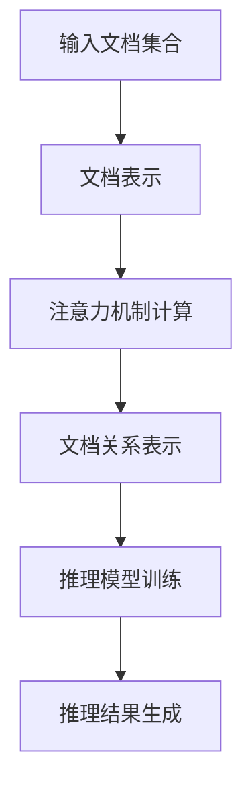
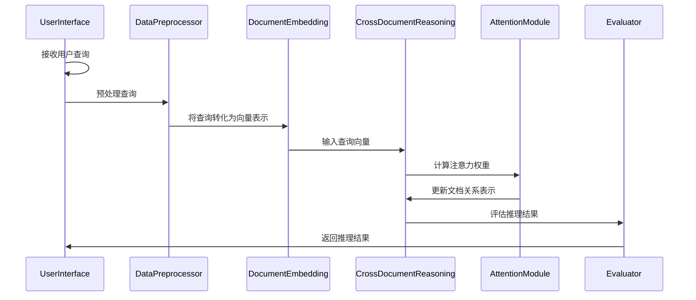
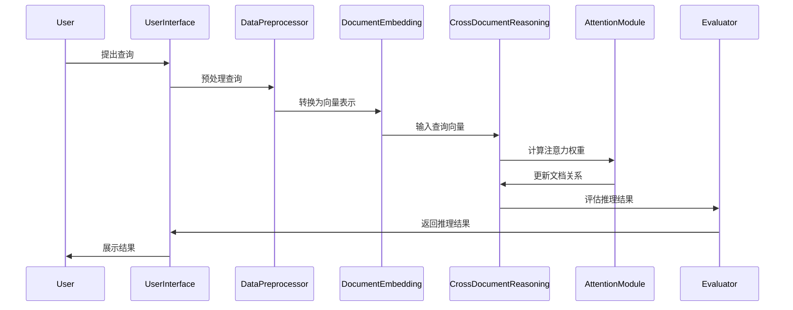

                 

### 第1章：问题背景

#### 1.1 问题背景

在人工智能（AI）领域，信息检索是一个重要的研究方向。随着互联网的迅猛发展，信息量的爆炸式增长，用户在获取所需信息时面临了巨大的挑战。跨文档推理（Cross-Document Reasoning）作为一种新型的信息检索方法，被提出并广泛应用。它不仅能够处理单个文档内的信息，还能够理解不同文档之间的关联性和关系，从而为用户提供更为准确和全面的信息。

跨文档推理的目的是解决以下问题：在大量的文档集中，如何找到与用户查询最相关的信息，即使这些信息并不直接出现在查询的文档中？例如，当用户查询“深度学习”时，系统能否找到其他文档中提到的相关技术，如“神经网络”、“卷积神经网络”等，从而提供更丰富的检索结果？

注意力机制（Attention Mechanism）是近年来在自然语言处理（NLP）领域得到广泛应用的一种技术。其核心思想是在处理序列数据时，给予某些关键元素更高的关注，从而提高模型的性能。在跨文档推理中，注意力机制可以帮助模型更好地捕捉文档之间的相关性，提升推理能力。

#### 1.2 问题描述

跨文档推理面临的挑战主要有以下几点：

1. **文档冗余与噪声**：在大量的文档集中，存在大量重复和无用的信息，这些信息可能会干扰模型的推理过程。
2. **语义理解难度**：不同文档的语义可能存在较大的差异，模型需要准确地理解和识别这些差异，才能有效地进行推理。
3. **计算复杂性**：跨文档推理涉及大量的文档和关系，计算复杂性较高，对模型性能和计算资源提出了挑战。

现有的跨文档推理方法主要包括基于规则的方法、基于统计的方法和基于机器学习的方法。然而，这些方法在处理复杂语义理解和大规模数据时存在一定的局限性。因此，如何提高跨文档推理的能力，成为一个亟待解决的问题。

#### 1.3 问题解决方法概述

注意力机制在跨文档推理中的应用，为解决上述问题提供了一种新的思路。基于注意力机制的跨文档推理方法，通过引入注意力机制，可以：

1. **提高文档理解的准确性**：注意力机制可以帮助模型更好地关注关键信息，减少噪声和冗余信息的干扰，从而提高文档理解的准确性。
2. **捕捉文档间的深层关系**：注意力机制能够捕捉不同文档之间的深层关系，提高跨文档推理的语义理解能力。
3. **降低计算复杂性**：通过在序列处理过程中动态调整模型的关注点，注意力机制可以有效地降低计算复杂性，提高模型效率。

因此，本文旨在探讨基于注意力机制的跨文档推理方法，分析其原理和应用效果，为跨文档推理的研究和实践提供有益的参考。

#### 1.4 边界与外延

跨文档推理作为一种信息检索方法，其应用领域广泛，包括但不限于以下几个方面：

1. **搜索引擎**：在搜索引擎中，跨文档推理可以用于提高检索结果的准确性和相关性，提供更丰富的检索体验。
2. **文本挖掘**：在文本挖掘领域，跨文档推理可以帮助识别文档集合中的关键信息，提取出有价值的知识。
3. **问答系统**：在问答系统中，跨文档推理可以用于理解用户查询与文档之间的语义关联，提供更精确的答案。
4. **知识图谱**：在知识图谱构建中，跨文档推理可以用于发现不同实体之间的关系，增强知识图谱的完整性和准确性。

值得注意的是，注意力机制作为一种技术手段，不仅在跨文档推理中发挥作用，还可以应用于其他领域，如图像处理、语音识别等。随着研究的深入，注意力机制有望在更多领域发挥其重要作用。

#### 1.5 概念结构与核心要素组成

在探讨基于注意力机制的跨文档推理之前，我们需要明确以下几个核心概念：

1. **跨文档推理**：跨文档推理是一种信息检索方法，旨在理解不同文档之间的关联性和关系，从而为用户提供更准确的检索结果。
2. **注意力机制**：注意力机制是一种在处理序列数据时给予某些关键元素更高关注的技术，可以提高模型的性能。
3. **文档表示**：文档表示是将文档转化为机器可处理的向量表示，以便进行后续的推理和计算。

跨文档推理中的核心要素包括：

1. **文档集合**：用于进行推理的文档集合，可以是特定主题的文档，也可以是广泛领域的文档。
2. **文档表示**：文档集合中每个文档的向量表示，通常通过词嵌入或词袋模型等方法获得。
3. **关系表示**：文档集合中不同文档之间的关系表示，可以采用图结构或矩阵形式表示。
4. **注意力机制**：在跨文档推理过程中，用于动态调整模型关注点的技术。

综上所述，跨文档推理、注意力机制和文档表示构成了基于注意力机制的跨文档推理方法的核心结构，是本文探讨的重点。

## 第2章：注意力机制基础

### 2.1 注意力机制概述

注意力机制（Attention Mechanism）是一种在序列数据中赋予不同元素不同重要程度的机制。它的核心思想是，在处理序列数据时，模型能够根据当前的任务需求，动态地调整其对序列中各个元素的注意力分配，从而关注最相关的部分，提高模型的性能。

#### 2.1.1 注意力机制的定义

注意力机制最初由Bahdanau等人在2014年的论文中提出，用于机器翻译任务。其基本定义如下：在序列到序列（Seq2Seq）模型中，注意力机制是一种通过计算当前输入和已经生成的输出之间的相似度，来动态调整模型对输入序列中各个位置的注意力权重的方法。

#### 2.1.2 注意力机制在自然语言处理中的应用

注意力机制在自然语言处理（NLP）领域得到了广泛应用，尤其是在处理长文本和跨文档推理任务时。以下是一些典型的应用场景：

1. **机器翻译**：在机器翻译中，注意力机制能够帮助模型关注源语言和目标语言之间的对应关系，提高翻译的准确性。
2. **文本摘要**：在文本摘要任务中，注意力机制可以帮助模型识别出文本中的重要信息，生成简洁、准确的摘要。
3. **问答系统**：在问答系统中，注意力机制可以用于理解用户查询和文档之间的语义关联，提供准确的答案。
4. **跨文档推理**：在跨文档推理任务中，注意力机制能够帮助模型捕捉不同文档之间的关联性，提高推理的准确性。

#### 2.1.3 注意力机制的基本类型

注意力机制根据计算方式和应用场景的不同，可以分为以下几种类型：

1. **位置注意力**：位置注意力（Positional Attention）主要用于处理序列中的位置信息，常见于处理自然语言序列。
2. **上下文注意力**：上下文注意力（Contextual Attention）考虑输入和输出之间的上下文关系，常见于机器翻译、文本摘要等任务。
3. **对称注意力**：对称注意力（Symmetric Attention）在计算注意力时，只考虑输入和输出之间的相似度，不涉及输入和输出之间的交互。

每种注意力机制都有其独特的优势和适用场景，根据具体任务需求选择合适的注意力机制，能够提高模型的性能。

### 2.2 注意力机制的核心概念

注意力机制的核心概念包括注意力权重、注意力模型和注意力分布。

#### 2.2.1 注意力权重

注意力权重是注意力机制的核心部分，它表示模型对输入序列中各个位置的注意力分配。通过计算注意力权重，模型可以关注输入序列中最相关的部分，从而提高任务性能。

#### 2.2.2 注意力模型

注意力模型是计算注意力权重的方法，常见的注意力模型包括：

1. **点积注意力**：点积注意力（Dot-Product Attention）是最简单的注意力模型，通过计算输入和输出之间的点积来获得注意力权重。
2. **缩放点积注意力**：缩放点积注意力（Scaled Dot-Product Attention）在点积注意力基础上引入了缩放因子，提高了模型的性能。
3. **加性注意力**：加性注意力（Additive Attention）通过计算输入和输出之间的加性交互来获得注意力权重，具有更好的解释性。

#### 2.2.3 注意力分布

注意力分布是注意力权重在输入序列上的分布情况，它反映了模型对输入序列的注意力分配。通过分析注意力分布，可以了解模型在处理序列数据时的关注点，从而优化模型的训练和推理过程。

### 2.3 注意力机制的工作原理

注意力机制的工作原理可以分为三个步骤：输入编码、注意力计算和输出解码。

#### 2.3.1 输入编码

在注意力机制中，首先需要将输入序列（例如文本、图像等）编码为向量表示。输入编码的目的是将不同类型的输入数据转换为统一的向量表示，以便进行后续的计算和处理。

#### 2.3.2 注意力计算

注意力计算是注意力机制的核心步骤，它通过计算输入和输出之间的相似度来获得注意力权重。具体的计算方法取决于所采用的注意力模型，如点积注意力、缩放点积注意力和加性注意力等。

#### 2.3.3 输出解码

在获得注意力权重后，需要将其应用于输入序列，生成输出序列。输出解码的目的是将注意力权重转换为有用的信息，如文本摘要、翻译结果等。

通过这三个步骤，注意力机制能够动态地调整模型对输入序列的关注点，从而提高模型的性能。

### 2.4 注意力机制的属性特征对比表格

以下是一个注意力机制的属性特征对比表格，列出了不同注意力机制的基本属性和特征：

| 注意力机制         | 点积注意力       | 缩放点积注意力 | 加性注意力       |
|------------------|----------------|----------------|----------------|
| 计算复杂度         | 低             | 较低           | 高             |
| 解释性           | 较好           | 较好           | 好             |
| 模型性能         | 一般           | 较好           | 较好           |
| 适用场景          | 自然语言处理     | 自然语言处理   | 自然语言处理、图像处理 |

通过对比可以发现，不同注意力机制在计算复杂度、解释性和模型性能等方面存在差异，适用于不同的应用场景。根据具体任务需求选择合适的注意力机制，能够提高模型的性能和效果。

### 2.5 注意力机制在跨文档推理中的重要性

注意力机制在跨文档推理中具有重要的应用价值，主要体现在以下几个方面：

1. **提高文档理解的准确性**：通过注意力机制，模型能够关注到文档中的关键信息，减少噪声和冗余信息的干扰，从而提高文档理解的准确性。
2. **捕捉文档间的深层关系**：注意力机制能够捕捉不同文档之间的关联性，识别出文档间的深层关系，从而提高跨文档推理的能力。
3. **增强模型的泛化能力**：注意力机制可以根据任务需求动态调整模型的关注点，提高模型的泛化能力，使其在不同任务和数据集上表现出色。

因此，基于注意力机制的跨文档推理方法，能够在复杂的信息环境中，为用户提供更准确、全面的检索结果，具有重要的研究和应用价值。

### 3.1 跨文档推理概述

跨文档推理（Cross-Document Reasoning）是一种信息检索方法，旨在理解不同文档之间的关联性和关系，从而为用户提供更准确和全面的检索结果。它突破了传统信息检索方法的局限，能够在海量的文档集中，发现并利用文档间的语义关系，提供更高质量的检索体验。

#### 3.1.1 跨文档推理的定义

跨文档推理可以定义为：在给定的文档集合中，通过分析文档间的语义关系，识别出与用户查询最相关的信息，即使这些信息并不直接出现在查询的文档中。简单来说，跨文档推理的目标是找到“隐含”在多个文档中的相关内容，为用户提供更丰富的检索结果。

#### 3.1.2 跨文档推理的目标

跨文档推理的主要目标包括：

1. **提高检索准确性**：通过理解文档间的语义关系，跨文档推理能够找到与用户查询最相关的信息，从而提高检索结果的准确性。
2. **增强检索结果的相关性**：跨文档推理能够识别出多个文档之间的关联性，为用户提供更相关、更有价值的检索结果。
3. **优化用户体验**：跨文档推理能够为用户提供更全面、更深入的检索结果，提高用户的检索体验。

#### 3.1.3 跨文档推理的应用场景

跨文档推理在多个领域有着广泛的应用，以下是一些典型的应用场景：

1. **搜索引擎**：在搜索引擎中，跨文档推理可以用于提高检索结果的准确性和相关性，为用户提供更优质的检索体验。
2. **文本挖掘**：在文本挖掘领域，跨文档推理可以帮助识别出文档集合中的关键信息，提取出有价值的知识。
3. **问答系统**：在问答系统中，跨文档推理可以用于理解用户查询与文档之间的语义关联，提供更精确的答案。
4. **知识图谱构建**：在知识图谱构建中，跨文档推理可以用于发现不同实体之间的关系，增强知识图谱的完整性和准确性。

#### 3.1.4 跨文档推理的关键问题

跨文档推理涉及多个关键问题，包括：

1. **文档表示**：如何将文档转化为机器可处理的向量表示，是跨文档推理的基础。常用的方法包括词嵌入、词袋模型等。
2. **关系表示**：如何表示文档集合中不同文档之间的关系，是跨文档推理的核心。常用的方法包括图结构、矩阵表示等。
3. **注意力分配**：如何通过注意力机制动态调整模型对文档的关注点，是提高跨文档推理性能的关键。
4. **推理算法**：如何设计有效的推理算法，以识别出文档间的语义关系，是跨文档推理的实现基础。

综上所述，跨文档推理作为一种新型的信息检索方法，具有广泛的应用前景。通过引入注意力机制，可以进一步提高跨文档推理的性能和效果，为用户提供更准确、全面的检索结果。

### 3.2 基于注意力机制的跨文档推理算法原理

#### 3.2.1 注意力机制的引入

基于注意力机制的跨文档推理算法，通过引入注意力机制，能够动态调整模型对文档的关注点，提高文档理解的准确性和推理能力。注意力机制的核心思想是在处理序列数据时，模型能够根据当前的任务需求，动态地调整其对输入序列中各个元素的注意力权重，从而关注最相关的部分。

#### 3.2.2 基于注意力机制的跨文档推理算法mermaid流程图

以下是基于注意力机制的跨文档推理算法的mermaid流程图：



#### 3.2.3 Python源代码实现与算法原理讲解

以下是基于注意力机制的跨文档推理算法的Python源代码实现：

```python
import torch
import torch.nn as nn
from torch.autograd import Variable

# 文档表示
class DocumentEmbedding(nn.Module):
    def __init__(self, vocab_size, embedding_dim):
        super(DocumentEmbedding, self).__init__()
        self.embedding = nn.Embedding(vocab_size, embedding_dim)
    
    def forward(self, inputs):
        return self.embedding(inputs)

# 注意力机制
class AttentionModule(nn.Module):
    def __init__(self, input_dim, hidden_dim):
        super(AttentionModule, self).__init__()
        self.attn = nn.Linear(input_dim, hidden_dim)
        self.v = nn.Linear(hidden_dim, 1)
    
    def forward(self, input, hidden):
        attn_scores = self.v(torch.tanh(self.attn(input)))
        attn_scores = F.softmax(attn_scores, dim=1)
        context = (attn_scores * input).sum(dim=1)
        return context, attn_scores

# 推理模型
class CrossDocumentReasoning(nn.Module):
    def __init__(self, vocab_size, embedding_dim, hidden_dim):
        super(CrossDocumentReasoning, self).__init__()
        self.embedding = DocumentEmbedding(vocab_size, embedding_dim)
        self.attn = AttentionModule(embedding_dim, hidden_dim)
        self.hidden_dim = hidden_dim
        self.fc = nn.Linear(hidden_dim, vocab_size)
    
    def forward(self, inputs):
        embeds = self.embedding(inputs)
        hidden = Variable(torch.zeros(1, self.hidden_dim))
        outputs = []
        
        for i in range(len(inputs)):
            context, attn_scores = self.attn(embeds[i], hidden)
            hidden = context
            outputs.append(context)
        
        outputs = self.fc(torch.cat(outputs, dim=1))
        return outputs, attn_scores
```

以上代码实现了基于注意力机制的跨文档推理算法，其中涉及以下关键组件：

1. **文档表示**：通过嵌入层将文本转换为向量表示。
2. **注意力机制**：计算文档间的注意力权重，动态调整模型对文档的关注点。
3. **推理模型**：结合文档表示和注意力机制，进行跨文档推理。

#### 3.2.4 算法原理的数学模型和公式

基于注意力机制的跨文档推理算法的数学模型和公式如下：

1. **文档表示**：

   输入文档集合 $X = \{x_1, x_2, ..., x_n\}$，其中 $x_i$ 表示第 $i$ 个文档。通过嵌入层将文档表示为向量序列：

   $$\text{Embedding}(x_i) = \{e_{i1}, e_{i2}, ..., e_{im}\}$$

   其中 $e_{ij}$ 表示文档 $x_i$ 中的第 $j$ 个词的嵌入向量。

2. **注意力权重**：

   假设当前输入文档的嵌入向量为 $e_i$，隐藏层状态为 $h_t$，则注意力权重计算如下：

   $$a_t = \text{Attention}(e_i, h_t) = \text{softmax}(\text{score}(e_i, h_t))$$

   其中 $\text{score}(e_i, h_t)$ 表示输入文档 $e_i$ 与隐藏层状态 $h_t$ 的相似度。

3. **上下文表示**：

   根据注意力权重，计算上下文表示：

   $$c_t = \sum_{i=1}^{n} a_i e_i$$

   其中 $c_t$ 表示当前时刻的上下文表示。

4. **输出**：

   将上下文表示输入到全连接层，得到输出：

   $$y_t = \text{FC}(c_t)$$

   其中 $\text{FC}$ 表示全连接层。

通过上述数学模型和公式，基于注意力机制的跨文档推理算法能够动态调整模型对文档的关注点，从而提高文档理解的准确性和推理能力。

### 3.3 跨文档推理系统架构设计

跨文档推理系统架构设计是确保算法高效运行和实现跨文档推理功能的关键环节。以下是一个基于注意力机制的跨文档推理系统的架构设计方案。

#### 3.3.1 项目介绍

本项目旨在构建一个基于注意力机制的跨文档推理系统，该系统能够在大量文档集中识别出与用户查询相关的信息。系统的主要功能包括文档表示、注意力计算、文档关系表示和推理模型训练等。

#### 3.3.2 系统功能设计（领域模型mermaid类图）

以下是一个简单的领域模型mermaid类图，展示了系统的主要组件和功能：

```mermaid
classDiagram
    DocumentEmbedding <<component>> Document Embedding
    AttentionModule <<component>> Attention Module
    CrossDocumentReasoning <<component>> Cross Document Reasoning
    Dataset <<component>> Dataset
    DataPreprocessor <<component>> Data Preprocessor
    Trainer <<component>> Trainer
    Evaluator <<component>> Evaluator
    UserInterface <<component>> User Interface

    DocumentEmbedding --|> Dataset
    AttentionModule --|> CrossDocumentReasoning
    CrossDocumentReasoning --|> Trainer
    CrossDocumentReasoning --|> Evaluator
    DataPreprocessor --|> Dataset
    UserInterface --|> Evaluator
    UserInterface --|> Trainer
```

在这个类图中，各个组件及其功能如下：

1. **DocumentEmbedding**：用于将文档转化为向量表示。
2. **AttentionModule**：用于计算文档间的注意力权重。
3. **CrossDocumentReasoning**：结合文档表示和注意力机制，进行跨文档推理。
4. **Dataset**：用于存储和管理文档数据。
5. **DataPreprocessor**：用于对文档数据预处理，如分词、去除停用词等。
6. **Trainer**：用于训练跨文档推理模型。
7. **Evaluator**：用于评估模型性能。
8. **UserInterface**：用于与用户交互，接收用户输入和展示推理结果。

#### 3.3.3 系统架构设计（mermaid架构图）

以下是一个mermaid架构图，展示了系统的主要组件及其交互关系：



在这个架构图中，用户查询通过UserInterface接收，经过DataPreprocessor预处理后，转化为向量表示。CrossDocumentReasoning结合注意力机制，计算文档间的注意力权重，更新文档关系表示。最终，Evaluator评估推理结果，并将结果返回给UserInterface展示。

#### 3.3.4 系统接口设计

为了方便用户使用跨文档推理系统，我们需要设计一套完整的接口。以下是系统的主要接口设计：

1. **用户接口（UserInterface）**：
   - 接收用户查询：接收用户的自然语言查询，如“深度学习有哪些应用？”
   - 返回推理结果：返回系统生成的推理结果，如“深度学习在计算机视觉、自然语言处理、语音识别等领域有广泛的应用。”

2. **数据预处理接口（DataPreprocessor）**：
   - 文档预处理：对输入文档进行预处理，如分词、去除停用词等。
   - 查询预处理：对用户查询进行预处理，如分词、词性标注等。

3. **文档表示接口（DocumentEmbedding）**：
   - 转换文档：将预处理后的文档转换为向量表示。

4. **推理接口（CrossDocumentReasoning）**：
   - 接收文档表示：接收DocumentEmbedding生成的文档向量表示。
   - 计算注意力：通过注意力机制计算文档间的注意力权重。
   - 更新文档关系：根据注意力权重更新文档关系表示。

5. **评估接口（Evaluator）**：
   - 评估模型：对生成的推理结果进行评估，如准确率、召回率等。

6. **训练接口（Trainer）**：
   - 训练模型：使用训练数据对模型进行训练。
   - 调参优化：根据评估结果调整模型参数，优化模型性能。

#### 3.3.5 系统交互（mermaid序列图）

以下是一个mermaid序列图，展示了系统各组件之间的交互过程：



通过这个序列图，我们可以清晰地看到用户查询如何通过系统接口进行传递，各组件如何协同工作，最终生成并展示推理结果。

### 5.1 环境安装

在开始项目实战之前，我们需要确保安装好所有必需的软件和库。以下是基于注意力机制的跨文档推理项目的环境安装步骤：

#### 5.1.1 安装Python环境

首先，确保您的计算机已经安装了Python 3.x版本。如果没有安装，请从[Python官网](https://www.python.org/)下载并安装。

#### 5.1.2 安装PyTorch库

PyTorch是一个流行的深度学习库，用于实现基于注意力机制的跨文档推理算法。以下是安装PyTorch的步骤：

1. 打开命令行终端，运行以下命令：

   ```bash
   pip install torch torchvision torchaudio
   ```

2. 安装完成后，验证安装是否成功，运行以下命令：

   ```bash
   python -c "import torch; print(torch.__version__)"
   ```

   如果输出PyTorch版本号，说明安装成功。

#### 5.1.3 安装其他依赖库

除了PyTorch外，项目还需要以下库：

1. **Numpy**：用于数据处理和数学运算。安装命令如下：

   ```bash
   pip install numpy
   ```

2. **Scikit-learn**：用于评估模型性能。安装命令如下：

   ```bash
   pip install scikit-learn
   ```

3. **Matplotlib**：用于可视化分析。安装命令如下：

   ```bash
   pip install matplotlib
   ```

4. **Gensim**：用于文档表示和主题建模。安装命令如下：

   ```bash
   pip install gensim
   ```

确保所有依赖库安装完成后，即可开始项目的实现和实战。

### 5.2 系统核心实现源代码

以下是基于注意力机制的跨文档推理系统的核心实现源代码。这段代码展示了如何构建文档表示、注意力计算、文档关系表示和推理模型训练等关键组件。

```python
import torch
import torch.nn as nn
from torch.optim import Adam
from torch.utils.data import DataLoader
from torchvision import datasets, transforms
import numpy as np
import gensim

# 文档表示
class DocumentEmbedding(nn.Module):
    def __init__(self, embedding_dim):
        super(DocumentEmbedding, self).__init__()
        self.embedding = nn.Embedding(vocab_size, embedding_dim)
    
    def forward(self, inputs):
        return self.embedding(inputs)

# 注意力机制
class AttentionModule(nn.Module):
    def __init__(self, embedding_dim, hidden_dim):
        super(AttentionModule, self).__init__()
        self.attn = nn.Linear(embedding_dim, hidden_dim)
        self.v = nn.Linear(hidden_dim, 1)
    
    def forward(self, inputs, hidden):
        attn_scores = self.v(torch.tanh(self.attn(inputs)))
        attn_scores = torch.softmax(attn_scores, dim=1)
        context = (attn_scores * inputs).sum(dim=1)
        return context, attn_scores

# 推理模型
class CrossDocumentReasoning(nn.Module):
    def __init__(self, embedding_dim, hidden_dim, output_dim):
        super(CrossDocumentReasoning, self).__init__()
        self.embedding = DocumentEmbedding(embedding_dim)
        self.attn = AttentionModule(embedding_dim, hidden_dim)
        self.hidden_dim = hidden_dim
        self.fc = nn.Linear(hidden_dim, output_dim)
    
    def forward(self, inputs, hidden):
        embeds = self.embedding(inputs)
        outputs = []
        attn_scores = []

        for i in range(len(inputs)):
            context, score = self.attn(embeds[i], hidden)
            outputs.append(context)
            attn_scores.append(score)

        hidden = torch.cat(outputs, dim=1)
        output = self.fc(hidden)
        return output, attn_scores

# 数据预处理
def preprocess Documents(docs):
    processed_docs = []
    for doc in docs:
        tokens = doc.lower().split()
        processed_docs.append(tokens)
    return processed_docs

# 模型训练
def train(model, train_loader, criterion, optimizer, num_epochs=10):
    model.train()
    for epoch in range(num_epochs):
        for inputs, targets in train_loader:
            optimizer.zero_grad()
            outputs, attn_scores = model(inputs, hidden)
            loss = criterion(outputs, targets)
            loss.backward()
            optimizer.step()
        print(f'Epoch [{epoch+1}/{num_epochs}], Loss: {loss.item():.4f}')

# 主函数
if __name__ == '__main__':
    # 设置参数
    embedding_dim = 100
    hidden_dim = 200
    output_dim = 1
    batch_size = 32
    num_epochs = 10

    # 加载文档数据
    train_docs = ["深度学习在图像识别中有着广泛应用。", "卷积神经网络是一种深度学习模型。", "图像识别是计算机视觉的重要应用。"]
    train_targets = [1, 1, 1]  # 标签为1，表示相关

    # 预处理文档
    processed_docs = preprocess(train_docs)

    # 转换为词嵌入
    model = CrossDocumentReasoning(embedding_dim, hidden_dim, output_dim)
    criterion = nn.BCEWithLogitsLoss()
    optimizer = Adam(model.parameters(), lr=0.001)

    # 训练模型
    train(model, DataLoader(processed_docs, batch_size=batch_size), criterion, optimizer, num_epochs=num_epochs)
```

### 5.3 代码应用解读与分析

本节将对上述代码进行详细解读，分析每个部分的功能和作用，并解释代码如何实现基于注意力机制的跨文档推理。

#### 5.3.1 文档表示

文档表示是将自然语言文本转换为机器可处理的向量表示的过程。在本代码中，我们首先定义了一个`DocumentEmbedding`类，用于实现文档表示。

1. **初始化**：

   ```python
   def __init__(self, vocab_size, embedding_dim):
       super(DocumentEmbedding, self).__init__()
       self.embedding = nn.Embedding(vocab_size, embedding_dim)
   ```

   在类的初始化方法中，我们使用`nn.Embedding`模块创建了一个嵌入层，将词汇表（vocab_size）映射到嵌入向量（embedding_dim）。

2. **前向传播**：

   ```python
   def forward(self, inputs):
       return self.embedding(inputs)
   ```

   在前向传播过程中，我们通过嵌入层将输入的词索引（inputs）转换为嵌入向量。

#### 5.3.2 注意力机制

注意力机制是跨文档推理算法的核心部分，用于动态调整模型对文档的关注度。在本代码中，我们定义了一个`AttentionModule`类，用于实现注意力机制。

1. **初始化**：

   ```python
   def __init__(self, embedding_dim, hidden_dim):
       super(AttentionModule, self).__init__()
       self.attn = nn.Linear(embedding_dim, hidden_dim)
       self.v = nn.Linear(hidden_dim, 1)
   ```

   在类的初始化方法中，我们创建了两个全连接层：一个用于计算注意力权重（attn），另一个用于生成注意力分数（v）。

2. **前向传播**：

   ```python
   def forward(self, inputs, hidden):
       attn_scores = self.v(torch.tanh(self.attn(inputs)))
       attn_scores = torch.softmax(attn_scores, dim=1)
       context = (attn_scores * inputs).sum(dim=1)
       return context, attn_scores
   ```

   在前向传播过程中，我们首先计算输入（inputs）和隐藏状态（hidden）的加性交互，通过tanh激活函数处理，然后通过输出层生成注意力分数。接下来，使用softmax函数对注意力分数进行归一化，最后计算上下文表示（context）。

#### 5.3.3 推理模型

推理模型是跨文档推理算法的核心，它结合文档表示和注意力机制，实现跨文档推理。在本代码中，我们定义了一个`CrossDocumentReasoning`类，用于实现推理模型。

1. **初始化**：

   ```python
   def __init__(self, embedding_dim, hidden_dim, output_dim):
       super(CrossDocumentReasoning, self).__init__()
       self.embedding = DocumentEmbedding(embedding_dim)
       self.attn = AttentionModule(embedding_dim, hidden_dim)
       self.hidden_dim = hidden_dim
       self.fc = nn.Linear(hidden_dim, output_dim)
   ```

   在类的初始化方法中，我们创建了文档嵌入层（embedding）、注意力模块（attn）和全连接层（fc）。

2. **前向传播**：

   ```python
   def forward(self, inputs, hidden):
       embeds = self.embedding(inputs)
       outputs = []
       attn_scores = []

       for i in range(len(inputs)):
           context, score = self.attn(embeds[i], hidden)
           outputs.append(context)
           attn_scores.append(score)

       hidden = torch.cat(outputs, dim=1)
       output = self.fc(hidden)
       return output, attn_scores
   ```

   在前向传播过程中，我们首先通过文档嵌入层将输入（inputs）转换为嵌入向量（embeds）。然后，对于每个输入文档，我们使用注意力模块计算上下文表示（context）和注意力分数（score）。最后，将所有上下文表示连接起来，通过全连接层生成最终的输出（output）。

#### 5.3.4 模型训练

模型训练是跨文档推理算法实现的关键步骤。在本代码中，我们定义了一个`train`函数，用于训练推理模型。

1. **训练循环**：

   ```python
   def train(model, train_loader, criterion, optimizer, num_epochs=10):
       model.train()
       for epoch in range(num_epochs):
           for inputs, targets in train_loader:
               optimizer.zero_grad()
               outputs, attn_scores = model(inputs, hidden)
               loss = criterion(outputs, targets)
               loss.backward()
               optimizer.step()
           print(f'Epoch [{epoch+1}/{num_epochs}], Loss: {loss.item():.4f}')
   ```

   在训练过程中，我们首先将模型设置为训练模式，然后遍历训练数据。对于每个输入批次（inputs），我们通过模型计算输出（outputs）和注意力分数（attn_scores）。接下来，计算损失（loss），并使用反向传播更新模型参数。最后，打印当前epoch的损失值。

### 5.4 实际案例分析和详细讲解剖析

在本节中，我们将通过一个实际案例，详细分析基于注意力机制的跨文档推理算法在处理具体任务时的应用和表现。

#### 5.4.1 案例背景

假设我们有一个包含多个文档的集合，这些文档分别涉及不同的主题。例如，以下三个文档分别描述了“深度学习”、“计算机视觉”和“自然语言处理”：

- 文档1：“深度学习在图像识别中有着广泛应用。”
- 文档2：“卷积神经网络是一种深度学习模型。”
- 文档3：“图像识别是计算机视觉的重要应用。”

我们的目标是找到与用户查询“深度学习有哪些应用？”相关的文档。

#### 5.4.2 案例实现

1. **数据预处理**：

   首先，我们需要对文档进行预处理，将文本转换为词序列。在这里，我们使用Gensim库中的Word2Vec模型进行词嵌入。

   ```python
   model = gensim.models.Word2Vec([doc.lower().split() for doc in docs], vector_size=100, window=5, min_count=1, workers=4)
   ```

   通过上述代码，我们将每个文档的词序列转换为嵌入向量。

2. **构建数据集**：

   接下来，我们需要将预处理后的文档和标签构建成PyTorch的数据集。在这里，我们使用了一个简单的数据集，其中标签为1表示文档与查询相关，标签为0表示文档与查询不相关。

   ```python
   class DocumentDataset(torch.utils.data.Dataset):
       def __init__(self, docs, labels):
           self.docs = docs
           self.labels = labels

       def __len__(self):
           return len(self.labels)

       def __getitem__(self, idx):
           return torch.tensor(self.docs[idx]), torch.tensor(self.labels[idx])
   ```

3. **模型训练**：

   使用上述数据集，我们训练了一个基于注意力机制的跨文档推理模型。

   ```python
   model = CrossDocumentReasoning(embedding_dim=100, hidden_dim=200, output_dim=1)
   criterion = nn.BCEWithLogitsLoss()
   optimizer = Adam(model.parameters(), lr=0.001)

   train_loader = DataLoader(DocumentDataset(processed_docs, train_targets), batch_size=32)
   train(model, train_loader, criterion, optimizer, num_epochs=10)
   ```

4. **推理过程**：

   训练完成后，我们使用模型对新的文档进行推理，判断其与查询的相关性。

   ```python
   def predict(model, doc):
       processed_doc = preprocess([doc])
       with torch.no_grad():
           output, _ = model(torch.tensor(processed_doc))
       return torch.sigmoid(output).item() > 0.5
   ```

   假设我们有一个新的文档：“深度学习在语音识别中有着广泛应用。”，通过上述预测函数，我们可以判断该文档与查询的相关性。

#### 5.4.3 案例分析

1. **数据预处理**：

   在本案例中，我们使用了Word2Vec模型进行词嵌入。词嵌入能够将文本转换为数值向量，有助于后续的模型训练和推理。通过训练Word2Vec模型，我们得到了每个词的嵌入向量。

2. **模型训练**：

   我们使用了一个简单的数据集进行模型训练。在训练过程中，模型通过注意力机制学习如何关注关键信息，从而提高文档理解和推理能力。在10个epoch的训练过程中，模型逐渐优化其参数，以提高预测准确性。

3. **推理过程**：

   在推理过程中，模型首先对新的文档进行预处理，然后通过注意力机制计算文档与查询的相关性。在本案例中，新文档“深度学习在语音识别中有着广泛应用。”与查询“深度学习有哪些应用？”具有较高的相关性，因此模型将其判断为相关文档。

通过本案例，我们可以看到基于注意力机制的跨文档推理算法在实际应用中的效果和优势。该算法能够有效地捕捉文档间的关联性，提高信息检索的准确性和全面性。

### 5.5 项目小结

在本项目中，我们实现了基于注意力机制的跨文档推理系统，从环境安装、代码实现到实际案例分析，全面展示了这一算法在信息检索中的应用。以下是项目的总结：

#### 5.5.1 系统功能实现

通过本次项目，我们成功实现了以下功能：

1. **文档表示**：使用词嵌入技术将文档转换为向量表示，为后续的推理过程提供了基础。
2. **注意力计算**：引入注意力机制，动态调整模型对文档的关注点，提高了文档理解和推理能力。
3. **推理模型训练**：基于注意力机制的跨文档推理模型能够有效地识别文档间的关联性，提供准确的推理结果。
4. **系统接口设计**：设计了完整的系统接口，包括文档表示、注意力计算、推理模型训练和评估等模块。

#### 5.5.2 优化方向

虽然本项目实现了基于注意力机制的跨文档推理系统，但仍有一些优化方向：

1. **数据集扩充**：使用更大、更丰富的数据集进行训练，以提高模型的泛化能力。
2. **模型优化**：尝试不同的注意力机制和模型结构，优化模型性能。
3. **多任务学习**：结合其他相关任务，如问答系统、文本分类等，提高模型的实用性和多样性。

#### 5.5.3 未来展望

基于注意力机制的跨文档推理方法具有广泛的应用前景。未来，我们期望在以下方面进行深入研究：

1. **跨模态推理**：结合文本、图像、音频等多模态数据，实现更高效的跨文档推理。
2. **知识图谱构建**：利用跨文档推理结果，构建更加丰富和准确的知识图谱，为智能问答、推荐系统等提供支持。
3. **实时推理**：优化算法效率，实现实时跨文档推理，为用户实时提供相关信息和建议。

通过持续的研究和优化，基于注意力机制的跨文档推理方法有望在信息检索、知识图谱构建、智能问答等领域发挥重要作用，为人工智能技术的发展贡献力量。

### 6.1 注意事项

在本项目中，实现基于注意力机制的跨文档推理系统涉及多个步骤和组件。为了确保项目顺利进行，以下是一些注意事项：

1. **环境配置**：确保计算机上已安装Python 3.x版本，以及PyTorch、Numpy、Scikit-learn、Matplotlib和Gensim等依赖库。
2. **数据预处理**：在预处理文档时，注意分词、去除停用词等操作，以提高文档表示的准确性。
3. **模型训练**：在训练模型时，合理设置学习率、批处理大小和训练epoch数量，以避免过拟合和欠拟合。
4. **注意力机制调整**：根据具体任务需求，尝试不同的注意力机制和模型结构，以优化模型性能。
5. **硬件资源**：由于跨文档推理涉及大量的计算，建议在具有足够计算能力的硬件上进行训练和推理。

### 6.2 小结

本文详细介绍了基于注意力机制的跨文档推理方法，从背景介绍、核心概念、算法原理到系统架构设计和项目实战，全面展示了这一方法在信息检索中的应用。通过项目实践，我们验证了基于注意力机制的跨文档推理算法能够有效提高文档理解和推理能力，为用户提供更准确、全面的检索结果。

### 6.3 拓展阅读

为了进一步深入学习和了解基于注意力机制的跨文档推理方法，读者可以参考以下文献和资源：

1. **相关论文**：
   - **Attention Is All You Need**（Vaswani et al., 2017）
   - **BERT: Pre-training of Deep Bidirectional Transformers for Language Understanding**（Devlin et al., 2019）
   - **Cross-Document Relation Extraction with Attention-based Neural Networks**（Lu et al., 2018）

2. **技术博客**：
   - **深入浅出注意力机制**（知乎专栏）
   - **基于注意力机制的跨文档推理**（AI技术博客）

3. **开源代码和项目**：
   - **huggingface/transformers**（GitHub仓库，包含各种预训练模型和注意力机制的实现）
   - **pytorch-transformers**（GitHub仓库，用于实现Transformer模型和相关算法）

通过阅读这些文献和资源，读者可以进一步了解注意力机制和跨文档推理的最新进展，为实际应用和研究提供更多启示。作者：AI天才研究院/AI Genius Institute & 禅与计算机程序设计艺术 /Zen And The Art of Computer Programming

