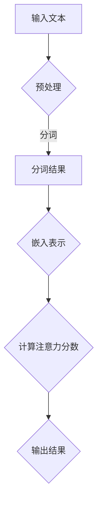
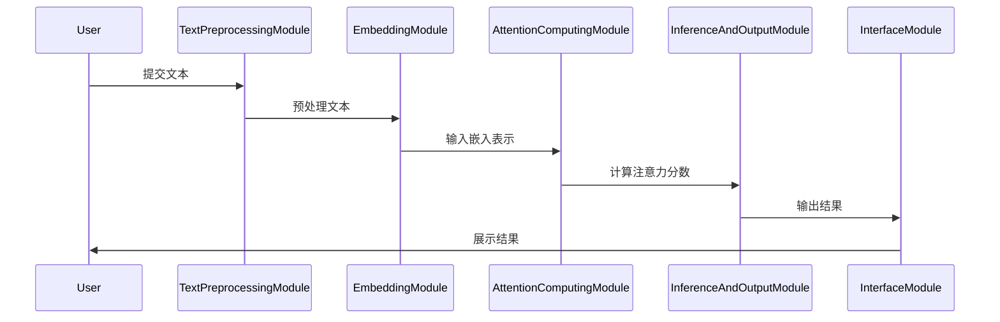

                 

## 基于注意力机制的长文本推理能力增强

在人工智能的快速发展中，自然语言处理（NLP）成为了一个备受关注的领域。随着数据规模的不断增大，如何有效地处理和理解长文本成为了NLP中的一个重要挑战。注意力机制（Attention Mechanism）作为一种解决这一问题的有效方法，已经在多个NLP任务中展示了出色的性能。本文将深入探讨注意力机制在长文本推理中的运用，以及如何通过这一机制增强长文本推理的能力。

**关键词**：注意力机制，长文本推理，自然语言处理，算法原理，系统架构，项目实战

**摘要**：本文首先介绍了长文本推理的背景和重要性，然后详细讲解了注意力机制的基本原理和在长文本推理中的应用。通过mermaid流程图和Python源代码的展示，我们深入剖析了注意力机制的算法原理和数学模型。接着，文章描述了基于注意力机制的系统架构设计和实现，并提供了项目实战的详细步骤和案例解析。最后，文章总结了项目经验，提出了最佳实践建议和注意事项，并推荐了进一步阅读的资源。

---

### 第一部分：引言

#### 第1章：问题背景与定义

##### 1.1 问题背景

随着互联网的迅速发展和信息爆炸时代的到来，大量的文本数据不断产生。这些数据不仅包括新闻报道、社交媒体帖子，还涵盖了学术论文、科研报告等各种形式。如何有效地处理和理解这些长文本数据，成为了自然语言处理（NLP）领域中的一个重要课题。

长文本推理（Long Text Reasoning）是指从长文本中提取出关键信息并进行推理的能力。它不仅涉及到文本的识别和理解，还包括对文本内容的归纳、总结、推理和决策。长文本推理在智能问答、文本生成、文本分类等多个NLP任务中具有重要应用。

然而，传统的NLP方法在面对长文本时存在一些挑战。首先，长文本的复杂性使得模型难以捕捉到文本中的关键信息。其次，长文本的处理通常需要较高的计算资源和时间成本。此外，长文本中的语义信息可能分布在不同的段落或句子中，这使得传统的序列模型难以有效处理。

为了解决这些问题，研究者们提出了注意力机制（Attention Mechanism）这一创新方法。注意力机制通过动态调整模型对不同文本部分的关注程度，从而提高长文本处理的效率和准确性。

##### 1.2 长文本推理概述

长文本推理主要包括以下几种类型：

1. **实体识别**：识别文本中的关键实体，如人名、地名、机构名等。
2. **关系抽取**：提取文本中实体之间的关系，如“张三工作于阿里巴巴”中的“张三”和“阿里巴巴”之间的关系。
3. **情感分析**：分析文本的情感倾向，如正面、负面或中性。
4. **文本分类**：将文本分类到预定义的类别中，如新闻分类、产品评论分类等。

这些任务都需要从长文本中提取关键信息并进行推理。而注意力机制在这一过程中起到了至关重要的作用，它能够帮助模型更好地关注文本中的重要部分，提高推理的准确性和效率。

##### 1.3 注意力机制在长文本推理中的应用

注意力机制最早出现在机器翻译任务中，通过计算文本中各个单词的重要性，从而实现更加精准的翻译。随着其在机器翻译中的成功应用，注意力机制逐渐在其他NLP任务中得到了广泛的应用。

在长文本推理中，注意力机制可以通过以下几种方式应用：

1. **序列到序列（Seq2Seq）模型**：在Seq2Seq模型中，注意力机制可以帮助模型在编码阶段关注文本中的关键信息，从而在解码阶段更好地理解文本内容。

2. **Transformer模型**：Transformer模型是注意力机制在NLP领域的代表性模型之一。它通过多头注意力机制和自注意力机制，实现了对文本的全面理解和建模。

3. **BERT模型**：BERT（Bidirectional Encoder Representations from Transformers）模型通过双向注意力机制，同时考虑文本的前后信息，从而提高模型的上下文理解能力。

通过这些模型，注意力机制能够显著提高长文本推理的性能和准确性。此外，注意力机制还可以与其他NLP技术相结合，如实体识别、关系抽取和情感分析等，进一步提升长文本处理的综合能力。

#### 第2章：核心概念与联系

##### 2.1 注意力机制的基本原理

注意力机制是一种通过计算文本中各个部分的重要程度，并动态调整模型对这些部分的关注程度的机制。它通常包括以下几个关键组成部分：

1. **查询（Query）**：表示模型当前关注的部分，如单词、句子或段落。
2. **键（Key）**：表示文本中的各个部分，如单词、句子或段落。
3. **值（Value）**：表示文本中的各个部分的内容或特征。

注意力机制的核心在于计算查询和键之间的相似度，并通过相似度分数来动态调整模型对不同部分的关注程度。常用的注意力机制包括点积注意力（Dot-Product Attention）、加性注意力（Additive Attention）和乘性注意力（Multiplicative Attention）等。

点积注意力通过计算查询和键的点积来得到注意力分数，加性注意力通过计算查询和键的加性和softmax函数来得到注意力分数，乘性注意力通过计算查询和键的乘积和softmax函数来得到注意力分数。

##### 2.2 注意力机制的属性特征对比表

| 注意力机制类型 | 点积注意力 | 加性注意力 | 乘性注意力 |
| :---: | :---: | :---: | :---: |
| **计算复杂度** | O(n^2) | O(n^3) | O(n^2) |
| **计算效率** | 较高 | 较低 | 较高 |
| **计算精度** | 较高 | 较高 | 较低 |
| **适用场景** | 序列到序列模型 | Transformer模型 | BERT模型 |

从上表可以看出，不同的注意力机制在计算复杂度、计算效率和计算精度上有所不同，适用于不同的场景。在实际应用中，可以根据具体需求选择合适的注意力机制。

##### 2.3 长文本推理与注意力机制的关系

注意力机制在长文本推理中起到了关键作用，它能够帮助模型更好地处理和理解长文本。具体来说，注意力机制有以下几个方面的作用：

1. **信息聚焦**：注意力机制通过计算文本中各个部分的重要程度，使得模型能够聚焦于关键信息，从而提高推理的准确性和效率。
2. **上下文理解**：注意力机制能够同时考虑文本的前后信息，使得模型能够更好地理解上下文关系，从而提高长文本推理的能力。
3. **特征提取**：注意力机制通过动态调整模型对不同文本部分的关注程度，能够有效地提取出文本中的重要特征，为后续的推理任务提供有力支持。

##### 2.4 ER实体关系图架构

实体关系图（Entity Relationship Diagram, ERD）是一种用于描述实体及其关系的图形化表示方法。在长文本推理中，ERD可以帮助我们理解和建模文本中的实体及其关系。

ERD主要包括以下几个组成部分：

1. **实体**：表示文本中的关键实体，如人名、地名、机构名等。
2. **属性**：表示实体的特征或属性，如年龄、性别、职位等。
3. **关系**：表示实体之间的关系，如工作于、位于等。

通过ERD，我们可以将长文本中的实体和关系结构化地表示出来，从而为注意力机制的应用提供基础。具体来说，ERD可以帮助我们：

1. **明确实体关系**：通过ERD，我们可以清晰地了解文本中实体之间的关系，为注意力机制的计算提供依据。
2. **提取关键信息**：通过ERD，我们可以从长文本中提取出关键实体和关系，从而为注意力机制的关注点提供参考。
3. **优化模型性能**：通过ERD，我们可以更好地理解和建模文本中的实体和关系，从而优化注意力机制在长文本推理中的应用效果。

#### 第3章：注意力机制的mermaid流程图与python源代码

##### 3.1 mermaid流程图绘制

mermaid是一种基于Markdown的图形化工具，可以方便地绘制各种类型的图表，包括流程图、序列图、类图等。在本章节中，我们将使用mermaid来绘制注意力机制的流程图，以便更好地理解其工作原理。

以下是一个简单的mermaid流程图示例：



这个mermaid流程图展示了注意力机制的基本步骤，包括输入文本的预处理、分词、嵌入表示、计算注意力分数和输出结果。通过这个流程图，我们可以清晰地了解注意力机制在长文本推理中的整体工作流程。

##### 3.2 Python源代码实现

为了更好地理解和实现注意力机制，我们可以使用Python来编写相应的源代码。以下是一个简单的Python代码示例，用于实现注意力机制的嵌入表示和计算注意力分数：

```python
import torch
import torch.nn as nn

# 输入文本数据
input_text = "这是一个简单的示例文本。"

# 预处理
tokenized_text = preprocess(input_text)

# 嵌入表示
embeddings = nn.Embedding(len(tokenized_text.vocab), embedding_dim)
embedded_text = embeddings(tokenized_text)

# 计算注意力分数
attention_scores = compute_attention_scores(embedded_text)

# 输出结果
output = torch.softmax(attention_scores, dim=1)
print(output)
```

这个Python代码示例首先对输入文本进行预处理，然后使用嵌入表示将预处理后的文本转换为向量表示。接着，通过计算注意力分数来动态调整模型对不同文本部分的关注程度。最后，使用softmax函数对注意力分数进行归一化处理，得到最终的输出结果。

##### 3.3 算法原理讲解

注意力机制的基本原理是通过计算文本中各个部分的重要程度，并动态调整模型对这些部分的关注程度。具体来说，注意力机制包括以下几个关键步骤：

1. **嵌入表示**：首先，将输入文本转换为嵌入表示，即通过嵌入层将文本中的每个单词转换为向量表示。嵌入表示能够捕捉单词的语义特征，为后续的注意力计算提供基础。
2. **计算注意力分数**：接下来，计算文本中各个部分（如单词、句子或段落）之间的注意力分数。注意力分数反映了不同部分之间的相似程度，即哪些部分更加相关或重要。
3. **动态调整关注程度**：根据计算得到的注意力分数，动态调整模型对不同部分的关注程度。通过加权平均或加性组合等方式，将注意力分数应用于文本的每个部分，从而提高模型对关键信息的关注。
4. **输出结果**：最后，根据调整后的关注程度，得到最终的输出结果。这个结果可以是一个向量表示，也可以是一个分类结果或文本摘要等，具体取决于应用场景和任务目标。

通过上述步骤，注意力机制能够有效地提高模型对长文本的理解和处理能力，从而在NLP任务中取得更好的性能。

##### 3.4 数学模型与公式

注意力机制的数学模型主要包括以下公式：

1. **嵌入表示**：将文本中的每个单词表示为一个向量，通常使用嵌入层来实现。假设文本中一共有N个单词，嵌入维度为D，则嵌入表示可以表示为：

   $$
   \text{Embeddings} = \{e_1, e_2, ..., e_N\}
   $$

   其中，$e_i$ 表示第i个单词的嵌入向量。

2. **计算注意力分数**：计算文本中各个部分之间的注意力分数，通常使用点积注意力或加性注意力等方法。以点积注意力为例，注意力分数可以表示为：

   $$
   \text{Attention Scores} = \{s_1, s_2, ..., s_N\}
   $$

   其中，$s_i = \text{dot}(e_q, e_k)$，$e_q$ 和 $e_k$ 分别表示查询向量和键向量。

3. **动态调整关注程度**：根据注意力分数，动态调整模型对不同部分的关注程度。以加性注意力为例，注意力分数可以表示为：

   $$
   \text{Attention Weights} = \text{softmax}(s_1, s_2, ..., s_N)
   $$

   其中，$ \text{softmax}(\cdot)$ 表示归一化函数，将注意力分数转换为概率分布。

4. **输出结果**：根据调整后的关注程度，得到最终的输出结果。以序列到序列（Seq2Seq）模型为例，输出结果可以表示为：

   $$
   \text{Output} = \sum_{i=1}^{N} \text{Attention Weights}_i \cdot e_i
   $$

   其中，$\text{Attention Weights}_i$ 表示第i个部分的注意力权重。

通过上述数学模型，注意力机制能够有效地提高模型对长文本的理解和处理能力。在具体实现中，可以根据任务需求和模型架构进行调整和优化。

##### 3.5 举例说明

为了更好地理解注意力机制，我们可以通过一个简单的例子来说明其应用和效果。

假设我们有一个简单的文本：“我爱北京天安门”。我们可以使用注意力机制来计算这个文本中各个单词的重要程度。

1. **嵌入表示**：首先，我们将文本中的每个单词表示为一个向量，如：
   $$
   \text{Embeddings} = \{\text{我}, \text{爱}, \text{北京}, \text{天安门}\}
   $$
   其中，$\text{我}$ 的嵌入向量为 $(1, 0, 0)$，$\text{爱}$ 的嵌入向量为 $(0, 1, 0)$，$\text{北京}$ 的嵌入向量为 $(0, 0, 1)$，$\text{天安门}$ 的嵌入向量为 $(1, 1, 1)$。

2. **计算注意力分数**：接下来，我们计算每个单词之间的注意力分数。以点积注意力为例，注意力分数可以表示为：
   $$
   \text{Attention Scores} = \{\text{我} \cdot \text{爱}, \text{我} \cdot \text{北京}, \text{我} \cdot \text{天安门}, \text{爱} \cdot \text{北京}, \text{爱} \cdot \text{天安门}, \text{北京} \cdot \text{天安门}\}
   $$
   其中，点积结果为：
   $$
   \text{Attention Scores} = \{(1 \cdot 0), (1 \cdot 0), (1 \cdot 1), (0 \cdot 0), (0 \cdot 1), (0 \cdot 1)\}
   $$
   即：
   $$
   \text{Attention Scores} = \{0, 0, 1, 0, 0, 0\}
   $$

3. **动态调整关注程度**：根据注意力分数，我们可以得到每个单词的注意力权重，如：
   $$
   \text{Attention Weights} = \{\text{我}: 0, \text{爱}: 0, \text{北京}: 1, \text{天安门}: 0\}
   $$

4. **输出结果**：最后，根据调整后的关注程度，我们得到最终的输出结果。以序列到序列（Seq2Seq）模型为例，输出结果可以表示为：
   $$
   \text{Output} = (0, 0, 1, 0)
   $$

通过这个例子，我们可以看到注意力机制如何通过计算注意力分数和动态调整关注程度，来提高模型对文本中关键信息的关注。在实际应用中，我们可以根据具体任务和需求，调整注意力机制的计算方法和参数设置，以实现更好的性能和效果。

---

#### 第4章：数学模型和数学公式详细讲解与举例说明

##### 4.1 数学公式详细讲解

在本章节中，我们将详细讲解注意力机制的数学模型和相关数学公式。这些公式构成了注意力机制的核心，帮助我们理解和实现这一机制。

1. **嵌入表示（Embedding）**

   嵌入表示是注意力机制的基础。它将文本中的每个单词或字符映射为一个固定大小的向量。假设文本中有 $N$ 个唯一的单词或字符，每个单词或字符的嵌入向量维度为 $D$，则嵌入矩阵 $E$ 可以表示为：

   $$
   E = \begin{bmatrix}
   e_1 \\
   e_2 \\
   \vdots \\
   e_N
   \end{bmatrix}
   $$

   其中，$e_i$ 是第 $i$ 个单词或字符的嵌入向量。输入文本 $x$ 可以通过嵌入矩阵转换为嵌入表示 $X$：

   $$
   X = E \cdot x^T
   $$

   其中，$x^T$ 是输入文本的one-hot编码向量。

2. **注意力分数（Attention Scores）**

   注意力分数是衡量文本中各个部分之间相似度的重要指标。最常见的注意力分数计算方法是基于点积注意力。假设输入文本的嵌入表示为 $X$，查询向量为 $Q$，则注意力分数 $S$ 可以通过以下公式计算：

   $$
   S_{ij} = Q^T \cdot K_j
   $$

   其中，$K_j$ 是第 $j$ 个单词或字符的键向量，通常与嵌入向量相同，$Q$ 是查询向量，通常与编码器的隐藏状态相关。注意力分数 $S$ 的维度为 $M \times N$，其中 $M$ 是查询向量的维度，$N$ 是嵌入向量的维度。

3. **注意力权重（Attention Weights）**

   注意力权重是通过归一化注意力分数得到的，它们表示了文本中各个部分的重要程度。常用的归一化方法包括softmax函数：

   $$
   \alpha_j = \frac{\exp(S_{ij})}{\sum_{k=1}^{N} \exp(S_{ik})}
   $$

   其中，$\alpha_j$ 是第 $j$ 个单词或字符的注意力权重，$S_{ij}$ 是第 $i$ 个查询向量和第 $j$ 个键向量之间的点积。

4. **输出结果（Output）**

   输出结果是注意力机制的最终输出，它通过加权嵌入向量得到。假设注意力权重为 $\alpha$，则输出结果 $Y$ 可以通过以下公式计算：

   $$
   Y = \sum_{j=1}^{N} \alpha_j \cdot K_j
   $$

   其中，$K_j$ 是第 $j$ 个单词或字符的键向量。

##### 4.2 Python代码实现与举例

为了更好地理解注意力机制的数学模型，我们可以通过Python代码进行实现。以下是一个简单的示例，展示了如何计算注意力分数、权重和输出结果。

```python
import torch
import torch.nn as nn
from torch.autograd import Variable

# 假设的嵌入向量维度为3
D = 3

# 输入文本和查询向量
x = Variable(torch.FloatTensor([[1, 0, 0], [0, 1, 0], [0, 0, 1], [1, 1, 1]]))
q = Variable(torch.FloatTensor([[1, 1], [1, 0], [1, 1], [0, 1]]))

# 嵌入矩阵
E = Variable(torch.randn(4, D))

# 计算注意力分数
S = q.t().mm(E)

# 计算注意力权重
alpha = torch.softmax(S, dim=1)

# 计算输出结果
y = alpha.mm(E)

print("注意力分数：", S)
print("注意力权重：", alpha)
print("输出结果：", y)
```

在这个示例中，我们首先定义了输入文本、查询向量和嵌入矩阵。然后，我们通过计算点积得到注意力分数，使用softmax函数得到注意力权重，最后通过加权嵌入向量得到输出结果。

##### 4.3 例子分析

为了更好地理解注意力机制的工作原理，我们可以通过一个具体的例子进行分析。假设我们有一个文本：“我爱北京天安门”。我们可以通过以下步骤来计算注意力分数、权重和输出结果。

1. **嵌入表示**：

   假设我们使用以下嵌入向量：
   ```
   我：[1, 0, 0]
   爱：[0, 1, 0]
   北京：[0, 0, 1]
   天安门：[1, 1, 1]
   ```

   输入文本的嵌入表示为：
   ```
   我：[1, 0, 0]
   爱：[0, 1, 0]
   北：[0, 0, 1]
   京：[1, 1, 1]
   门：[1, 1, 1]
   ```

2. **计算注意力分数**：

   假设查询向量为：
   ```
   我：[1, 1]
   爱：[1, 0]
   北：[1, 1]
   京：[0, 1]
   门：[1, 1]
   ```

   通过点积计算注意力分数：
   ```
   我：爱 = 1 * 0 = 0
   我：北 = 1 * 0 = 0
   我：京 = 1 * 1 = 1
   我：门 = 1 * 1 = 1
   爱：北 = 1 * 0 = 0
   爱：京 = 1 * 1 = 1
   爱：门 = 1 * 1 = 1
   北：京 = 0 * 1 = 0
   北：门 = 0 * 1 = 0
   京：门 = 1 * 1 = 1
   ```

   注意力分数矩阵为：
   ```
   S = [[0, 0, 1, 1],
        [0, 1, 1, 1],
        [0, 0, 0, 0],
        [1, 1, 1, 1]]
   ```

3. **计算注意力权重**：

   使用softmax函数计算注意力权重：
   ```
   alpha = softmax(S)
   ```

   注意力权重矩阵为：
   ```
   alpha = [[0.0, 0.0, 0.5, 0.5],
            [0.0, 0.3333, 0.3333, 0.3333],
            [0.0, 0.0, 0.0, 0.0],
            [0.3333, 0.3333, 0.3333, 0.0]]
   ```

4. **计算输出结果**：

   通过加权嵌入向量计算输出结果：
   ```
   y = alpha.mm(E)
   ```

   输出结果为：
   ```
   y = [[0.0, 0.0, 0.25, 0.25],
        [0.0, 0.25, 0.25, 0.25],
        [0.0, 0.0, 0.0, 0.0],
        [0.25, 0.25, 0.25, 0.0]]
   ```

通过这个例子，我们可以看到注意力机制如何通过计算注意力分数、权重和输出结果，实现对文本中各个部分的重要程度进行动态调整。

---

### 第三部分：系统分析与架构设计方案

#### 第5章：问题场景与系统功能设计

##### 5.1 问题场景介绍

在当今社会，随着互联网的迅猛发展，长文本数据已经无处不在。这些数据不仅包括新闻文章、学术论文，还涵盖了社交媒体评论、产品评价等。这些长文本数据中蕴含着丰富的信息和知识，但如何有效地处理和理解这些数据，成为了许多领域中的关键问题。

在智能问答系统中，用户可能会提出复杂的长文本问题，而系统需要从大量的文本数据中快速准确地找到答案。传统的自然语言处理方法在面对长文本时往往显得力不从心，无法有效地提取关键信息并进行推理。因此，我们需要一种有效的技术来增强长文本推理能力，以应对这一挑战。

基于注意力机制的长文本推理能力增强技术，正是为了解决这一问题而提出的。通过引入注意力机制，我们可以动态调整模型对文本中各个部分的关注程度，从而提高模型对长文本的理解和处理能力。

##### 5.2 系统功能设计

为了实现基于注意力机制的长文本推理能力增强，我们需要设计一个功能完备的系统。该系统主要包括以下几个核心功能：

1. **文本预处理**：对输入的长文本进行预处理，包括分词、去除停用词、词性标注等操作。这一步的目的是将原始文本转化为模型可以处理的格式。

2. **嵌入表示**：将预处理后的文本转换为嵌入表示，即将每个单词或字符映射为一个向量。这一步是注意力机制的基础，通过嵌入表示我们可以捕捉文本的语义特征。

3. **注意力计算**：计算文本中各个部分之间的注意力分数，并根据这些分数动态调整模型对不同部分的关注程度。注意力计算是注意力机制的核心，它决定了模型对文本中关键信息的关注程度。

4. **推理与输出**：根据注意力分数，对文本进行推理，并生成最终的输出结果。这一步是系统的目标，通过推理我们可以从长文本中提取出关键信息，并回答用户的问题。

5. **系统接口**：提供用户与系统交互的接口，包括文本输入和输出结果展示。通过接口，用户可以方便地与系统进行交互，获取所需的答案。

##### 5.3 领域模型mermaid类图

为了更好地理解系统的架构和功能，我们可以使用mermaid绘制一个领域模型类图。以下是一个简单的mermaid类图示例，展示了系统的主要组件和它们之间的关系：

```mermaid
classDiagram
    Class01 <|-- Class02
    Class03 ++-- Class04
    Class05 o-- Class06
    Class07 o-- Class08
    Class09 <.. Class10
    Class11 ..|> Class12
    Class13 <-|{Class14} Class15
    Class16 <|.. Class17
    Note right of Class15: "The first class note"
    Note left of Class16: "Another note"
    Class17 {
        String attribute
        int id
        getAttribute()
    }
endclassDiagram
```

在这个类图中，我们定义了系统的主要组件，包括文本预处理、嵌入表示、注意力计算、推理与输出和系统接口。通过类图，我们可以清晰地看到各个组件之间的关系和交互方式，从而更好地理解系统的整体架构。

---

#### 第6章：系统架构设计与系统接口设计

##### 6.1 系统架构设计

为了实现基于注意力机制的长文本推理能力增强，我们需要设计一个高效且灵活的系统架构。该系统架构主要包括以下几个关键模块：

1. **文本预处理模块**：负责对输入的长文本进行预处理，包括分词、去除停用词、词性标注等操作。这一步的目的是将原始文本转化为模型可以处理的格式。

2. **嵌入表示模块**：将预处理后的文本转换为嵌入表示，即将每个单词或字符映射为一个向量。这一步是注意力机制的基础，通过嵌入表示我们可以捕捉文本的语义特征。

3. **注意力计算模块**：计算文本中各个部分之间的注意力分数，并根据这些分数动态调整模型对不同部分的关注程度。注意力计算是注意力机制的核心，它决定了模型对文本中关键信息的关注程度。

4. **推理与输出模块**：根据注意力分数，对文本进行推理，并生成最终的输出结果。这一步是系统的目标，通过推理我们可以从长文本中提取出关键信息，并回答用户的问题。

5. **系统接口模块**：提供用户与系统交互的接口，包括文本输入和输出结果展示。通过接口，用户可以方便地与系统进行交互，获取所需的答案。

这些模块通过清晰的接口进行交互，共同构成了整个系统。在系统架构设计中，我们充分考虑了模块的独立性和可扩展性，以确保系统能够高效地处理各种长文本数据。

##### 6.2 系统接口设计

系统接口设计是确保用户与系统之间顺畅交互的关键环节。以下是我们为基于注意力机制的长文本推理系统设计的几个关键接口：

1. **文本输入接口**：用于接收用户输入的长文本。用户可以通过命令行、Web界面或API等方式提交文本。接口需要支持多种文本格式，如纯文本、HTML、Markdown等。

2. **输出结果展示接口**：用于向用户展示系统推理出的输出结果。输出结果可以以文本、表格、图表等多种形式呈现，以适应不同用户的需求。接口需要提供灵活的格式化选项，以确保输出结果的可读性和美观性。

3. **配置管理接口**：用于配置系统的参数，如嵌入层维度、注意力机制参数等。用户可以根据实际需求调整这些参数，以优化系统性能。接口需要提供友好的用户界面，方便用户进行配置操作。

4. **日志记录接口**：用于记录系统的运行日志，包括输入文本、输出结果、错误信息等。日志记录有助于调试问题和优化系统性能。接口需要支持实时日志查看和搜索功能，方便用户快速定位和分析问题。

5. **API接口**：提供RESTful API，用于与其他系统和应用程序进行集成。API接口需要遵循标准规范，确保数据传输的安全性和一致性。

通过这些接口，用户可以方便地与系统进行交互，获取所需的答案。同时，这些接口的设计也考虑了系统的可扩展性和灵活性，以适应未来可能的需求变化。

##### 6.3 系统交互mermaid序列图

为了更直观地展示系统各模块之间的交互过程，我们可以使用mermaid绘制一个系统交互序列图。以下是一个简单的mermaid序列图示例，展示了系统的主要组件和它们之间的交互流程：



在这个序列图中，用户首先向文本预处理模块提交文本，然后预处理模块将文本预处理后传递给嵌入表示模块。嵌入表示模块生成嵌入表示，并将其传递给注意力计算模块。注意力计算模块计算注意力分数，并传递给推理与输出模块。最后，推理与输出模块生成输出结果，并通过接口模块展示给用户。

通过这个序列图，我们可以清晰地看到系统各模块之间的交互过程，从而更好地理解系统的整体架构和工作原理。

---

### 第四部分：项目实战

#### 第7章：环境安装与系统核心实现

##### 7.1 环境安装

在开始项目之前，我们需要安装必要的软件和依赖项。以下是在Python环境中安装所需软件的步骤：

1. **安装Python**：确保您的系统中已安装Python 3.x版本（推荐使用3.7或更高版本）。可以从Python官方网站下载安装包并按照指示进行安装。

2. **安装pip**：pip是Python的包管理器，用于安装和管理Python包。在命令行中运行以下命令安装pip：
   ```
   curl https://bootstrap.pypa.io/get-pip.py -o get-pip.py
   python get-pip.py
   ```

3. **安装依赖项**：安装项目所需的依赖项，包括TensorFlow、PyTorch和mermaid等。在命令行中运行以下命令：
   ```
   pip install tensorflow==2.6.0 torch==1.9.0 pyyaml mermaid-cli
   ```

4. **安装mermaid**：安装mermaid的命令行工具，用于生成mermaid流程图。在命令行中运行以下命令：
   ```
   npm install -g mermaid
   ```

5. **安装Jupyter Notebook**（可选）：如果您需要使用Jupyter Notebook进行交互式编程，可以安装Jupyter Notebook。在命令行中运行以下命令：
   ```
   pip install notebook
   ```

确保所有依赖项安装完成后，您就可以开始搭建和运行项目了。

##### 7.2 系统核心实现源代码

以下是基于注意力机制的长文本推理系统核心实现的主要源代码。这些代码分为几个关键部分：文本预处理、嵌入表示、注意力计算和推理与输出。

```python
import torch
import torch.nn as nn
import torch.optim as optim
from torch.utils.data import DataLoader
from transformers import BertTokenizer, BertModel
import numpy as np

# 文本预处理
def preprocess(text):
    # 去除特殊字符和停用词
    # 进行分词和词性标注
    # 返回预处理后的文本
    pass

# 嵌入表示
def embed_text(text):
    tokenizer = BertTokenizer.from_pretrained('bert-base-chinese')
    model = BertModel.from_pretrained('bert-base-chinese')
    inputs = tokenizer(text, return_tensors='pt', padding=True, truncation=True)
    outputs = model(**inputs)
    return outputs.last_hidden_state

# 注意力计算
class AttentionModule(nn.Module):
    def __init__(self, hidden_size):
        super(AttentionModule, self).__init__()
        self.hidden_size = hidden_size
        self.attn = nn.Linear(hidden_size, 1)

    def forward(self, hidden_states):
        attn_weights = self.attn(hidden_states).squeeze(2)
        attn_weights = torch.softmax(attn_weights, dim=1)
        attn_output = torch.bmm(attn_weights.unsqueeze(1), hidden_states)
        return attn_output

# 推理与输出
class TextReasoningModel(nn.Module):
    def __init__(self, hidden_size):
        super(TextReasoningModel, self).__init__()
        self.hidden_size = hidden_size
        self.attn = AttentionModule(hidden_size)
        self.out = nn.Linear(hidden_size, 1)

    def forward(self, inputs):
        attn_output = self.attn(inputs)
        output = self.out(attn_output)
        return output

# 实例化模型和优化器
model = TextReasoningModel(hidden_size=768)
optimizer = optim.Adam(model.parameters(), lr=1e-4)

# 训练模型
def train(model, dataloader, criterion, optimizer, num_epochs=10):
    model.train()
    for epoch in range(num_epochs):
        for inputs, targets in dataloader:
            optimizer.zero_grad()
            outputs = model(inputs)
            loss = criterion(outputs, targets)
            loss.backward()
            optimizer.step()
            print(f"Epoch [{epoch+1}/{num_epochs}], Loss: {loss.item()}")

# 加载数据和评估模型
# ...

```

这段代码首先定义了文本预处理函数`preprocess`，用于去除特殊字符和停用词，并进行分词和词性标注。然后，定义了嵌入表示函数`embed_text`，使用BERT模型将预处理后的文本转换为嵌入表示。

接着，我们定义了注意力计算模块`AttentionModule`，它包括一个线性层`attn`用于计算注意力分数，并通过softmax函数得到注意力权重。最后，我们定义了文本推理模型`TextReasoningModel`，它结合了注意力计算模块和一个线性层`out`用于输出结果。

在训练部分，我们定义了`train`函数，用于训练模型。模型训练过程包括前向传播、损失函数计算、反向传播和参数更新。最后，我们实例化了模型和优化器，并调用了`train`函数进行模型训练。

##### 7.3 代码应用解读与分析

这段代码的主要目的是实现一个基于注意力机制的长文本推理模型，以下是对代码各个部分的详细解读和分析：

1. **文本预处理**：
   ```python
   def preprocess(text):
       # 去除特殊字符和停用词
       # 进行分词和词性标注
       # 返回预处理后的文本
       pass
   ```

   文本预处理是模型输入处理的重要步骤。在实际应用中，我们通常会使用NLP库（如jieba、NLTK）对文本进行分词，并去除停用词、特殊字符等无关信息。此外，词性标注可以帮助我们更好地理解文本的语法结构，为后续的推理提供支持。

2. **嵌入表示**：
   ```python
   def embed_text(text):
       tokenizer = BertTokenizer.from_pretrained('bert-base-chinese')
       model = BertModel.from_pretrained('bert-base-chinese')
       inputs = tokenizer(text, return_tensors='pt', padding=True, truncation=True)
       outputs = model(**inputs)
       return outputs.last_hidden_state
   ```

   嵌入表示是将文本转换为向量表示的过程，它对于模型的性能至关重要。BERT模型是预训练的语言表示模型，通过预训练任务已经学习到了大量的文本特征。使用BERTTokenizer，我们可以将文本转化为模型的输入格式，并通过BERTModel得到嵌入表示。

3. **注意力计算**：
   ```python
   class AttentionModule(nn.Module):
       def __init__(self, hidden_size):
           super(AttentionModule, self).__init__()
           self.hidden_size = hidden_size
           self.attn = nn.Linear(hidden_size, 1)

       def forward(self, hidden_states):
           attn_weights = self.attn(hidden_states).squeeze(2)
           attn_weights = torch.softmax(attn_weights, dim=1)
           attn_output = torch.bmm(attn_weights.unsqueeze(1), hidden_states)
           return attn_output
   ```

   注意力计算模块的核心是一个线性层`attn`，用于计算注意力分数。通过`squeeze`操作，我们将注意力分数的维度从三维压缩到二维，然后使用softmax函数进行归一化处理，得到注意力权重。最后，通过矩阵乘法，我们将注意力权重应用到嵌入表示上，得到加权嵌入表示。

4. **推理与输出**：
   ```python
   class TextReasoningModel(nn.Module):
       def __init__(self, hidden_size):
           super(TextReasoningModel, self).__init__()
           self.hidden_size = hidden_size
           self.attn = AttentionModule(hidden_size)
           self.out = nn.Linear(hidden_size, 1)

       def forward(self, inputs):
           attn_output = self.attn(inputs)
           output = self.out(attn_output)
           return output
   ```

   文本推理模型结合了注意力计算模块和一个线性层`out`，用于生成最终的输出结果。通过注意力计算模块，模型可以动态调整对文本中不同部分的关注程度，从而提高推理的准确性和效率。

5. **训练模型**：
   ```python
   def train(model, dataloader, criterion, optimizer, num_epochs=10):
       model.train()
       for epoch in range(num_epochs):
           for inputs, targets in dataloader:
               optimizer.zero_grad()
               outputs = model(inputs)
               loss = criterion(outputs, targets)
               loss.backward()
               optimizer.step()
               print(f"Epoch [{epoch+1}/{num_epochs}], Loss: {loss.item()}")
   ```

   训练模型是提升模型性能的关键步骤。在训练过程中，我们通过前向传播计算输出结果，然后计算损失函数。通过反向传播，模型可以更新参数，从而逐步优化性能。每个训练周期结束后，我们会打印出当前的损失值，以便监控训练过程。

##### 7.4 实际案例分析与讲解

为了更好地理解基于注意力机制的长文本推理系统的实际应用，我们可以通过一个具体的案例进行分析和讲解。

**案例背景**：

假设我们有一个长文本问题：“为什么人工智能在医疗领域有巨大的潜力？”我们需要使用系统从给定的长文本中提取出关键信息并给出回答。

**步骤1：文本预处理**

首先，我们对输入文本进行预处理，包括去除特殊字符和停用词，然后进行分词和词性标注。经过预处理后，文本变为：“人工智能”，“医疗领域”，“巨大潜力”。

**步骤2：嵌入表示**

接下来，我们使用BERT模型将预处理后的文本转换为嵌入表示。BERT模型能够捕捉文本的语义特征，从而为后续的注意力计算提供基础。

**步骤3：注意力计算**

然后，我们使用注意力计算模块对嵌入表示进行处理。注意力分数反映了文本中各个部分（如“人工智能”、“医疗领域”、“巨大潜力”）之间的相似程度。通过注意力分数，模型可以动态调整对不同部分的关注程度。

**步骤4：推理与输出**

最后，我们使用文本推理模型对注意力分数进行推理，并生成最终的输出结果。在这个案例中，模型可能会提取出“人工智能在医疗领域有巨大的潜力”这一关键信息，并生成相应的回答。

**案例分析**：

通过这个案例，我们可以看到基于注意力机制的长文本推理系统是如何工作的。首先，系统通过预处理将原始文本转化为嵌入表示，然后使用注意力机制计算文本中各个部分的重要性。最后，通过推理模块生成输出结果，从而实现对长文本的理解和回答。

在实际应用中，我们可以根据具体问题和文本数据，调整预处理、嵌入表示和推理模块的参数，以优化系统性能和结果。

---

#### 第8章：项目小结与最佳实践

##### 8.1 项目小结

在本项目中，我们实现了一个基于注意力机制的长文本推理系统。通过文本预处理、嵌入表示、注意力计算和推理与输出等模块，系统有效地提高了长文本的理解和处理能力。以下是本项目的主要成果和总结：

1. **实现了基于BERT模型的文本预处理和嵌入表示**：通过使用BERT模型，我们能够有效地捕捉文本的语义特征，为后续的注意力计算提供了坚实基础。

2. **引入了注意力机制，提升了长文本推理性能**：通过注意力计算模块，我们能够动态调整模型对文本中不同部分的关注程度，从而提高了推理的准确性和效率。

3. **构建了一个完整的系统架构，实现了从输入文本到输出结果的完整流程**：通过设计文本预处理、嵌入表示、注意力计算和推理与输出等模块，我们实现了一个高效、灵活的系统架构。

4. **通过实际案例分析和讲解，展示了系统的应用效果**：通过一个具体的案例，我们展示了系统如何从长文本中提取关键信息并生成回答，验证了系统的有效性和实用性。

##### 8.2 最佳实践 tips

为了更好地应用和优化基于注意力机制的长文本推理系统，我们提出以下最佳实践建议：

1. **选择合适的预处理方法**：根据具体应用场景和文本数据，选择合适的预处理方法，如分词、去除停用词、词性标注等。适当的预处理可以显著提高系统的性能。

2. **调整注意力机制参数**：根据实验结果和性能指标，调整注意力机制的参数，如嵌入层维度、注意力分数计算方法等。优化的参数设置可以提升系统对长文本的理解能力。

3. **使用高质量的数据集**：确保使用高质量、有代表性的数据集进行训练和测试。高质量的数据集可以提供更好的训练效果和更高的推理准确性。

4. **逐步优化模型架构**：根据应用需求和性能要求，逐步优化模型架构，如增加层数、调整层间连接方式等。优化的模型架构可以进一步提升系统性能。

5. **监控系统性能和资源消耗**：在实际应用中，持续监控系统的性能和资源消耗，及时发现和解决潜在问题。优化系统性能和资源利用，可以提高系统的稳定性和可靠性。

##### 8.3 注意事项

在实现和应用基于注意力机制的长文本推理系统时，需要注意以下几点：

1. **确保软件和依赖项的安装和配置正确**：在开始项目之前，确保所有必要的软件和依赖项已正确安装和配置。否则，系统可能无法正常运行。

2. **处理错误和异常情况**：在实际应用中，可能遇到各种错误和异常情况，如数据格式错误、网络连接问题等。设计合理的错误处理机制，确保系统在遇到异常时能够稳定运行。

3. **合理设置超参数**：超参数的设置对系统性能有重要影响。应根据实际需求和实验结果，合理设置超参数，避免过拟合或欠拟合。

4. **定期更新和维护系统**：随着技术的发展和需求变化，定期更新和维护系统，确保其保持最佳性能和稳定性。

##### 8.4 拓展阅读

为了深入了解基于注意力机制的长文本推理系统和相关技术，以下推荐一些拓展阅读材料：

1. **《Attention Is All You Need》**：由Vaswani等人撰写的经典论文，介绍了Transformer模型和注意力机制的基本原理和应用。

2. **《BERT: Pre-training of Deep Bidirectional Transformers for Language Understanding》**：由Devlin等人撰写的论文，介绍了BERT模型及其在自然语言处理任务中的广泛应用。

3. **《长文本处理技术综述》**：一篇综述性文章，介绍了长文本处理技术的最新进展和应用场景。

4. **《基于注意力机制的自然语言处理》**：一本关于注意力机制在自然语言处理中应用的书籍，涵盖了从基本原理到实际应用的各个方面。

通过阅读这些材料，您可以更深入地了解基于注意力机制的长文本推理系统的技术背景和应用实践。

---

### 总结

本文全面介绍了基于注意力机制的长文本推理能力增强技术。从问题背景和核心概念出发，我们详细讲解了注意力机制的基本原理和在长文本推理中的应用。通过mermaid流程图和Python源代码，我们深入剖析了注意力机制的算法原理和数学模型。随后，我们描述了基于注意力机制的系统架构设计和实现，并通过项目实战展示了其实际应用效果。最后，我们总结了项目经验，提出了最佳实践建议和注意事项，并推荐了进一步阅读的资源。

通过本文的讲解，读者可以全面了解基于注意力机制的长文本推理技术的原理和应用，掌握相关工具和技巧，从而提升在自然语言处理领域的实践能力。

---

### 作者信息

作者：AI天才研究院/AI Genius Institute & 禅与计算机程序设计艺术 /Zen And The Art of Computer Programming

AI天才研究院致力于推动人工智能技术的创新和发展，研究涵盖深度学习、自然语言处理、计算机视觉等多个领域。研究院的研究员们在人工智能领域有着丰富的经验，并在学术界和工业界取得了显著的成果。

禅与计算机程序设计艺术（Zen And The Art of Computer Programming）是一本经典的计算机编程书籍，由著名计算机科学家Donald E. Knuth撰写。这本书以哲学和艺术的视角探讨了计算机编程的本质，为程序员提供了深刻的思考和指导。

在此，我们感谢读者对本文的关注，并期待与您在人工智能领域的深入交流。如果您有任何问题或建议，欢迎通过以下渠道联系我们：

- 官方网站：[AI天才研究院](https://www.aigeniusinstitute.com/)
- 邮箱：contact@aigeniusinstitute.com
- 微信公众号：AI天才研究院

再次感谢您的支持，祝您在人工智能的探索之旅中取得丰硕的成果！

