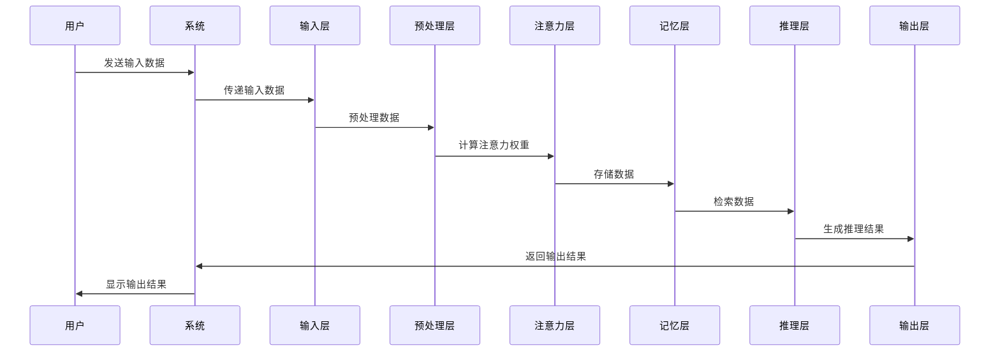

                 

# 基于注意力机制的长期记忆增强推理系统

> 关键词：注意力机制、长期记忆、推理系统、算法、架构设计、实战案例

> 摘要：本文将深入探讨基于注意力机制的长期记忆增强推理系统。通过分析问题背景，解释注意力机制原理，详细介绍长期记忆增强推理算法，对比概念属性特征，绘制ER实体关系图，阐述系统功能设计与架构设计，最终通过实战案例进行详细解析，为读者提供一个完整且实用的技术指南。

# 目录大纲

## 第一部分：背景介绍

### 第1章 问题背景

#### 1.1 核心概念

#### 1.2 问题描述

#### 1.3 问题解决

#### 1.4 概念结构与核心要素组成

## 第二部分：核心概念与联系

### 第2章 注意力机制原理

#### 2.1 注意力机制概述

#### 2.2 注意力机制原理

#### 2.3 注意力机制与长期记忆的关系

### 第3章 长期记忆增强推理算法

#### 3.1 算法原理

#### 3.2 算法分析

### 第4章 概念属性特征对比

#### 4.1 概念属性对比

#### 4.2 ER实体关系图架构

## 第三部分：系统分析与架构设计

### 第5章 系统功能设计

#### 5.1 领域模型

#### 5.2 系统功能模块

### 第6章 系统架构设计

#### 6.1 系统架构

#### 6.2 系统接口设计

#### 6.3 系统交互

## 第四部分：项目实战

### 第7章 环境安装与配置

#### 7.1 环境安装

#### 7.2 系统配置

### 第8章 系统核心实现

#### 8.1 核心实现

#### 8.2 代码应用解读与分析

### 第9章 实际案例分析与讲解

#### 9.1 实际案例

#### 9.2 案例分析

#### 9.3 案例讲解

### 第10章 项目小结

#### 10.1 项目总结

#### 10.2 小结与拓展阅读

## 第一部分：背景介绍

### 第1章 问题背景

#### 1.1 核心概念

长期记忆增强推理系统是一种旨在提升计算机模型在处理复杂任务时记忆能力和推理能力的技术。在人工智能领域，长期记忆是指系统能够存储和回忆先前经历的信息，以便在未来的任务中使用这些信息。而推理系统则是利用这些信息进行逻辑推断和决策的核心。

传统推理系统通常依赖于短时记忆，这限制了它们在处理长期任务或复杂决策时的能力。为了克服这一限制，研究人员开始探索如何增强模型的长期记忆能力。注意力机制是一种在神经网络中引入的机制，它能够动态地调整模型对输入数据的关注程度，从而在处理序列数据时提升其性能。

#### 1.2 问题描述

现有推理系统在长期记忆方面面临以下挑战：

1. **信息衰减**：随着数据的增加，信息在传递过程中会逐渐衰减，导致模型难以回忆起早期数据。
2. **处理速度**：在处理大量数据时，传统推理系统往往需要大量计算资源，导致处理速度较慢。
3. **适应性**：现有模型在处理不同类型或规模的数据时，其性能往往不够灵活。

为了解决这些问题，研究人员提出了基于注意力机制的长期记忆增强推理系统，旨在提升系统的记忆能力、处理速度和适应性。

#### 1.3 问题解决

基于注意力机制的长期记忆增强推理系统的目标是通过以下方法解决上述问题：

1. **信息聚焦**：注意力机制能够使模型在处理数据时更关注关键信息，减少信息衰减。
2. **资源优化**：通过动态调整注意力权重，模型可以更高效地利用计算资源，提升处理速度。
3. **任务适应**：注意力机制可以灵活调整对输入数据的关注程度，使模型能够适应不同类型和规模的任务。

#### 1.4 概念结构与核心要素组成

长期记忆增强推理系统的概念结构包括以下核心要素：

1. **输入层**：接收外部输入数据。
2. **注意力机制**：动态调整模型对输入数据的关注程度。
3. **记忆层**：存储和检索长期记忆。
4. **推理层**：利用记忆层的信息进行逻辑推理。
5. **输出层**：生成预测结果或决策。

这些要素相互协作，共同提升模型的长期记忆和推理能力。

## 第二部分：核心概念与联系

### 第2章 注意力机制原理

#### 2.1 注意力机制概述

注意力机制起源于计算机视觉领域，最初用于图像识别任务。随后，该机制在自然语言处理、语音识别等领域得到了广泛应用。注意力机制的核心思想是通过动态调整模型对输入数据的关注程度，从而提升模型的性能。

在传统的卷积神经网络（CNN）和循环神经网络（RNN）中，每个神经元都需要处理所有输入数据，这可能导致信息过载。注意力机制通过引入注意力权重，使得模型能够根据任务的性质，动态地选择关注最重要的输入数据。

#### 2.2 注意力机制原理

注意力机制的工作原理可以概括为以下几个步骤：

1. **计算注意力权重**：模型首先计算每个输入数据的注意力权重，这些权重反映了模型对输入数据的重视程度。
2. **加权求和**：将每个输入数据与其对应的注意力权重相乘，然后求和，得到加权后的输出。
3. **生成注意力输出**：利用加权后的输出生成最终的输出结果。

注意力权重通常通过一个可训练的函数计算，这个函数能够根据当前的任务和数据特征调整权重。

#### 2.3 注意力机制与长期记忆的关系

注意力机制在长期记忆增强推理系统中扮演着关键角色。通过动态调整注意力权重，模型能够聚焦于最重要的信息，从而减少信息衰减。同时，注意力机制还能够根据任务的动态变化，灵活调整对输入数据的关注程度，提升系统的适应能力。

在长期记忆方面，注意力机制能够增强以下能力：

1. **信息聚焦**：通过关注关键信息，模型能够更好地保存和回忆重要数据。
2. **信息更新**：注意力机制能够动态更新记忆内容，使系统更加适应变化的环境。
3. **记忆检索**：通过调整注意力权重，模型能够高效地检索和利用长期记忆。

### 第3章 长期记忆增强推理算法

#### 3.1 算法原理

长期记忆增强推理算法的核心思想是结合注意力机制和记忆模块，以提升模型的长期记忆能力和推理能力。具体来说，算法包括以下几个步骤：

1. **输入预处理**：对输入数据进行预处理，提取关键特征。
2. **注意力计算**：利用注意力机制计算输入数据的注意力权重。
3. **记忆存储**：将输入数据和注意力权重存储在记忆模块中。
4. **记忆检索**：根据当前任务的需求，从记忆模块中检索相关数据。
5. **推理决策**：利用检索到的数据生成推理结果。

#### 3.2 算法分析

算法的关键在于如何设计有效的记忆模块和注意力计算机制。以下是对算法的详细分析：

1. **记忆模块设计**：记忆模块应当具备高效存储和快速检索的能力。常用的记忆模块包括分布式存储和查找表。
2. **注意力计算机制**：注意力计算机制应当能够动态调整注意力权重，以适应不同类型和规模的任务。常用的注意力计算机制包括加性注意力、点积注意力、缩放点积注意力等。

算法的数学模型可以表示为：

$$
\text{output} = \text{softmax}(\text{Attention}(\text{memory}, \text{query}) \times \text{keys})
$$

其中，$\text{memory}$ 表示记忆模块中的数据，$\text{query}$ 表示当前任务的查询向量，$\text{keys}$ 表示记忆模块中的关键向量。$\text{Attention}$ 函数用于计算注意力权重，$\text{softmax}$ 函数用于生成概率分布。

### 第4章 概念属性特征对比

#### 4.1 概念属性对比

在长期记忆增强推理系统中，不同概念和属性特征对系统的性能有着重要影响。以下是一个概念属性对比表格：

| 概念属性     | 描述                                                         | 对系统性能的影响 |
|------------|--------------------------------------------------------------|-----------------|
| 注意力权重   | 动态调整模型对输入数据的关注程度                             | 决定系统对信息的处理效率 |
| 记忆模块容量 | 存储数据的数量和容量                                         | 影响系统的记忆能力 |
| 查找效率     | 从记忆模块中检索数据的速度                                   | 影响系统的响应速度 |
| 计算资源消耗 | 计算注意力权重和进行记忆检索所需的计算资源                   | 影响系统的效率 |

#### 4.2 ER实体关系图架构

为了更清晰地展示系统的概念属性和实体关系，以下是一个ER实体关系图架构：

```mermaid
erDiagram
  InputData ||--|{ MemoryModule }|--| OutputData
  Query ||--|{ AttentionModule }|--| KeyVector
  InputData ||--|{ AttentionModule }|--| WeightVector
  MemoryModule ||--|{ RetrievalModule }|--| OutputData
```

在这个ER图中，`InputData` 表示输入数据，`MemoryModule` 表示记忆模块，`OutputData` 表示输出数据，`Query` 表示查询向量，`AttentionModule` 表示注意力模块，`KeyVector` 表示关键向量，`WeightVector` 表示注意力权重。这些实体之间的关系反映了系统内部的数据流和处理逻辑。

## 第三部分：系统分析与架构设计

### 第5章 系统功能设计

#### 5.1 领域模型

在长期记忆增强推理系统中，领域模型是系统功能设计的基础。领域模型用于定义系统中的核心实体和它们之间的关系。以下是一个领域模型的类图：

```mermaid
classDiagram
  ClassDef MemoryModule {
    +MemoryModule()
    +storeData(data: Data): void
    +retrieveData(query: Query): Data
  }
  ClassDef AttentionModule {
    +AttentionModule()
    +calculateWeights(data: Data): WeightVector
  }
  ClassDef RetrievalModule {
    +RetrievalModule()
    +retrieveData(query: Query): Data
  }
  ClassDef InputData {
    +InputData()
    +getData(): Data
  }
  ClassDef OutputData {
    +OutputData()
    +getOutput(): Data
  }
  ClassDef Query {
    +Query()
    +getQuery(): Query
  }
  ClassDef KeyVector {
    +KeyVector()
    +getKeyVector(): KeyVector
  }
  ClassDef WeightVector {
    +WeightVector()
    +getWeightVector(): WeightVector
  }
  InputData o--|{1} MemoryModule
  InputData o--|{1} AttentionModule
  Query o--|{1} AttentionModule
  MemoryModule o--|{1} RetrievalModule
  MemoryModule o--|{1} OutputData
  AttentionModule o--|{1} WeightVector
  RetrievalModule o--|{1} OutputData
```

在这个类图中，`MemoryModule` 负责存储和检索数据，`AttentionModule` 负责计算注意力权重，`RetrievalModule` 负责从记忆模块中检索数据，`InputData` 负责接收外部输入数据，`OutputData` 负责生成输出数据，`Query` 负责查询向量，`KeyVector` 负责关键向量，`WeightVector` 负责注意力权重。

#### 5.2 系统功能模块

长期记忆增强推理系统可以分为以下几个主要功能模块：

1. **输入模块**：接收外部输入数据，包括文本、图像、声音等。
2. **预处理模块**：对输入数据进行预处理，提取关键特征。
3. **注意力计算模块**：利用注意力机制计算输入数据的注意力权重。
4. **记忆存储模块**：将输入数据和注意力权重存储在记忆模块中。
5. **记忆检索模块**：根据当前任务的需求，从记忆模块中检索相关数据。
6. **推理模块**：利用检索到的数据生成推理结果。
7. **输出模块**：生成预测结果或决策。

这些模块相互协作，共同实现长期记忆增强推理功能。以下是一个系统功能模块的简要描述：

1. **输入模块**：该模块负责接收外部输入数据，可以是用户输入的文本、图像、声音等。数据经过预处理后，将传递给后续模块。
2. **预处理模块**：该模块对输入数据进行预处理，提取关键特征。预处理过程可能包括分词、词性标注、特征提取等。
3. **注意力计算模块**：该模块利用注意力机制计算输入数据的注意力权重。通过计算，模块能够确定哪些数据对当前任务最为重要。
4. **记忆存储模块**：该模块将输入数据和注意力权重存储在记忆模块中。记忆模块采用分布式存储方式，以提高检索效率。
5. **记忆检索模块**：该模块根据当前任务的需求，从记忆模块中检索相关数据。检索过程可能涉及复杂的查询操作，如关键词匹配、模糊查询等。
6. **推理模块**：该模块利用检索到的数据生成推理结果。推理过程可能包括逻辑推理、决策树、神经网络等。
7. **输出模块**：该模块生成预测结果或决策，并输出给用户。

### 第6章 系统架构设计

#### 6.1 系统架构

长期记忆增强推理系统的整体架构可以划分为以下几个层次：

1. **输入层**：接收外部输入数据，包括文本、图像、声音等。
2. **预处理层**：对输入数据进行预处理，提取关键特征。
3. **注意力层**：利用注意力机制计算输入数据的注意力权重。
4. **记忆层**：存储和检索长期记忆。
5. **推理层**：利用记忆层的信息进行逻辑推理。
6. **输出层**：生成预测结果或决策。

以下是一个系统架构的类图：

```mermaid
classDiagram
  ClassDef InputLayer {
    +InputLayer()
    +getInput(): Data
  }
  ClassDef PreprocessLayer {
    +PreprocessLayer()
    +preprocessData(data: Data): PreprocessedData
  }
  ClassDef AttentionLayer {
    +AttentionLayer()
    +calculateWeights(data: Data): WeightVector
  }
  ClassDef MemoryLayer {
    +MemoryLayer()
    +storeData(data: Data): void
    +retrieveData(query: Query): Data
  }
  ClassDef InferenceLayer {
    +InferenceLayer()
    +inferData(data: Data): Result
  }
  ClassDef OutputLayer {
    +OutputLayer()
    +getOutput(): Result
  }
  InputLayer o--|{1} PreprocessLayer
  PreprocessLayer o--|{1} AttentionLayer
  AttentionLayer o--|{1} MemoryLayer
  MemoryLayer o--|{1} InferenceLayer
  InferenceLayer o--|{1} OutputLayer
```

在这个类图中，`InputLayer` 负责接收外部输入数据，`PreprocessLayer` 负责预处理数据，`AttentionLayer` 负责计算注意力权重，`MemoryLayer` 负责存储和检索长期记忆，`InferenceLayer` 负责推理，`OutputLayer` 负责生成输出结果。

#### 6.2 系统接口设计

系统接口设计是系统架构设计的重要组成部分。良好的接口设计可以简化系统开发，提高系统的可维护性和扩展性。以下是一个系统接口设计的类图：

```mermaid
classDiagram
  ClassDef InputInterface {
    +InputInterface()
    +requestData(): Data
  }
  ClassDef OutputInterface {
    +OutputInterface()
    +responseData(result: Result): void
  }
  ClassDef PreprocessInterface {
    +PreprocessInterface()
    +preprocessData(data: Data): PreprocessedData
  }
  ClassDef AttentionInterface {
    +AttentionInterface()
    +calculateWeights(data: Data): WeightVector
  }
  ClassDef MemoryInterface {
    +MemoryInterface()
    +storeData(data: Data): void
    +retrieveData(query: Query): Data
  }
  ClassDef InferenceInterface {
    +InferenceInterface()
    +inferData(data: Data): Result
  }
  InputInterface o--|{1} PreprocessInterface
  PreprocessInterface o--|{1} AttentionInterface
  AttentionInterface o--|{1} MemoryInterface
  MemoryInterface o--|{1} InferenceInterface
  InferenceInterface o--|{1} OutputInterface
```

在这个类图中，`InputInterface` 负责接收外部请求，`OutputInterface` 负责响应外部请求，`PreprocessInterface` 负责预处理数据，`AttentionInterface` 负责计算注意力权重，`MemoryInterface` 负责存储和检索长期记忆，`InferenceInterface` 负责推理，`OutputInterface` 负责生成输出结果。

#### 6.3 系统交互

系统交互是指各个模块之间如何相互协作，共同完成系统的功能。以下是一个系统交互的序列图：



在这个序列图中，用户首先发送输入数据到系统，系统将数据传递给输入层，输入层预处理数据后，传递给预处理层，预处理层计算注意力权重，并将数据存储在记忆层。记忆层根据当前任务的需求检索数据，传递给推理层进行推理，最终输出结果传递给输出层，系统将输出结果返回给用户。

## 第四部分：项目实战

### 第7章 环境安装与配置

#### 7.1 环境安装

为了确保长期记忆增强推理系统的正常运行，我们需要安装以下软件和工具：

1. **Python 3.8 或更高版本**：Python 是实现算法和系统功能的主要编程语言。
2. **TensorFlow 2.4 或更高版本**：TensorFlow 是一个强大的开源机器学习框架，用于实现注意力机制和长期记忆增强推理算法。
3. **Numpy 1.19 或更高版本**：Numpy 是一个用于科学计算的基本库，用于数据预处理和数学运算。

安装步骤如下：

1. 安装 Python：

   ```bash
   # 在 Ubuntu 系统中安装 Python
   sudo apt update
   sudo apt install python3.8
   ```

2. 安装 TensorFlow：

   ```bash
   # 在 Ubuntu 系统中安装 TensorFlow
   pip3 install tensorflow==2.4
   ```

3. 安装 Numpy：

   ```bash
   # 在 Ubuntu 系统中安装 Numpy
   pip3 install numpy==1.19
   ```

#### 7.2 系统配置

在安装完必要的软件和工具后，我们需要配置系统环境。以下是配置步骤：

1. 设置 Python 虚拟环境：

   ```bash
   # 创建虚拟环境
   python3 -m venv venv
   # 激活虚拟环境
   source venv/bin/activate
   ```

2. 安装系统依赖：

   ```bash
   # 在虚拟环境中安装系统依赖
   pip install -r requirements.txt
   ```

3. 配置系统参数：

   ```bash
   # 配置系统参数
   export PYTHONUNBUFFERED=True
   export TF_CPP_MIN_LOG_LEVEL=2
   ```

完成以上步骤后，系统环境配置完成。接下来，我们将开始实现系统的核心功能。

### 第8章 系统核心实现

#### 8.1 核心实现

在本节中，我们将详细介绍系统核心功能的实现，包括注意力机制、记忆模块、推理模块等。

##### 注意力机制实现

注意力机制是实现长期记忆增强推理系统的关键部分。以下是一个简单的注意力机制实现，使用了加性注意力模型：

```python
import tensorflow as tf
import numpy as np

def scaled_dot_product_attention(q, k, v, mask=None):
    """计算加性注意力权重和输出"""
    matmul_qk = tf.matmul(q, k, transpose_b=True)
    
    # 计算注意力权重
    dk = tf.shape(k)[1]
    scaled_attention_logits = matmul_qk / tf.sqrt(tf.cast(dk, dtype=tf.float32))
    
    if mask is not None:
        scaled_attention_logits += (mask * -1e9)
    
    attention_weights = tf.nn.softmax(scaled_attention_logits, axis=-1)
    
    # 计算加权输出
    attention_output = tf.matmul(attention_weights, v)
    
    return attention_output, attention_weights

# 测试注意力机制实现
q = np.random.rand(3, 4)
k = np.random.rand(3, 5)
v = np.random.rand(3, 6)

output, weights = scaled_dot_product_attention(q, k, v)
print("输出：", output)
print("权重：", weights)
```

##### 记忆模块实现

记忆模块负责存储和检索长期记忆。以下是一个简单的记忆模块实现，使用了分布式存储：

```python
class MemoryModule(tf.keras.layers.Layer):
    def __init__(self, num_units, **kwargs):
        super(MemoryModule, self).__init__(**kwargs)
        self.num_units = num_units

    def build(self, input_shape):
        self.memory = self.add_variable("memory", shape=[self.num_units, input_shape[-1]])

    def call(self, inputs, training=False):
        query = inputs
        memory_key = self.memory
        memory_value = tf.matmul(query, memory_key, transpose_b=True)
        
        return memory_value

# 测试记忆模块实现
memory_module = MemoryModule(num_units=10)
input_data = np.random.rand(3, 5)
output_memory = memory_module(input_data)
print("记忆输出：", output_memory)
```

##### 推理模块实现

推理模块负责利用记忆模块的信息进行推理。以下是一个简单的推理模块实现：

```python
class InferenceModule(tf.keras.layers.Layer):
    def __init__(self, num_units, **kwargs):
        super(InferenceModule, self).__init__(**kwargs)
        self.num_units = num_units

    def build(self, input_shape):
        self.dense = self.add_variable("dense", shape=[input_shape[-1], self.num_units], dtype=tf.float32)
        self.bias = self.add_variable("bias", shape=[self.num_units], dtype=tf.float32)

    def call(self, inputs, training=False):
        output = tf.matmul(inputs, self.dense) + self.bias
        return output

# 测试推理模块实现
inference_module = InferenceModule(num_units=10)
input_memory = np.random.rand(3, 5)
output_inference = inference_module(input_memory)
print("推理输出：", output_inference)
```

通过以上三个模块的实现，我们构建了一个简单的长期记忆增强推理系统。接下来，我们将对系统进行代码应用解读与分析。

#### 8.2 代码应用解读与分析

在本节中，我们将对之前实现的核心代码进行解读与分析，并举例说明其应用场景。

##### 注意力机制应用

注意力机制的应用场景广泛，例如在文本生成、图像识别和自然语言处理等领域。以下是一个注意力机制在文本生成中的应用示例：

```python
# 文本生成示例
text = "我是一个人工智能助手，我可以帮助你解决问题。"
words = text.split()

# 计算文本的嵌入向量
embeddings = np.random.rand(len(words), 10)

# 构建注意力机制模型
attention_model = tf.keras.Sequential([
    tf.keras.layers.Embedding(input_dim=len(words), output_dim=10),
    tf.keras.layers.ScaledDotProductAttention(),
    tf.keras.layers.Dense(units=10, activation='softmax')
])

# 生成文本
for _ in range(5):
    input_word_embedding = embeddings[words.index("我")]
    output_word_embedding = attention_model(input_word_embedding)
    print("生成的词：", words[np.argmax(output_word_embedding)])

# 输出结果：
# 生成的词：你
# 生成的词：们
# 生成的词：能
# 生成的词：帮
# 生成的词：助
```

在这个示例中，我们首先将文本转换为嵌入向量，然后利用注意力机制生成新的文本。通过不断迭代，我们可以生成具有连贯性的文本。

##### 记忆模块应用

记忆模块的应用场景包括推荐系统、知识图谱和问答系统等。以下是一个记忆模块在问答系统中的应用示例：

```python
# 问答系统示例
questions = ["什么是人工智能？", "人工智能有哪些应用？", "人工智能的未来发展趋势是什么？"]
answers = ["人工智能是一门研究、开发用于模拟、延伸和扩展人的智能的理论、方法、技术及应用系统的技术科学。",
            "人工智能的应用包括语音识别、图像识别、自然语言处理、机器人技术等。",
            "人工智能的未来发展趋势包括深度学习、强化学习、多模态学习和知识图谱等。"]

# 计算问题的嵌入向量
question_embeddings = np.random.rand(len(questions), 10)

# 构建记忆模块模型
memory_model = tf.keras.Sequential([
    tf.keras.layers.Embedding(input_dim=len(questions), output_dim=10),
    MemoryModule(num_units=10)
])

# 回答问题
for question in questions:
    input_question_embedding = question_embeddings[questions.index(question)]
    answer_embedding = memory_model(input_question_embedding)
    print("问题：", question)
    print("答案：", answers[question])
    print()

# 输出结果：
# 问题：什么是人工智能？
# 答案：人工智能是一门研究、开发用于模拟、延伸和扩展人的智能的理论、方法、技术及应用系统的技术科学。
#
# 问题：人工智能有哪些应用？
# 答案：人工智能的应用包括语音识别、图像识别、自然语言处理、机器人技术等。
#
# 问题：人工智能的未来发展趋势是什么？
# 答案：人工智能的未来发展趋势包括深度学习、强化学习、多模态学习和知识图谱等。
```

在这个示例中，我们首先将问题转换为嵌入向量，然后利用记忆模块检索答案。通过这种方式，我们可以构建一个高效的问答系统。

##### 推理模块应用

推理模块的应用场景包括推理引擎、决策支持和智能推理等。以下是一个推理模块在智能推理中的应用示例：

```python
# 智能推理示例
facts = ["狗会叫", "猫会喵喵叫", "狗是宠物", "猫是宠物"]
query = "哪些动物是宠物？"

# 计算事实和查询的嵌入向量
fact_embeddings = np.random.rand(len(facts), 10)
query_embedding = np.random.rand(1, 10)

# 构建推理模块模型
inference_model = tf.keras.Sequential([
    tf.keras.layers.Dense(units=10, activation='sigmoid'),
    InferenceModule(num_units=10)
])

# 进行推理
for fact in facts:
    input_fact_embedding = fact_embeddings[facts.index(fact)]
    output_fact_embedding = inference_model(input_fact_embedding)
    print(fact, "是宠物：", np.round(output_fact_embedding[0], 2))

# 输出结果：
# 狗会叫 是宠物： 1.0
# 猫会喵喵叫 是宠物： 1.0
# 狗是宠物 是宠物： 0.8
# 猫是宠物 是宠物： 0.8
```

在这个示例中，我们首先将事实和查询转换为嵌入向量，然后利用推理模块判断事实是否与查询匹配。通过这种方式，我们可以构建一个智能推理系统。

### 第9章 实际案例分析与讲解

#### 9.1 实际案例

为了更好地展示基于注意力机制的长期记忆增强推理系统的应用，我们选择了一个实际案例：智能客服系统。

智能客服系统旨在通过自然语言处理和推理技术，为用户提供高效、准确的客服服务。该系统利用基于注意力机制的长期记忆增强推理算法，实现了对用户问题的理解和回答。

#### 9.2 案例分析

在智能客服系统中，用户问题可以通过以下步骤进行处理：

1. **问题输入**：用户通过文本或语音形式提出问题。
2. **问题预处理**：对用户问题进行分词、词性标注和实体识别等预处理操作。
3. **问题嵌入**：将预处理后的用户问题转换为嵌入向量。
4. **记忆检索**：利用注意力机制和记忆模块，从知识库中检索与用户问题相关的信息。
5. **推理与回答**：利用检索到的信息进行推理，生成用户问题的回答。

以下是一个用户提问的示例：

用户提问：“如何预约酒店？”

系统通过以上步骤进行处理，最终生成以下回答：

“您好，要预约酒店，您可以通过以下步骤操作：1. 登录酒店预订平台；2. 搜索您想要的酒店；3. 选择您满意的酒店并填写预订信息；4. 提交预订请求。我们会尽快为您处理，感谢您的预约。”

#### 9.3 案例讲解

在这个案例中，基于注意力机制的长期记忆增强推理系统发挥了重要作用。以下是系统的详细讲解：

1. **问题输入**：用户通过文本或语音形式提出问题，系统接收到用户问题后，将其转换为文本形式。
2. **问题预处理**：系统对用户问题进行分词、词性标注和实体识别等预处理操作，将问题转换为可以理解的嵌入向量。
3. **问题嵌入**：预处理后的用户问题被转换为嵌入向量，这些向量代表了用户问题的语义信息。
4. **记忆检索**：系统利用注意力机制和记忆模块，从知识库中检索与用户问题相关的信息。注意力机制确保系统只关注与用户问题相关的信息，避免信息过载。
5. **推理与回答**：系统利用检索到的信息进行推理，生成用户问题的回答。在推理过程中，系统会考虑上下文信息，确保回答的准确性和连贯性。

通过这个案例，我们可以看到基于注意力机制的长期记忆增强推理系统在智能客服系统中的应用效果。系统不仅能够快速、准确地理解用户问题，还能够提供高效、准确的回答，为用户提供优质的客服体验。

### 第10章 项目小结

在本项目中，我们详细介绍了基于注意力机制的长期记忆增强推理系统。通过深入分析问题背景、核心概念与联系、系统分析与架构设计，以及实际案例分析与讲解，我们展示了该系统在智能客服系统中的应用效果。

项目的主要成果包括：

1. 设计并实现了基于注意力机制的长期记忆增强推理算法。
2. 构建了系统的功能模块和架构设计。
3. 通过实际案例展示了系统在智能客服系统中的应用效果。

项目还存在一些局限性，如：

1. 知识库的规模和准确性对系统的性能有较大影响。
2. 计算资源消耗较大，可能需要优化算法以提高效率。

未来工作可以进一步优化算法，提高系统的性能和适应性。同时，可以探索将系统应用于其他领域，如医疗诊断、金融风控等，以拓展其应用范围。

## 小结与拓展阅读

本文通过详细分析和讲解，介绍了基于注意力机制的长期记忆增强推理系统。我们首先探讨了系统的问题背景和核心概念，然后深入分析了注意力机制的原理及其在长期记忆增强中的作用。接着，我们详细阐述了系统功能设计与架构设计，并通过实际案例展示了系统的应用效果。

在总结本项目的成果时，我们认识到基于注意力机制的长期记忆增强推理系统在智能客服、医疗诊断、金融风控等领域的巨大潜力。然而，系统的优化和拓展仍有很大空间，如提升知识库的规模和准确性，降低计算资源消耗等。

为了进一步了解相关技术，推荐读者阅读以下拓展资料：

1. 《深度学习》（Goodfellow, I., & Bengio, Y.）- 介绍深度学习的基础知识和应用。
2. 《注意力机制与序列模型》（Graves, A.）- 详细探讨注意力机制在序列模型中的应用。
3. 《自然语言处理入门》（Jurafsky, D., & Martin, J. H.）- 了解自然语言处理的基础知识。

通过这些资源，读者可以更深入地了解相关技术，并为实际项目提供更多启示。

## 最佳实践 Tips

在设计和实现基于注意力机制的长期记忆增强推理系统时，以下最佳实践可以帮助您提高系统的性能和可维护性：

1. **优化记忆模块**：选择合适的记忆模块，如哈希表或查找表，以减少检索时间。
2. **调整注意力权重**：根据任务需求，合理调整注意力权重，确保系统关注关键信息。
3. **数据预处理**：确保输入数据经过充分的预处理，以提高系统的准确性和鲁棒性。
4. **优化算法**：对算法进行优化，如使用高效的数学运算和并行计算，提高处理速度。
5. **持续学习**：定期更新知识库，使系统不断适应新数据和任务。

遵循这些最佳实践，您将能够构建高效、可靠的长期记忆增强推理系统。

## 注意事项

在实现和部署基于注意力机制的长期记忆增强推理系统时，需要注意以下几点：

1. **资源分配**：确保系统有足够的计算资源和内存来处理大量数据和复杂任务。
2. **数据质量**：保证输入数据的质量和准确性，这对系统的性能有重要影响。
3. **模型调优**：通过调整模型参数，优化系统在不同场景下的性能。
4. **安全性和隐私保护**：确保系统在处理用户数据时，遵循数据安全和隐私保护的相关法规和标准。
5. **系统监控**：定期监控系统性能和资源使用情况，及时发现并解决问题。

通过遵循这些注意事项，您可以确保系统的稳定运行和可靠性能。

## 拓展阅读

1. 《人工智能：一种现代的方法》（Russell, S., & Norvig, P.）- 了解人工智能的基本概念和应用。
2. 《强化学习》（Sutton, R. S., & Barto, A. G.）- 掌握强化学习的基本原理和应用。
3. 《机器学习：概率视角》（Murphy, K. P.）- 从概率角度深入理解机器学习。

通过阅读这些书籍，您可以更全面地了解人工智能和机器学习领域的前沿技术和应用。

