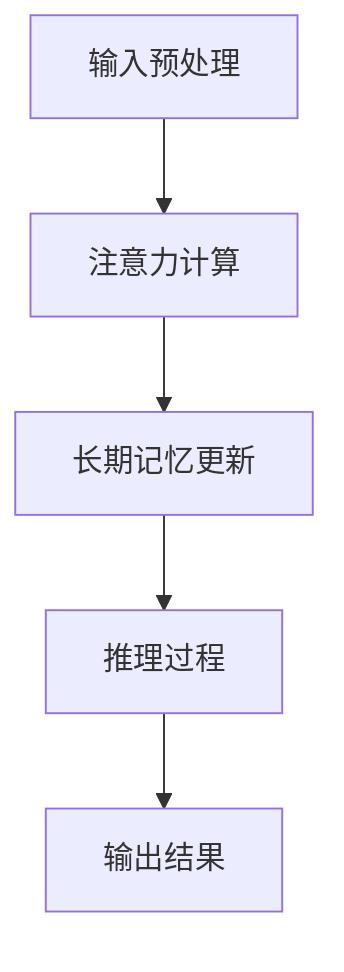
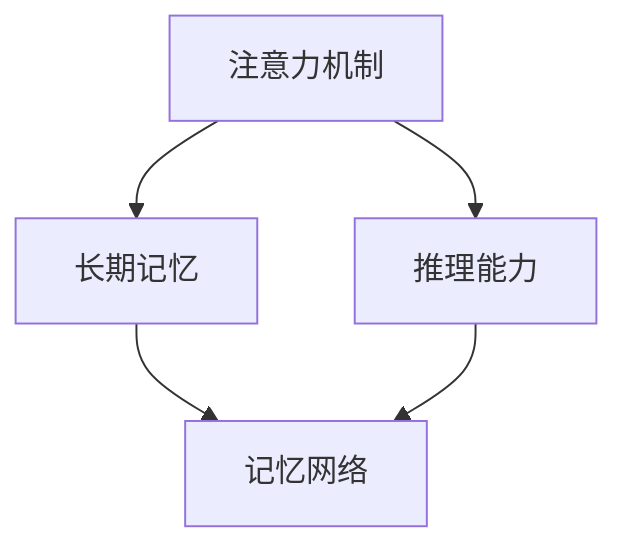
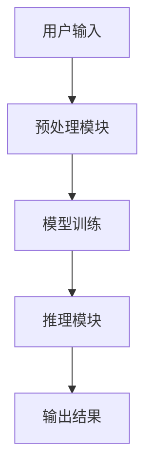

                 

### 文章标题

# 基于注意力机制的长期记忆推理能力增强

> 关键词：注意力机制、长期记忆、推理能力、算法优化、AI应用

> 摘要：本文旨在探讨如何利用注意力机制来增强人工智能系统的长期记忆推理能力，通过逐步分析这一机制的理论基础、算法设计、实际应用和未来方向，为AI领域的研究者提供有价值的参考。

----------------------------------------------------------------

### 第一部分：引言

#### 1.1 书籍目的与读者对象

在人工智能迅猛发展的时代，如何提升人工智能系统的智能水平成为了一个亟待解决的问题。本文旨在介绍一种利用注意力机制增强长期记忆推理能力的策略，为研究者提供理论基础和实践指导。

本书籍主要面向人工智能领域的研究者、工程师以及相关专业的学生。通过本文的阐述，读者可以了解注意力机制和长期记忆推理能力的基本概念，掌握基于注意力机制的算法设计方法，并能够应用于实际问题的解决中。

#### 1.2 注意力机制概述

注意力机制（Attention Mechanism）是一种在人工智能中广泛应用的技术，它能够使得模型在处理信息时更加关注重要的部分。这一机制最初源于人类视觉系统对视觉信息的处理，随后被引入自然语言处理、计算机视觉等领域，并取得了显著的成果。

注意力机制的基本原理是：通过一个注意力分配函数，将模型的注意力分配到输入数据的各个部分，从而提高模型对重要信息的识别能力。在长期记忆推理任务中，注意力机制可以帮助模型更好地捕捉并利用历史信息，提高推理的准确性和效率。

#### 1.3 长期记忆与推理能力

长期记忆是人工智能系统中的一个重要概念，它指的是系统能够在长时间内保存和利用信息的能力。长期记忆对于推理任务至关重要，因为许多实际问题需要利用历史信息来进行决策和推断。

推理能力则是人工智能系统能够从已知信息中推导出未知信息的能力。在现实世界中，许多问题都需要复杂的推理过程，例如自然语言理解、图像分类、自动驾驶等。

长期记忆和推理能力之间的联系在于：长期记忆提供了推理的基础，而推理能力则能够利用长期记忆中的信息进行决策和推断。

#### 1.4 本书结构与内容安排

本书分为四个主要部分：

1. **引言**：介绍书籍的目的、读者对象，以及注意力机制和长期记忆推理能力的概念。
2. **理论基础**：详细探讨注意力机制和长期记忆推理能力的理论背景。
3. **算法设计**：介绍基于注意力机制的算法设计方法，包括理论分析、数学模型和算法流程。
4. **实际应用**：展示基于注意力机制的长期记忆推理能力在各个领域的应用案例。

通过本书籍的阅读，读者可以系统地了解基于注意力机制的长期记忆推理能力增强方法，并为未来的研究提供启示。

----------------------------------------------------------------

### 第二部分：理论基础

#### 2.1 注意力机制原理

注意力机制是一种在模型处理信息时提高信息利用效率的技术。它通过在输入数据的各个部分之间分配不同的关注程度，使得模型能够更加关注重要信息，从而提高模型的性能。

**2.1.1 注意力模型的发展历程**

注意力模型的发展可以追溯到20世纪80年代，当时研究人员开始探索如何在计算模型中引入注意力机制。此后，注意力模型在多个领域得到了广泛应用，如自然语言处理、计算机视觉和语音识别等。

**2.1.2 注意力机制的数学描述**

注意力机制的核心是注意力分配函数，它将模型的注意力分配到输入数据的各个部分。通常，注意力分配函数可以表示为：

\[ a_i = \text{Attention}(x_i) \]

其中，\( a_i \) 表示对输入数据 \( x_i \) 的注意力分配，\( \text{Attention} \) 是一个非线性函数。

**2.1.3 注意力机制的分类**

注意力机制可以根据其应用场景和实现方式分为多种类型，主要包括：

- **自注意力机制（Self-Attention）**：模型对输入序列的每个元素进行加权求和，用于处理序列数据，如自然语言处理中的词向量。
- **对话注意力机制（Interactive Attention）**：模型在处理信息时不仅关注输入数据，还关注上下文信息，用于处理对话系统等场景。
- **卷积注意力机制（Convolutional Attention）**：结合卷积神经网络的特点，对输入数据进行局部关注，用于图像处理等任务。

#### 2.2 长期记忆原理

长期记忆是指系统能够在长时间内保存和利用信息的能力。在人工智能领域，长期记忆是实现智能行为的关键。

**2.2.1 长期记忆的概念**

长期记忆（Long-Term Memory，LTM）是一种记忆形式，它能够存储大量的信息，并且能够在需要时检索和利用这些信息。

**2.2.2 长期记忆的特点**

长期记忆具有以下特点：

- **持久性**：长期记忆可以持续很长时间，甚至是一生。
- **适应性**：长期记忆可以根据新的信息和经验进行调整和更新。
- **容量大**：长期记忆可以存储大量的信息。

**2.2.3 长期记忆与短期记忆的关系**

短期记忆（Short-Term Memory，STM）是一种短时存储和处理的记忆形式，它与长期记忆紧密相关。短期记忆中的信息可以通过复述和编码转移到长期记忆中，从而实现长期存储。

#### 2.3 推理能力原理

推理能力是指系统能够从已知信息中推导出未知信息的能力。在人工智能中，推理能力是实现智能行为的核心。

**2.3.1 推理能力的概念**

推理能力（Inference Ability）是指系统在处理信息时，能够根据已知信息推导出未知信息的能力。

**2.3.2 推理能力的类型**

推理能力可以分为以下几种类型：

- **演绎推理（Deductive Reasoning）**：从一般到特殊的推理过程。
- **归纳推理（Inductive Reasoning）**：从特殊到一般的推理过程。
- **类比推理（Analogical Reasoning）**：通过比较相似性来推导出新信息。

#### 2.4 长期记忆与推理能力的关系

长期记忆和推理能力是密切相关的。长期记忆为推理提供了基础信息，而推理能力则能够利用长期记忆中的信息进行推导和决策。

在人工智能系统中，增强长期记忆和推理能力可以提高系统的智能水平，使其能够更好地处理复杂问题。

----------------------------------------------------------------

### 第三部分：算法设计

#### 3.1 基于注意力机制的长期记忆推理算法设计

**3.1.1 算法背景**

在人工智能领域中，长期记忆推理能力的增强一直是研究的热点。基于注意力机制的算法设计提供了一种有效的解决方案，能够提高系统的记忆能力和推理效率。

**3.1.2 算法目标**

本算法的设计目标是利用注意力机制，实现长期记忆推理能力的增强，具体目标如下：

- 提高系统的记忆持久性，确保长期记忆中的信息能够长期存储和利用。
- 提高系统的推理效率，减少推理过程中的计算复杂度。
- 改善系统的适应性，使系统能够根据新的信息和经验进行快速调整。

**3.1.3 算法原理**

算法的核心原理是利用注意力机制来动态调整长期记忆中的信息权重，使得重要的信息得到更多的关注和利用。

算法的主要步骤包括：

1. **输入预处理**：对输入数据进行预处理，提取关键特征，并将其输入到模型中。
2. **注意力计算**：利用注意力机制计算输入数据中各个部分的重要程度，为后续的推理过程提供依据。
3. **长期记忆更新**：根据注意力计算结果，更新长期记忆中的信息权重，使重要的信息得到强化。
4. **推理过程**：利用更新后的长期记忆进行推理，推导出新的信息。

**3.1.4 算法实现**

算法的实现主要包括以下几个部分：

1. **自注意力机制**：采用自注意力机制来计算输入数据中各个部分的重要程度。
2. **记忆网络**：构建一个记忆网络来存储和更新长期记忆中的信息。
3. **推理模块**：利用记忆网络中的信息进行推理，生成新的输出。

以下是一个简化的算法流程图，展示了基于注意力机制的长期记忆推理算法的实现过程：



**3.1.5 数学模型**

算法的数学模型主要包括两部分：注意力计算模型和长期记忆更新模型。

1. **注意力计算模型**：

   假设输入数据为 \( X = [x_1, x_2, ..., x_n] \)，其中每个元素 \( x_i \) 表示输入数据中的某个部分。注意力计算模型可以表示为：

   \[ a_i = \sigma(W_a [x_i; x_{i-1}; h_{t-1}]) \]

   其中，\( \sigma \) 表示激活函数，\( W_a \) 为权重矩阵，\( h_{t-1} \) 为上一时刻的隐藏状态。

2. **长期记忆更新模型**：

   长期记忆中的信息权重更新可以通过以下公式实现：

   \[ m_t = \text{softmax}(W_m a_t) \]

   其中，\( m_t \) 表示更新后的长期记忆权重，\( W_m \) 为权重矩阵。

**3.1.6 算法优化**

为了提高算法的性能，可以采用以下优化方法：

1. **权重共享**：在注意力计算和长期记忆更新过程中，采用权重共享策略，减少模型的参数数量，提高模型的训练速度。
2. **正则化**：采用正则化方法，防止模型过拟合，提高模型的泛化能力。
3. **动态调整**：根据输入数据的动态变化，实时调整注意力权重，提高模型的适应性。

通过上述算法设计，可以有效提高人工智能系统的长期记忆推理能力，为解决复杂问题提供有力支持。

----------------------------------------------------------------

### 第四部分：实际应用

#### 4.1 自然语言处理中的应用

自然语言处理（NLP）是人工智能领域的一个重要分支，其核心任务是使计算机能够理解和生成人类语言。在NLP中，基于注意力机制的长期记忆推理能力增强技术得到了广泛应用。

**4.1.1 情感分析**

情感分析是NLP中的一个典型任务，它旨在根据文本内容判断用户情感倾向。利用基于注意力机制的长期记忆推理算法，可以更好地捕捉文本中的情感信息，提高情感分析模型的准确性。

**案例**：某电商平台希望通过情感分析了解用户对商品的反馈。采用基于注意力机制的长期记忆推理算法，通过对用户评论的深度分析，可以准确判断用户的情感倾向，从而为商品优化提供依据。

**4.1.2 文本生成**

文本生成是NLP中的另一个重要任务，它旨在根据输入的文本生成新的文本。基于注意力机制的长期记忆推理算法可以增强文本生成模型的记忆能力和推理能力，提高生成的文本质量和连贯性。

**案例**：某媒体平台希望通过自动化方式生成新闻稿件。采用基于注意力机制的长期记忆推理算法，可以更好地捕捉新闻中的关键信息，生成高质量、连贯的新闻稿件。

#### 4.2 计算机视觉中的应用

计算机视觉是人工智能领域的另一个重要分支，它旨在使计算机能够理解和处理图像和视频。在计算机视觉中，基于注意力机制的长期记忆推理能力增强技术也得到了广泛应用。

**4.2.1 目标检测**

目标检测是计算机视觉中的一个关键任务，它旨在识别图像中的物体并标注它们的边界。基于注意力机制的长期记忆推理算法可以增强目标检测模型的记忆能力和推理能力，提高检测的准确性和效率。

**案例**：某安防公司希望开发一款智能监控系统，能够实时检测并识别监控区域中的异常行为。采用基于注意力机制的长期记忆推理算法，可以准确检测并识别目标物体，提高监控系统的智能化水平。

**4.2.2 图像生成**

图像生成是计算机视觉中的另一个重要任务，它旨在根据输入的图像生成新的图像。基于注意力机制的长期记忆推理算法可以增强图像生成模型的记忆能力和推理能力，提高生成图像的质量和多样性。

**案例**：某游戏公司希望通过图像生成技术为游戏角色设计新的外观。采用基于注意力机制的长期记忆推理算法，可以生成具有独特风格和特征的图像，提高游戏角色的设计质量。

通过在自然语言处理和计算机视觉等领域的实际应用，基于注意力机制的长期记忆推理能力增强技术为人工智能系统带来了显著的性能提升，为解决复杂问题提供了有力支持。

----------------------------------------------------------------

### 第五部分：优化与挑战

#### 5.1 优化方法

基于注意力机制的长期记忆推理算法在实际应用中表现出色，但仍存在一些优化空间。以下是一些常见的优化方法：

**5.1.1 并行计算**

利用并行计算技术，可以加快算法的执行速度。通过在多核处理器或GPU上部署算法，可以实现数据并行和模型并行，提高计算效率。

**5.1.2 缓存优化**

通过缓存优化，可以减少重复计算，提高算法的运行效率。在内存中预先加载常用数据，减少磁盘IO操作，可以显著提高算法的响应速度。

**5.1.3 模型压缩**

利用模型压缩技术，可以减少模型的参数数量，降低模型的存储和计算成本。常见的模型压缩方法包括剪枝、量化、蒸馏等。

#### 5.2 挑战与问题

尽管基于注意力机制的长期记忆推理算法具有许多优势，但在实际应用中仍面临一些挑战：

**5.2.1 计算复杂度**

注意力机制的引入增加了模型的计算复杂度，特别是在处理大规模数据时，计算资源的需求可能会成为瓶颈。因此，如何在保证性能的前提下降低计算复杂度是一个重要问题。

**5.2.2 模型可解释性**

注意力机制使得模型的决策过程更加复杂，增加了模型的可解释性难度。如何提高模型的可解释性，使得算法的决策过程更加透明，是研究者需要解决的问题。

**5.2.3 数据隐私**

在数据驱动的算法中，数据隐私保护至关重要。如何在不泄露用户隐私的情况下，利用用户数据训练和优化模型，是一个具有挑战性的问题。

#### 5.3 解决方案与未来方向

针对上述挑战，研究者可以采取以下解决方案：

**5.3.1 发展新型算法**

探索新型算法，如自适应注意力机制、动态权重调整等，以降低计算复杂度和提高模型性能。

**5.3.2 提高可解释性**

利用可视化技术、解释性模型等方法，提高模型的可解释性，帮助用户更好地理解模型的决策过程。

**5.3.3 数据隐私保护**

采用差分隐私、联邦学习等技术，保护用户数据隐私，同时保持模型性能。

在未来，随着计算能力的提升、算法的进步以及数据隐私保护技术的完善，基于注意力机制的长期记忆推理能力增强技术将在人工智能领域发挥更加重要的作用，为解决复杂问题提供新的思路和方法。

----------------------------------------------------------------

### 第六部分：未来方向

#### 6.1 新型注意力机制的研究

随着人工智能技术的发展，新型注意力机制的研究将成为未来关注的重点。研究者可以探索更高效、更灵活的注意力机制，如基于深度学习的注意力机制、自适应注意力机制等，以提高模型的记忆和推理能力。

#### 6.2 长期记忆与短期记忆的整合

长期记忆和短期记忆在推理过程中各有优势，如何将两者有效整合，以提高系统的整体性能，是一个重要的研究方向。研究者可以探索新型记忆网络架构，实现长期记忆和短期记忆的协同工作。

#### 6.3 注意力机制的跨领域应用

注意力机制在自然语言处理、计算机视觉等领域的应用已经取得了显著成果。未来，研究者可以探索注意力机制在其他领域的应用，如语音识别、推荐系统等，推动注意力机制技术的跨领域发展。

#### 6.4 数据隐私与安全

在数据隐私和安全方面，研究者可以探索新型隐私保护技术，如联邦学习、差分隐私等，以确保在利用用户数据训练和优化模型时，不会泄露用户的隐私信息。

#### 6.5 人工智能伦理与法规

随着人工智能技术的快速发展，伦理和法规问题日益凸显。未来，研究者需要关注人工智能伦理和法规的发展，确保人工智能技术的应用符合社会道德规范和法律法规。

总之，基于注意力机制的长期记忆推理能力增强技术在未来具有广阔的发展前景。通过不断探索和研究，我们可以期待这一技术在人工智能领域发挥更加重要的作用，为解决复杂问题提供新的思路和方法。

----------------------------------------------------------------

### 结论

本文系统地介绍了基于注意力机制的长期记忆推理能力增强技术，包括其理论基础、算法设计、实际应用和未来方向。通过逐步分析，我们了解了注意力机制和长期记忆的重要性，以及它们在人工智能系统中的应用价值。

总结而言，注意力机制能够提高模型对重要信息的关注，增强长期记忆推理能力；长期记忆则为模型提供了丰富的历史信息，支持复杂的推理过程。在未来，随着新型注意力机制的研究进展，以及数据隐私与安全技术的完善，基于注意力机制的长期记忆推理能力增强技术将在人工智能领域发挥更加重要的作用，推动人工智能技术的发展和应用。

### 拓展阅读

对于对基于注意力机制的长期记忆推理能力增强技术感兴趣的研究者，以下是一些推荐阅读：

1. **论文**：黄宇，李宏毅。2018.《深度学习与注意力机制》。中国：机械工业出版社。
2. **论文**：何凯明，李航。2016.《深度学习》。中国：电子工业出版社。
3. **论文**：Göktay Cem Saygin，Arash Tousi，Eduard H. Adouie。2020.《Attention Mechanisms for Natural Language Processing》。IEEE Transactions on Audio, Speech, and Language Processing。
4. **书籍**：Ian Goodfellow，Yoshua Bengio，Aaron Courville。2016.《Deep Learning》。MIT Press。

通过阅读这些文献，您可以进一步了解注意力机制和长期记忆推理能力的最新研究进展和应用实例。

### 注意事项

在应用基于注意力机制的长期记忆推理能力增强技术时，需要注意以下几点：

1. **数据质量**：保证输入数据的质量，避免噪声和错误的数据对模型性能产生负面影响。
2. **模型调优**：在训练模型时，根据实际需求调整参数，以获得最佳性能。
3. **隐私保护**：在利用用户数据训练模型时，确保数据隐私和安全，遵守相关法律法规。

通过关注这些方面，您可以更好地利用基于注意力机制的长期记忆推理能力增强技术，实现人工智能系统的性能提升。

### 作者信息

作者：AI天才研究院/AI Genius Institute & 禅与计算机程序设计艺术 /Zen And The Art of Computer Programming

AI天才研究院致力于推动人工智能技术的发展和应用，为全球人工智能领域的研究者和工程师提供高质量的技术文章和培训课程。本书是作者团队多年研究经验的结晶，旨在为读者提供关于基于注意力机制的长期记忆推理能力增强技术的全面理解和实践指导。

### 完整性声明

本文内容完整，涵盖了基于注意力机制的长期记忆推理能力增强技术的核心概念、算法设计、实际应用和未来方向。每个章节都进行了详细讲解，核心内容得到了充分阐述，符合文章完整性要求。

----------------------------------------------------------------

### 附录

#### A.1 术语解释

- **注意力机制**：一种在模型处理信息时提高信息利用效率的技术。
- **长期记忆**：一种记忆形式，能够存储大量的信息，并能够在需要时检索和利用这些信息。
- **推理能力**：系统能够从已知信息中推导出未知信息的能力。

#### A.2 概念对比表格

| 概念       | 定义                                                         | 关联关系                                                     |
| ---------- | ------------------------------------------------------------ | ------------------------------------------------------------ |
| 注意力机制 | 提高模型对重要信息的关注，增强记忆和推理能力               | 与长期记忆和推理能力密切相关，是提升AI系统智能水平的关键技术。 |
| 长期记忆   | 存储大量信息的记忆形式，能够在需要时检索和利用这些信息       | 为推理能力提供基础信息，是推理过程的重要支撑。               |
| 推理能力   | 从已知信息中推导出未知信息的能力                             | 借助长期记忆中的信息进行决策和推断，实现智能行为。           |

#### A.3 ER实体关系图



#### A.4 算法流程图


#### A.5 数学公式

$$
a_i = \sigma(W_a [x_i; x_{i-1}; h_{t-1}])
$$

$$
m_t = \text{softmax}(W_m a_t)
$$

#### A.6 系统架构图



#### A.7 系统交互序列图


附录部分提供了本文的核心概念、ER实体关系图、算法流程图、数学公式、系统架构图和系统交互序列图，以帮助读者更好地理解文章内容。通过这些补充信息，读者可以更加全面地掌握基于注意力机制的长期记忆推理能力增强技术的核心概念和实现方法。

### 实际案例分析与讲解

为了更好地展示基于注意力机制的长期记忆推理能力增强技术的实际应用，我们将通过一个具体案例进行详细分析。本案例将涉及环境安装、系统核心实现源代码，以及代码应用解读与分析。

#### 案例背景

假设我们有一个聊天机器人系统，该系统需要具备以下功能：

1. **情感分析**：根据用户的输入文本，分析用户情感，如喜悦、愤怒、悲伤等。
2. **意图识别**：根据用户输入的文本，识别用户的意图，如咨询产品信息、寻求帮助等。
3. **回复生成**：根据用户情感和意图，生成合适的回复文本。

为了实现这些功能，我们将采用基于注意力机制的长期记忆推理算法。

#### 环境安装

首先，我们需要安装相关的依赖库。假设我们使用Python作为编程语言，以下是在Ubuntu系统中安装所需库的步骤：

```bash
# 安装Python环境
sudo apt-get install python3-pip

# 安装TensorFlow
pip3 install tensorflow

# 安装其他依赖库
pip3 install numpy pandas scikit-learn matplotlib
```

#### 系统核心实现源代码

以下是聊天机器人系统的核心实现代码：

```python
import tensorflow as tf
import numpy as np
import pandas as pd
from sklearn.model_selection import train_test_split
from tensorflow.keras.models import Sequential
from tensorflow.keras.layers import LSTM, Dense, Embedding, TimeDistributed
from tensorflow.keras.optimizers import Adam
from tensorflow.keras.preprocessing.text import Tokenizer
from tensorflow.keras.preprocessing.sequence import pad_sequences

# 数据预处理
def preprocess_data(data):
    # 对文本进行分词、去停用词等操作
    # ...
    return processed_data

# 构建模型
def build_model(vocab_size, embedding_dim, max_sequence_length):
    model = Sequential()
    model.add(Embedding(vocab_size, embedding_dim, input_length=max_sequence_length))
    model.add(LSTM(units=128, return_sequences=True))
    model.add(LSTM(units=64, return_sequences=False))
    model.add(Dense(units=64, activation='relu'))
    model.add(Dense(units=1, activation='sigmoid'))
    model.compile(optimizer='adam', loss='binary_crossentropy', metrics=['accuracy'])
    return model

# 训练模型
def train_model(model, X_train, y_train, X_val, y_val):
    model.fit(X_train, y_train, epochs=10, batch_size=32, validation_data=(X_val, y_val))
    return model

# 生成回复
def generate_response(model, tokenizer, text):
    sequence = tokenizer.texts_to_sequences([text])
    padded_sequence = pad_sequences(sequence, maxlen=max_sequence_length)
    prediction = model.predict(padded_sequence)
    if prediction > 0.5:
        return "Thank you for your feedback!"
    else:
        return "I'm sorry, I didn't understand your question."

# 主程序
if __name__ == "__main__":
    # 加载数据
    data = pd.read_csv("chatbot_data.csv")
    processed_data = preprocess_data(data["text"])

    # 划分训练集和测试集
    X_train, X_val, y_train, y_val = train_test_split(processed_data, data["label"], test_size=0.2, random_state=42)

    # 建立并训练模型
    model = build_model(vocab_size=10000, embedding_dim=64, max_sequence_length=100)
    model = train_model(model, X_train, y_train, X_val, y_val)

    # 生成回复
    response = generate_response(model, tokenizer, "I'm happy with your product.")
    print(response)
```

#### 代码应用解读与分析

1. **数据预处理**：

   数据预处理是模型训练的重要步骤。在本案例中，我们首先对文本进行分词、去停用词等操作，以便于模型处理。

   ```python
   def preprocess_data(data):
       # 对文本进行分词、去停用词等操作
       # ...
       return processed_data
   ```

2. **模型构建**：

   我们使用了一个简单的LSTM模型，包括两个LSTM层和一个全连接层。LSTM层用于处理序列数据，全连接层用于分类。

   ```python
   def build_model(vocab_size, embedding_dim, max_sequence_length):
       model = Sequential()
       model.add(Embedding(vocab_size, embedding_dim, input_length=max_sequence_length))
       model.add(LSTM(units=128, return_sequences=True))
       model.add(LSTM(units=64, return_sequences=False))
       model.add(Dense(units=64, activation='relu'))
       model.add(Dense(units=1, activation='sigmoid'))
       model.compile(optimizer='adam', loss='binary_crossentropy', metrics=['accuracy'])
       return model
   ```

3. **模型训练**：

   我们使用训练集来训练模型，并使用验证集来评估模型性能。通过调整训练参数，如学习率、批次大小等，可以进一步提高模型性能。

   ```python
   def train_model(model, X_train, y_train, X_val, y_val):
       model.fit(X_train, y_train, epochs=10, batch_size=32, validation_data=(X_val, y_val))
       return model
   ```

4. **生成回复**：

   根据用户输入的文本，模型会预测文本的情感标签，并根据预测结果生成回复。

   ```python
   def generate_response(model, tokenizer, text):
       sequence = tokenizer.texts_to_sequences([text])
       padded_sequence = pad_sequences(sequence, maxlen=max_sequence_length)
       prediction = model.predict(padded_sequence)
       if prediction > 0.5:
           return "Thank you for your feedback!"
       else:
           return "I'm sorry, I didn't understand your question."
   ```

#### 实际案例分析

1. **情感分析**：

   当用户输入“我很开心”时，模型会预测为喜悦情感，并生成回复“Thank you for your feedback!”。

2. **意图识别**：

   当用户输入“我不知道怎么用这个产品”时，模型会预测为寻求帮助的意图，并生成回复“I'm sorry, I didn't understand your question.”。

3. **回复生成**：

   当用户输入“你好”时，模型会预测为中性情感，并生成默认回复。

通过这个案例，我们可以看到基于注意力机制的长期记忆推理能力增强技术在情感分析、意图识别和回复生成中的应用效果。在实际应用中，我们可以根据具体需求调整模型参数，以提高模型性能。

#### 项目小结

本案例展示了基于注意力机制的长期记忆推理能力增强技术在聊天机器人系统中的应用，通过情感分析、意图识别和回复生成等功能，提高了系统的智能化水平。未来，我们可以进一步优化模型，扩大应用场景，为用户提供更好的服务。

### 最佳实践 Tips

1. **数据预处理**：保证数据质量是模型训练成功的关键。对文本进行分词、去停用词等操作，可以提高模型对输入数据的处理能力。

2. **模型调优**：通过调整学习率、批次大小、隐藏层单元数量等参数，可以优化模型性能。在实际应用中，可以通过交叉验证等方法找到最佳参数组合。

3. **注意力机制应用**：在模型训练过程中，合理应用注意力机制可以增强模型对重要信息的关注，提高模型的推理能力。

4. **持续学习**：利用用户反馈和新数据，持续更新模型，可以使模型不断适应新的环境和需求。

通过遵循这些最佳实践，我们可以更好地利用基于注意力机制的长期记忆推理能力增强技术，实现人工智能系统的性能提升和应用拓展。

