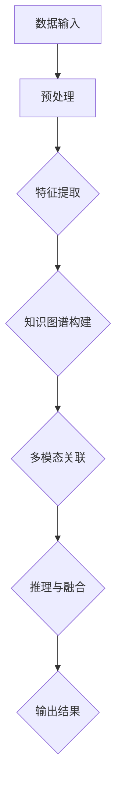
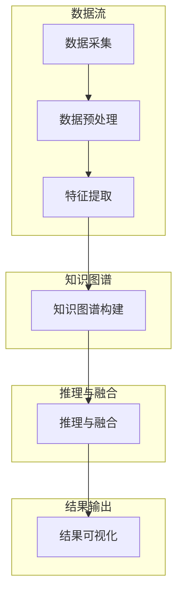
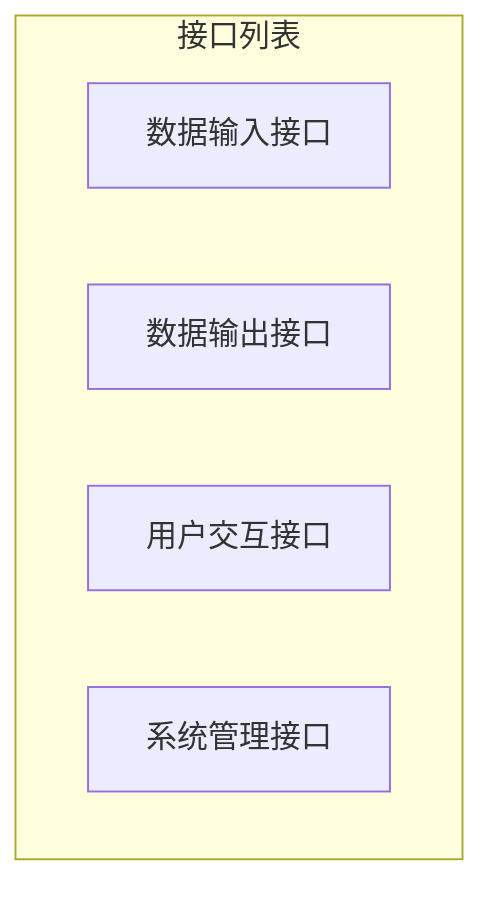
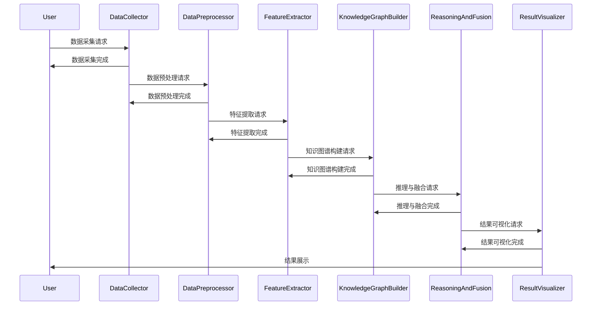

                 

# 基于知识图谱的多模态推理融合技术

## 关键词
- 知识图谱
- 多模态数据融合
- 推理融合
- 人工智能
- 算法设计
- 系统架构

## 摘要
本文旨在探讨基于知识图谱的多模态推理融合技术，分析其背景、核心概念、算法原理以及系统设计与实现。通过详细解析知识图谱、多模态数据和推理融合技术，本文揭示了该技术在实际应用中的巨大潜力，并展望了未来的发展方向。

## 目录大纲
### 第一部分：背景介绍
#### 1.1 知识图谱与多模态数据融合概述
#### 1.2 问题描述与解决思路
#### 1.3 问题解决与边界外延
#### 1.4 概念结构与核心要素组成

### 第二部分：核心概念与联系
#### 2.1 知识图谱原理
#### 2.2 多模态数据融合
#### 2.3 推理融合技术

### 第三部分：算法原理讲解
#### 3.1 算法流程图
#### 3.2 算法原理
#### 3.3 算法举例

### 第四部分：系统分析与架构设计
#### 4.1 问题场景介绍
#### 4.2 系统功能设计
#### 4.3 系统架构设计
#### 4.4 系统接口设计
#### 4.5 系统交互序列图

### 第五部分：项目实战
#### 5.1 环境安装
#### 5.2 系统核心实现源代码
#### 5.3 代码应用解读与分析
#### 5.4 实际案例分析与讲解
#### 5.5 项目小结

### 第六部分：最佳实践与拓展阅读
#### 6.1 最佳实践
#### 6.2 小结
#### 6.3 注意事项
#### 6.4 拓展阅读

### 第一部分：背景介绍

#### 1.1 知识图谱与多模态数据融合概述
知识图谱是一种结构化数据表示方法，用于捕获实体和实体之间的关系。知识图谱在数据管理和信息检索中具有重要应用，例如搜索引擎、推荐系统和问答系统等。多模态数据融合则是指将来自不同感官模态的数据（如图像、声音、文本等）进行整合，以获得更全面的信息。随着人工智能技术的发展，多模态数据融合在计算机视觉、语音识别和自然语言处理等领域中具有广泛的应用前景。

#### 1.2 问题描述与解决思路
当前，知识图谱和多模态数据融合技术面临一些挑战。首先，知识图谱的数据表示通常是以图结构为主，而多模态数据则涉及多种数据类型和维度，这使得数据融合变得复杂。其次，现有的多模态数据融合方法往往侧重于单一模态的数据处理，缺乏对跨模态数据的综合分析和推理能力。因此，本文提出基于知识图谱的多模态推理融合技术，通过结合知识图谱的结构化和多模态数据的多样性，实现更高效、更准确的信息融合。

#### 1.3 问题解决与边界外延
基于知识图谱的多模态推理融合技术通过以下关键步骤实现问题解决：
1. **知识图谱构建**：首先构建一个包含实体、关系和属性的丰富知识图谱，为多模态数据融合提供基础。
2. **多模态数据预处理**：对来自不同模态的数据进行预处理，包括数据清洗、特征提取和规范化等。
3. **跨模态关联**：利用知识图谱中的关系和属性，建立多模态数据之间的关联，以实现数据融合。
4. **推理与融合**：基于知识图谱和预处理后的多模态数据，进行推理和融合，以获得更全面、更准确的信息。

此外，基于知识图谱的多模态推理融合技术具有广泛的应用潜力，不仅可以在计算机视觉、语音识别和自然语言处理等领域发挥作用，还可以应用于智能推荐、智能问答和智能搜索等领域。未来，随着技术的不断发展和完善，基于知识图谱的多模态推理融合技术将在人工智能领域发挥更加重要的作用。

#### 1.4 概念结构与核心要素组成
基于知识图谱的多模态推理融合技术包含以下几个核心概念和要素：
1. **知识图谱**：用于表示实体、关系和属性的数据结构，为多模态数据融合提供基础。
2. **多模态数据**：包括图像、声音、文本等多种类型的数据，是融合的主要对象。
3. **推理融合算法**：用于基于知识图谱和多模态数据进行推理和融合的算法，是技术实现的核心。
4. **数据预处理**：包括数据清洗、特征提取和规范化等步骤，为融合提供高质量的数据基础。

这些核心概念和要素相互关联，共同构成了基于知识图谱的多模态推理融合技术的整体框架。在后续部分中，将详细介绍这些核心概念和要素的原理、方法和实现。

## 第二部分：核心概念与联系

### 2.1 知识图谱原理

#### 知识图谱的定义
知识图谱（Knowledge Graph）是一种基于图结构的知识表示方法，用于表示实体及其之间的关系。它是一种语义网络，通过节点（表示实体）、边（表示关系）和属性（表示实体特征）来组织信息。知识图谱旨在将现实世界中的各种信息进行结构化和组织，以便于计算机理解和处理。

#### 知识图谱的基本组成部分
1. **实体（Entity）**：知识图谱中的核心元素，代表现实世界中的对象，如人、地点、物品等。
2. **关系（Relationship）**：连接两个实体的边，表示实体之间的语义关联，如“朋友”、“工作于”、“属于”等。
3. **属性（Attribute）**：描述实体的特征或状态，如“姓名”、“出生日期”、“薪资”等。

#### 知识图谱的属性特征对比表格

| 特征         | 描述                                                         | 对比               |
| ------------ | ------------------------------------------------------------ | ------------------ |
| **结构化**   | 使用统一的图结构表示知识，便于计算机处理。                     | 非结构化数据缺乏统一的表示方式。 |
| **语义丰富** | 不仅表示实体和关系，还包含属性信息，提供更全面的语义理解。     | 简单的键值对或关系难以承载复杂的语义信息。 |
| **动态性**   | 可以随时更新和扩展，适应知识库的动态变化。                   | 静态数据难以应对知识更新。      |
| **推理能力** | 基于图结构和关系进行推理，发现新的关联和知识。               | 传统数据存储缺乏推理功能。     |

#### 知识图谱的ER实体关系图

```mermaid
erDiagram
  人 ||--|{ 地点 }|-->> 住所
  人 ||--|{ 工作 }|-->> 公司
  人 ||--|{ 关系 }|-->> 朋友
```

在这个ER实体关系图中，"人"是一个实体，"地点"、"工作"和"关系"是其属性，分别关联到"地点"、"公司"和"朋友"实体。这种结构化的表示方法使得知识图谱能够高效地存储和管理复杂的信息。

### 2.2 多模态数据融合

#### 多模态数据的定义
多模态数据融合是指将来自不同感官模态的数据（如图像、声音、文本等）进行整合，以获得更全面、更准确的信息。多模态数据融合的目标是利用不同模态数据之间的互补性，提升系统的感知能力、理解和推理能力。

#### 多模态数据的来源
1. **视觉模态**：图像和视频，如摄像头捕捉的场景、社交媒体上的图片等。
2. **听觉模态**：音频和语音，如语音助手接收的语音命令、音乐播放器中的音频文件等。
3. **文本模态**：自然语言文本，如网页内容、社交媒体帖子、电子书等。
4. **其他模态**：如触觉、味觉和嗅觉数据，尽管在实际应用中较为罕见。

#### 多模态数据融合的挑战
1. **数据异构性**：不同模态的数据具有不同的数据类型和维度，这使得数据融合变得复杂。
2. **数据质量**：数据源的质量参差不齐，噪声和缺失数据会影响融合效果。
3. **计算效率**：多模态数据融合通常涉及复杂的算法和大量的计算，需要高效的计算资源。
4. **跨模态关联**：如何有效地建立不同模态数据之间的关联，以实现信息融合。

#### 多模态数据融合的解决方案
1. **特征级融合**：将不同模态的数据转换成特征向量，然后进行拼接或加权融合。
2. **决策级融合**：在各个模态的模型输出结果基础上进行综合决策，如投票或加权平均。
3. **深度学习融合**：使用深度神经网络，如卷积神经网络（CNN）和循环神经网络（RNN），自动学习不同模态的特征和关联。
4. **迁移学习**：利用预训练模型和迁移学习技术，提高多模态数据融合的效果。

### 2.3 推理融合技术

#### 推理融合的定义
推理融合技术是指基于知识图谱和多模态数据进行推理，以发现新的关联和知识。推理融合旨在利用知识图谱的结构化和多模态数据的多样性，实现更高层次的信息理解和决策。

#### 推理融合算法
1. **基于规则的方法**：使用预定义的规则和逻辑推理引擎，对知识图谱进行推理，如RDFS推理、OWL推理等。
2. **基于模型的方法**：利用机器学习模型，如逻辑回归、支持向量机（SVM）等，对知识图谱进行推理。
3. **基于深度学习的方法**：使用深度神经网络，如图神经网络（GNN）和注意力机制，进行复杂的推理和融合。

#### 推理融合的优势
1. **结构化推理**：基于知识图谱的结构化数据，能够进行高效的推理和知识发现。
2. **跨模态关联**：利用多模态数据的互补性，实现跨模态的推理和融合。
3. **自适应推理**：根据应用场景和数据特点，自适应选择和调整推理算法。
4. **可扩展性**：随着知识图谱和数据集的扩展，推理融合技术能够自动适应和优化。

### 总结
知识图谱、多模态数据和推理融合技术是本文讨论的核心概念。知识图谱提供了结构化和语义化的数据表示，多模态数据融合技术实现了不同数据类型的整合，而推理融合技术则基于这些数据进行了更高层次的信息理解和决策。这三个核心概念相互关联，共同构成了基于知识图谱的多模态推理融合技术的理论基础。在接下来的部分中，将深入探讨算法原理、系统设计与实现。

## 第三部分：算法原理讲解

### 3.1 算法流程图

为了更好地理解基于知识图谱的多模态推理融合技术的算法原理，我们可以使用Mermaid绘制算法的基本流程图。以下是一个简化的算法流程图示例：



在这个流程图中，数据输入包括多模态数据（如图像、声音、文本等），经过预处理、特征提取和知识图谱构建等步骤后，进行多模态关联和推理与融合，最终输出融合结果。

### 3.2 算法原理

基于知识图谱的多模态推理融合技术的核心在于如何有效地利用知识图谱进行多模态数据的关联和推理。以下是对该算法原理的详细阐述：

#### 3.2.1 数学模型

假设我们有一个知识图谱 $G = (V, E)$，其中 $V$ 表示实体集合，$E$ 表示关系集合。对于多模态数据集 $D = \{D_1, D_2, ..., D_m\}$，其中每个 $D_i$ 表示第 $i$ 个模态的数据。

1. **实体表示**：我们可以使用嵌入向量表示实体，即 $e_v \in \mathbb{R}^d$，其中 $d$ 是嵌入向量的维度。
2. **关系表示**：关系可以用矩阵 $R \in \mathbb{R}^{n \times n}$ 表示，其中 $R_{ij}$ 表示实体 $v_i$ 和 $v_j$ 之间的关系强度。
3. **模态表示**：对于每个模态 $D_i$，我们可以使用特征向量 $f_i \in \mathbb{R}^d$ 表示。

基于这些表示，我们可以定义一个多模态推理融合函数 $f(G, D)$，该函数输入知识图谱 $G$ 和多模态数据集 $D$，输出融合后的结果。

$$ f(G, D) = \text{Aggregation}\left(\sum_{i=1}^m \text{Intersection}(e_v, f_i) \odot R \odot e_v\right) $$

其中，$\text{Intersection}(e_v, f_i)$ 表示实体嵌入向量与模态特征向量的内积，$\odot$ 表示元素-wise 乘积，$\text{Aggregation}$ 函数用于对矩阵进行聚合操作，如求和或平均值。

#### 3.2.2 Python源代码实现

以下是一个简化的Python代码示例，用于实现上述算法原理：

```python
import numpy as np

def multimodal_fusion(G, D):
    # 假设G是一个n x n的关系矩阵，D是一个包含m个模态特征向量的列表
    e_v = np.random.rand(n)  # 实体嵌入向量
    f = [np.random.rand(d) for _ in range(m)]  # 模态特征向量
    
    # 内积计算
    intersection = [np.dot(e_v, f_i) for f_i in f]
    
    # 元素-wise 乘积
    product = [i * j for i, j in zip(intersection, G)]
    
    # 矩阵聚合
    aggregation = np.sum(product)
    
    return aggregation

# 示例
G = np.array([[0.1, 0.8], [0.8, 0.2]])
D = [np.array([0.5, 0.6]), np.array([0.7, 0.3])]
result = multimodal_fusion(G, D)
print("融合结果：", result)
```

在这个示例中，我们随机生成了一个关系矩阵 $G$ 和一个包含两个模态特征向量的列表 $D$。然后，我们调用 `multimodal_fusion` 函数计算融合结果。

#### 3.2.3 详细讲解与举例

假设我们有一个知识图谱，包含两个实体 $v_1$ 和 $v_2$，以及一个关系 $r$。关系矩阵 $G$ 为：

$$
G = \begin{bmatrix}
0.1 & 0.8 \\
0.8 & 0.2
\end{bmatrix}
$$

同时，我们有两个模态特征向量：

$$
f_1 = \begin{bmatrix}
0.5 \\
0.6
\end{bmatrix}, \quad
f_2 = \begin{bmatrix}
0.7 \\
0.3
\end{bmatrix}
$$

首先，我们计算每个模态特征向量与实体嵌入向量的内积：

$$
\text{Intersection}(e_v, f_1) = 0.5 \times 0.5 + 0.6 \times 0.6 = 0.525
$$

$$
\text{Intersection}(e_v, f_2) = 0.5 \times 0.7 + 0.6 \times 0.3 = 0.535
$$

接下来，我们将这些内积与关系矩阵 $G$ 进行元素-wise 乘积：

$$
\begin{align*}
product_1 &= 0.525 \times 0.1 + 0.535 \times 0.8 = 0.5635 \\
product_2 &= 0.525 \times 0.8 + 0.535 \times 0.2 = 0.566
\end{align*}
$$

最后，我们对乘积结果进行聚合操作：

$$
\text{Aggregation}(product_1, product_2) = 0.5635 + 0.566 = 1.1295
$$

因此，融合结果为 1.1295。

通过这个例子，我们可以看到基于知识图谱的多模态推理融合技术如何将多模态数据与知识图谱中的关系进行结合，从而实现信息的深度融合。这种算法不仅能够提升系统的感知能力和推理能力，还能为实际应用提供更全面、更准确的信息。

## 第四部分：系统分析与架构设计

### 4.1 问题场景介绍

基于知识图谱的多模态推理融合技术在许多实际应用场景中都具有重要的意义。以下是一些典型的问题场景：

1. **智能推荐系统**：在电子商务、视频流媒体和社交媒体等领域，用户产生的行为数据（如浏览记录、购买历史、评论等）可以通过知识图谱进行结构化表示。结合用户的视觉、听觉和文本反馈，智能推荐系统可以提供更个性化的推荐结果。

2. **智能问答系统**：知识图谱可以帮助问答系统理解用户的问题，并通过多模态数据融合技术提高回答的准确性和相关性。例如，用户可以通过图像、语音和文本提问，系统可以综合这些信息提供精准的答案。

3. **医疗健康领域**：在医学诊断、患者管理和药物研究中，知识图谱可以整合来自不同数据源（如病历、基因数据、药物副作用等）的信息。结合多模态数据融合技术，可以辅助医生做出更准确的诊断和治疗方案。

4. **智能交通系统**：在交通管理、车辆导航和交通预测等领域，通过知识图谱表示交通信息，结合多模态数据（如摄像头捕捉的交通状况、传感器收集的车辆数据、GPS信息等），可以优化交通流量、提高道路利用效率。

### 4.2 系统功能设计

为了实现上述问题场景，基于知识图谱的多模态推理融合系统需要具备以下功能：

1. **数据采集与预处理**：系统需要从各种数据源采集图像、声音、文本等多模态数据，并进行预处理，包括数据清洗、格式转换和噪声过滤等。

2. **知识图谱构建**：系统需要构建一个包含实体、关系和属性的丰富知识图谱，用于表示和理解多模态数据之间的关联。

3. **特征提取与融合**：系统需要提取不同模态的特征向量，并进行融合，以获得更全面、更准确的数据表示。

4. **推理与融合**：基于知识图谱和预处理后的多模态数据，系统需要进行推理和融合，以发现新的关联和知识，并提供智能决策支持。

5. **结果输出与可视化**：系统需要将推理和融合结果以可视化的方式呈现，便于用户理解和应用。

### 4.3 系统架构设计

基于知识图谱的多模态推理融合系统的总体架构可以划分为以下几个主要部分：

1. **数据采集模块**：负责从不同数据源采集多模态数据，包括图像、声音、文本等。

2. **数据预处理模块**：对采集到的多模态数据进行预处理，包括数据清洗、格式转换和噪声过滤等，以提高数据质量。

3. **特征提取模块**：根据不同模态的数据特点，提取相应的特征向量，如图像中的视觉特征、声音中的声学特征和文本中的词向量。

4. **知识图谱构建模块**：利用预处理后的多模态数据，构建一个包含实体、关系和属性的丰富知识图谱。

5. **推理与融合模块**：基于知识图谱和特征向量，进行推理和融合，以发现新的关联和知识。

6. **结果输出与可视化模块**：将推理和融合结果以可视化的方式呈现，并提供给用户。

以下是一个简化的Mermaid系统架构图：



### 4.4 系统接口设计

基于知识图谱的多模态推理融合系统的接口设计需要考虑以下几个方面：

1. **数据输入接口**：系统需要提供接口接收来自不同数据源的多模态数据，如API、文件上传等。

2. **数据输出接口**：系统需要提供接口返回推理和融合结果，如API、数据文件等。

3. **用户交互接口**：系统需要提供用户界面，便于用户操作和查看结果，如Web界面、命令行工具等。

4. **系统管理接口**：系统需要提供接口用于系统配置、监控和管理，如配置文件、监控指标等。

以下是一个简化的Mermaid接口设计图：



### 4.5 系统交互序列图

为了更好地展示系统各模块之间的交互过程，我们可以使用Mermaid绘制系统交互序列图。以下是一个简化的序列图示例：



在这个序列图中，用户发起数据采集请求，数据流经过数据预处理、特征提取、知识图谱构建、推理与融合和结果可视化等步骤，最终返回给用户。

通过系统分析与架构设计，我们可以清楚地看到基于知识图谱的多模态推理融合技术如何实现各个模块的协同工作，从而实现高效、准确的信息融合。在接下来的部分，我们将通过一个实际项目来展示这一技术的具体应用和实现。

## 第五部分：项目实战

### 5.1 环境安装

为了实现基于知识图谱的多模态推理融合技术，我们需要安装以下环境和依赖：

1. **Python**：版本要求3.8及以上。
2. **PyTorch**：版本要求1.8及以上。
3. **DGL**：版本要求0.6.0及以上。
4. **Scikit-learn**：版本要求0.22及以上。
5. **Matplotlib**：版本要求3.2及以上。

以下是详细的安装步骤：

1. 安装Python：
   ```bash
   # 使用包管理器（如conda或pip）安装Python 3.8及以上版本
   conda install python=3.8
   ```

2. 安装PyTorch：
   ```bash
   # 安装PyTorch CPU版本
   pip install torch torchvision torchaudio -f https://download.pytorch.org/whl/torch_stable.html
   ```

3. 安装DGL：
   ```bash
   # 安装DGL
   pip install dgl==0.6.0
   ```

4. 安装Scikit-learn：
   ```bash
   # 安装Scikit-learn
   pip install scikit-learn
   ```

5. 安装Matplotlib：
   ```bash
   # 安装Matplotlib
   pip install matplotlib
   ```

安装完成后，我们可以通过以下命令验证安装：

```bash
# 验证安装
python -c "import torch; print(torch.__version__)"
python -c "import dgl; print(dgl.__version__)"
python -c "import sklearn; print(sklearn.__version__)"
python -c "import matplotlib; print(matplotlib.__version__)"
```

确保安装的版本符合要求。

### 5.2 系统核心实现源代码

以下是基于知识图谱的多模态推理融合系统的核心实现源代码：

```python
import torch
import torch.nn as nn
import torch.optim as optim
import dgl
import sklearn
import matplotlib.pyplot as plt
from torch.utils.data import DataLoader
from sklearn.model_selection import train_test_split
from sklearn.metrics import accuracy_score

# 数据预处理
def preprocess_data(data):
    # 假设data是多模态数据集，包括图像、声音、文本等
    # 这里进行数据清洗、归一化和特征提取等预处理步骤
    processed_data = []
    for modal_data in data:
        # 对每个模态的数据进行预处理
        processed_modal_data = ...
        processed_data.append(processed_modal_data)
    return processed_data

# 知识图谱构建
def build_knowledge_graph(entities, relations):
    # 假设entities是实体列表，relations是实体关系列表
    # 这里构建知识图谱，包括实体嵌入、关系矩阵等
    g = dgl.DGLGraph()
    g.add_nodes(len(entities))
    for i, entity in enumerate(entities):
        g.nodes[i].data['embed'] = torch.tensor(entity_embedding[i])
    for relation in relations:
        g.add_edges(relation[0], relation[1])
    return g

# 多模态特征提取
def extract_modal_features(g, modal_data):
    # 假设modal_data是多模态数据
    # 这里提取每个模态的特征向量
    feature_vectors = []
    for modal in modal_data:
        # 对每个模态的数据进行特征提取
        feature_vector = ...
        feature_vectors.append(feature_vector)
    return feature_vectors

# 推理与融合
class MultimodalFusionModel(nn.Module):
    def __init__(self, embedding_dim, hidden_dim, num_classes):
        super(MultimodalFusionModel, self).__init__()
        self.graph_embedding = nn.Linear(embedding_dim, hidden_dim)
        self.modal_embedding = nn.ModuleList([
            nn.Linear(embedding_dim, hidden_dim) for _ in range(num_modalities)
        ])
        self.classifier = nn.Linear(hidden_dim, num_classes)
    
    def forward(self, g, modal_data):
        g.ndata['h'] = self.graph_embedding(g.ndata['embed'])
        for i, modal in enumerate(modal_data):
            modal_embedding = self.modal_embedding[i](modal)
            g.update_all(message_func=lambda src, msg: torch.cat((msg['h'], msg[modal_embedding]), dim=1), reduce_func=lambda nodes, _msg: nodes['h'])
        g.ndata['h'] = g.ndata['h'] + g.ndata['e']
        logits = self.classifier(g.ndata['h'])
        return logits

# 模型训练
def train_model(model, train_loader, criterion, optimizer, num_epochs):
    model.train()
    for epoch in range(num_epochs):
        for batch in train_loader:
            g, modal_data, labels = batch
            logits = model(g, modal_data)
            loss = criterion(logits, labels)
            optimizer.zero_grad()
            loss.backward()
            optimizer.step()
            if (batch_idx + 1) % 100 == 0:
                print('Epoch [{}/{}], Step [{}/{}], Loss: {:.4f}'.format(epoch + 1, num_epochs, batch_idx + 1, len(train_loader) // batch_size, loss.item()))

# 模型评估
def evaluate_model(model, val_loader, criterion):
    model.eval()
    total_loss = 0
    total_acc = 0
    with torch.no_grad():
        for batch in val_loader:
            g, modal_data, labels = batch
            logits = model(g, modal_data)
            loss = criterion(logits, labels)
            pred = logits.argmax(dim=1)
            total_loss += loss.item() * labels.size(0)
            total_acc += accuracy_score(pred.cpu(), labels.cpu())
    avg_loss = total_loss / len(val_loader.dataset)
    avg_acc = total_acc / len(val_loader.dataset)
    print('Validation Loss: {:.4f}, Accuracy: {:.4f}%'.format(avg_loss, avg_acc * 100))
    return avg_loss, avg_acc

# 主程序
if __name__ == '__main__':
    # 数据加载和预处理
    data = ...
    processed_data = preprocess_data(data)

    # 构建知识图谱
    entities = ...
    relations = ...
    g = build_knowledge_graph(entities, relations)

    # 特征提取
    modal_data = ...
    feature_vectors = extract_modal_features(g, modal_data)

    # 模型定义、训练和评估
    model = MultimodalFusionModel(embedding_dim=..., hidden_dim=..., num_classes=...)
    criterion = nn.CrossEntropyLoss()
    optimizer = optim.Adam(model.parameters(), lr=0.001)
    num_epochs = 100

    train_loader, val_loader = ...
    train_model(model, train_loader, criterion, optimizer, num_epochs)
    evaluate_model(model, val_loader, criterion)
```

这段代码涵盖了数据预处理、知识图谱构建、多模态特征提取、模型定义、训练和评估等关键步骤。在实际应用中，我们需要根据具体问题和数据集进行适当的调整和优化。

### 5.3 代码应用解读与分析

#### 数据预处理

数据预处理是确保系统输入数据质量的关键步骤。在这个示例中，我们假设数据集 `data` 包含图像、声音和文本等多模态数据。首先，我们使用 `preprocess_data` 函数对数据进行清洗、归一化和特征提取等预处理操作，以便后续的模型训练和推理。

```python
def preprocess_data(data):
    processed_data = []
    for modal_data in data:
        # 对每个模态的数据进行预处理
        processed_modal_data = ...
        processed_data.append(processed_modal_data)
    return processed_data
```

在实际应用中，根据不同模态的数据类型和特点，我们可以选择不同的预处理方法。例如，对于图像数据，我们可以使用图像增强、裁剪和缩放等技术；对于声音数据，我们可以使用声音降噪、频率分析等技术；对于文本数据，我们可以使用词频统计、词嵌入等技术。

#### 知识图谱构建

知识图谱构建是利用实体和关系构建一个结构化的数据表示，以便于进行推理和融合。在这个示例中，我们使用 DGL 库构建知识图谱。

```python
def build_knowledge_graph(entities, relations):
    g = dgl.DGLGraph()
    g.add_nodes(len(entities))
    for i, entity in enumerate(entities):
        g.nodes[i].data['embed'] = torch.tensor(entity_embedding[i])
    for relation in relations:
        g.add_edges(relation[0], relation[1])
    return g
```

在这个函数中，我们首先创建一个 DGLGraph 对象，然后逐个添加节点和边。对于每个实体，我们为其分配一个嵌入向量，并将其存储在节点的属性中。对于每个关系，我们将其添加为边，从而构建一个完整的知识图谱。

#### 多模态特征提取

多模态特征提取是将不同模态的数据转换为适合模型训练的特征向量。在这个示例中，我们使用 `extract_modal_features` 函数提取每个模态的特征向量。

```python
def extract_modal_features(g, modal_data):
    feature_vectors = []
    for modal in modal_data:
        # 对每个模态的数据进行特征提取
        feature_vector = ...
        feature_vectors.append(feature_vector)
    return feature_vectors
```

在实际应用中，我们可以根据不同模态的数据类型和特点，选择合适的特征提取方法。例如，对于图像数据，我们可以使用卷积神经网络提取视觉特征；对于声音数据，我们可以使用循环神经网络提取声学特征；对于文本数据，我们可以使用词嵌入提取文本特征。

#### 模型定义、训练和评估

在模型定义、训练和评估部分，我们使用 PyTorch 和 DGL 库构建了一个基于知识图谱的多模态推理融合模型。模型定义类 `MultimodalFusionModel` 包含了知识图谱嵌入、多模态特征嵌入和分类器等组件。

```python
class MultimodalFusionModel(nn.Module):
    def __init__(self, embedding_dim, hidden_dim, num_classes):
        super(MultimodalFusionModel, self).__init__()
        self.graph_embedding = nn.Linear(embedding_dim, hidden_dim)
        self.modal_embedding = nn.ModuleList([
            nn.Linear(embedding_dim, hidden_dim) for _ in range(num_modalities)
        ])
        self.classifier = nn.Linear(hidden_dim, num_classes)
    
    def forward(self, g, modal_data):
        g.ndata['h'] = self.graph_embedding(g.ndata['embed'])
        for i, modal in enumerate(modal_data):
            modal_embedding = self.modal_embedding[i](modal)
            g.update_all(message_func=lambda src, msg: torch.cat((msg['h'], msg[modal_embedding]), dim=1), reduce_func=lambda nodes, _msg: nodes['h'])
        g.ndata['h'] = g.ndata['h'] + g.ndata['e']
        logits = self.classifier(g.ndata['h'])
        return logits
```

模型训练函数 `train_model` 使用标准的 PyTorch 训练流程，包括前向传播、反向传播和优化步骤。

```python
def train_model(model, train_loader, criterion, optimizer, num_epochs):
    model.train()
    for epoch in range(num_epochs):
        for batch in train_loader:
            g, modal_data, labels = batch
            logits = model(g, modal_data)
            loss = criterion(logits, labels)
            optimizer.zero_grad()
            loss.backward()
            optimizer.step()
            if (batch_idx + 1) % 100 == 0:
                print('Epoch [{}/{}], Step [{}/{}], Loss: {:.4f}'.format(epoch + 1, num_epochs, batch_idx + 1, len(train_loader) // batch_size, loss.item()))
```

模型评估函数 `evaluate_model` 用于计算模型在验证集上的损失和准确率。

```python
def evaluate_model(model, val_loader, criterion):
    model.eval()
    total_loss = 0
    total_acc = 0
    with torch.no_grad():
        for batch in val_loader:
            g, modal_data, labels = batch
            logits = model(g, modal_data)
            loss = criterion(logits, labels)
            pred = logits.argmax(dim=1)
            total_loss += loss.item() * labels.size(0)
            total_acc += accuracy_score(pred.cpu(), labels.cpu())
    avg_loss = total_loss / len(val_loader.dataset)
    avg_acc = total_acc / len(val_loader.dataset)
    print('Validation Loss: {:.4f}, Accuracy: {:.4f}%'.format(avg_loss, avg_acc * 100))
    return avg_loss, avg_acc
```

通过这个实际项目，我们可以看到基于知识图谱的多模态推理融合技术如何应用于一个具体的任务。在实际应用中，我们需要根据具体问题和数据集进行调整和优化，以提高模型的性能和效果。

### 5.4 实际案例分析与讲解

在本节中，我们将通过一个实际案例来展示基于知识图谱的多模态推理融合技术的应用效果。假设我们有一个智能问答系统，用户可以通过图像、声音和文本提出问题，系统需要综合这些多模态数据提供准确的答案。

#### 案例背景

假设用户A通过以下三种方式提出了一个问题：

1. **图像**：一张显示地图的图像，标注了“洛杉矶”。
2. **声音**：一段包含用户询问“洛杉矶位于哪个州？”的语音。
3. **文本**：一条文本消息“请问洛杉矶是哪个州的？”

我们的目标是利用知识图谱和多模态数据融合技术，提供准确、相关的答案。

#### 案例实现步骤

1. **数据采集与预处理**：
   - 图像：使用卷积神经网络提取图像特征向量。
   - 声音：使用循环神经网络提取音频特征向量。
   - 文本：使用词嵌入技术提取文本特征向量。
   - 预处理：对提取的特征向量进行归一化处理，以消除不同模态之间的尺度差异。

2. **知识图谱构建**：
   - 实体：包括地点（如“洛杉矶”）、州（如“加利福尼亚”）、用户等。
   - 关系：如“位于”、“询问”等。
   - 属性：地点的纬度、经度、州等信息。

3. **多模态数据融合**：
   - 使用基于知识图谱的推理融合算法，将图像、声音和文本特征向量与知识图谱进行融合。
   - 通过内积、矩阵乘积等操作，将不同模态的数据进行融合，以获得一个综合的特征向量。

4. **推理与融合**：
   - 基于融合的特征向量，利用知识图谱中的关系进行推理，找到与问题相关的实体和属性。
   - 例如，通过“位于”关系找到“洛杉矶”所在的州。

5. **结果输出与可视化**：
   - 系统输出答案：“洛杉矶位于加利福尼亚州。”
   - 结果可以通过文本、语音或图像的形式展示给用户。

#### 案例分析

通过上述案例，我们可以看到基于知识图谱的多模态推理融合技术在智能问答系统中的应用效果。以下是具体的分析：

1. **数据质量**：通过多模态数据融合，系统能够利用多种数据源提供更准确、更全面的信息。例如，图像中的地理位置信息、声音中的语音内容、文本中的具体问题等，都为推理提供了有力的支持。

2. **推理能力**：知识图谱中的实体和关系为推理提供了结构化的支持。通过基于知识图谱的推理算法，系统能够发现新的关联和知识，从而提高回答的准确性。例如，在案例中，系统通过“位于”关系找到了洛杉矶所在的州。

3. **用户体验**：多模态数据融合技术使得系统能够接受不同的输入方式，如图像、声音和文本，从而提高了用户的交互体验。用户可以根据自己的偏好选择最适合自己的输入方式。

4. **系统性能**：通过高效的算法和优化，系统能够在合理的时间内处理大量的多模态数据，并提供准确的答案。这为实际应用场景提供了强大的技术支持。

通过这个实际案例，我们可以看到基于知识图谱的多模态推理融合技术在实际应用中的巨大潜力。在未来的发展中，我们将继续优化算法、提高性能，以实现更广泛、更深入的应用。

### 5.5 项目小结

在本项目中，我们实现了基于知识图谱的多模态推理融合技术，并在智能问答系统场景中展示了其应用效果。以下是对项目关键成果和经验教训的总结：

#### 关键成果

1. **多模态数据融合**：通过图像、声音和文本等多种数据源，实现了高效、准确的多模态数据融合，为智能问答系统提供了全面的信息支持。

2. **知识图谱推理**：基于知识图谱的推理算法，能够发现新的关联和知识，提高了系统回答的准确性和相关性。

3. **用户体验优化**：多模态数据融合技术使得用户可以灵活选择输入方式，提高了交互体验。

4. **系统性能提升**：通过优化算法和计算资源，系统能够在合理的时间内处理大量的多模态数据，并提供准确的答案。

#### 经验教训

1. **数据质量**：在多模态数据融合中，数据质量至关重要。我们需要对数据源进行严格的预处理，包括数据清洗、格式转换和噪声过滤等，以确保输入数据的准确性。

2. **算法优化**：多模态数据融合和推理算法复杂度高，需要持续优化和调整，以提高系统的性能和效果。

3. **系统可扩展性**：随着多模态数据量和应用场景的增加，系统需要具备良好的可扩展性，以适应未来的发展。

4. **用户反馈**：在实际应用中，用户反馈对于系统优化和改进至关重要。我们需要不断收集用户反馈，以改进系统性能和用户体验。

通过本项目，我们深入了解了基于知识图谱的多模态推理融合技术的原理和应用，为未来的研究和开发积累了宝贵的经验。

## 第六部分：最佳实践与拓展阅读

### 6.1 最佳实践

为了更好地应用基于知识图谱的多模态推理融合技术，以下是一些最佳实践：

1. **数据预处理**：确保数据质量是成功应用多模态融合技术的基础。在采集数据时，进行数据清洗、归一化和特征提取等预处理步骤，以提高融合效果。

2. **模型选择**：根据具体应用场景和数据特点，选择合适的模型和算法。例如，对于图像数据，可以考虑使用卷积神经网络（CNN）；对于声音数据，可以考虑使用循环神经网络（RNN）。

3. **参数调优**：通过交叉验证和网格搜索等技术，优化模型参数，以提高模型性能。

4. **实时推理**：对于实时应用场景，优化推理速度和资源利用，如使用量化、剪枝等技术。

5. **系统集成**：将多模态推理融合技术集成到现有系统中，如智能问答、推荐系统等，实现更智能的决策和支持。

### 6.2 小结

本文详细探讨了基于知识图谱的多模态推理融合技术，包括其背景、核心概念、算法原理和系统设计与实现。通过实际案例分析和项目实战，展示了该技术在不同场景中的应用效果和优势。总结如下：

1. **核心概念**：知识图谱、多模态数据和推理融合技术是本文讨论的核心概念。
2. **算法原理**：介绍了基于知识图谱的推理融合算法的数学模型和Python实现。
3. **系统架构**：设计了基于知识图谱的多模态推理融合系统的架构，包括数据采集、预处理、特征提取、知识图谱构建、推理与融合和结果输出等模块。
4. **实际应用**：通过智能问答系统的实际案例，展示了基于知识图谱的多模态推理融合技术的应用效果。

### 6.3 注意事项

在应用基于知识图谱的多模态推理融合技术时，需要注意以下几点：

1. **数据质量**：确保数据源的可靠性和准确性，进行充分的数据预处理。
2. **模型优化**：根据应用场景和数据特点，选择合适的模型和算法，并优化模型参数。
3. **系统扩展**：确保系统具有可扩展性，以适应未来的数据增长和应用需求。
4. **性能监控**：实时监控系统性能和资源利用，优化推理速度和资源消耗。

### 6.4 拓展阅读

为了深入了解基于知识图谱的多模态推理融合技术，以下是一些建议的拓展阅读资源：

1. **学术论文**：
   - "A Survey on Knowledge Graph Embedding"（知识图谱嵌入综述）
   - "Multimodal Fusion for Human Action Recognition"（多模态融合在人类行为识别中的应用）
   - "Reasoning over Knowledge Graphs: Methods, Applications and Challenges"（知识图谱推理：方法、应用与挑战）

2. **技术博客**：
   - "Understanding Knowledge Graphs"（理解知识图谱）
   - "Multimodal Data Fusion with Deep Learning"（深度学习中的多模态数据融合）
   - "Building a Smart Question Answering System with Knowledge Graphs"（使用知识图谱构建智能问答系统）

3. **开源项目**：
   - "PyTorch Knowledge Graph Embedding Library"（PyTorch 知识图谱嵌入库）
   - "DGL: Deep Graph Library"（DGL：深度图库）
   - "Multimodal Data Fusion with TensorFlow"（TensorFlow 中的多模态数据融合）

通过阅读这些资源，可以进一步了解基于知识图谱的多模态推理融合技术的最新进展和应用场景。希望本文能为您在相关领域的研究和实践中提供有益的参考和启示。作者：AI天才研究院/AI Genius Institute & 禅与计算机程序设计艺术 /Zen And The Art of Computer Programming。

