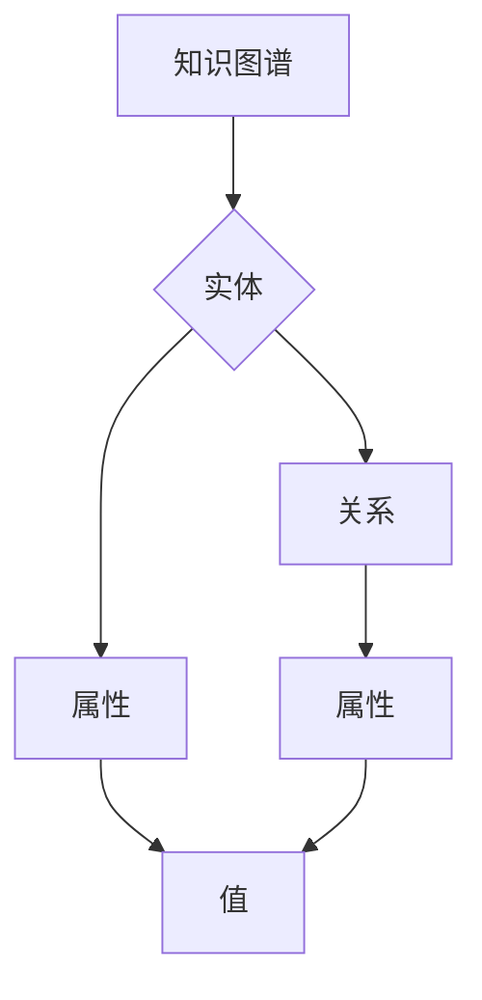
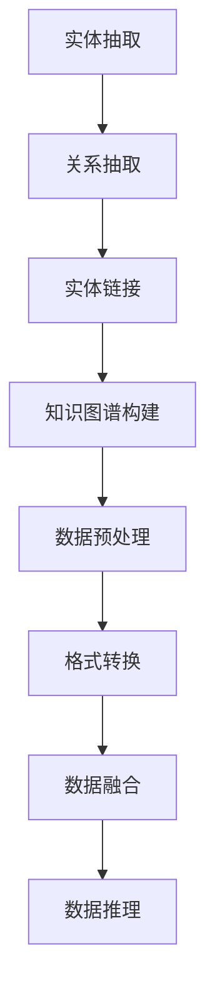
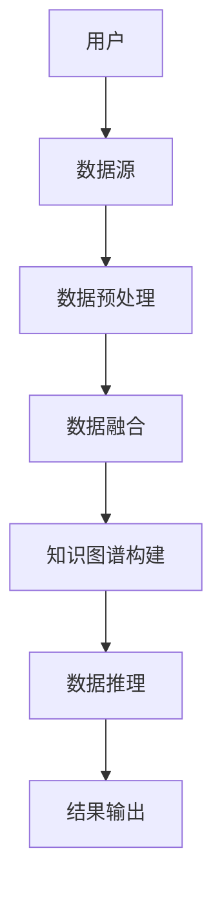
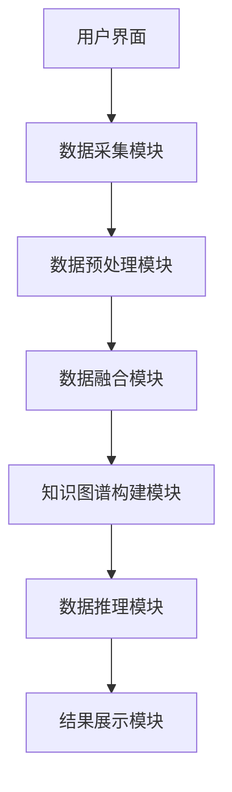
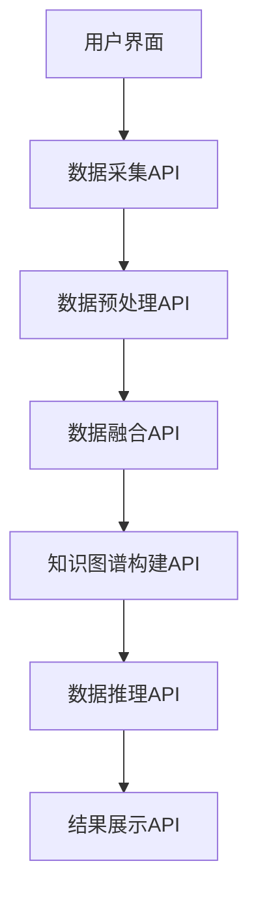
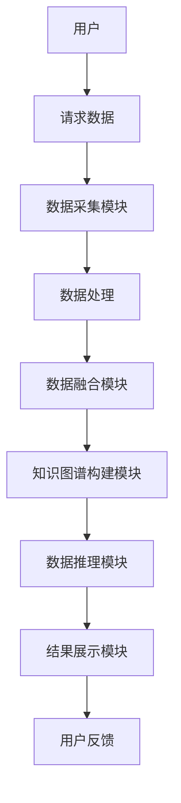

                 

### 基于知识图谱的多源异构数据推理融合

> 关键词：知识图谱，多源异构数据，数据融合，数据推理，人工智能

> 摘要：本文探讨了基于知识图谱的多源异构数据推理融合技术，分析了其背景、核心概念、算法原理以及实际应用，为数据科学和人工智能领域提供了新的解决思路。

## 第一部分：背景与核心概念

### 第1章 问题背景与问题描述

#### 1.1 问题背景

在当今信息化社会，数据已成为重要的战略资源。随着大数据技术的发展，多源异构数据融合已经成为数据科学和人工智能领域的关键挑战。多源异构数据是指来自不同数据源、结构、格式和类型的数据，如文本、图像、音频、地理空间数据等。如何有效融合这些数据，并从中提取有价值的信息，是实现智能化应用的关键。

#### 1.2 问题描述

多源异构数据融合面临的主要问题包括：

- **数据源多样性**：不同数据源的数据结构和格式各异，如何统一格式和结构是首要问题。
- **数据质量**：数据源的不一致性导致数据质量参差不齐，如何处理数据噪声和错误是关键问题。
- **数据关联与推理**：多源异构数据之间存在复杂的关联关系，如何有效挖掘和利用这些关系是核心问题。

### 第2章 问题解决与边界外延

#### 2.1 问题解决思路

基于知识图谱的多源异构数据推理融合提供了一种有效的解决方案。知识图谱是一种结构化数据表示方法，通过实体、属性和关系的表示，将多源异构数据统一到一个统一的语义空间中。以下章节将详细探讨知识图谱的构建、多源异构数据的融合以及推理融合的方法和算法。

#### 2.2 边界与外延

- **知识图谱**：知识图谱的构建方法、更新策略和应用场景。
- **多源异构数据**：数据的预处理、格式转换和统一表示方法。
- **数据融合**：数据融合的策略、算法和评估方法。
- **数据推理**：基于知识图谱的推理方法、逻辑推理和图论推理。

## 第二部分：核心概念与原理

### 第3章 核心概念原理

#### 3.1 知识图谱概念

知识图谱是一种通过实体、属性和关系描述现实世界的图形化数据表示方法。其核心在于将分散、异构的数据整合到统一的语义空间中，从而实现数据的关联和推理。

#### 3.2 多源异构数据概念

多源异构数据是指来自不同数据源、具有不同结构、格式和类型的数据。多源异构数据的处理需要解决数据格式的统一、数据质量的保证和数据关联的挖掘等问题。

#### 3.3 数据融合概念

数据融合是将来自多个数据源的数据进行整合，形成统一视图的过程。数据融合的目标是提高数据质量，降低数据冗余，实现数据的综合利用。

### 第4章 概念属性特征对比表格

| 概念       | 特征1      | 特征2      | 特征3      |
|------------|------------|------------|------------|
| 知识图谱   | 结构化表示 | 实体关系   | 语义关联   |
| 多源异构数据 | 多样性     | 数据格式异构 | 数据类型异构 |
| 数据融合   | 数据整合   | 数据质量提升 | 数据综合利用 |

### 第5章 ER实体关系图架构



## 第三部分：算法原理与实现

### 第6章 算法原理讲解

#### 6.1 知识图谱构建算法

知识图谱的构建主要包括实体抽取、关系抽取和实体链接三个步骤。

- **实体抽取**：从原始数据中识别出实体。
- **关系抽取**：识别出实体之间的关系。
- **实体链接**：将抽取到的实体映射到统一的实体库中。

#### 6.2 多源异构数据融合算法

多源异构数据融合算法包括数据预处理、格式转换和统一表示方法。常用的方法有映射关系建立、数据映射和融合规则制定。

- **数据预处理**：清洗和标准化数据。
- **格式转换**：将不同格式的数据转换为统一的格式。
- **统一表示方法**：将多源数据表示为统一的模型，如RDF（资源描述框架）。

#### 6.3 数据推理算法

数据推理算法主要包括逻辑推理和图论推理。逻辑推理基于一阶谓词逻辑进行推理，图论推理基于图的结构进行推理。

- **逻辑推理**：基于谓词逻辑进行推理，如满足一定条件的实体和关系。
- **图论推理**：基于图的性质进行推理，如最短路径、最大团等。

### 第7章 Python源代码与算法流程图

```python
# 简单的Python示例代码
def knowledge_graph_Construction(entities, relations):
    # 实体和关系的处理逻辑
    pass

def data_fusion(data1, data2):
    # 数据融合逻辑
    pass

def data_reasoning(knowledge_graph):
    # 数据推理逻辑
    pass
```



## 第四部分：系统分析与架构设计

### 第8章 系统功能设计

#### 8.1 领域模型



#### 8.2 系统架构设计



#### 8.3 系统接口设计



#### 8.4 系统交互



## 第五部分：项目实战

### 第9章 环境安装与系统核心实现

#### 9.1 环境安装

- 安装Python环境
- 安装必要的库，如Numpy、Pandas、NetworkX、RDFLib等

#### 9.2 系统核心实现

```python
# 数据采集
def collect_data():
    pass

# 数据预处理
def preprocess_data(data):
    pass

# 数据融合
def fuse_data(data1, data2):
    pass

# 知识图谱构建
def build_knowledge_graph(entities, relations):
    pass

# 数据推理
def reason_data(knowledge_graph):
    pass
```

### 第10章 代码应用解读与分析

#### 10.1 代码解读

- 分析代码的功能和逻辑
- 解析关键函数和参数

#### 10.2 分析与讨论

- 讨论代码的性能和优化
- 分析代码在实际应用中的效果

### 第11章 实际案例分析与详细讲解剖析

#### 11.1 案例背景

- 描述案例背景和目标
- 分析案例中的数据源和结构

#### 11.2 案例实现

- 实现案例中的数据采集、预处理、融合和推理过程
- 分析案例的实现效果和优化空间

#### 11.3 案例剖析

- 深入剖析案例中的技术细节
- 讨论案例的实际应用价值和挑战

## 第六部分：最佳实践与项目小结

### 第12章 最佳实践 tips

- 总结项目中的最佳实践
- 提供使用知识图谱和多源异构数据推理融合技术的建议

### 第13章 小结

- 总结文章的主要内容和收获
- 强调基于知识图谱的多源异构数据推理融合的重要性

### 第14章 注意事项

- 提醒读者在应用技术时需要注意的问题
- 分析潜在的风险和挑战

### 第15章 拓展阅读

- 推荐相关的书籍、文章和资源
- 鼓励读者深入了解相关技术

## 致谢

- 感谢所有支持和帮助的人
- 表达对读者和团队的支持与感谢

### 作者

- **作者：AI天才研究院/AI Genius Institute & 禅与计算机程序设计艺术 /Zen And The Art of Computer Programming**

