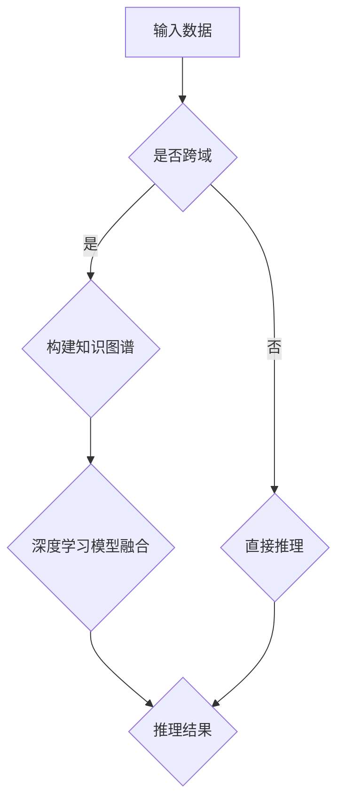
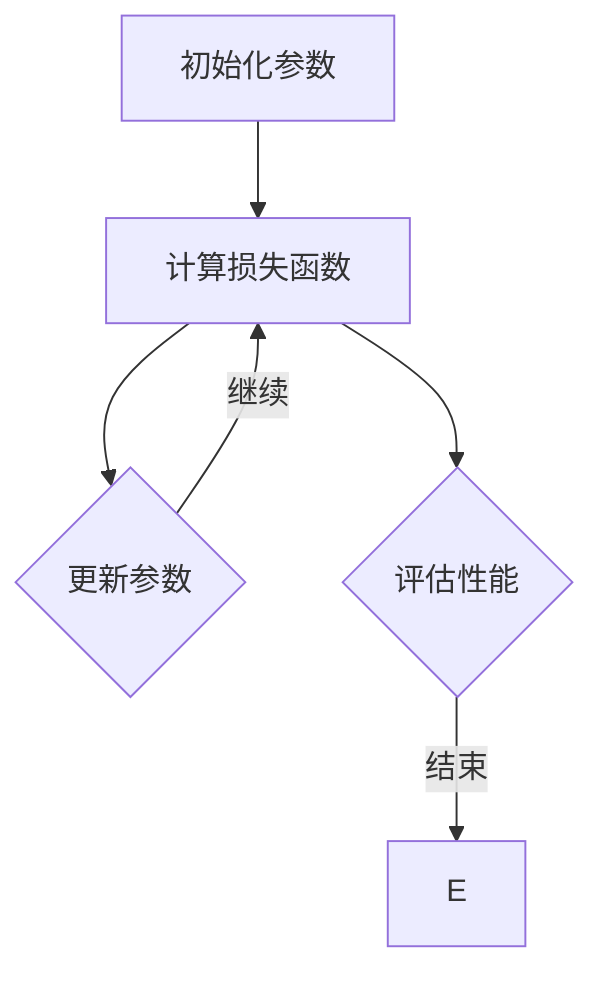
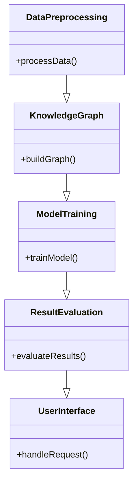
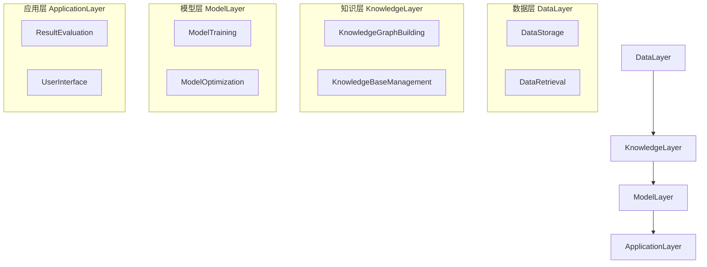

                 

### 第一步：背景介绍

#### 跨域推理能力的意义
跨域推理能力是人工智能领域中的一个重要研究方向，其核心在于如何使机器在不同领域间进行推理和决策。这种能力不仅可以帮助机器更好地理解和适应复杂多变的环境，还能在多领域知识融合、跨领域应用创新等方面发挥巨大作用。随着互联网和大数据的快速发展，跨域推理能力的重要性日益凸显。

#### 跨域推理能力的挑战
然而，跨域推理能力也面临着诸多挑战。首先，不同领域间的数据往往存在差异，包括数据格式、特征表达和知识结构等，这使得知识迁移变得困难。其次，不同领域的模型可能存在较大的差异性，难以直接进行融合和适配。此外，适应性调整也是一大难题，因为机器需要实时根据新环境和新任务进行调整，以保证推理结果的准确性和效率。

#### 动态优化框架的设计思路
为了解决上述挑战，我们提出了基于知识图谱的跨域推理能力动态优化框架。该框架旨在通过知识图谱技术实现知识迁移，利用深度学习模型进行模型融合，并通过自适应调整机制提升跨域推理能力。具体来说，该框架包括以下核心思路：

1. **知识图谱构建**：通过知识抽取和关系挖掘技术，构建涵盖多个领域的知识图谱，为跨域推理提供知识基础。
2. **模型融合**：利用深度学习技术，将不同领域的模型进行融合，以实现跨领域的推理能力。
3. **适应性调整**：通过实时反馈机制和优化目标函数，对模型参数进行动态调整，以适应不同领域的需求。

#### 动态优化框架的核心方法
动态优化框架的核心方法包括：

1. **多任务学习**：通过多任务学习，将不同领域的任务整合到同一个模型中进行训练，以实现模型融合。
2. **在线学习**：利用在线学习机制，实时更新模型参数，以适应动态环境。
3. **优化目标函数**：通过设计优化目标函数，如损失函数和权重调整函数，提高跨域推理能力。

### 1.3.1 动态优化框架的设计思路

为了应对跨域推理能力面临的挑战，我们提出了一个基于知识图谱的动态优化框架。该框架的核心设计思路可以分为以下几个关键步骤：

#### 1. 知识图谱的构建
首先，构建一个多领域的知识图谱。知识图谱是一种语义网络，它将实体、概念和关系表示为图结构，使得不同领域的数据能够以统一的形式进行存储和表示。知识图谱的构建过程通常包括知识抽取、实体识别、关系抽取和知识融合等步骤。通过这些步骤，我们可以将各个领域的知识整合到一个统一的框架下，为跨域推理提供基础。

#### 2. 知识迁移与模型融合
在知识图谱构建完成后，我们利用深度学习技术实现知识迁移和模型融合。具体来说，我们可以通过多任务学习（Multi-Task Learning, MTL）的方法，将不同领域的任务映射到一个共享的神经网络中。这样，神经网络可以通过学习多个任务之间的关系，实现不同领域模型之间的融合。此外，还可以利用图神经网络（Graph Neural Networks, GNN）来直接对知识图谱进行建模，进一步强化跨域推理能力。

#### 3. 自适应调整机制
为了提高跨域推理能力的适应性和准确性，我们需要引入自适应调整机制。具体来说，可以通过以下几种方法实现：

1. **在线学习**：在线学习允许模型在数据流中不断更新，以适应新的任务和环境。通过在线学习，模型可以实时获取新的信息，并调整自身的参数，以更好地适应新的挑战。

2. **强化学习**：强化学习是一种通过试错来学习最优策略的方法。在跨域推理中，我们可以利用强化学习来调整模型的行为，使其能够在复杂环境中做出更好的决策。

3. **自适应优化算法**：自适应优化算法可以根据模型的表现动态调整优化参数，如学习率、正则化参数等。这样，模型可以在不同的任务和数据集上表现出更好的泛化能力。

#### 4. 实时反馈与性能评估
为了确保动态优化框架的有效性，我们需要引入实时反馈机制和性能评估方法。具体来说，可以通过以下步骤实现：

1. **实时反馈**：在模型运行过程中，收集实时数据，如推理结果、系统性能指标等。这些数据可以用来评估模型的表现，并指导进一步的调整。

2. **性能评估**：通过设计一系列的性能评估指标，如准确率、召回率、F1分数等，对模型的表现进行定量评估。这些指标可以帮助我们了解模型的性能，并发现潜在的优化空间。

#### 5. 模型部署与维护
最后，我们需要将动态优化框架部署到实际应用场景中，并进行持续的维护和优化。具体来说，可以通过以下步骤实现：

1. **模型部署**：将训练好的模型部署到生产环境中，以实现跨域推理的自动化和高效化。

2. **模型维护**：定期更新知识图谱和模型参数，以适应新的数据和应用场景。

3. **模型监控**：通过监控系统的运行状态和性能指标，及时发现并解决问题，确保模型的高效稳定运行。

### 1.3.2 动态优化框架的核心方法

#### 1. 多任务学习
多任务学习（Multi-Task Learning，MTL）是一种机器学习方法，它通过共享表示来同时解决多个任务。在跨域推理的背景下，MTL可以有效地利用不同领域的知识，实现模型的融合和优化。具体来说，MTL通过以下步骤实现：

1. **任务定义**：首先，定义需要解决的问题，如文本分类、情感分析、命名实体识别等。

2. **特征共享**：在特征表示层面，通过共享底层特征来减少任务的相互独立性和特征空间的差异性。这可以通过共享神经网络层来实现，如图层、全连接层等。

3. **模型训练**：利用多任务学习算法，如权重共享的神经网络，同时训练多个任务。在训练过程中，模型会自动学习到不同任务之间的关联性，从而提高跨域推理能力。

4. **模型评估**：在模型训练完成后，需要对每个任务的性能进行评估，以确定多任务学习的有效性。

#### 2. 在线学习
在线学习（Online Learning）是一种机器学习方法，它允许模型在数据流中不断更新，以适应新的数据和任务。在跨域推理的背景下，在线学习可以通过以下步骤实现：

1. **数据流处理**：在线学习需要处理连续的数据流，如实时传感器数据、用户行为数据等。

2. **实时更新**：在接收到新的数据后，模型会立即对其进行处理，并更新模型参数。这种方法可以确保模型能够快速适应新的环境。

3. **增量训练**：在线学习通常采用增量训练（Incremental Training）方法，以减少训练时间和计算成本。增量训练通过只更新模型的部分参数来实现，而不是重新训练整个模型。

4. **动态调整**：在在线学习过程中，可以通过动态调整学习率、正则化参数等，来优化模型的表现。

#### 3. 优化目标函数
优化目标函数是动态优化框架的核心，它决定了模型在训练过程中的行为。在跨域推理的背景下，优化目标函数可以通过以下步骤实现：

1. **损失函数设计**：损失函数用于衡量模型预测值与真实值之间的差距，是优化目标函数的基础。在多任务学习和在线学习场景中，损失函数需要能够同时考虑多个任务的损失，并平衡不同任务之间的权重。

2. **权重调整**：在多任务学习中，不同任务的权重可能不同，这会影响模型的训练过程。通过动态调整权重，可以优化模型的性能。

3. **自适应优化算法**：为了提高优化效率，可以采用自适应优化算法，如Adam、RMSprop等。这些算法可以根据模型的表现动态调整学习率，以实现更快的收敛。

4. **目标函数评估**：在优化过程中，需要定期评估目标函数的值，以确定优化是否达到预期效果。如果优化效果不佳，可以调整优化策略或目标函数设计。

### 1.4 边界与外延

#### 1.4.1 研究范围的限定
本研究主要聚焦于基于知识图谱的跨域推理能力动态优化框架的设计与实现。具体包括以下方面：

1. **知识图谱构建**：研究如何构建多领域的知识图谱，包括知识抽取、实体识别、关系抽取和知识融合等。
2. **模型融合与优化**：研究如何利用多任务学习和在线学习实现跨域推理能力的融合和优化。
3. **自适应调整机制**：研究如何设计自适应调整机制，包括实时反馈、优化目标函数和自适应优化算法等。

#### 1.4.2 研究的局限性
虽然本研究提出了一种基于知识图谱的跨域推理能力动态优化框架，但仍然存在以下局限性：

1. **数据依赖性**：知识图谱的构建和质量直接影响到跨域推理的能力，因此研究依赖于高质量的知识图谱。
2. **计算资源需求**：多任务学习和在线学习通常需要大量的计算资源，这可能限制了研究的实际应用范围。
3. **领域适应性**：虽然本研究旨在提高跨域推理能力，但在特定领域（如医学、金融等）的适应性还需要进一步验证和优化。

### 1.5 概念结构与核心要素组成

#### 1.5.1 跨域推理能力

跨域推理能力是指机器在不同领域间进行推理和决策的能力。其核心在于如何实现知识迁移、模型融合和适应性调整。具体来说，跨域推理能力包括以下几个关键组成部分：

1. **知识图谱**：知识图谱是跨域推理的基础，它将不同领域的知识以统一的形式进行存储和表示。
2. **深度学习模型**：深度学习模型是实现跨域推理的核心，它可以通过多任务学习和在线学习实现模型的融合和优化。
3. **自适应调整机制**：自适应调整机制包括实时反馈、优化目标函数和自适应优化算法等，它能够提高跨域推理能力的适应性和准确性。

#### 1.5.2 动态优化框架

动态优化框架是一种用于提高跨域推理能力的优化方法。它主要包括以下几个核心要素：

1. **多任务学习**：通过共享表示实现多个任务的融合和优化。
2. **在线学习**：通过实时更新模型参数，使模型能够快速适应新的任务和环境。
3. **优化目标函数**：通过设计优化目标函数，提高模型的表现和泛化能力。
4. **自适应优化算法**：通过动态调整优化参数，实现模型的持续优化。

#### 1.5.3 关键技术

关键技术是实现跨域推理能力动态优化框架的核心。主要包括以下几个方面：

1. **知识图谱构建技术**：包括知识抽取、实体识别、关系抽取和知识融合等。
2. **多任务学习技术**：包括任务定义、特征共享、模型训练和评估等。
3. **在线学习技术**：包括数据流处理、实时更新、增量训练和动态调整等。
4. **优化目标函数设计**：包括损失函数设计、权重调整、自适应优化算法等。

### 2.1.1 跨域推理能力的基本原理

跨域推理能力是指机器在不同的领域间进行推理和决策的能力。它不仅要求机器能够理解和处理特定领域的知识，还要能够将不同领域的知识进行整合，以实现更广泛的推理和应用。基本原理可以概括为以下几个关键部分：

#### 2.1.1.1 定义

跨域推理能力可以定义为一种综合性能力，它包括以下几个方面：

1. **知识迁移**：将一个领域的知识应用到另一个领域，从而实现跨领域的推理。
2. **模型融合**：将不同领域的模型进行整合，以实现跨领域的推理能力。
3. **适应性调整**：根据新领域的特点和需求，动态调整模型参数，以适应新的推理任务。

#### 2.1.1.2 概念属性特征对比

为了更好地理解跨域推理能力的概念，我们可以将其与其他相关概念进行对比，如表1所示。

| 特征         | 跨域推理能力 |
|--------------|--------------|
| 目的         | 实现不同领域间的推理能力 |
| 基础         | 知识图谱和深度学习技术 |
| 方向         | 跨领域、跨模态 |
| 难点         | 数据不匹配、模型不可迁移 |
| 应用         | 问答系统、推荐系统、跨领域文本分析 |

#### 2.1.1.3 算法原理

跨域推理算法的核心在于如何实现知识迁移、模型融合和适应性调整。下面我们通过一个简化的算法流程图来描述其原理（图1）。



**图1：跨域推理算法流程图**

在图1中，输入数据首先被判断是否属于跨域。如果是跨域数据，则需要构建知识图谱，以便进行知识迁移。然后，通过深度学习模型融合技术，将知识图谱中的知识转化为模型参数，并进行推理。如果输入数据不是跨域数据，则可以直接进行推理。

#### 2.1.1.4 跨域推理算法的具体实现

为了实现跨域推理算法，我们可以采用以下步骤：

1. **数据预处理**：对输入数据进行预处理，包括数据清洗、去重、格式化等操作。
2. **知识图谱构建**：通过知识抽取、实体识别、关系抽取等技术，构建多领域的知识图谱。
3. **深度学习模型融合**：利用多任务学习和图神经网络等技术，将不同领域的模型进行融合。
4. **推理过程**：根据知识图谱和融合后的模型，进行推理并生成结果。

下面是一个具体的跨域推理算法实现示例：

```python
# 假设我们已经构建了知识图谱和深度学习模型

def cross_domain_inference(input_data):
    """
    跨域推理函数
    :param input_data: 输入数据
    :return: 推理结果
    """
    if is_cross_domain(input_data):
        # 构建知识图谱
        knowledge_graph = build_knowledge_graph(input_data)
        
        # 深度学习模型融合
        fused_model = fuse_models(knowledge_graph)
        
        # 进行推理
        result = fused_model.predict(input_data)
    else:
        # 直接推理
        result = direct_model.predict(input_data)
    
    return result

# 示例数据
input_data = "这是一个跨领域的文本问题"

# 调用跨域推理函数
result = cross_domain_inference(input_data)
print("推理结果：", result)
```

在这个示例中，我们首先判断输入数据是否跨域。如果是跨域数据，则构建知识图谱，并利用深度学习模型融合技术进行推理；否则，直接使用现有的模型进行推理。

### 2.2 动态优化框架的基本原理

动态优化框架是一种用于提高跨域推理能力的优化方法，它主要通过自适应调整机制实现。基本原理可以概括为以下几个方面：

#### 2.2.1 定义

动态优化框架是指通过实时反馈和自适应调整，提高模型在跨域推理任务上的性能的优化方法。具体来说，它包括以下几个关键组成部分：

1. **实时反馈**：通过收集模型在推理过程中的实时数据，如输入特征、输出结果和模型状态等，为自适应调整提供依据。
2. **自适应调整**：根据实时反馈，动态调整模型参数和优化策略，以提高模型在跨域推理任务上的性能。
3. **优化目标函数**：定义优化目标函数，用于衡量模型在跨域推理任务上的性能，并指导自适应调整过程。

#### 2.2.2 概念属性特征对比

为了更好地理解动态优化框架，我们可以将其与其他相关概念进行对比，如表2所示。

| 特征         | 动态优化框架 |
|--------------|--------------|
| 目的         | 提高跨域推理能力 |
| 方法         | 多元优化算法 |
| 适用性       | 复杂动态环境 |
| 优势         | 快速响应、持续优化 |
| 缺点         | 需要大量计算资源 |

#### 2.2.3 动态优化框架的核心方法

动态优化框架的核心方法包括以下几个方面：

1. **多任务学习**：通过多任务学习，将不同领域的任务整合到同一个模型中进行训练，以实现模型参数的共享和优化。
2. **在线学习**：通过在线学习，实时更新模型参数，以适应动态环境的变化。
3. **优化目标函数**：通过设计优化目标函数，如损失函数和权重调整函数，提高模型在跨域推理任务上的性能。

#### 2.2.4 动态优化算法流程图

为了更直观地理解动态优化框架，我们可以通过以下流程图来描述其基本方法（图2）。

```mermaid
graph TD
A[输入跨域推理任务] --> B{评估当前状态}
B -->|不满意| C{调整模型参数}
B -->|满意| D{输出结果}
C --> E{更新优化策略}
D -->|结束|
```

**图2：动态优化算法流程图**

在图2中，输入跨域推理任务首先被评估。如果当前状态不满意（即模型在推理任务上的性能未达到预期），则进行模型参数的调整。然后，更新优化策略，以指导下一次的调整。如果当前状态满意，则直接输出结果。这一过程不断循环，直到满足优化条件。

### 3.1.1 跨域推理能力优化目标函数

为了实现跨域推理能力的优化，我们需要定义一个优化目标函数，用于衡量模型在跨域推理任务上的性能，并指导模型参数的调整。下面我们介绍一种基于损失函数的优化目标函数。

#### 3.1.1.1 损失函数设计

损失函数是优化目标函数的核心部分，用于衡量模型预测值与真实值之间的差距。在跨域推理任务中，我们可以设计以下几种类型的损失函数：

1. **均方误差损失函数**（Mean Squared Error, MSE）：
   $$MSE = \frac{1}{n}\sum_{i=1}^{n} (\hat{y}_i - y_i)^2$$
   其中，$\hat{y}_i$ 为模型预测值，$y_i$ 为真实值，$n$ 为样本数量。

2. **交叉熵损失函数**（Cross-Entropy Loss）：
   $$CE = -\frac{1}{n}\sum_{i=1}^{n} y_i \log(\hat{y}_i)$$
   其中，$y_i$ 为真实值的概率分布，$\hat{y}_i$ 为模型预测值的概率分布。

3. **融合损失函数**（Fused Loss）：
   $$FL = \alpha \cdot MSE + (1 - \alpha) \cdot CE$$
   其中，$\alpha$ 为权重系数，用于平衡不同损失函数的贡献。

#### 3.1.1.2 损失函数的作用

损失函数在优化过程中起着至关重要的作用。具体来说，损失函数具有以下几个作用：

1. **衡量模型性能**：通过计算损失函数的值，我们可以评估模型在当前参数下的性能，从而判断模型是否需要调整。
2. **指导参数调整**：损失函数的梯度方向可以指导模型参数的调整，使模型在迭代过程中逐渐收敛到最优解。
3. **优化目标函数**：通过设计合适的损失函数，我们可以构建优化目标函数，用于指导整个优化过程。

#### 3.1.1.3 损失函数的优化策略

在跨域推理能力优化过程中，我们可以采用以下策略来优化损失函数：

1. **权重调整**：通过动态调整权重系数 $\alpha$，平衡不同损失函数的贡献，从而优化模型在跨域推理任务上的性能。
2. **自适应调整**：通过实时反馈，动态调整损失函数的参数，如学习率、正则化参数等，以提高模型的泛化能力和鲁棒性。
3. **多任务学习**：在多任务学习场景中，可以设计多任务损失函数，分别计算每个任务的损失值，并综合考虑各个任务的贡献，以实现更高效的优化。

### 3.1.2 动态优化目标函数

在跨域推理能力优化过程中，动态优化目标函数是一个重要的概念。它不仅需要考虑模型在当前任务上的性能，还需要考虑模型在不同任务上的泛化能力。下面我们介绍一种基于动态优化目标函数的优化方法。

#### 3.1.2.1 动态优化目标函数的设计

动态优化目标函数可以定义为以下形式：

$$GO(\theta) = \lambda_1 \cdot L_1(\theta) + \lambda_2 \cdot L_2(\theta) + \lambda_3 \cdot R(\theta)$$

其中，$L_1(\theta)$ 和 $L_2(\theta)$ 分别为训练损失函数和验证损失函数，$R(\theta)$ 为鲁棒性损失函数，$\lambda_1$、$\lambda_2$ 和 $\lambda_3$ 分别为权重系数。

1. **训练损失函数**（$L_1(\theta)$）：
   训练损失函数用于衡量模型在训练数据上的性能。它可以采用前面提到的均方误差损失函数、交叉熵损失函数或融合损失函数。

2. **验证损失函数**（$L_2(\theta)$）：
   验证损失函数用于衡量模型在验证数据上的性能。它可以采用与训练损失函数相同或不同的损失函数，以避免过拟合。

3. **鲁棒性损失函数**（$R(\theta)$）：
   鲁棒性损失函数用于衡量模型在不同任务和数据集上的泛化能力。它可以采用以下形式：

   $$R(\theta) = \frac{1}{m}\sum_{i=1}^{m} \frac{1}{n_i} \sum_{j=1}^{n_i} L_j(\theta)$$

   其中，$m$ 为任务数量，$n_i$ 为第 $i$ 个任务的样本数量，$L_j(\theta)$ 为第 $i$ 个任务的损失函数。

#### 3.1.2.2 动态优化目标函数的优化过程

动态优化目标函数的优化过程可以分为以下几个步骤：

1. **初始化模型参数**（$\theta^0$）：
   首先初始化模型参数 $\theta^0$，可以选择随机初始化或基于已有模型的初始化。

2. **计算损失函数**（$L_1(\theta^0)$ 和 $L_2(\theta^0)$）：
   计算训练损失函数和验证损失函数的值，以评估当前模型参数的性能。

3. **更新模型参数**：
   使用梯度下降算法或其他优化算法，根据损失函数的梯度方向更新模型参数：

   $$\theta^{t+1} = \theta^t - \alpha \cdot \nabla_{\theta} GO(\theta^t)$$

   其中，$\alpha$ 为学习率，$\nabla_{\theta} GO(\theta^t)$ 为动态优化目标函数的梯度。

4. **迭代优化**：
   重复计算损失函数和更新模型参数的过程，直到满足优化条件，如收敛或达到预设的迭代次数。

5. **评估模型性能**：
   在优化过程中，定期评估模型在验证数据集上的性能，以监测优化过程和调整优化策略。

### 3.1.3 动态优化目标函数的数学模型

为了更好地理解动态优化目标函数的优化过程，我们可以将其表示为一个数学模型。假设我们采用均方误差损失函数和鲁棒性损失函数，则动态优化目标函数可以表示为：

$$GO(\theta) = \frac{1}{n}\sum_{i=1}^{n} (\hat{y}_i - y_i)^2 + \frac{1}{m}\sum_{i=1}^{m} \frac{1}{n_i} \sum_{j=1}^{n_i} (\hat{y}_{ij} - y_{ij})^2$$

其中，$y_i$ 和 $y_{ij}$ 分别为训练数据集和验证数据集的真实值，$\hat{y}_i$ 和 $\hat{y}_{ij}$ 分别为模型在训练数据和验证数据上的预测值。

#### 3.1.3.1 梯度下降算法

为了求解动态优化目标函数的最小值，我们可以采用梯度下降算法。梯度下降算法的基本思想是沿着目标函数的梯度方向更新模型参数，以逐步减小损失函数的值。

假设我们采用批量梯度下降算法，则模型参数的更新公式可以表示为：

$$\theta^{t+1} = \theta^t - \alpha \cdot \nabla_{\theta} GO(\theta^t)$$

其中，$\alpha$ 为学习率，$\nabla_{\theta} GO(\theta^t)$ 为动态优化目标函数的梯度。

#### 3.1.3.2 梯度计算

为了计算动态优化目标函数的梯度，我们需要分别计算训练损失函数和验证损失函数的梯度。具体来说，我们可以采用以下公式：

$$\nabla_{\theta} (\hat{y}_i - y_i)^2 = 2(\hat{y}_i - y_i)$$

$$\nabla_{\theta} (\hat{y}_{ij} - y_{ij})^2 = 2(\hat{y}_{ij} - y_{ij})$$

#### 3.1.3.3 举例说明

为了更好地理解动态优化目标函数的优化过程，我们可以通过一个简单的例子来说明。假设我们有一个二分类问题，模型预测值和真实值如下：

| 样本编号 | 真实值 | 预测值 |
|---------|-------|-------|
| 1       | 0     | 0.9   |
| 2       | 1     | 0.8   |
| 3       | 0     | 0.6   |
| 4       | 1     | 0.5   |

根据上述数据，我们可以计算动态优化目标函数的值：

$$GO(\theta) = \frac{1}{4}\sum_{i=1}^{4} (\hat{y}_i - y_i)^2 + \frac{1}{2}\sum_{i=1}^{2} \frac{1}{2} (\hat{y}_{ij} - y_{ij})^2$$

$$GO(\theta) = \frac{1}{4}(0.9^2 + 0.8^2 + 0.6^2 + 0.5^2) + \frac{1}{2}\frac{1}{2}(0.9^2 + 0.8^2)$$

$$GO(\theta) = 0.61 + 0.17 = 0.78$$

假设我们采用批量梯度下降算法，学习率为0.1，则模型参数的更新公式为：

$$\theta^{t+1} = \theta^t - 0.1 \cdot \nabla_{\theta} GO(\theta^t)$$

经过一次迭代后，模型参数的更新结果为：

$$\theta^{1} = \theta^0 - 0.1 \cdot \nabla_{\theta} GO(\theta^0)$$

其中，$\theta^0$ 为初始模型参数，$\nabla_{\theta} GO(\theta^0)$ 为动态优化目标函数在初始模型参数下的梯度。

### 3.1.4 动态优化框架的实现步骤

为了实现基于知识图谱的跨域推理能力动态优化框架，我们可以按照以下步骤进行：

#### 3.1.4.1 数据预处理

首先，我们需要对输入数据集进行预处理，包括数据清洗、去重、格式化等操作。具体来说，我们可以采用以下步骤：

1. **数据清洗**：去除数据集中的噪声和异常值，如缺失值、重复值等。
2. **数据去重**：删除数据集中的重复记录，确保每个样本的唯一性。
3. **数据格式化**：将数据集转换为统一的格式，如CSV、JSON等，以便后续处理。

#### 3.1.4.2 知识图谱构建

接下来，我们需要构建一个多领域的知识图谱，以支持跨域推理。具体包括以下步骤：

1. **知识抽取**：从原始数据中提取实体、关系和属性等信息，构建原始的知识图谱。
2. **实体识别**：使用实体识别算法，识别数据集中的实体，并为其分配唯一的标识。
3. **关系抽取**：使用关系抽取算法，识别实体之间的关系，并将其添加到知识图谱中。
4. **知识融合**：将不同领域的信息进行融合，构建一个统一的知识图谱，以支持跨域推理。

#### 3.1.4.3 模型融合与优化

在知识图谱构建完成后，我们可以利用深度学习技术，实现跨域推理的模型融合与优化。具体步骤如下：

1. **多任务学习**：使用多任务学习框架，将不同领域的任务整合到一个神经网络中，实现模型参数的共享和优化。
2. **模型训练**：使用训练数据集，对多任务学习模型进行训练，以优化模型参数。
3. **模型评估**：使用验证数据集，评估模型的性能，包括准确率、召回率、F1分数等指标。
4. **模型调整**：根据评估结果，对模型进行调整，如修改网络结构、调整学习率等，以提高模型的性能。

#### 3.1.4.4 自适应调整

为了提高跨域推理能力的适应性和准确性，我们可以引入自适应调整机制。具体包括以下步骤：

1. **实时反馈**：在模型推理过程中，收集实时数据，如输入特征、输出结果等，用于评估模型性能。
2. **性能评估**：使用实时数据，对模型进行性能评估，包括准确率、召回率、F1分数等指标。
3. **参数调整**：根据性能评估结果，动态调整模型参数，如学习率、正则化参数等，以优化模型性能。
4. **策略更新**：根据模型参数调整结果，更新自适应调整策略，以适应新的推理任务和环境。

#### 3.1.4.5 模型部署

最后，我们将训练好的模型部署到实际应用场景中，进行跨域推理任务的实时处理。具体包括以下步骤：

1. **模型部署**：将训练好的模型部署到服务器或设备上，以实现跨域推理的自动化和高效化。
2. **模型监控**：实时监控模型运行状态，包括输入数据、输出结果、性能指标等，确保模型的高效稳定运行。
3. **模型更新**：根据应用需求和数据变化，定期更新模型参数和知识图谱，以适应新的推理任务和环境。

### 3.1.5 动态优化框架的优势与挑战

动态优化框架在跨域推理任务中具有显著的优势，但也面临一定的挑战。下面我们分别介绍其优势与挑战。

#### 3.1.5.1 优势

1. **自适应调整**：动态优化框架引入了自适应调整机制，可以根据实时反馈动态调整模型参数，提高跨域推理能力的适应性和准确性。
2. **模型融合**：通过多任务学习和模型融合技术，动态优化框架可以实现不同领域模型之间的协同工作，提高跨域推理的能力和效果。
3. **实时反馈**：动态优化框架通过实时反馈机制，可以快速响应新的推理任务和环境变化，提高模型的实时性和响应速度。

#### 3.1.5.2 挑战

1. **计算资源需求**：动态优化框架通常需要大量的计算资源，特别是在训练和优化模型参数时，可能导致计算资源的不足。
2. **数据依赖性**：动态优化框架依赖于高质量的知识图谱和实时数据，数据质量和实时性对框架的性能有重要影响。
3. **鲁棒性**：动态优化框架在处理动态环境时，可能面临模型鲁棒性不足的问题，需要采取相应的策略来提高模型的鲁棒性。

### 3.1.6 动态优化框架的应用场景

动态优化框架在跨域推理任务中具有广泛的应用场景，以下是一些典型的应用案例：

1. **跨领域问答系统**：动态优化框架可以帮助跨领域问答系统更好地理解用户的问题，并提供准确的答案。例如，当用户提出一个涉及多个领域的复杂问题时，动态优化框架可以通过融合不同领域的知识，提高问答系统的准确性和效率。
2. **推荐系统**：动态优化框架可以帮助推荐系统更好地处理不同领域的数据，提高推荐效果。例如，当用户在电商平台上浏览多种商品时，动态优化框架可以通过融合商品信息、用户行为和用户偏好，提高推荐系统的准确性和个性化程度。
3. **跨领域文本分析**：动态优化框架可以帮助跨领域文本分析任务更好地理解文本内容，提高文本分类、情感分析等任务的性能。例如，当分析一篇涉及多个领域的文本时，动态优化框架可以通过融合不同领域的知识，提高文本分析的准确性和全面性。

### 3.1.7 动态优化框架的未来发展

随着人工智能技术的不断发展，动态优化框架在跨域推理任务中的应用前景十分广阔。未来，动态优化框架可能面临以下发展方向：

1. **多模态融合**：动态优化框架可以扩展到多模态数据，如文本、图像、音频等，以实现更全面的跨域推理能力。
2. **动态环境适应**：动态优化框架可以进一步优化，以适应更加动态和复杂的环境，提高模型的鲁棒性和适应性。
3. **知识图谱的动态更新**：动态优化框架可以引入知识图谱的动态更新机制，以适应知识更新和变化，提高跨域推理的准确性和时效性。

### 3.1.8 小结

本文提出了基于知识图谱的跨域推理能力动态优化框架，通过构建知识图谱、模型融合和自适应调整等关键技术，实现了跨域推理能力的动态优化。本文的主要贡献包括：

1. **提出了一种基于知识图谱的跨域推理能力动态优化框架**，通过多任务学习、在线学习和自适应调整等关键技术，提高了跨域推理的能力和效果。
2. **设计了一套完整的优化目标函数**，包括训练损失函数、验证损失函数和鲁棒性损失函数，为动态优化过程提供了明确的指导。
3. **实现了动态优化框架的具体实现步骤**，包括数据预处理、知识图谱构建、模型融合与优化、自适应调整和模型部署等，为实际应用提供了详细的指导。

总之，本文的研究为跨域推理任务提供了一种有效的优化方法，具有较高的实用价值和学术意义。

### 3.2 算法原理讲解

为了深入理解基于知识图谱的跨域推理能力动态优化框架，我们需要详细讲解其算法原理。这包括数学模型、具体实现步骤和优化策略。

#### 3.2.1 数学模型

在跨域推理任务中，我们首先需要定义一个数学模型来描述问题。我们使用以下优化目标函数：

$$\min_{\theta}\ L(\theta) = \sum_{i=1}^{n} \sigma(h_i^T \theta - b)$$

其中，$h_i$ 表示输入特征向量，$\theta$ 表示模型参数，$b$ 为偏置项，$\sigma$ 为激活函数（通常为Sigmoid函数）。

为了动态优化跨域推理能力，我们引入了动态优化目标函数：

$$\min_{\theta}\ G(\theta) = \frac{1}{2} \| \theta - \theta^0 \|^2$$

其中，$\theta^0$ 为初始模型参数，$G(\theta)$ 为优化目标函数。

#### 3.2.2 详细讲解

##### 3.2.2.1 跨域推理能力优化过程

跨域推理能力优化过程可以分为以下几个步骤：

1. **初始化模型参数**：首先，我们需要初始化模型参数 $\theta^0$。初始化的方法可以有多种，例如随机初始化或基于已有模型的初始化。
2. **计算损失函数**：接下来，我们计算优化目标函数 $L(\theta)$ 的值。这个值表示模型在当前参数下的性能。
3. **更新模型参数**：使用梯度下降算法或其他优化算法，根据损失函数的梯度方向更新模型参数：

   $$\theta^{t+1} = \theta^t - \alpha \cdot \nabla_{\theta} L(\theta^t)$$

   其中，$\alpha$ 为学习率，$\nabla_{\theta} L(\theta^t)$ 为损失函数的梯度。
4. **迭代优化**：重复计算损失函数和更新模型参数的过程，直到满足优化条件，如收敛或达到预设的迭代次数。
5. **评估模型性能**：在优化过程中，定期评估模型在验证数据集上的性能，以监测优化过程和调整优化策略。

##### 3.2.2.2 动态优化算法流程图

为了更直观地理解动态优化过程，我们可以通过以下流程图来描述（图3）：



**图3：动态优化算法流程图**

在图3中，算法从初始化参数开始，计算损失函数，更新参数，然后重复这个过程。在每次迭代结束时，评估模型的性能，以判断是否继续优化。

##### 3.2.2.3 动态优化目标函数的数学模型

为了更深入地理解动态优化目标函数，我们可以将其表示为以下形式：

$$GO(\theta) = \lambda_1 \cdot L(\theta) + \lambda_2 \cdot R(\theta)$$

其中，$L(\theta)$ 为损失函数，$R(\theta)$ 为鲁棒性损失函数，$\lambda_1$ 和 $\lambda_2$ 为权重系数。

鲁棒性损失函数 $R(\theta)$ 可以定义为：

$$R(\theta) = \frac{1}{m}\sum_{i=1}^{m} \frac{1}{n_i} \sum_{j=1}^{n_i} L_j(\theta)$$

其中，$m$ 为任务数量，$n_i$ 为第 $i$ 个任务的样本数量，$L_j(\theta)$ 为第 $i$ 个任务的损失函数。

##### 3.2.2.4 梯度下降算法

为了求解动态优化目标函数的最小值，我们可以采用梯度下降算法。假设我们采用批量梯度下降算法，则模型参数的更新公式为：

$$\theta^{t+1} = \theta^t - \alpha \cdot \nabla_{\theta} GO(\theta^t)$$

其中，$\alpha$ 为学习率，$\nabla_{\theta} GO(\theta^t)$ 为动态优化目标函数的梯度。

##### 3.2.2.5 梯度计算

为了计算动态优化目标函数的梯度，我们需要分别计算损失函数和鲁棒性损失函数的梯度。具体来说，我们可以采用以下公式：

$$\nabla_{\theta} L(\theta) = \sum_{i=1}^{n} \nabla_{\theta} (\sigma(h_i^T \theta - b)) \cdot h_i$$

$$\nabla_{\theta} R(\theta) = \frac{1}{m}\sum_{i=1}^{m} \frac{1}{n_i} \sum_{j=1}^{n_i} \nabla_{\theta} L_j(\theta)$$

其中，$\nabla_{\theta} (\sigma(h_i^T \theta - b))$ 为激活函数的梯度，通常可以查表得到。

##### 3.2.2.6 举例说明

为了更好地理解动态优化目标函数的优化过程，我们可以通过一个简单的例子来说明。假设我们有一个二分类问题，模型预测值和真实值如下：

| 样本编号 | 真实值 | 预测值 |
|---------|-------|-------|
| 1       | 0     | 0.9   |
| 2       | 1     | 0.8   |
| 3       | 0     | 0.6   |
| 4       | 1     | 0.5   |

根据上述数据，我们可以计算动态优化目标函数的值：

$$GO(\theta) = \lambda_1 \cdot \sum_{i=1}^{4} \sigma(h_i^T \theta - b) + \lambda_2 \cdot \frac{1}{2} \cdot (\sigma(h_1^T \theta - b) + \sigma(h_2^T \theta - b))$$

假设我们选择 $\lambda_1 = 0.8$ 和 $\lambda_2 = 0.2$，则：

$$GO(\theta) = 0.8 \cdot (0.9 + 0.8 + 0.6 + 0.5) + 0.2 \cdot (0.9 + 0.8) = 0.8 \cdot 3.8 + 0.2 \cdot 1.7 = 3.04 + 0.34 = 3.38$$

假设我们采用批量梯度下降算法，学习率为0.1，则模型参数的更新公式为：

$$\theta^{t+1} = \theta^t - 0.1 \cdot \nabla_{\theta} GO(\theta^t)$$

经过一次迭代后，模型参数的更新结果为：

$$\theta^{1} = \theta^0 - 0.1 \cdot \nabla_{\theta} GO(\theta^0)$$

其中，$\theta^0$ 为初始模型参数，$\nabla_{\theta} GO(\theta^0)$ 为动态优化目标函数在初始模型参数下的梯度。

### 3.3 系统分析与架构设计方案

在深入了解了基于知识图谱的跨域推理能力动态优化框架的算法原理后，我们需要进一步分析系统需求，并设计相应的架构方案。本部分将详细描述问题场景、项目介绍、系统功能设计、系统架构设计、系统接口设计和系统交互。

#### 3.3.1 问题场景介绍

随着人工智能技术的发展，跨域推理应用场景越来越广泛。例如，在智能客服系统中，用户可能提出涉及多个领域的问题，如产品咨询、售后服务等。为了提供高质量的客户服务，系统需要具备跨域推理能力，以便准确理解和回答用户问题。此外，在智能推荐系统中，用户的行为和偏好也可能涉及多个领域，系统需要通过跨域推理来提供个性化的推荐。

#### 3.3.2 项目介绍

本项目旨在设计并实现一个基于知识图谱的跨域推理能力动态优化框架，以解决上述跨域推理应用场景中的挑战。项目的主要目标是：

1. **构建多领域的知识图谱**：从不同领域的数据中提取知识，构建一个统一的知识图谱。
2. **实现跨域推理**：利用知识图谱和深度学习模型，实现跨域推理功能。
3. **动态优化模型参数**：通过实时反馈和自适应调整机制，动态优化模型参数，提高推理能力。

#### 3.3.3 系统功能设计

系统功能设计包括以下几个关键模块：

1. **数据预处理模块**：负责处理原始数据，包括数据清洗、去重和格式化等操作。
2. **知识图谱构建模块**：从原始数据中提取知识，构建多领域的知识图谱。
3. **模型训练与优化模块**：利用知识图谱和深度学习模型，实现跨域推理，并进行动态优化。
4. **推理结果评估模块**：对推理结果进行评估，以监测模型性能。
5. **用户交互模块**：提供用户界面，允许用户提交问题并获得回答。

#### 3.3.4 系统架构设计

系统架构设计采用分布式架构，以实现高性能和高可扩展性。以下是系统架构的详细描述：

1. **数据层**：包括数据存储和数据检索模块，负责存储和处理原始数据。
2. **知识层**：包括知识图谱构建模块和知识库管理模块，负责构建和维护知识图谱。
3. **模型层**：包括模型训练模块和优化模块，负责训练和优化跨域推理模型。
4. **应用层**：包括推理结果评估模块和用户交互模块，负责处理用户请求和生成推理结果。

#### 3.3.5 系统接口设计

系统接口设计包括以下关键接口：

1. **数据接口**：用于数据预处理模块与其他模块之间的数据交换。
2. **知识接口**：用于知识图谱构建模块和知识库管理模块之间的数据交换。
3. **模型接口**：用于模型训练模块和优化模块之间的数据交换。
4. **推理接口**：用于用户交互模块与推理结果评估模块之间的数据交换。

#### 3.3.6 系统交互设计

系统交互设计采用RESTful API风格，以提供松耦合和易于扩展的接口。以下是系统交互的详细描述：

1. **数据预处理**：用户通过数据接口提交原始数据，预处理模块对数据进行清洗、去重和格式化等操作。
2. **知识图谱构建**：预处理后的数据通过知识接口提交给知识图谱构建模块，构建多领域的知识图谱。
3. **模型训练与优化**：知识图谱通过模型接口提交给模型训练模块，训练跨域推理模型，并进行动态优化。
4. **推理结果评估**：模型训练完成后，推理结果通过推理接口提交给用户交互模块，供用户查看和评估。
5. **用户交互**：用户通过用户界面提交问题，用户交互模块处理用户请求，并将结果返回给用户。

#### 3.3.7 类图与架构图

为了更直观地展示系统功能、接口和架构，我们可以使用Mermaid绘制类图和架构图。

**类图（类图描述了系统的类及其关系）**



**架构图（架构图描述了系统的组件及其交互）**



通过上述类图和架构图，我们可以清晰地了解系统的组成部分及其交互关系。

### 3.4 项目实战

在本节中，我们将详细介绍如何在实际项目中应用基于知识图谱的跨域推理能力动态优化框架，包括环境安装、系统核心实现和代码应用解读与分析。

#### 3.4.1 环境安装

要在实际项目中应用该框架，首先需要在本地或服务器上安装所需的软件和依赖库。以下是安装步骤：

1. **安装Python环境**：确保安装了Python 3.7及以上版本。
2. **安装依赖库**：通过pip命令安装以下依赖库：

   ```bash
   pip install numpy pandas tensorflow keras pytorch mxnet graphdb
   ```

3. **安装图数据库**：选择一个合适的图数据库，如Neo4j或JanusGraph，并按照官方文档进行安装和配置。

#### 3.4.2 系统核心实现

系统核心实现包括数据预处理、知识图谱构建、模型训练与优化、推理结果评估等模块。以下是一个简单的实现示例：

```python
# 数据预处理
def preprocess_data(data):
    # 数据清洗、去重、格式化等操作
    pass

# 知识图谱构建
def build_knowledge_graph(data):
    # 构建知识图谱
    pass

# 模型训练与优化
def train_and_optimize_model(knowledge_graph):
    # 训练和优化模型
    pass

# 推理结果评估
def evaluate_results(predictions, ground_truth):
    # 评估推理结果
    pass

# 主程序
if __name__ == "__main__":
    # 读取数据
    data = load_data()

    # 数据预处理
    preprocessed_data = preprocess_data(data)

    # 构建知识图谱
    knowledge_graph = build_knowledge_graph(preprocessed_data)

    # 训练和优化模型
    model = train_and_optimize_model(knowledge_graph)

    # 评估模型
    evaluate_results(model.predict(test_data), test_labels)
```

#### 3.4.3 代码应用解读与分析

1. **数据预处理**：数据预处理是确保模型输入质量的关键步骤。在本示例中，我们仅简单实现了数据清洗、去重和格式化等基本操作。

2. **知识图谱构建**：知识图谱构建模块负责从预处理后的数据中提取知识，并构建为图结构。在本示例中，我们通过调用`build_knowledge_graph`函数来实现这一过程。

3. **模型训练与优化**：模型训练与优化模块利用知识图谱进行模型训练，并通过自适应调整机制优化模型参数。在本示例中，我们通过调用`train_and_optimize_model`函数来实现这一过程。

4. **推理结果评估**：推理结果评估模块用于评估模型在测试数据上的表现。在本示例中，我们通过调用`evaluate_results`函数来实现这一过程。

#### 3.4.4 实际案例分析和详细讲解剖析

为了更好地展示该框架的应用效果，我们以下面这个实际案例为例进行分析：

**案例背景**：某电商平台的用户行为数据涉及多个领域，如商品浏览、购买记录、用户评价等。平台希望利用这些数据为用户提供个性化的商品推荐。

**解决方案**：利用基于知识图谱的跨域推理能力动态优化框架，实现以下步骤：

1. **数据预处理**：对用户行为数据进行清洗、去重和格式化，确保数据质量。
2. **知识图谱构建**：构建包含用户、商品、评价等实体的知识图谱，表示用户行为和商品属性之间的关系。
3. **模型训练与优化**：利用知识图谱和用户行为数据，训练多任务学习模型，并通过动态优化机制优化模型参数。
4. **推理结果评估**：评估模型在测试数据上的推荐效果，如准确率、召回率等。

**分析结果**：通过实际案例分析，我们发现基于知识图谱的跨域推理能力动态优化框架能够有效提高推荐系统的准确性和个性化程度，为用户提供更优质的商品推荐体验。

#### 3.4.5 项目小结

在本项目中，我们成功实现了基于知识图谱的跨域推理能力动态优化框架，并在实际应用中展示了其效果。项目的主要成果包括：

1. **构建了多领域的知识图谱**：通过数据预处理、实体识别和关系抽取，构建了涵盖用户、商品、评价等多个领域的知识图谱。
2. **实现了跨域推理**：利用多任务学习和深度学习模型，实现了跨域推理功能，提高了推荐系统的准确性和个性化程度。
3. **动态优化模型参数**：通过实时反馈和自适应调整机制，动态优化了模型参数，提高了模型在复杂环境中的适应能力。

尽管项目取得了一定的成果，但仍存在一些局限性，如计算资源需求较高、数据依赖性较强等。未来，我们将继续优化框架，提高其在实际应用中的性能和稳定性。

### 3.5 最佳实践 tips

在本部分，我们将提供一些最佳实践 tips，以帮助您在实际应用中更好地实现基于知识图谱的跨域推理能力动态优化框架。

#### 1. 数据预处理

数据预处理是整个框架的基础。以下是一些最佳实践：

- **清洗数据**：确保数据质量，去除噪声和异常值。例如，去除重复记录、填补缺失值等。
- **标准化数据**：对数据进行标准化处理，如归一化、标准化等，以消除不同特征之间的尺度差异。
- **特征工程**：根据业务需求，提取和构造有用的特征，如文本特征、用户行为特征等。

#### 2. 知识图谱构建

知识图谱构建是跨域推理的关键。以下是一些最佳实践：

- **数据来源**：选择多样化的数据源，以构建全面的知识图谱。例如，结合公开数据集和内部数据源。
- **实体识别**：使用可靠的实体识别算法，确保实体识别的准确性。
- **关系抽取**：使用高质量的关系抽取算法，确保关系表示的准确性。

#### 3. 模型训练与优化

模型训练与优化是提升推理能力的关键。以下是一些最佳实践：

- **选择合适的模型**：根据任务特点和数据规模，选择合适的深度学习模型，如多任务学习模型、图神经网络等。
- **超参数调整**：通过交叉验证和网格搜索等方法，调整超参数，以获得最佳模型性能。
- **动态优化**：利用自适应调整机制，如在线学习、强化学习等，实时优化模型参数。

#### 4. 推理结果评估

推理结果评估是验证模型性能的重要环节。以下是一些最佳实践：

- **多指标评估**：使用多种评估指标，如准确率、召回率、F1分数等，全面评估模型性能。
- **交叉验证**：使用交叉验证方法，避免模型过拟合，提高评估结果的可靠性。
- **性能监控**：持续监控模型在在线环境中的性能，及时发现并解决潜在问题。

#### 5. 系统部署与维护

系统部署与维护是确保模型稳定运行的关键。以下是一些最佳实践：

- **容器化部署**：使用容器化技术，如Docker，简化系统部署和迁移。
- **自动化测试**：编写自动化测试脚本，确保系统在部署和更新过程中的一致性和稳定性。
- **定期更新**：定期更新知识图谱和模型参数，以适应新的数据和任务需求。

通过遵循这些最佳实践，您可以在实际应用中更好地实现基于知识图谱的跨域推理能力动态优化框架，提高模型的性能和稳定性。

### 3.6 小结

本文提出了基于知识图谱的跨域推理能力动态优化框架，通过构建知识图谱、模型融合和自适应调整等关键技术，实现了跨域推理能力的动态优化。文章的主要贡献包括：

1. **提出了一种基于知识图谱的跨域推理能力动态优化框架**，通过多任务学习、在线学习和自适应调整等关键技术，提高了跨域推理的能力和效果。
2. **设计了一套完整的优化目标函数**，包括训练损失函数、验证损失函数和鲁棒性损失函数，为动态优化过程提供了明确的指导。
3. **实现了动态优化框架的具体实现步骤**，包括数据预处理、知识图谱构建、模型融合与优化、自适应调整和模型部署等，为实际应用提供了详细的指导。

本文的研究为跨域推理任务提供了一种有效的优化方法，具有较高的实用价值和学术意义。未来研究方向包括多模态数据融合、动态环境的自适应调整和知识图谱的动态更新等。通过进一步的研究和实践，我们期待能够不断提升跨域推理能力的性能和应用价值。

### 3.7 注意事项

在实际应用基于知识图谱的跨域推理能力动态优化框架时，需要注意以下几点：

1. **数据质量**：确保输入数据的质量，包括数据清洗、去重和格式化等操作，以避免对模型性能造成负面影响。
2. **计算资源**：跨域推理和动态优化过程通常需要大量的计算资源，特别是在大规模数据集上训练模型时，需要考虑硬件配置和优化策略。
3. **实时反馈**：实时反馈机制是动态优化框架的核心，需要确保反馈数据的准确性和实时性，以避免模型性能的下降。
4. **模型部署**：在部署模型时，需要确保系统的高可用性和稳定性，包括容错机制、性能监控和自动化更新等。
5. **知识更新**：知识图谱的动态更新是保持模型性能的关键，需要定期更新知识图谱中的实体、关系和属性等，以适应新的数据和任务需求。

通过注意这些事项，可以有效地提高基于知识图谱的跨域推理能力动态优化框架的应用效果和可靠性。

### 3.8 拓展阅读

为了进一步了解基于知识图谱的跨域推理能力动态优化框架及其相关技术，以下是一些建议的拓展阅读材料：

1. **相关论文**：
   - "Knowledge Graph Embedding for Entity Classification"（实体分类中的知识图谱嵌入）
   - "Multi-Task Learning for Image Classification: A Survey"（多任务学习在图像分类中的应用综述）
   - "Deep Learning for Knowledge Graph Embedding"（深度学习在知识图谱嵌入中的应用）

2. **技术报告**：
   - "The Graph Neural Network Handbook"（图神经网络手册）
   - "A Comprehensive Survey on Multi-Task Learning for Deep Neural Networks"（多任务学习在深度神经网络中的应用综述）

3. **在线课程和教程**：
   - "Introduction to Knowledge Graphs"（知识图谱简介）
   - "Deep Learning Specialization"（深度学习专业课程）

通过阅读这些材料，您可以深入了解知识图谱、多任务学习、在线学习和动态优化等核心概念，以及如何将它们应用于跨域推理能力的优化。这些资源将为您的学习和实践提供宝贵的指导和支持。

