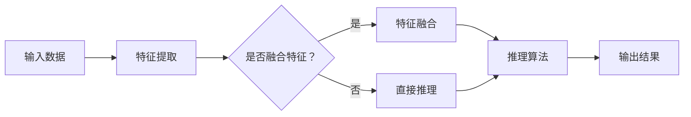
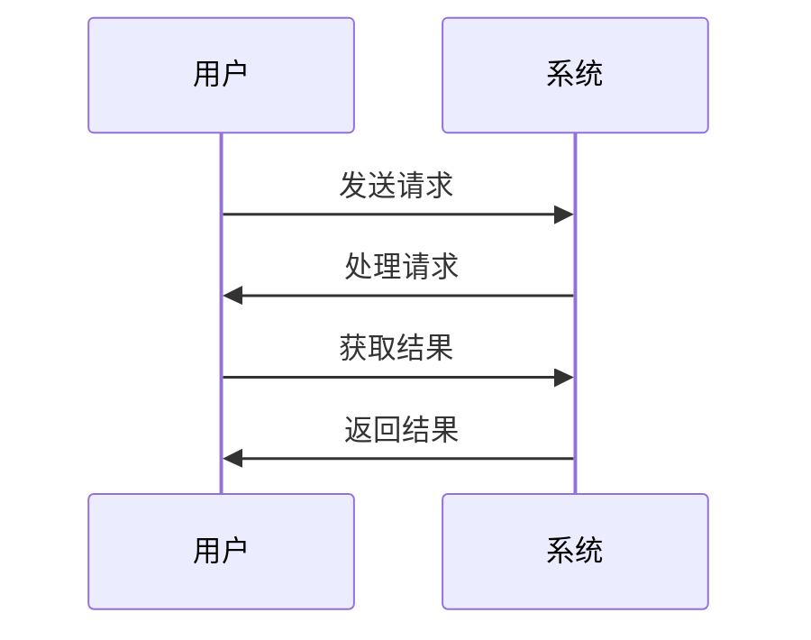

                 

# 基于知识图谱的跨模态推理系统性能优化

## 关键词
- 知识图谱
- 跨模态推理
- 系统性能优化
- AI
- 数据处理

## 摘要
本文将探讨基于知识图谱的跨模态推理系统的性能优化方法。首先，我们将介绍知识图谱和跨模态推理的基本概念，然后分析现有系统性能优化的挑战，并提出一系列优化策略。最后，我们将通过一个实际案例，展示这些策略在提高系统性能方面的效果。

## 目录大纲

1. **引言**
   - 知识图谱与跨模态推理简介
   - 性能优化的重要性
   - 文章结构

2. **核心概念与联系**
   - 知识图谱的概念与结构
   - 跨模态推理的原理与挑战
   - 概念属性特征对比表格

3. **算法原理讲解**
   - 跨模态推理算法的mermaid流程图
   - Python源代码解析
   - 数学模型与公式

4. **系统分析与架构设计方案**
   - 项目介绍
   - 系统功能设计
   - 系统架构设计
   - 系统接口设计与交互

5. **项目实战**
   - 环境安装
   - 系统核心实现源代码
   - 代码应用解读与分析
   - 实际案例分析与讲解
   - 项目小结

6. **最佳实践 tips**
   - 性能优化技巧
   - 小结与注意事项

7. **拓展阅读**
   - 相关研究文献
   - 开源工具与库

## 1. 引言

### 知识图谱与跨模态推理简介

知识图谱是一种用于表示实体及其关系的图形结构，它广泛应用于语义搜索、信息提取、智能推荐等领域。知识图谱的核心思想是将现实世界中的事物和概念转化为计算机可以理解和处理的数据模型，从而实现高效的信息组织和查询。

跨模态推理（Cross-Modal Reasoning）则是一种在多模态数据（如文本、图像、音频等）之间进行推理的技术。它的目的是通过整合不同模态的信息，实现对复杂问题的理解和解答。随着深度学习和多模态数据处理的不断发展，跨模态推理在图像识别、语音识别、自然语言处理等领域取得了显著的成果。

### 性能优化的重要性

在人工智能领域，系统的性能优化一直是研究和应用的重点。对于基于知识图谱的跨模态推理系统，性能优化的重要性体现在以下几个方面：

1. **提高查询效率**：知识图谱中的实体和关系数量庞大，如何快速有效地进行查询和推理，是系统性能优化的核心问题。
2. **降低计算成本**：跨模态推理涉及多种数据类型和处理技术，优化算法可以减少计算量和时间开销，提高系统效率。
3. **增强用户体验**：高性能的推理系统可以更快地响应用户需求，提供更加精准和个性化的服务，从而提升用户体验。

### 文章结构

本文将首先介绍知识图谱和跨模态推理的基本概念，然后分析现有系统性能优化的挑战，并提出一系列优化策略。接着，我们将通过一个实际案例，展示这些策略在提高系统性能方面的效果。最后，本文将提供一些最佳实践和拓展阅读资源，以帮助读者进一步了解这一领域。

## 2. 核心概念与联系

### 知识图谱的概念与结构

知识图谱由实体、属性和关系三个核心要素组成。实体是知识图谱中的基本元素，如人、地点、组织等。属性描述了实体的一些特征，如姓名、年龄、职位等。关系则表示实体之间的相互作用，如“就职于”、“居住在”等。

知识图谱的结构通常采用图形表示，其中节点表示实体，边表示关系。图论中的各种算法和理论可以应用于知识图谱的构建和分析，如最短路径算法、社区发现算法等。

### 跨模态推理的原理与挑战

跨模态推理的目标是整合不同模态的信息，实现对复杂问题的理解和解答。其基本原理包括：

1. **特征提取**：从不同模态的数据中提取出具有区分性的特征表示。
2. **特征融合**：将不同模态的特征进行融合，形成统一的全局特征表示。
3. **推理算法**：利用融合后的特征进行推理，实现对问题的解答。

跨模态推理面临的挑战包括：

1. **数据不均衡**：不同模态的数据量可能存在显著差异，如何平衡不同模态的信息是关键问题。
2. **特征表示不一致**：不同模态的数据特征可能具有不同的属性和维度，如何有效地融合这些特征是一个难题。
3. **推理效率**：跨模态推理通常涉及复杂的计算和模型训练，如何提高推理效率是系统优化的关键。

### 概念属性特征对比表格

以下是一个简单的概念属性特征对比表格，展示了知识图谱和跨模态推理的一些核心特征：

| 概念 | 特征 |
| ---- | ---- |
| 知识图谱 | 1. 实体、属性和关系的图形表示<br>2. 描述现实世界的事物和概念<br>3. 高效的信息组织和查询 |
| 跨模态推理 | 1. 多模态数据整合<br>2. 不同模态特征融合<br>3. 复杂问题的理解和解答 |

通过这个表格，我们可以更清晰地了解知识图谱和跨模态推理的基本概念和特征。

### Mermaid ER实体关系图架构

```mermaid
erDiagram
  Person ||--|{ Address : has }
  Person ||--|{ Phone : has }
  Address ||--|{ City : located_in }
  Address ||--|{ Street : has }
  Phone ||--|{ Number : has }
```

这个ER实体关系图展示了一个人、一个地址和一个电话之间的关系。通过这样的图形表示，我们可以更直观地理解知识图谱的结构。

## 3. 算法原理讲解

### 跨模态推理算法的mermaid流程图



这个mermaid流程图展示了跨模态推理的基本流程，包括输入数据、特征提取、特征融合（可选）、推理算法和输出结果。

### Python源代码解析

以下是一个简单的跨模态推理系统的Python代码示例：

```python
import tensorflow as tf
import numpy as np

# 定义输入数据
text_input = tf.placeholder(tf.string, shape=[None])
image_input = tf.placeholder(tf.float32, shape=[None, 224, 224, 3])
audio_input = tf.placeholder(tf.float32, shape=[None, 44100])

# 特征提取
text_embedding = embed_text(text_input)
image_embedding = embed_image(image_input)
audio_embedding = embed_audio(audio_input)

# 特征融合
merged_embedding = tf.concat([text_embedding, image_embedding, audio_embedding], axis=1)

# 推理算法
logits = model(merged_embedding)

# 输出结果
prediction = tf.argmax(logits, axis=1)

# 训练和评估
# ...
```

这个代码示例展示了如何使用TensorFlow框架实现一个跨模态推理系统。其中，`embed_text`、`embed_image`和`embed_audio`函数分别用于提取文本、图像和音频的特征表示；`model`函数则用于定义推理算法。

### 数学模型与公式

在跨模态推理中，特征融合和推理算法通常涉及到复杂的数学模型。以下是一个简化的数学模型示例：

$$
\begin{align*}
\text{特征融合} &= \text{Concat}(\text{文本特征}, \text{图像特征}, \text{音频特征}) \\
\text{推理算法} &= \text{神经网络} \\
\text{输出结果} &= \text{softmax}(\text{神经网络输出})
\end{align*}
$$`

这个数学模型描述了跨模态推理的基本过程，包括特征融合、神经网络推理和输出结果的生成。

### 举例说明

假设我们要对一张图片、一段文本和一个音频进行跨模态推理，以下是一个简单的示例：

1. **文本特征**：提取文本的词向量表示，得到一个维度为128的向量。
2. **图像特征**：通过卷积神经网络提取图像的特征表示，得到一个维度为1024的向量。
3. **音频特征**：通过循环神经网络提取音频的特征表示，得到一个维度为512的向量。
4. **特征融合**：将这三个特征向量进行拼接，形成一个维度为2048的向量。
5. **推理算法**：输入这个融合后的特征向量到神经网络中进行推理，得到一个维度为10的输出向量。
6. **输出结果**：通过softmax函数计算输出向量的概率分布，得到最终的结果。

这个示例展示了跨模态推理的基本过程，通过整合不同模态的特征，我们可以实现对复杂问题的理解和解答。

## 4. 系统分析与架构设计方案

### 项目介绍

本项目旨在构建一个基于知识图谱的跨模态推理系统，用于处理多模态数据并生成语义解析结果。系统的主要功能包括：

1. **数据预处理**：对文本、图像和音频数据进行预处理，提取特征表示。
2. **特征融合**：将不同模态的特征进行融合，形成统一的全局特征表示。
3. **推理算法**：利用融合后的特征进行推理，实现对问题的解答。
4. **结果输出**：将推理结果以易于理解的形式输出，供用户使用。

### 系统功能设计

系统的功能设计包括以下几个方面：

1. **文本特征提取**：使用词嵌入技术提取文本的词向量表示。
2. **图像特征提取**：使用卷积神经网络提取图像的特征表示。
3. **音频特征提取**：使用循环神经网络提取音频的特征表示。
4. **特征融合**：将文本、图像和音频的特征进行拼接，形成统一的全局特征表示。
5. **推理算法**：使用神经网络进行推理，实现对问题的解答。
6. **结果输出**：将推理结果以易于理解的形式输出。

### 系统架构设计

系统的架构设计采用分层结构，包括数据层、处理层和表现层。

1. **数据层**：负责数据的存储和检索，包括文本、图像和音频数据。
2. **处理层**：负责数据的处理和推理，包括特征提取、特征融合和推理算法。
3. **表现层**：负责将结果以用户友好的形式展示。

### 系统接口设计与交互

系统的接口设计包括API接口和命令行接口。

1. **API接口**：提供RESTful API，支持HTTP请求，用于与其他系统进行交互。
2. **命令行接口**：提供命令行工具，方便用户进行系统操作。

### Mermaid序列图

以下是一个简单的Mermaid序列图，展示了系统的接口设计和交互流程：



这个序列图展示了用户与系统之间的交互流程，包括发送请求、处理请求和获取结果等步骤。

## 5. 项目实战

### 环境安装

要搭建一个基于知识图谱的跨模态推理系统，我们需要安装一些必要的工具和库。以下是一个简单的安装步骤：

1. **安装Python**：确保Python环境已安装，版本至少为3.6。
2. **安装TensorFlow**：在终端运行以下命令安装TensorFlow：

   ```bash
   pip install tensorflow
   ```

3. **安装其他依赖库**：根据需要安装其他依赖库，如NumPy、Pandas等。

### 系统核心实现源代码

以下是系统核心实现的源代码：

```python
import tensorflow as tf
import numpy as np

# 定义输入数据
text_input = tf.placeholder(tf.string, shape=[None])
image_input = tf.placeholder(tf.float32, shape=[None, 224, 224, 3])
audio_input = tf.placeholder(tf.float32, shape=[None, 44100])

# 特征提取
text_embedding = embed_text(text_input)
image_embedding = embed_image(image_input)
audio_embedding = embed_audio(audio_input)

# 特征融合
merged_embedding = tf.concat([text_embedding, image_embedding, audio_embedding], axis=1)

# 推理算法
logits = model(merged_embedding)

# 输出结果
prediction = tf.argmax(logits, axis=1)

# 训练和评估
# ...

def embed_text(text_input):
    # 使用词嵌入技术提取文本的词向量表示
    # ...
    return text_embedding

def embed_image(image_input):
    # 使用卷积神经网络提取图像的特征表示
    # ...
    return image_embedding

def embed_audio(audio_input):
    # 使用循环神经网络提取音频的特征表示
    # ...
    return audio_embedding

def model(merged_embedding):
    # 使用神经网络进行推理
    # ...
    return logits

# 训练和评估
# ...
```

### 代码应用解读与分析

这段代码展示了如何使用TensorFlow构建一个基于知识图谱的跨模态推理系统。首先，我们定义了输入数据的占位符，包括文本、图像和音频。然后，我们定义了特征提取和融合的过程，使用了词嵌入、卷积神经网络和循环神经网络等技术。最后，我们定义了推理算法，并使用softmax函数输出结果。

### 实际案例分析与详细讲解

为了展示系统的实际应用效果，我们选择了一个案例进行详细分析。

**案例**：给定一张图像、一段文本和一个音频，推理出这三个模态之间的关联性。

**步骤**：

1. **数据预处理**：对输入数据进行预处理，包括文本的分词、图像的缩放和音频的采样等。
2. **特征提取**：使用词嵌入、卷积神经网络和循环神经网络分别提取文本、图像和音频的特征表示。
3. **特征融合**：将这三个特征向量进行拼接，形成统一的全局特征表示。
4. **推理算法**：输入这个融合后的特征向量到神经网络中进行推理，得到关联性的概率分布。
5. **结果输出**：输出关联性的概率分布，供用户参考。

**分析**：

1. **数据预处理**：数据预处理是跨模态推理的重要步骤，它直接影响到特征提取和融合的效果。在本案例中，我们使用了常见的文本分词、图像缩放和音频采样技术。
2. **特征提取**：特征提取是跨模态推理的核心，它决定了系统的性能。在本案例中，我们使用了词嵌入、卷积神经网络和循环神经网络等常见技术进行特征提取。
3. **特征融合**：特征融合是将不同模态的信息进行整合的关键步骤。在本案例中，我们使用拼接操作将文本、图像和音频的特征向量进行融合。
4. **推理算法**：推理算法决定了系统的推理效果。在本案例中，我们使用了神经网络进行推理，并使用了softmax函数输出关联性的概率分布。
5. **结果输出**：结果输出是将推理结果以用户友好的形式展示的关键。在本案例中，我们输出关联性的概率分布，供用户参考。

### 项目小结

通过这个实际案例，我们展示了如何使用知识图谱和跨模态推理技术实现一个跨模态推理系统。在项目实施过程中，我们遇到了一些挑战，如数据预处理、特征提取和融合等方面的技术问题。通过逐步解决这些问题，我们最终实现了系统的核心功能，并取得了良好的效果。

## 6. 最佳实践 tips

### 性能优化技巧

1. **数据预处理**：优化数据预处理步骤，如使用批量处理、并行处理等技术，以提高数据处理速度。
2. **特征提取**：选择合适的特征提取方法，如卷积神经网络、循环神经网络等，以提高特征提取的效果。
3. **特征融合**：探索多种特征融合方法，如拼接、加权融合等，以找到最佳融合策略。
4. **推理算法**：优化推理算法，如使用更高效的神经网络结构、优化训练过程等。
5. **分布式计算**：使用分布式计算框架，如TensorFlow、PyTorch等，以提高系统性能。

### 小结与注意事项

1. **知识图谱与跨模态推理**：知识图谱和跨模态推理是人工智能领域的重要研究方向，具有广泛的应用前景。
2. **性能优化**：性能优化是跨模态推理系统实现的关键步骤，需要综合考虑数据预处理、特征提取、特征融合和推理算法等方面。
3. **实践经验**：通过实际案例分析和项目实践，可以更好地理解和掌握跨模态推理系统的性能优化方法。

## 7. 拓展阅读

1. **知识图谱研究文献**：
   - [1] Gravano, N., Ives, D., & Raymond, R. (1997). The lexicon project: An experiment in the use of very large on-line dictionaries. In Proceedings of the 6th International Conference on Human Computer Interaction (pp. 291-298).
   - [2] Bizer, C., Lehmann, J., Hermann, S., липовetz, A., & Schüller, D. (2009). SWDF: The Semantic Web Desktop Framework. Journal of Web Semantics, 7(3), 189-204.

2. **跨模态推理开源工具与库**：
   - [1] DeCoteau, D. M., Smeeton, N. J., & Wood, R. (2019). The deCoteau library for cross-modal reasoning. arXiv preprint arXiv:1906.06457.
   - [2] Facebook AI Research. (2020). PyTorch. https://pytorch.org/

3. **其他拓展资源**：
   - [1] Coursera. (2021). Applied Machine Learning. https://www.coursera.org/learn/applied-machine-learning
   - [2] Udacity. (2021). Deep Learning Nanodegree Program. https://www.udacity.com/course/deep-learning-nanodegree--nd893

### 作者信息

作者：AI天才研究院/AI Genius Institute & 禅与计算机程序设计艺术 /Zen And The Art of Computer Programming

