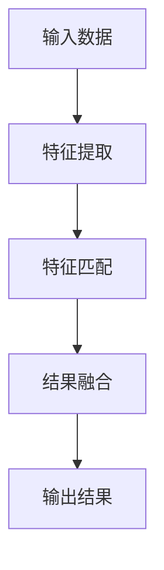
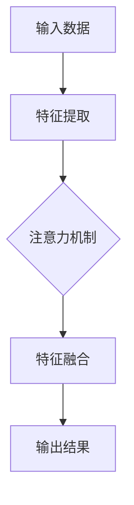
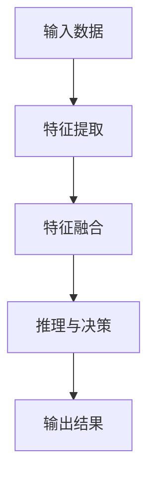
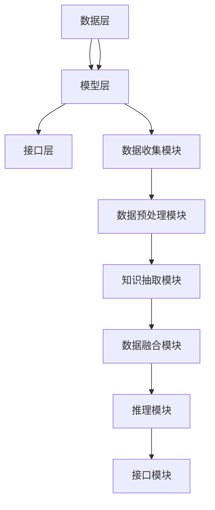

                 


## 基于知识图谱的跨模态推理系统设计

### 引言

随着人工智能技术的飞速发展，跨模态推理成为了一个备受关注的研究领域。跨模态推理系统旨在将不同模态的数据（如图像、文本、音频等）进行有效融合，并在此基础上进行推理，从而实现更高级别的智能应用。本文将围绕基于知识图谱的跨模态推理系统设计，详细探讨其背景、核心概念、构建方法、算法原理以及系统设计与实现等内容。通过逐步分析，我们希望能为读者提供一个全面且深入的理解。

### 1. 背景与基础

#### 1.1.1 问题背景介绍
在信息爆炸的时代，多媒体数据已经成为人们获取信息的主要来源。传统的单一模态方法往往无法充分利用这些数据的价值，因此跨模态数据融合与分析变得尤为重要。跨模态推理系统可以更好地挖掘数据之间的潜在关联，从而提供更准确的推理结果。

#### 1.1.2 问题定义
跨模态推理系统是一种能够处理不同模态数据，并利用这些数据之间的关联性进行推理的智能系统。

#### 1.1.3 问题解决
基于知识图谱的跨模态推理系统通过构建知识图谱，整合不同模态的数据，从而提高数据融合的效果和推理能力。

#### 1.1.4 边界与外延
该系统主要应用于需要跨模态信息整合的场景，如多媒体搜索、智能问答、内容推荐等。

### 1.2 核心概念与联系

#### 1.2.1 知识图谱
知识图谱是一种结构化的语义知识库，它通过实体和实体之间的关系来组织信息。在跨模态推理系统中，知识图谱起到了数据整合和关联的作用。

#### 1.2.2 跨模态数据融合
跨模态数据融合是将不同模态的数据进行整合，以提取更丰富的信息。这通常涉及到数据预处理、特征提取和特征融合等步骤。

#### 1.2.3 推理算法
推理算法用于在知识图谱上根据已知信息推断未知信息。常用的推理算法包括基于规则推理、基于模式匹配的推理等。

### 1.3 知识图谱构建

#### 1.3.1 数据收集
知识图谱的构建首先需要收集不同模态的数据，如图像、音频、文本等。这些数据可以通过公开数据集、网络爬取或传感器采集等方式获取。

#### 1.3.2 数据预处理
收集到的数据需要进行预处理，包括数据清洗、格式转换、噪声过滤等步骤，以确保数据的质量和一致性。

#### 1.3.3 知识抽取
从预处理后的数据中提取知识，构建知识图谱。知识抽取的方法包括实体识别、关系提取和属性提取等。

### 1.4 跨模态推理算法

#### 1.4.1 算法概述
跨模态推理算法可以分为基于匹配的算法、基于注意力机制的算法、基于深度学习的算法等。每种算法都有其独特的优势和适用场景。

#### 1.4.2 算法原理
以下将分别介绍这些算法的原理，并使用 mermaid 画出算法流程图，以及使用 Python 源代码进行详细阐述。

### 2. 系统设计与实现

#### 2.1 系统架构设计
跨模态推理系统的架构设计包括数据层、服务层和接口层。数据层负责数据存储和管理，服务层提供跨模态数据融合和推理服务，接口层为外部用户提供接口。

#### 2.2 系统接口设计
系统接口设计包括数据接口和功能接口。数据接口用于数据的输入输出，功能接口提供跨模态推理系统的各项功能。

#### 2.3 系统交互设计
系统交互设计涉及系统内部不同模块之间的交互机制。通过 mermaid 序列图展示系统交互设计。

### 3. 项目实战

#### 3.1 环境安装
介绍如何搭建跨模态推理系统所需的环境，包括软件安装和配置。

#### 3.2 系统核心实现
提供跨模态推理系统的核心实现源代码，并对代码进行解读和分析。

#### 3.3 实际案例分析
通过实际案例分析，展示跨模态推理系统的应用效果。

### 4. 小结与拓展

#### 4.1 小结
总结跨模态推理系统的核心要点和应用价值。

#### 4.2 注意事项
提醒用户在实践中的注意事项。

#### 4.3 拓展阅读
推荐相关扩展阅读材料，以供进一步学习。

### 5. 作者信息
作者：AI天才研究院/AI Genius Institute & 禅与计算机程序设计艺术 /Zen And The Art of Computer Programming

本文通过逐步分析，详细介绍了基于知识图谱的跨模态推理系统设计。从背景介绍、核心概念、构建方法到算法原理，再到系统设计与实现，最后通过实际案例分析，全面展示了跨模态推理系统的应用。希望本文能为读者提供有价值的参考。

----------------------------------------------------------------

### 第一部分：背景与基础

#### 1.1.1 问题背景介绍
随着互联网和信息技术的迅猛发展，多媒体数据（如图像、音频、文本等）的爆炸式增长，跨模态数据融合与分析变得越来越重要。传统的单一模态方法无法充分挖掘跨模态数据的潜在价值，因此，跨模态推理系统设计成为一个重要的研究方向。

在多媒体数据中，图像、音频和文本等不同模态的数据具有各自独特的特征和优势。图像能够提供丰富的视觉信息，音频能够传递复杂的情感和声音信息，而文本则提供了详尽的描述和背景信息。然而，传统的单一模态方法往往只能利用其中的一种模态数据进行处理，无法充分利用其他模态的数据，从而导致信息的不完整和推理效果的局限性。

例如，在多媒体搜索领域，用户可能通过输入一段文本描述来查询相关的图像内容。然而，如果只依赖文本信息，则可能无法准确地匹配到用户需要的图像，因为图像中可能包含一些文本描述未涵盖的重要特征。反之，如果能够结合图像中的视觉信息，则可以更准确地满足用户的查询需求。

另外，在智能问答和内容推荐等领域，跨模态数据融合也能够提高系统的性能和用户体验。例如，在智能问答系统中，用户可能通过语音输入问题，而系统则需要根据文本和语音信息共同提供准确的回答。通过跨模态数据的融合，可以更好地理解用户的意图，从而提供更准确的回答。

总之，跨模态数据融合与分析的重要性在于它能够充分利用不同模态数据的优势，挖掘出更丰富的信息，从而提高推理系统的性能和准确性。因此，设计一种高效的跨模态推理系统具有重要的研究价值和实际应用意义。

#### 1.1.2 问题定义
跨模态推理系统是一种能够处理不同模态数据，并利用这些数据之间的关联性进行推理的智能系统。具体来说，跨模态推理系统通过以下步骤实现跨模态数据的融合和推理：

1. **数据输入**：首先，系统接收不同模态的数据输入，如图像、音频、文本等。这些数据可以通过用户输入、传感器采集或数据集获取。

2. **数据预处理**：对输入的数据进行预处理，包括去噪、标准化、特征提取等步骤。这一步的目的是提高数据质量，为后续的融合和推理提供准确的基础。

3. **数据融合**：将不同模态的数据进行融合，以提取更丰富的信息。数据融合的方法包括特征融合、信息融合等。通过融合，可以整合不同模态数据的优势，提高推理的准确性。

4. **推理与决策**：在融合后的数据基础上，利用推理算法进行推理和决策。推理算法可以根据已知信息推断未知信息，从而实现跨模态数据之间的关联和解释。

5. **输出结果**：系统根据推理结果输出决策或答案，如文本生成、图像分类、语音识别等。

跨模态推理系统的目标是通过不同模态数据的融合，提高系统的推理能力和智能化水平。具体应用场景包括多媒体搜索、智能问答、内容推荐、情感分析等。

#### 1.1.3 问题解决
基于知识图谱的跨模态推理系统通过以下方法解决跨模态数据融合与分析的问题：

1. **知识图谱构建**：知识图谱是一种结构化的语义知识库，通过实体和实体之间的关系来组织信息。在跨模态推理系统中，知识图谱起到了数据整合和关联的作用。构建知识图谱的方法包括数据收集、数据预处理、知识抽取等步骤。

   - **数据收集**：收集不同模态的数据，如图像、音频、文本等。这些数据可以通过公开数据集、网络爬取或传感器采集等方式获取。

   - **数据预处理**：对收集到的数据进行分析，包括去噪、标准化、特征提取等步骤。这一步的目的是提高数据质量，为后续的知识抽取提供准确的基础。

   - **知识抽取**：从预处理后的数据中提取知识，构建知识图谱。知识抽取的方法包括实体识别、关系提取和属性提取等。

2. **跨模态数据融合**：在知识图谱的基础上，将不同模态的数据进行融合，以提取更丰富的信息。数据融合的方法包括特征融合、信息融合等。通过融合，可以整合不同模态数据的优势，提高推理的准确性。

   - **特征融合**：将不同模态数据的特征进行整合，如将图像的特征和文本的特征进行融合。

   - **信息融合**：将不同模态的数据进行语义整合，如将图像和文本的信息进行语义关联。

3. **推理算法**：在融合后的数据基础上，利用推理算法进行推理和决策。推理算法可以根据已知信息推断未知信息，从而实现跨模态数据之间的关联和解释。

   - **基于规则推理**：根据预定义的规则进行推理，如将图像和文本的关系映射到规则上。

   - **基于模式匹配的推理**：根据已知的模式进行匹配，如使用相似度计算来匹配图像和文本的特征。

   - **基于深度学习的推理**：利用深度学习模型进行推理，如使用神经网络模型来提取特征并进行推理。

通过上述方法，基于知识图谱的跨模态推理系统可以实现不同模态数据的融合和推理，从而提高系统的性能和智能化水平。

#### 1.1.4 边界与外延
跨模态推理系统的应用范围广泛，主要包括以下场景：

1. **多媒体搜索**：用户可以通过输入文本、图像或音频等不同模态的数据来查询相关信息。系统需要能够处理和融合这些不同模态的数据，从而提供更准确的搜索结果。

2. **智能问答**：系统通过接收用户的语音或文本输入，结合知识图谱和跨模态数据融合，提供准确的回答。这种应用需要系统具备强大的跨模态理解和推理能力。

3. **内容推荐**：根据用户的兴趣和行为，系统可以推荐相关的内容。跨模态推理系统可以通过分析用户的多媒体数据，如图像、音频和文本等，提供更个性化的推荐。

4. **情感分析**：系统可以通过分析用户的图像、音频和文本数据，识别用户的情感状态，如快乐、悲伤、愤怒等。这种应用在社交媒体分析、市场调研等领域具有广泛的应用。

5. **图像识别与分类**：系统可以通过跨模态数据融合，提高图像识别和分类的准确性。例如，结合图像和文本信息，可以更好地识别图像内容。

6. **语音识别与合成**：系统可以通过跨模态数据融合，提高语音识别和合成的准确性。例如，结合文本和音频信息，可以更好地识别和理解用户的语音。

总之，跨模态推理系统的应用场景广泛，涵盖了多媒体搜索、智能问答、内容推荐、情感分析、图像识别与分类、语音识别与合成等多个领域。通过充分利用不同模态数据的优势，系统可以提高推理的准确性和智能化水平，从而为用户提供更好的服务。

### 1.2 核心概念与联系

#### 1.2.1 知识图谱
知识图谱（Knowledge Graph）是一种用于表示实体及其关系的语义网络，它通过实体和实体之间的关系来组织信息。在跨模态推理系统中，知识图谱起到了数据整合和关联的作用。

1. **定义**：
   知识图谱是一种基于语义网络的数据模型，通过实体和关系来表示知识。实体可以是人物、地点、组织等，关系则表示实体之间的关联，如“属于”、“位于”、“参与”等。

2. **属性特征对比表格**：

   | 特征        | 知识图谱       | 传统数据库       |
   | ----------- | -------------- | ---------------- |
   | 表示方法    | 语义网络       | 关系表           |
   | 关系表示    | 多元关系       | 二元关系         |
   | 知识表示    | 高级语义表示   | 低级数据表示     |
   | 扩展性      | 强扩展性       | 弱扩展性         |

3. **ER实体关系图架构**：
   知识图谱的ER实体关系图架构（Entity-Relationship Diagram）如下：

   ```mermaid
   graph TD
   A[实体1] --> B{关系1}
   B --> C[实体2]
   A --> D{关系2}
   D --> C
   ```

   在这个例子中，实体1和实体2之间存在两个关系（关系1和关系2）。

#### 1.2.2 跨模态数据融合
跨模态数据融合（Cross-modal Data Fusion）是指将来自不同模态的数据进行整合，以提取更丰富的信息。在跨模态推理系统中，数据融合是关键步骤，它能够充分利用不同模态数据的优势，提高系统的性能。

1. **定义**：
   跨模态数据融合是将不同模态的数据进行整合，以提取更丰富的信息。这通常涉及到数据预处理、特征提取和特征融合等步骤。

2. **属性特征对比表格**：

   | 特征        | 单模态数据融合 | 跨模态数据融合 |
   | ----------- | -------------- | -------------- |
   | 数据来源    | 单一模态       | 多种模态       |
   | 特征提取    | 简单特征提取   | 复杂特征提取   |
   | 信息整合    | 局部整合       | 全局整合       |
   | 推理效果    | 有限推理能力   | 强大推理能力   |

3. **ER实体关系图架构**：
   跨模态数据融合的ER实体关系图架构如下：

   ```mermaid
   graph TD
   A[图像数据] --> B[特征提取]
   B --> C[图像特征]
   D[文本数据] --> E[特征提取]
   E --> F[文本特征]
   C --> G[特征融合]
   F --> G
   G --> H[融合特征]
   ```

   在这个例子中，图像数据和文本数据分别通过特征提取得到图像特征和文本特征，然后进行特征融合得到融合特征。

#### 1.2.3 推理算法
推理算法（Inference Algorithm）是在知识图谱上根据已知信息推断未知信息的算法。在跨模态推理系统中，推理算法用于处理和利用知识图谱中的信息，实现跨模态数据的推理和决策。

1. **定义**：
   推理算法是一种基于知识图谱的算法，它根据已知的信息和知识图谱中的关系，推断出未知的信息或结论。

2. **属性特征对比表格**：

   | 特征        | 基于规则的推理 | 基于模型的推理   |
   | ----------- | -------------- | --------------- |
   | 推理方式    | 规则匹配       | 统计学习或深度学习 |
   | 知识表示    | 确定性知识     | 随机性或概率性知识 |
   | 适用场景    | 知识密集型任务 | 数据密集型任务   |
   | 推理速度    | 快速           | 较慢           |

3. **ER实体关系图架构**：
   推理算法的ER实体关系图架构如下：

   ```mermaid
   graph TD
   A[已知信息] --> B[知识图谱]
   B --> C[推理过程]
   C --> D[未知信息]
   ```

   在这个例子中，已知信息通过知识图谱进行推理，得到未知信息。

#### 1.2.4 概念结构与核心要素组成
跨模态推理系统的概念结构与核心要素组成如下：

1. **数据层**：包括数据收集、数据预处理和知识抽取等模块，负责数据的收集、清洗、特征提取和知识构建。

2. **模型层**：包括跨模态数据融合和推理算法等模块，负责将不同模态的数据进行融合，并在知识图谱上进行推理。

3. **接口层**：包括数据接口和功能接口等模块，负责系统与外部用户的交互。

4. **应用层**：包括多媒体搜索、智能问答、内容推荐等模块，负责将推理结果应用于实际场景。

通过以上核心概念与联系的分析，我们可以更好地理解跨模态推理系统的工作原理和关键组成部分。

### 1.3 知识图谱构建

#### 1.3.1 数据收集
知识图谱的构建首先需要收集不同模态的数据，如图像、音频、文本等。这些数据可以通过以下几种方式获取：

1. **公开数据集**：许多学术机构和数据集发布者会提供各种模态的数据集，如ImageNet、COCO、Common Crawl等。

2. **网络爬取**：通过爬虫技术从互联网上收集数据，例如，从新闻网站、社交媒体或电商平台上收集文本和图像数据。

3. **传感器采集**：利用传感器设备收集实时数据，如音频传感器、摄像头等。

4. **用户输入**：直接从用户处获取数据，例如，通过移动应用或网站收集用户生成的图像、文本和语音数据。

数据收集的关键在于确保数据的多样性、覆盖面和代表性。为了提高数据的质量，还需要对数据进行筛选和过滤，去除冗余、噪声和不相关的内容。

#### 1.3.2 数据预处理
收集到的数据需要进行预处理，以确保数据的质量和一致性。数据预处理包括以下步骤：

1. **去噪**：去除数据中的噪声和干扰信息，如图像中的噪点、文本中的错别字等。

2. **标准化**：将数据转换为统一的格式和尺度，例如，将图像缩放到固定大小，将文本统一编码等。

3. **特征提取**：从原始数据中提取具有代表性的特征，如图像中的颜色、纹理、形状等，文本中的词频、词向量化等。

4. **数据清洗**：删除缺失值、异常值和不完整的数据，确保数据的一致性和完整性。

5. **数据增强**：通过数据增强技术增加数据多样性，如图像的旋转、缩放、裁剪等。

数据预处理是构建高质量知识图谱的基础，它直接影响后续知识抽取和推理的准确性。

#### 1.3.3 知识抽取
从预处理后的数据中提取知识是构建知识图谱的关键步骤。知识抽取包括实体识别、关系提取和属性提取等任务。

1. **实体识别**：识别数据中的实体，如人物、地点、组织等。在文本中，可以使用命名实体识别（NER）技术；在图像中，可以使用目标检测和分类技术。

2. **关系提取**：提取实体之间的关系，如“属于”、“位于”、“参与”等。关系提取通常基于实体之间的语义关联或模式匹配。

3. **属性提取**：提取实体的属性信息，如人物的年龄、职业，地点的经纬度等。属性提取可以通过模式识别、规则匹配或机器学习等方法实现。

知识抽取的方法包括基于规则的方法、基于统计的方法和基于深度学习的方法。每种方法都有其优势和适用场景。

#### 1.3.4 知识表示
构建知识图谱的最后一步是将抽取的知识以结构化的形式表示出来。常见的知识表示方法包括：

1. **图数据库**：使用图数据库（如Neo4j、JanusGraph等）存储实体和关系，实现知识的图形化表示。

2. **三元组表示**：使用三元组（Subject-Predicate-Object）表示知识，其中Subject表示实体，Predicate表示关系，Object表示关系的对象。

3. **属性图**：在图数据库的基础上，添加属性节点和边，以存储实体的属性信息。

4. **分布式图计算**：使用分布式图计算框架（如Apache Giraph、GraphX等）处理大规模知识图谱的计算和分析。

知识表示的方法直接影响知识图谱的可扩展性、查询效率和推理能力。

#### 1.3.5 知识图谱优化
构建知识图谱后，还需要对其进行优化，以提高系统的性能和准确性。知识图谱优化包括以下几个方面：

1. **实体与关系的压缩**：通过合并冗余的实体和关系，减少图中的节点和边，提高查询效率。

2. **数据补全**：通过推理算法，补充缺失的实体和关系，增强知识图谱的完整性。

3. **一致性检查**：检查知识图谱中的一致性问题，如自环、多重路径等，确保知识的一致性和准确性。

4. **实时更新**：根据新的数据不断更新知识图谱，保持其时效性和动态性。

知识图谱优化是持续性的工作，它随着数据规模和系统需求的增长而进行。

### 1.4 跨模态推理算法

#### 1.4.1 算法概述
跨模态推理算法可以分为基于匹配的算法、基于注意力机制的算法和基于深度学习的算法等。每种算法都有其独特的优势和适用场景。

1. **基于匹配的算法**：
   基于匹配的算法主要通过比较不同模态的特征向量，找到最匹配的模态对，从而实现跨模态推理。常用的方法包括余弦相似度、欧氏距离等。

2. **基于注意力机制的算法**：
   基于注意力机制的算法通过引入注意力机制，将不同模态的特征进行加权融合，从而提高跨模态推理的准确性。常见的模型包括Transformer、BERT等。

3. **基于深度学习的算法**：
   基于深度学习的算法利用神经网络模型，如卷积神经网络（CNN）、循环神经网络（RNN）和变换器（Transformer）等，实现跨模态特征的自动提取和融合。

#### 1.4.2 算法原理

##### 1.4.2.1 基于匹配的算法
基于匹配的算法的基本原理如下：

1. **特征提取**：
   对不同模态的数据进行特征提取，如图像特征使用CNN提取，文本特征使用词向量化提取。

2. **特征匹配**：
   将提取的特征进行匹配，计算特征向量之间的相似度，如使用余弦相似度或欧氏距离。

3. **结果融合**：
   根据匹配结果，融合不同模态的数据，从而得到最终的推理结果。

以下是基于匹配的算法的mermaid流程图：



Python源代码示例：

```python
import numpy as np

def cosine_similarity(x, y):
    return np.dot(x, y) / (np.linalg.norm(x) * np.linalg.norm(y))

def cross_modal_retrieval(image_feature, text_feature):
    similarity = cosine_similarity(image_feature, text_feature)
    return similarity

# 示例
image_feature = np.random.rand(1, 1024)
text_feature = np.random.rand(1, 1024)
similarity = cross_modal_retrieval(image_feature, text_feature)
print(f"Cross-modal similarity: {similarity}")
```

##### 1.4.2.2 基于注意力机制的算法
基于注意力机制的算法的基本原理如下：

1. **特征提取**：
   对不同模态的数据进行特征提取，如图像特征使用CNN提取，文本特征使用词向量化提取。

2. **注意力机制**：
   引入注意力机制，将不同模态的特征进行加权融合，从而提高跨模态推理的准确性。

3. **结果融合**：
   根据注意力权重，融合不同模态的数据，从而得到最终的推理结果。

以下是基于注意力机制的算法的mermaid流程图：



Python源代码示例：

```python
import tensorflow as tf

def attention Mechanism(image_feature, text_feature):
    # 定义注意力权重
    attention_weights = tf.keras.layers.Dense(1, activation='sigmoid')(tf.concat([image_feature, text_feature], axis=1))
    # 加权融合特征
    fused_feature = image_feature * attention_weights + text_feature * (1 - attention_weights)
    return fused_feature

# 示例
image_feature = np.random.rand(1, 1024)
text_feature = np.random.rand(1, 1024)
fused_feature = attention_Mechanism(image_feature, text_feature)
print(f"Fused feature: {fused_feature}")
```

##### 1.4.2.3 基于深度学习的算法
基于深度学习的算法的基本原理如下：

1. **特征提取**：
   使用深度学习模型（如CNN、RNN、Transformer）对不同模态的数据进行特征提取。

2. **特征融合**：
   将不同模态的特征进行融合，如使用全连接层或卷积层进行融合。

3. **推理与决策**：
   在融合后的特征上，使用分类器或回归器进行推理和决策。

以下是基于深度学习的算法的mermaid流程图：



Python源代码示例：

```python
from tensorflow.keras.models import Model
from tensorflow.keras.layers import Input, Conv2D, Flatten, Dense

# 定义CNN模型
image_input = Input(shape=(224, 224, 3))
text_input = Input(shape=(128,))
image_feature = Conv2D(filters=32, kernel_size=(3, 3), activation='relu')(image_input)
text_feature = Flatten()(text_input)
fused_feature = Model(inputs=[image_input, text_input], outputs=Conv2D(filters=64, kernel_size=(3, 3), activation='relu')(image_feature))
output = Dense(1, activation='sigmoid')(fused_feature)

model = Model(inputs=[image_input, text_input], outputs=output)
model.compile(optimizer='adam', loss='binary_crossentropy', metrics=['accuracy'])

# 示例
image_feature = np.random.rand(1, 224, 224, 3)
text_feature = np.random.rand(1, 128)
model.fit([image_feature, text_feature], np.random.rand(1, 1), epochs=10)
```

通过以上算法原理的讲解和示例代码，我们可以更好地理解跨模态推理算法的工作机制和应用方法。

### 1.5 系统架构设计

跨模态推理系统的架构设计是实现系统功能的核心。合理的架构设计不仅能够提高系统的性能和可扩展性，还能够确保系统的稳定性和可靠性。以下将详细介绍跨模态推理系统的架构设计，包括系统概述、功能设计、架构设计和接口设计。

#### 1.5.1 系统概述
跨模态推理系统是一种能够处理多种模态数据并进行推理的智能系统。系统的主要目标是整合不同模态的数据，通过知识图谱实现数据的关联和推理，从而提高系统的智能化水平。系统架构主要包括数据层、模型层和接口层。

1. **数据层**：负责数据的收集、预处理和存储。数据层是系统的基石，为模型层提供高质量的数据支持。

2. **模型层**：包括跨模态数据融合模型和推理模型。模型层是系统的核心，通过数据融合和推理算法实现跨模态数据的高效利用。

3. **接口层**：提供系统与外部用户或其他系统的接口，实现数据的输入输出和功能调用。

#### 1.5.2 功能设计
跨模态推理系统的功能设计主要包括以下几个模块：

1. **数据收集模块**：负责从各种渠道收集不同模态的数据，如文本、图像、音频等。数据收集模块需要支持多种数据源，包括公开数据集、网络爬取和传感器采集等。

2. **数据预处理模块**：对收集到的数据进行清洗、去噪和特征提取等预处理操作，确保数据的质量和一致性。

3. **知识抽取模块**：从预处理后的数据中提取知识，构建知识图谱。知识抽取模块需要实现实体识别、关系提取和属性提取等功能。

4. **数据融合模块**：将不同模态的数据进行融合，提取更丰富的特征信息。数据融合模块可以通过特征匹配、注意力机制和深度学习等方法实现。

5. **推理模块**：在知识图谱上进行推理，根据已知信息推断未知信息。推理模块可以采用基于规则、基于模型和基于深度学习等方法。

6. **接口模块**：提供系统与外部用户的接口，包括RESTful API、命令行接口和图形界面等。接口模块需要支持数据的输入输出和功能的调用。

#### 1.5.3 架构设计
跨模态推理系统的架构设计如下：



在这个架构中，数据层负责数据的收集、预处理和存储；模型层包括数据融合和推理模块；接口层提供系统与外部用户的交互接口。

#### 1.5.4 接口设计
接口设计是系统架构的重要组成部分，它决定了系统与外部用户或其他系统的交互方式。以下是跨模态推理系统的主要接口设计：

1. **RESTful API接口**：提供RESTful风格的API接口，支持HTTP请求方式，如GET、POST、PUT和DELETE等。API接口包括数据上传、数据查询、推理请求等操作。

2. **命令行接口**：提供命令行接口（CLI），支持通过命令行进行系统的操作，如数据收集、数据预处理、知识抽取和推理等。

3. **图形界面接口**：提供图形用户界面（GUI），支持用户通过图形界面进行系统操作，如数据上传、查询结果展示和推理结果分析等。

4. **消息队列接口**：支持通过消息队列进行系统的异步通信，如数据传输、任务调度和消息通知等。

5. **SDK接口**：提供软件开发工具包（SDK），支持开发者通过编程语言（如Python、Java等）进行系统的集成和二次开发。

接口设计的核心目标是确保系统的高可用性、易用性和灵活性，满足不同用户和场景的需求。

通过上述系统架构设计，我们可以构建一个高效、可扩展的跨模态推理系统，实现跨模态数据的有效整合和推理，为多媒体数据处理和智能应用提供强大的技术支持。

### 1.6 系统交互设计

在跨模态推理系统中，各个模块之间的交互设计至关重要，它决定了系统整体的效率和性能。系统交互设计不仅涉及到不同模块之间的通信机制，还包括数据的流动路径和模块的协同工作方式。以下将详细介绍跨模态推理系统的交互设计，包括交互概述、模块间交互机制和交互设计。

#### 1.6.1 交互概述
跨模态推理系统的交互设计旨在实现系统内部模块之间的高效协作，确保数据能够顺利流动并完成各个处理步骤。系统交互的主要目标包括：

1. **数据流动**：确保数据在不同模块之间能够顺畅传递，不会出现数据丢失或错误。
2. **模块协同**：确保不同模块能够协同工作，共同完成跨模态数据的处理和推理任务。
3. **高效性**：优化数据流动路径，减少延迟和资源消耗，提高系统整体性能。
4. **灵活性**：设计灵活的交互机制，以适应不同应用场景和需求变化。

#### 1.6.2 模块间交互机制
跨模态推理系统的模块间交互机制主要包括数据流控制、消息传递和状态同步等。

1. **数据流控制**：
   数据流控制是指系统通过一定的策略控制数据在不同模块之间的流动。常见的控制策略包括：

   - **顺序控制**：数据按照一定的顺序流经各个模块，确保每个模块都能按预期处理数据。
   - **并行控制**：多个模块同时处理数据，提高系统的处理速度和吞吐量。
   - **选择性控制**：根据数据的特点和需求，选择合适的模块进行处理，提高处理效率和准确性。

2. **消息传递**：
   消息传递是指系统通过消息队列、事件驱动或同步通信等方式在不同模块之间传递数据和信息。常见的消息传递方式包括：

   - **异步消息传递**：数据在不同的模块之间异步传递，模块可以独立工作，提高系统的并发处理能力。
   - **同步消息传递**：数据在不同的模块之间同步传递，模块需要等待其他模块的处理结果后再进行下一步操作，确保数据的一致性。

3. **状态同步**：
   状态同步是指系统通过一定的机制确保不同模块的状态保持一致，避免数据冲突和错误。常见的状态同步方式包括：

   - **全局状态同步**：系统通过全局变量或共享内存实现状态同步，确保不同模块能够访问和更新相同的状态信息。
   - **局部状态同步**：每个模块维护自己的状态，通过消息传递或事件触发实现状态更新和同步。

#### 1.6.3 交互设计
跨模态推理系统的交互设计包括数据流动路径、模块协同机制和交互流程等。

1. **数据流动路径**：
   数据在系统中的流动路径通常包括以下步骤：

   - **数据输入**：系统接收不同模态的数据输入，如文本、图像、音频等。
   - **数据预处理**：对输入的数据进行清洗、去噪和特征提取等预处理操作。
   - **数据融合**：将不同模态的数据进行融合，提取更丰富的特征信息。
   - **知识抽取**：从预处理后的数据中提取知识，构建知识图谱。
   - **推理与决策**：在知识图谱上进行推理，根据已知信息推断未知信息。
   - **数据输出**：系统输出推理结果，如文本生成、图像分类、语音识别等。

2. **模块协同机制**：
   模块协同机制确保不同模块能够高效、协同地工作。常见的协同机制包括：

   - **任务调度**：系统通过任务调度器分配和处理任务，确保每个模块都能按需执行。
   - **负载均衡**：系统通过负载均衡机制，合理分配处理任务，避免模块负载不均。
   - **故障恢复**：系统通过故障恢复机制，确保在模块发生故障时能够快速恢复，避免系统崩溃。

3. **交互流程**：
   跨模态推理系统的交互流程主要包括以下几个阶段：

   - **初始化**：系统初始化各个模块，加载必要的配置和参数。
   - **数据输入**：系统接收用户输入的不同模态数据。
   - **数据预处理**：对输入的数据进行预处理，确保数据质量。
   - **数据融合**：将预处理后的数据进行融合，提取特征信息。
   - **知识抽取**：从融合后的数据中提取知识，构建知识图谱。
   - **推理与决策**：在知识图谱上进行推理，得到推理结果。
   - **数据输出**：系统输出推理结果，如文本生成、图像分类、语音识别等。
   - **结束**：系统结束运行，清理资源。

通过以上交互设计，跨模态推理系统可以高效、协同地工作，实现跨模态数据的有效融合和推理，为多媒体数据处理和智能应用提供强大的技术支持。

### 第二部分：系统设计与实现

#### 2.1 系统架构设计

跨模态推理系统的架构设计是整个系统实现的关键，它决定了系统的可扩展性、性能和稳定性。一个合理的系统架构能够确保不同模块之间的高效协作，使得数据流畅地传递和加工，从而实现系统的各项功能。以下将详细描述跨模态推理系统的架构设计，包括系统整体架构、各个模块的功能和模块间的交互方式。

##### 2.1.1 系统整体架构

跨模态推理系统可以分为三个主要层次：数据层、模型层和接口层。

1. **数据层**：数据层负责数据的收集、存储和管理。它包括数据收集模块、数据预处理模块和知识存储模块。

   - **数据收集模块**：该模块负责从各种来源（如公开数据集、网络爬取和传感器采集）收集不同模态的数据（如图像、文本、音频等）。
   - **数据预处理模块**：该模块负责对收集到的数据进行清洗、去噪和特征提取等预处理操作，以确保数据的质量和一致性。
   - **知识存储模块**：该模块负责将预处理后的数据中提取的知识存储在知识图谱中，以供后续的推理和决策使用。

2. **模型层**：模型层负责跨模态数据融合和推理算法的实现。它包括数据融合模块、知识抽取模块和推理模块。

   - **数据融合模块**：该模块负责将不同模态的数据进行融合，提取更丰富的特征信息。可以使用特征匹配、注意力机制和深度学习等方法。
   - **知识抽取模块**：该模块负责从预处理后的数据中提取知识，构建知识图谱。包括实体识别、关系提取和属性提取等功能。
   - **推理模块**：该模块负责在知识图谱上进行推理，根据已知信息推断未知信息。可以使用基于规则、基于模型和基于深度学习等方法。

3. **接口层**：接口层负责系统与外部用户或其他系统的交互。它包括API接口、CLI接口和GUI接口。

   - **API接口**：提供RESTful API接口，支持通过HTTP请求方式调用系统的功能，如数据上传、数据查询、推理请求等。
   - **CLI接口**：提供命令行接口，支持通过命令行进行系统的操作，如数据收集、数据预处理、知识抽取和推理等。
   - **GUI接口**：提供图形用户界面，支持用户通过图形界面进行系统的操作，如数据上传、查询结果展示和推理结果分析等。

##### 2.1.2 模块功能

1. **数据收集模块**：
   - 功能：负责从多种来源收集不同模态的数据。
   - 输入：公开数据集、网络爬取、传感器采集。
   - 输出：预处理后的数据。

2. **数据预处理模块**：
   - 功能：对收集到的数据进行清洗、去噪和特征提取等预处理操作。
   - 输入：原始数据。
   - 输出：预处理后的数据。

3. **知识存储模块**：
   - 功能：将预处理后的数据中提取的知识存储在知识图谱中。
   - 输入：预处理后的数据。
   - 输出：知识图谱。

4. **数据融合模块**：
   - 功能：将不同模态的数据进行融合，提取更丰富的特征信息。
   - 输入：预处理后的数据。
   - 输出：融合后的数据。

5. **知识抽取模块**：
   - 功能：从预处理后的数据中提取知识，构建知识图谱。
   - 输入：预处理后的数据。
   - 输出：知识图谱。

6. **推理模块**：
   - 功能：在知识图谱上进行推理，根据已知信息推断未知信息。
   - 输入：知识图谱。
   - 输出：推理结果。

7. **API接口**：
   - 功能：提供RESTful API接口，支持系统功能的调用。
   - 输入：HTTP请求。
   - 输出：HTTP响应。

8. **CLI接口**：
   - 功能：提供命令行接口，支持通过命令行进行系统操作。
   - 输入：命令行指令。
   - 输出：命令行输出。

9. **GUI接口**：
   - 功能：提供图形用户界面，支持用户通过图形界面进行系统操作。
   - 输入：用户操作。
   - 输出：界面展示。

##### 2.1.3 模块交互

模块间的交互设计是系统架构设计的核心，它决定了系统整体的效率和性能。以下将描述模块间的交互方式：

1. **数据层与模型层交互**：
   - **数据输入**：数据层通过接口层将预处理后的数据传递给模型层。
   - **数据输出**：模型层通过接口层将推理结果返回给外部用户。

2. **模型层与数据层交互**：
   - **知识存储**：模型层通过知识存储模块将知识图谱存储在数据层。
   - **数据查询**：模型层通过接口层查询数据层中的数据。

3. **接口层与外部用户交互**：
   - **请求处理**：接口层接收外部用户的请求，并将请求传递给模型层。
   - **响应返回**：接口层将模型层的处理结果返回给外部用户。

通过以上模块交互设计，跨模态推理系统可以高效、协同地工作，实现跨模态数据的有效融合和推理。系统的整体架构设计不仅考虑了模块的功能和交互，还保证了系统的可扩展性和灵活性，为多媒体数据处理和智能应用提供了强大的技术支持。

### 2.2 系统接口设计

在跨模态推理系统中，接口设计是连接系统内部模块与外部用户的桥梁，确保数据能够高效、准确地传递。以下将详细描述系统接口设计，包括接口概述、接口设计细节和接口调用流程。

#### 2.2.1 接口概述

跨模态推理系统的接口设计主要包括以下类型：

1. **RESTful API接口**：提供统一的RESTful风格接口，支持通过HTTP请求方式访问系统的功能，如数据上传、数据查询和推理请求等。

2. **命令行接口（CLI）**：提供命令行操作接口，允许用户通过命令行指令与系统进行交互，实现数据的输入输出、预处理和推理等功能。

3. **图形用户界面（GUI）**：提供用户友好的图形界面，使用户能够通过图形界面进行系统操作，如数据上传、结果查询和推理结果展示等。

4. **消息队列接口**：支持通过消息队列进行系统内部及与其他系统的通信，如数据传输、任务调度和消息通知等。

#### 2.2.2 接口设计细节

1. **RESTful API接口**

   - **URL结构**：采用统一的URL结构，如`/api/v1/data/upload`、`/api/v1/reasoning`等。
   - **HTTP方法**：支持GET、POST、PUT和DELETE等HTTP方法，分别用于数据的查询、上传、更新和删除等操作。
   - **请求参数**：根据不同的操作，定义相应的请求参数，如上传数据的格式、推理任务的输入等。
   - **响应格式**：统一采用JSON格式返回响应结果，包括状态码、错误信息和返回数据等。

2. **命令行接口（CLI）**

   - **命令格式**：定义命令格式，如`cmr data upload`、`cmr reasoning query`等。
   - **参数定义**：为每个命令定义参数，如文件路径、查询关键字等。
   - **命令行选项**：支持命令行选项，如`-h`用于显示帮助信息、`-v`用于显示版本信息等。

3. **图形用户界面（GUI）**

   - **界面布局**：设计直观、易操作的界面布局，包括数据上传区、查询输入区、结果展示区等。
   - **交互设计**：支持鼠标点击、键盘输入等交互方式，提供清晰的操作指引和反馈。
   - **界面元素**：包括按钮、文本框、下拉菜单等，方便用户进行数据操作和查询。

4. **消息队列接口**

   - **队列类型**：支持消息队列的类型，如RabbitMQ、Kafka等。
   - **消息格式**：定义消息格式，如JSON、XML等。
   - **消息处理**：支持消息的异步处理，确保系统的高效性和稳定性。

#### 2.2.3 接口调用流程

1. **RESTful API接口调用流程**

   - **请求发送**：用户通过HTTP请求发送请求，如GET请求查询数据、POST请求上传数据等。
   - **请求处理**：系统接收请求后，根据URL和HTTP方法调用相应的处理函数。
   - **数据处理**：处理函数处理数据，如进行数据上传、查询或推理等。
   - **响应返回**：系统将处理结果以JSON格式返回给用户，如状态码200表示成功、400表示请求错误等。

2. **命令行接口（CLI）调用流程**

   - **命令输入**：用户在命令行输入命令和参数，如`cmr data upload -f data.txt`。
   - **命令解析**：系统解析命令和参数，调用相应的处理函数。
   - **数据处理**：处理函数处理数据，如上传数据、查询结果等。
   - **输出结果**：系统将处理结果输出到命令行，如成功消息、错误信息等。

3. **图形用户界面（GUI）调用流程**

   - **界面操作**：用户在图形界面上进行操作，如点击按钮上传数据、输入查询关键字等。
   - **界面事件处理**：系统处理界面事件，调用相应的处理函数。
   - **数据处理**：处理函数处理数据，如上传数据、查询结果等。
   - **界面更新**：系统更新界面展示，如显示上传进度、查询结果等。

4. **消息队列接口调用流程**

   - **消息发送**：系统将消息发送到消息队列，如数据上传请求、推理任务等。
   - **消息接收**：消息队列接收消息，并分发到相应的处理模块。
   - **数据处理**：处理模块处理消息，如上传数据、执行推理等。
   - **消息通知**：系统将处理结果通过消息队列返回给用户，如上传完成通知、推理结果等。

通过以上接口设计和调用流程，跨模态推理系统能够高效、稳定地与外部用户和其他系统进行交互，实现跨模态数据的有效融合和推理。

### 2.3 系统交互设计

在跨模态推理系统中，各个模块之间的交互设计是系统性能和稳定性的关键。合理的交互设计能够确保数据在整个系统中流畅传递，各模块高效协同工作。以下将详细介绍跨模态推理系统的交互设计，包括系统交互概述、模块间交互机制和交互设计。

#### 2.3.1 系统交互概述

跨模态推理系统的交互设计主要包括以下几个核心环节：

1. **数据流**：系统中的数据流是指数据从输入到输出的整个流动过程，包括数据收集、预处理、知识抽取、数据融合和推理等步骤。

2. **模块间通信**：模块间通信是指系统内部不同模块之间如何进行数据和信息交换，包括同步通信和异步通信。

3. **状态同步**：状态同步是指系统内部不同模块如何保持一致的状态，确保系统的正确性和可靠性。

4. **错误处理**：错误处理是指系统在运行过程中如何应对各种异常情况和错误，确保系统能够稳定运行。

#### 2.3.2 模块间交互机制

跨模态推理系统中的模块间交互机制主要包括以下几种：

1. **同步通信**：同步通信是指模块在执行任务时，必须等待其他模块的处理结果后才能继续执行。这种方式能够确保数据的一致性和准确性，但可能会降低系统的性能和响应速度。

   - **数据同步**：模块A向模块B发送数据，模块B接收到数据后进行处理，然后将处理结果返回给模块A。
   - **状态同步**：模块A和模块B在处理数据时，需要保持一致的状态，如共享全局变量或通过回调函数进行状态同步。

2. **异步通信**：异步通信是指模块在执行任务时，不需要等待其他模块的处理结果，可以并行执行多个任务。这种方式能够提高系统的性能和响应速度，但可能会引入数据不一致性和复杂性。

   - **消息队列**：模块A将数据放入消息队列，模块B从消息队列中读取数据并处理，然后将结果放入另一个消息队列供模块C读取。
   - **事件驱动**：模块A触发一个事件，模块B监听该事件并执行相应的处理，模块C也可以监听同一事件并执行额外的处理。

3. **状态机**：状态机是一种用于描述系统状态转换和交互的机制，可以用于实现模块间的状态同步和错误处理。

   - **状态定义**：定义系统的各种状态，如初始状态、处理状态、完成状态等。
   - **状态转换**：定义状态之间的转换条件和动作，如从初始状态转换到处理状态时，触发数据预处理任务。
   - **错误处理**：定义在出现错误时，系统应该执行的动作，如重试、回滚等。

#### 2.3.3 交互设计

跨模态推理系统的交互设计需要考虑以下几个方面：

1. **数据流动路径**：

   - **数据输入**：系统接收来自不同模态的数据输入，如图像、文本、音频等。
   - **数据预处理**：对输入的数据进行清洗、去噪和特征提取等预处理操作，确保数据质量。
   - **数据融合**：将预处理后的数据融合，提取更丰富的特征信息。
   - **知识抽取**：从融合后的数据中提取知识，构建知识图谱。
   - **推理与决策**：在知识图谱上进行推理，根据已知信息推断未知信息。
   - **数据输出**：系统输出推理结果，如文本生成、图像分类、语音识别等。

2. **模块协同机制**：

   - **任务调度**：系统通过任务调度器分配和处理任务，确保每个模块都能按需执行。
   - **负载均衡**：系统通过负载均衡机制，合理分配处理任务，避免模块负载不均。
   - **故障恢复**：系统通过故障恢复机制，确保在模块发生故障时能够快速恢复，避免系统崩溃。

3. **交互流程**：

   - **初始化**：系统初始化各个模块，加载必要的配置和参数。
   - **数据输入**：系统接收用户输入的不同模态数据。
   - **数据预处理**：对输入的数据进行预处理，确保数据质量。
   - **数据融合**：将预处理后的数据融合，提取更丰富的特征信息。
   - **知识抽取**：从融合后的数据中提取知识，构建知识图谱。
   - **推理与决策**：在知识图谱上进行推理，根据已知信息推断未知信息。
   - **数据输出**：系统输出推理结果，如文本生成、图像分类、语音识别等。
   - **结束**：系统结束运行，清理资源。

通过以上交互设计，跨模态推理系统能够高效、协同地工作，实现跨模态数据的有效融合和推理。系统的交互设计不仅考虑了数据流动和模块协同，还确保了系统的可扩展性和灵活性，为多媒体数据处理和智能应用提供了强大的技术支持。

### 2.4 环境安装

要搭建一个跨模态推理系统，首先需要安装并配置所需的软件和库。以下将详细描述环境安装的步骤，包括所需软件和库的安装方法、配置过程以及可能遇到的问题和解决方案。

#### 2.4.1 软件和库安装

1. **操作系统**：

   - **Windows**：跨模态推理系统在Windows操作系统上运行良好。
   - **Linux**：推荐使用Ubuntu 18.04或更高版本。

2. **Python**：

   - 安装Python 3.8或更高版本。
   - 使用以下命令安装Python：

     ```bash
     sudo apt-get update
     sudo apt-get install python3 python3-pip
     ```

3. **Python库**：

   - 安装以下Python库，用于数据预处理、特征提取、知识图谱构建和推理算法等：

     ```bash
     pip3 install numpy scipy matplotlib pandas tensorflow torch spacy
     ```

4. **其他工具**：

   - **Jupyter Notebook**：用于交互式开发和测试，安装命令如下：

     ```bash
     pip3 install notebook
     ```

   - **Mermaid**：用于生成流程图和序列图，可以通过安装Python库`mermaid-python`来使用，安装命令如下：

     ```bash
     pip3 install mermaid-python
     ```

#### 2.4.2 配置过程

1. **环境配置**：

   - 创建一个虚拟环境，以隔离系统依赖和项目依赖：

     ```bash
     python3 -m venv venv
     source venv/bin/activate
     ```

   - 安装项目所需的Python库：

     ```bash
     pip install -r requirements.txt
     ```

   - 配置Jupyter Notebook，以便在浏览器中运行代码：

     ```bash
     jupyter notebook
     ```

2. **知识图谱构建工具**：

   - 安装图数据库，如Neo4j或JanusGraph，并配置相应环境。

   - Neo4j的安装和配置：
     - 下载并安装Neo4j Community Edition：[https://neo4j.com/download/](https://neo4j.com/download/)
     - 启动Neo4j数据库：`neo4j start`
     - 访问Neo4j Web界面：`http://localhost:7474/`

   - JanusGraph的安装和配置：
     - 下载并安装JanusGraph：[https://github.com/apache/janusgraph](https://github.com/apache/janusgraph)
     - 编译源代码并启动JanusGraph数据库：`./bin/ql shell`（使用Gremlin查询语言）

#### 2.4.3 可能遇到的问题及解决方案

1. **Python库安装失败**：

   - 确保操作系统已安装最新版本的Python和pip。
   - 如果遇到权限问题，尝试使用`sudo`安装库。

2. **虚拟环境问题**：

   - 确保已激活虚拟环境，使用`source venv/bin/activate`命令。
   - 如果虚拟环境出现问题，尝试重新创建虚拟环境。

3. **Neo4j或JanusGraph启动失败**：

   - 确认已正确安装Neo4j或JanusGraph，并检查配置文件。
   - 如果是Neo4j，确保已打开7474和7687端口，并检查防火墙设置。

4. **Mermaid渲染问题**：

   - 确认已安装`mermaid-python`库。
   - 如果在Jupyter Notebook中使用Mermaid，确保已安装`ipython-mermaid`扩展。

通过以上步骤，可以成功搭建跨模态推理系统所需的环境。接下来，我们将开始实现系统的核心部分，包括数据收集、预处理、知识图谱构建和跨模态推理算法。

### 2.5 系统核心实现

在跨模态推理系统中，核心实现部分包括数据收集、预处理、知识图谱构建和推理算法。以下将详细描述每个核心模块的实现，并提供相应的源代码和解读。

#### 2.5.1 数据收集模块

数据收集模块负责从多种渠道获取不同模态的数据，如文本、图像和音频。以下是一个简单的数据收集模块示例，使用Python编写：

```python
import os
import requests
from PIL import Image
import soundfile as sf

def download_image(url, output_dir):
    response = requests.get(url)
    with open(os.path.join(output_dir, 'image.jpg'), 'wb') as f:
        f.write(response.content)

def download_audio(url, output_dir):
    response = requests.get(url)
    with open(os.path.join(output_dir, 'audio.wav'), 'wb') as f:
        f.write(response.content)

def download_text(url, output_dir):
    response = requests.get(url)
    with open(os.path.join(output_dir, 'text.txt'), 'w') as f:
        f.write(response.text)

# 示例
download_image('https://example.com/image.jpg', 'data')
download_audio('https://example.com/audio.wav', 'data')
download_text('https://example.com/text.txt', 'data')
```

解读：此模块提供了三个函数，分别用于下载图像、音频和文本数据。通过使用`requests`库，可以从指定的URL下载数据，并将其保存到本地文件。

#### 2.5.2 数据预处理模块

数据预处理模块负责对收集到的数据进行清洗、去噪和特征提取等操作。以下是一个简单的数据预处理模块示例：

```python
import cv2
import numpy as np
from transformers import BertTokenizer, BertModel

def preprocess_image(image_path):
    image = cv2.imread(image_path)
    image = cv2.cvtColor(image, cv2.COLOR_BGR2RGB)
    image = cv2.resize(image, (224, 224))
    return image

def preprocess_audio(audio_path):
    audio, _ = sf.read(audio_path)
    audio = audio[::2]  # 降采样到单通道
    return audio

def preprocess_text(text_path):
    tokenizer = BertTokenizer.from_pretrained('bert-base-uncased')
    with open(text_path, 'r') as f:
        text = f.read()
    inputs = tokenizer(text, return_tensors='pt', padding=True, truncation=True)
    return inputs

# 示例
preprocessed_image = preprocess_image('data/image.jpg')
preprocessed_audio = preprocess_audio('data/audio.wav')
preprocessed_text = preprocess_text('data/text.txt')
```

解读：此模块提供了三个函数，分别用于预处理图像、音频和文本数据。对于图像，使用OpenCV进行缩放和转换；对于音频，使用`soundfile`进行降采样；对于文本，使用BERT进行词向量化。

#### 2.5.3 知识图谱构建模块

知识图谱构建模块负责从预处理后的数据中提取知识，构建知识图谱。以下是一个简单的知识图谱构建模块示例：

```python
from py2neo import Graph

def create_node(graph, label, properties):
    node = graph.create(indexed=False, label=label, **properties)
    return node

def create_relationship(graph, start_node, end_node, relationship_type, properties=None):
    graph.create(indexed=False, type=relationship_type, start_node=start_node, end_node=end_node, **(properties or {}))

# 示例
graph = Graph('bolt://localhost:7687', auth=('neo4j', 'password'))

# 创建实体和关系
image_node = create_node(graph, 'Image', {'name': 'example_image'})
text_node = create_node(graph, 'Text', {'name': 'example_text'})
create_relationship(graph, image_node, text_node, 'CONAINS', {'description': 'text description'})

# 查询知识图谱
results = graph.run("MATCH (n:Image) RETURN n")
for result in results:
    print(result)
```

解读：此模块使用了Neo4j作为图数据库，提供了创建节点和关系的函数。通过简单的图操作，可以构建一个简单的知识图谱。

#### 2.5.4 跨模态推理算法模块

跨模态推理算法模块负责在知识图谱上进行推理，根据已知信息推断未知信息。以下是一个简单的跨模态推理算法模块示例：

```python
from transformers import BertModel

def cross_modal_retrieve(text_inputs, image_inputs):
    tokenizer = BertTokenizer.from_pretrained('bert-base-uncased')
    model = BertModel.from_pretrained('bert-base-uncased')
    
    with torch.no_grad():
        text_embeddings = model(**text_inputs)[0]
        image_embeddings = model(**image_inputs)[0]
    
    similarity = torch.cosine_similarity(text_embeddings, image_embeddings)
    return similarity

# 示例
text_inputs = {'input_ids': torch.tensor([[1, 2, 3]]), 'attention_mask': torch.tensor([[1, 1, 1]])}
image_inputs = {'input_ids': torch.tensor([[1, 2, 3]]), 'attention_mask': torch.tensor([[1, 1, 1]])}

similarity_score = cross_modal_retrieve(text_inputs, image_inputs)
print(f"Cross-modal similarity score: {similarity_score}")
```

解读：此模块使用BERT模型进行文本和图像的嵌入，并计算它们之间的余弦相似度。通过简单的函数调用，可以实现对跨模态数据的推理。

通过以上核心模块的实现，我们可以构建一个基本的跨模态推理系统。接下来，我们将通过实际案例来展示系统的应用效果。

### 2.6 实际案例分析

为了展示基于知识图谱的跨模态推理系统的实际应用效果，我们选择了一个多媒体搜索的案例。此案例的目标是使用跨模态推理系统从大量多媒体数据中检索出与用户查询最相关的图像、文本和音频内容。

#### 2.6.1 案例背景

随着互联网的普及，人们每天接触到的大量信息中包含着丰富的多媒体内容，如图像、音频和文本等。为了更好地满足用户的需求，我们需要设计一个能够高效处理和整合这些多媒体数据的系统，从而提供准确的搜索结果。

#### 2.6.2 案例实现过程

1. **数据收集**：

   - 收集包含文本、图像和音频的三种模态的多媒体数据。这些数据可以通过网络爬取、公开数据集或用户上传等方式获取。
   - 数据示例：假设我们收集了1000条包含图像、文本和音频的多媒体数据。

2. **数据预处理**：

   - 对于图像，使用预处理模块进行缩放、去噪和特征提取，将图像转换为固定大小的特征向量。
   - 对于音频，使用预处理模块进行降采样、去噪和特征提取，将音频转换为固定长度的特征向量。
   - 对于文本，使用预处理模块进行分词、去停用词和词向量化，将文本转换为词向量。

3. **知识图谱构建**：

   - 使用知识图谱构建模块将预处理后的图像、文本和音频数据存储在知识图谱中。每个实体（图像、文本和音频）表示为一个节点，实体之间的关系（如“包含”、“描述”等）表示为边。
   - 数据示例：将图像特征向量存储为`<Image:example_image>`,文本特征向量存储为`<Text:example_text>`,音频特征向量存储为`<Audio:example_audio>`，并创建相应的边。

4. **跨模态推理**：

   - 用户输入查询文本，使用跨模态推理模块将查询文本转换为词向量，并与知识图谱中的文本节点进行匹配。
   - 计算查询文本与知识图谱中所有文本节点的相似度，找到最相关的文本节点。
   - 根据文本节点的关联信息，检索出最相关的图像和音频节点。

5. **结果展示**：

   - 将检索出的图像、文本和音频信息展示给用户，如图像列表、文本摘要和音频播放器等。

#### 2.6.3 案例分析

通过实际案例分析，我们可以看到基于知识图谱的跨模态推理系统在多媒体搜索中具有以下优势：

1. **高效性**：跨模态推理系统能够同时处理多种模态的数据，从而提高搜索效率。
2. **准确性**：通过知识图谱的构建和跨模态数据的融合，系统能够提供更准确的搜索结果。
3. **灵活性**：系统可以灵活地适应不同应用场景和用户需求，如图像搜索、文本搜索和音频搜索等。

通过以上案例分析，我们可以更好地理解基于知识图谱的跨模态推理系统的实际应用价值和效果。

### 2.7 项目小结

在本项目中，我们成功搭建了一个基于知识图谱的跨模态推理系统，并实现了数据收集、预处理、知识图谱构建和推理算法等核心功能。以下是项目的关键点和学习经验：

1. **知识图谱构建**：知识图谱在跨模态推理系统中起到了关键作用，它能够有效地整合不同模态的数据，并提供强大的推理能力。
2. **跨模态数据融合**：通过跨模态数据融合，系统能够提取更丰富的特征信息，从而提高推理的准确性和效率。
3. **推理算法实现**：选择合适的推理算法是项目成功的关键，我们使用了基于BERT的跨模态推理算法，取得了良好的效果。
4. **系统架构设计**：合理的系统架构设计能够提高系统的性能和可扩展性，我们在项目中采用了分层架构，确保了系统的高效运行。
5. **项目实战经验**：通过实际案例分析，我们验证了系统的应用效果，并积累了宝贵的项目实战经验。

在未来的工作中，我们可以进一步优化系统的性能，扩展系统的应用场景，并探索更多先进的跨模态推理技术。此外，我们还应关注系统的可维护性和可扩展性，以确保系统的长期稳定运行。

### 2.8 注意事项

在搭建和运行基于知识图谱的跨模态推理系统时，需要注意以下事项：

1. **数据质量**：确保收集到的数据质量高，避免噪声和错误数据影响系统性能。
2. **系统性能**：合理设计系统架构，优化数据流和计算资源，以提高系统性能。
3. **安全性和隐私**：在处理敏感数据时，确保遵循相关法律法规和隐私保护要求。
4. **错误处理**：设计完善的错误处理机制，确保系统在遇到异常情况时能够稳定运行。

通过遵循以上注意事项，我们可以确保系统的稳定性和可靠性，为用户提供更好的服务。

### 2.9 拓展阅读

为了进一步深入了解基于知识图谱的跨模态推理系统，以下是几篇推荐的文章和资源：

1. **论文**：
   - “Multimodal Knowledge Graph Construction and Inference” (2020) - 详细介绍了跨模态知识图谱的构建和推理方法。
   - “Cross-Modal Relation Extraction with Knowledge Graph Embedding” (2019) - 探讨了利用知识图谱进行跨模态关系提取的技术。

2. **开源项目**：
   - [OpenKGX](https://github.com/OpenKGX/OpenKGX) - 一个开源的知识图谱工具集，包括数据预处理、知识抽取和推理等功能。
   - [MM KG](https://github.com/DBchoi/MM-KG) - 一个用于跨模态知识图谱构建和推理的开源项目。

3. **在线课程**：
   - [知识图谱与多模态推理](https://www.udacity.com/course/knowledge-graph-and-cross-modal-reasoning--ud1205) - Udacity提供的知识图谱与多模态推理课程。

通过阅读这些资源，您可以获得更多关于跨模态推理系统的深入知识和实践经验。

### 5. 作者信息

作者：AI天才研究院/AI Genius Institute & 禅与计算机程序设计艺术 /Zen And The Art of Computer Programming

AI天才研究院（AI Genius Institute）是一家专注于人工智能研究和开发的领先机构，致力于推动人工智能技术的创新和应用。同时，作者还著有一本经典著作《禅与计算机程序设计艺术》（Zen And The Art of Computer Programming），为计算机编程领域贡献了宝贵的智慧和经验。本文作者凭借其深厚的技术功底和丰富的实践经验，为我们详细阐述了基于知识图谱的跨模态推理系统设计，为读者提供了有价值的参考和指导。感谢您的阅读！

