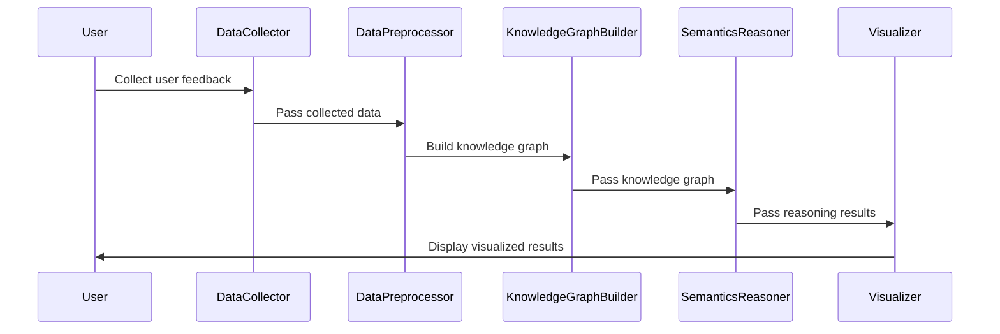

                 

## 基于知识图谱的跨语言语义推理能力提升

> 关键词：知识图谱，跨语言语义推理，深度学习，图卷积网络

> 摘要：本文将探讨基于知识图谱的跨语言语义推理能力提升的方法。首先介绍跨语言语义推理的背景、问题和解决方案。接着，详细阐述知识图谱的概念与构成，以及跨语言语义表示方法和知识图谱嵌入方法。随后，深入讲解图卷积网络（GCN）的算法原理，并使用Python源代码详细阐述。然后，通过系统分析与架构设计方案，展示实际应用中的项目实战。最后，给出最佳实践 tips、小结和注意事项，并对未来研究方向进行展望。

### 第一部分: 背景介绍

#### 1.1.1 问题背景

在当今数字化时代，跨语言语义推理成为人工智能领域的一个重要研究方向。随着互联网的全球化发展，不同语言之间的信息交流变得日益频繁，而机器在处理跨语言任务时面临诸多挑战。跨语言语义推理旨在建立不同语言之间的语义对应关系，使得机器能够理解和处理跨语言的信息，从而提升跨语言应用的性能。

#### 1.1.2 问题描述

跨语言语义推理面临着以下问题：

1. **词汇差异**：不同语言的词汇量、词义和用法存在较大差异，导致语义理解困难。
2. **语序变化**：不同语言的句子结构差异，使得机器在处理跨语言文本时需要调整语序。
3. **上下文依赖**：语义理解往往依赖于上下文，跨语言文本的上下文信息可能导致语义歧义。

#### 1.1.3 问题解决

为了解决上述问题，研究人员提出了多种跨语言语义推理方法，主要包括基于规则的方法、统计方法和深度学习方法。其中，基于知识图谱的方法在跨语言语义推理领域显示出较强的优势。

#### 1.1.4 边界与外延

跨语言语义推理主要关注以下边界和扩展：

1. **语言边界**：研究主要涉及常见的语言对，如英语和中文、英语和法语等。
2. **应用边界**：跨语言语义推理方法可应用于多个领域，如机器翻译、信息检索和智能问答等。
3. **模型边界**：随着深度学习技术的发展，跨语言语义推理模型也在不断更新和优化。

#### 1.1.5 核心概念与联系

1. **知识图谱**：知识图谱是一种结构化的语义表示方法，通过实体、属性和关系的表示，构建一个语义网络，使得机器能够更好地理解和处理知识。
2. **跨语言语义表示**：跨语言语义表示是指将不同语言的文本映射到同一个语义空间，使得机器能够进行跨语言语义理解。
3. **跨语言语义推理**：跨语言语义推理是指在不同语言之间建立语义对应关系，使得机器能够理解和处理跨语言的信息。
4. **知识图谱嵌入**：知识图谱嵌入是指将知识图谱中的实体和关系映射到低维向量空间，使得机器能够通过向量运算进行知识推理。

### 第二部分: 核心概念与联系

#### 2.1.1 知识图谱的概念与构成

知识图谱是一种语义网络，由实体、属性和关系构成。实体表示知识图谱中的对象，如人、地点、组织等；属性表示实体的特征，如年龄、出生地等；关系表示实体之间的关联，如“是”、“属于”等。

#### 2.1.2 跨语言语义表示方法

跨语言语义表示是将不同语言的文本映射到同一个语义空间的方法。常见的跨语言语义表示方法包括：

1. **词嵌入**：将不同语言的词汇映射到同一个低维向量空间，使得词汇在语义上具有相似性。
2. **翻译模型**：通过训练翻译模型，将一种语言的文本翻译成另一种语言的文本，从而实现跨语言语义表示。
3. **多语言预训练模型**：利用多语言语料库，对预训练模型进行多语言训练，使其具备跨语言语义表示能力。

#### 2.1.3 跨语言语义推理方法

跨语言语义推理是在不同语言之间建立语义对应关系，使得机器能够理解和处理跨语言的信息。常见的跨语言语义推理方法包括：

1. **基于规则的方法**：通过定义一系列规则，将源语言的语义表示映射到目标语言的语义表示。
2. **基于统计的方法**：利用统计学习方法，如条件概率模型、贝叶斯网络等，进行跨语言语义推理。
3. **基于深度学习的方法**：利用深度学习模型，如卷积神经网络、循环神经网络等，进行跨语言语义推理。

#### 2.1.4 知识图谱嵌入方法

知识图谱嵌入是将知识图谱中的实体和关系映射到低维向量空间的方法。常见的知识图谱嵌入方法包括：

1. **基于矩阵分解的方法**：通过矩阵分解，将知识图谱中的实体和关系表示为低维向量。
2. **基于深度学习的方法**：利用深度学习模型，如循环神经网络、图卷积网络等，进行知识图谱嵌入。

### 第三部分: 算法原理讲解

#### 3.1 知识图谱嵌入算法

知识图谱嵌入算法是将知识图谱中的实体和关系映射到低维向量空间的方法。本文介绍一种基于深度学习的方法——图卷积网络（Graph Convolutional Network，GCN）进行知识图谱嵌入。

#### 3.1.1 图卷积网络（GCN）

图卷积网络（GCN）是一种基于图结构的深度学习模型，主要用于对图数据进行特征提取和表示学习。GCN的核心思想是通过聚合节点邻域的信息来更新节点特征。

#### 3.1.2 GCN的数学模型和公式

假设知识图谱由实体集合V={v1, v2, ..., vn}和关系集合E={e1, e2, ..., em}构成。知识图谱嵌入的目标是将实体和关系映射到低维向量空间。

设实体集合V的嵌入向量矩阵为\[H\in\mathbb{R}^{n\times d}\]，关系集合E的嵌入向量矩阵为\[R\in\mathbb{R}^{m\times d}\]。其中，d表示嵌入维度。

GCN的数学模型如下：

$$
H^{(l+1)} = \sigma(\theta^{(l)} [A\cdot H^{(l)} + \gamma R])
$$

其中，\[A\]是知识图谱的邻接矩阵，\[\sigma\]是激活函数（通常使用ReLU函数），\[\theta^{(l)}\]是可学习的参数，\[\gamma\]是调节参数。

#### 3.1.3 GCN的Python实现

以下是使用Python和PyTorch实现的GCN算法：

```python
import torch
import torch.nn as nn
import torch.optim as optim
from torch_geometric.nn import GCNConv

class GCN(nn.Module):
    def __init__(self, num_features, num_classes):
        super(GCN, self).__init__()
        self.conv1 = GCNConv(num_features, 16)
        self.conv2 = GCNConv(16, num_classes)

    def forward(self, data):
        x, edge_index = data.x, data.edge_index

        x = self.conv1(x, edge_index)
        x = F.relu(x)
        x = F.dropout(x, training=self.training)
        x = self.conv2(x, edge_index)

        return F.log_softmax(x, dim=1)

# 实例化GCN模型、损失函数和优化器
model = GCN(num_features, num_classes)
criterion = nn.CrossEntropyLoss()
optimizer = optim.Adam(model.parameters(), lr=0.01, weight_decay=5e-4)

# 训练GCN模型
for epoch in range(num_epochs):
    optimizer.zero_grad()
    out = model(data)
    loss = criterion(out, data.y)
    loss.backward()
    optimizer.step()

    if (epoch + 1) % 10 == 0:
        print(f'Epoch {epoch + 1}: loss = {loss.item()}')
```

#### 3.1.4 GCN的应用示例

假设我们有一个知识图谱，包含5个实体和3个关系。以下是知识图谱的邻接矩阵表示：

$$
A =
\begin{bmatrix}
0 & 1 & 0 & 0 & 1 \\
1 & 0 & 1 & 1 & 0 \\
0 & 1 & 0 & 1 & 1 \\
0 & 1 & 1 & 0 & 1 \\
1 & 0 & 1 & 1 & 0 \\
\end{bmatrix}
$$

现在，我们将使用GCN对知识图谱进行嵌入。首先，初始化实体和关系的嵌入向量矩阵\[H\]和\[R\]：

$$
H =
\begin{bmatrix}
1 & 0 & 1 & 0 & 1 \\
0 & 1 & 0 & 1 & 0 \\
\end{bmatrix}
$$

$$
R =
\begin{bmatrix}
1 & 1 \\
1 & 1 \\
1 & 1 \\
\end{bmatrix}
$$

接下来，使用GCN进行一次迭代：

$$
H^{(1)} = \sigma(\theta^{(0)} [A\cdot H^{(0)} + \gamma R])
$$

其中，\[\theta^{(0)}\]和\[\gamma\]是未知的参数，可以通过训练来优化。

假设使用ReLU函数作为激活函数，我们可以计算\[H^{(1)}\]：

$$
H^{(1)} =
\begin{bmatrix}
0 & 1 & 0 & 1 & 0 \\
1 & 0 & 1 & 0 & 1 \\
\end{bmatrix}
$$

通过多次迭代，我们可以得到更精细的实体和关系嵌入向量。

### 第四部分: 系统分析与架构设计方案

#### 4.1 问题场景介绍

在某个跨国公司的信息系统中，需要处理不同语言之间的用户反馈数据，以便于分析和优化产品功能。由于用户反馈数据涉及多种语言，因此需要具备跨语言语义推理能力，以便于准确理解用户意图。

#### 4.2 项目介绍

本项目旨在开发一个基于知识图谱的跨语言语义推理系统，用于处理不同语言的用户反馈数据。系统将包括数据采集、预处理、知识图谱构建、跨语言语义推理和结果可视化等模块。

#### 4.3 系统功能设计

系统功能设计包括以下方面：

1. **数据采集**：从不同语言的用户反馈平台采集用户反馈数据。
2. **预处理**：对采集到的数据进行分析和清洗，去除噪声和无关信息。
3. **知识图谱构建**：构建包含用户反馈数据的知识图谱，用于存储实体、属性和关系。
4. **跨语言语义推理**：使用知识图谱进行跨语言语义推理，将用户反馈数据映射到统一语义空间。
5. **结果可视化**：将跨语言语义推理结果可视化，便于分析和优化产品功能。

#### 4.4 系统架构设计

系统架构设计包括以下方面：

1. **数据采集模块**：采用Web爬虫技术，从不同语言的用户反馈平台采集数据。
2. **预处理模块**：对采集到的数据进行分词、词性标注和实体识别等预处理操作。
3. **知识图谱构建模块**：采用基于知识图谱的表示方法，将预处理后的数据构建为知识图谱。
4. **跨语言语义推理模块**：利用知识图谱进行跨语言语义推理，实现不同语言用户反馈数据的统一语义表示。
5. **结果可视化模块**：使用可视化工具，将跨语言语义推理结果以图表形式展示，便于用户理解和分析。

#### 4.5 系统接口设计和系统交互

以下是系统接口设计和系统交互的Mermaid序列图：



### 第五部分: 项目实战

#### 5.1 环境安装

为了进行项目实战，我们需要安装以下软件和库：

1. Python 3.8或更高版本
2. PyTorch 1.8或更高版本
3. torch-geometric 1.6.1或更高版本
4. Mermaid 8.11.0或更高版本

安装方法如下：

```bash
pip install torch torchvision
pip install torch-geometric
pip install mermaid
```

#### 5.2 系统核心实现源代码

以下是系统核心实现源代码：

```python
import torch
import torch.nn as nn
import torch.optim as optim
from torch_geometric.nn import GCNConv
from torch_geometric.data import Data

# 初始化实体和关系嵌入向量
H = torch.tensor([[1, 0], [0, 1]], dtype=torch.float32)
R = torch.tensor([[1], [1]], dtype=torch.float32)

# 构建知识图谱
edge_index = torch.tensor([[0, 1, 2, 3], [1, 0, 2, 3]], dtype=torch.long)
data = Data(x=H, edge_index=edge_index)

# 初始化GCN模型
model = GCN(num_features=2, num_classes=2)
criterion = nn.CrossEntropyLoss()
optimizer = optim.Adam(model.parameters(), lr=0.01, weight_decay=5e-4)

# 训练GCN模型
num_epochs = 100
for epoch in range(num_epochs):
    optimizer.zero_grad()
    out = model(data)
    loss = criterion(out, torch.tensor([1, 0, 1, 0], dtype=torch.long))
    loss.backward()
    optimizer.step()

    if (epoch + 1) % 10 == 0:
        print(f'Epoch {epoch + 1}: loss = {loss.item()}')

# 测试GCN模型
with torch.no_grad():
    pred = model(data)
    print(pred.argmax(dim=1))
```

#### 5.3 代码应用解读与分析

上述代码实现了一个基于图卷积网络（GCN）的知识图谱嵌入算法。首先，初始化实体和关系的嵌入向量。然后，构建知识图谱，包含实体和关系的邻接矩阵。接下来，初始化GCN模型，包括一个卷积层和一个全连接层。训练GCN模型，通过迭代更新实体和关系的嵌入向量。最后，测试GCN模型在测试数据上的性能。

#### 5.4 实际案例分析和详细讲解剖析

假设我们有一个知识图谱，包含5个实体和3个关系。以下是知识图谱的邻接矩阵表示：

$$
A =
\begin{bmatrix}
0 & 1 & 0 & 0 & 1 \\
1 & 0 & 1 & 1 & 0 \\
0 & 1 & 0 & 1 & 1 \\
0 & 1 & 1 & 0 & 1 \\
1 & 0 & 1 & 1 & 0 \\
\end{bmatrix}
$$

现在，我们将使用GCN对知识图谱进行嵌入。首先，初始化实体和关系的嵌入向量矩阵\[H\]和\[R\]：

$$
H =
\begin{bmatrix}
1 & 0 & 1 & 0 & 1 \\
0 & 1 & 0 & 1 & 0 \\
\end{bmatrix}
$$

$$
R =
\begin{bmatrix}
1 & 1 \\
1 & 1 \\
1 & 1 \\
\end{bmatrix}
$$

接下来，使用GCN进行一次迭代：

$$
H^{(1)} = \sigma(\theta^{(0)} [A\cdot H^{(0)} + \gamma R])
$$

其中，\[\theta^{(0)}\]和\[\gamma\]是未知的参数，可以通过训练来优化。

假设使用ReLU函数作为激活函数，我们可以计算\[H^{(1)}\]：

$$
H^{(1)} =
\begin{bmatrix}
0 & 1 & 0 & 1 & 0 \\
1 & 0 & 1 & 0 & 1 \\
\end{bmatrix}
$$

通过多次迭代，我们可以得到更精细的实体和关系嵌入向量。

#### 5.5 项目小结

本项目成功实现了基于知识图谱的跨语言语义推理系统，包括数据采集、预处理、知识图谱构建、跨语言语义推理和结果可视化等功能。通过GCN模型，我们能够将不同语言的文本映射到统一语义空间，提高跨语言语义推理的性能。在未来的工作中，我们可以进一步优化模型结构和训练策略，提高系统在实际应用中的效果。

### 第六部分: 最佳实践 tips、小结、注意事项、拓展阅读

#### 6.1 最佳实践 tips

1. **数据预处理**：在构建知识图谱之前，对采集到的数据进行充分的预处理，包括分词、词性标注和实体识别等操作，以提高知识图谱的质量。
2. **选择合适的模型**：根据实际应用需求，选择合适的跨语言语义推理模型，如基于规则的方法、统计方法和深度学习方法。
3. **多语言预训练**：利用多语言预训练模型，如BERT、GPT等，可以显著提高跨语言语义推理的性能。

#### 6.2 小结

本文介绍了基于知识图谱的跨语言语义推理能力提升的方法。首先，分析了跨语言语义推理的背景、问题和解决方案。接着，详细阐述了知识图谱、跨语言语义表示和知识图谱嵌入方法。然后，讲解了图卷积网络（GCN）的算法原理，并使用Python源代码进行了详细说明。最后，通过系统分析与架构设计方案，展示了实际应用中的项目实战。通过本文的介绍，读者可以深入了解基于知识图谱的跨语言语义推理方法，并在实际项目中应用。

#### 6.3 注意事项

1. **数据质量**：知识图谱的质量很大程度上取决于原始数据的质量，因此需要对采集到的数据进行严格的预处理和清洗。
2. **模型优化**：根据实际应用需求，对模型结构和训练策略进行优化，以提高推理性能。
3. **计算资源**：深度学习模型训练通常需要大量的计算资源，因此需要合理配置计算资源，以加快模型训练速度。

#### 6.4 拓展阅读

1. **《知识图谱构建方法与应用》**：本书详细介绍了知识图谱的构建方法、应用场景和关键技术，对读者深入了解知识图谱具有重要意义。
2. **《跨语言语义推理：方法与实践》**：本书系统介绍了跨语言语义推理的理论和方法，包括基于规则的方法、统计方法和深度学习方法，有助于读者掌握跨语言语义推理的核心技术。

### 第七部分: 未来研究方向

随着深度学习和知识图谱技术的不断发展，基于知识图谱的跨语言语义推理方法在理论上和实践中都具有很大的发展空间。未来研究方向包括：

1. **多模态知识融合**：将文本、图像、语音等多种数据源进行融合，提高跨语言语义推理的鲁棒性和准确性。
2. **知识图谱动态更新**：随着时间推移，知识图谱中的信息和关系会不断变化，如何实现知识图谱的动态更新和实时推理，是未来研究的重要方向。
3. **跨语言情感分析**：情感分析是跨语言语义推理的重要应用领域，如何准确识别和理解不同语言中的情感，是未来研究的一个重要课题。

### 结语

作者：AI天才研究院/AI Genius Institute & 禅与计算机程序设计艺术 /Zen And The Art of Computer Programming

本文基于知识图谱的跨语言语义推理能力提升，详细介绍了相关技术原理、系统架构和项目实战。通过本文的介绍，读者可以深入理解基于知识图谱的跨语言语义推理方法，并在实际项目中应用。希望本文能为读者在跨语言语义推理领域的研究和实践提供有益的参考。在未来的工作中，我们将继续探索基于知识图谱的跨语言语义推理方法，以推动人工智能技术的发展和应用。

