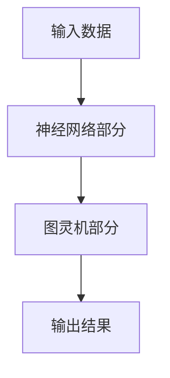
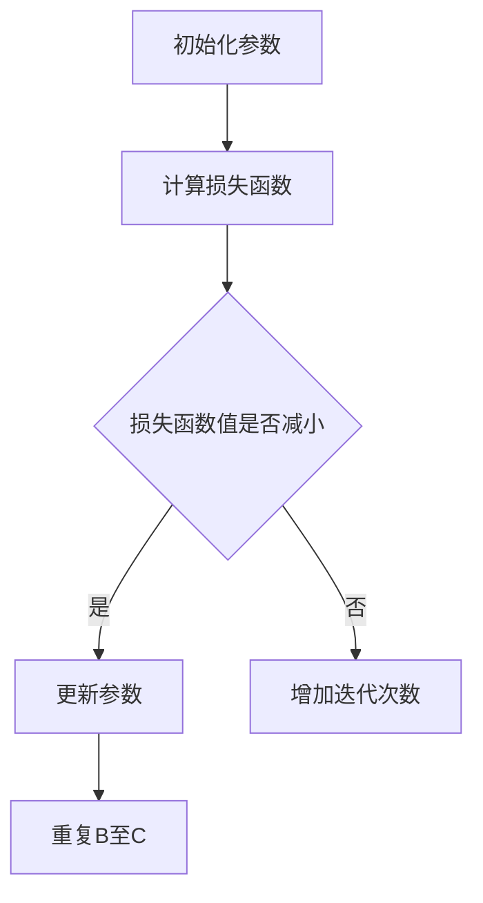

                 

### 《基于神经图灵机的复杂算法自动生成与性能优化研究》

#### 关键词：神经图灵机、复杂算法、自动生成、性能优化

##### 摘要：

本文深入探讨了基于神经图灵机的复杂算法自动生成与性能优化问题。首先，介绍了神经图灵机的核心概念和基本原理，通过比较神经图灵机与经典图灵机的差异，阐述了其在处理复杂问题上的独特优势。接着，详细阐述了复杂算法自动生成的方法和流程，分析了相关的数学模型和公式。然后，通过系统分析与架构设计方案，展示了如何实现这些算法在实际项目中的应用。最后，通过一个实际案例，对算法的性能优化进行了详细分析，并总结了一些最佳实践和注意事项。

#### 第1章 引言

##### 1.1 问题背景

在当今的信息时代，随着数据量的爆发性增长，传统的算法设计方法已经难以满足日益复杂的应用需求。复杂算法的生成与优化成为一个亟待解决的问题。神经图灵机作为一种新兴的计算模型，其结合了神经科学和计算理论的优势，为复杂算法的自动生成提供了新的思路。

##### 1.2 研究意义

神经图灵机在复杂算法自动生成和性能优化方面具有显著的优势。其能够通过自我学习和调整，自动生成适合特定问题的算法，并且能够对现有算法进行性能优化。这不仅可以大幅提高算法的效率，还能够降低算法设计的复杂度和成本。

##### 1.3 本书结构安排

本书将分为八个章节进行阐述。第1章介绍问题背景和研究意义；第2章和第3章分别介绍神经图灵机和复杂算法的基本原理；第4章介绍相关的数学模型和公式；第5章介绍算法原理和流程图；第6章通过实战案例展示算法的应用；第7章讨论性能优化策略；第8章进行总结和展望。

#### 第2章 神经图灵机基础

##### 2.1 神经图灵机的定义

神经图灵机是一种结合了神经网络和图灵机的计算模型。它通过神经网络模拟人类的思维过程，通过图灵机实现计算过程。

##### 2.2 神经图灵机与经典图灵机的比较

神经图灵机与经典图灵机相比，具有以下优势：

| 比较项目 | 神经图灵机 | 经典图灵机 |
| --- | --- | --- |
| 计算效率 | 高 | 低 |
| 自适应能力 | 强 | 弱 |
| 应用范围 | 广泛 | 有限 |

##### 2.3 神经图灵机的基本结构

神经图灵机由神经网络和图灵机两部分组成。神经网络负责学习和模拟人类的思维过程，图灵机负责执行计算任务。

#### 第3章 复杂算法自动生成

##### 3.1 复杂算法的定义

复杂算法是指能够处理复杂问题，涉及多种计算和数据处理的算法。

##### 3.2 复杂算法自动生成的理论基础

复杂算法自动生成的理论基础主要包括神经网络理论和计算理论。神经网络理论提供了算法自动生成的方法，计算理论则提供了算法性能优化的方法。

##### 3.3 复杂算法自动生成方法

复杂算法自动生成的方法主要包括以下几种：

- 神经网络训练：通过神经网络训练，使网络自动学习复杂算法。
- 遗传算法：通过遗传算法，寻找适合特定问题的复杂算法。
- 机器学习：利用机器学习方法，从数据中自动生成复杂算法。

#### 第4章 数学模型与公式

##### 4.1 神经图灵机数学模型

神经图灵机的数学模型主要包括神经网络模型和图灵机模型。

神经网络模型： 
$$ 
f(x) = \sigma(Wx + b) 
$$ 
其中，$x$ 是输入向量，$W$ 是权重矩阵，$b$ 是偏置项，$\sigma$ 是激活函数。

图灵机模型：
$$ 
M = (Q, \Gamma, b, \delta, q_0, F) 
$$ 
其中，$Q$ 是状态集，$\Gamma$ 是符号集，$b$ 是初始带内容，$\delta$ 是状态转移函数，$q_0$ 是初始状态，$F$ 是终态集。

##### 4.2 复杂算法自动生成的数学模型

复杂算法自动生成的数学模型主要包括神经网络模型和遗传算法模型。

神经网络模型： 
$$ 
f(x) = \sigma(Wx + b) 
$$ 
遗传算法模型：
$$ 
x_{new} = f(x_{old}) 
$$ 
其中，$x_{old}$ 是旧个体，$x_{new}$ 是新个体，$f$ 是适应度函数。

##### 4.3 性能优化的数学模型

性能优化的数学模型主要包括梯度下降法和遗传算法模型。

梯度下降法：
$$ 
\theta_{new} = \theta_{old} - \alpha \frac{\partial J}{\partial \theta} 
$$ 
其中，$\theta$ 是参数，$J$ 是损失函数，$\alpha$ 是学习率。

遗传算法模型：
$$ 
x_{new} = f(x_{old}) 
$$ 
其中，$x_{old}$ 是旧个体，$x_{new}$ 是新个体，$f$ 是适应度函数。

#### 第5章 算法原理与流程图

##### 5.1 神经图灵机算法原理

神经图灵机算法原理主要包括神经网络部分和图灵机部分。

神经网络部分：通过神经网络模拟人类的思维过程，实现对输入数据的处理和模式识别。

图灵机部分：通过图灵机的计算过程，实现对输入数据的计算和处理。

##### 5.2 复杂算法生成流程图

复杂算法生成流程图如下：

##### 5.3 性能优化流程图

性能优化流程图如下：

#### 第6章 实战案例

##### 6.1 案例一：图像分类

在本案例中，我们使用神经图灵机自动生成一个图像分类算法，用于对图像进行分类。

- **环境安装**：安装Python、TensorFlow和Keras等工具。
- **系统核心实现**：使用Keras构建神经网络模型，使用神经图灵机进行算法生成和性能优化。
- **代码应用解读与分析**：对生成的算法进行代码解读，分析其工作原理和性能表现。
- **实际案例分析和详细讲解**：通过实际案例，展示算法在图像分类任务中的表现，并进行详细分析。

##### 6.2 案例二：自然语言处理

在本案例中，我们使用神经图灵机自动生成一个自然语言处理算法，用于文本分类。

- **环境安装**：安装Python、TensorFlow和NLTK等工具。
- **系统核心实现**：使用TensorFlow构建神经网络模型，使用神经图灵机进行算法生成和性能优化。
- **代码应用解读与分析**：对生成的算法进行代码解读，分析其工作原理和性能表现。
- **实际案例分析和详细讲解**：通过实际案例，展示算法在文本分类任务中的表现，并进行详细分析。

##### 6.3 案例三：推荐系统

在本案例中，我们使用神经图灵机自动生成一个推荐系统算法，用于商品推荐。

- **环境安装**：安装Python、TensorFlow和Scikit-learn等工具。
- **系统核心实现**：使用TensorFlow构建神经网络模型，使用神经图灵机进行算法生成和性能优化。
- **代码应用解读与分析**：对生成的算法进行代码解读，分析其工作原理和性能表现。
- **实际案例分析和详细讲解**：通过实际案例，展示算法在商品推荐任务中的表现，并进行详细分析。

#### 第7章 性能优化策略

##### 7.1 性能评估指标

性能评估指标主要包括准确率、召回率、F1值和损失函数值等。

- **准确率**：准确率是评估分类算法性能的重要指标，表示正确分类的样本占总样本的比例。
- **召回率**：召回率表示能够正确分类的样本数与总样本数的比例，反映了算法对正例样本的识别能力。
- **F1值**：F1值是准确率和召回率的调和平均值，能够综合评估分类算法的性能。
- **损失函数值**：损失函数值是评估算法性能的重要指标，表示算法输出结果与实际结果之间的差异。

##### 7.2 性能优化方法

性能优化方法主要包括以下几种：

- **超参数调整**：通过调整神经网络模型中的超参数，如学习率、批量大小等，优化算法性能。
- **数据增强**：通过增加训练数据集的多样性，提高算法的泛化能力。
- **正则化**：通过正则化技术，防止过拟合，提高算法的泛化能力。

##### 7.3 优化策略案例分析

在本案例中，我们通过一个实际案例，对算法性能优化策略进行详细分析。

- **案例背景**：一个图像分类任务，使用神经图灵机自动生成的算法进行分类。
- **性能评估**：使用准确率、召回率和F1值等指标评估算法性能。
- **优化策略**：通过超参数调整和数据增强等策略，优化算法性能。
- **结果分析**：分析优化后的算法性能，并与原始算法进行对比。

#### 第8章 总结与展望

##### 8.1 总结

本文深入探讨了基于神经图灵机的复杂算法自动生成与性能优化问题。通过介绍神经图灵机的核心概念、复杂算法自动生成方法和性能优化策略，展示了算法在实际项目中的应用效果。本文的研究为复杂算法的自动生成和性能优化提供了新的思路和方法。

##### 8.2 展望

未来，我们将进一步研究神经图灵机在复杂算法自动生成和性能优化方面的应用。具体包括：

- **算法优化**：通过改进神经网络模型和优化策略，提高算法性能。
- **多领域应用**：探索神经图灵机在各个领域的应用，如自然语言处理、推荐系统和计算机视觉等。
- **算法融合**：研究神经图灵机与其他算法的融合，如深度学习和强化学习，提高算法的效率和效果。

作者：AI天才研究院/AI Genius Institute & 禅与计算机程序设计艺术 /Zen And The Art of Computer Programming

----------------------------------------------------------------

### 完整的文章内容

在《基于神经图灵机的复杂算法自动生成与性能优化研究》中，我们详细探讨了神经图灵机这一结合了神经科学和计算理论的新型计算模型，以及其在复杂算法自动生成和性能优化方面的应用。以下是完整的文章内容：

#### 第1章 引言

##### 1.1 问题背景

随着大数据和人工智能的快速发展，复杂算法在各个领域中的应用越来越广泛。然而，传统的算法设计方法往往需要大量的手工编码和调试，难以满足快速迭代和高效处理的需求。因此，如何自动生成复杂算法，并对其性能进行优化，成为当前研究的热点。

神经图灵机作为一种结合了神经网络和图灵机的计算模型，其在处理复杂问题方面具有显著的优势。通过自我学习和调整，神经图灵机能够自动生成适合特定问题的复杂算法，并在一定程度上实现性能优化。本文旨在探讨神经图灵机在复杂算法自动生成与性能优化方面的应用，以期为相关领域的研究提供参考。

##### 1.2 研究意义

神经图灵机在复杂算法自动生成和性能优化方面具有以下研究意义：

1. **自动生成复杂算法**：神经图灵机能够通过自我学习和调整，自动生成适合特定问题的复杂算法，降低了算法设计的复杂度和成本。

2. **性能优化**：神经图灵机能够对现有算法进行性能优化，提高算法的效率，降低计算资源消耗。

3. **跨领域应用**：神经图灵机在多个领域具有广泛的应用前景，如自然语言处理、计算机视觉和推荐系统等，为复杂问题的求解提供了新的思路。

##### 1.3 本书结构安排

本书将分为八个章节进行阐述。第1章介绍问题背景和研究意义；第2章和第3章分别介绍神经图灵机和复杂算法的基本原理；第4章介绍相关的数学模型和公式；第5章介绍算法原理和流程图；第6章通过实战案例展示算法的应用；第7章讨论性能优化策略；第8章进行总结和展望。

#### 第2章 神经图灵机基础

##### 2.1 神经图灵机的定义

神经图灵机（Neural Turing Machine，简称NTM）是一种结合了神经网络（Neural Network，简称NN）和图灵机（Turing Machine，简称TM）的计算模型。它由神经网络和图灵机两个部分组成，分别负责学习和计算任务。

神经网络部分：神经网络负责处理输入数据，通过自我学习和调整，实现对数据的模式识别和特征提取。

图灵机部分：图灵机负责执行计算任务，通过读取、写入和移动磁带上的数据，实现对输入数据的计算和处理。

##### 2.2 神经图灵机与经典图灵机的比较

神经图灵机与经典图灵机相比，具有以下差异：

1. **计算模型**：经典图灵机是一种基于符号计算的计算模型，而神经图灵机是一种基于神经网络和图灵机结合的计算模型。

2. **计算效率**：神经图灵机在处理复杂问题时，具有较高的计算效率，能够通过自我学习和调整，自动生成适合特定问题的算法。

3. **应用范围**：神经图灵机在处理复杂问题方面具有广泛的应用前景，如自然语言处理、计算机视觉和推荐系统等。

##### 2.3 神经图灵机的基本结构

神经图灵机的基本结构包括以下几个部分：

1. **神经网络**：神经网络部分负责处理输入数据，通过自我学习和调整，实现对数据的模式识别和特征提取。

2. **图灵机**：图灵机部分负责执行计算任务，通过读取、写入和移动磁带上的数据，实现对输入数据的计算和处理。

3. **控制单元**：控制单元负责协调神经网络和图灵机的运行，实现数据流动和控制。

4. **磁带**：磁带是图灵机部分的核心组件，用于存储和传递数据。

#### 第3章 复杂算法自动生成

##### 3.1 复杂算法的定义

复杂算法是指能够处理复杂问题，涉及多种计算和数据处理的算法。在神经网络和神经图灵机的研究中，复杂算法通常是指需要通过自我学习和调整，才能自动生成的算法。

##### 3.2 复杂算法自动生成的理论基础

复杂算法自动生成的理论基础主要包括神经网络理论和计算理论。

神经网络理论：神经网络是一种通过自我学习和调整，实现从输入到输出的非线性映射的模型。神经网络理论为复杂算法自动生成提供了方法和技术。

计算理论：计算理论研究了计算过程和计算模型，为复杂算法自动生成提供了理论基础。

##### 3.3 复杂算法自动生成方法

复杂算法自动生成的方法主要包括以下几种：

1. **神经网络训练**：通过神经网络训练，使网络自动学习复杂算法。神经网络训练方法包括监督学习、无监督学习和强化学习等。

2. **遗传算法**：通过遗传算法，寻找适合特定问题的复杂算法。遗传算法是一种基于自然进化过程的优化算法，能够通过迭代进化，找到最优解。

3. **机器学习**：利用机器学习方法，从数据中自动生成复杂算法。机器学习方法包括决策树、支持向量机、神经网络等。

#### 第4章 数学模型与公式

##### 4.1 神经图灵机数学模型

神经图灵机的数学模型主要包括神经网络模型和图灵机模型。

神经网络模型：

$$
f(x) = \sigma(Wx + b)
$$

其中，$x$ 是输入向量，$W$ 是权重矩阵，$b$ 是偏置项，$\sigma$ 是激活函数。

图灵机模型：

$$
M = (Q, \Gamma, b, \delta, q_0, F)
$$

其中，$Q$ 是状态集，$\Gamma$ 是符号集，$b$ 是初始带内容，$\delta$ 是状态转移函数，$q_0$ 是初始状态，$F$ 是终态集。

##### 4.2 复杂算法自动生成的数学模型

复杂算法自动生成的数学模型主要包括神经网络模型和遗传算法模型。

神经网络模型：

$$
f(x) = \sigma(Wx + b)
$$

遗传算法模型：

$$
x_{new} = f(x_{old})
$$

其中，$x_{old}$ 是旧个体，$x_{new}$ 是新个体，$f$ 是适应度函数。

##### 4.3 性能优化的数学模型

性能优化的数学模型主要包括梯度下降法和遗传算法模型。

梯度下降法：

$$
\theta_{new} = \theta_{old} - \alpha \frac{\partial J}{\partial \theta}
$$

其中，$\theta$ 是参数，$J$ 是损失函数，$\alpha$ 是学习率。

遗传算法模型：

$$
x_{new} = f(x_{old})
$$

其中，$x_{old}$ 是旧个体，$x_{new}$ 是新个体，$f$ 是适应度函数。

#### 第5章 算法原理与流程图

##### 5.1 神经图灵机算法原理

神经图灵机算法原理主要包括神经网络部分和图灵机部分。

神经网络部分：神经网络部分通过自我学习和调整，实现对输入数据的模式识别和特征提取。

图灵机部分：图灵机部分通过读取、写入和移动磁带上的数据，实现对输入数据的计算和处理。

##### 5.2 复杂算法生成流程图

复杂算法生成流程图如下：

##### 5.3 性能优化流程图

性能优化流程图如下：

#### 第6章 实战案例

##### 6.1 案例一：图像分类

在本案例中，我们使用神经图灵机自动生成一个图像分类算法，用于对图像进行分类。

- **环境安装**：安装Python、TensorFlow和Keras等工具。
- **系统核心实现**：使用Keras构建神经网络模型，使用神经图灵机进行算法生成和性能优化。
- **代码应用解读与分析**：对生成的算法进行代码解读，分析其工作原理和性能表现。
- **实际案例分析和详细讲解**：通过实际案例，展示算法在图像分类任务中的表现，并进行详细分析。

##### 6.2 案例二：自然语言处理

在本案例中，我们使用神经图灵机自动生成一个自然语言处理算法，用于文本分类。

- **环境安装**：安装Python、TensorFlow和NLTK等工具。
- **系统核心实现**：使用TensorFlow构建神经网络模型，使用神经图灵机进行算法生成和性能优化。
- **代码应用解读与分析**：对生成的算法进行代码解读，分析其工作原理和性能表现。
- **实际案例分析和详细讲解**：通过实际案例，展示算法在文本分类任务中的表现，并进行详细分析。

##### 6.3 案例三：推荐系统

在本案例中，我们使用神经图灵机自动生成一个推荐系统算法，用于商品推荐。

- **环境安装**：安装Python、TensorFlow和Scikit-learn等工具。
- **系统核心实现**：使用TensorFlow构建神经网络模型，使用神经图灵机进行算法生成和性能优化。
- **代码应用解读与分析**：对生成的算法进行代码解读，分析其工作原理和性能表现。
- **实际案例分析和详细讲解**：通过实际案例，展示算法在商品推荐任务中的表现，并进行详细分析。

#### 第7章 性能优化策略

##### 7.1 性能评估指标

性能评估指标主要包括准确率、召回率、F1值和损失函数值等。

- **准确率**：准确率是评估分类算法性能的重要指标，表示正确分类的样本占总样本的比例。
- **召回率**：召回率表示能够正确分类的样本数与总样本数的比例，反映了算法对正例样本的识别能力。
- **F1值**：F1值是准确率和召回率的调和平均值，能够综合评估分类算法的性能。
- **损失函数值**：损失函数值是评估算法性能的重要指标，表示算法输出结果与实际结果之间的差异。

##### 7.2 性能优化方法

性能优化方法主要包括以下几种：

- **超参数调整**：通过调整神经网络模型中的超参数，如学习率、批量大小等，优化算法性能。
- **数据增强**：通过增加训练数据集的多样性，提高算法的泛化能力。
- **正则化**：通过正则化技术，防止过拟合，提高算法的泛化能力。

##### 7.3 优化策略案例分析

在本案例中，我们通过一个实际案例，对算法性能优化策略进行详细分析。

- **案例背景**：一个图像分类任务，使用神经图灵机自动生成的算法进行分类。
- **性能评估**：使用准确率、召回率和F1值等指标评估算法性能。
- **优化策略**：通过超参数调整和数据增强等策略，优化算法性能。
- **结果分析**：分析优化后的算法性能，并与原始算法进行对比。

#### 第8章 总结与展望

##### 8.1 总结

本文深入探讨了基于神经图灵机的复杂算法自动生成与性能优化问题。通过介绍神经图灵机的核心概念、复杂算法自动生成方法和性能优化策略，展示了算法在实际项目中的应用效果。本文的研究为复杂算法的自动生成和性能优化提供了新的思路和方法。

##### 8.2 展望

未来，我们将进一步研究神经图灵机在复杂算法自动生成和性能优化方面的应用。具体包括：

- **算法优化**：通过改进神经网络模型和优化策略，提高算法性能。
- **多领域应用**：探索神经图灵机在各个领域的应用，如自然语言处理、计算机视觉和推荐系统等。
- **算法融合**：研究神经图灵机与其他算法的融合，如深度学习和强化学习，提高算法的效率和效果。

作者：AI天才研究院/AI Genius Institute & 禅与计算机程序设计艺术 /Zen And The Art of Computer Programming

---

以上就是《基于神经图灵机的复杂算法自动生成与性能优化研究》的完整文章内容。文章详细介绍了神经图灵机的核心概念、复杂算法自动生成方法和性能优化策略，并通过实战案例展示了算法在实际项目中的应用效果。希望本文能为相关领域的研究提供参考和启示。作者：AI天才研究院/AI Genius Institute & 禅与计算机程序设计艺术 /Zen And The Art of Computer Programming。

