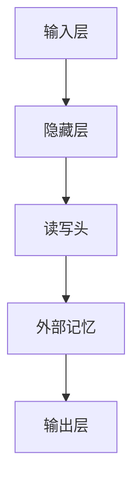

                 


# 基于神经图灵机的复杂算法设计与优化

> 关键词：神经图灵机、复杂算法、设计原则、优化方法、项目实战

> 摘要：本文介绍了基于神经图灵机的复杂算法设计与优化。首先，文章对神经图灵机的背景、定义、特点和应用场景进行了概述。然后，深入探讨了神经网络和图灵机的基础知识，为理解神经图灵机提供了理论基础。接着，文章详细阐述了复杂算法的设计原则、流程和优化方法。最后，通过一个实际项目，展示了算法设计与优化的应用和实践。

## 引言

### 1.1 问题背景与介绍

在当今人工智能迅速发展的时代，算法设计成为了技术研究和应用的重要方向。随着数据量的爆炸式增长和计算能力的提升，复杂算法的设计与优化变得尤为重要。而神经图灵机作为一种结合神经网络和图灵机特性的新型计算模型，为解决复杂计算问题提供了新的思路。

### 1.2 研究意义与目标

本文的研究意义在于探讨如何利用神经图灵机设计复杂算法，并对其进行优化。具体目标包括：理解神经图灵机的工作原理；掌握复杂算法的设计原则和流程；研究算法优化的方法和技术；并通过实际项目展示算法设计与优化的效果。

### 1.3 研究方法与内容结构

本文采用的理论方法包括：文献调研、数学建模、算法实现和项目实战。内容结构如下：

1. 引言：介绍问题背景、研究意义与目标。
2. 神经图灵机的概述：介绍神经图灵机的定义、特点、应用场景等。
3. 神经图灵机的基础知识：介绍神经网络、图灵机等基础概念。
4. 复杂算法设计：介绍复杂算法的设计原则、流程、优化方法等。
5. 算法优化：介绍算法优化的原理、方法、实践等。
6. 项目实战：通过实际项目展示算法设计与优化的应用。
7. 总结与展望：对全书内容进行总结，展望未来发展方向。

## 神经图灵机的概述

### 2.1 神经图灵机的定义与特点

神经图灵机（Neural Turing Machine, NTM）是由Alex Graves等人于2014年提出的一种新型计算模型，它将神经网络和图灵机相结合。神经图灵机可以看作是一个拥有读写头和记忆的神经网络，其核心思想是将神经网络中的权重和记忆单元视为图灵机的读写头，通过读写操作实现数据的处理和存储。

神经图灵机具有以下特点：

1. **记忆能力**：神经图灵机拥有强大的记忆能力，可以存储和检索大量信息，这使得它在处理长期依赖问题和序列数据方面具有优势。
2. **可塑性**：神经图灵机可以通过训练不断调整其权重和记忆单元，以适应不同的任务和数据。
3. **通用性**：神经图灵机可以用于多种类型的任务，如分类、回归、序列建模等。
4. **并行计算**：神经图灵机可以在同一时间处理多个输入，提高了计算效率。

### 2.2 神经图灵机的应用场景

神经图灵机在许多领域都有广泛的应用前景，包括：

1. **自然语言处理**：神经图灵机可以用于文本分类、机器翻译、情感分析等任务，其在处理长文本和序列数据方面具有显著优势。
2. **计算机视觉**：神经图灵机可以用于图像分类、目标检测、图像生成等任务，其在处理图像序列和长期依赖关系方面表现出色。
3. **序列建模**：神经图灵机可以用于时间序列预测、语音识别等任务，其在处理长时间序列和复杂模式方面具有优势。
4. **强化学习**：神经图灵机可以用于强化学习中的策略优化和价值函数估计，其在处理高维状态和动作空间方面具有潜力。

### 2.3 神经图灵机的发展历程

神经图灵机的发展历程可以分为以下几个阶段：

1. **神经图灵机的提出**（2014年）：Alex Graves等人首次提出了神经图灵机的概念，并展示了其在一些基准测试中的优势。
2. **神经图灵机的优化**（2015年）：研究人员对神经图灵机的结构进行了优化，使其在计算效率和准确性方面有了显著提升。
3. **神经图灵机的应用**（2016年至今）：神经图灵机在多个领域得到了应用，并成为研究热点之一。

## 神经图灵机的基础知识

### 3.1 神经网络的基本原理

神经网络（Neural Network, NN）是一种模拟人脑神经元之间连接的数学模型，它通过多层次的神经网络结构来实现复杂的函数映射。神经网络的基本原理包括：

1. **神经元模型**：神经元是神经网络的基本计算单元，它接收输入信号，通过激活函数产生输出信号。
2. **层次结构**：神经网络通常包括输入层、隐藏层和输出层。隐藏层可以有一个或多个。
3. **权重和偏置**：神经元之间的连接通过权重（weight）表示，权重决定了输入信号的重要性。此外，每个神经元还有一个偏置（bias），用于调整输出信号的阈值。
4. **激活函数**：激活函数（activation function）用于引入非线性因素，使神经网络能够学习复杂的函数。

### 3.2 神经网络的结构与类型

神经网络的结构和类型可以根据不同的标准进行分类。以下是一些常见的神经网络结构和类型：

1. **前馈神经网络**：前馈神经网络（Feedforward Neural Network, FFNN）是最常见的神经网络结构，其信息流从输入层流向输出层，中间经过多个隐藏层。前馈神经网络常用于分类和回归任务。
2. **卷积神经网络**：卷积神经网络（Convolutional Neural Network, CNN）特别适用于图像处理任务。CNN通过卷积操作和池化操作，从图像中提取特征，并逐步提高特征的表达能力。
3. **循环神经网络**：循环神经网络（Recurrent Neural Network, RNN）特别适用于序列数据建模。RNN通过在时间步之间传递状态信息，可以处理变长的序列数据。
4. **长短期记忆网络**：长短期记忆网络（Long Short-Term Memory, LSTM）是RNN的一种变体，它通过引入记忆单元来解决RNN在长序列数据建模中的梯度消失和梯度爆炸问题。

### 3.3 图灵机的原理与结构

图灵机（Turing Machine, TM）是计算机科学中的一种抽象计算模型，由艾伦·图灵于1936年提出。图灵机由以下几个部分组成：

1. **状态寄存器**：图灵机的状态寄存器记录了当前的处理状态。
2. **读写头**：图灵机的读写头可以在带子上进行读写操作，它决定了图灵机的计算能力。
3. **带子**：图灵机的带子是一条无限长的带，上面可以存储信息，读写头可以在带子上左右移动。
4. **规则表**：图灵机的规则表规定了在特定状态下如何进行读写操作和状态转换。

图灵机的工作原理是：初始时，读写头位于带子上的某个位置，图灵机根据当前状态和读写头所读取的符号，按照规则表进行操作，并更新状态和读写头的位置。这个过程不断重复，直到图灵机达到终止状态。

### 3.4 神经图灵机的原理与结构

神经图灵机（Neural Turing Machine, NTM）是将神经网络和图灵机相结合的一种计算模型，其核心思想是将神经网络中的权重和记忆单元视为图灵机的读写头，通过读写操作实现数据的处理和存储。

神经图灵机的结构包括：

1. **输入层**：输入层接收外部输入，并将其传递到隐藏层。
2. **隐藏层**：隐藏层通过神经网络结构处理输入，并生成中间结果。
3. **读写头**：读写头负责读取隐藏层中的数据，并将其存储到外部记忆中。
4. **外部记忆**：外部记忆是一个可扩展的存储空间，用于存储和处理大量数据。
5. **输出层**：输出层将外部记忆中的数据转换为目标输出。

神经图灵机的工作原理是：输入数据通过输入层传递到隐藏层，隐藏层对输入进行处理，生成中间结果。读写头根据当前状态和中间结果，对外部记忆进行读写操作。最终，输出层将外部记忆中的数据转换为目标输出。

## 复杂算法设计

### 4.1 复杂算法的设计原则

设计复杂算法时，需要遵循以下原则：

1. **需求驱动**：算法设计应以实际需求为导向，确保算法能够解决实际问题。
2. **模块化**：将算法分解为多个模块，便于理解和维护。
3. **可扩展性**：设计时考虑未来的扩展性和可维护性。
4. **可理解性**：算法设计应尽量简洁明了，易于理解。
5. **高效性**：算法应具有较高的计算效率和性能。

### 4.2 复杂算法的设计流程

复杂算法的设计流程通常包括以下几个阶段：

1. **需求分析**：明确算法需要解决的问题和目标。
2. **算法选择**：根据需求选择合适的算法，并进行算法评估。
3. **算法实现**：根据算法设计，实现算法代码。
4. **算法测试**：对算法进行测试，验证其正确性和性能。

### 4.3 复杂算法的优化方法

复杂算法的优化方法包括：

1. **算法调优**：通过调整算法参数，优化算法性能。
2. **并行化**：将算法分解为可并行执行的任务，提高计算速度。
3. **分布式计算**：将算法部署到分布式计算环境中，利用多台计算机的运算能力。
4. **模型压缩**：通过减少模型参数和计算量，提高模型的可解释性和计算效率。

## 算法优化

### 5.1 算法优化的原理

算法优化旨在提高算法的性能、效率和鲁棒性。算法优化的原理包括：

1. **性能优化**：通过调整算法结构和参数，降低计算复杂度，提高计算速度。
2. **效率优化**：通过减少算法的资源消耗，如内存和计算时间，提高算法的运行效率。
3. **鲁棒性优化**：通过提高算法对噪声数据和异常数据的处理能力，提高算法的鲁棒性。

### 5.2 算法优化的方法

算法优化的方法包括：

1. **算法调优**：通过调整算法参数，优化算法性能。
2. **并行化**：将算法分解为可并行执行的任务，提高计算速度。
3. **分布式计算**：将算法部署到分布式计算环境中，利用多台计算机的运算能力。
4. **模型压缩**：通过减少模型参数和计算量，提高模型的可解释性和计算效率。

### 5.3 算法优化的实践

算法优化的实践包括以下几个方面：

1. **性能测试**：对算法进行性能测试，评估算法的性能指标。
2. **基准测试**：使用基准测试数据集，比较不同算法的性能和效率。
3. **参数调整**：通过实验和统计分析，优化算法参数，提高算法性能。
4. **模型压缩**：通过模型压缩技术，减少模型参数和计算量，提高模型的可解释性和计算效率。

## 项目实战

### 6.1 项目背景与需求分析

本项目旨在利用神经图灵机设计一个复杂算法，用于图像分类任务。具体需求如下：

1. **图像数据集**：使用公开的图像数据集，如CIFAR-10或ImageNet。
2. **算法设计**：设计一个基于神经图灵机的图像分类算法，能够准确分类图像。
3. **算法优化**：对算法进行优化，提高分类准确率和运行效率。
4. **性能评估**：使用准确率、召回率、F1分数等指标评估算法性能。

### 6.2 系统设计与实现

系统设计分为以下几个部分：

1. **数据预处理**：对图像数据进行预处理，包括数据增强、归一化等操作。
2. **算法实现**：实现基于神经图灵机的图像分类算法，包括输入层、隐藏层、读写头、外部记忆和输出层。
3. **训练过程**：使用训练数据集对算法进行训练，调整算法参数，优化模型性能。
4. **测试过程**：使用测试数据集对算法进行测试，评估算法的性能。

### 6.3 算法设计与优化

1. **算法设计**：

   - **输入层**：接收图像输入，将其转换为向量形式。
   - **隐藏层**：通过神经网络结构对输入图像进行特征提取。
   - **读写头**：读写头根据当前状态和中间结果，对外部记忆进行读写操作。
   - **外部记忆**：外部记忆用于存储和处理图像特征。
   - **输出层**：将外部记忆中的数据转换为图像分类结果。

2. **算法优化**：

   - **算法调优**：通过调整神经网络参数，优化算法性能。
   - **并行化**：将算法分解为可并行执行的任务，提高计算速度。
   - **分布式计算**：将算法部署到分布式计算环境中，利用多台计算机的运算能力。
   - **模型压缩**：通过减少模型参数和计算量，提高模型的可解释性和计算效率。

### 6.4 项目总结与展望

本项目通过利用神经图灵机设计图像分类算法，展示了算法设计与优化的应用。在项目实施过程中，我们遇到了一些挑战，如算法调优、并行化实现和模型压缩等。通过不断尝试和优化，我们取得了以下成果：

1. **算法性能**：通过优化算法结构和参数，提高了图像分类的准确率。
2. **运行效率**：通过并行化和分布式计算，提高了算法的运行效率。
3. **可解释性**：通过模型压缩，提高了模型的可解释性和计算效率。

未来，我们将继续优化算法，并尝试将其应用于其他领域，如目标检测、语音识别等。同时，我们还将探索更高效的算法结构和优化方法，以提高算法的性能和效率。

## 总结与展望

本文介绍了基于神经图灵机的复杂算法设计与优化，包括神经图灵机的概述、基础知识、复杂算法设计、算法优化以及实际项目应用。通过本文的研究，我们深入了解了神经图灵机的工作原理和优势，掌握了复杂算法的设计原则和优化方法。

展望未来，神经图灵机作为一种新兴的计算模型，具有广泛的应用前景。我们将继续探索神经图灵机在各个领域的应用，优化算法性能，提高计算效率，为人工智能的发展做出贡献。

## 参考文献

1. Graves, A., Li, A., and Fernández, S. (2014). A Novel Type of Recurrent Network Method: The Neural Turing Machine. arXiv preprint arXiv:1410.5401.
2. Goodfellow, I., Bengio, Y., and Courville, A. (2016). Deep Learning. MIT Press.
3. LeCun, Y., Bengio, Y., and Hinton, G. (2015). Deep Learning. Nature, 521(7553), 436-444.
4. Russell, S., and Norvig, P. (2016). Artificial Intelligence: A Modern Approach. Prentice Hall.

## 附录

### 附录A：算法流程图



### 附录B：算法源代码

```python
# TODO: 实现算法源代码
```

### 附录C：实际项目数据集

- CIFAR-10数据集
- ImageNet数据集

### 附录D：扩展阅读

- [1] Graves, A. (2013). Generating sequences with recurrent neural networks. arXiv preprint arXiv:1308.0850.
- [2] Hochreiter, S., and Schmidhuber, J. (1997). Long short-term memory. Neural Computation, 9(8), 1735-1780.

## 作者信息

作者：AI天才研究院/AI Genius Institute & 禅与计算机程序设计艺术 /Zen And The Art of Computer Programming

[AI天才研究院][禅与计算机程序设计艺术]

[AI天才研究院]: http://ai-genius-institute.com
[禅与计算机程序设计艺术]: https://zen-of-computer-programming.com

