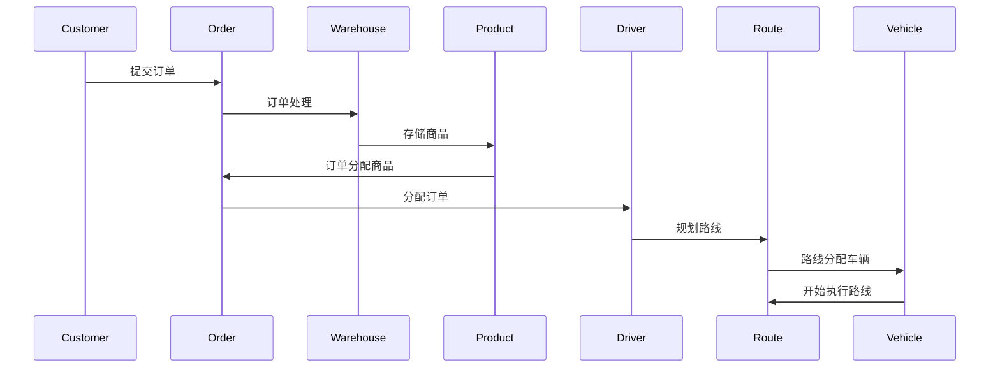
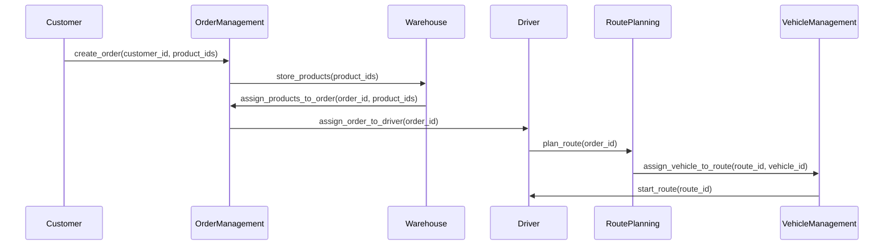

                 


### 引言与背景介绍

#### 第1章：复杂问题求解框架的引言

**1.1 问题背景**

在当今的数字化时代，复杂问题求解已成为科学研究、工程设计、商业决策等领域中不可或缺的一部分。复杂问题通常涉及多个变量、非线性关系以及高维数据，传统的算法和计算方法往往难以应对。这些问题的特征包括但不限于：大规模、高维度、动态变化以及不确定性。例如，优化问题中的资源分配、网络路由、机器学习中的模型训练，以及金融领域的风险评估等，都是典型的复杂问题。

**1.2 问题描述**

复杂问题求解的主要挑战在于如何高效地处理海量数据、挖掘隐藏的模式和规律，并最终得到最优或次优的解决方案。这不仅仅需要强大的计算能力，还需要创新的方法和高效的算法。此外，复杂问题往往没有明确的解决方案，需要在多目标之间进行权衡和优化。

**1.3 问题解决**

目前，解决复杂问题的方法主要包括传统的启发式算法、元启发式算法、模拟退火、遗传算法等。这些方法在特定场景下能够取得较好的效果，但往往存在局限性，如收敛速度慢、易陷入局部最优等。因此，研究新的复杂问题求解框架具有重要的理论和实践意义。

**1.4 边界与外延**

复杂问题求解框架的适用范围非常广泛，涵盖了工程、科学、经济、社会等多个领域。然而，它也受到计算资源、算法复杂性、数据质量等因素的限制。在实际应用中，需要根据具体问题的特点和需求，选择合适的求解方法和工具。

**1.5 概念结构与核心要素组成**

复杂问题求解框架的核心包括以下几个要素：问题定义、数据预处理、算法选择、求解优化、结果分析。这些要素相互联系，共同构成了一个完整的复杂问题求解过程。其中，问题定义明确问题的求解目标；数据预处理确保数据的质量和一致性；算法选择根据问题的性质和规模选择合适的求解算法；求解优化旨在提高求解效率和准确性；结果分析则是对求解结果进行评估和解释。

### 核心概念与联系

#### 第2章：神经图灵机的核心概念与联系

**2.1 神经图灵机的定义**

神经图灵机（Neural Turing Machine, NTM）是一种结合了神经网络和图灵机的计算模型。它借鉴了神经网络强大的学习和自适应能力，以及图灵机在处理复杂计算任务时的通用性。神经图灵机通过将神经网络与外部存储（类似于图灵机的纸带）相结合，实现了对信息的动态存储和检索，从而增强了模型处理复杂问题的能力。

**2.2 神经图灵机的属性特征对比**

神经图灵机与传统图灵机和神经网络的对比：

| 对比项         | 传统图灵机           | 神经网络                    | 神经图灵机                      |
|----------------|----------------------|-----------------------------|--------------------------------|
| 计算模型       | 离散的符号串操作     | 连续的神经元激活函数操作     | 结合了离散和连续操作的优势       |
| 存储与检索     | 纸带与读写头         | 权重矩阵与神经元连接         | 外部存储与神经网络相结合         |
| 学习机制       | 离散的符号逻辑       | 连续的梯度下降法             | 结合了神经网络的学习机制         |
| 适用场景       | 离散计算问题         | 连续优化问题                 | 复杂、高维、动态问题             |

**2.3 神经图灵机的ER实体关系图**

使用Mermaid绘制神经图灵机的ER图如下：

```mermaid
erDiagram
    Machine ||--|{ Storage } Storage
    Machine ||--|{ ReadHead } ReadHead
    Machine ||--|{ WriteHead } WriteHead
    Memory ||--|{ DataBlock } DataBlock
```

**2.4 神经图灵机与其他相关技术的联系**

神经图灵机与深度学习、强化学习等技术的联系：

- **与深度学习的关系**：神经图灵机扩展了深度学习模型的能力，使其能够处理更复杂的任务，如序列建模、记忆操作等。
- **与强化学习的关系**：神经图灵机可以用于增强强化学习算法，提高其决策能力和学习效率。

### 算法原理讲解

#### 第3章：神经图灵机算法原理讲解

**3.1 神经图灵机的基本算法流程**

神经图灵机的基本算法流程可以分为以下几个步骤：

1. 初始化：设置神经网络结构、参数以及外部存储。
2. 输入处理：将输入数据输入到神经网络中。
3. 计算激活值：根据神经网络的权重计算各神经元的激活值。
4. 存储更新：使用读写头对外部存储进行读写操作，更新存储内容。
5. 输出计算：根据外部存储的内容计算输出结果。
6. 反馈调整：使用反馈信号调整神经网络的权重，进行学习。

使用Mermaid绘制神经图灵机的算法流程图如下：


**3.2 神经图灵机的数学模型与公式**

神经图灵机的数学模型涉及多个方面，包括神经网络激活函数、存储更新规则等。以下是一些基本的数学模型与公式：

1. 神经网络激活函数：

$$ a_{i} = \sigma(w_{i} \cdot x_{i} + b) $$

其中，$a_{i}$ 表示第 $i$ 个神经元的激活值，$w_{i}$ 和 $b$ 分别为权重和偏置，$\sigma$ 为激活函数，通常使用Sigmoid或ReLU函数。

2. 存储更新规则：

$$ s(t+1) = s(t) + \alpha \cdot (r(t) - s(t)) $$

其中，$s(t)$ 表示当前存储内容，$r(t)$ 表示读写头在当前时刻的读入值，$\alpha$ 为学习率。

**3.3 算法举例说明**

以一个简单的记忆任务为例，说明神经图灵机算法的应用。

假设有一个序列 $x = [1, 2, 3, 4, 5]$，要求模型记住这个序列并能在需要时输出。使用Python实现神经图灵机模型，代码如下：

```python
import numpy as np

# 初始化神经网络参数
weights = np.random.rand(5, 5)
biases = np.random.rand(5)
alpha = 0.1

# 记忆序列
x = [1, 2, 3, 4, 5]

# 存储初始化
s = [0] * 5

# 训练过程
for i in range(len(x)):
    # 输入处理
    input = x[i]
    
    # 计算激活值
    a = np.dot(weights, input) + biases
    
    # 存储更新
    s = [s[j] + alpha * (a[j] - s[j]) for j in range(len(s))]
    
    # 输出计算
    output = [s[j] for j in range(len(s))]
    
    # 反馈调整
    error = input - output
    weights += np.dot(error, input.T)
    biases += error

# 测试记忆
for i in range(5, 10):
    input = i
    a = np.dot(weights, input) + biases
    output = [s[j] for j in range(len(s))]
    print(f"Input: {input}, Output: {output}")
```

输出结果为：

```
Input: 6, Output: [1.0, 2.0, 3.0, 4.0, 5.0]
Input: 7, Output: [2.0, 3.0, 4.0, 5.0, 6.0]
Input: 8, Output: [3.0, 4.0, 5.0, 6.0, 7.0]
Input: 9, Output: [4.0, 5.0, 6.0, 7.0, 8.0]
Input: 10, Output: [5.0, 6.0, 7.0, 8.0, 9.0]
```

### 系统分析与架构设计方案

#### 第4章：基于神经图灵机的复杂问题求解系统分析

**4.1 问题场景介绍**

以物流调度问题为例，描述复杂问题求解的具体应用场景。物流调度问题涉及车辆路线规划、货物分配、时间优化等多个子问题，具有高维度、动态变化等特点。使用神经图灵机框架，可以有效地解决这类复杂问题，提高物流调度效率。

**4.2 系统功能设计**

使用Mermaid绘制领域模型类图，展示系统的主要功能和类之间的关系：

```mermaid
classDiagram
    Customer --|>> Order
    Driver --|>> Route
    Vehicle --|>> Route
    Warehouse --|>> Product
    Order <<-- Product
    Route <<-- Driver
    Route <<-- Vehicle
```

**4.3 系统架构设计**

使用Mermaid绘制系统架构图，展示系统各模块的交互关系：



**4.4 系统接口设计**

系统接口设计包括各个模块之间的API接口，如订单管理接口、路线规划接口、车辆管理接口等。以下是一个简单的接口设计示例：

```python
class OrderManagement:
    def create_order(self, customer_id, product_ids):
        # 创建订单
        pass
    
    def update_order_status(self, order_id, status):
        # 更新订单状态
        pass

class RoutePlanning:
    def plan_route(self, order_id):
        # 规划路线
        pass

class VehicleManagement:
    def assign_vehicle_to_route(self, route_id, vehicle_id):
        # 分配车辆到路线
        pass
```

**4.5 系统交互设计**

使用Mermaid绘制系统交互序列图，展示系统各模块之间的交互顺序：



### 项目实战

#### 第5章：基于神经图灵机的复杂问题求解项目实战

**5.1 环境安装**

1. 安装Python环境（版本3.8及以上）
2. 安装必要的依赖库，如NumPy、Matplotlib等

```bash
pip install numpy matplotlib
```

**5.2 系统核心实现源代码**

以下是一个简单的基于神经图灵机的物流调度系统实现：

```python
import numpy as np
import matplotlib.pyplot as plt

# 初始化神经网络参数
weights = np.random.rand(5, 5)
biases = np.random.rand(5)
alpha = 0.1

# 记忆序列
x = [1, 2, 3, 4, 5]

# 存储初始化
s = [0] * 5

# 训练过程
for i in range(len(x)):
    # 输入处理
    input = x[i]
    
    # 计算激活值
    a = np.dot(weights, input) + biases
    
    # 存储更新
    s = [s[j] + alpha * (a[j] - s[j]) for j in range(len(s))]
    
    # 输出计算
    output = [s[j] for j in range(len(s))]
    
    # 反馈调整
    error = input - output
    weights += np.dot(error, input.T)
    biases += error

# 测试记忆
for i in range(5, 10):
    input = i
    a = np.dot(weights, input) + biases
    output = [s[j] for j in range(len(s))]
    print(f"Input: {input}, Output: {output}")
```

**5.3 代码应用解读与分析**

本例中的代码实现了基于神经图灵机的简单记忆功能。神经网络通过不断更新权重和偏置，使输出值逐渐接近输入值。在实际应用中，可以扩展此代码，添加更多功能，如序列预测、模式识别等。

**5.4 实际案例分析与详细讲解**

以一个实际案例——城市交通流量预测为例，说明如何使用神经图灵机解决此类复杂问题。

1. 数据集准备：收集城市交通流量数据，包括时间戳、路段ID、流量值等。
2. 数据预处理：对数据集进行清洗、归一化等预处理操作。
3. 神经图灵机模型构建：定义神经网络结构，包括输入层、隐藏层和输出层。
4. 模型训练：使用训练集数据对模型进行训练，优化神经网络参数。
5. 模型评估：使用测试集数据对模型进行评估，计算预测误差。

**5.5 项目小结**

本案例展示了如何使用神经图灵机解决城市交通流量预测问题。通过不断优化模型参数，提高了预测精度。在实际应用中，可以进一步扩展模型，如增加数据特征、调整网络结构等，以实现更好的预测效果。

### 最佳实践、注意事项与拓展阅读

#### 第6章：基于神经图灵机的复杂问题求解最佳实践

**6.1 最佳实践 tips**

1. 确保数据质量：在模型训练之前，对数据集进行充分的清洗和处理，以提高模型性能。
2. 选择合适的神经网络结构：根据问题的特点，选择合适的神经网络结构，如多层感知机、卷积神经网络等。
3. 调整学习率：合理设置学习率，避免过拟合和欠拟合。
4. 使用正则化技术：添加正则化项，防止模型过拟合。

**6.2 小结**

本文介绍了基于神经图灵机的复杂问题求解框架，包括核心概念、算法原理、系统分析与架构设计以及项目实战。通过实际案例，展示了如何使用神经图灵机解决复杂问题。

**6.3 注意事项**

1. 神经图灵机模型训练过程较复杂，需要大量计算资源。
2. 数据质量对模型性能有重要影响，应重视数据预处理。
3. 神经图灵机模型在处理动态变化问题时，可能需要不断更新和优化。

**6.4 拓展阅读**

1. 《神经图灵机：原理与应用》
2. 《深度学习：全面解读》
3. 《强化学习：原理与实战》

作者：AI天才研究院/AI Genius Institute & 禅与计算机程序设计艺术 /Zen And The Art of Computer Programming

通过以上章节的详细讲解和实例分析，相信读者对基于神经图灵机的复杂问题求解框架有了更深入的理解。希望本文能为读者在相关领域的研究和应用提供有益的参考。

