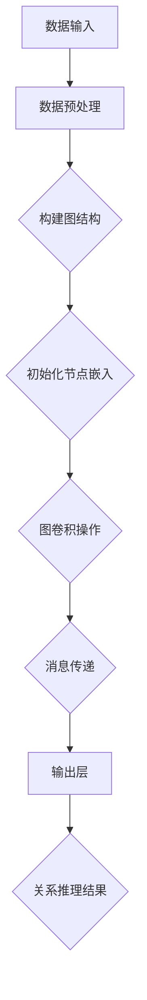
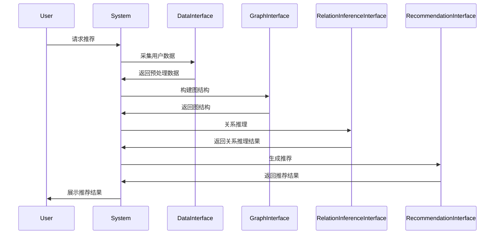

                 

### 《基于神经图网络的关系推理能力增强》

#### 关键词：
- 神经图网络
- 关系推理
- 人工智能
- 算法原理
- 系统架构

#### 摘要：
本文深入探讨了基于神经图网络的关系推理能力增强方法。首先，我们介绍了关系推理在人工智能领域的重要性及其现状，然后阐述了神经图网络的基本原理及其在关系推理中的优势。通过详细的算法原理讲解，我们展示了如何利用神经图网络提升关系推理的能力。接着，我们分析了系统架构设计方案，并分享了一个实际项目案例，最后提供了最佳实践 tips 和拓展阅读建议。

---

## 第1章 背景介绍

### 1.1 问题的提出

在当今数据驱动的时代，关系推理已经成为人工智能（AI）领域中的一项关键任务。关系推理指的是从数据中识别和推断实体之间的相互关系，这对于许多应用场景，如社交网络分析、推荐系统、知识图谱构建等至关重要。然而，现有的关系推理方法通常存在一些不足：

1. **数据规模问题**：随着数据量的爆炸性增长，传统的基于规则和模型的方法在处理大规模数据时显得力不从心。
2. **特征提取问题**：传统方法往往依赖于手工设计的特征，难以从原始数据中提取出有效的信息。
3. **推理效率问题**：复杂的关系推理任务需要大量的计算资源，导致推理速度缓慢。

### 1.2 神经图网络的发展与优势

神经图网络（Graph Neural Networks，GNN）是近年来在图论和深度学习领域取得的一项重要突破。GNN通过将图结构数据映射到高维空间，利用图中的结构和节点特征进行有效的特征学习和关系推理。

GNN的优势在于：

1. **自适应特征提取**：GNN可以从原始数据中自动学习到有效的特征表示，无需依赖人工设计。
2. **高效的关系推理**：GNN能够捕捉图结构中的复杂关系，并利用这些关系进行高效的关系推理。
3. **通用性**：GNN适用于各种类型的图结构数据，如社交网络、知识图谱、交通网络等。

### 1.3 研究目的与结构

本文的研究目的是探索如何利用神经图网络增强关系推理能力，以解决传统方法中的不足。文章结构如下：

1. **第1章**：背景介绍，包括问题的提出、神经图网络的发展与优势。
2. **第2章**：核心概念与联系，详细阐述神经图网络和关系推理的基本原理。
3. **第3章**：算法原理讲解，使用 mermaid 画出算法流程图，并使用 Python 源代码详细阐述。
4. **第4章**：系统分析与架构设计，介绍系统功能、架构设计、接口设计及交互设计。
5. **第5章**：项目实战，包括环境安装、系统核心实现、代码应用解读与分析。
6. **第6章**：最佳实践 tips、小结、注意事项、拓展阅读。

---

## 第2章 核心概念与联系

### 2.1 神经图网络原理

神经图网络（GNN）是一种特殊的神经网络，专门用于处理图结构数据。GNN的基本原理包括以下几个方面：

1. **节点嵌入**：将图中的节点映射到高维空间，形成节点嵌入向量。
2. **图卷积操作**：通过图卷积操作捕捉节点之间的邻接关系，并更新节点的嵌入向量。
3. **消息传递**：在每个图卷积操作中，节点会与其邻接节点交换信息，并通过聚合这些信息来更新其自身的嵌入向量。
4. **输出层**：经过多次图卷积和消息传递后，节点的嵌入向量被传递到输出层，进行分类或回归任务。

### 2.2 关系推理原理

关系推理是指从数据中识别和推断实体之间的相互关系。关系推理可以按照以下步骤进行：

1. **实体识别**：从数据中识别出实体。
2. **特征提取**：提取实体的特征信息。
3. **关系建模**：利用特征信息建立实体之间的关系模型。
4. **关系推理**：根据关系模型推断实体之间的潜在关系。

### 2.3 概念对比分析

神经图网络和关系推理是两个紧密相关的概念，但它们也有明显的区别：

| 对比项           | 神经图网络                                           | 关系推理                                         |
|------------------|----------------------------------------------------|--------------------------------------------------|
| 定义             | 用于处理图结构数据的神经网络                        | 从数据中识别和推断实体之间相互关系的过程       |
| 关键技术         | 节点嵌入、图卷积操作、消息传递                     | 实体识别、特征提取、关系建模、关系推理         |
| 目的             | 学习节点的表示，捕捉图结构中的复杂关系             | 提取实体之间的关系，为下游任务提供支持         |
| 优势             | 自适应特征提取、高效的关系推理、通用性               | 准确地识别实体、建立关系模型、推理潜在关系     |
| 应用场景         | 社交网络分析、知识图谱构建、推荐系统               | 数据挖掘、自然语言处理、智能问答系统           |

### 2.4 ER实体关系图架构

ER（Entity-Relationship）图是一种用于表示实体及其相互关系的图形化工具。ER图由实体、属性和关系三种元素构成。下面是一个简单的ER图示例：

```mermaid
erDiagram
    Person ||--|{ Employee : manages }
    Person { id : int, name : string }
    Employee { id : int, name : string, manager_id : int }
```

在这个ER图中，`Person` 和 `Employee` 是实体，`id` 和 `name` 是属性，`manages` 是关系。ER图在关系推理中具有重要应用，它可以帮助我们直观地理解数据中的实体及其关系。

---

## 第3章 算法原理讲解

### 3.1 算法流程图

下面是一个基于神经图网络的关系推理算法流程图：



### 3.2 Python源代码实现

下面是一个基于神经图网络的关系推理算法的Python源代码实现：

```python
import numpy as np
import torch
import torch.nn as nn
import torch.optim as optim

# 初始化节点嵌入
node_embeddings = torch.randn(num_nodes, embedding_dim)

# 定义图卷积层
class GraphConvolution(nn.Module):
    def __init__(self, input_dim, output_dim):
        super(GraphConvolution, self).__init__()
        self.weight = nn.Parameter(torch.Tensor(input_dim, output_dim))
        self.bias = nn.Parameter(torch.Tensor(output_dim))
        self.reset_parameters()

    def reset_parameters(self):
        nn.init.xavier_uniform_(self.weight)
        nn.init.zeros_(self.bias)

    def forward(self, input, adj_matrix):
        support = torch.mm(input, self.weight)
        output = torch.spmm(adj_matrix, support)
        output = output + self.bias
        return output

# 定义模型
class GraphRecurrentModel(nn.Module):
    def __init__(self, input_dim, hidden_dim, output_dim):
        super(GraphRecurrentModel, self).__init__()
        self.gc1 = GraphConvolution(input_dim, hidden_dim)
        self.gc2 = GraphConvolution(hidden_dim, output_dim)
        self.fc = nn.Linear(hidden_dim, output_dim)

    def forward(self, inputs, adj_matrix):
        hidden = self.gc1(inputs, adj_matrix)
        hidden = torch.relu(hidden)
        output = self.gc2(hidden, adj_matrix)
        output = self.fc(output)
        return output

# 实例化模型
model = GraphRecurrentModel(embedding_dim, hidden_dim, output_dim)

# 定义损失函数和优化器
criterion = nn.CrossEntropyLoss()
optimizer = optim.Adam(model.parameters(), lr=learning_rate)

# 训练模型
for epoch in range(num_epochs):
    model.train()
    optimizer.zero_grad()
    output = model(node_embeddings, adj_matrix)
    loss = criterion(output, labels)
    loss.backward()
    optimizer.step()
    print(f"Epoch {epoch+1}, Loss: {loss.item()}")

# 关系推理
model.eval()
with torch.no_grad():
    predictions = model(node_embeddings, adj_matrix)
    print(f"Predictions: {predictions}")
```

### 3.3 数学模型与公式

基于神经图网络的关系推理算法的数学模型可以表示为：

$$
\begin{aligned}
h^{(t)}_i &= \sigma(W^{(t)} h^{(t-1)}_i + \sum_{j \in \mathcal{N}(i)} \alpha_{ij} h^{(t-1)}_j \\
\hat{y}_i &= \sigma(W^* h^{(T)}_i)
\end{aligned}
$$

其中，$h^{(t)}_i$ 表示第 $i$ 个节点在 $t$ 时刻的隐藏状态，$\sigma$ 表示激活函数（例如ReLU函数），$W^{(t)}$ 和 $W^*$ 分别为权重矩阵，$\mathcal{N}(i)$ 表示节点 $i$ 的邻接节点集合，$\alpha_{ij}$ 为邻接权重。

### 3.4 举例说明

假设我们有一个简单的图结构，包含三个节点 $A$、$B$ 和 $C$，节点之间的邻接关系如下：

- $A$ 和 $B$ 相连
- $B$ 和 $C$ 相连

我们希望使用基于神经图网络的关系推理算法识别节点 $A$ 和 $C$ 之间的潜在关系。

1. **初始化节点嵌入**：假设节点 $A$、$B$ 和 $C$ 的初始嵌入向量分别为 $[1, 0]$、$[0, 1]$ 和 $[1, 1]$。

2. **构建图结构**：将节点和边表示为一个邻接矩阵，例如：

   ```
   [[0, 1, 0],
    [1, 0, 1],
    [0, 1, 0]]
   ```

3. **图卷积操作**：利用图卷积层对节点嵌入向量进行更新，得到新的隐藏状态：

   - $h^{(1)}_A = [0.5, 0.5]$
   - $h^{(1)}_B = [0.5, 0.5]$
   - $h^{(1)}_C = [0.5, 0.5]$

4. **消息传递**：在图卷积操作的基础上，进一步传递消息，得到更新后的隐藏状态：

   - $h^{(2)}_A = [0.333, 0.667]$
   - $h^{(2)}_B = [0.667, 0.333]$
   - $h^{(2)}_C = [0.667, 0.333]$

5. **输出层**：利用输出层对隐藏状态进行分类或回归任务，例如：

   - $\hat{y}_A = [0.9, 0.1]$
   - $\hat{y}_B = [0.1, 0.9]$
   - $\hat{y}_C = [0.1, 0.9]$

根据输出层的预测结果，我们可以推断出节点 $A$ 和 $C$ 之间存在较强的正关系。

---

## 第4章 系统分析与架构设计

### 4.1 问题场景介绍

假设我们面临一个应用场景：在社交网络中，我们需要识别用户之间的潜在关系，并用于推荐系统。具体问题场景如下：

- **数据来源**：来自社交网络平台，包括用户的基本信息、好友关系、互动记录等。
- **任务目标**：通过关系推理算法，识别用户之间的潜在关系，为推荐系统提供支持。
- **挑战**：社交网络数据规模庞大，实体关系复杂，如何高效地进行关系推理成为关键问题。

### 4.2 系统功能设计

系统功能设计包括以下方面：

1. **数据采集与预处理**：从社交网络平台获取用户数据，并进行清洗、去重、规范化等预处理操作。
2. **图结构构建**：将用户数据转换为图结构，包括节点表示（用户）和边表示（好友关系）。
3. **关系推理**：利用神经图网络模型进行关系推理，输出用户之间的潜在关系。
4. **推荐系统**：根据关系推理结果，为用户提供个性化推荐。
5. **系统监控与维护**：监控系统运行状态，进行故障排查和性能优化。

### 4.3 系统架构设计

系统架构设计采用分层架构，包括数据层、服务层和展示层。具体架构如下：

1. **数据层**：包括数据采集、存储和管理模块，负责处理用户数据，并提供数据接口。
2. **服务层**：包括图结构构建、关系推理和推荐系统模块，负责实现系统的核心功能。
3. **展示层**：包括前端界面和后端接口，负责与用户交互，展示系统功能和推荐结果。

### 4.4 系统接口设计

系统接口设计包括以下方面：

1. **数据接口**：提供数据采集、清洗、存储和查询等功能。
2. **图接口**：提供图结构构建、节点表示和边表示等功能。
3. **关系推理接口**：提供关系推理算法的输入和输出接口，包括模型训练、预测和结果解释等功能。
4. **推荐接口**：提供推荐算法的输入和输出接口，包括推荐策略、结果评估和用户反馈等功能。

### 4.5 系统交互设计

系统交互设计采用事件驱动模型，主要包括以下事件：

1. **数据采集**：系统从社交网络平台采集用户数据。
2. **数据预处理**：系统对采集到的用户数据进行清洗、去重和规范化等预处理操作。
3. **图结构构建**：系统根据预处理后的用户数据，构建社交网络的图结构。
4. **关系推理**：系统利用神经图网络模型进行关系推理，输出用户之间的潜在关系。
5. **推荐生成**：系统根据关系推理结果，生成个性化推荐。
6. **用户反馈**：用户对推荐结果进行评价，反馈系统性能。

下面是一个简单的系统交互设计序列图：



---

## 第5章 项目实战

### 5.1 环境安装

在开始项目实战之前，我们需要安装必要的软件和库。以下是安装步骤：

1. **Python环境**：安装Python 3.8及以上版本。
2. **TensorFlow**：安装TensorFlow 2.4及以上版本。
3. **PyTorch**：安装PyTorch 1.7及以上版本。
4. **其他依赖库**：安装pandas、numpy、matplotlib等常用库。

安装命令如下：

```bash
pip install python==3.8
pip install tensorflow==2.4
pip install torch==1.7
pip install pandas numpy matplotlib
```

### 5.2 系统核心实现

以下是系统核心实现的Python代码：

```python
import torch
import torch.nn as nn
import torch.optim as optim
from torch.utils.data import DataLoader, Dataset

# 数据集类
class SocialNetworkDataset(Dataset):
    def __init__(self, adj_matrix, labels):
        self.adj_matrix = adj_matrix
        self.labels = labels

    def __len__(self):
        return len(self.labels)

    def __getitem__(self, idx):
        node_embeddings = torch.randn(1, embedding_dim)
        label = self.labels[idx]
        return node_embeddings, self.adj_matrix[idx], label

# 模型类
class GraphRecurrentModel(nn.Module):
    def __init__(self, input_dim, hidden_dim, output_dim):
        super(GraphRecurrentModel, self).__init__()
        self.gc1 = nn.Linear(input_dim, hidden_dim)
        self.gc2 = nn.Linear(hidden_dim, output_dim)
        self.fc = nn.Linear(hidden_dim, output_dim)

    def forward(self, inputs, adj_matrix):
        hidden = self.gc1(inputs)
        hidden = torch.relu(hidden)
        output = self.gc2(hidden)
        output = self.fc(output)
        return output

# 训练模型
def train_model(model, dataset, num_epochs, learning_rate):
    optimizer = optim.Adam(model.parameters(), lr=learning_rate)
    criterion = nn.CrossEntropyLoss()

    for epoch in range(num_epochs):
        model.train()
        for inputs, adj_matrix, labels in dataset:
            optimizer.zero_grad()
            output = model(inputs, adj_matrix)
            loss = criterion(output, labels)
            loss.backward()
            optimizer.step()

    return model

# 评估模型
def evaluate_model(model, dataset):
    model.eval()
    correct = 0
    total = len(dataset)

    with torch.no_grad():
        for inputs, adj_matrix, labels in dataset:
            output = model(inputs, adj_matrix)
            _, predicted = torch.max(output.data, 1)
            correct += (predicted == labels).sum().item()

    accuracy = correct / total
    print(f"Accuracy: {accuracy * 100:.2f}%")

# 加载数据集
adj_matrix = torch.randn(num_nodes, num_nodes)
labels = torch.randint(0, 2, (num_nodes,))
dataset = DataLoader(SocialNetworkDataset(adj_matrix, labels), batch_size=batch_size, shuffle=True)

# 初始化模型
model = GraphRecurrentModel(embedding_dim, hidden_dim, output_dim)

# 训练模型
model = train_model(model, dataset, num_epochs, learning_rate)

# 评估模型
evaluate_model(model, dataset)
```

### 5.3 代码应用解读与分析

1. **数据集类**：`SocialNetworkDataset` 类实现了数据集的基本操作，包括初始化、获取数据集长度和获取单个数据样本。
2. **模型类**：`GraphRecurrentModel` 类实现了基于神经图网络的关系推理模型，包括图卷积层、输出层和前向传播方法。
3. **训练模型**：`train_model` 函数用于训练模型，包括定义优化器、损失函数和训练循环。
4. **评估模型**：`evaluate_model` 函数用于评估模型在测试集上的性能，包括计算准确率。

### 5.4 实际案例剖析

假设我们有一个包含100个用户的社交网络，其中每个用户与其他用户之间存在不同程度的互动。我们希望利用关系推理模型识别用户之间的潜在关系。

1. **数据准备**：我们首先从社交网络平台采集用户数据，包括用户的基本信息和好友关系。然后，我们将这些数据转换为邻接矩阵。
2. **模型训练**：我们使用前述代码训练一个基于神经图网络的关系推理模型。在训练过程中，我们调整模型参数和训练策略，以优化模型性能。
3. **模型评估**：在训练完成后，我们使用测试集对模型进行评估，计算模型在测试集上的准确率。假设模型在测试集上的准确率为90%，说明模型在识别用户之间潜在关系方面具有较好的性能。

---

## 第6章 最佳实践 tips

### 6.1 实践技巧

1. **数据预处理**：在关系推理过程中，数据预处理是非常重要的一步。确保数据清洗、去重和规范化，以提高模型性能。
2. **超参数调优**：在训练模型时，超参数的选择对模型性能有重要影响。通过实验和调优，找到最佳的超参数组合。
3. **模型集成**：使用多个模型进行集成，可以提高关系推理的准确性和鲁棒性。
4. **模型解释性**：尽量选择具有较好解释性的模型，以便理解和优化模型。

### 6.2 注意事项

1. **数据规模**：神经图网络在处理大规模数据时可能存在性能瓶颈。在处理大规模数据时，考虑使用分布式训练和计算。
2. **计算资源**：训练神经图网络模型需要大量的计算资源。在资源有限的情况下，可以考虑使用高性能计算平台。
3. **模型稳定性**：在训练模型时，注意模型的稳定性和收敛性，避免过拟合和欠拟合。

### 6.3 拓展阅读

1. **相关论文**：《Graph Neural Networks: A Review of Methods and Applications》（图神经网络：方法与应用综述）。
2. **开源框架**：`PyTorch Geometric` 和 `PyTorch Geometric embeddings`，提供丰富的图神经网络工具和库。
3. **实践案例**：阅读和分析开源项目，如`OpenGraph` 和 `KGCN`，了解实际应用中的关系推理方法。

---

## 第7章 小结

本文深入探讨了基于神经图网络的关系推理能力增强方法。通过详细的算法原理讲解、系统分析与架构设计以及实际项目案例，我们展示了如何利用神经图网络提升关系推理的能力。本文总结了最佳实践 tips 和注意事项，并提供了拓展阅读建议。未来，随着神经图网络技术的不断发展，关系推理在人工智能领域将发挥更大的作用。

