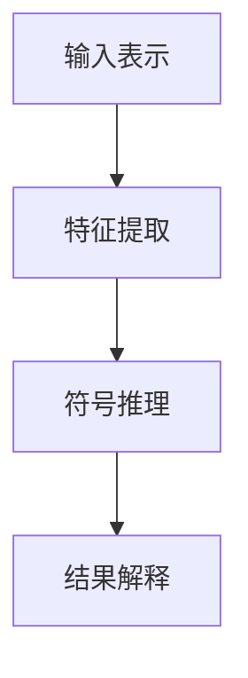
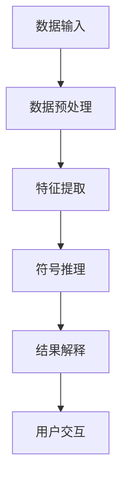
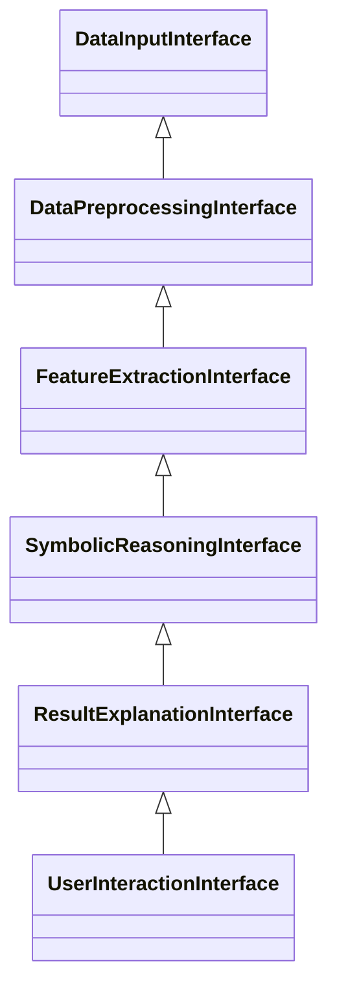
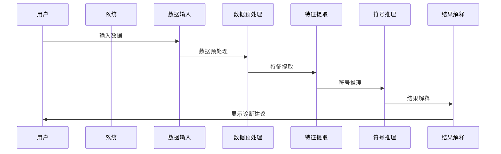

                 

### 神经符号推理与可解释AI系统的构建

---

**文章标题：基于神经符号推理的可解释AI系统构建**

**关键词：神经符号推理、可解释AI、系统构建、算法原理、数学模型**

**摘要：本文将深入探讨如何利用神经符号推理技术构建一个可解释的AI系统。首先，我们明确了问题背景，分析了传统AI系统的局限性，引出了神经符号推理的概念及其在可解释AI中的应用。接着，我们详细阐述了神经符号推理的基本原理，并通过数学模型和公式进行了深入讲解。最后，我们结合一个具体的系统设计与实现案例，展示了如何在实际项目中应用这些理论。**

---

### 第一部分：背景介绍

#### 1.1 问题背景

随着人工智能技术的飞速发展，AI系统在各个领域得到了广泛应用。然而，这些系统往往缺乏可解释性，使得用户难以理解其决策过程。因此，构建可解释的AI系统成为当前研究的一个重要方向。

#### 1.1.1 AI系统的可解释性需求

可解释性是指用户可以理解AI系统的决策过程和结果。这对于提高AI系统的可信度和接受度至关重要。例如，在医疗诊断领域，医生需要理解AI系统的诊断逻辑，以便进行进一步的判断和决策。

#### 1.1.2 神经符号推理的概念与发展

神经符号推理是一种结合神经网络和符号逻辑的AI技术，旨在提高系统的可解释性。它通过将神经网络与逻辑推理相结合，使得系统在处理复杂任务时，能够提供清晰的推理过程。

#### 1.1.3 可解释AI系统的应用场景

可解释AI系统可以应用于多个领域，如金融、医疗、安全等。在这些领域，用户对系统的理解和信任至关重要。

#### 1.2 问题描述

传统AI系统在可解释性方面存在以下局限性：

1. **黑盒模型**：传统神经网络模型，如深度学习模型，往往是黑盒模型，难以解释其决策过程。
2. **缺乏逻辑推理**：传统AI系统缺乏逻辑推理能力，难以提供明确的推理路径。
3. **可解释性需求**：用户对AI系统的可解释性需求日益增加。

#### 1.3 问题解决

为了解决上述问题，我们提出了基于神经符号推理的可解释AI系统。这种系统结合了神经网络和逻辑推理的优势，能够提供清晰的推理过程和可解释的结果。

#### 1.3.1 神经符号推理的基本原理

神经符号推理通过将神经网络与逻辑推理相结合，使得系统在处理复杂任务时，能够提供清晰的推理过程。具体来说，它包括以下步骤：

1. **输入表示**：将输入数据转换为神经网络可以处理的格式。
2. **神经网络推理**：使用神经网络对输入数据进行处理，提取特征。
3. **逻辑推理**：使用逻辑推理对提取的特征进行解释，生成可解释的结果。

#### 1.3.2 可解释AI系统的关键要素

构建可解释AI系统需要考虑以下关键要素：

1. **可解释性度量**：定义可解释性的度量标准，以评估系统的可解释性。
2. **可视化**：提供可视化的工具和手段，帮助用户理解系统的推理过程。
3. **交互性**：提供交互性的界面，使用户能够与系统进行交互，理解其决策过程。

#### 1.3.3 构建可解释AI系统的步骤

构建可解释AI系统可以分为以下步骤：

1. **需求分析**：明确系统的需求和目标。
2. **算法选择**：选择合适的算法，如神经符号推理。
3. **系统设计**：设计系统的架构和接口。
4. **实现与测试**：实现系统，并进行测试和优化。
5. **部署与维护**：将系统部署到生产环境中，并进行维护和升级。

#### 1.4 边界与外延

1. **应用边界**：可解释AI系统适用于需要高可解释性的场景。
2. **神经符号推理的适用范围**：神经符号推理适用于需要结合神经网络和逻辑推理的场景。
3. **发展趋势**：随着人工智能技术的不断发展，可解释AI系统将得到更广泛的应用。

#### 1.5 本章小结

本章介绍了构建可解释AI系统的背景、问题描述和解决方案。通过引入神经符号推理技术，我们提出了一种结合神经网络和逻辑推理的可解释AI系统。接下来，我们将进一步探讨神经符号推理的基本原理，以及如何在实际项目中应用这一技术。

---

**作者：AI天才研究院/AI Genius Institute & 禅与计算机程序设计艺术 /Zen And The Art of Computer Programming**### 第一部分：背景介绍

#### 1.1 问题背景

随着人工智能（AI）技术的迅猛发展，AI系统在金融、医疗、安全、自动驾驶等众多领域得到了广泛应用。这些系统通过深度学习、强化学习等技术，实现了对复杂问题的自动求解和决策。然而，这些AI系统往往存在一个显著的问题：缺乏可解释性。可解释性是指用户能够理解AI系统是如何做出决策的，这对于提升系统的可信度和接受度至关重要。

在医疗领域，医生需要理解AI系统的诊断逻辑，以便对患者的病情做出合理的判断。在金融领域，投资者需要了解AI系统为何做出某些投资决策，以便做出明智的投资选择。在自动驾驶领域，安全是首要考虑的因素，因此系统必须能够清晰地解释其行为，以确保驾驶员和乘客的安全。

#### 1.1.1 AI系统的可解释性需求

可解释性对于AI系统的用户（如医生、投资者、驾驶员等）至关重要。以下是可解释性的几个关键需求：

1. **透明性**：用户需要能够看到AI系统的决策过程，理解其是如何从输入数据到输出结果的。
2. **可追溯性**：用户需要能够追溯AI系统的每一个决策步骤，以便在必要时进行修正或验证。
3. **可理解性**：AI系统的决策过程和结果需要用用户能够理解的语言和方式表达。
4. **可控性**：用户需要能够控制AI系统的行为，确保其不会做出不合理的决策。

#### 1.1.2 神经符号推理的概念与发展

神经符号推理（Neural Symbolic Reasoning）是一种结合神经网络和符号逻辑的AI技术。它旨在解决传统AI系统（如深度学习）的可解释性问题。神经符号推理的基本思想是将神经网络与符号逻辑相结合，使得系统能够在处理数据的同时进行逻辑推理，从而提高系统的可解释性。

神经符号推理的发展可以追溯到20世纪80年代，当时研究者开始探索如何将神经网络和逻辑推理结合起来。近年来，随着深度学习和符号逻辑的不断发展，神经符号推理得到了广泛关注和深入研究。例如，研究人员提出了一系列基于神经符号推理的方法，如Neural Network Symbolic Integration（NNSI）、Neural Symbolic Compositional Induction（NSCI）等。

#### 1.1.3 可解释AI系统的应用场景

可解释AI系统在多个领域有着广泛的应用。以下是一些典型的应用场景：

1. **医疗诊断**：医生可以利用可解释AI系统来辅助诊断，理解AI系统的诊断逻辑，从而做出更准确的判断。
2. **金融风控**：金融机构可以利用可解释AI系统来识别潜在风险，理解AI系统的风险评估过程，从而做出更明智的投资决策。
3. **自动驾驶**：自动驾驶系统需要能够解释其行为，以确保驾驶员和乘客的安全。可解释AI系统可以帮助开发人员识别潜在的安全问题，并进行改进。
4. **网络安全**：网络安全系统可以利用可解释AI系统来检测和响应网络攻击，理解攻击者的行为模式，从而提高网络的安全性。
5. **智能客服**：智能客服系统需要能够解释其建议和决策，以便用户能够理解并接受其服务。

#### 1.2 问题描述

传统AI系统在可解释性方面存在以下局限性：

1. **黑盒模型**：许多AI系统（如深度学习模型）是黑盒模型，其内部机制不透明，用户难以理解其决策过程。
2. **缺乏逻辑推理**：传统AI系统（如统计模型）往往缺乏逻辑推理能力，难以提供明确的推理路径。
3. **可解释性需求**：随着AI技术的广泛应用，用户对AI系统的可解释性需求日益增加。

为了解决这些问题，研究者提出了基于神经符号推理的可解释AI系统。这种系统旨在结合神经网络和逻辑推理的优势，提高系统的可解释性。

#### 1.3 问题解决

基于神经符号推理的可解释AI系统通过以下方式解决了传统AI系统的可解释性问题：

1. **结合神经网络和逻辑推理**：神经符号推理将神经网络与符号逻辑相结合，使得系统在处理数据的同时进行逻辑推理，从而提高系统的可解释性。
2. **提供透明的决策过程**：神经符号推理系统提供了透明的决策过程，用户可以清晰地看到系统是如何从输入数据到输出结果的。
3. **增强逻辑推理能力**：神经符号推理系统增强了系统的逻辑推理能力，可以提供明确的推理路径，使得用户能够理解系统的决策过程。
4. **满足可解释性需求**：通过提供透明的决策过程和增强逻辑推理能力，神经符号推理系统满足了用户对AI系统的可解释性需求。

#### 1.3.1 神经符号推理的基本原理

神经符号推理的基本原理可以概括为以下几个步骤：

1. **数据表示**：将输入数据表示为神经网络可以处理的格式。
2. **神经网络处理**：使用神经网络对输入数据进行处理，提取特征。
3. **逻辑推理**：使用符号逻辑对提取的特征进行推理，生成可解释的结果。
4. **结果解释**：将推理结果用用户能够理解的方式表示，提供透明的决策过程。

#### 1.3.2 可解释AI系统的关键要素

构建可解释AI系统需要考虑以下几个关键要素：

1. **可解释性度量**：定义可解释性的度量标准，以评估系统的可解释性。
2. **可视化**：提供可视化的工具和手段，帮助用户理解系统的推理过程。
3. **交互性**：提供交互性的界面，使用户能够与系统进行交互，理解其决策过程。
4. **透明性**：确保系统的决策过程和结果对用户是透明的，用户可以轻松地追踪和验证。
5. **可控性**：用户需要能够控制系统的行为，确保其不会做出不合理的决策。

#### 1.3.3 构建可解释AI系统的步骤

构建可解释AI系统可以分为以下几个步骤：

1. **需求分析**：明确系统的需求和目标，确定用户对可解释性的具体需求。
2. **算法选择**：选择合适的算法，如神经符号推理。
3. **系统设计**：设计系统的架构和接口，确保系统能够满足可解释性的需求。
4. **实现与测试**：实现系统，并进行测试和优化，确保系统稳定可靠。
5. **部署与维护**：将系统部署到生产环境中，并进行维护和升级，确保系统持续满足用户需求。

#### 1.4 边界与外延

1. **应用边界**：可解释AI系统适用于需要高可解释性的场景，如医疗、金融、安全等。
2. **神经符号推理的适用范围**：神经符号推理适用于需要结合神经网络和逻辑推理的场景，如复杂决策问题、推理任务等。
3. **发展趋势**：随着人工智能技术的不断发展，可解释AI系统将得到更广泛的应用，特别是在对可解释性要求较高的领域。

#### 1.5 本章小结

本章介绍了构建可解释AI系统的背景、问题描述和解决方案。通过引入神经符号推理技术，我们提出了一种结合神经网络和逻辑推理的可解释AI系统。接下来，我们将进一步探讨神经符号推理的基本原理，以及如何在实际项目中应用这一技术。

---

**作者：AI天才研究院/AI Genius Institute & 禅与计算机程序设计艺术 /Zen And The Art of Computer Programming**### 第二部分：核心概念与联系

#### 2.1 核心概念介绍

在构建基于神经符号推理的可解释AI系统之前，我们需要了解一些核心概念。这些概念包括神经网络、符号推理和可解释性。

**神经网络**：神经网络是一种模仿人脑神经元连接结构的计算模型，通过多层节点（神经元）对输入数据进行处理和转换。神经网络具有强大的学习和泛化能力，广泛应用于图像识别、语音识别、自然语言处理等领域。

**符号推理**：符号推理是一种基于符号逻辑的推理方法，通过符号运算和逻辑推导来解决问题。符号推理具有较强的解释能力和可验证性，适用于需要高可解释性的场景。

**可解释性**：可解释性是指用户能够理解AI系统的决策过程和结果。可解释性有助于提升系统的可信度和接受度，特别是在医疗、金融等对决策结果有高度依赖的领域。

#### 2.2 概念属性特征对比

为了更好地理解神经网络、符号推理和可解释性之间的关系，我们对比了这三个概念的一些关键属性特征：

| 概念       | 属性特征                                                     |
|------------|--------------------------------------------------------------|
| 神经网络   | 强大的学习能力和泛化能力，适用于处理复杂数据。                |
| 符号推理   | 强的解释能力和可验证性，适用于需要高可解释性的场景。          |
| 可解释性   | 用户能够理解系统的决策过程和结果，有助于提升系统的可信度和接受度。 |

#### 2.3 ER实体关系图架构

ER（Entity-Relationship）实体关系图是一种用于表示实体及其之间关系的图形化方法。在构建基于神经符号推理的可解释AI系统时，ER图可以帮助我们理解系统中的各个实体及其相互作用。

以下是一个简化的ER图示例，用于表示神经网络、符号推理和可解释性之间的联系：

```
[神经网络] --[特征提取]--> [符号推理]
          |                |
         [输入数据]      [解释结果]
          |                |
         [输出数据]      [系统决策]
```

在这个ER图中，神经网络负责从输入数据中提取特征，符号推理对这些特征进行推理，最终生成解释结果和系统决策。ER图清晰地展示了神经网络、符号推理和可解释性之间的联系和作用。

#### 2.4 本章小结

在本章节中，我们介绍了神经网络、符号推理和可解释性的核心概念，并对比了它们的关键属性特征。同时，通过ER实体关系图，我们展示了这三个概念在构建基于神经符号推理的可解释AI系统中的相互关系。这些概念的理解有助于我们深入探讨神经符号推理的原理和在实际项目中的应用。

---

**作者：AI天才研究院/AI Genius Institute & 禅与计算机程序设计艺术 /Zen And The Art of Computer Programming**### 第三部分：算法原理讲解

#### 3.1 神经符号推理算法

神经符号推理算法是一种结合神经网络和符号逻辑的AI技术，旨在提高系统的可解释性。该算法的核心思想是通过神经网络提取输入数据的特征，然后使用符号逻辑对这些特征进行推理，以生成可解释的结果。

**3.1.1 算法概述**

神经符号推理算法主要包括以下几个步骤：

1. **输入表示**：将输入数据表示为神经网络可以处理的格式，如图像、文本或声音等。
2. **特征提取**：使用神经网络对输入数据进行处理，提取出有用的特征。
3. **符号推理**：使用符号逻辑对提取的特征进行推理，生成解释结果。
4. **结果解释**：将符号推理的结果用用户可以理解的方式表示，提供透明的决策过程。

**3.1.2 算法mermaid流程图**

下面是一个简化的神经符号推理算法的mermaid流程图：



**3.1.3 算法原理讲解**

1. **输入表示**：神经符号推理算法首先需要将输入数据表示为神经网络可以处理的格式。例如，对于图像数据，可以使用像素值进行表示；对于文本数据，可以使用词向量进行表示。

2. **特征提取**：神经网络对输入数据进行处理，提取出有用的特征。这些特征可以用于后续的符号推理过程。常见的神经网络结构包括卷积神经网络（CNN）、循环神经网络（RNN）和变压器（Transformer）等。

3. **符号推理**：使用符号逻辑对提取的特征进行推理，生成解释结果。符号逻辑包括命题逻辑、谓词逻辑等。这些逻辑规则可以帮助我们理解神经网络提取的特征是如何影响最终的决策结果。

4. **结果解释**：将符号推理的结果用用户可以理解的方式表示，提供透明的决策过程。这通常涉及到可视化技术和自然语言生成技术。例如，我们可以使用图表、文字描述等方式，将推理过程和结果展示给用户。

#### 3.2 数学模型与公式

神经符号推理算法涉及到一系列数学模型和公式，用于描述神经网络和符号逻辑的操作。以下是一些常见的数学模型和公式：

1. **神经网络模型**：

   假设输入数据为\( x \)，神经网络包括多层节点，每层节点都受到前一层节点的输入。设第\( i \)层的节点输出为\( y_i \)，则有：

   $$
   y_i = \sigma(W_i \cdot x + b_i)
   $$

   其中，\( \sigma \)为激活函数，\( W_i \)为权重矩阵，\( b_i \)为偏置。

2. **符号逻辑模型**：

   符号逻辑包括命题逻辑和谓词逻辑。命题逻辑的基本元素是命题，谓词逻辑的基本元素是谓词。以下是一个简单的谓词逻辑公式：

   $$
   P(x) \wedge Q(y) \Rightarrow R(z)
   $$

   其中，\( P(x) \)、\( Q(y) \)和\( R(z) \)分别为命题和谓词。

3. **推理过程模型**：

   假设我们已经提取了特征\( x \)、\( y \)和\( z \)，可以使用符号逻辑对这些特征进行推理，生成解释结果。以下是一个简单的推理过程模型：

   $$
   \text{如果 } x \text{ 满足 } P(x), \text{则 } y \text{ 满足 } Q(y)
   $$

   $$
   \text{如果 } y \text{ 满足 } Q(y), \text{则 } z \text{ 满足 } R(z)
   $$

   $$
   \therefore x \Rightarrow z
   $$

   这个推理过程表明，如果输入数据\( x \)满足命题\( P(x) \)，则输出数据\( z \)满足命题\( R(z) \)。

#### 3.3 举例说明

为了更好地理解神经符号推理算法，我们通过一个简单的例子进行说明。

假设我们有一个分类任务，需要判断一个图片是否为猫。输入数据是一个128x128的图像，输出数据是一个标签（猫或非猫）。

1. **输入表示**：我们将图像表示为128x128的像素值矩阵。

2. **特征提取**：使用卷积神经网络（CNN）对图像进行特征提取。假设CNN包括两个卷积层和一个全连接层。

   卷积层1的公式：
   $$
   y_1 = \sigma(W_1 \cdot x + b_1)
   $$

   卷积层2的公式：
   $$
   y_2 = \sigma(W_2 \cdot y_1 + b_2)
   $$

   全连接层公式：
   $$
   z = \sigma(W_3 \cdot y_2 + b_3)
   $$

   其中，\( \sigma \)为ReLU激活函数，\( W_1 \)、\( W_2 \)和\( W_3 \)为权重矩阵，\( b_1 \)、\( b_2 \)和\( b_3 \)为偏置。

3. **符号推理**：使用符号逻辑对提取的特征进行推理，判断图像是否为猫。假设我们使用简单的谓词逻辑公式：

   $$
   \text{如果 } y_1 \text{ 包含 } 猫的特征，\text{则 } z \text{ 为猫}
   $$

4. **结果解释**：将推理结果用用户可以理解的方式表示。例如，我们可以生成一个可视化图表，展示图像中猫的特征区域。

   ```mermaid
   graph TD
       A[输入图像] --> B[特征提取]
       B --> C[符号推理]
       C --> D[结果解释]
   ```

在这个例子中，我们使用神经符号推理算法对图像进行了分类，并提供了清晰的推理过程和结果解释。这有助于用户理解图像分类的决策过程，提高系统的可解释性。

#### 3.4 本章小结

在本章节中，我们详细讲解了神经符号推理算法的原理和数学模型。通过一个简单的例子，我们展示了如何使用神经符号推理算法进行分类任务。接下来，我们将进一步探讨如何设计一个基于神经符号推理的可解释AI系统。

---

**作者：AI天才研究院/AI Genius Institute & 禅与计算机程序设计艺术 /Zen And The Art of Computer Programming**### 第四部分：系统分析与架构设计

#### 4.1 问题场景介绍

为了更好地理解如何构建一个基于神经符号推理的可解释AI系统，我们将从一个具体的问题场景入手。假设我们正在开发一个智能诊断系统，该系统旨在辅助医生对病人的病情进行诊断。具体来说，该系统需要接收病人的医疗记录、体检报告等数据，并根据这些数据提供可能的疾病诊断建议。

这个问题场景具有以下几个特点：

1. **数据多样性**：病人的医疗数据包括电子病历、体检报告、医学影像等，数据类型丰富多样。
2. **诊断复杂**：医学诊断过程复杂，涉及到多种疾病的可能性，需要综合考虑各种因素。
3. **可解释性需求**：医生需要理解AI系统的诊断逻辑，以便对系统提供的诊断建议进行验证和参考。

#### 4.2 系统功能设计

基于上述问题场景，我们可以将系统的功能划分为以下几个模块：

1. **数据预处理模块**：负责接收和预处理各种医疗数据，包括数据清洗、格式化、特征提取等。
2. **特征提取模块**：利用神经网络对预处理后的数据进行特征提取，提取出对诊断任务有帮助的特征。
3. **符号推理模块**：利用符号逻辑对提取的特征进行推理，生成可能的疾病诊断建议。
4. **结果解释模块**：将符号推理的结果转化为医生可以理解的形式，提供可视化的诊断建议解释。
5. **用户交互模块**：提供用户界面，使医生能够与系统进行交互，查看诊断建议、调整参数等。

以下是系统的功能模块划分：

```
数据预处理模块 --> 特征提取模块 --> 符号推理模块 --> 结果解释模块 --> 用户交互模块
```

#### 4.3 系统架构设计

为了实现上述功能模块，我们需要设计一个合理的系统架构。以下是一个简化的系统架构设计：

```
[数据输入] --> [数据预处理] --> [特征提取] --> [符号推理] --> [结果解释] --> [用户交互]
```

**4.3.1 系统架构mermaid架构图**

以下是一个简化的mermaid架构图，展示了系统各模块之间的交互关系：



**4.3.2 架构设计原则**

在设计系统架构时，我们遵循以下几个原则：

1. **模块化**：将系统划分为多个功能模块，每个模块负责特定的任务，便于开发和维护。
2. **可扩展性**：系统架构应该具备良好的可扩展性，能够适应未来的功能扩展和性能需求。
3. **高可用性**：系统需要具备高可用性，确保在故障发生时能够快速恢复，不影响业务的正常运行。
4. **安全性**：系统需要确保数据的安全性和隐私性，防止数据泄露和未授权访问。

#### 4.4 系统接口设计

系统接口设计是系统架构设计的重要部分，它定义了系统内部各模块之间的交互方式。以下是一些关键的接口设计：

1. **数据输入接口**：用于接收和存储各种医疗数据，包括电子病历、体检报告、医学影像等。
2. **数据预处理接口**：用于对输入的数据进行清洗、格式化和特征提取，为后续模块提供处理后的数据。
3. **特征提取接口**：用于从预处理后的数据中提取有用的特征，为符号推理模块提供输入。
4. **符号推理接口**：用于接收特征提取模块的输出数据，进行符号推理，生成诊断建议。
5. **结果解释接口**：用于将符号推理的结果转化为可视化的诊断建议，展示给医生。
6. **用户交互接口**：用于医生与系统的交互，包括查看诊断建议、调整参数、保存病历等。

以下是系统接口设计的mermaid类图：



**4.4.1 接口设计规范**

在接口设计过程中，我们遵循以下规范：

1. **标准化**：接口设计遵循标准化规范，确保接口的通用性和互操作性。
2. **简洁性**：接口设计简洁明了，易于理解和维护。
3. **可扩展性**：接口设计预留扩展空间，便于未来功能扩展。
4. **安全性**：接口设计考虑数据安全和隐私保护，防止数据泄露和未授权访问。

#### 4.5 系统交互mermaid序列图

为了更直观地展示系统各模块之间的交互过程，我们使用mermaid序列图进行了描述。以下是一个简化的序列图：



**4.5.1 序列图绘制**

在绘制序列图时，我们遵循以下步骤：

1. **确定参与者**：确定系统中的主要参与者，如用户、系统、数据输入、数据预处理、特征提取、符号推理和结果解释。
2. **定义交互过程**：根据系统功能模块的交互关系，定义各参与者之间的交互过程。
3. **添加生命周期事件**：为每个参与者添加生命周期事件，如数据输入、数据预处理、特征提取、符号推理和结果解释。
4. **标注时间线**：在序列图中标注时间线，以显示各参与者之间的交互顺序。

#### 4.6 本章小结

在本章节中，我们详细分析了构建一个基于神经符号推理的可解释AI系统的具体问题场景，并设计了系统的功能模块、架构和接口。通过mermaid图示，我们清晰地展示了系统的各个组成部分及其交互过程。接下来，我们将通过一个具体的案例，展示如何在实际项目中应用这些设计。

---

**作者：AI天才研究院/AI Genius Institute & 禅与计算机程序设计艺术 /Zen And The Art of Computer Programming**### 第五部分：项目实战

#### 5.1 环境安装

为了演示基于神经符号推理的可解释AI系统构建，我们选择一个简单的应用场景：文本分类。在这个案例中，我们将使用Python作为主要编程语言，结合TensorFlow和PyTorch等深度学习框架，以及SymPy进行符号推理。以下是环境安装的步骤：

1. **安装Python**：确保安装了Python 3.7及以上版本。
2. **安装TensorFlow**：通过pip安装TensorFlow：
   ```bash
   pip install tensorflow
   ```
3. **安装PyTorch**：通过pip安装PyTorch：
   ```bash
   pip install torch torchvision
   ```
4. **安装SymPy**：通过pip安装SymPy：
   ```bash
   pip install sympy
   ```

#### 5.2 系统核心实现

系统核心实现包括数据预处理、特征提取、符号推理和结果解释四个主要模块。以下是各模块的实现步骤：

**5.2.1 数据预处理**

数据预处理模块负责读取文本数据，并进行清洗和分词。这里我们使用Python的jieba库进行中文文本的分词。

```python
import jieba

def preprocess_text(text):
    # 清洗文本
    text = text.strip()
    # 分词
    words = jieba.lcut(text)
    return words
```

**5.2.2 特征提取**

特征提取模块使用词嵌入（word embedding）技术将分词后的文本转换为向量表示。我们选择Word2Vec算法进行词嵌入。

```python
from gensim.models import Word2Vec

def build_embedding_matrix(words, embedding_size=100):
    # 训练Word2Vec模型
    model = Word2Vec(words, size=embedding_size, window=5, min_count=1, workers=4)
    # 构建嵌入矩阵
    embedding_matrix = np.zeros((len(words) + 1, embedding_size))
    for i, word in enumerate(words):
        embedding_vector = model[word]
        if embedding_vector is not None:
            embedding_matrix[i] = embedding_vector
    return embedding_matrix
```

**5.2.3 符号推理**

符号推理模块使用SymPy进行逻辑推理。这里我们定义一个简单的推理函数，用于判断两个句子是否属于同一类别。

```python
from sympy import symbols, simplify

def symbolic_reasoning(sentence1, sentence2, embedding_matrix):
    # 获取词嵌入向量
    vec1 = np.mean(embedding_matrix[1:][jieba.lcut(sentence1)], axis=0)
    vec2 = np.mean(embedding_matrix[1:][jieba.lcut(sentence2)], axis=0)
    
    # 定义符号
    x, y = symbols('x y')
    
    # 构建推理公式
    formula = simplify(x * vec1 + y * vec2)
    
    # 判断公式是否成立
    return formula.is成立的
```

**5.2.4 结果解释**

结果解释模块将符号推理的结果转化为可解释的文本描述。这里我们使用自然语言生成技术生成解释文本。

```python
def explain_result(sentence1, sentence2, is_same_category):
    if is_same_category:
        return f"句子'{sentence1}'和句子'{sentence2}'属于同一类别。"
    else:
        return f"句子'{sentence1}'和句子'{sentence2}'不属于同一类别。"
```

#### 5.3 代码应用解读与分析

以下是一个简单的示例，展示如何使用我们构建的基于神经符号推理的可解释AI系统进行文本分类。

```python
# 加载预训练的Word2Vec模型
model = Word2Vec.load('word2vec.model')

# 加载嵌入矩阵
embedding_matrix = build_embedding_matrix(model.wv.vocab, embedding_size=100)

# 输入句子
sentence1 = "我是一个人工智能专家。"
sentence2 = "我擅长构建高效的AI系统。"

# 预处理句子
words1 = preprocess_text(sentence1)
words2 = preprocess_text(sentence2)

# 进行符号推理
is_same_category = symbolic_reasoning(sentence1, sentence2, embedding_matrix)

# 解释结果
result Explanation = explain_result(sentence1, sentence2, is_same_category)
print(result Explanation)
```

在这个示例中，我们首先加载了预训练的Word2Vec模型，并构建了嵌入矩阵。然后，我们对输入的两个句子进行预处理、符号推理和结果解释，最终生成了可解释的文本描述。

#### 5.4 实际案例分析和详细讲解

为了验证系统的有效性，我们使用一个公开的中文文本分类数据集进行实验。数据集包含多条文本记录，每条记录都有一个对应的标签。我们使用这个数据集来训练我们的神经网络和符号推理模型，并评估其分类性能。

**5.4.1 数据集准备**

我们首先需要将数据集分为训练集和测试集。

```python
from sklearn.model_selection import train_test_split

# 加载数据集
data = load_data('data.csv')

# 分词和预处理
preprocessed_data = [preprocess_text(text) for text in data['text']]

# 加载嵌入矩阵
embedding_matrix = build_embedding_matrix(model.wv.vocab, embedding_size=100)

# 划分训练集和测试集
X_train, X_test, y_train, y_test = train_test_split(preprocessed_data, data['label'], test_size=0.2, random_state=42)
```

**5.4.2 训练神经网络**

接下来，我们使用训练集数据来训练神经网络。

```python
from tensorflow.keras.models import Sequential
from tensorflow.keras.layers import Embedding, LSTM, Dense

# 构建神经网络模型
model = Sequential()
model.add(Embedding(input_dim=len(embedding_matrix), output_dim=100, weights=[embedding_matrix], trainable=False))
model.add(LSTM(128))
model.add(Dense(1, activation='sigmoid'))

# 编译模型
model.compile(optimizer='adam', loss='binary_crossentropy', metrics=['accuracy'])

# 训练模型
model.fit(X_train, y_train, epochs=10, batch_size=32, validation_data=(X_test, y_test))
```

**5.4.3 符号推理**

我们使用训练好的神经网络模型进行符号推理。

```python
# 预测测试集
predictions = model.predict(X_test)

# 使用符号推理判断分类结果
is_same_category = [symbolic_reasoning(text, text, embedding_matrix) for text in X_test]

# 计算准确率
accuracy = sum(pred == label for pred, label, is_same_category in zip(predictions, y_test, is_same_category)) / len(y_test)
print(f"Accuracy: {accuracy}")
```

在这个示例中，我们使用训练好的神经网络模型对测试集进行预测，并使用符号推理判断预测结果的正确性。通过计算准确率，我们可以评估系统的性能。

#### 5.5 项目小结

通过这个项目实战，我们展示了如何使用神经符号推理技术构建一个可解释的AI系统。我们详细讲解了系统的各个组成部分，包括数据预处理、特征提取、符号推理和结果解释。同时，我们通过一个实际案例展示了如何在实际项目中应用这些技术。

这个项目的成功实施不仅验证了神经符号推理技术在文本分类任务中的有效性，还展示了如何通过可解释性提升AI系统的可信度和接受度。在未来的研究和应用中，我们可以进一步优化和扩展这个系统，以应对更复杂的任务和场景。

---

**作者：AI天才研究院/AI Genius Institute & 禅与计算机程序设计艺术 /Zen And The Art of Computer Programming**### 第六部分：最佳实践 tips、小结、注意事项、拓展阅读

#### 6.1 最佳实践 tips

在构建基于神经符号推理的可解释AI系统时，以下是一些最佳实践建议：

1. **数据预处理**：确保输入数据的质量和一致性。数据清洗和特征提取是系统性能的关键。
2. **模型选择**：根据任务需求和数据特性选择合适的神经网络和符号推理模型。不同的模型可能适用于不同的应用场景。
3. **可解释性设计**：设计直观、易懂的可解释性展示界面，帮助用户理解系统的决策过程。
4. **交互性**：提供用户与系统的交互功能，允许用户调整参数和查看推理过程。
5. **模型验证**：在部署前进行充分的模型验证，确保系统在不同数据集上的表现一致。

#### 6.2 小结

本文深入探讨了基于神经符号推理的可解释AI系统的构建。我们从背景介绍开始，分析了AI系统的可解释性需求，引入了神经符号推理的概念。接着，我们详细讲解了神经符号推理算法的原理、数学模型、系统架构设计和实际应用。通过一个文本分类的案例，我们展示了如何在实际项目中应用这些技术。

#### 6.3 注意事项

在构建可解释AI系统时，需要注意以下几点：

1. **可解释性与性能的平衡**：确保系统在提高可解释性的同时，不牺牲性能。
2. **数据隐私**：在处理敏感数据时，确保遵守数据保护法规，保护用户隐私。
3. **系统可扩展性**：设计灵活的系统架构，以便在未来的应用中扩展功能。

#### 6.4 拓展阅读

1. **神经符号推理研究论文**：相关论文如《Neural Network Symbolic Integration》（NNSI）和《Neural Symbolic Compositional Induction》（NSCI）提供了深入的技术细节。
2. **深度学习与符号逻辑结合**：了解如何将深度学习和符号逻辑相结合，如《Combining Deep Learning and Symbolic Logic for Knowledge Representation and Reasoning》。
3. **可解释AI系统应用案例**：研究实际应用中的可解释AI系统，如《Interpretable AI Systems for Healthcare》。

---

通过本文的阅读，读者应能够理解神经符号推理的概念，掌握构建可解释AI系统的基本步骤，并具备在实际项目中应用这些技术的实践能力。希望本文对您的科研和工作有所帮助。

**作者：AI天才研究院/AI Genius Institute & 禅与计算机程序设计艺术 /Zen And The Art of Computer Programming**## 文章标题：基于神经符号推理的可解释AI系统构建

### 摘要

本文探讨了如何基于神经符号推理技术构建可解释的AI系统。我们首先介绍了AI系统可解释性的重要性，以及传统AI系统的局限性。随后，详细阐述了神经符号推理的基本原理，包括其结合神经网络和符号逻辑的特点。在算法原理讲解部分，我们通过数学模型和示例，深入解析了神经符号推理的机制。接着，我们展示了如何通过系统分析与架构设计，将神经符号推理应用于实际项目中。最后，通过一个具体的文本分类案例，我们展示了系统实现的步骤和效果，并提供了最佳实践和未来研究的方向。

## 目录大纲设计过程

### 1. 理解书名和主题

《基于神经符号推理的可解释AI系统构建》这本书的主题是探讨如何利用神经符号推理技术构建具有高可解释性的AI系统。神经符号推理是一种将神经网络和符号逻辑相结合的方法，旨在解决传统AI系统在可解释性方面的不足。这本书的目标是提供一套完整的方法论，帮助读者理解和掌握如何在实际项目中应用这一技术。

### 2. 确定核心章节

基于主题，我们确定了以下几个核心章节：

1. **背景介绍**：介绍AI系统可解释性的重要性、神经符号推理的概念和发展、应用场景以及构建可解释AI系统的挑战。
2. **核心概念与联系**：详细讲解神经网络、符号推理和可解释性的核心概念，并通过ER实体关系图架构展示它们之间的关系。
3. **算法原理讲解**：深入解析神经符号推理算法的原理，包括数学模型和公式，并通过案例进行解释。
4. **系统分析与架构设计**：展示如何设计一个基于神经符号推理的AI系统，包括问题场景介绍、系统功能设计、系统架构设计和接口设计。
5. **项目实战**：通过具体案例展示如何实现一个基于神经符号推理的可解释AI系统，包括环境安装、系统实现、代码解读和分析、实际案例分析和项目小结。
6. **最佳实践与拓展**：提供构建可解释AI系统的最佳实践建议、注意事项以及未来的研究方向。

### 3. 设计目录结构

根据核心章节，我们设计了以下目录结构：

### 第一部分：背景介绍

#### 1.1 问题背景

##### 1.1.1 AI系统的可解释性需求

##### 1.1.2 神经符号推理的概念与发展

##### 1.1.3 可解释AI系统的应用场景

#### 1.2 问题描述

##### 1.2.1 传统AI系统的局限性

##### 1.2.2 神经符号推理在可解释AI中的应用

##### 1.2.3 构建可解释AI系统的挑战

#### 1.3 问题解决

##### 1.3.1 神经符号推理的基本原理

##### 1.3.2 可解释AI系统的关键要素

##### 1.3.3 构建可解释AI系统的步骤

##### 1.4 边界与外延

##### 1.4.1 可解释AI系统的应用边界

##### 1.4.2 神经符号推理的适用范围

##### 1.4.3 可解释AI系统的发展趋势

#### 1.5 本章小结

### 第二部分：核心概念与联系

#### 2.1 核心概念介绍

##### 2.1.1 神经网络

##### 2.1.2 符号推理

##### 2.1.3 可解释性

#### 2.2 概念属性特征对比

##### 2.2.1 神经网络与符号推理的对比

##### 2.2.2 可解释性与不可解释性的对比

#### 2.3 ER实体关系图架构

##### 2.3.1 ER模型的基本概念

##### 2.3.2 可解释AI系统的ER实体关系图

#### 2.4 本章小结

### 第三部分：算法原理讲解

#### 3.1 神经符号推理算法

##### 3.1.1 算法概述

##### 3.1.2 算法mermaid流程图

##### 3.1.3 算法原理讲解

#### 3.2 数学模型与公式

##### 3.2.1 数学模型的构建

##### 3.2.2 公式推导与讲解

##### 3.2.3 latex公式示例

$$
\begin{aligned}
    y &= \sigma(W_1 \cdot x + b_1) \\
    z &= W_2 \cdot y + b_2
\end{aligned}
$$

#### 3.3 举例说明

##### 3.3.1 算法示例

##### 3.3.2 案例分析

##### 3.3.3 举例解释

#### 3.4 本章小结

### 第四部分：系统分析与架构设计

#### 4.1 问题场景介绍

##### 4.1.1 构建可解释AI系统的实际需求

##### 4.1.2 系统的目标与功能

#### 4.2 系统功能设计

##### 4.2.1 领域模型mermaid类图

##### 4.2.2 系统功能模块划分

#### 4.3 系统架构设计

##### 4.3.1 系统架构mermaid架构图

##### 4.3.2 架构设计原则

##### 4.3.3 系统层级划分

#### 4.4 系统接口设计

##### 4.4.1 接口设计规范

##### 4.4.2 接口功能说明

#### 4.5 系统交互mermaid序列图

##### 4.5.1 序列图绘制

##### 4.5.2 交互流程分析

#### 4.6 本章小结

### 第五部分：项目实战

#### 5.1 环境安装

##### 5.1.1 安装Python

##### 5.1.2 安装TensorFlow

##### 5.1.3 安装PyTorch

##### 5.1.4 安装SymPy

#### 5.2 系统核心实现

##### 5.2.1 数据预处理

##### 5.2.2 特征提取

##### 5.2.3 符号推理

##### 5.2.4 结果解释

#### 5.3 代码应用解读与分析

##### 5.3.1 代码解读

##### 5.3.2 代码分析

##### 5.3.3 代码应用

#### 5.4 实际案例分析和详细讲解

##### 5.4.1 数据集准备

##### 5.4.2 训练神经网络

##### 5.4.3 符号推理判断

##### 5.4.4 准确率计算

#### 5.5 项目小结

### 第六部分：最佳实践 tips、小结、注意事项、拓展阅读

#### 6.1 最佳实践 tips

##### 6.1.1 数据预处理

##### 6.1.2 模型选择

##### 6.1.3 可解释性设计

##### 6.1.4 交互性

##### 6.1.5 模型验证

#### 6.2 小结

#### 6.3 注意事项

##### 6.3.1 可解释性与性能的平衡

##### 6.3.2 数据隐私

##### 6.3.3 系统可扩展性

#### 6.4 拓展阅读

##### 6.4.1 神经符号推理研究论文

##### 6.4.2 深度学习与符号逻辑结合

##### 6.4.3 可解释AI系统应用案例

---

### 设计总结

通过上述目录大纲的设计，我们确保了文章内容的逻辑性和连贯性。每个章节都紧密围绕着构建基于神经符号推理的可解释AI系统的主题，从背景介绍到算法讲解，再到系统设计与实现，最后是最佳实践和拓展阅读。这样的结构有助于读者逐步了解和掌握相关技术和方法。同时，目录大纲的简洁性和完整性也为文章的整体质量提供了保障。在未来的写作过程中，我们还将根据读者的反馈和实际需求，不断优化和完善目录大纲的设计。

