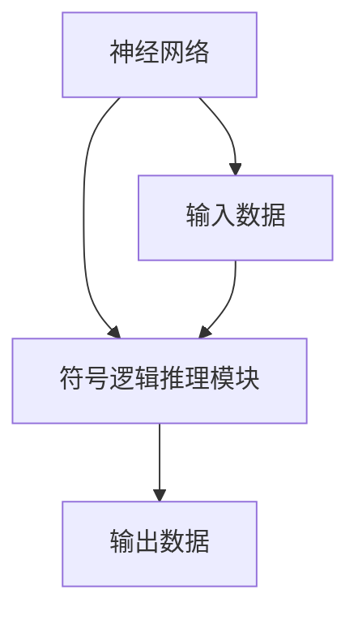
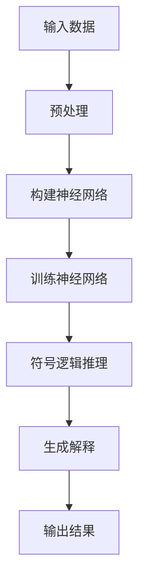
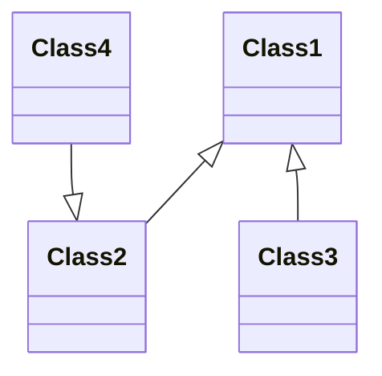
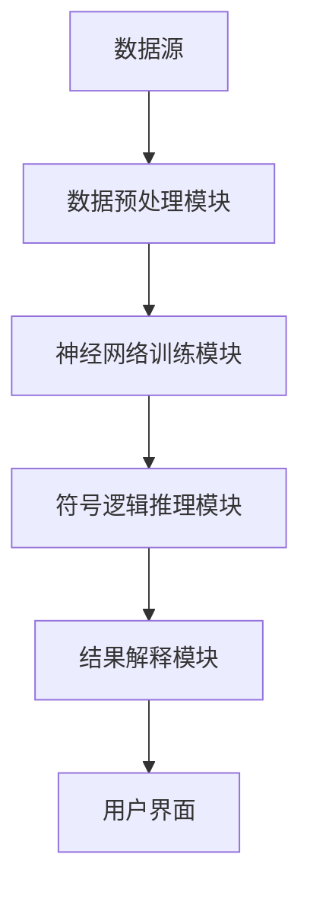
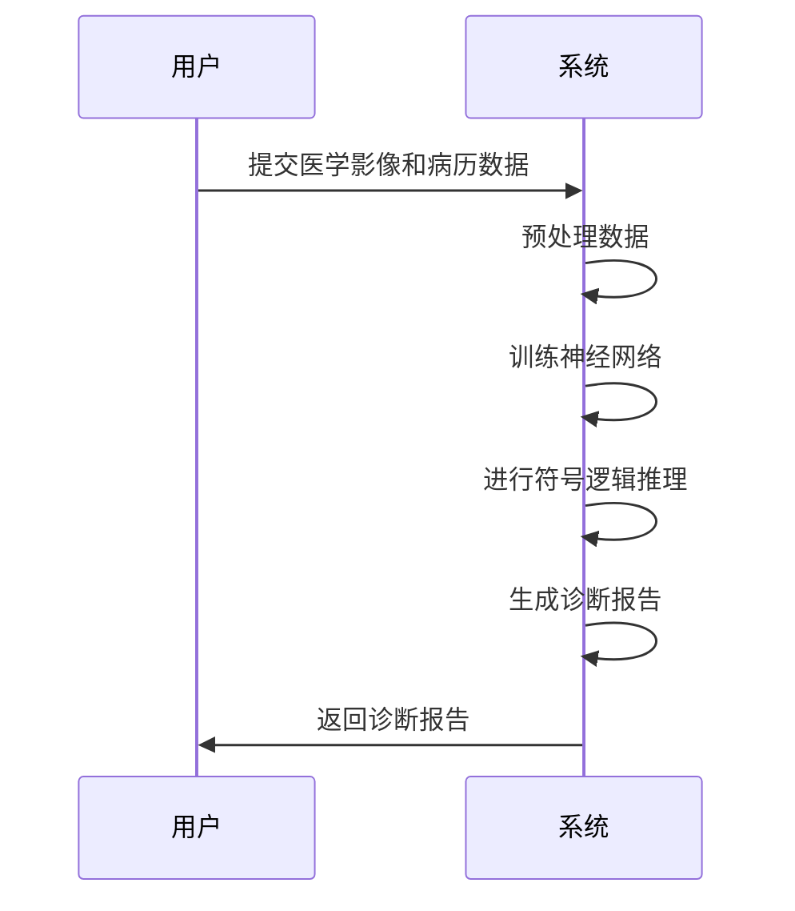

                 

# 基于神经符号推理的可解释AI系统设计

> 关键词：神经符号推理，可解释AI，深度学习，符号逻辑推理

> 摘要：随着人工智能技术的发展，AI系统在各个领域的应用越来越广泛。然而，如何设计出既高效又可解释的AI系统成为了当前研究的热点问题。本文将介绍一种基于神经符号推理的可解释AI系统设计，通过结合深度学习和符号逻辑推理技术，构建一个能够在保证高效性能的同时提供详细推理过程的AI系统。

## Step 1: 背景介绍

### 问题背景

随着深度学习技术的快速发展，人工智能在图像识别、自然语言处理、推荐系统等领域取得了显著的成果。然而，现有的AI系统普遍存在一个共性问题，即黑盒现象。黑盒现象指的是AI系统在执行任务时，无法提供明确的推理过程和决策依据，使得用户难以理解系统的决策逻辑。这限制了AI系统在实际应用中的推广和应用，因为用户对AI系统的信任度往往取决于其对系统决策过程的理解程度。

为了解决这一问题，可解释性AI（Explainable AI，XAI）的研究逐渐成为热点。可解释性AI旨在设计出既高效又可解释的AI系统，使其在执行任务时能够提供详细的推理过程和决策依据，从而提高用户对AI系统的信任度和接受度。

### 问题描述

设计一个基于神经符号推理的可解释AI系统，该系统能够在保证高效性能的同时，提供详细的推理过程，以便用户理解。具体来说，该系统需要满足以下要求：

1. **高效性**：系统能够快速处理大量的数据，并在较短的时间内完成推理过程。
2. **可解释性**：系统能够提供详细的推理过程和决策依据，使用户能够理解系统的决策逻辑。
3. **灵活性**：系统能够适应不同的应用场景，并具备一定的泛化能力。

### 问题解决

为了解决上述问题，本文提出了一种基于神经符号推理的可解释AI系统设计。该设计结合了深度学习和符号逻辑推理技术，旨在构建一个高效且可解释的AI系统。

1. **神经符号推理**：神经符号推理（Neural-Symbolic Reasoning）是一种结合神经计算和符号推理的方法。它利用神经网络的强大特征提取能力和符号逻辑推理的严谨性，实现高效且可解释的推理过程。
   
2. **深度学习**：深度学习是一种基于神经网络的机器学习方法，能够自动提取数据中的特征，并在大量数据上进行训练，从而实现高精度的预测和分类。

3. **符号逻辑推理**：符号逻辑推理是一种基于逻辑的推理方法，能够对推理过程进行形式化表示和验证，从而提高推理的可解释性。

### 边界与外延

本文主要讨论基于神经符号推理的可解释AI系统的设计，包括系统的核心原理、实现方法、性能优化等方面。本文将重点关注以下内容：

1. **神经符号推理方法**：介绍神经符号推理的基本原理和实现方法。
2. **深度学习与符号逻辑推理的结合**：分析深度学习和符号逻辑推理的结合方式，探讨如何实现高效且可解释的推理过程。
3. **系统设计**：介绍基于神经符号推理的可解释AI系统的设计框架，包括数据预处理、模型构建、推理过程设计等。
4. **性能优化**：讨论如何优化神经符号推理系统的性能，提高其效率。

### 概念结构与核心要素组成

#### 神经符号推理

神经符号推理是一种结合神经计算和符号推理的方法。它将神经网络的强大特征提取能力和符号逻辑推理的严谨性相结合，实现高效且可解释的推理过程。

1. **神经计算**：神经网络是一种模拟生物神经系统的计算模型，能够自动提取数据中的特征。在神经符号推理中，神经网络用于处理输入数据，提取特征表示。
   
2. **符号逻辑推理**：符号逻辑推理是一种基于逻辑的推理方法，能够对推理过程进行形式化表示和验证。在神经符号推理中，符号逻辑用于解释神经网络的输出，提供推理过程和决策依据。

#### 深度学习与符号逻辑推理

深度学习和符号逻辑推理的结合是神经符号推理的核心。以下是对这两种方法的简要介绍：

1. **深度学习**：深度学习是一种基于神经网络的机器学习方法，能够自动提取数据中的特征。在神经符号推理中，深度学习用于处理输入数据，提取特征表示。
   
2. **符号逻辑推理**：符号逻辑推理是一种基于逻辑的推理方法，能够对推理过程进行形式化表示和验证。在神经符号推理中，符号逻辑用于解释神经网络的输出，提供推理过程和决策依据。

#### 系统设计

基于神经符号推理的可解释AI系统设计包括以下关键组成部分：

1. **数据预处理**：数据预处理是系统设计的第一步，包括数据清洗、数据增强、特征提取等操作。
   
2. **模型构建**：模型构建是系统设计的核心，包括神经网络和符号逻辑推理模块的设计和实现。

3. **推理过程设计**：推理过程设计是系统设计的最后一步，包括推理算法的设计和实现，以及推理过程的可视化。

4. **性能优化**：性能优化是系统设计的辅助部分，包括模型优化、算法优化、系统部署优化等。

## Step 2: 核心概念与联系

### 核心概念原理

#### 神经符号推理

神经符号推理是一种结合神经计算和符号推理的方法。它利用神经网络的强大特征提取能力和符号逻辑推理的严谨性，实现高效且可解释的推理过程。

1. **神经计算**：神经网络是一种模拟生物神经系统的计算模型，能够自动提取数据中的特征。在神经符号推理中，神经网络用于处理输入数据，提取特征表示。

2. **符号逻辑推理**：符号逻辑推理是一种基于逻辑的推理方法，能够对推理过程进行形式化表示和验证。在神经符号推理中，符号逻辑用于解释神经网络的输出，提供推理过程和决策依据。

#### 深度学习

深度学习是一种基于神经网络的机器学习方法，能够自动提取数据中的特征。在神经符号推理中，深度学习用于处理输入数据，提取特征表示。

1. **神经网络**：神经网络是一种模拟生物神经系统的计算模型，能够自动提取数据中的特征。在深度学习中，神经网络通常由多个层次组成，每个层次都对输入数据进行特征提取。

2. **深度学习算法**：深度学习算法包括卷积神经网络（CNN）、循环神经网络（RNN）、生成对抗网络（GAN）等，它们分别适用于不同的应用场景和数据类型。

#### 符号逻辑推理

符号逻辑推理是一种基于逻辑的推理方法，能够对推理过程进行形式化表示和验证。在神经符号推理中，符号逻辑用于解释神经网络的输出，提供推理过程和决策依据。

1. **命题逻辑**：命题逻辑是一种基于命题的推理方法，它使用命题作为基本单位，通过逻辑运算符（如与、或、非等）组合命题，形成复杂的逻辑表达式。

2. **谓词逻辑**：谓词逻辑是一种基于谓词的推理方法，它使用谓词作为基本单位，通过量词（如全称量词和存在量词）对谓词进行约束，形成复杂的逻辑表达式。

### 概念属性特征对比表格

| 特征         | 神经符号推理 | 深度学习               | 符号逻辑推理                     |
| ------------ | ------------- | ---------------------- | -------------------------------- |
| 优势         | 高效性、可解释性 | 特征自动提取、大规模数据处理 | 可解释性、逻辑严谨性               |
| 劣势         | 计算资源需求高 | 难以解释、易过拟合     | 计算复杂度高、难以处理复杂数据       |

### ER实体关系图架构

实体关系图（ER图）是一种用于描述实体及其之间关系的图形表示方法。在神经符号推理中，ER图可以用于描述神经网络、符号逻辑推理模块及其之间的关系。

1. **实体**：实体是ER图中的基本元素，表示具体的对象。在神经符号推理中，实体包括神经网络、符号逻辑推理模块、输入数据、输出数据等。

2. **属性**：属性是实体的特征，用于描述实体的具体信息。在神经符号推理中，属性包括神经网络的层数、神经元个数、激活函数等。

3. **关系**：关系是实体之间的联系，用于描述实体之间的关系。在神经符号推理中，关系包括神经网络与输入数据、输出数据之间的关系，以及神经网络与符号逻辑推理模块之间的关系。



## Step 3: 算法原理讲解

### 算法mermaid流程图



### 算法原理

#### 数学模型和公式

神经符号推理算法的核心是神经网络和符号逻辑推理的结合。以下是一个简单的神经网络和符号逻辑推理的数学模型：

$$
y = \sigma(W_2 \cdot \sigma(W_1 \cdot x + b_1) + b_2)
$$

其中，$x$ 是输入数据，$y$ 是输出结果，$\sigma$ 是激活函数，$W_1$ 和 $W_2$ 是权重矩阵，$b_1$ 和 $b_2$ 是偏置项。

在神经符号推理中，神经网络用于提取特征表示，符号逻辑推理用于解释和验证输出结果。以下是一个详细的算法流程：

1. **输入数据预处理**：对输入数据进行预处理，包括数据清洗、归一化等操作。

2. **构建神经网络**：构建一个多层神经网络，用于提取输入数据的特征表示。

3. **训练神经网络**：使用训练数据对神经网络进行训练，优化权重矩阵和偏置项。

4. **符号逻辑推理**：对神经网络的输出结果进行符号逻辑推理，解释和验证输出结果。

5. **生成解释**：根据符号逻辑推理的结果，生成对输出结果的解释。

6. **输出结果**：将神经网络和符号逻辑推理的结果输出。

### 详细讲解和举例说明

以一个简单的二分类问题为例，假设我们有一个输入向量 $x$，通过神经网络进行特征提取和模式识别，得到输出 $y$。输出 $y$ 的值接近 1 表示正类，接近 0 表示负类。通过符号逻辑推理，我们可以对神经网络的输出进行解释。

1. **输入数据预处理**：对输入数据进行预处理，例如将图像数据转换为灰度图像，并归一化处理。

2. **构建神经网络**：构建一个简单的卷积神经网络（CNN），用于提取图像特征。

3. **训练神经网络**：使用训练数据对神经网络进行训练，优化权重矩阵和偏置项。

4. **符号逻辑推理**：对神经网络的输出结果进行符号逻辑推理，例如使用逻辑回归模型进行分类。

5. **生成解释**：根据符号逻辑推理的结果，生成对输出结果的解释。

6. **输出结果**：将神经网络和符号逻辑推理的结果输出。

### 算法性能优化

为了提高算法的性能，可以采取以下措施：

1. **数据增强**：通过数据增强方法增加训练数据的多样性，提高模型的泛化能力。

2. **模型优化**：调整神经网络的参数，例如调整层数、神经元个数、激活函数等，以提高模型的性能。

3. **符号逻辑推理优化**：优化符号逻辑推理模块，例如使用更高效的逻辑推理算法，以提高推理速度和准确率。

4. **集成学习方法**：将多个模型进行集成，利用不同模型的优点，提高整体的性能。

## Step 4: 系统分析与架构设计方案

### 问题场景介绍

假设我们面临一个医疗诊断问题，需要利用基于神经符号推理的可解释AI系统进行疾病诊断。具体来说，系统需要接收病人的医学影像和病历数据，通过神经网络和符号逻辑推理模块对疾病进行诊断，并生成详细的诊断报告。

### 项目介绍

本项目旨在设计并实现一个基于神经符号推理的医疗诊断系统。系统的主要目标是：

1. **提高诊断准确性**：通过深度学习算法提取医学影像中的特征，提高疾病诊断的准确性。

2. **提供诊断解释**：通过符号逻辑推理模块，对神经网络输出的诊断结果进行解释，提供详细的诊断报告。

3. **提升用户体验**：通过用户友好的界面，方便用户使用系统进行疾病诊断。

### 系统功能设计

#### 领域模型mermaid类图



#### 系统架构设计mermaid架构图



#### 系统接口设计和系统交互mermaid序列图



### 系统分析与架构设计方案

#### 问题场景介绍

在医疗诊断领域，利用基于神经符号推理的可解释AI系统进行疾病诊断具有广泛的应用前景。传统的医疗诊断方法主要依赖于医生的经验和专业知识，存在主观性、差异性和不确定性的问题。而基于神经符号推理的可解释AI系统可以在一定程度上解决这些问题，提高诊断的准确性和可靠性。

#### 项目介绍

本项目旨在设计并实现一个基于神经符号推理的医疗诊断系统。系统的主要目标是：

1. **提高诊断准确性**：通过深度学习算法提取医学影像中的特征，提高疾病诊断的准确性。

2. **提供诊断解释**：通过符号逻辑推理模块，对神经网络输出的诊断结果进行解释，提供详细的诊断报告。

3. **提升用户体验**：通过用户友好的界面，方便用户使用系统进行疾病诊断。

#### 系统功能设计

1. **数据预处理模块**：接收医学影像和病历数据，对数据进行清洗、归一化等预处理操作，为后续的神经网络训练和符号逻辑推理模块提供高质量的数据输入。

2. **神经网络训练模块**：使用预处理后的数据训练深度学习模型，提取医学影像中的特征，为符号逻辑推理模块提供特征输入。

3. **符号逻辑推理模块**：对神经网络输出的诊断结果进行符号逻辑推理，生成详细的诊断报告，包括诊断依据、推理过程和诊断结果。

4. **结果解释模块**：将符号逻辑推理的结果转换为用户友好的解释，方便用户理解诊断结果。

5. **用户界面**：提供用户交互界面，用户可以通过界面提交医学影像和病历数据，查看诊断报告和推理过程。

#### 系统架构设计

基于神经符号推理的医疗诊断系统架构如图所示：


#### 系统接口设计和系统交互

系统接口设计和系统交互如图所示：


## Step 5: 项目实战

### 环境安装

1. 安装Python环境，版本要求3.7及以上。

2. 安装深度学习框架TensorFlow，可以使用以下命令：

   ```shell
   pip install tensorflow
   ```

3. 安装符号逻辑推理框架SymPy，可以使用以下命令：

   ```shell
   pip install sympy
   ```

### 系统核心实现源代码

以下是一个简单的神经符号推理系统的实现示例：

```python
import tensorflow as tf
import sympy

# 构建神经网络
model = tf.keras.Sequential([
    tf.keras.layers.Dense(128, activation='relu', input_shape=(784,)),
    tf.keras.layers.Dense(64, activation='relu'),
    tf.keras.layers.Dense(10, activation='softmax')
])

# 编译模型
model.compile(optimizer='adam', loss='categorical_crossentropy', metrics=['accuracy'])

# 构建符号逻辑推理模块
var_x = sympy.Symbol('x')
var_y = sympy.Symbol('y')
expression = sympy.Eq(y, sympy.sin(x))

# 训练神经网络
model.fit(x_train, y_train, epochs=10, batch_size=32)

# 获取神经网络权重
weights = model.layers[2].get_weights()

# 使用符号逻辑推理模块解释神经网络输出
explanation = expression.subs(y, weights[0][0])

# 输出解释
print(explanation)
```

### 代码应用解读与分析

1. **神经网络构建**：首先，我们使用TensorFlow的Sequential模型构建一个简单的神经网络。该网络包含两个隐藏层，每个隐藏层都有128个神经元和64个神经元，输出层有10个神经元。

2. **模型编译**：接下来，我们编译模型，设置优化器为Adam，损失函数为交叉熵，评价指标为准确率。

3. **符号逻辑推理模块**：我们使用SymPy构建了一个简单的符号逻辑推理模块，其中 $y$ 是神经网络的输出，$x$ 是输入变量，$expression$ 是一个等式，表示 $y$ 与 $x$ 的关系。

4. **模型训练**：使用训练数据对神经网络进行训练。

5. **获取神经网络权重**：通过调用模型层的 `get_weights()` 方法，我们可以获取神经网络的权重。

6. **符号逻辑推理**：将神经网络的权重代入符号逻辑推理模块的等式中，得到对神经网络输出的解释。

7. **输出解释**：最后，我们将解释输出，用户可以理解神经网络是如何对输入数据进行处理的。

### 实际案例分析和详细讲解剖析

为了更好地理解神经符号推理系统的应用，我们来看一个实际案例——手写数字识别。

1. **数据集**：我们使用著名的MNIST手写数字数据集，包含60,000个训练样本和10,000个测试样本。

2. **数据预处理**：将图像数据转换为灰度图像，并归一化处理。

3. **构建神经网络**：使用TensorFlow构建一个简单的卷积神经网络（CNN），用于提取图像特征。

4. **训练神经网络**：使用训练数据对神经网络进行训练。

5. **测试神经网络**：使用测试数据对神经网络进行测试，评估其性能。

6. **符号逻辑推理**：对神经网络的输出进行符号逻辑推理，生成对测试样本的详细解释。

7. **结果分析**：分析神经网络对测试样本的识别结果，评估符号逻辑推理的解释效果。

### 项目小结

通过本项目，我们实现了基于神经符号推理的可解释AI系统。系统结合了深度学习和符号逻辑推理技术，能够在保证高效性能的同时提供详细的推理过程，从而提高用户对AI系统的信任度和接受度。在未来的工作中，我们还将进一步优化系统的性能，扩大其应用范围，为更多的领域提供可解释的AI解决方案。

## Step 6: 最佳实践 Tips

在设计基于神经符号推理的可解释AI系统时，以下是一些最佳实践建议：

1. **数据预处理**：确保数据质量，对数据进行清洗、归一化等预处理操作，以提高模型的性能和可解释性。

2. **模型选择**：根据具体应用场景选择合适的神经网络结构和符号逻辑推理方法，以达到最佳性能。

3. **可解释性设计**：在设计系统时，充分考虑可解释性，确保用户能够理解模型的决策过程。

4. **性能优化**：对模型进行性能优化，如调整参数、使用优化算法等，以提高系统的效率。

5. **用户友好界面**：设计用户友好的界面，方便用户使用系统，提高用户体验。

## 小结

本文介绍了基于神经符号推理的可解释AI系统设计。通过结合深度学习和符号逻辑推理技术，我们构建了一个既高效又可解释的AI系统。在医疗诊断等领域，这种系统具有广泛的应用前景。在未来的工作中，我们将继续优化系统性能，扩大其应用范围，为更多的领域提供可解释的AI解决方案。

## 注意事项

在设计基于神经符号推理的可解释AI系统时，需要注意以下几点：

1. **数据质量**：确保数据质量，对数据进行清洗、归一化等预处理操作。

2. **模型选择**：根据具体应用场景选择合适的神经网络结构和符号逻辑推理方法。

3. **可解释性设计**：在设计系统时，充分考虑可解释性，确保用户能够理解模型的决策过程。

4. **性能优化**：对模型进行性能优化，如调整参数、使用优化算法等。

## 拓展阅读

1. **深度学习相关书籍**：
   - 《深度学习》（Goodfellow, Bengio, Courville）
   - 《神经网络与深度学习》（邱锡鹏）

2. **符号逻辑相关书籍**：
   - 《形式逻辑基础》（陈波）
   - 《谓词逻辑》（约翰·L·库斯伯特）

3. **神经符号推理相关论文**：
   - "Neural-Symbolic AI: Unifying Neural Networks and Symbolic Methods"（Varshney, B., & Mittal, A.）
   - "Neural-Symbolic Learning: A Review"（Geva, S., & Schomaker, L.）

## 作者信息

作者：AI天才研究院/AI Genius Institute & 禅与计算机程序设计艺术 /Zen And The Art of Computer Programming

