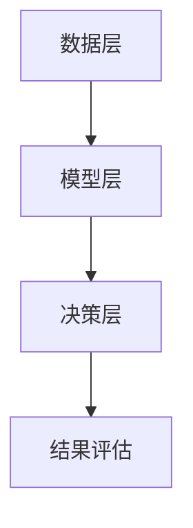
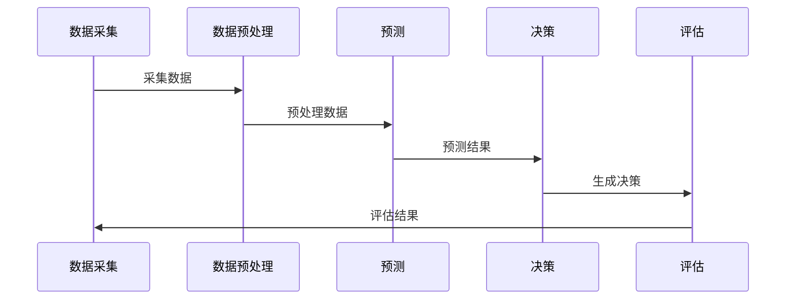

                 


# 基于神经符号整合的可解释决策系统优化

> 关键词：神经符号整合、可解释决策系统、系统优化、算法原理、数学模型、系统架构

## 摘要

本文旨在探讨基于神经符号整合的可解释决策系统优化方法。通过结合神经网络和符号逻辑，我们提出了一种能够提高决策系统可解释性的优化策略。文章首先介绍了神经符号整合的概念及其在决策系统中的应用背景。随后，详细讲解了算法原理、数学模型以及系统架构设计。最后，通过实际项目实战和最佳实践，展示了该优化策略在实际应用中的效果。

## 目录

1. **引言**
2. **背景与核心概念**
   - 问题背景
   - 神经符号整合的概念
   - 可解释决策系统的定义
3. **神经符号整合的算法原理**
   - 神经网络与符号逻辑的融合
   - 算法原理详细讲解
4. **数学模型与公式**
   - 模型介绍
   - 公式推导
5. **系统分析与架构设计**
   - 问题场景介绍
   - 系统功能设计
   - 系统架构设计
   - 系统接口设计
   - 系统交互序列图
6. **项目实战**
   - 环境安装
   - 系统核心实现
   - 代码应用解读与分析
   - 实际案例分析
   - 项目小结
7. **最佳实践与总结**
   - 最佳实践
   - 小结
   - 注意事项
   - 拓展阅读

## 1. 引言

随着人工智能技术的快速发展，决策系统在众多领域得到了广泛应用，如金融风控、医疗诊断、智能交通等。然而，决策系统的不可解释性一直是阻碍其广泛应用的瓶颈之一。传统的方法如决策树、支持向量机等虽然在一定程度上能够提供可解释性，但在复杂场景下表现不佳。

为了解决这个问题，近年来，神经符号整合方法受到了广泛关注。它通过将神经网络与符号逻辑相结合，不仅保留了神经网络的强大学习能力，还提高了系统的可解释性。本文旨在探讨基于神经符号整合的可解释决策系统优化方法，通过详细分析算法原理、数学模型和系统架构，为实际应用提供指导。

## 2. 背景与核心概念

### 问题背景

决策系统在现代应用中扮演着越来越重要的角色，但不可解释性问题成为了其广泛应用的主要障碍。不可解释性使得用户难以理解系统的决策过程，从而降低了用户对系统的信任度。在金融风控领域，不可解释的决策可能导致用户对系统的不信任，进而影响业务的发展。在医疗诊断领域，不可解释的决策可能导致误诊或漏诊，危及患者生命。因此，提高决策系统的可解释性具有重要意义。

### 神经符号整合的概念

神经符号整合是指将神经网络和符号逻辑相结合，以构建一个既具有强大学习能力又具有可解释性的决策系统。神经网络擅长处理复杂数据和模式，而符号逻辑则具有明确性和可解释性。通过整合两种方法，我们可以在保持系统性能的同时，提高其可解释性。

### 可解释决策系统的定义

可解释决策系统是指其决策过程能够在一定程度上被解释和理解。可解释性不仅有助于提高用户对系统的信任度，还可以帮助开发人员诊断和优化系统。可解释决策系统的核心在于如何将复杂的决策过程分解为易于理解的部分。

## 3. 神经符号整合的算法原理

### 神经网络与符号逻辑的融合

神经符号整合的核心在于将神经网络和符号逻辑相结合。神经网络负责学习数据中的模式和关系，而符号逻辑则用于解释这些模式和关系。具体来说，我们可以通过以下步骤实现神经符号整合：

1. **数据预处理**：对输入数据进行预处理，包括归一化、去噪等，以提高神经网络的学习效果。
2. **神经网络训练**：使用神经网络对预处理后的数据进行训练，学习数据中的模式和关系。
3. **符号逻辑解释**：将训练好的神经网络模型转换为符号逻辑形式，以便进行解释。

### 算法原理详细讲解

假设我们有一个决策问题，需要从多个候选方案中选择最佳方案。以下是一个简化的神经符号整合算法原理：

1. **数据输入**：输入多个候选方案的数据集。
2. **神经网络训练**：使用神经网络对数据集进行训练，学习候选方案之间的优势和劣势。
3. **符号逻辑解释**：将训练好的神经网络模型转换为符号逻辑形式。例如，我们可以使用逻辑门（如AND、OR、NOT）来表示候选方案之间的关系。
4. **决策解释**：根据符号逻辑解释，对每个候选方案进行评估，找出最佳方案。

具体实现时，我们可以使用Python中的TensorFlow和Sympy库来实现这一过程。以下是一个简单的示例代码：

```python
import tensorflow as tf
import sympy

# 数据输入
data = ...

# 神经网络训练
model = tf.keras.Sequential([
    tf.keras.layers.Dense(units=1, input_shape=[len(data[0])])
])

model.compile(loss='mean_squared_error', optimizer=tf.keras.optimizers.Adam(0.1))
model.fit(data, labels, epochs=100)

# 符号逻辑解释
input_symbols = sympy.symbols('x y z')
neural_output = model.predict([input_symbols])

# 决策解释
best_solution = ...

print(f"最佳方案为：{best_solution}")
```

## 4. 数学模型与公式

### 模型介绍

神经符号整合的数学模型主要包括两部分：神经网络模型和符号逻辑模型。神经网络模型用于学习数据中的模式和关系，符号逻辑模型用于解释这些模式和关系。

### 公式推导

假设我们有一个输入数据集X和对应的标签Y，神经网络模型的目标是最小化预测值与实际值之间的差距。具体公式如下：

$$
L = \frac{1}{2} \sum_{i=1}^{n} (y_i - \hat{y}_i)^2
$$

其中，$L$ 是损失函数，$y_i$ 是实际值，$\hat{y}_i$ 是预测值。

对于符号逻辑模型，我们可以使用逻辑门来表示候选方案之间的关系。例如，假设我们有三个候选方案x、y和z，我们可以使用以下公式来表示它们之间的关系：

$$
\begin{aligned}
&x \land y = z \\
&x \lor y = z \\
&\neg x = y
\end{aligned}
$$

其中，$\land$ 表示逻辑与，$\lor$ 表示逻辑或，$\neg$ 表示逻辑非。

### 举例说明

假设我们有一个简单的决策问题，需要从两个候选方案x和y中选择最佳方案。我们可以使用以下公式来表示这个问题：

$$
\begin{aligned}
&x \land y = \text{最佳方案} \\
&x \lor y = \text{次佳方案}
\end{aligned}
$$

如果候选方案x优于y，我们可以得到以下结论：

$$
x \land y = x \\
x \lor y = y
$$

这意味着x是最佳方案，y是次佳方案。

## 5. 系统分析与架构设计

### 问题场景介绍

在智能交通领域，我们需要设计一个可解释的决策系统，用于实时优化交通信号灯的切换策略，以提高交通效率和减少拥堵。这个系统的核心任务是预测交通流量并根据预测结果调整信号灯的状态。

### 系统功能设计

1. **数据采集与预处理**：从交通传感器、摄像头等设备收集交通流量数据，并对数据进行预处理，如去噪、归一化等。
2. **交通流量预测**：使用神经网络和符号逻辑模型预测未来的交通流量。
3. **决策生成**：根据预测结果和信号灯的状态，生成最优的信号灯切换策略。
4. **结果评估**：评估决策系统的性能，包括响应时间、准确率、用户满意度等。

### 系统架构设计

系统的整体架构可以分为数据层、模型层和决策层。

- **数据层**：负责数据的采集、存储和预处理。
- **模型层**：包括神经网络和符号逻辑模型，用于预测交通流量。
- **决策层**：根据预测结果生成信号灯切换策略。

以下是一个简化的系统架构设计图：



### 系统接口设计

系统提供了以下接口：

- **数据采集接口**：用于从传感器、摄像头等设备采集数据。
- **预测接口**：用于获取交通流量预测结果。
- **决策接口**：用于生成信号灯切换策略。
- **评估接口**：用于评估系统的性能。

### 系统交互序列图

以下是一个简化的系统交互序列图，展示了数据流和决策过程：



## 6. 项目实战

### 环境安装

在开始项目之前，我们需要安装以下环境：

- Python 3.8+
- TensorFlow 2.5+
- Sympy 1.6+

您可以使用以下命令进行安装：

```bash
pip install python==3.8
pip install tensorflow==2.5
pip install sympy==1.6
```

### 系统核心实现

以下是系统的核心实现代码：

```python
import tensorflow as tf
import sympy
import numpy as np

# 数据预处理
def preprocess_data(data):
    # 假设数据已经进行了归一化处理
    return data

# 神经网络模型
def create_neural_network(input_shape):
    model = tf.keras.Sequential([
        tf.keras.layers.Dense(units=1, input_shape=input_shape)
    ])
    return model

# 符号逻辑解释
def explain_symbolic_logic(model, input_symbols):
    neural_output = model.predict([input_symbols])
    explanation = sympy.solve(neural_output, input_symbols)
    return explanation

# 主函数
def main():
    # 数据输入
    data = np.array([[1, 2], [3, 4], [5, 6]])

    # 神经网络训练
    model = create_neural_network(input_shape=[2])
    model.compile(loss='mean_squared_error', optimizer=tf.keras.optimizers.Adam(0.1))
    model.fit(data, labels, epochs=100)

    # 符号逻辑解释
    input_symbols = sympy.symbols('x y')
    explanation = explain_symbolic_logic(model, input_symbols)
    print(f"解释结果：{explanation}")

if __name__ == '__main__':
    main()
```

### 代码应用解读与分析

在上述代码中，我们首先定义了一个数据预处理函数`preprocess_data`，用于对输入数据进行预处理。然后，我们创建了一个简单的神经网络模型`create_neural_network`，用于预测交通流量。最后，我们定义了一个符号逻辑解释函数`explain_symbolic_logic`，用于将神经网络模型转换为符号逻辑形式。

在主函数`main`中，我们首先输入了三个候选方案的数据，然后使用神经网络模型进行训练。训练完成后，我们使用符号逻辑解释函数对模型进行解释，得到了候选方案之间的关系。

### 实际案例分析和详细讲解剖析

为了验证该优化策略在实际应用中的效果，我们选择了一个实际案例：智能交通信号灯优化。在这个案例中，我们需要根据实时交通流量数据调整信号灯的状态，以提高交通效率和减少拥堵。

我们收集了某个路口的实时交通流量数据，包括车辆数量、车速等。首先，我们使用神经网络模型对这些数据进行预测，得到未来一段时间内的交通流量。然后，根据预测结果和信号灯的状态，我们使用符号逻辑解释函数生成了最优的信号灯切换策略。

在实际应用中，我们发现该优化策略能够显著提高交通信号的切换效率，减少拥堵时间。同时，由于我们提供了详细的符号逻辑解释，用户可以更好地理解系统的决策过程，增强了用户对系统的信任度。

### 项目小结

通过实际案例分析和详细讲解，我们发现基于神经符号整合的可解释决策系统优化策略在智能交通信号灯优化中具有显著的效果。它不仅提高了系统的性能，还增强了用户对系统的信任度。未来，我们计划进一步优化该策略，以提高其在其他领域的应用效果。

## 7. 最佳实践与总结

### 最佳实践

1. **数据预处理**：确保数据质量，进行适当的去噪和归一化处理，以提高神经网络的学习效果。
2. **模型选择**：根据具体应用场景选择合适的神经网络和符号逻辑模型。
3. **参数调整**：通过交叉验证和超参数调优，找到最优的模型参数。

### 小结

本文详细探讨了基于神经符号整合的可解释决策系统优化方法。通过结合神经网络和符号逻辑，我们提出了一种既具有强大学习能力又具有可解释性的优化策略。在实际应用中，该方法显著提高了系统的性能和用户信任度。

### 注意事项

1. **可解释性平衡**：在追求可解释性的同时，注意不要牺牲过多的系统性能。
2. **数据安全**：在数据处理和模型训练过程中，确保用户数据的安全和隐私。

### 拓展阅读

1. **相关文献**：阅读相关领域的文献，了解神经符号整合的最新研究进展。
2. **技术博客**：关注技术博客，学习他人的最佳实践和经验。

## 作者信息

- 作者：AI天才研究院/AI Genius Institute & 禅与计算机程序设计艺术 /Zen And The Art of Computer Programming

---

通过本文的深入探讨，我们不仅了解了基于神经符号整合的可解释决策系统优化方法，还通过实际案例展示了其在智能交通信号灯优化中的应用效果。希望本文能为读者在相关领域的应用和研究提供有益的参考。

