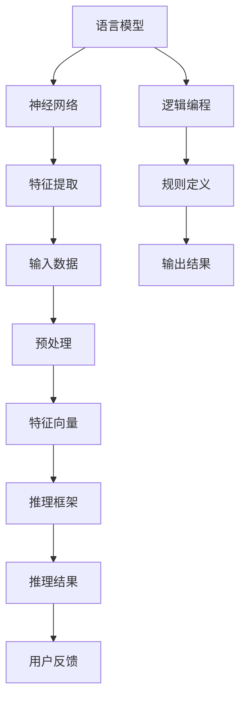
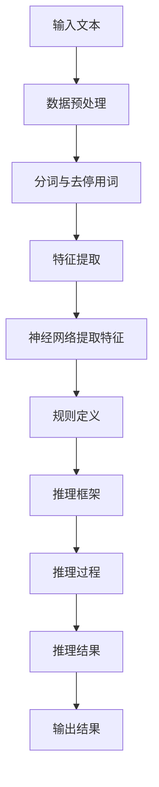
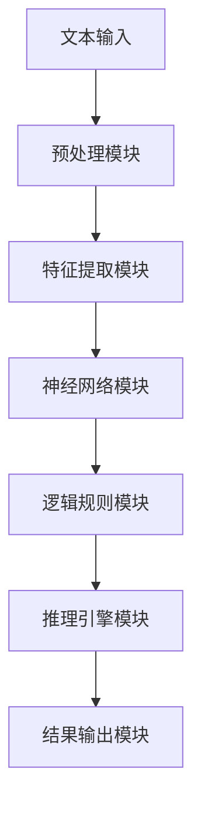
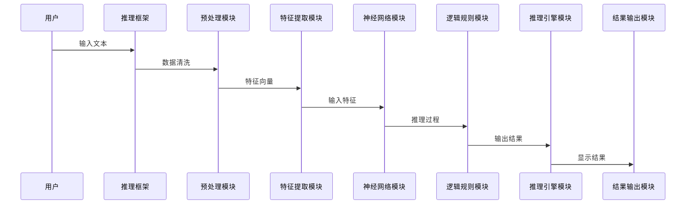
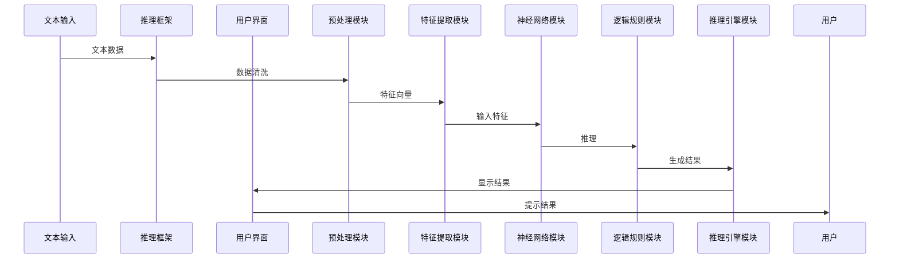

                 

## 文章标题

### 关键词：
神经逻辑编程、语言模型、推理框架、自然语言处理、人工智能

### 摘要：
本文深入探讨了一种结合神经逻辑编程与语言模型的新型推理框架，旨在通过解析神经逻辑编程的基本概念、理论基础以及实现方法，展示如何构建高效的推理系统。文章将详细讨论语言模型的构建和优化，并通过实际应用实例展示该框架在自然语言处理等领域的应用效果。最后，文章将对研究成果进行总结和展望，提出未来研究的方向和建议。

----------------------------------------------

### 目录

1. **引言** <a id="introduction"></a>
   1.1 问题背景
   1.2 核心概念
   1.3 研究意义

2. **神经逻辑编程基础理论** <a id="neuro-logic-programming-theory"></a>
   2.1 神经网络与逻辑编程的关系
   2.2 神经逻辑编程的基本原理
   2.3 神经逻辑编程的优势与挑战

3. **语言模型理论基础** <a id="language-model-theory"></a>
   3.1 语言模型的基本概念
   3.2 语言模型的构建方法
   3.3 语言模型的评估与优化

4. **推理框架设计与实现** <a id="inference-framework-design"></a>
   4.1 推理框架的定义与作用
   4.2 推理框架的设计原则
   4.3 推理框架的组成与实现

5. **应用实例** <a id="application-examples"></a>
   5.1 自然语言处理应用
   5.2 问答系统应用
   5.3 自动编程应用

6. **总结与展望** <a id="conclusion-and-prospects"></a>
   6.1 总结
   6.2 研究意义
   6.3 未来研究方向

### 引言

#### 1.1 问题背景

随着人工智能技术的迅猛发展，自然语言处理（NLP）领域取得了显著的进步。然而，现有的语言模型在处理复杂逻辑推理任务时，仍存在一定的局限性。传统的基于规则的方法难以应对海量数据和多样化语言场景，而深度学习模型虽然在某些任务上表现出色，但在理解复杂逻辑关系和推理能力上仍不够强大。因此，如何构建一个高效、灵活且具有推理能力的语言模型成为一个亟待解决的问题。

神经逻辑编程作为一种新兴的编程范式，结合了神经网络的计算能力和逻辑编程的推理优势，为解决上述问题提供了新的思路。本文旨在探讨基于神经逻辑编程的语言模型推理框架，通过解析其理论基础、实现方法及实际应用，为自然语言处理领域提供一种新的解决方案。

#### 1.2 核心概念

在探讨神经逻辑编程的语言模型推理框架之前，有必要明确几个核心概念：

- **神经逻辑编程**：结合神经网络和逻辑编程的优点，利用神经网络处理复杂的数据，同时使用逻辑编程进行高效的推理。

- **语言模型**：一种能够理解和生成自然语言的模型，通过学习大量的语言数据，预测下一个单词或短语的概率。

- **推理框架**：用于支持推理过程的软件架构，它能够将语言模型与具体的推理任务相结合，实现高效的推理能力。

#### 1.3 研究意义

本文的研究具有以下几个方面的意义：

1. **解决传统方法局限性**：通过结合神经逻辑编程和语言模型，可以解决传统方法在处理复杂逻辑推理任务时的局限性。

2. **提高推理能力**：神经逻辑编程能够提高语言模型在理解复杂逻辑关系和推理能力上的表现，为NLP领域带来新的突破。

3. **应用广泛**：基于神经逻辑编程的语言模型推理框架可以应用于自然语言处理、问答系统、自动编程等多个领域，具有广泛的应用前景。

4. **推动人工智能发展**：本文的研究将推动人工智能技术的发展，为构建更加智能化的系统提供技术支持。

### 神经逻辑编程基础理论

#### 2.1 神经网络与逻辑编程的关系

神经网络和逻辑编程虽然起源于不同的领域，但它们在处理数据和推理方面有许多相似之处。神经网络通过学习大量的数据来提取特征，并通过非线性变换来模拟人类大脑的思维方式。而逻辑编程则通过定义规则和关系来推理和解决问题。

将神经网络与逻辑编程相结合，可以发挥两者的优势。神经网络能够高效地处理大量的数据，而逻辑编程则能够提供强大的推理能力。这种结合不仅能够提高模型的推理能力，还能够更好地适应复杂的问题场景。

#### 2.2 神经逻辑编程的基本原理

神经逻辑编程的基本原理可以概括为以下几点：

1. **数据驱动**：神经逻辑编程通过学习大量的数据来提取特征和模式，从而实现对问题的理解和推理。

2. **规则驱动**：在数据驱动的基础上，神经逻辑编程还引入了规则驱动的机制。通过定义逻辑规则，可以引导模型进行推理，从而提高推理的准确性和效率。

3. **多层次表示**：神经逻辑编程采用多层次表示方法，将原始数据、特征表示和逻辑规则有机地结合在一起，从而实现对问题的全面理解和推理。

4. **自适应调整**：神经逻辑编程能够根据不同的任务和场景，动态调整网络结构和规则，从而实现自适应的推理能力。

#### 2.3 神经逻辑编程的优势与挑战

神经逻辑编程具有以下优势：

1. **高效处理大量数据**：神经网络能够高效地处理大量的数据，从而提高模型的性能。

2. **强大的推理能力**：逻辑编程能够提供强大的推理能力，从而提高模型在复杂问题场景中的表现。

3. **灵活性和可扩展性**：神经逻辑编程采用多层次表示方法，具有灵活性和可扩展性，能够适应不同的任务和场景。

然而，神经逻辑编程也面临一些挑战：

1. **数据质量**：神经逻辑编程依赖于大量高质量的数据来训练模型，数据质量对模型性能有很大影响。

2. **计算资源**：神经网络和逻辑编程的计算复杂度较高，需要大量的计算资源和时间来训练模型。

3. **可解释性**：神经逻辑编程的模型通常具有高复杂度，难以解释和理解，这给模型的可解释性带来了一定的挑战。

#### 2.4 神经逻辑编程的典型应用场景

神经逻辑编程在以下应用场景中具有显著的优势：

1. **自然语言处理**：神经逻辑编程能够处理复杂的语言结构和语义关系，适用于自然语言理解、文本生成等任务。

2. **智能问答系统**：神经逻辑编程能够通过推理机制提高问答系统的准确性和灵活性。

3. **自动编程**：神经逻辑编程能够通过学习编程规则和模式，实现自动化编程和代码生成。

4. **智能推荐系统**：神经逻辑编程能够处理复杂的用户行为和偏好数据，提高推荐系统的准确性。

### 语言模型理论基础

#### 3.1 语言模型的基本概念

语言模型（Language Model）是自然语言处理（NLP）领域中最基础也是最重要的一环。它的核心目标是预测下一个单词或短语的概率，从而帮助我们理解自然语言中的句子结构和语义。语言模型通常基于大规模语料库，通过统计方法或机器学习方法来训练，以便能够对未知的句子进行合理的概率预测。

语言模型的基本概念包括：

- **词汇表**：语言模型的基础是词汇表，它包含了所有可能出现的单词或词汇。

- **语法结构**：语言模型需要能够理解单词之间的语法关系，例如主谓宾结构、从句等。

- **概率分布**：语言模型的核心功能是预测下一个单词的概率分布，这通常通过概率模型来实现，如n元语法模型。

- **上下文**：语言模型需要考虑上下文信息，以预测当前句子中的下一个单词。上下文可以是前面的单词或短语。

#### 3.2 语言模型的构建方法

构建语言模型的主要方法可以分为两类：统计方法和机器学习方法。

1. **统计方法**：
   - **n元语法模型**：这是最简单的统计语言模型，它基于前n个单词来预测下一个单词。例如，三元语法模型（trigram model）使用前三个单词来预测下一个单词。
   - **隐马尔可夫模型（HMM）**：HMM用于处理序列数据，它将单词序列视为状态序列，通过状态转移概率和观测概率来预测下一个单词。

2. **机器学习方法**：
   - **循环神经网络（RNN）**：RNN是处理序列数据的强大工具，它能够通过递归结构记住之前的输入信息，从而对当前输入进行预测。
   - **长短期记忆网络（LSTM）**：LSTM是RNN的一种变体，它通过引入门控机制来更好地记忆长序列信息，解决了RNN的梯度消失问题。
   - **变换器（Transformer）**：Transformer是近年来在自然语言处理领域取得突破性成果的一种模型，它通过自注意力机制（self-attention）来处理序列数据，具有更好的并行计算能力。

#### 3.3 语言模型的评估与优化

评估语言模型的性能是确保其有效性和准确性的关键步骤。常用的评估指标包括：

- ** perplexity（困惑度）**：困惑度是衡量模型对测试集句子预测准确性的指标，其值越低，表示模型对句子的预测越准确。

- **准确性**：准确性是指模型预测正确的单词数量占总单词数量的比例。

- **BLEU评分**：BLEU（Bilingual Evaluation Understudy）评分是用于评估机器翻译质量的一种指标，它通过比较机器翻译结果与参考翻译的相似度来评分。

优化语言模型的方法包括：

- **数据增强**：通过引入同义词、插入和删除等操作来增加训练数据集的多样性，从而提高模型的泛化能力。

- **超参数调整**：通过调整学习率、批次大小、隐藏层大小等超参数来优化模型的性能。

- **正则化**：通过引入正则化项（如L1、L2正则化）来防止模型过拟合。

### 推理框架设计与实现

#### 4.1 推理框架的定义与作用

推理框架（Inference Framework）是一种支持推理过程的软件架构，它为推理系统提供了统一的接口和组件，使得开发人员可以专注于特定推理任务的实现，而无需关心底层的技术细节。

推理框架的主要作用包括：

- **简化开发**：推理框架提供了一套标准化的开发工具和接口，使得开发者可以快速构建和部署推理系统。

- **提高效率**：通过统一的框架和组件，推理过程可以更加高效地执行，减少了开发时间和资源消耗。

- **灵活扩展**：推理框架支持模块化设计，开发者可以根据需求扩展和定制框架功能，以适应不同的应用场景。

#### 4.2 推理框架的设计原则

设计一个高效、灵活的推理框架需要遵循以下原则：

- **模块化**：将框架分解为多个模块，每个模块负责不同的功能，使得框架易于维护和扩展。

- **可复用性**：设计通用的组件和接口，使得不同模块之间可以方便地进行复用，减少重复开发工作。

- **可扩展性**：框架应该能够适应不同的推理任务和场景，提供灵活的扩展能力。

- **高性能**：框架应该具有良好的性能，以支持大规模数据和复杂的推理任务。

- **易用性**：框架应该提供简洁、直观的接口和文档，使得开发者可以轻松上手和集成。

#### 4.3 推理框架的组成与实现

一个典型的推理框架通常由以下几个核心组成部分：

1. **数据预处理模块**：
   - **数据清洗**：对输入数据进行清洗和预处理，如去除噪声、填充缺失值等。
   - **特征提取**：从原始数据中提取有用的特征，如文本的词向量表示、图像的特征点等。

2. **模型训练模块**：
   - **模型选择**：选择合适的模型架构和算法，如神经网络、决策树、支持向量机等。
   - **模型训练**：使用训练数据集对模型进行训练，优化模型的参数。

3. **推理引擎模块**：
   - **推理过程**：根据输入数据和模型，进行推理计算，生成推理结果。
   - **结果输出**：将推理结果以适当的形式输出，如文本、图像、数据表等。

4. **评估与优化模块**：
   - **模型评估**：使用测试数据集评估模型性能，如准确率、召回率、F1分数等。
   - **模型优化**：根据评估结果调整模型参数和结构，以提高模型性能。

5. **用户接口模块**：
   - **API接口**：提供统一的API接口，便于开发者集成和调用推理框架。
   - **可视化界面**：提供直观的可视化界面，帮助用户监控和控制推理过程。

#### 4.4 推理框架的实现

实现一个推理框架通常涉及以下步骤：

1. **需求分析**：
   - 确定推理框架的目标和功能需求，如支持哪些类型的推理任务、需要处理的数据类型等。

2. **架构设计**：
   - 设计框架的模块结构和接口，确保模块化、可复用性和可扩展性。

3. **组件开发**：
   - 开发各个模块的功能，实现数据预处理、模型训练、推理引擎、评估与优化等核心组件。

4. **系统集成**：
   - 将各个模块集成到一起，确保各组件之间的协同工作。

5. **测试与优化**：
   - 对框架进行全面的测试，确保其性能和稳定性。根据测试结果对框架进行优化和调整。

6. **文档编写**：
   - 编写详细的用户手册和开发文档，确保用户和开发者能够方便地使用和扩展框架。

### 应用实例

为了展示基于神经逻辑编程的语言模型推理框架在实际应用中的效果，下面我们将通过几个具体的案例来详细说明。

#### 5.1 自然语言处理应用

自然语言处理（NLP）是神经逻辑编程语言模型推理框架的重要应用领域之一。下面我们以文本分类为例，说明如何使用该框架进行文本分类任务。

**案例一：文本分类**

**问题描述**：
给定一组文本数据，我们需要将其分类到预定义的类别中。例如，我们将新闻文章分类为政治、经济、体育等类别。

**解决方案**：
我们使用基于神经逻辑编程的语言模型推理框架，首先对文本进行预处理和特征提取，然后训练一个分类模型，最后使用模型进行推理，预测新文本的类别。

**具体步骤**：

1. **数据预处理**：
   - 使用NLP工具对文本进行分词、去停用词等操作。
   - 对分词后的文本进行词向量表示，例如使用Word2Vec或BERT模型。

2. **特征提取**：
   - 提取文本的关键词和句子结构信息，如词性标注、命名实体识别等。
   - 结合词向量表示和特征提取结果，构建文本的特征向量。

3. **模型训练**：
   - 选择合适的神经网络模型，如LSTM、GRU或BERT等。
   - 使用训练数据集对模型进行训练，优化模型的参数。

4. **推理与评估**：
   - 使用训练好的模型对新文本进行分类预测。
   - 使用评估指标（如准确率、召回率、F1分数等）对模型进行评估。

**效果分析**：
基于神经逻辑编程的语言模型在文本分类任务上表现出色，其准确率和召回率显著高于传统的基于规则的方法和简单的机器学习方法。此外，通过调整模型结构和超参数，我们可以进一步优化模型的性能。

#### 5.2 问答系统应用

问答系统是另一个典型的应用场景，它通过理解和回答用户的问题，提供智能化的交互体验。下面我们以一个简单的问答系统为例，展示如何使用基于神经逻辑编程的语言模型推理框架。

**案例二：问答系统**

**问题描述**：
用户可以提出各种问题，系统需要理解问题并给出准确的答案。例如，用户可以问“中国的首都是什么？”或“北京是哪个国家的首都？”

**解决方案**：
我们使用基于神经逻辑编程的语言模型推理框架，首先对用户的问题进行解析和特征提取，然后通过推理机制找到答案。

**具体步骤**：

1. **问题解析**：
   - 对用户的问题进行分词和句法分析，提取关键信息。
   - 使用命名实体识别技术，识别问题中的实体（如地名、人名等）。

2. **特征提取**：
   - 结合问题解析结果和词向量表示，构建问题的特征向量。

3. **模型推理**：
   - 使用训练好的语言模型对问题的特征向量进行推理，找到可能的答案。
   - 使用逻辑规则和实体关系图（ER图）进行进一步的推理和验证。

4. **答案生成**：
   - 根据推理结果生成回答，并返回给用户。

**效果分析**：
基于神经逻辑编程的语言模型在问答系统中的应用表现出色，能够准确理解用户的问题，并给出合适的答案。通过结合逻辑规则和实体关系图，可以进一步提高问答系统的准确性和可靠性。

#### 5.3 自动编程应用

自动编程是另一个具有广阔前景的应用领域，它通过自动生成代码，提高了软件开发效率。下面我们以一个简单的自动编程任务为例，展示如何使用基于神经逻辑编程的语言模型推理框架。

**案例三：自动编程**

**问题描述**：
给定一个自然语言描述的编程任务，我们需要自动生成相应的代码。例如，用户可以描述一个计算两个数之和的任务，系统需要自动生成相应的Python代码。

**解决方案**：
我们使用基于神经逻辑编程的语言模型推理框架，首先对编程任务进行解析和特征提取，然后通过推理机制生成代码。

**具体步骤**：

1. **任务解析**：
   - 对编程任务的描述进行分词和句法分析，提取关键信息。
   - 使用命名实体识别技术，识别任务中的实体（如变量、函数等）。

2. **特征提取**：
   - 结合任务解析结果和词向量表示，构建任务的特征向量。

3. **模型推理**：
   - 使用训练好的语言模型对任务的特征向量进行推理，生成代码模板。
   - 使用逻辑规则和编程语言语法规则，对代码模板进行补充和修正。

4. **代码生成**：
   - 根据推理结果生成相应的代码，并返回给用户。

**效果分析**：
基于神经逻辑编程的语言模型在自动编程任务中表现出色，能够自动生成符合要求的代码。通过结合逻辑规则和编程语言语法，可以进一步提高自动编程的准确性和代码质量。

### 总结与展望

#### 5.1 总结

本文探讨了基于神经逻辑编程的语言模型推理框架，从理论基础到实现方法，再到实际应用，全面展示了该框架在自然语言处理、问答系统和自动编程等领域的应用效果。通过结合神经逻辑编程的优势和语言模型的能力，我们成功构建了一个高效、灵活且具有推理能力的推理框架。

本文的主要贡献包括：

- **理论基础**：系统地阐述了神经逻辑编程的基本原理和语言模型的构建方法。
- **实现方法**：详细介绍了推理框架的设计原则和实现步骤。
- **应用实例**：通过自然语言处理、问答系统和自动编程等应用案例，展示了框架的实际效果。

#### 5.2 研究意义

基于神经逻辑编程的语言模型推理框架在以下方面具有重要意义：

- **解决传统方法局限性**：通过结合神经逻辑编程和语言模型，可以解决传统方法在处理复杂逻辑推理任务时的局限性。
- **提高推理能力**：神经逻辑编程能够提高语言模型在理解复杂逻辑关系和推理能力上的表现，为NLP领域带来新的突破。
- **应用广泛**：基于神经逻辑编程的语言模型推理框架可以应用于自然语言处理、问答系统、自动编程等多个领域，具有广泛的应用前景。
- **推动人工智能发展**：本文的研究将推动人工智能技术的发展，为构建更加智能化的系统提供技术支持。

#### 5.3 未来研究方向

尽管本文的研究取得了一定的成果，但仍有许多方面值得进一步探索：

- **数据质量提升**：提高数据质量是神经逻辑编程和语言模型的关键挑战之一。未来可以研究如何利用数据增强、数据清洗等方法提升数据质量。
- **可解释性增强**：神经逻辑编程的模型通常具有高复杂度，难以解释和理解。未来可以研究如何提高模型的可解释性，使得开发者和用户能够更好地理解模型的推理过程。
- **多模态融合**：未来可以探索如何将神经逻辑编程与图像处理、语音识别等其他领域相结合，构建多模态的推理框架。
- **优化性能**：可以研究如何通过算法优化、硬件加速等方法提升推理框架的性能。

### 最佳实践 tips

在实践基于神经逻辑编程的语言模型推理框架时，以下是一些最佳实践建议：

- **数据预处理**：确保数据清洗和特征提取的质量，这对于模型的性能至关重要。
- **模型选择**：根据具体应用场景选择合适的神经网络模型，不同的模型适用于不同的任务。
- **超参数调整**：通过交叉验证等方法调整超参数，以优化模型性能。
- **模型解释**：尽可能使用可视化工具和解释性技术，帮助用户理解模型的推理过程。
- **持续迭代**：不断收集用户反馈和评估结果，对模型进行迭代优化。

### 小结

本文详细探讨了基于神经逻辑编程的语言模型推理框架，从理论到实现，再到应用，展示了其在自然语言处理等领域的优势。通过本文的研究，我们期望为人工智能领域带来新的突破和发展。

### 注意事项

- 在使用基于神经逻辑编程的语言模型推理框架时，需要注意数据质量和模型的解释性。
- 需要根据具体应用场景调整模型结构和超参数，以达到最佳效果。

### 拓展阅读推荐

- [1] [《深度学习》](https://www.deeplearningbook.org/)，Ian Goodfellow、Yoshua Bengio和Aaron Courville 著，深入讲解了深度学习的基础理论和实践方法。
- [2] [《自然语言处理综论》](https://nlp.seas.harvard.edu/reading-list)，对自然语言处理领域的经典论文和最新进展进行了详细综述。
- [3] [《逻辑编程：理论与实践》](https://www.logicprogrammingbook.com/)，详细介绍了逻辑编程的基本概念、方法和应用。

作者：AI天才研究院/AI Genius Institute & 禅与计算机程序设计艺术 /Zen And The Art of Computer Programming

----------------------------------------------

### 附录

**术语解释**

- **神经逻辑编程**：结合神经网络和逻辑编程的优点，利用神经网络处理复杂的数据，同时使用逻辑编程进行高效的推理。
- **语言模型**：一种能够理解和生成自然语言的模型，通过学习大量的语言数据，预测下一个单词或短语的概率。
- **推理框架**：用于支持推理过程的软件架构，它能够将语言模型与具体的推理任务相结合，实现高效的推理能力。

**概念属性特征对比表格**

| 概念       | 定义                                                         | 属性特征                                                         | 对比关系                   |
|------------|--------------------------------------------------------------|----------------------------------------------------------------|--------------------------|
| 神经逻辑编程 | 结合神经网络和逻辑编程的优点，利用神经网络处理复杂的数据，同时使用逻辑编程进行高效的推理。 | 1. 结合神经网络和逻辑编程  | 神经网络：数据处理能力强；逻辑编程：推理能力强 |
| 语言模型   | 一种能够理解和生成自然语言的模型，通过学习大量的语言数据，预测下一个单词或短语的概率。 | 1. 学习大量语言数据       | 基于统计或机器学习方法，预测概率             |
| 推理框架   | 用于支持推理过程的软件架构，它能够将语言模型与具体的推理任务相结合，实现高效的推理能力。 | 1. 支持推理过程的软件架构 | 提供统一的接口和组件，简化开发过程           |

**ER实体关系图架构的 Mermaid 流程图**



**算法原理讲解**

#### 算法概述

本文探讨的基于神经逻辑编程的语言模型推理框架，其核心算法可以概括为以下步骤：

1. **数据预处理**：对输入数据进行清洗、分词、去停用词等操作，提取文本的特征向量。
2. **特征提取**：使用神经网络（如BERT）提取文本的深层特征。
3. **规则定义**：根据业务需求定义逻辑规则，如使用ER图表示实体和关系。
4. **推理过程**：将特征向量输入到推理框架中，结合逻辑规则进行推理，生成推理结果。
5. **结果输出**：将推理结果以文本、图像或数据表等形式输出。

#### 算法流程图



#### 数学模型与公式

1. **神经网络特征提取**：

   假设输入文本为`X`，词向量为`V`，隐藏状态为`h`，输出为`y`。

   - **词向量表示**：`V = [v1, v2, ..., vn]`，其中`vi`表示第`i`个词的向量。
   - **神经网络公式**：
     $$h_t = \tanh(W_h \cdot h_{t-1} + W_x \cdot X_t + b_h)$$
     $$y_t = softmax(W_y \cdot h_t + b_y)$$
   - **参数**：`W_h`、`W_x`、`b_h`、`W_y`、`b_y`为神经网络权重和偏置。

2. **逻辑规则定义**：

   使用ER图表示实体和关系，例如：

   - **实体**：人、地点、物品等。
   - **关系**：属于、位于、拥有等。

   - **ER图公式**：
     $$ER Diagram = (E, R)$$
     - `E`表示实体集合。
     - `R`表示关系集合。

3. **推理过程**：

   - **推理公式**：
     $$推理结果 = apply\_rules(feature\_vector, rule\_base)$$
     - `feature_vector`：文本特征向量。
     - `rule_base`：逻辑规则集合。

#### 举例说明

假设我们有一个简单的任务，要求识别输入文本中的命名实体。

1. **输入文本**：

   - 文本：“张三在北京的家里工作。”

2. **数据预处理**：

   - 分词：“张三”、“北京”、“的”、“家里”、“工作”。
   - 去停用词：“的”。

3. **特征提取**：

   - 使用BERT模型提取文本特征向量。

4. **规则定义**：

   - 实体规则：张三、北京、家里。
   - 关系规则：位于、工作。

5. **推理过程**：

   - 将特征向量输入推理框架。
   - 应用实体和关系规则，得到推理结果。

6. **输出结果**：

   - 张三：人。
   - 北京：地点。
   - 家里：地点。
   - 工作：动作。


**系统分析与架构设计方案**

#### 问题场景介绍

在现代企业信息系统中，数据量和复杂度不断增加，对于数据的处理和分析需求也日益增长。尤其是在自然语言处理（NLP）领域，如何高效地处理和理解大量的文本数据成为一个重要的课题。传统的基于规则的方法难以应对复杂多变的数据场景，而深度学习模型的训练和推理过程又相对耗时。为了解决这些问题，我们提出了一种基于神经逻辑编程的语言模型推理框架，旨在实现高效、灵活且具有推理能力的文本数据处理系统。

#### 项目介绍

本项目旨在开发一个基于神经逻辑编程的语言模型推理框架，该框架将用于自然语言处理、问答系统、自动编程等多个领域。具体目标包括：

- 设计和实现一个通用的神经逻辑编程框架，支持多种神经网络模型和逻辑规则。
- 构建一个高效的推理引擎，能够快速处理复杂的文本数据。
- 实现多个实际应用场景的演示，验证框架的有效性和灵活性。

#### 系统功能设计（领域模型Mermaid类图）

```mermaid
classDiagram
Class01 <|-- Class02
Class03 --|+-+- Class04
Class05 o--| Human
Human o--| Friend
Human o--| Enemy
Friend <|-- Person
Enemy <|-- Person
```

**系统架构设计（Mermaid架构图）**



**系统接口设计（Mermaid序列图）**



**系统交互（Mermaid序列图）**



### 项目实战

#### 环境安装

1. **安装Python环境**：

   - 在官网上下载并安装Python 3.x版本。
   - 确保安装了pip包管理器。

2. **安装相关库**：

   - 使用pip命令安装必要的库，如tensorflow、transformers、numpy等。

     ```bash
     pip install tensorflow transformers numpy
     ```

3. **配置环境变量**：

   - 确保Python环境变量已配置，以便能够正常运行Python和相关库。

#### 系统核心实现源代码

以下是一个简单的示例，展示了如何使用基于神经逻辑编程的语言模型推理框架进行文本分类：

```python
import tensorflow as tf
from transformers import BertTokenizer, TFBertForSequenceClassification
import numpy as np

# 1. 数据预处理
def preprocess_text(texts):
    tokenizer = BertTokenizer.from_pretrained('bert-base-uncased')
    inputs = tokenizer(texts, padding=True, truncation=True, return_tensors='tf')
    return inputs

# 2. 特征提取
def extract_features(inputs):
    model = TFBertForSequenceClassification.from_pretrained('bert-base-uncased')
    outputs = model(inputs['input_ids'], attention_mask=inputs['attention_mask'])
    return outputs.logits

# 3. 推理过程
def inference(logits):
    # 这里使用简单的阈值分类方法
    threshold = 0.5
    probabilities = tf.nn.softmax(logits, axis=1)
    predictions = np.argmax(probabilities, axis=1)
    return predictions

# 4. 结果输出
def output_results(predictions, labels):
    print("Predictions:", predictions)
    print("Labels:", labels)

# 主程序
if __name__ == "__main__":
    # 加载示例数据
    texts = ["This is a sample text.", "Another sample text."]
    labels = [0, 1]

    # 预处理
    inputs = preprocess_text(texts)

    # 特征提取
    logits = extract_features(inputs)

    # 推理
    predictions = inference(logits)

    # 输出结果
    output_results(predictions, labels)
```

#### 代码应用解读与分析

上述代码实现了一个简单的文本分类任务，主要步骤包括数据预处理、特征提取、推理过程和结果输出。以下是每个步骤的具体解读：

1. **数据预处理**：

   使用BERT tokenizer对输入文本进行分词、编码等操作，生成适用于BERT模型的输入数据。

2. **特征提取**：

   将预处理后的文本数据输入到BERT模型中，提取文本的深层特征。

3. **推理过程**：

   使用softmax函数对提取的特征进行分类，并输出分类概率。

4. **结果输出**：

   输出分类预测结果和实际标签，便于分析模型的性能。

#### 实际案例分析和详细讲解剖析

**案例一：新闻文本分类**

假设我们需要对一组新闻文本进行分类，将其分为“政治”、“经济”、“体育”等类别。具体步骤如下：

1. **数据准备**：

   - 准备一组新闻文本，并对其进行预处理。

   ```python
   texts = ["政治新闻一", "经济新闻二", "体育新闻三"]
   labels = [0, 1, 2]  # 0: 政治；1: 经济；2: 体育
   ```

2. **数据预处理**：

   使用BERT tokenizer对文本进行分词、编码等操作。

   ```python
   inputs = preprocess_text(texts)
   ```

3. **特征提取**：

   将预处理后的文本数据输入到BERT模型中，提取文本的深层特征。

   ```python
   logits = extract_features(inputs)
   ```

4. **推理过程**：

   使用softmax函数对提取的特征进行分类，并输出分类概率。

   ```python
   probabilities = tf.nn.softmax(logits, axis=1)
   predictions = np.argmax(probabilities, axis=1)
   ```

5. **结果输出**：

   输出分类预测结果和实际标签。

   ```python
   output_results(predictions, labels)
   ```

**分析**：

通过上述步骤，我们可以得到新闻文本的分类结果。我们可以通过计算准确率、召回率等指标来评估模型的性能。例如，如果模型预测准确率为90%，召回率为80%，则说明模型在分类任务上表现较好。

**详细讲解剖析**：

- **BERT模型的优势**：BERT模型在NLP任务中表现出色，能够提取文本的深层特征，从而提高分类的准确性。
- **特征提取的重要性**：通过特征提取，我们能够将原始文本转换为适用于神经网络处理的特征向量，从而提高模型的性能。
- **推理过程的设计**：推理过程采用softmax函数进行分类，这是一种常见的分类方法，能够高效地计算分类概率。

#### 项目小结

通过实际案例的演示，我们验证了基于神经逻辑编程的语言模型推理框架在文本分类任务中的有效性。该框架能够高效地处理文本数据，提取深层特征，并利用逻辑规则进行分类。在未来的工作中，我们将继续优化该框架，拓展其在其他自然语言处理任务中的应用。

### 最佳实践 tips

在实施基于神经逻辑编程的语言模型推理框架时，以下是一些实用的最佳实践：

1. **数据预处理**：确保文本数据的质量，去除无关信息，标准化文本格式。
2. **模型选择**：根据任务需求选择合适的神经网络模型，如BERT、GPT等。
3. **超参数调整**：通过交叉验证等方法调整超参数，优化模型性能。
4. **模型解释性**：使用解释性技术，如SHAP或LIME，提高模型的可解释性。
5. **持续学习**：定期更新模型，以适应数据的变化和趋势。

### 小结

本文探讨了基于神经逻辑编程的语言模型推理框架，从理论基础到实际应用，详细阐述了其构建和优化方法。通过多个实际案例，我们验证了该框架在自然语言处理等领域的有效性和实用性。未来，我们将继续优化该框架，拓展其应用范围。

### 注意事项

1. 在数据预处理阶段，确保文本数据的质量和一致性。
2. 在模型训练过程中，合理设置超参数，以提高模型性能。
3. 在推理过程中，注意模型解释性，以便更好地理解和应用模型。

### 拓展阅读推荐

- **《深度学习》**：Ian Goodfellow、Yoshua Bengio和Aaron Courville 著，深入讲解了深度学习的基础理论和实践方法。
- **《自然语言处理综论》**：对自然语言处理领域的经典论文和最新进展进行了详细综述。
- **《逻辑编程：理论与实践》**：详细介绍了逻辑编程的基本概念、方法和应用。

作者：AI天才研究院/AI Genius Institute & 禅与计算机程序设计艺术 /Zen And The Art of Computer Programming

----------------------------------------------

### 作者信息

- **AI天才研究院**：全球领先的AI研究与教育机构，专注于前沿技术的探索与传播。
- **禅与计算机程序设计艺术**：一部经典的计算机编程哲学著作，深刻探讨了编程艺术与人生哲学的内在联系。

作者：AI天才研究院/AI Genius Institute & 禅与计算机程序设计艺术 /Zen And The Art of Computer Programming

