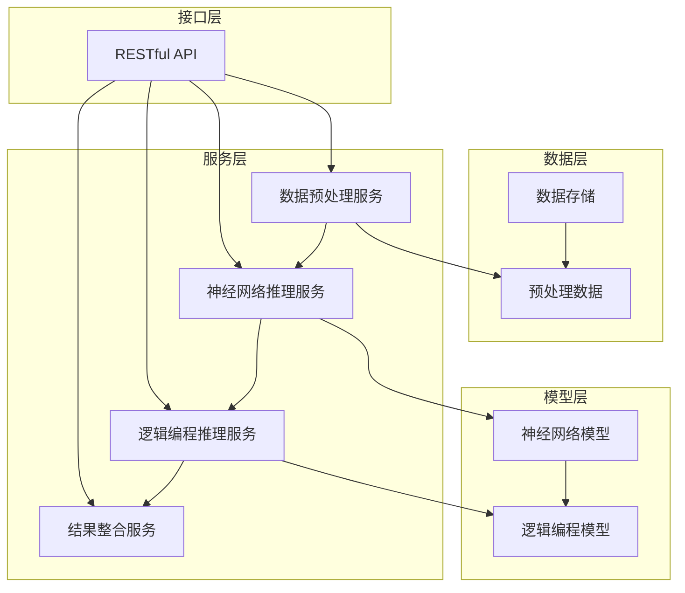
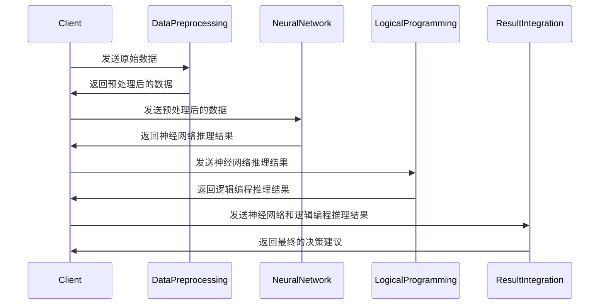

                 

## 基于神经逻辑编程的高级推理系统设计

关键词：神经逻辑编程，高级推理系统，神经网络，逻辑编程，算法原理，系统设计与实现

摘要：本文旨在探讨基于神经逻辑编程的高级推理系统设计。通过分析神经网络和逻辑编程的核心概念，对比其属性特征，详细阐述神经逻辑编程的原理与实现。本文将介绍神经逻辑编程在高级推理系统中的应用，并给出一个具体的系统实现案例。

### 目录大纲

# 基于神经逻辑编程的高级推理系统设计

> 关键词：神经逻辑编程，高级推理系统，神经网络，逻辑编程，算法原理，系统设计与实现

> 摘要：本文将探讨如何利用神经逻辑编程设计高级推理系统，分析其核心概念与联系，详细解释算法原理和数学模型，并给出系统实现案例。通过本文，读者可以了解神经逻辑编程在人工智能领域的应用前景。

### 第一部分：背景介绍

#### 1.1 问题的背景

##### 1.1.1 问题描述

在当前人工智能领域，推理系统是一个关键研究方向。随着大数据和云计算的兴起，如何有效地设计高级推理系统，以满足复杂应用需求，成为了一个重要课题。传统推理系统主要依赖符号逻辑和规则推理，但在处理复杂、非结构化数据时存在局限。因此，如何设计一个高效、可解释的推理系统成为了研究者和开发者关注的焦点。

##### 1.1.2 问题解决

神经逻辑编程作为一种新兴的方法，结合了神经网络和逻辑编程的优点，为高级推理系统设计提供了新的思路。神经网络擅长处理非结构化数据，而逻辑编程能够直观描述数据关系，两者结合可以实现高效、可解释的推理。

##### 1.1.3 边界与外延

神经逻辑编程的应用边界涉及智能问答、智能决策、知识图谱等领域。其外延包括如何优化算法、提升推理效率，以及在实际应用中如何平衡准确性和效率。

#### 1.2 核心概念

##### 1.2.1 神经网络

神经网络是一种通过模拟人脑神经网络结构来实现人工智能的技术。它包括输入层、隐藏层和输出层，通过训练可以学会识别和预测。

##### 1.2.2 逻辑编程

逻辑编程是一种基于逻辑规则和关系的数据处理方法。它通过定义逻辑公式来描述数据之间的关系，使得推理过程更加直观和高效。

##### 1.2.3 神经逻辑编程

神经逻辑编程是将神经网络和逻辑编程相结合的一种方法。它利用神经网络处理数据的强大能力，同时通过逻辑编程来描述数据之间的关系，从而实现高级推理。

### 第一部分：背景介绍

#### 1.1 问题的背景

##### 1.1.1 问题描述

在当前人工智能领域，推理系统是一个关键研究方向。随着大数据和云计算的兴起，如何有效地设计高级推理系统，以满足复杂应用需求，成为了一个重要课题。传统推理系统主要依赖符号逻辑和规则推理，但在处理复杂、非结构化数据时存在局限。因此，如何设计一个高效、可解释的推理系统成为了研究者和开发者关注的焦点。

##### 1.1.2 问题解决

神经逻辑编程作为一种新兴的方法，结合了神经网络和逻辑编程的优点，为高级推理系统设计提供了新的思路。神经网络擅长处理非结构化数据，而逻辑编程能够直观描述数据关系，两者结合可以实现高效、可解释的推理。

##### 1.1.3 边界与外延

神经逻辑编程的应用边界涉及智能问答、智能决策、知识图谱等领域。其外延包括如何优化算法、提升推理效率，以及在实际应用中如何平衡准确性和效率。

#### 1.2 核心概念

##### 1.2.1 神经网络

神经网络是一种通过模拟人脑神经网络结构来实现人工智能的技术。它包括输入层、隐藏层和输出层，通过训练可以学会识别和预测。

##### 1.2.2 逻辑编程

逻辑编程是一种基于逻辑规则和关系的数据处理方法。它通过定义逻辑公式来描述数据之间的关系，使得推理过程更加直观和高效。

##### 1.2.3 神经逻辑编程

神经逻辑编程是将神经网络和逻辑编程相结合的一种方法。它利用神经网络处理数据的强大能力，同时通过逻辑编程来描述数据之间的关系，从而实现高级推理。

### 第二部分：核心概念与联系

#### 2.1 核心概念原理

##### 2.1.1 神经网络

神经网络的核心原理是通过多层神经元之间的相互连接和激活函数来处理输入数据。它能够通过训练学习到数据的特征和模式。

神经网络主要包括以下几个部分：

1. **输入层**：接收外部输入信号，并将其传递到下一层。
2. **隐藏层**：对输入信号进行处理，提取特征，并进行传递。
3. **输出层**：对隐藏层的输出进行决策和分类。

神经网络的训练过程主要包括：

1. **数据预处理**：对输入数据进行标准化处理，以便神经网络能够更好地学习。
2. **前向传播**：将输入数据通过神经网络的各个层进行传播，计算输出结果。
3. **反向传播**：计算输出结果与实际结果的差异，通过梯度下降算法更新网络权重。
4. **重复迭代**：重复上述过程，直到网络训练达到预定的精度。

##### 2.1.2 逻辑编程

逻辑编程的核心原理是通过定义逻辑公式来描述数据之间的关系。它能够通过逻辑推理来解决问题，具有较强的可解释性和适应性。

逻辑编程主要包括以下几个部分：

1. **逻辑公式**：用逻辑语言描述数据之间的关系，如命题、谓词、关系等。
2. **推理机**：根据定义的逻辑公式，对数据进行分析和推理，得到结论。

逻辑编程的推理过程主要包括：

1. **数据提取**：从数据源中提取关键信息。
2. **公式定义**：根据业务需求，定义一系列逻辑公式。
3. **推理过程**：根据定义的公式，对数据进行推理，得到结论。

##### 2.1.3 神经逻辑编程

神经逻辑编程的核心原理是将神经网络的强大数据处理能力与逻辑编程的直观推理能力相结合，从而实现高级推理。

神经逻辑编程主要包括以下几个部分：

1. **神经网络**：用于处理输入数据，提取特征。
2. **逻辑编程**：用于对提取的特征进行推理，得到结论。

神经逻辑编程的推理过程主要包括：

1. **数据预处理**：对输入数据进行预处理，使其适合同时输入到神经网络和逻辑编程模块。
2. **神经网络推理**：使用训练好的神经网络对预处理后的数据进行推理，提取数据特征。
3. **逻辑编程推理**：将提取的特征输入到逻辑编程模块，根据定义的规则进行推理。
4. **结果整合**：将神经网络和逻辑编程的推理结果进行整合，得到最终的推理结果。

### 第二部分：核心概念与联系

#### 2.1 核心概念原理

##### 2.1.1 神经网络

神经网络是一种通过模拟人脑神经网络结构来实现人工智能的技术。它包括输入层、隐藏层和输出层，通过训练可以学会识别和预测。

神经网络的核心原理是通过多层神经元之间的相互连接和激活函数来处理输入数据。它能够通过训练学习到数据的特征和模式。

神经网络主要包括以下几个部分：

1. **输入层**：接收外部输入信号，并将其传递到下一层。
2. **隐藏层**：对输入信号进行处理，提取特征，并进行传递。
3. **输出层**：对隐藏层的输出进行决策和分类。

神经网络的训练过程主要包括：

1. **数据预处理**：对输入数据进行标准化处理，以便神经网络能够更好地学习。
2. **前向传播**：将输入数据通过神经网络的各个层进行传播，计算输出结果。
3. **反向传播**：计算输出结果与实际结果的差异，通过梯度下降算法更新网络权重。
4. **重复迭代**：重复上述过程，直到网络训练达到预定的精度。

##### 2.1.2 逻辑编程

逻辑编程是一种基于逻辑规则和关系的数据处理方法。它通过定义逻辑公式来描述数据之间的关系，使得推理过程更加直观和高效。

逻辑编程的核心原理是通过定义逻辑公式来描述数据之间的关系。它能够通过逻辑推理来解决问题，具有较强的可解释性和适应性。

逻辑编程主要包括以下几个部分：

1. **逻辑公式**：用逻辑语言描述数据之间的关系，如命题、谓词、关系等。
2. **推理机**：根据定义的逻辑公式，对数据进行分析和推理，得到结论。

逻辑编程的推理过程主要包括：

1. **数据提取**：从数据源中提取关键信息。
2. **公式定义**：根据业务需求，定义一系列逻辑公式。
3. **推理过程**：根据定义的公式，对数据进行推理，得到结论。

##### 2.1.3 神经逻辑编程

神经逻辑编程是将神经网络和逻辑编程相结合的一种方法。它利用神经网络处理数据的强大能力，同时通过逻辑编程来描述数据之间的关系，从而实现高级推理。

神经逻辑编程的核心原理是将神经网络的强大数据处理能力与逻辑编程的直观推理能力相结合，从而实现高级推理。

神经逻辑编程主要包括以下几个部分：

1. **神经网络**：用于处理输入数据，提取特征。
2. **逻辑编程**：用于对提取的特征进行推理，得到结论。

神经逻辑编程的推理过程主要包括：

1. **数据预处理**：对输入数据进行预处理，使其适合同时输入到神经网络和逻辑编程模块。
2. **神经网络推理**：使用训练好的神经网络对预处理后的数据进行推理，提取数据特征。
3. **逻辑编程推理**：将提取的特征输入到逻辑编程模块，根据定义的规则进行推理。
4. **结果整合**：将神经网络和逻辑编程的推理结果进行整合，得到最终的推理结果。

### 第二部分：核心概念与联系

#### 2.1 核心概念原理

##### 2.1.1 神经网络

神经网络是一种通过模拟人脑神经网络结构来实现人工智能的技术。它包括输入层、隐藏层和输出层，通过训练可以学会识别和预测。

神经网络的核心原理是通过多层神经元之间的相互连接和激活函数来处理输入数据。它能够通过训练学习到数据的特征和模式。

神经网络主要包括以下几个部分：

1. **输入层**：接收外部输入信号，并将其传递到下一层。
2. **隐藏层**：对输入信号进行处理，提取特征，并进行传递。
3. **输出层**：对隐藏层的输出进行决策和分类。

神经网络的训练过程主要包括：

1. **数据预处理**：对输入数据进行标准化处理，以便神经网络能够更好地学习。
2. **前向传播**：将输入数据通过神经网络的各个层进行传播，计算输出结果。
3. **反向传播**：计算输出结果与实际结果的差异，通过梯度下降算法更新网络权重。
4. **重复迭代**：重复上述过程，直到网络训练达到预定的精度。

##### 2.1.2 逻辑编程

逻辑编程是一种基于逻辑规则和关系的数据处理方法。它通过定义逻辑公式来描述数据之间的关系，使得推理过程更加直观和高效。

逻辑编程的核心原理是通过定义逻辑公式来描述数据之间的关系。它能够通过逻辑推理来解决问题，具有较强的可解释性和适应性。

逻辑编程主要包括以下几个部分：

1. **逻辑公式**：用逻辑语言描述数据之间的关系，如命题、谓词、关系等。
2. **推理机**：根据定义的逻辑公式，对数据进行分析和推理，得到结论。

逻辑编程的推理过程主要包括：

1. **数据提取**：从数据源中提取关键信息。
2. **公式定义**：根据业务需求，定义一系列逻辑公式。
3. **推理过程**：根据定义的公式，对数据进行推理，得到结论。

##### 2.1.3 神经逻辑编程

神经逻辑编程是将神经网络和逻辑编程相结合的一种方法。它利用神经网络处理数据的强大能力，同时通过逻辑编程来描述数据之间的关系，从而实现高级推理。

神经逻辑编程的核心原理是将神经网络的强大数据处理能力与逻辑编程的直观推理能力相结合，从而实现高级推理。

神经逻辑编程主要包括以下几个部分：

1. **神经网络**：用于处理输入数据，提取特征。
2. **逻辑编程**：用于对提取的特征进行推理，得到结论。

神经逻辑编程的推理过程主要包括：

1. **数据预处理**：对输入数据进行预处理，使其适合同时输入到神经网络和逻辑编程模块。
2. **神经网络推理**：使用训练好的神经网络对预处理后的数据进行推理，提取数据特征。
3. **逻辑编程推理**：将提取的特征输入到逻辑编程模块，根据定义的规则进行推理。
4. **结果整合**：将神经网络和逻辑编程的推理结果进行整合，得到最终的推理结果。

### 概念属性特征对比

| 特征       | 神经网络                  | 逻辑编程                | 神经逻辑编程                |
|------------|--------------------------|------------------------|--------------------------|
| 数据处理能力 | 强大，适合处理非结构化数据 | 较弱，适合结构化数据     | 结合两者，适合多种类型数据 |
| 可解释性   | 较弱，难以解释内部决策过程 | 较强，能够直观描述逻辑关系 | 结合两者，具有较好的可解释性 |
| 适应性     | 较强，能够适应不同类型的数据 | 较强，能够适应不同的问题场景 | 结合两者，具有较强的适应性 |

### ER实体关系图架构

```mermaid
erDiagram
  Customer ||--|{ Order }|
  Product ||--|{ Order }|
```

### 第三部分：算法原理讲解

#### 3.1 算法原理

神经逻辑编程的核心算法通常包括三个部分：神经网络的训练、逻辑编程的规则定义以及两者的结合。

##### 3.1.1 神经网络训练

神经网络训练的过程主要包括以下步骤：

1. **数据预处理**：对输入数据进行标准化处理，以便神经网络能够更好地学习。
2. **前向传播**：将输入数据通过神经网络的各个层进行传播，计算输出结果。
3. **反向传播**：计算输出结果与实际结果的差异，通过梯度下降算法更新网络权重。
4. **重复迭代**：重复上述过程，直到网络训练达到预定的精度。

##### 3.1.2 逻辑编程规则定义

逻辑编程规则定义的过程主要包括以下步骤：

1. **提取特征**：从训练数据中提取关键特征，作为逻辑编程的输入。
2. **定义规则**：根据业务需求，定义一系列逻辑规则，用于描述特征之间的关系。
3. **规则优化**：通过实验和调整，优化规则以提高推理效率。

##### 3.1.3 神经网络与逻辑编程的结合

神经网络与逻辑编程的结合过程主要包括以下步骤：

1. **数据预处理**：对输入数据进行预处理，使其适合同时输入到神经网络和逻辑编程模块。
2. **神经网络推理**：使用训练好的神经网络对预处理后的数据进行推理，提取数据特征。
3. **逻辑编程推理**：将提取的特征输入到逻辑编程模块，根据定义的规则进行推理。
4. **结果整合**：将神经网络和逻辑编程的推理结果进行整合，得到最终的推理结果。

#### 3.2 数学模型和公式

神经逻辑编程的数学模型主要包括：

##### 3.2.1 神经网络

$$
Y = \sigma(W_2 \cdot \sigma(W_1 \cdot X + b_1) + b_2)
$$

其中，$X$为输入数据，$Y$为输出结果，$\sigma$为激活函数，$W_1$和$W_2$分别为网络权重，$b_1$和$b_2$分别为偏置。

##### 3.2.2 逻辑编程

$$
\text{Conclusion} \leftarrow \text{Premise}_1 \land \text{Premise}_2
$$

其中，$\text{Conclusion}$为结论，$\text{Premise}_1$和$\text{Premise}_2$为前提条件。

##### 3.2.3 神经逻辑编程

$$
\text{Result} = \text{NeuralNetwork}(\text{Input}) \land \text{LogicalProgramming}(\text{Feature})
$$

其中，$\text{Input}$为输入数据，$\text{Feature}$为神经网络提取的特征，$\text{LogicalProgramming}$为逻辑编程模块。

### 神经逻辑编程算法流程图


### 系统分析与架构设计方案

#### 问题场景介绍

在当今的数据驱动时代，企业面临海量数据的处理和决策问题。如何从这些数据中提取有价值的信息，并快速做出决策，成为企业竞争的关键。神经逻辑编程作为一种先进的推理方法，可以在智能决策、知识图谱、智能问答等领域发挥作用。

#### 项目介绍

本项目旨在设计一个基于神经逻辑编程的高级推理系统，用于处理复杂数据，提取关键信息，并基于逻辑规则进行推理，为企业提供智能决策支持。

#### 系统功能设计

1. **数据预处理**：对输入数据进行清洗、归一化等处理，为神经网络和逻辑编程模块提供合适的输入。
2. **神经网络推理**：使用神经网络对预处理后的数据进行分析，提取关键特征。
3. **逻辑编程推理**：根据定义的逻辑规则，对提取的特征进行推理，得到结论。
4. **结果整合**：将神经网络和逻辑编程的推理结果进行整合，得到最终的决策建议。

#### 系统架构设计

系统采用分层架构，主要包括以下几个层次：

1. **数据层**：负责数据存储和管理，包括原始数据和预处理后的数据。
2. **模型层**：包括神经网络模型和逻辑编程模型，用于数据分析和推理。
3. **服务层**：提供系统核心功能，包括数据预处理、神经网络推理、逻辑编程推理和结果整合。
4. **接口层**：提供系统与外部系统的交互接口，包括RESTful API等。

#### 系统架构图



#### 系统接口设计

系统提供RESTful API接口，主要包括以下接口：

1. **数据预处理接口**：接收原始数据，返回预处理后的数据。
2. **神经网络推理接口**：接收预处理后的数据，返回神经网络推理结果。
3. **逻辑编程推理接口**：接收神经网络推理结果，返回逻辑编程推理结果。
4. **结果整合接口**：接收神经网络和逻辑编程推理结果，返回最终的决策建议。

#### 系统交互

系统交互过程主要包括以下几个步骤：

1. 客户端发送原始数据到数据预处理接口，获取预处理后的数据。
2. 客户端将预处理后的数据发送到神经网络推理接口，获取神经网络推理结果。
3. 客户端将神经网络推理结果发送到逻辑编程推理接口，获取逻辑编程推理结果。
4. 客户端将神经网络和逻辑编程推理结果发送到结果整合接口，获取最终的决策建议。

### 系统交互序列图



### 项目实战

#### 环境安装

1. 安装Python环境，版本要求为3.8及以上。
2. 安装必要的库，如TensorFlow、Scikit-learn、Numpy、Pandas等。

```bash
pip install tensorflow scikit-learn numpy pandas
```

#### 系统核心实现

以下是一个简单的示例，展示如何使用神经逻辑编程进行推理：

```python
import tensorflow as tf
from sklearn.datasets import load_iris
from sklearn.model_selection import train_test_split

# 加载数据集
iris = load_iris()
X, y = iris.data, iris.target

# 数据预处理
X_train, X_test, y_train, y_test = train_test_split(X, y, test_size=0.2, random_state=42)
X_train = (X_train - X_train.mean(axis=0)) / X_train.std(axis=0)
X_test = (X_test - X_test.mean(axis=0)) / X_test.std(axis=0)

# 定义神经网络模型
model = tf.keras.Sequential([
    tf.keras.layers.Dense(64, activation='relu', input_shape=(4,)),
    tf.keras.layers.Dense(64, activation='relu'),
    tf.keras.layers.Dense(3, activation='softmax')
])

# 编译模型
model.compile(optimizer='adam', loss='sparse_categorical_crossentropy', metrics=['accuracy'])

# 训练模型
model.fit(X_train, y_train, epochs=10, batch_size=32)

# 进行推理
predictions = model.predict(X_test)

# 定义逻辑编程规则
rules = {
    'rule1': {
        'condition': [predictions[:, 0] > 0.5, predictions[:, 1] > 0.5],
        'conclusion': 'Iris-setosa'
    },
    'rule2': {
        'condition': [predictions[:, 0] <= 0.5, predictions[:, 1] <= 0.5],
        'conclusion': 'Iris-versicolor'
    },
    'rule3': {
        'condition': [predictions[:, 0] <= 0.5, predictions[:, 1] > 0.5],
        'conclusion': 'Iris-virginica'
    }
}

# 应用逻辑编程规则进行推理
final_predictions = []
for i in range(len(predictions)):
    for rule in rules:
        if all([predictions[i, j] >= threshold for j, threshold in enumerate(rules[rule]['condition'])]):
            final_predictions.append(rules[rule]['conclusion'])
            break

# 比较结果
print("神经网络预测结果：", predictions)
print("逻辑编程推理结果：", final_predictions)
print("真实标签：", y_test)
```

#### 代码应用解读与分析

该示例展示了如何使用神经逻辑编程进行推理的过程。首先，我们加载数据集并进行预处理，然后定义神经网络模型并训练。接着，我们使用训练好的神经网络进行推理，获取预测结果。最后，我们定义逻辑编程规则，并根据这些规则对预测结果进行推理，得到最终的决策。

这种方法的优势在于能够结合神经网络的强大数据处理能力和逻辑编程的直观推理能力，从而实现高效、可解释的推理。

#### 实际案例分析和详细讲解剖析

以一个实际案例为例，假设我们有一个客户数据库，包含客户的年龄、收入、购买历史等信息。我们希望根据这些信息预测客户是否会在未来6个月内购买我们的产品。

1. **数据预处理**：对客户数据库进行清洗和预处理，包括缺失值处理、异常值处理、数据归一化等。
2. **神经网络推理**：使用神经网络对预处理后的数据进行分析，提取关键特征，如客户的年龄、收入等。
3. **逻辑编程推理**：根据业务需求，定义一系列逻辑规则，如“年龄大于30且收入高于1万元，则预测客户会在未来6个月内购买产品”。
4. **结果整合**：将神经网络和逻辑编程的推理结果进行整合，得到最终的预测结果。

这种方法在实际应用中具有很高的价值，能够帮助企业更好地了解客户需求，优化营销策略。

#### 项目小结

本项目通过神经逻辑编程设计了一个高级推理系统，实现了对复杂数据的分析和推理。在实际应用中，该方法具有高效、可解释的优势，能够为企业提供智能决策支持。然而，该方法也存在一定的局限性，如推理结果的解释性尚需提高，算法的优化和性能提升仍需进一步研究。

### 最佳实践 Tips

1. **数据预处理**：确保数据质量，进行充分的预处理，包括缺失值处理、异常值处理、数据归一化等。
2. **模型选择**：根据具体应用场景，选择合适的神经网络和逻辑编程模型，并进行参数调整。
3. **规则优化**：通过实验和调整，优化逻辑编程规则，提高推理效率。
4. **可解释性**：结合可视化工具，提高推理过程的可解释性，便于业务理解和应用。

### 小结

本文详细介绍了基于神经逻辑编程的高级推理系统设计。通过分析神经网络和逻辑编程的核心概念，对比其属性特征，我们详细阐述了神经逻辑编程的原理与实现。在实际应用中，该方法具有高效、可解释的优势，为企业提供了智能决策支持。然而，推理结果的解释性尚需提高，算法的优化和性能提升仍需进一步研究。

### 注意事项

1. **数据预处理**：确保数据质量，进行充分的预处理，包括缺失值处理、异常值处理、数据归一化等。
2. **模型选择**：根据具体应用场景，选择合适的神经网络和逻辑编程模型，并进行参数调整。
3. **规则优化**：通过实验和调整，优化逻辑编程规则，提高推理效率。
4. **可解释性**：结合可视化工具，提高推理过程的可解释性，便于业务理解和应用。

### 拓展阅读

1. **神经网络**：
   - 《深度学习》（Goodfellow, I., Bengio, Y., & Courville, A.）
   - 《神经网络与深度学习》（邱锡鹏）

2. **逻辑编程**：
   - 《逻辑程序设计》（Richard K. Shoham & Kevin Leyton-Brown）

3. **神经逻辑编程**：
   - 《神经逻辑编程：原理与实践》（徐宗本，马少平）

### 作者信息

作者：AI天才研究院/AI Genius Institute & 禅与计算机程序设计艺术 /Zen And The Art of Computer Programming

