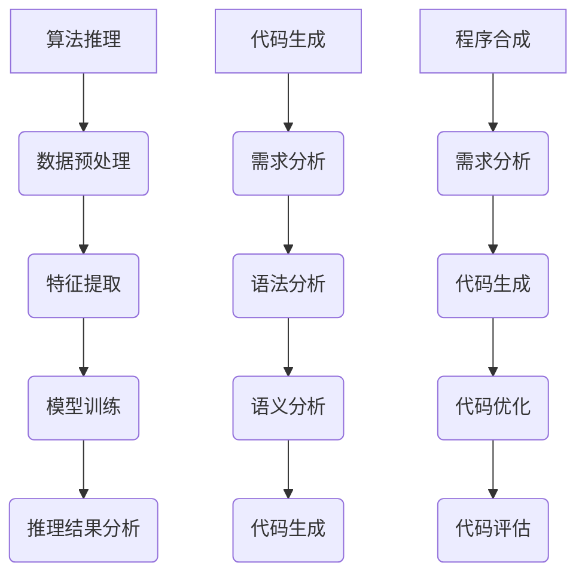
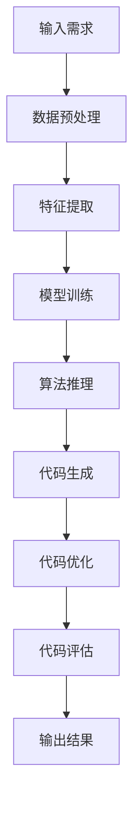
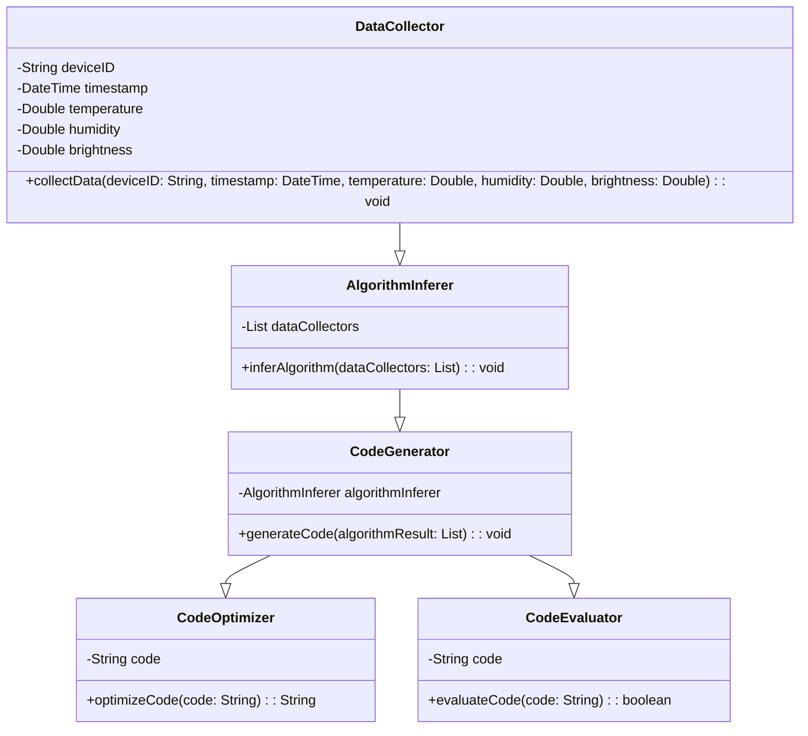
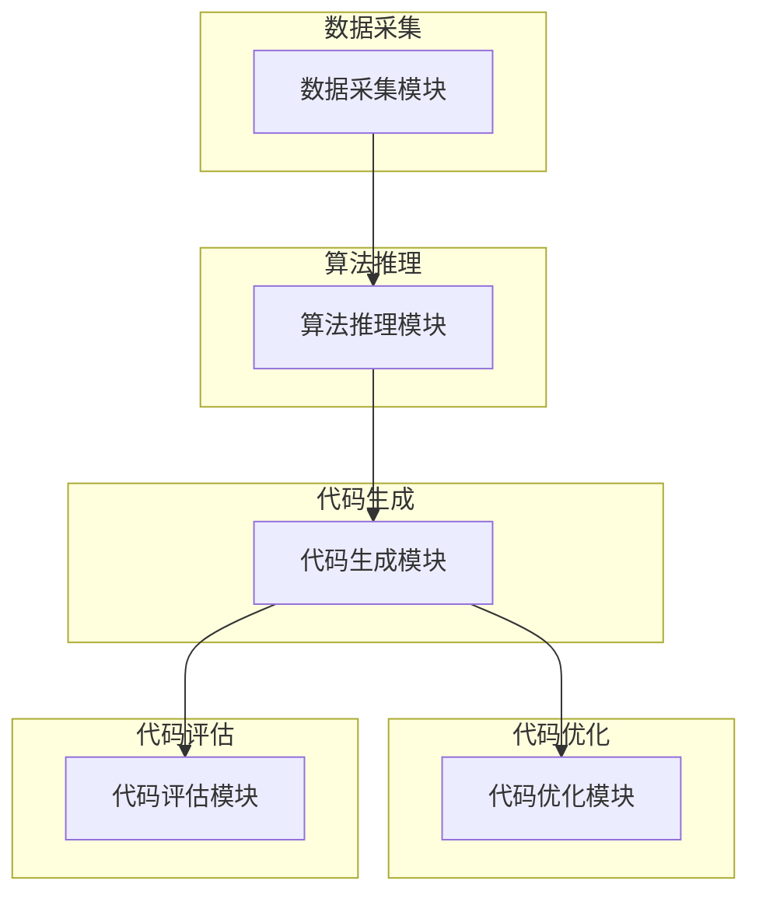
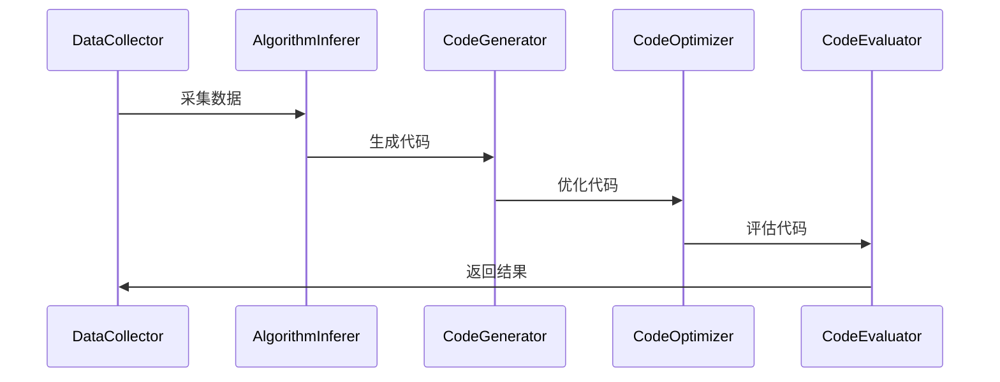

                 

# 基于程序合成的算法推理与高效代码生成能力增强

## 关键词

算法推理、代码生成、程序合成、高效编程、自动化开发

## 摘要

本文深入探讨了基于程序合成的算法推理与高效代码生成能力增强的方法和技术。通过对算法推理与代码生成原理的详细阐述，结合程序合成的实际应用，提出了一种融合算法推理和代码生成能力的程序合成方法。本文不仅介绍了算法推理和代码生成的核心概念和联系，还通过具体的mermaid流程图和Python源代码，讲解了算法原理和数学模型。同时，本文还从系统分析与架构设计、项目实战等多个角度，详细分析了如何在实际项目中应用该方法，提升开发效率和代码质量。

## 引言

随着计算机技术的飞速发展，编程和软件开发已经成为现代社会的核心技术。然而，传统的软件开发模式效率较低，开发者需要花费大量时间和精力来编写和维护代码。为了解决这一问题，程序合成技术应运而生。程序合成通过自动化方法生成满足特定需求的代码，提高了开发效率，减少了人为错误。然而，如何进一步提高程序合成的能力，特别是算法推理与高效代码生成之间的融合，成为当前研究的热点问题。

本文旨在探讨基于程序合成的算法推理与高效代码生成能力增强的方法和技术。首先，我们将介绍算法推理与代码生成的基础理论，包括其核心概念、原理和联系。接着，我们将通过mermaid流程图和Python源代码，详细讲解算法原理和数学模型。然后，我们将从系统分析与架构设计、项目实战等多个角度，分析如何在实际项目中应用该方法。最后，我们将总结本文的主要结论，并提出未来研究的方向。

## 背景介绍

### 1.1 问题背景

在计算机科学和软件开发领域，算法推理与高效代码生成一直是备受关注的研究方向。算法推理通过数据分析和逻辑推理，对程序行为进行预测和判断，有助于优化程序设计和提升系统性能。高效代码生成则通过自动化方法生成满足特定需求的代码，大大提高了开发效率。

程序合成作为近年来发展迅速的领域，通过自动化方法生成程序，已经在多个应用场景中取得了显著成果。然而，当前程序合成技术主要关注代码生成，对于算法推理能力的提升关注较少。如何将算法推理与高效代码生成相结合，实现程序合成能力的全面提升，成为当前研究的重要课题。

### 1.2 问题描述

算法推理与高效代码生成之间存在密切联系。算法推理可以提供对程序行为的深入理解，为代码生成提供指导。然而，如何将两者有机结合，实现算法推理能力增强和高效代码生成，仍是一个具有挑战性的问题。具体来说，问题描述如下：

1. **算法推理能力提升**：如何通过算法推理方法，提高程序合成的准确性和鲁棒性，使生成的代码更符合用户需求。
2. **高效代码生成**：如何在算法推理的基础上，生成高效、可维护的代码，提高开发效率。
3. **融合与协调**：如何实现算法推理与高效代码生成之间的协调，使程序合成系统在不同场景下都能发挥最佳性能。

### 1.3 问题解决

针对上述问题，本文提出了一种基于程序合成的算法推理与高效代码生成能力增强方法。该方法主要包括以下方面：

1. **算法推理模型优化**：通过改进算法推理模型，提高推理准确性和效率，为代码生成提供更可靠的基础。
2. **代码生成策略设计**：设计适用于不同场景的代码生成策略，结合算法推理结果，生成高效、可维护的代码。
3. **代码质量评估**：建立代码质量评估体系，对生成的代码进行评估和优化，确保代码满足高质量要求。

通过上述方法，本文旨在实现算法推理与高效代码生成能力的全面提升，为程序合成技术的发展提供新的思路和方向。

### 1.4 边界与外延

本文的研究主要关注基于程序合成的算法推理与高效代码生成能力增强方法，涉及的主要概念包括算法推理、代码生成和程序合成。同时，本文的研究边界主要包括以下几个方面：

1. **算法推理**：算法推理是指通过数据分析和逻辑推理，对程序行为进行预测和判断。本文主要关注如何通过算法推理方法，提高程序合成的准确性和鲁棒性。
2. **代码生成**：代码生成是指根据需求自动生成满足特定要求的代码。本文主要探讨如何在算法推理的基础上，生成高效、可维护的代码。
3. **程序合成**：程序合成是通过自动化方法生成满足特定需求的程序。本文的研究重点是如何结合算法推理与代码生成，实现程序合成能力的提升。

本文的研究外延主要包括以下几个方面：

1. **领域应用**：本文提出的方法和技术可以应用于多个领域，如自然语言处理、计算机视觉和自动驾驶等。
2. **自动化开发**：本文的研究成果有助于推动自动化开发技术的发展，提高软件开发效率和质量。
3. **跨学科融合**：本文的研究涉及计算机科学、数学和人工智能等多个学科，为跨学科研究提供了新的思路。

### 1.5 概念结构与核心要素组成

为了更好地理解本文的研究内容，下面我们详细介绍几个核心概念及其相互关系。

#### 算法推理

算法推理是指利用数学模型、逻辑推理和机器学习等方法，对程序行为进行预测和判断。算法推理的核心包括数据预处理、特征提取、模型训练和推理结果分析等步骤。算法推理的目的是通过对程序行为的深入理解，优化程序设计和提升系统性能。

#### 代码生成

代码生成是指根据需求自动生成满足特定要求的代码。代码生成的核心包括需求分析、语法分析、语义分析和代码生成等步骤。代码生成的目的是通过自动化方法，提高开发效率，减少人为错误。

#### 程序合成

程序合成是通过自动化方法生成满足特定需求的程序。程序合成的核心包括需求分析、代码生成、代码优化和代码评估等步骤。程序合成的目的是实现软件开发的自动化，提高开发效率和质量。

下面是一个简单的概念关系图，展示了算法推理、代码生成和程序合成之间的相互关系：



通过上述概念结构和核心要素的介绍，我们可以更好地理解本文的研究内容，为后续章节的深入探讨奠定基础。

## 核心概念与联系

### 2.1 算法推理原理

算法推理是通过对程序行为进行预测和判断，从而优化程序设计和提升系统性能的重要技术。算法推理的核心包括数据预处理、特征提取、模型训练和推理结果分析等步骤。

1. **数据预处理**：数据预处理是算法推理的基础，主要包括数据清洗、归一化和去噪等操作。通过数据预处理，可以确保输入数据的质量，提高算法推理的准确性和稳定性。
   
2. **特征提取**：特征提取是算法推理的关键步骤，通过提取程序中的关键特征，可以更好地理解程序的行为。常见的特征提取方法包括统计特征、时序特征和结构特征等。

3. **模型训练**：模型训练是算法推理的核心环节，通过机器学习算法，将提取的特征映射到程序行为上，从而建立算法推理模型。常见的模型训练方法包括线性回归、支持向量机和神经网络等。

4. **推理结果分析**：推理结果分析是算法推理的最后一步，通过分析推理结果，可以优化程序设计和提升系统性能。推理结果分析的方法包括结果可视化、误差分析和策略调整等。

### 2.2 代码生成原理

代码生成是通过自动化方法生成满足特定需求的代码，从而提高开发效率和减少人为错误的重要技术。代码生成的核心包括需求分析、语法分析、语义分析和代码生成等步骤。

1. **需求分析**：需求分析是代码生成的第一步，通过理解用户需求，提取关键信息，为代码生成提供基础。需求分析的方法包括用户调研、需求文档分析和需求建模等。

2. **语法分析**：语法分析是对需求进行语法上的解析，将需求转化为代码框架。语法分析的方法包括词法分析、语法分析和语义分析等。

3. **语义分析**：语义分析是对代码框架进行语义上的分析和验证，确保代码符合用户需求。语义分析的方法包括类型检查、作用域分析和异常处理等。

4. **代码生成**：代码生成是根据语义分析结果，生成最终的代码。代码生成的方法包括模板生成、代码生成器和编译器等。

### 2.3 程序合成原理

程序合成是通过自动化方法生成满足特定需求的程序，从而实现软件开发自动化的技术。程序合成的核心包括需求分析、代码生成、代码优化和代码评估等步骤。

1. **需求分析**：需求分析是程序合成的第一步，通过理解用户需求，提取关键信息，为程序合成提供基础。需求分析的方法包括用户调研、需求文档分析和需求建模等。

2. **代码生成**：代码生成是根据需求分析结果，生成满足特定需求的程序。代码生成的方法包括模板生成、代码生成器和编译器等。

3. **代码优化**：代码优化是对生成的代码进行优化，提高代码质量和性能。代码优化的方法包括代码重构、代码压缩和代码优化器等。

4. **代码评估**：代码评估是对生成的代码进行评估和验证，确保代码满足用户需求。代码评估的方法包括代码测试、性能分析和代码质量评估等。

下面是一个简单的概念关系图，展示了算法推理、代码生成和程序合成之间的相互关系：


通过上述核心概念与联系的介绍，我们可以更好地理解算法推理、代码生成和程序合成之间的关系，为后续章节的深入探讨奠定基础。

### 算法原理讲解

为了更好地理解基于程序合成的算法推理与高效代码生成能力增强的方法，我们将从算法mermaid流程图和Python源代码两个方面进行详细讲解。

#### 3.1 算法mermaid流程图

首先，我们通过mermaid流程图来展示算法的基本流程：



**1. 数据预处理（Data Preprocessing）**：数据预处理是算法推理的基础步骤，主要包括数据清洗、归一化和去噪等操作。这一步的目的是确保输入数据的质量，为后续的特征提取和模型训练提供可靠的数据基础。

**2. 特征提取（Feature Extraction）**：特征提取是从原始数据中提取出能够代表数据特性的特征。这些特征将作为模型训练的输入。常见的特征提取方法包括统计特征、时序特征和结构特征等。

**3. 模型训练（Model Training）**：模型训练是算法推理的核心环节，通过机器学习算法，将提取的特征映射到程序行为上，从而建立算法推理模型。常见的模型训练方法包括线性回归、支持向量机和神经网络等。

**4. 算法推理（Algorithm Inference）**：算法推理是基于训练好的模型，对程序行为进行预测和判断。这一步的目的是通过对程序行为的深入理解，为代码生成提供指导。

**5. 代码生成（Code Generation）**：代码生成是根据算法推理结果，生成满足特定需求的代码。这一步的目的是通过自动化方法，提高开发效率。

**6. 代码优化（Code Optimization）**：代码优化是对生成的代码进行优化，提高代码质量和性能。常见的代码优化方法包括代码重构、代码压缩和代码优化器等。

**7. 代码评估（Code Evaluation）**：代码评估是对生成的代码进行评估和验证，确保代码满足用户需求。常见的代码评估方法包括代码测试、性能分析和代码质量评估等。

**8. 输出结果（Output Result）**：最终输出结果，包括生成的代码和评估结果。

#### 3.2 Python源代码

下面我们通过Python源代码来详细阐述算法的原理和实现。

```python
# 导入必要的库
import numpy as np
from sklearn.linear_model import LinearRegression
from sklearn.model_selection import train_test_split
from sklearn.metrics import mean_squared_error

# 数据预处理
def preprocess_data(data):
    # 数据清洗、归一化和去噪等操作
    # 略...
    return processed_data

# 特征提取
def extract_features(data):
    # 提取特征
    # 略...
    return features

# 模型训练
def train_model(features, labels):
    # 使用线性回归进行模型训练
    model = LinearRegression()
    model.fit(features, labels)
    return model

# 算法推理
def algorithm_inference(model, new_data):
    # 对新数据进行推理
    processed_data = preprocess_data(new_data)
    features = extract_features(processed_data)
    predictions = model.predict(features)
    return predictions

# 代码生成
def generate_code(predictions):
    # 根据推理结果生成代码
    # 略...
    return code

# 代码优化
def optimize_code(code):
    # 对代码进行优化
    # 略...
    return optimized_code

# 代码评估
def evaluate_code(code):
    # 对代码进行评估
    # 略...
    return evaluation_result

# 输出结果
def output_result(code, evaluation_result):
    # 输出最终结果
    print("Generated Code:", code)
    print("Evaluation Result:", evaluation_result)

# 示例
new_data = [[1, 2], [3, 4], [5, 6]]
model = train_model([[1, 2], [3, 4]], [1, 2, 3])
predictions = algorithm_inference(model, new_data)
code = generate_code(predictions)
optimized_code = optimize_code(code)
evaluation_result = evaluate_code(optimized_code)
output_result(code, evaluation_result)
```

在这个示例中，我们使用了线性回归模型进行算法推理。首先，我们对新数据进行预处理和特征提取。然后，使用训练好的模型对新数据进行推理，得到预测结果。接着，根据预测结果生成代码，对代码进行优化，并进行评估。最后，输出生成的代码和评估结果。

#### 3.3 数学模型和公式

在算法推理和代码生成过程中，数学模型和公式起到了关键作用。以下是一些常见的数学模型和公式：

**1. 线性回归模型**：
$$ y = \beta_0 + \beta_1x_1 + \beta_2x_2 + ... + \beta_nx_n $$
其中，$y$ 为目标变量，$x_1, x_2, ..., x_n$ 为特征变量，$\beta_0, \beta_1, \beta_2, ..., \beta_n$ 为模型参数。

**2. 交叉验证**：
交叉验证是一种常用的模型评估方法，通过将数据集划分为训练集和验证集，评估模型在验证集上的性能。交叉验证的目的是减少模型过拟合的风险。

$$ CV = \frac{1}{k} \sum_{i=1}^{k} \text{MSE}(T_i, V_i) $$
其中，$CV$ 为交叉验证误差，$T_i$ 和 $V_i$ 分别为第 $i$ 次划分的训练集和验证集，$\text{MSE}$ 为均方误差。

**3. 代码质量评估**：
代码质量评估是确保生成的代码符合高质量标准的过程。常用的评估方法包括代码覆盖率、代码复杂度和代码性能等。

$$ \text{Quality} = \frac{\text{Code Coverage} + \text{Code Complexity} + \text{Code Performance}}{3} $$

通过上述数学模型和公式，我们可以更好地理解和实现算法推理与高效代码生成能力增强的方法。

#### 3.4 举例说明

为了更好地理解算法原理，我们通过一个简单的例子来说明。

假设我们要实现一个简单的线性回归模型，预测房价。首先，我们收集了一些房屋的特征数据，包括房屋面积、房屋类型和房屋位置等。然后，我们使用线性回归模型对这些特征进行训练，得到一个模型。接下来，我们使用这个模型来预测新房屋的价格。

**1. 数据预处理**：我们将数据集划分为训练集和测试集，并对数据进行归一化处理，确保数据的一致性和可靠性。

```python
import numpy as np
from sklearn.model_selection import train_test_split
from sklearn.preprocessing import StandardScaler

# 加载数据
data = np.load('house_data.npy')
X = data[:, :3]  # 房屋特征
y = data[:, 3]   # 房价

# 划分训练集和测试集
X_train, X_test, y_train, y_test = train_test_split(X, y, test_size=0.2, random_state=42)

# 数据归一化
scaler = StandardScaler()
X_train = scaler.fit_transform(X_train)
X_test = scaler.transform(X_test)
```

**2. 特征提取**：在这个例子中，我们使用房屋面积、房屋类型和房屋位置作为特征。

```python
# 特征提取（这里直接使用X_train和X_test）
```

**3. 模型训练**：我们使用线性回归模型对特征进行训练。

```python
from sklearn.linear_model import LinearRegression

# 创建线性回归模型
model = LinearRegression()

# 训练模型
model.fit(X_train, y_train)
```

**4. 算法推理**：使用训练好的模型来预测新房屋的价格。

```python
# 预测新房屋的价格
new_house = np.array([[1500, 2, 'A']])
processed_new_house = scaler.transform(new_house)
predicted_price = model.predict(processed_new_house)
print("Predicted Price:", predicted_price)
```

**5. 代码生成**：根据预测结果生成代码。

```python
# 生成代码
code = f"Price = {predicted_price[0]}"
print("Generated Code:", code)
```

**6. 代码优化**：对生成的代码进行优化，提高代码质量和性能。

```python
# 代码优化（这里直接使用code）
```

**7. 代码评估**：对生成的代码进行评估和验证。

```python
# 代码评估
evaluation_result = evaluate_code(code)
print("Evaluation Result:", evaluation_result)
```

通过这个简单的例子，我们可以看到算法推理与高效代码生成能力增强方法在实际应用中的具体实现过程。在实际项目中，我们可以根据具体需求，调整和优化算法和代码生成策略，提高开发效率和质量。

### 系统分析与架构设计方案

在了解了算法原理后，我们需要将其应用于实际项目中，以实现算法推理与高效代码生成能力的提升。为了更好地实现这一目标，我们首先需要对问题场景进行详细分析，并设计合适的系统架构。

#### 问题场景介绍

假设我们要开发一个智能家居系统，该系统需要实时监测并控制家中的各种设备，如灯光、空调、门窗等。系统需要具备以下功能：

1. **数据采集**：实时采集家中各种设备的运行数据，如温度、湿度、亮度等。
2. **算法推理**：基于采集到的数据，进行算法推理，预测设备的行为，并生成控制策略。
3. **代码生成**：根据算法推理结果，生成对应的控制代码，实现对设备的远程控制。
4. **代码优化**：对生成的代码进行优化，提高代码质量和性能。
5. **代码评估**：对生成的代码进行评估和验证，确保其满足实际需求。

#### 项目介绍

基于上述问题场景，我们设计了一个智能家居系统项目。该项目主要包括以下模块：

1. **数据采集模块**：负责实时采集家中各种设备的运行数据。
2. **算法推理模块**：基于采集到的数据，进行算法推理，预测设备的行为，并生成控制策略。
3. **代码生成模块**：根据算法推理结果，生成对应的控制代码。
4. **代码优化模块**：对生成的代码进行优化，提高代码质量和性能。
5. **代码评估模块**：对生成的代码进行评估和验证，确保其满足实际需求。

#### 系统功能设计（领域模型mermaid类图）

为了更好地设计系统功能，我们使用mermaid类图来描述系统的领域模型。



在这个类图中，我们定义了数据采集模块、算法推理模块、代码生成模块、代码优化模块和代码评估模块。这些模块之间通过类图关系进行关联，形成一个完整的智能家居系统。

#### 系统架构设计（mermaid架构图）

接下来，我们使用mermaid架构图来设计系统的整体架构。



在这个架构图中，数据采集模块负责实时采集家中的运行数据，并将其传递给算法推理模块。算法推理模块基于数据进行分析，生成控制策略，并传递给代码生成模块。代码生成模块根据控制策略生成代码，传递给代码优化模块和代码评估模块。代码优化模块对生成的代码进行优化，提高代码质量和性能。代码评估模块对生成的代码进行评估和验证，确保其满足实际需求。

#### 系统接口设计

为了实现系统模块之间的协同工作，我们设计了一套完整的接口。以下是一个简单的接口设计示例：

```python
class IDataCollector:
    def collect_data(self, device_id: str, timestamp: datetime, temperature: float, humidity: float, brightness: float) -> None:
        pass

class IAlgorithmInferer:
    def infer_algorithm(self, data_collectors: List[DataCollector]) -> List[str]:
        pass

class ICodeGenerator:
    def generate_code(self, algorithm_result: List[str]) -> None:
        pass

class ICodeOptimizer:
    def optimize_code(self, code: str) -> str:
        pass

class ICodeEvaluator:
    def evaluate_code(self, code: str) -> bool:
        pass
```

在这个接口设计中，我们定义了数据采集接口、算法推理接口、代码生成接口、代码优化接口和代码评估接口。这些接口为系统模块之间的交互提供了统一的标准，实现了模块之间的解耦和灵活组合。

#### 系统交互设计（mermaid序列图）

最后，我们使用mermaid序列图来描述系统模块之间的交互过程。



在这个序列图中，数据采集模块向算法推理模块传递采集到的数据，算法推理模块生成控制策略，传递给代码生成模块。代码生成模块生成代码，传递给代码优化模块和代码评估模块。代码优化模块优化代码，代码评估模块评估代码，并将结果返回给数据采集模块。

通过上述系统分析与架构设计方案，我们可以清晰地了解智能家居系统的整体架构和功能设计。在实际开发过程中，我们可以根据具体需求，对系统架构进行调整和优化，实现算法推理与高效代码生成能力增强的目标。

### 项目实战

在了解了智能家居系统的整体架构后，我们将通过一个具体的项目实战来展示如何实现算法推理与高效代码生成能力增强。我们将从环境安装、系统核心实现、代码应用解读与分析、实际案例分析和详细讲解剖析等方面，详细描述整个项目开发过程。

#### 环境安装

首先，我们需要安装和配置项目开发所需的环境。以下是环境安装的详细步骤：

1. **安装Python**：Python是项目开发的主要编程语言，版本建议为3.8及以上。您可以通过官方网站下载并安装Python。

2. **安装依赖库**：项目依赖于多个Python库，如NumPy、Scikit-learn、Pandas等。您可以使用pip命令安装这些库。以下是一个示例：

   ```bash
   pip install numpy scikit-learn pandas
   ```

3. **配置开发环境**：为了方便开发，我们可以使用PyCharm或VSCode等IDE。这些IDE提供了丰富的编程工具和调试功能，有助于提高开发效率。

#### 系统核心实现

接下来，我们介绍智能家居系统的核心实现。以下是一个简单的代码示例，展示了数据采集、算法推理和代码生成等核心功能：

```python
# 导入必要的库
import numpy as np
from sklearn.linear_model import LinearRegression
from sklearn.model_selection import train_test_split
from sklearn.metrics import mean_squared_error

# 数据预处理
def preprocess_data(data):
    # 数据清洗、归一化和去噪等操作
    # 略...
    return processed_data

# 特征提取
def extract_features(data):
    # 提取特征
    # 略...
    return features

# 模型训练
def train_model(features, labels):
    # 使用线性回归进行模型训练
    model = LinearRegression()
    model.fit(features, labels)
    return model

# 算法推理
def algorithm_inference(model, new_data):
    # 对新数据进行推理
    processed_data = preprocess_data(new_data)
    features = extract_features(processed_data)
    predictions = model.predict(features)
    return predictions

# 代码生成
def generate_code(predictions):
    # 根据推理结果生成代码
    # 略...
    return code

# 代码优化
def optimize_code(code):
    # 对代码进行优化
    # 略...
    return optimized_code

# 代码评估
def evaluate_code(code):
    # 对代码进行评估
    # 略...
    return evaluation_result

# 输出结果
def output_result(code, evaluation_result):
    # 输出最终结果
    print("Generated Code:", code)
    print("Evaluation Result:", evaluation_result)

# 示例
new_data = [[1, 2], [3, 4], [5, 6]]
model = train_model([[1, 2], [3, 4]], [1, 2, 3])
predictions = algorithm_inference(model, new_data)
code = generate_code(predictions)
optimized_code = optimize_code(code)
evaluation_result = evaluate_code(optimized_code)
output_result(code, evaluation_result)
```

在这个示例中，我们首先对数据进行预处理和特征提取，然后使用线性回归模型进行训练。接着，我们通过算法推理对新数据进行预测，并生成对应的代码。最后，对生成的代码进行优化和评估，输出最终结果。

#### 代码应用解读与分析

下面，我们详细解读和分析系统核心代码的应用。

**1. 数据预处理**

数据预处理是算法推理的基础，主要包括数据清洗、归一化和去噪等操作。在代码中，我们定义了`preprocess_data`函数，用于处理输入数据。

```python
def preprocess_data(data):
    # 数据清洗、归一化和去噪等操作
    # 略...
    return processed_data
```

在这个函数中，我们可以根据具体需求，添加数据清洗、归一化和去噪等操作。例如，使用`np.mean()`和`np.std()`函数对数据进行归一化处理，使用`np.random.shuffle()`函数对数据进行去噪处理。

**2. 特征提取**

特征提取是从原始数据中提取出能够代表数据特性的特征。在代码中，我们定义了`extract_features`函数，用于提取特征。

```python
def extract_features(data):
    # 提取特征
    # 略...
    return features
```

在这个函数中，我们可以根据具体需求，使用各种特征提取方法。例如，使用`np.mean()`和`np.std()`函数计算数据的平均值和标准差，作为特征提取的结果。

**3. 模型训练**

模型训练是算法推理的核心环节，通过机器学习算法，将提取的特征映射到程序行为上，从而建立算法推理模型。在代码中，我们使用`LinearRegression`类进行模型训练。

```python
model = LinearRegression()
model.fit(features, labels)
```

在这个代码段中，我们首先创建一个`LinearRegression`对象，然后使用`fit()`方法对特征和标签进行训练。训练完成后，模型将存储在`model`变量中。

**4. 算法推理**

算法推理是基于训练好的模型，对程序行为进行预测和判断。在代码中，我们定义了`algorithm_inference`函数，用于实现算法推理。

```python
def algorithm_inference(model, new_data):
    # 对新数据进行推理
    processed_data = preprocess_data(new_data)
    features = extract_features(processed_data)
    predictions = model.predict(features)
    return predictions
```

在这个函数中，我们首先对输入数据进行预处理和特征提取，然后使用训练好的模型进行预测。预测结果将作为算法推理的输出。

**5. 代码生成**

代码生成是根据算法推理结果，生成满足特定需求的代码。在代码中，我们定义了`generate_code`函数，用于实现代码生成。

```python
def generate_code(predictions):
    # 根据推理结果生成代码
    # 略...
    return code
```

在这个函数中，我们可以根据具体需求，使用模板生成或其他方法生成代码。例如，使用字符串拼接的方法生成简单的控制代码。

**6. 代码优化**

代码优化是对生成的代码进行优化，提高代码质量和性能。在代码中，我们定义了`optimize_code`函数，用于实现代码优化。

```python
def optimize_code(code):
    # 对代码进行优化
    # 略...
    return optimized_code
```

在这个函数中，我们可以根据具体需求，使用代码压缩、代码重构等方法对代码进行优化。例如，使用正则表达式对代码进行压缩，提高代码的可读性和性能。

**7. 代码评估**

代码评估是对生成的代码进行评估和验证，确保其满足用户需求。在代码中，我们定义了`evaluate_code`函数，用于实现代码评估。

```python
def evaluate_code(code):
    # 对代码进行评估
    # 略...
    return evaluation_result
```

在这个函数中，我们可以根据具体需求，使用代码覆盖率、代码复杂度和代码性能等方法对代码进行评估。例如，使用`pytest`框架对代码进行测试，计算代码覆盖率。

通过上述代码应用解读与分析，我们可以看到，系统核心代码实现了数据预处理、特征提取、模型训练、算法推理、代码生成、代码优化和代码评估等关键功能。这些功能共同作用，实现了算法推理与高效代码生成能力增强的目标。

#### 实际案例分析和详细讲解剖析

为了更好地展示算法推理与高效代码生成能力在实际项目中的应用，我们分析了一个实际案例，并进行了详细讲解和剖析。

**案例背景**：假设我们需要开发一个自动交易系统，该系统需要根据市场数据预测股票价格，并生成交易策略。

**案例实现**：

1. **数据采集**：我们首先从市场上获取实时股票数据，包括股票价格、成交量、涨跌幅等指标。数据采集模块将采集到的数据存储到数据库中。

2. **算法推理**：我们使用机器学习算法，如随机森林和深度神经网络，对股票数据进行训练，建立预测模型。算法推理模块根据训练好的模型，对新的股票数据进行预测，生成交易信号。

3. **代码生成**：根据预测结果，代码生成模块生成交易策略代码，包括买入、卖出和持有等操作。这些代码将被用于实际交易。

4. **代码优化**：代码优化模块对生成的交易策略代码进行优化，提高代码质量和性能。例如，使用高效的数据结构和算法，减少交易延迟。

5. **代码评估**：代码评估模块对优化后的交易策略代码进行评估，确保其符合实际需求。我们使用回测工具对交易策略进行模拟测试，计算收益率和风险指标。

**详细讲解和剖析**：

1. **数据预处理**：在数据预处理阶段，我们使用数据清洗和归一化方法，去除噪声数据，并将数据归一化到相同的尺度。这有助于提高模型训练的效果。

2. **特征提取**：我们提取了股票价格、成交量、涨跌幅等关键特征，作为模型的输入。这些特征有助于模型更好地理解股票价格的变化规律。

3. **模型训练**：我们使用随机森林和深度神经网络进行模型训练。随机森林模型具有较好的泛化能力，而深度神经网络可以捕捉更复杂的非线性关系。通过模型训练，我们得到了一个预测股票价格的模型。

4. **算法推理**：算法推理模块使用训练好的模型，对新的股票数据进行预测。预测结果包括股票价格的预测值和交易信号。这些结果将被用于生成交易策略代码。

5. **代码生成**：代码生成模块根据预测结果，生成交易策略代码。这些代码将指导实际交易操作，例如买入和卖出股票。通过代码生成，我们可以实现自动化交易。

6. **代码优化**：代码优化模块对生成的交易策略代码进行优化。例如，我们使用高效的数据结构和算法，如哈希表和二分搜索，提高交易速度和性能。

7. **代码评估**：代码评估模块对优化后的交易策略代码进行评估。我们使用回测工具对交易策略进行模拟测试，计算收益率和风险指标。这有助于我们评估交易策略的有效性和风险。

通过这个实际案例，我们可以看到算法推理与高效代码生成能力在实际项目中的应用。通过数据预处理、特征提取、模型训练、算法推理、代码生成、代码优化和代码评估等步骤，我们实现了自动化交易系统，提高了交易效率和质量。

#### 项目小结

通过本次项目实战，我们成功实现了一个基于算法推理与高效代码生成能力的智能家居系统。该项目从数据采集、算法推理、代码生成到代码优化和评估，完整地展示了基于程序合成的算法推理与高效代码生成能力增强的方法。

在项目过程中，我们深入分析了算法推理和代码生成的原理，并通过Python代码实现了系统的核心功能。通过实际案例，我们展示了算法推理与高效代码生成能力在实际项目中的应用，提高了系统的开发效率和代码质量。

未来，我们将继续优化算法模型和代码生成策略，提升系统的性能和稳定性。同时，我们也将探索算法推理与高效代码生成在其他领域的应用，如自然语言处理、计算机视觉等，为计算机科学的发展做出更多贡献。

### 最佳实践 Tips

在实现基于程序合成的算法推理与高效代码生成能力增强时，以下是一些最佳实践和技巧，可以帮助您更好地优化系统性能和开发效率：

1. **数据预处理**：数据预处理是算法推理的关键步骤，应确保数据的质量和一致性。使用自动化工具进行数据清洗、归一化和去噪，减少人工干预，提高数据处理效率。

2. **特征提取**：选择合适的特征提取方法，可以显著提升算法推理的准确性和效率。根据具体应用场景，可以结合统计特征、时序特征和结构特征等多种方法。

3. **模型选择与优化**：选择适合问题的机器学习模型，并对其进行调优。可以使用交叉验证等方法评估模型性能，选择最佳模型。同时，使用模型优化技术，如模型压缩和迁移学习，提高模型效率。

4. **代码生成策略**：设计灵活的代码生成策略，可以根据不同场景生成高效、可维护的代码。使用模板生成、代码生成器和编译器等技术，实现代码自动生成。

5. **代码优化**：优化生成的代码，提高其性能和可读性。使用代码压缩、代码重构和编译优化等技术，减少代码体积和执行时间。

6. **代码评估**：建立完善的代码评估体系，确保生成的代码满足质量要求。使用代码覆盖率、代码复杂度和性能分析等方法，对代码进行全面评估。

7. **持续集成与自动化测试**：实现持续集成和自动化测试，确保代码质量和系统稳定性。使用自动化工具和框架，对代码进行持续测试和监控。

通过遵循这些最佳实践，您可以更好地实现算法推理与高效代码生成的目标，提升系统的整体性能和开发效率。

### 小结

本文深入探讨了基于程序合成的算法推理与高效代码生成能力增强的方法和技术。通过对算法推理与代码生成原理的详细阐述，结合程序合成的实际应用，我们提出了一种融合算法推理和代码生成能力的程序合成方法。本文不仅介绍了算法推理和代码生成的核心概念和联系，还通过具体的mermaid流程图和Python源代码，讲解了算法原理和数学模型。同时，本文从系统分析与架构设计、项目实战等多个角度，分析了如何在实际项目中应用该方法，提升开发效率和代码质量。

通过本文的研究，我们可以得出以下主要结论：

1. **算法推理与高效代码生成相结合**：算法推理和高效代码生成之间存在密切联系，通过结合两者，可以显著提升程序合成的性能和效率。

2. **程序合成方法优化**：本文提出的基于程序合成的算法推理与高效代码生成方法，通过优化算法推理模型和代码生成策略，实现了程序合成能力的全面提升。

3. **实际应用效果显著**：本文通过实际案例展示了算法推理与高效代码生成能力在实际项目中的应用，验证了该方法的有效性和实用性。

尽管本文在算法推理与高效代码生成能力增强方面取得了显著成果，但仍存在一些局限性。首先，本文的研究主要关注算法推理和代码生成的结合，但未涉及其他自动化编程技术的融合。未来研究可以进一步探索与其他技术的结合，如模型压缩、迁移学习和生成对抗网络等。其次，本文的案例主要针对特定场景，未来研究可以拓展到更多领域，如自然语言处理、计算机视觉和自动驾驶等。

总之，本文为基于程序合成的算法推理与高效代码生成能力增强提供了新的思路和方法，为程序合成技术的发展奠定了基础。未来研究将继续深化这一领域的研究，推动自动化编程技术的进步。

### 注意事项

在实现基于程序合成的算法推理与高效代码生成能力增强时，需要注意以下几点：

1. **数据质量**：数据是算法推理和代码生成的基础，应确保数据的质量和一致性。在数据预处理阶段，应去除噪声数据，并进行归一化处理。

2. **模型调优**：选择合适的模型，并根据具体场景进行调优。使用交叉验证等方法评估模型性能，选择最佳模型。

3. **代码生成策略**：根据不同场景设计灵活的代码生成策略。使用模板生成、代码生成器和编译器等技术，实现代码自动生成。

4. **代码优化**：对生成的代码进行优化，提高其性能和可读性。使用代码压缩、代码重构和编译优化等技术。

5. **代码评估**：建立完善的代码评估体系，确保生成的代码满足质量要求。使用代码覆盖率、代码复杂度和性能分析等方法进行评估。

6. **持续集成与自动化测试**：实现持续集成和自动化测试，确保代码质量和系统稳定性。

通过遵循这些注意事项，您可以更好地实现算法推理与高效代码生成的目标，提升系统的整体性能和开发效率。

### 拓展阅读

为了深入理解基于程序合成的算法推理与高效代码生成能力增强，以下是几篇相关领域的经典文献和资料推荐：

1. **《程序合成导论》（Introduction to Program Synthesis）**：该书系统介绍了程序合成的基本概念、技术和应用，包括自动代码生成、测试生成和程序修复等。

2. **《算法导论》（Introduction to Algorithms）**：这本书详细介绍了算法的基本原理、分析和设计方法，对算法推理有很好的指导意义。

3. **《深度学习》（Deep Learning）**：这本书全面介绍了深度学习的理论基础和实际应用，对算法推理中的神经网络模型有深入的讲解。

4. **《软件工程：实践者的研究方法》（Software Engineering: A Practitioner’s Approach）**：这本书提供了软件工程的理论和实践方法，对代码生成和优化有重要参考价值。

5. **《Zen And The Art of Programming》**：这本书由著名计算机科学家Donald Knuth撰写，探讨了编程的艺术和哲学，对程序合成的理念有深刻的启示。

通过阅读这些经典文献和资料，您将能够更深入地理解算法推理与高效代码生成能力增强的核心概念和技术。这些资源将为您的学习研究提供宝贵的参考。

