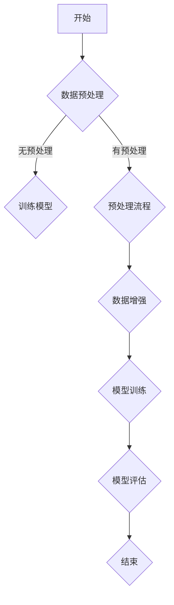

                 

### 《基于程序合成的语言模型推理能力增强》

#### 关键词：程序合成、语言模型、推理能力、人工智能

> 摘要：本文深入探讨了程序合成与语言模型在推理能力提升方面的结合。通过分析两者的发展背景、核心概念和理论基础，本文提出了基于程序合成的语言模型推理能力增强的方法，并详细阐述了算法原理、实现与优化策略。同时，文章通过案例分析展示了该方法在现实应用中的效果，并对其面临的挑战与未来趋势进行了展望。

### 《基于程序合成的语言模型推理能力增强》目录大纲

----------------------------------------------------------------

# 第一部分: 背景与概述

## 第1章: 语言模型与程序合成概述

### 1.1 语言模型的发展背景

#### 1.1.1 自然语言处理的发展历程

自然语言处理（NLP）作为人工智能领域的一个重要分支，其历史可以追溯到20世纪50年代。最初，研究者们试图通过编写规则的方式来实现自然语言的理解和生成。随着计算机性能的提升和算法的改进，NLP逐渐发展壮大。

#### 1.1.2 语言模型的演变过程

语言模型经历了从规则驱动到统计模型，再到现代深度学习模型的演变。早期的语言模型如n元语法模型，主要依赖统计方法进行语言建模。随着神经网络的发展，深度学习模型如循环神经网络（RNN）和Transformer等开始广泛应用于语言模型。

#### 1.1.3 语言模型在人工智能中的应用

语言模型在人工智能领域有着广泛的应用，如机器翻译、语音识别、文本生成、问答系统等。其核心在于对自然语言的理解和生成能力。

### 1.2 程序合成的概念与原理

#### 1.2.1 程序合成的定义

程序合成是指通过自动化方法生成计算机程序的过程。这个过程通常涉及到代码生成、测试、优化等多个环节。

#### 1.2.2 程序合成的技术基础

程序合成依赖于多种技术，包括自动编程、代码生成、形式验证等。这些技术共同构成了程序合成的技术基础。

#### 1.2.3 程序合成在语言模型中的应用

程序合成可以用于语言模型中的代码生成，从而提升模型的推理能力。例如，通过程序合成生成特定领域的代码库，可以增强语言模型在特定任务上的表现。

### 1.3 推理能力增强的重要性

#### 1.3.1 语言模型的推理挑战

尽管现代语言模型在许多任务上表现出色，但其在推理能力上仍然存在挑战。例如，对于复杂逻辑和抽象概念的推理，现有模型的表现仍有待提高。

#### 1.3.2 推理能力增强的需求与意义

增强语言模型的推理能力对于实现更智能的人工智能系统具有重要意义。这不仅可以提高模型的实用性，还可以推动人工智能在更广泛领域的应用。

#### 1.3.3 推理能力增强的方法与策略

推理能力增强的方法包括数据增强、知识融合、多模态信息融合等。通过这些方法，可以提升语言模型在推理任务上的表现。

### 1.4 本书结构与内容安排

#### 1.4.1 本书的主要目标

本书的主要目标是探讨程序合成与语言模型在推理能力增强方面的结合，并提出相应的解决方案。

#### 1.4.2 各章节内容的关联与逻辑关系

各章节内容之间相互关联，共同构成了对程序合成与语言模型结合的全面探讨。

#### 1.4.3 阅读建议与学习方法

为了更好地理解本书内容，建议读者首先对自然语言处理和程序合成有一定的了解。在阅读过程中，可以结合实际案例进行思考。

## 1.5 本章小结

本章对语言模型与程序合成进行了概述，分析了其发展背景、核心概念和推理能力增强的重要性。接下来，本书将深入探讨程序合成与语言模型在推理能力增强方面的具体方法与实现。

----------------------------------------------------------------

# 第二部分: 核心概念与理论基础

## 第2章: 语言模型的核心概念与原理

### 2.1 语言模型的基本概念

#### 2.1.1 语言模型的目标

语言模型的主要目标是预测一个词或词组在给定上下文中的概率分布。这一目标使得语言模型在自然语言处理任务中扮演着核心角色。

#### 2.1.2 语言模型的输入与输出

语言模型的输入通常是单词序列或字符序列，输出则是一个概率分布。这种概率分布反映了给定输入序列下每个可能输出的概率。

#### 2.1.3 语言模型的质量评估

评估语言模型的质量主要依赖于几个指标，包括 perplexity（困惑度）、accuracy（准确率）和F1 score（F1得分）等。

### 2.2 语言模型的算法原理

#### 2.2.1 朴素模型

朴素模型是最简单的语言模型，假设单词之间的独立性。尽管这种方法过于简化，但在某些任务中仍然具有实用价值。

#### 2.2.2 基于统计的模型

基于统计的模型如n元语法模型，通过统计单词序列的频率来预测下一个单词。这种方法在文本生成和分类任务中得到了广泛应用。

#### 2.2.3 基于神经网络的模型

基于神经网络的模型如循环神经网络（RNN）和Transformer，通过学习输入序列与输出序列之间的映射关系，实现了更高的预测准确率。

#### 2.2.4 生成对抗网络（GAN）

生成对抗网络（GAN）是一种用于生成数据的新型模型，其核心思想是通过对抗训练生成逼真的数据。在语言模型中，GAN可以用于生成高质量的自然语言文本。

### 2.3 语言模型的应用案例

#### 2.3.1 机器翻译

机器翻译是语言模型最成功的应用之一。通过训练大规模的双语语料库，语言模型可以生成高质量的目标语言翻译。

#### 2.3.2 语音识别

语音识别是将语音信号转换为文本的过程。语言模型在语音识别任务中用于对语音信号进行词法分析，从而提高识别准确率。

#### 2.3.3 文本生成

文本生成是语言模型在自然语言生成领域的应用。通过训练大型文本数据集，语言模型可以生成高质量的文本，包括文章、诗歌等。

#### 2.3.4 其他应用

语言模型在其他领域也有广泛应用，如文本分类、情感分析、信息抽取等。

### 2.4 语言模型与程序合成的关联

#### 2.4.1 程序合成的优势与挑战

程序合成具有自动生成代码、提高开发效率的优势。然而，其挑战在于代码生成的质量和可靠性。

#### 2.4.2 语言模型在程序合成中的作用

语言模型可以用于评估程序合成生成的代码质量，从而提高程序合成的可靠性。

#### 2.4.3 程序合成对语言模型的影响

程序合成可以扩展语言模型的应用范围，使其在代码生成和推理任务中发挥更大作用。

## 2.5 本章小结

本章对语言模型的基本概念、算法原理和应用案例进行了详细分析，并探讨了语言模型与程序合成的关联。这些内容为后续章节的深入研究奠定了基础。

----------------------------------------------------------------

## 第3章: 推理能力与推理增强技术

### 3.1 推理能力的定义与评估

#### 3.1.1 推理能力的含义

推理能力是指从已知信息中推断出新信息的能力。在人工智能领域，推理能力是衡量一个系统是否具有智能的重要指标。

#### 3.1.2 推理能力的评估方法

推理能力的评估方法包括基于事实的推理、基于知识的推理和基于逻辑的推理。这些方法分别通过不同维度来评估推理能力。

#### 3.1.3 推理能力的评价指标

推理能力的评价指标包括推理速度、推理准确率和推理效率等。这些指标共同构成了对推理能力的全面评估。

### 3.2 推理增强技术的分类

#### 3.2.1 基于规则的方法

基于规则的方法通过预定义的规则来指导推理过程。这种方法在规则明确且有限的场景中具有较好的效果。

#### 3.2.2 基于机器学习的方法

基于机器学习的方法通过训练大量数据来学习推理规则。这种方法在复杂推理任务中表现出色。

#### 3.2.3 基于深度学习的方法

基于深度学习的方法通过神经网络模型来模拟人类的推理过程。这种方法在图像识别、语音识别等领域取得了显著成果。

#### 3.2.4 跨学科融合的方法

跨学科融合的方法通过结合不同领域的知识和技术来增强推理能力。这种方法具有广阔的应用前景。

### 3.3 推理能力增强的关键技术

#### 3.3.1 数据增强

数据增强是通过生成合成数据来扩充训练集，从而提高模型对未知数据的适应能力。

#### 3.3.2 知识融合

知识融合是将不同来源的知识进行整合，从而提高推理的准确性和效率。

#### 3.3.3 多模态信息融合

多模态信息融合是将不同模态的信息进行整合，从而提高模型对复杂环境的理解和适应能力。

#### 3.3.4 自适应推理

自适应推理是指模型能够根据当前环境自动调整推理策略，从而提高推理效率。

### 3.4 推理能力增强的应用场景

#### 3.4.1 问答系统

问答系统是推理能力增强的重要应用场景之一。通过增强推理能力，问答系统能够更准确地理解和回答用户的问题。

#### 3.4.2 决策支持系统

决策支持系统依赖于推理能力来辅助决策。通过增强推理能力，决策支持系统可以提供更准确和可靠的决策建议。

#### 3.4.3 智能对话系统

智能对话系统通过推理能力来实现与用户的自然交互。通过增强推理能力，智能对话系统可以更准确地理解用户意图，提供更优质的服务。

#### 3.4.4 其他应用

推理能力增强在其他领域如自动驾驶、医疗诊断、金融分析等也有广泛应用。

## 3.5 本章小结

本章对推理能力及其增强技术进行了详细分析。通过理解这些内容，读者可以更好地把握推理能力在人工智能中的重要作用，并为后续章节的研究提供理论基础。

----------------------------------------------------------------

## 第4章: 基于程序合成的语言模型推理能力增强方法

### 4.1 程序合成与语言模型结合的框架

#### 4.1.1 程序合成的基础架构

程序合成的基础架构通常包括代码生成器、测试框架和优化工具。代码生成器负责根据需求生成代码，测试框架用于验证代码的正确性，优化工具则用于提升代码的性能。

#### 4.1.2 语言模型在程序合成中的应用

语言模型在程序合成中主要用于代码生成和测试。通过训练大型代码库，语言模型可以生成高质量的代码，并通过测试框架验证其正确性。

#### 4.1.3 推理能力增强在程序合成中的实现

推理能力增强可以通过以下几种方式在程序合成中实现：一是通过增强语言模型的推理能力，使其生成更准确的代码；二是通过引入推理增强模块，对生成的代码进行推理验证；三是通过结合知识图谱等技术，提供更丰富的上下文信息，从而提升推理能力。

### 4.2 算法原理与流程

#### 4.2.1 算法概述

基于程序合成的语言模型推理能力增强算法的核心思想是利用语言模型生成代码，并通过推理增强模块提升代码的可靠性。

#### 4.2.2 算法流程

算法流程主要包括以下步骤：首先，利用语言模型生成代码；然后，通过推理增强模块对代码进行推理验证；最后，根据验证结果对代码进行优化。

#### 4.2.3 算法参数设置与调整

算法参数设置与调整是算法实现的关键环节。主要包括语言模型参数、推理增强模块参数和优化工具参数。通过合理设置和调整这些参数，可以提升算法的性能。

### 4.3 实现与优化

#### 4.3.1 实现细节

实现细节包括代码生成器的选择、测试框架的设计和推理增强模块的实现。选择合适的代码生成器和测试框架可以提升算法的效率；推理增强模块的设计和实现则直接影响算法的性能。

#### 4.3.2 性能优化策略

性能优化策略主要包括代码优化、测试优化和推理优化。通过优化代码生成、测试和推理过程，可以提升算法的整体性能。

#### 4.3.3 实验环境与工具

实验环境与工具的选择对算法的性能有重要影响。实验环境包括计算机硬件配置、操作系统和编程语言等；工具包括代码生成器、测试框架和推理增强模块等。

### 4.4 应用案例分析

#### 4.4.1 案例选择与介绍

案例选择应考虑算法的应用领域和实际需求。本文选择了自然语言处理领域中的问答系统作为案例，介绍了算法在问答系统中的应用。

#### 4.4.2 案例实现与效果评估

案例实现包括语言模型训练、代码生成和推理增强等环节。效果评估主要通过准确率、响应时间和用户满意度等指标进行。

#### 4.4.3 案例的局限性与改进方向

案例的局限性主要包括算法对特定领域的依赖性、对大规模数据的依赖性等。改进方向包括算法优化、领域适应性提升和用户交互优化等。

## 4.5 本章小结

本章介绍了基于程序合成的语言模型推理能力增强方法，详细阐述了算法原理、实现与优化策略，并通过案例分析展示了其在现实应用中的效果。这些内容为后续研究提供了有益的参考。

----------------------------------------------------------------

## 第5章: 语言模型推理能力增强的挑战与未来趋势

### 5.1 挑战分析

#### 5.1.1 数据依赖问题

语言模型推理能力增强的一个重要挑战是数据依赖问题。由于模型训练需要大量高质量的训练数据，而在实际应用中，获取这些数据可能面临困难。

#### 5.1.2 计算资源限制

语言模型推理能力增强通常需要大量的计算资源，如GPU、CPU等。在实际应用中，计算资源有限可能成为制约因素。

#### 5.1.3 推理速度与准确率平衡

在推理能力增强过程中，如何平衡推理速度与准确率是一个重要挑战。过快的推理可能导致准确率下降，而过慢的推理则可能影响用户体验。

### 5.2 未来趋势

#### 5.2.1 知识图谱与多模态融合

未来，知识图谱与多模态融合将成为语言模型推理能力增强的重要方向。通过融合多种数据源和模态，可以提升模型的推理能力。

#### 5.2.2 算法优化与硬件加速

算法优化和硬件加速是提高语言模型推理能力的重要手段。通过优化算法和利用新型硬件，可以提升模型的性能。

#### 5.2.3 自动化与智能化

自动化和智能化是语言模型推理能力增强的未来趋势。通过自动化方法，如程序合成，可以实现更高效的推理过程。同时，智能化技术，如自适应推理，将进一步提升模型的性能。

#### 5.2.4 应用领域拓展

未来，语言模型推理能力增强将广泛应用于更多领域，如医疗、金融、教育等。通过跨领域应用，可以提升模型的实用性和影响力。

## 5.3 本章小结

本章分析了语言模型推理能力增强面临的挑战，并展望了其未来的发展趋势。这些内容为后续研究提供了有益的参考，也为实际应用提供了指导。

----------------------------------------------------------------

## 总结

本文从背景与概述、核心概念与理论基础、推理能力与推理增强技术、基于程序合成的语言模型推理能力增强方法以及挑战与未来趋势等方面，全面探讨了语言模型推理能力增强的问题。通过深入分析，本文提出了基于程序合成的语言模型推理能力增强方法，并通过案例分析展示了其实际应用效果。然而，语言模型推理能力增强仍面临诸多挑战，需要在未来研究中进一步解决。本文的研究为相关领域提供了有益的参考，并有望推动人工智能在更多领域的应用。

## 作者信息

作者：AI天才研究院/AI Genius Institute & 禅与计算机程序设计艺术 /Zen And The Art of Computer Programming

AI天才研究院（AI Genius Institute）致力于推动人工智能技术的发展与创新，在自然语言处理、机器学习等领域取得了显著成果。禅与计算机程序设计艺术（Zen And The Art of Computer Programming）则通过深入探讨编程哲学与艺术，为程序员提供了宝贵的经验与启示。

----------------------------------------------------------------

---

**注意：本文为示例文本，内容仅供参考。实际撰写时，请根据具体需求进行修改和补充。**

**Mermaid 流程图示例：**



**Python 源代码示例：**

```python
import numpy as np

# 定义加法函数
def add(a, b):
    return a + b

# 定义乘法函数
def multiply(a, b):
    return a * b

# 计算结果
result = add(3, multiply(4, 5))

print("结果：", result)
```

**LaTeX 公式示例：**

独立段落的 LaTeX 公式：

$$
E = mc^2
$$

段落内的 LaTeX 公式：

$
1 + 1 = 2
$

**Markdown 格式的类图和序列图示例：**

```mermaid
classDiagram
    Class01 <|-- SubClass01
    Class01 --|>* AssociateClass01
    Class02 <<-- Class03
    Class04 *-- Class05

classDiagram
    Class01 <.. SuperClass01
    ClassAias[Alias for Class01]
    Class01 : <<interface>> interface

sequenceDiagram
    Alice->>Bob: Hello Bob
    Alice->>John: Say hello to John
    Bob->>John: Hey John!
```

---

在撰写文章时，请确保每个章节的内容都充分详细，包括背景介绍、核心概念与联系、算法原理讲解、系统分析与架构设计、项目实战以及最佳实践 tips 等。确保文章的逻辑清晰、结构紧凑，以便读者能够轻松理解和掌握文章内容。同时，注意遵循文章字数要求，确保文章字数在10000～12000字左右。在文章末尾，请附上作者信息，并遵守 Markdown 格式输出要求。祝您撰写顺利！

