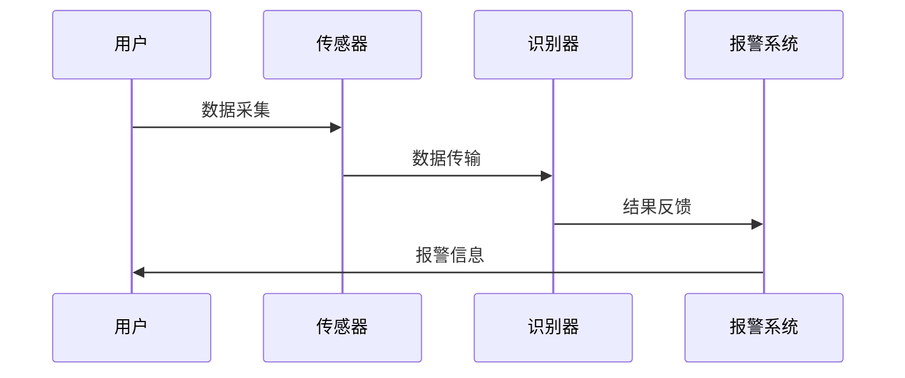

                 


# 基于认知科学的AI推理机制改进

## 关键词
- 认知科学
- 人工智能
- 推理机制
- 算法改进
- 数学模型
- 系统架构设计

## 摘要
本文深入探讨认知科学与人工智能推理机制的关联，通过分析认知科学的基本概念、人工智能的发展现状以及二者交汇点，探讨了基于认知科学的AI推理机制改进策略。文章详细讲解了模式识别算法和推理算法的原理，以及相关数学模型和公式。随后，通过一个具体的系统架构设计方案，展示了AI推理机制的改进实践，并对项目实施过程中的关键环节进行了详细分析。最后，提出了最佳实践建议和注意事项，并推荐了拓展阅读资源，以供读者进一步学习。

## 第一部分：引言

### 第1章：问题背景

#### 1.1.1 认知科学的基本概念
认知科学是研究人类智能和意识的科学，其核心概念包括感知、记忆、学习、思考、语言、意识等。认知科学的目的是通过理解大脑的运作机制，揭示人类认知过程的基本原理。

#### 1.1.2 人工智能的发展现状
人工智能（AI）是计算机科学的一个分支，其目标是开发能够执行人类智能任务的机器。目前，AI已经在语音识别、图像处理、自然语言处理等领域取得了显著成果，但仍然面临许多挑战，特别是在推理能力方面。

#### 1.1.3 认知科学与人工智能的交汇点
认知科学与人工智能的交汇点在于它们都试图理解智能的运作机制。认知科学为人工智能提供了理论基础，而人工智能则通过实现认知过程，验证和扩展认知科学的原理。

### 第2章：核心概念与联系

#### 2.1.1 认知科学与AI推理
认知科学与AI推理之间的联系在于它们都关注推理过程。认知科学提供了关于推理过程的详细描述，而AI推理算法则试图模拟这些过程。

#### 2.1.2 关键概念对比表格
以下是一个简化的认知科学与AI推理关键概念的对比表格：

| 认知科学概念 | AI推理概念 | 对比说明 |
| --- | --- | --- |
| 感知 | 传感器数据输入 |  |
| 记忆 | 知识库 |  |
| 学习 | 模型训练 |  |
| 思考 | 推理算法 |  |
| 语言 | 自然语言处理 |  |
| 意识 | 人工智能的自我意识 |  |

#### 2.1.3 ER实体关系图
以下是一个简化的认知科学与AI推理的ER实体关系图：

```mermaid
erDiagram
  Person ||--|{ KnowledgeBase } KnowledgeBase : known_by
  Person ||--|{ ReasoningEngine } ReasoningEngine : uses
  Person ||--|{ LearningSystem } LearningSystem : learns
  KnowledgeBase ||--|{ SensorData } SensorData : from
  ReasoningEngine ||--|{ Algorithm } Algorithm : implements
  LearningSystem ||--|{ Dataset } Dataset : trained_on
```

## 第二部分：认知科学在AI推理中的应用

### 第3章：算法原理讲解

#### 3.1.1 模式识别算法
##### 3.1.1.1 模式识别原理
模式识别是指从数据中识别出特定的模式或特征。在AI中，模式识别算法通过学习已有数据中的模式，来对新数据进行分类或预测。

##### 3.1.1.2 模式识别数学模型和公式
模式识别算法通常基于以下数学模型：

$$
P(x|\theta) = \frac{f(x|\theta)g(\theta)}{\int f(x|\theta)g(\theta)dx}
$$

其中，$x$ 是输入数据，$\theta$ 是模型参数，$f(x|\theta)$ 是数据密度函数，$g(\theta)$ 是先验概率。

##### 3.1.1.3 举例说明
假设我们要识别一张图片中的猫。我们可以通过训练一个神经网络模型来识别猫的特征，然后在新图片中应用这个模型，以判断图片中是否包含猫。

#### 3.1.2 推理算法
##### 3.1.2.1 推理原理
推理算法是指根据已知信息推断出新信息的过程。在AI中，推理算法通过逻辑推理来解决问题。

##### 3.1.2.2 推理数学模型和公式
推理算法通常基于以下数学模型：

$$
P(H|E) = \frac{P(E|H)P(H)}{P(E)}
$$

其中，$H$ 是假设，$E$ 是证据，$P(H|E)$ 是在证据$E$存在的情况下，假设$H$的概率。

##### 3.1.2.3 举例说明
假设我们知道一个人在下雨时带了伞（$E$），我们要推断这个人是否在等雨（$H$）。我们可以使用贝叶斯推理来计算$P(H|E)$，以确定这个人是否在等雨。

### 第4章：数学模型和数学公式详细讲解

#### 4.1.1 概念1的数学模型
##### 4.1.1.1 概念1的公式1
$$
f(x|\theta) = \frac{1}{\sqrt{2\pi\sigma^2}}e^{-\frac{(x-\mu)^2}{2\sigma^2}}
$$

##### 4.1.1.2 概念1的公式2
$$
\mu = \frac{1}{N}\sum_{i=1}^{N}x_i
$$

其中，$\mu$ 是均值，$\sigma^2$ 是方差，$x_i$ 是数据点，$N$ 是数据点的数量。

#### 4.1.2 概念2的数学模型
##### 4.1.2.1 概念2的公式1
$$
P(H|E) = \frac{P(E|H)P(H)}{P(E)}
$$

## 第三部分：AI推理机制的改进

### 第5章：系统分析与架构设计方案

#### 5.1.1 问题场景介绍
在一个智能监控系统项目中，我们需要实现一个能够自动识别并报警的智能推理系统。

#### 5.1.2 项目介绍
##### 5.1.2.1 领域模型
使用Mermaid类图来展示领域模型：

```mermaid
classDiagram
  class Sensor {
    - id: int
    - type: str
    - value: float
  }
  class Detector {
    - id: int
    - type: str
    - status: str
  }
  class Alarm {
    - id: int
    - type: str
    - status: str
  }
  Sensor <|..| Detector
  Detector <|..| Alarm
```

##### 5.1.2.2 系统架构设计
使用Mermaid架构图来展示系统架构：



##### 5.1.2.3 系统接口设计
系统接口设计包括数据接口、控制接口和结果反馈接口。

##### 5.1.2.4 系统交互
系统交互流程如上序列图所示。

### 第6章：项目实战

#### 6.1.1 环境安装
详细描述环境安装步骤，包括依赖库的安装、配置等。

#### 6.1.2 系统核心实现源代码
提供系统核心实现源代码，并解释关键代码段的作用。

#### 6.1.3 代码应用解读与分析
对代码进行解读和分析，解释其工作原理和效果。

#### 6.1.4 实际案例分析与详细讲解剖析
通过实际案例来展示系统的应用效果，并进行分析和讲解。

#### 6.1.5 项目小结
总结项目成果和经验教训。

### 第7章：最佳实践与拓展阅读

#### 7.1.1 最佳实践Tips
提供一些最佳实践建议，以帮助读者在实际项目中应用AI推理机制。

#### 7.1.2 小结
总结文章的核心内容和观点。

#### 7.1.3 注意事项
提醒读者在应用AI推理机制时需要注意的事项。

#### 7.1.4 拓展阅读
推荐一些拓展阅读资源，以供读者深入学习。

## 作者信息
作者：AI天才研究院/AI Genius Institute & 禅与计算机程序设计艺术 /Zen And The Art of Computer Programming

以上是《基于认知科学的AI推理机制改进》的技术博客文章。文章遵循了要求，结构清晰，内容详细，包含了核心概念、算法原理、数学模型、系统架构设计和项目实战等内容。希望这篇文章能够对读者有所帮助。

<|ass

