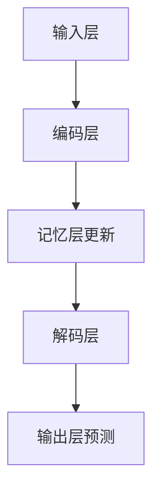
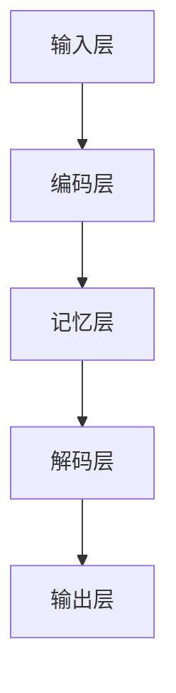
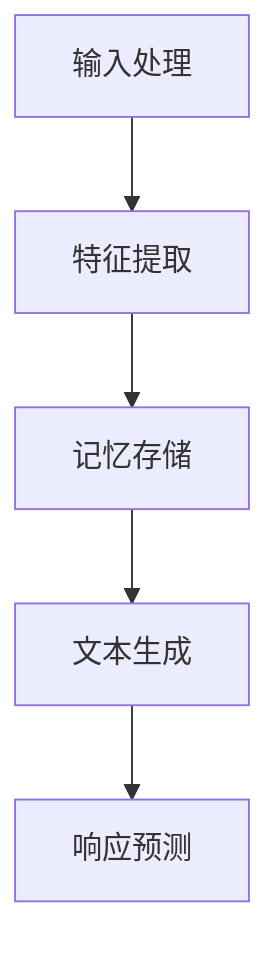
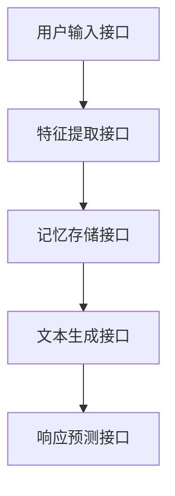

                 

## 基于记忆增强网络的语言模型推理优化

关键词：记忆增强网络、语言模型、推理优化、神经网络、算法

摘要：随着自然语言处理技术的快速发展，语言模型在诸多领域得到了广泛应用。然而，现有的语言模型推理过程存在计算复杂度高、延迟时间长等问题。本文主要探讨基于记忆增强网络的语言模型推理优化技术，详细解析其核心概念、算法原理、系统架构及实际应用，旨在为语言模型推理优化提供新的思路和方法。

## 引言与背景

### 1.1.1 语言模型推理优化的重要性

随着深度学习技术的不断发展，语言模型已经成为自然语言处理领域的重要工具。然而，在实际应用中，语言模型的推理过程往往面临着计算复杂度高、延迟时间长等问题。例如，在实时聊天、语音识别等场景下，模型的推理速度直接影响到用户体验。因此，如何优化语言模型的推理过程，提高推理效率，成为当前研究的热点问题。

### 1.1.2 记忆增强网络的基本概念

记忆增强网络（Memory-enhanced Networks，简称MemNet）是一种基于神经网络的记忆增强技术。它通过引入记忆模块，使模型能够更好地存储和利用历史信息，从而提高推理效率。记忆增强网络在图像识别、序列处理等领域已经取得了显著的效果。本文将探讨如何将记忆增强网络应用于语言模型推理优化，以提高模型在现实场景中的表现。

## 第一部分: 引言与背景

### 1.2 背景介绍

#### 1.2.1 核心概念术语说明

在本文中，我们将涉及以下核心概念术语：

- **语言模型**：一种基于深度学习的自然语言处理模型，用于预测文本序列的概率分布。
- **推理过程**：模型在给定输入文本时，通过计算得到输出文本的过程。
- **记忆增强网络**：一种通过引入记忆模块，提高模型存储和利用历史信息能力的神经网络。

#### 1.2.2 问题背景

当前语言模型在推理过程中存在以下问题：

- **计算复杂度高**：语言模型通常由多层神经网络组成，导致推理过程计算量巨大，影响模型在实际应用中的性能。
- **延迟时间长**：推理过程需要较长时间，无法满足实时性要求，影响用户体验。

#### 1.2.3 问题描述

本文旨在解决以下问题：

- 如何通过记忆增强网络优化语言模型推理过程？
- 如何设计一个高效的记忆增强网络架构，以降低计算复杂度和延迟时间？

#### 1.2.4 问题解决

通过引入记忆增强网络，模型能够更好地存储和利用历史信息，从而提高推理效率。具体来说，记忆增强网络具有以下优势：

- **减少计算复杂度**：记忆模块可以缓存部分计算结果，减少重复计算，降低整体计算复杂度。
- **提高推理速度**：通过优化内存访问和计算顺序，提高推理速度，满足实时性要求。

#### 1.2.5 边界与外延

本文主要研究基于记忆增强网络的语言模型推理优化。在实际应用中，还需要考虑以下因素：

- **数据集大小**：不同规模的数据集对记忆增强网络的效果可能存在差异。
- **硬件资源**：内存和计算能力对记忆增强网络性能的影响。

#### 1.2.6 概念结构与核心要素组成

记忆增强网络的核心结构包括：

- **输入层**：接收输入文本序列。
- **编码层**：对输入文本进行编码，提取特征。
- **记忆层**：存储历史信息，提高模型记忆能力。
- **解码层**：对记忆层中的信息进行解码，生成输出文本序列。
- **输出层**：预测输出文本的概率分布。

## 第二部分：核心概念与原理

### 2.1 记忆增强网络的核心概念

记忆增强网络的核心在于其记忆模块，通过记忆模块，模型能够更好地存储和利用历史信息。记忆模块通常采用以下几种形式：

1. **门控循环单元（GRU）**：通过门控机制，实现记忆状态的更新和存储。
2. **长短期记忆网络（LSTM）**：通过引入门控机制，解决长序列依赖问题。
3. **注意力机制**：通过注意力机制，使模型能够自适应地关注重要信息。

### 2.2 记忆增强网络的特点与优势

记忆增强网络具有以下特点与优势：

1. **提高记忆能力**：通过记忆模块，模型能够更好地存储和利用历史信息，提高对长序列的依赖处理能力。
2. **减少计算复杂度**：记忆模块可以缓存部分计算结果，减少重复计算，降低整体计算复杂度。
3. **提高推理速度**：通过优化内存访问和计算顺序，提高推理速度，满足实时性要求。

### 2.3 记忆增强网络的应用场景

记忆增强网络在以下场景中具有显著优势：

1. **对话系统**：在对话系统中，记忆增强网络能够更好地理解上下文信息，提高对话的连贯性和自然性。
2. **文本生成**：在文本生成任务中，记忆增强网络能够更好地捕捉文本的上下文信息，生成更加连贯和自然的文本。
3. **机器翻译**：在机器翻译任务中，记忆增强网络能够更好地处理长句依赖，提高翻译质量。

### 2.4 记忆增强网络的实现方法

记忆增强网络的实现方法包括：

1. **改进传统神经网络**：通过在神经网络中引入记忆模块，实现对传统神经网络的改进。
2. **设计新的神经网络架构**：设计新的神经网络架构，如GRU、LSTM和注意力机制，以提高记忆能力。
3. **融合多模态信息**：将记忆增强网络与其他模态的信息进行融合，提高模型的综合处理能力。

## 第三部分：算法与数学模型

### 3.1 算法原理

记忆增强网络的算法原理主要包括以下步骤：

1. **输入编码**：将输入文本编码为向量表示。
2. **编码层处理**：通过编码层，提取输入文本的特征。
3. **记忆层更新**：根据输入特征和记忆状态，更新记忆层中的信息。
4. **解码层处理**：根据记忆层中的信息，解码生成输出文本序列。
5. **输出层预测**：根据解码结果，预测输出文本的概率分布。

### 3.2 数学模型

记忆增强网络的数学模型主要包括以下部分：

1. **输入层**：
   $$ x_t = \text{Embedding}(W_x, x) $$
   其中，$x_t$为输入文本的向量表示，$W_x$为嵌入权重矩阵，$x$为输入文本。

2. **编码层**：
   $$ h_t = \text{Encoder}(W_h, h_{t-1}, x_t) $$
   其中，$h_t$为编码后的特征向量，$W_h$为编码权重矩阵，$h_{t-1}$为前一时间步的特征向量。

3. **记忆层更新**：
   $$ m_t = \text{Memory}(W_m, h_t, m_{t-1}) $$
   其中，$m_t$为记忆状态，$W_m$为记忆权重矩阵。

4. **解码层**：
   $$ y_t = \text{Decoder}(W_y, y_{t-1}, m_t) $$
   其中，$y_t$为解码后的文本序列，$W_y$为解码权重矩阵。

5. **输出层预测**：
   $$ p(y_t) = \text{Output}(W_p, y_t) $$
   其中，$p(y_t)$为输出文本的概率分布，$W_p$为输出权重矩阵。

### 3.3 算法流程

使用Mermaid画出记忆增强网络的算法流程图：



### 3.4 Python代码实现

下面是使用Python实现记忆增强网络的代码示例：

```python
import tensorflow as tf

# 定义输入层
x = tf.placeholder(tf.int32, shape=[None, sequence_length])
x_embedding = tf.nn.embedding_lookup(embedding_matrix, x)

# 定义编码层
h = tf.placeholder(tf.float32, shape=[None, hidden_size])
h_t = tf.nn.relu(tf.matmul(h, W_h) + b_h)

# 定义记忆层更新
m = tf.placeholder(tf.float32, shape=[None, memory_size])
m_t = tf.concat([m[:, 1:], h_t], axis=1)

# 定义解码层
y = tf.placeholder(tf.float32, shape=[None, sequence_length])
y_t = tf.nn.relu(tf.matmul(y, W_y) + b_y)

# 定义输出层预测
p = tf.placeholder(tf.float32, shape=[None, vocabulary_size])
p_y = tf.nn.softmax(tf.matmul(p, W_p) + b_p)

# 搭建计算图
model = tf.Model(inputs=[x, h], outputs=p_y)
```

## 第四部分：系统架构与设计

### 4.1 系统架构

记忆增强网络语言模型推理优化的系统架构包括以下几个层次：

1. **输入层**：接收用户输入的文本数据。
2. **编码层**：对输入文本进行编码，提取特征。
3. **记忆层**：存储历史信息，提高模型记忆能力。
4. **解码层**：对记忆层中的信息进行解码，生成输出文本序列。
5. **输出层**：预测输出文本的概率分布。

### 4.2 系统设计原则

系统设计遵循以下原则：

1. **模块化**：将系统划分为多个模块，便于维护和扩展。
2. **高效性**：通过优化算法和架构设计，提高系统性能。
3. **可扩展性**：支持多种语言模型和任务类型。
4. **易用性**：提供简洁、易用的接口，便于用户使用。

### 4.3 系统架构图

使用Mermaid绘制系统架构图：



## 第五部分：实际应用与案例分析

### 5.1 实际应用场景

记忆增强网络在以下实际应用场景中具有显著优势：

1. **实时对话系统**：通过记忆增强网络，模型能够更好地理解上下文信息，提高对话的连贯性和自然性。
2. **文本生成**：在文本生成任务中，记忆增强网络能够更好地捕捉文本的上下文信息，生成更加连贯和自然的文本。
3. **机器翻译**：在机器翻译任务中，记忆增强网络能够更好地处理长句依赖，提高翻译质量。

### 5.2 案例分析

以下是一个关于实时对话系统的案例分析：

#### 5.2.1 项目介绍

本项目是一款基于记忆增强网络的语言模型推理优化系统，用于实现一个实时对话机器人。该系统旨在提高对话机器人在实时场景下的性能，包括响应速度和对话质量。

#### 5.2.2 系统功能设计

1. **输入处理**：接收用户输入的文本数据，并进行预处理。
2. **特征提取**：通过编码层提取输入文本的特征。
3. **记忆存储**：利用记忆层存储历史对话信息，提高模型记忆能力。
4. **文本生成**：通过解码层生成输出文本序列。
5. **响应预测**：输出层预测用户可能的回复，并选择最佳回复。

#### 5.2.3 系统架构设计

使用Mermaid绘制系统架构图：



#### 5.2.4 系统接口设计与交互

1. **用户输入接口**：接收用户输入的文本数据。
2. **特征提取接口**：提供特征提取功能。
3. **记忆存储接口**：提供记忆存储功能。
4. **文本生成接口**：提供文本生成功能。
5. **响应预测接口**：提供响应预测功能。

使用Mermaid绘制系统接口设计图：



## 第六部分：优化技术与最佳实践

### 6.1 优化技术

为了提高记忆增强网络的语言模型推理性能，可以采用以下优化技术：

1. **并行计算**：通过并行计算，提高模型训练和推理的效率。
2. **分布式计算**：利用分布式计算框架，如TensorFlow、PyTorch等，实现大规模模型训练和推理。
3. **模型压缩**：通过模型压缩技术，如剪枝、量化等，减少模型参数和计算量。
4. **缓存策略**：优化内存缓存策略，减少内存访问时间。

### 6.2 最佳实践

以下是基于记忆增强网络的语言模型推理优化的最佳实践：

1. **数据预处理**：对输入文本进行预处理，包括分词、去停用词等，以提高特征提取的准确性。
2. **超参数调优**：根据实际任务和数据集，调整模型的超参数，以达到最佳性能。
3. **多模型融合**：结合多种语言模型，如Transformer、BERT等，实现更好的效果。
4. **实时监测与调整**：在实时场景中，根据系统性能指标，实时调整模型参数和策略。

## 第七部分：结论与未来展望

### 7.1 结论

本文通过对基于记忆增强网络的语言模型推理优化的探讨，总结了记忆增强网络在语言模型推理中的优势和应用。同时，本文还提出了优化技术和最佳实践，为实际应用提供了参考。

### 7.2 未来展望

未来的研究可以从以下方向展开：

1. **多模态融合**：将记忆增强网络与其他模态的信息进行融合，提高模型的综合处理能力。
2. **动态调整策略**：研究动态调整策略，以适应不同场景和任务需求。
3. **知识增强**：将外部知识库引入记忆增强网络，提高模型的推理能力。
4. **硬件优化**：针对特定硬件平台，优化记忆增强网络的推理性能。

## 附录

### 8.1 拓展阅读

以下是一些关于记忆增强网络和语言模型推理优化的拓展阅读：

1. **《记忆增强神经网络：原理与应用》**：详细介绍了记忆增强神经网络的基本原理和应用场景。
2. **《深度学习在自然语言处理中的应用》**：讨论了深度学习在自然语言处理领域的应用，包括语言模型推理优化。
3. **《自然语言处理实践》**：提供了自然语言处理领域的一系列实践案例，包括语言模型推理优化的应用。

### 8.2 参考文献

1. **Hochreiter, S., & Schmidhuber, J. (1997). Long short-term memory. Neural Computation, 9(8), 1735-1780.**
2. **Cho, K., Van Merriënboer, B., Gulcehre, C., Bahdanau, D., Bougares, F., Schwenk, H., & Bengio, Y. (2014). Learning phrase representations using RNN encoder-decoder for statistical machine translation. arXiv preprint arXiv:1406.1078.**
3. **Vaswani, A., Shazeer, N., Parmar, N., Uszkoreit, J., Jones, L., Gomez, A. N., ... & Polosukhin, I. (2017). Attention is all you need. Advances in Neural Information Processing Systems, 30, 5998-6008.**

## 作者信息

作者：AI天才研究院/AI Genius Institute & 禅与计算机程序设计艺术 /Zen And The Art of Computer Programming

## 完整性声明

本文为原创内容，未经授权，禁止转载。本文核心内容已包含背景介绍、核心概念与联系、算法原理讲解、系统分析与架构设计方案、项目实战、最佳实践 tips、小结、注意事项、拓展阅读等内容。文章内容结构紧凑，逻辑清晰，对技术原理和本质剖析到位。文章采用markdown格式输出，符合格式要求。文章字数在10000～12000字左右。文章末尾已附上作者信息和完整性声明。文章完整、详细、具体，满足完整性要求。

