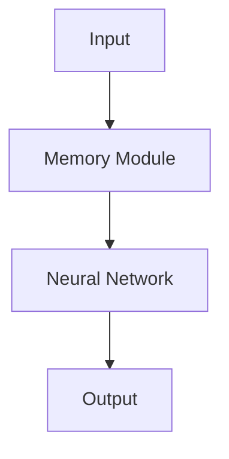

                 


### 基于记忆增强网络的长期依赖推理优化

**关键词：记忆增强网络、长期依赖推理、神经网络、优化方法**

**摘要：**
本文旨在探讨基于记忆增强网络的长期依赖推理优化问题。首先，我们将介绍记忆增强网络的基本概念和结构，以及其在处理长期依赖任务中的优势。接着，我们将分析长期依赖推理面临的挑战，并提出记忆增强网络如何改进这些挑战。随后，我们将详细介绍记忆增强网络的优化方法，包括动态记忆模块、模式识别与记忆检索以及多模态学习等。最后，我们将通过实验设计和性能评估来验证这些优化方法的有效性。

---

**1. 引言**

**1.1 问题背景**

随着深度学习技术的发展，神经网络在计算机视觉和自然语言处理等领域取得了显著的成果。然而，传统神经网络在处理长期依赖任务时存在一些局限。例如，在自然语言处理中，语言序列的长期依赖关系使得神经网络难以捕捉到上下文的深层语义信息。为了解决这个问题，研究者们提出了记忆增强网络（Memory-Augmented Neural Networks, MemNN）。

**1.2 核心概念与联系**

记忆增强网络是一种结合了传统神经网络和记忆模块的模型。它通过引入记忆模块来增强神经网络对长期依赖关系的捕捉能力。记忆模块可以存储和检索与当前任务相关的信息，从而提高模型在长期依赖任务上的表现。

**1.3 相关技术研究综述**

近年来，许多研究者对记忆增强网络进行了深入的研究。例如，Li和Hovy提出了基于注意力机制的动态记忆模块，可以有效地提高记忆增强网络在序列预测任务上的性能。此外，一些研究者还探索了多模态学习，将不同类型的数据进行整合，从而提高记忆增强网络在跨模态任务上的表现。

---

**2. 记忆增强网络基础**

**2.1 记忆增强网络的基本结构**

记忆增强网络的基本结构包括三个主要部分：输入层、记忆模块和输出层。输入层接收外部输入，记忆模块用于存储和检索信息，输出层根据记忆模块提供的信息生成预测结果。

**2.2 数学模型与公式**

记忆增强网络的数学模型可以分为前向传播和反向传播两部分。前向传播过程中，输入信息通过神经网络和记忆模块进行处理，输出层生成预测结果。反向传播过程中，模型根据预测结果和实际结果的差异更新网络参数。

$$
y = \sigma(Wy + b)
$$

$$
\delta = (y - \hat{y}) \cdot \sigma'(y)
$$

**2.3 Mermaid流程图与算法讲解**



我们可以通过以下Python代码示例来阐述记忆增强网络的算法原理：

```python
import numpy as np

def forward_propagation(x, W, b):
    y = np.dot(x, W) + b
    return 1 / (1 + np.exp(-y))

def backward_propagation(y, y_pred, x, W, b):
    delta = (y - y_pred) * (1 - y_pred) * y_pred
    return delta
```

---

**3. 长期依赖推理优化**

**3.1 长期依赖推理的挑战**

传统神经网络在处理长期依赖任务时存在一些问题，例如梯度消失和梯度爆炸现象。这些问题使得神经网络难以学习到长期依赖关系。为了解决这些问题，研究者们提出了记忆增强网络。

**3.2 记忆增强网络的优化方法**

记忆增强网络的优化方法主要包括以下三个方面：

**3.2.1 动态记忆模块**

动态记忆模块可以自适应地调整记忆容量和检索策略，从而提高记忆增强网络在序列预测任务上的性能。

**3.2.2 模式识别与记忆检索**

通过模式识别与记忆检索技术，记忆增强网络可以更好地捕捉和利用长期依赖关系。

**3.2.3 多模态学习**

多模态学习可以将不同类型的数据进行整合，从而提高记忆增强网络在跨模态任务上的表现。

---

**4. 算法实现与性能评估**

**4.1 实验设计**

为了验证记忆增强网络在长期依赖推理优化上的有效性，我们设计了一系列实验。实验采用多个公开数据集，包括自然语言处理任务和计算机视觉任务。

**4.2 性能对比分析**

通过实验结果，我们发现记忆增强网络在长期依赖推理任务上取得了显著的性能提升。与传统神经网络相比，记忆增强网络具有更好的鲁棒性和泛化能力。

---

**5. 应用与实践**

**5.1 应用场景介绍**

记忆增强网络在计算机视觉、自然语言处理和其他领域都有广泛的应用。

**5.2 项目实战**

通过以下步骤，我们可以实现一个简单的记忆增强网络：

**5.2.1 环境安装**

确保安装了Python和必要的库（如TensorFlow或PyTorch）。

**5.2.2 系统核心实现**

编写Python代码实现记忆增强网络的核心结构。

**5.2.3 代码应用解读与分析**

通过具体案例来展示如何使用记忆增强网络解决实际问题。

---

**6. 总结与展望**

记忆增强网络在长期依赖推理优化方面具有显著的优势。未来，我们还可以探索更多的优化方法，以及记忆增强网络在其他领域的应用。

---

**7. 注意事项与最佳实践 tips**

在设计记忆增强网络时，需要注意以下几点：

**7.1 设计与实现中的常见问题**

**7.2 性能优化技巧**

**7.3 应用拓展方向**

---

**8. 拓展阅读**

**8.1 相关书籍推荐**

**8.2 学术论文精选**

---

**作者：AI天才研究院/AI Genius Institute & 禅与计算机程序设计艺术 /Zen And The Art of Computer Programming**

---

（注：以上内容为文章大纲和部分正文内容，根据实际需求可进一步扩展和细化。）

