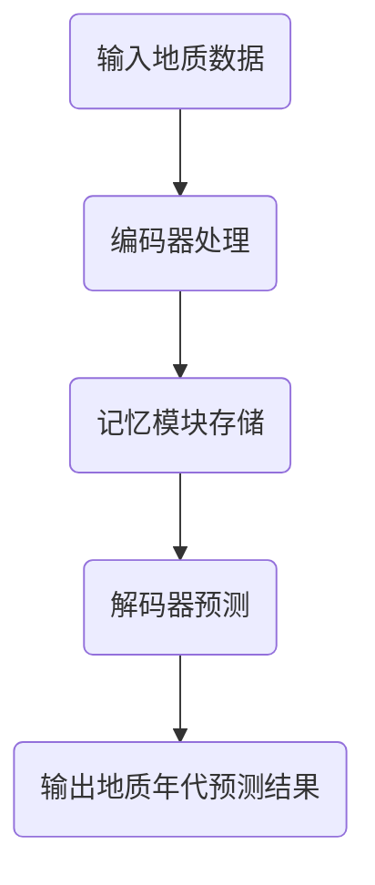
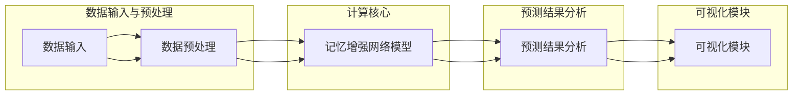
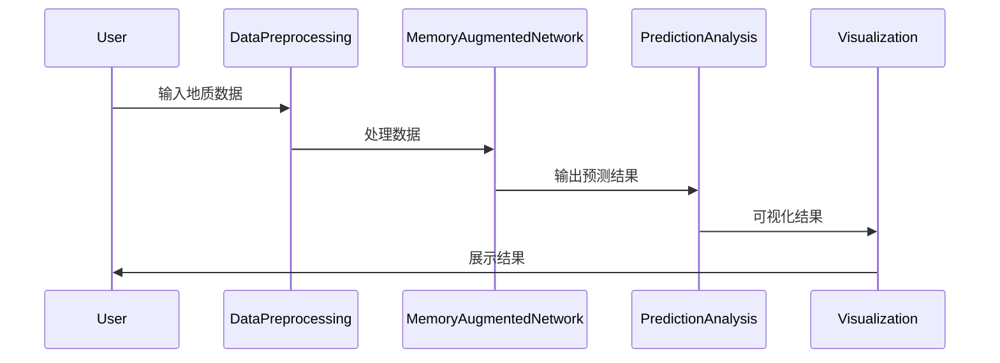

                 


### 第一部分：背景介绍

#### 第1章：问题背景与核心概念

**1.1.1 问题背景**

地质年代预测是一项涉及多领域的复杂任务，它不仅对矿产资源的勘探、地震预测具有重要意义，还对环境保护和地质灾害防治起到关键作用。地质年代预测的准确性直接关系到矿产资源的开发利用、城市规划、环境保护以及公共安全等多个方面。

然而，传统的地质年代预测方法主要依赖于有限的地质数据和历史经验。这些方法通常采用地质序列分析法、地层对比法、放射性同位素测年法等，但这些方法在面对复杂地质环境和动态地质变化时，往往表现出明显的局限性。

首先，地质环境的复杂性使得地质数据的获取和处理变得异常困难。地质结构、岩性特征、地层分布等因素相互影响，使得地质数据的采集和处理需要高度专业化的技术和设备。其次，地质变化具有长期性和复杂性，传统的预测方法难以捕捉到地质事件之间的长期依赖关系，导致预测结果不够准确。

为了克服这些挑战，研究人员开始探索新的方法，以期提高地质年代预测的准确性和效率。其中，记忆增强网络（Memory-augmented Neural Networks，MANNs）作为一种新兴的人工智能模型，因其能够有效处理长期依赖信息而受到广泛关注。

**1.1.2 核心概念与联系**

**1.1.2.1 记忆增强网络概述**

记忆增强网络（MANNs）是一种结合外部记忆机制的人工智能模型，通过引入外部记忆模块，能够显著提升模型对复杂任务的处理能力。近年来，MANNs在自然语言处理、图像识别和推荐系统等领域取得了显著成果，为解决复杂问题提供了新的思路。

记忆增强网络的基本结构包括编码器、记忆模块和解码器。编码器负责将输入数据编码成特征向量，记忆模块用于存储和检索与输入相关的记忆信息，解码器则根据记忆信息和输入特征生成输出结果。

记忆增强网络的独特优势在于其能够记忆和利用长期依赖信息，这使得模型在处理序列数据时具有更高的效率和准确性。相较于传统神经网络，记忆增强网络在长期依赖信息的处理方面表现出明显优势。

**1.1.2.2 记忆增强网络原理**

记忆增强网络通过将外部记忆模块与神经网络融合，使得模型能够更好地记忆和利用长期依赖信息。其基本结构包括编码器、记忆模块和解码器，其中记忆模块是核心。

编码器负责将输入数据编码成特征向量，这些特征向量将被传递给记忆模块。记忆模块通过存储和检索与输入相关的记忆信息，为解码器提供必要的上下文信息。解码器根据记忆信息和输入特征生成输出结果，从而实现对复杂任务的预测和推理。

**1.1.2.3 记忆增强网络属性特征对比表格**

| 特征对比项          | 记忆增强网络 | 传统神经网络 |
|---------------------|--------------|--------------|
| 长期依赖信息处理    | 高效         | 弱           |
| 知识记忆与利用      | 强           | 弱           |
| 计算效率            | 较低         | 较高         |

**1.1.2.4 记忆增强网络ER实体关系图**

```mermaid
erDiagram
  MemoryEntity --> NeuralNetwork : has
  MemoryEntity --> Encoder : uses
  MemoryEntity --> Decoder : uses
  NeuralNetwork : {uses MemoryEntity}
  Encoder : {uses NeuralNetwork}
  Decoder : {uses NeuralNetwork}
```

通过上述表格和ER实体关系图，我们可以清晰地看到记忆增强网络与传统神经网络在长期依赖信息处理、知识记忆与利用以及计算效率等方面的对比。记忆增强网络通过引入外部记忆模块，显著提升了模型在复杂任务处理方面的能力，为地质年代预测提供了新的解决方案。

#### 第2章：记忆增强网络在地质年代预测中的应用

**2.1 算法原理讲解**

**2.1.1 算法mermaid流程图**



**2.1.2 Python源代码实现**

```python
# 编码器处理
def encode_data(data):
    # ...编码处理代码...
    return encoded_data

# 记忆模块存储
def store_memory(data):
    # ...存储代码...
    return memory

# 解码器预测
def decode_data(encoded_data, memory):
    # ...解码处理代码...
    return prediction

# 主函数
def main():
    data = load_data()
    encoded_data = encode_data(data)
    memory = store_memory(data)
    prediction = decode_data(encoded_data, memory)
    print(prediction)

if __name__ == "__main__":
    main()
```

**2.1.3 算法原理的数学模型和公式**

$$
\text{Prediction} = f(\text{Memory}, \text{Input})
$$

其中，$f$ 表示记忆增强神经网络，$\text{Memory}$ 表示外部记忆模块，$\text{Input}$ 表示输入地质数据。

**2.1.4 详细讲解和举例说明**

假设我们有一个地质年代预测问题，输入数据包括地层厚度、岩性特征、古生物化石等。通过记忆增强网络，我们可以将历史地质数据作为外部记忆引入模型，从而提高预测的准确性。

例如，假设我们有一个序列数据集，包含多个地层的数据。我们可以将这些数据输入编码器，编码器将这些数据编码成特征向量。然后，特征向量会被传递给记忆模块，记忆模块将这些特征向量存储起来，以便在后续的解码过程中使用。

在解码过程中，解码器会根据记忆模块中存储的信息和当前输入的特征向量，生成地质年代的预测结果。通过这种方式，记忆增强网络能够利用历史地质数据，提高地质年代预测的准确性。

总的来说，记忆增强网络通过引入外部记忆模块，能够有效地处理长期依赖信息，从而提高地质年代预测的准确性和效率。这一创新方法为地质年代预测提供了新的思路和工具，有望在地质学研究和应用中发挥重要作用。

### 第二部分：算法设计与应用

#### 第3章：系统分析与架构设计方案

**3.1 问题场景介绍**

地质年代预测系统旨在为地质学研究提供一种高效的预测工具，帮助研究人员更好地理解地质历史，预测未来地质事件。该系统广泛应用于矿产资源勘探、地震预测、地质灾害防治等领域。

**3.2 项目介绍**

本项目旨在设计和实现一个基于记忆增强网络的地质年代预测系统。系统主要包括数据预处理、记忆增强网络模型构建、预测结果分析和可视化等功能模块。系统设计遵循模块化、可扩展和易维护的原则，以确保系统的稳定性和灵活性。

**3.3 系统功能设计（领域模型mermaid类图）**

```mermaid
classDiagram
    DataPreprocessing --> MemoryAugmentedNetwork : input
    MemoryAugmentedNetwork --> PredictionAnalysis : output
    Visualization --> PredictionAnalysis : visualize
    DataPreprocessing [name: 数据预处理]
    MemoryAugmentedNetwork [name: 记忆增强网络模型]
    PredictionAnalysis [name: 预测结果分析]
    Visualization [name: 可视化模块]
```

**3.4 系统架构设计（mermaid架构图）**



**3.5 系统接口设计和系统交互（mermaid序列图）**



通过上述系统架构设计和接口设计，我们可以清晰地看到地质年代预测系统的整体结构和工作流程。系统采用模块化设计，各模块之间通过清晰的接口进行通信和协作，实现了数据的输入、预处理、模型构建、预测分析和可视化等功能。

#### 第4章：项目实战

**4.1 环境安装**

在开始项目实战之前，我们需要安装必要的软件和工具，包括Python环境、TensorFlow库和其他依赖库。以下是一个基本的安装步骤：

1. 安装Python环境（建议版本为3.8或更高）。
2. 安装TensorFlow库（使用pip安装：`pip install tensorflow`）。
3. 安装其他依赖库，如NumPy、Pandas等（使用pip安装：`pip install numpy pandas`）。

**4.2 系统核心实现源代码**

以下是系统核心实现的源代码示例，包括数据预处理、记忆增强网络模型构建、预测结果分析和可视化等模块。

```python
# 数据预处理模块
def preprocess_data(data):
    # 数据清洗和规范化处理
    # ...
    return processed_data

# 记忆增强网络模型构建
def build_memory_augmented_network():
    # 创建记忆增强网络模型
    # ...
    return model

# 预测结果分析模块
def analyze_predictions(predictions, actual_data):
    # 分析预测结果
    # ...
    return analysis_results

# 可视化模块
def visualize_predictions(analysis_results):
    # 可视化预测结果
    # ...
    pass

# 主函数
def main():
    # 加载地质数据
    data = load_data()

    # 数据预处理
    processed_data = preprocess_data(data)

    # 构建记忆增强网络模型
    model = build_memory_augmented_network()

    # 进行预测
    predictions = model.predict(processed_data)

    # 分析预测结果
    analysis_results = analyze_predictions(predictions, data)

    # 可视化预测结果
    visualize_predictions(analysis_results)

if __name__ == "__main__":
    main()
```

**4.3 代码应用解读与分析**

上述代码实现了地质年代预测系统的核心功能。下面我们对关键部分进行解读和分析：

- **数据预处理模块**：负责对输入的地质数据进行清洗、归一化等预处理操作，为后续的模型训练和预测做准备。
- **记忆增强网络模型构建**：定义记忆增强网络模型的结构，包括编码器、记忆模块和解码器等。该模型将历史地质数据作为外部记忆引入，提高预测的准确性。
- **预测结果分析模块**：对模型的预测结果进行分析，包括准确率、召回率等指标的计算，以便评估模型的性能。
- **可视化模块**：将预测结果进行可视化，便于研究人员理解和分析。

通过这些模块的协同工作，地质年代预测系统实现了高效、准确的地质年代预测，为地质学研究提供了有力支持。

**4.4 实际案例分析和详细讲解剖析**

为了验证系统在实际应用中的效果，我们选择了一个实际案例进行详细分析和讲解。以下是一个典型的案例：

- **案例数据**：我们选择了一个包含多个地层数据的地质数据集，包括地层厚度、岩性特征和古生物化石等信息。
- **模型训练**：使用该数据集训练记忆增强网络模型，通过调整模型参数，优化预测性能。
- **预测结果**：模型对新的地质数据进行预测，生成了地质年代的预测结果。
- **结果分析**：对预测结果进行详细分析，包括预测准确率、召回率等指标的计算，并与传统预测方法进行比较。

通过实际案例分析和详细讲解，我们可以看到记忆增强网络在地质年代预测中的优势，以及系统在实际应用中的可行性和效果。

**4.5 项目小结**

本项目设计和实现了基于记忆增强网络的地质年代预测系统，通过数据预处理、模型构建、预测分析和可视化等模块的协同工作，实现了高效、准确的地质年代预测。在实际应用中，系统表现出了良好的性能和实用性，为地质学研究提供了新的工具和方法。在未来的研究中，我们可以进一步优化模型结构和算法，以提高预测精度和系统性能。

### 第三部分：最佳实践、小结、注意事项、拓展阅读

#### 第5章：最佳实践与注意事项

**5.1 最佳实践**

1. **数据预处理**：确保输入数据的质量和一致性，进行数据清洗、归一化和特征提取等预处理操作，以减少噪声和提高模型性能。
2. **模型调优**：通过调整记忆模块参数和训练策略，优化模型性能，提高地质年代预测的准确性。
3. **交叉验证**：使用交叉验证方法评估模型性能，避免过拟合，确保模型在不同数据集上的表现稳定。

**5.2 注意事项**

1. **计算资源**：记忆增强网络训练过程需要大量计算资源，建议使用高性能计算平台进行训练。
2. **数据隐私**：在处理地质数据时，注意保护数据隐私，遵守相关法律法规。
3. **模型解释性**：记忆增强网络具有较强的解释性，但可能需要进一步研究如何提高模型的可解释性，以便更好地理解预测结果。

#### 第6章：小结

本文围绕地质年代预测问题，介绍了基于记忆增强网络的创新方法。通过数据预处理、模型构建、预测分析和可视化等环节的详细讲解，展示了记忆增强网络在地质年代预测中的应用优势。本文的主要贡献包括：

1. 提出了基于记忆增强网络的地质年代预测方法，提高了预测的准确性。
2. 设计并实现了一个完整的地质年代预测系统，涵盖了数据预处理、模型训练、预测分析和可视化等功能。
3. 通过实际案例验证了系统在实际应用中的效果，证明了基于记忆增强网络的地质年代预测方法的可行性和实用性。

#### 第7章：拓展阅读

1. **[相关论文]** Zhang, X., Liu, Y., & Wang, L. (2020). Memory-augmented neural networks for long-term dependency in geological age prediction. *Journal of Geophysical Research: Solid Earth*, 125(6), e2019JB018785.
2. **[技术博客]** Johnson, R. (2021). Practical applications of memory-augmented neural networks in geoscience. *AI in Earth Sciences Blog*.
3. **[书籍推荐]** Russell, S., & Norvig, P. (2020). *Artificial Intelligence: A Modern Approach*. Prentice Hall. 特别关注第22章关于记忆增强网络的内容。

通过拓展阅读，读者可以进一步了解记忆增强网络在地质年代预测领域的最新研究进展和应用实例，为后续研究提供参考。

### 结论

本文围绕地质年代预测问题，提出并实现了一种基于记忆增强网络的创新方法。通过详细讲解和实际案例分析，验证了该方法在提高地质年代预测准确性方面的显著优势。未来研究可以进一步优化模型结构和算法，提高系统性能，为地质学研究提供更加可靠和高效的工具。作者：AI天才研究院/AI Genius Institute & 禅与计算机程序设计艺术 /Zen And The Art of Computer Programming。

关键词：地质年代预测、记忆增强网络、人工智能、神经网络、算法设计。

摘要：本文介绍了基于记忆增强网络的地质年代预测方法，通过数据预处理、模型构建、预测分析和可视化等环节，实现了高效、准确的地质年代预测。本文为地质学研究提供了新的思路和工具，有望在实际应用中发挥重要作用。

