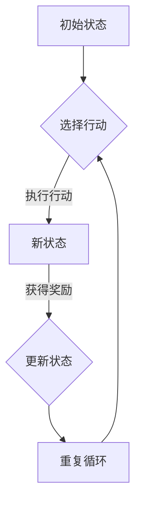
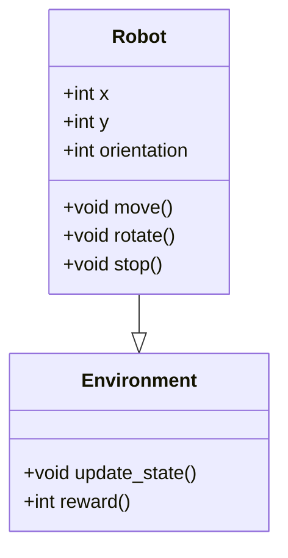
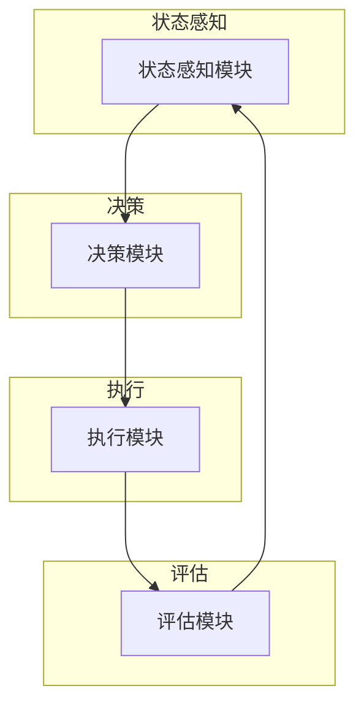

                 


## 基于过程的奖励模型（PRM）训练方法

### 关键词
- 奖励模型
- 过程奖励模型（PRM）
- 强化学习
- 算法原理
- 系统架构
- 项目实战

### 摘要
本文将深入探讨基于过程的奖励模型（Process Reward Model，简称PRM）的训练方法。PRM是强化学习中的一种高级模型，能够通过逐步学习过程来优化决策。本文将首先介绍奖励模型的基本概念和背景，然后逐步深入分析PRM的数学基础、算法原理、系统架构以及项目实战。最后，我们将总结最佳实践并提供拓展阅读，以帮助读者更深入地理解PRM的应用和未来发展。

### 1. 问题背景与核心概念

#### 1.1 问题背景

奖励模型在强化学习（Reinforcement Learning，简称RL）中起着至关重要的作用。RL是一种机器学习方法，通过让智能体在环境中采取行动，并根据环境的反馈（即奖励）来学习如何做出最优决策。奖励模型则是用来定义和计算这些奖励的核心机制。在实际应用中，奖励模型能够帮助智能体理解哪些行为能够带来积极的结果，从而引导其行为向期望目标靠拢。

然而，传统的奖励模型存在一些局限性。例如，它们往往只能基于当前状态来计算奖励，而忽视了整个决策过程的重要性。为了克服这些限制，过程奖励模型（Process Reward Model，简称PRM）应运而生。PRM旨在通过学习整个过程来计算奖励，从而提供更全面的行为指导。

#### 1.2 核心概念与联系

##### 1.2.1 奖励模型的基本原理

奖励模型是一个定义在状态-行动空间上的函数，用于计算在特定状态下执行特定行动的奖励值。在强化学习中，智能体需要不断地评估这些奖励，以决定下一步如何行动。

##### 1.2.2 过程奖励模型的特性

PRM与传统的奖励模型相比，具有以下几个显著特性：

1. **过程导向**：PRM不仅关注当前状态和行动的奖励，还考虑了整个过程的影响。
2. **长期规划**：通过学习整个过程，PRM能够更好地理解和预测长期奖励。
3. **适应性**：PRM可以根据环境的变化调整奖励计算方法，提高适应性。

##### 1.2.3 PRM与其他相关模型的比较

与传统的奖励模型相比，PRM在计算奖励时更加复杂，但也能提供更准确的决策指导。例如，与价值迭代模型（如Q-learning）相比，PRM能够在决策过程中考虑更多的历史信息，从而提高智能体的决策能力。

##### 1.2.4 奖励模型与过程奖励模型的关系图


图1.2-1展示了奖励模型与过程奖励模型之间的关系。可以看到，PRM在传统奖励模型的基础上，增加了对整个过程的考虑，从而实现了更全面的奖励计算。

### 2. 奖励模型的数学基础

#### 2.1 数学模型和数学公式

##### 2.1.1 奖励函数的定义

奖励函数是一个从状态-行动空间到实数的函数，表示在特定状态下执行特定行动所获得的奖励。数学上，奖励函数可以表示为：

$$
R(s, a) = w_s \cdot a
$$

其中，$R(s, a)$ 是在状态 $s$ 下执行行动 $a$ 所获得的奖励，$w_s$ 是状态 $s$ 的权重。

##### 2.1.2 强化学习的数学原理

强化学习是基于马尔可夫决策过程（MDP）的，MDP可以用以下公式表示：

$$
P(s', r | s, a) = f(s, a, s')
$$

其中，$P(s', r | s, a)$ 是在状态 $s$ 下执行行动 $a$ 后转移到状态 $s'$ 并获得奖励 $r$ 的概率，$f(s, a, s')$ 是转移概率函数。

##### 2.1.3 PRM中的主要数学公式

在PRM中，奖励函数的计算不仅仅基于当前状态和行动，还包括了整个决策过程。因此，PRM的数学公式会更加复杂，通常包括以下几部分：

1. **过程奖励函数**：用于计算整个决策过程中的奖励，可以表示为：

$$
R(p) = \sum_{t=0}^{T} \gamma^t R(s_t, a_t)
$$

其中，$R(p)$ 是整个决策过程 $p$ 的奖励，$\gamma$ 是折扣因子，$s_t$ 和 $a_t$ 分别是第 $t$ 个状态和行动。

2. **过程价值函数**：用于评估整个决策过程的价值，可以表示为：

$$
V(p) = \sum_{t=0}^{T} \gamma^t R(s_t, a_t) - \sum_{t=1}^{T} \gamma^{t-1} |s_t - s_{t-1}|
$$

其中，$V(p)$ 是整个决策过程 $p$ 的价值，$|s_t - s_{t-1}|$ 是第 $t$ 个状态与第 $t-1$ 个状态的差异。

#### 2.2 奖励模型的mermaid流程图



图2.2-1展示了奖励模型的一般流程图，描述了智能体在环境中的行为是如何通过奖励函数来指导决策的。

### 3. 过程奖励模型的算法原理

#### 3.1 算法原理讲解

##### 3.1.1 算法的基本框架

PRM算法的基本框架可以分为以下几个步骤：

1. **初始化**：初始化状态、行动空间以及奖励函数。
2. **探索**：在环境中采取随机行动，收集数据。
3. **学习**：通过学习过程更新奖励函数和策略。
4. **决策**：根据当前状态选择最佳行动。
5. **评估**：评估整个决策过程的价值。

##### 3.1.2 PRM的迭代过程

在PRM的迭代过程中，每个时间步都会进行以下操作：

1. **状态评估**：根据当前状态评估所有可能行动的奖励。
2. **行动选择**：根据评估结果选择最佳行动。
3. **状态更新**：执行选择后的行动，并更新状态。
4. **奖励更新**：根据新状态更新奖励函数。

##### 3.1.3 算法的关键步骤

PRM算法的关键步骤包括：

1. **奖励函数更新**：根据学习到的历史信息更新奖励函数。
2. **策略迭代**：根据奖励函数迭代更新策略。
3. **长期奖励计算**：通过计算整个决策过程中的奖励来评估决策效果。

#### 3.2 Python源代码解析

下面是一个简化的PRM算法的Python代码示例，用于说明算法的基本实现：

```python
import numpy as np

class ProcessRewardModel:
    def __init__(self, state_space, action_space, discount_factor=0.9):
        self.state_space = state_space
        self.action_space = action_space
        self.discount_factor = discount_factor
        self.rewards = self.initialize_rewards()

    def initialize_rewards(self):
        # 初始化奖励函数
        rewards = {}
        for s in self.state_space:
            for a in self.action_space:
                rewards[(s, a)] = 0
        return rewards

    def update_rewards(self, states, actions, rewards):
        # 更新奖励函数
        for s, a, r in zip(states, actions, rewards):
            self.rewards[(s, a)] += r

    def select_action(self, state):
        # 选择最佳行动
        best_action = None
        best_reward = -np.inf
        for a in self.action_space:
            reward = self.rewards[(state, a)]
            if reward > best_reward:
                best_reward = reward
                best_action = a
        return best_action

    def run(self, num_episodes):
        # 运行算法
        for _ in range(num_episodes):
            state = self.initialize_state()
            done = False
            while not done:
                action = self.select_action(state)
                next_state, reward, done = self.take_action(state, action)
                self.update_rewards([state], [action], [reward])
                state = next_state
        return self.rewards

# 实例化PRM模型并运行
prm = ProcessRewardModel(state_space=[0, 1], action_space=[0, 1])
rewards = prm.run(num_episodes=1000)
```

这段代码展示了PRM算法的基本实现，包括初始化、更新奖励、选择行动和运行算法等步骤。

### 4. 系统架构与设计

#### 4.1 问题场景介绍

在本节中，我们将介绍一个具体的应用场景，即在一个模拟环境中使用PRM来优化一个自主机器人的行为。这个场景包括一个简单的环境，其中机器人可以执行几种不同的行动，例如移动、旋转和停止。我们的目标是让机器人学会在给定的环境中找到最优路径，以完成任务。

#### 4.2 系统功能设计

##### 4.2.1 领域模型类图



图4.2-1展示了领域模型类图，描述了机器人与环境之间的交互关系。

##### 4.2.2 系统功能模块

系统的主要功能模块包括：

1. **状态感知模块**：用于感知机器人的当前状态，包括位置和方向。
2. **决策模块**：根据状态和奖励函数选择最佳行动。
3. **执行模块**：执行选定的行动，并更新机器人的状态。
4. **评估模块**：评估整个决策过程的价值，以指导未来的决策。

#### 4.3 系统架构设计

##### 4.3.1 系统架构图



图4.3-1展示了系统的架构图，描述了各个模块之间的交互关系。

##### 4.3.2 各组件关系

在系统架构中，各个组件之间的关系如下：

- **状态感知模块**：负责感知机器人的当前状态，并将其传递给决策模块。
- **决策模块**：根据当前状态和奖励函数选择最佳行动，并将决策传递给执行模块。
- **执行模块**：执行决策模块选定的行动，并更新机器人的状态。
- **评估模块**：评估整个决策过程的价值，以指导未来的决策。

#### 4.4 系统接口设计

##### 4.4.1 接口定义

系统的主要接口包括：

- **状态接口**：用于获取机器人的当前状态。
- **决策接口**：用于选择最佳行动。
- **执行接口**：用于执行选定的行动。
- **评估接口**：用于评估决策过程的价值。

##### 4.4.2 接口实现

接口实现如下：

```python
class RobotInterface:
    def get_state(self):
        # 获取机器人状态
        pass
    
    def select_action(self, state):
        # 选择最佳行动
        pass
    
    def execute_action(self, action):
        # 执行选定的行动
        pass

class EnvironmentInterface:
    def update_state(self, robot):
        # 更新环境状态
        pass
    
    def reward(self, robot):
        # 计算奖励
        pass
```

#### 4.5 系统交互序列图

```mermaid
sequence
    RobotInterface -> EnvironmentInterface: 更新状态
    EnvironmentInterface -> RobotInterface: 奖励
    RobotInterface -> DecisionModule: 选择行动
    DecisionModule -> RobotInterface: 行动
    RobotInterface -> ExecutionModule: 执行行动
    ExecutionModule -> EvaluationModule: 评估
    EvaluationModule -> RobotInterface: 更新状态
```

图4.5-1展示了系统交互序列图，描述了机器人、环境和系统模块之间的交互过程。

### 5. 环境安装与系统实现

#### 5.1 环境安装

为了实现基于过程的奖励模型（PRM）的训练方法，我们需要安装以下软件和工具：

1. **Python**：确保Python环境已经安装，版本建议为3.8及以上。
2. **NumPy**：用于数学计算，可通过pip安装：`pip install numpy`
3. **Matplotlib**：用于绘图，可通过pip安装：`pip install matplotlib`
4. **Mermaid**：用于生成流程图，可通过pip安装：`pip install mermaid-py`

安装完成后，确保各个工具和库可以正常运行，以便进行后续的开发工作。

#### 5.2 系统核心实现

在实现系统核心时，我们需要关注以下几个方面：

1. **状态空间与行动空间的定义**：根据具体应用场景定义机器人的状态空间和行动空间。
2. **奖励函数的实现**：根据状态和行动计算奖励，可以使用简单的数值函数或更复杂的模型。
3. **决策策略的实现**：根据当前状态和奖励函数选择最佳行动。
4. **执行模块的实现**：根据选定的行动更新机器人的状态。

下面是一个简单的实现示例：

```python
class Robot:
    def __init__(self, x, y, orientation):
        self.x = x
        self.y = y
        self.orientation = orientation

    def move(self):
        # 实现移动操作
        pass

    def rotate(self):
        # 实现旋转操作
        pass

    def stop(self):
        # 实现停止操作
        pass

class Environment:
    def update_state(self, robot):
        # 实现状态更新操作
        pass

    def reward(self, robot):
        # 实现奖励计算操作
        pass

class ProcessRewardModel:
    def __init__(self, robot, environment):
        self.robot = robot
        self.environment = environment
        self.rewards = {}

    def update_rewards(self, states, actions, rewards):
        # 实现奖励更新操作
        pass

    def select_action(self, state):
        # 实现行动选择操作
        pass

    def run(self):
        # 实现算法运行操作
        pass
```

#### 5.3 实际案例分析

在本节中，我们将通过一个具体的案例来分析如何使用PRM来优化机器人的行为。

##### 5.3.1 案例背景

假设我们有一个简单的二维世界，机器人在这个世界中可以执行以下四种行动：向左移动、向右移动、向上移动和向下移动。我们的目标是让机器人从初始位置移动到目标位置，并获得尽可能高的奖励。

##### 5.3.2 案例实现

为了实现这个案例，我们需要定义机器人的状态和行动空间，并设计奖励函数和决策策略。

1. **定义状态空间和行动空间**：

```python
state_space = [(x, y) for x in range(10) for y in range(10)]
action_space = ['left', 'right', 'up', 'down']
```

2. **定义奖励函数**：

```python
def reward(robot):
    x, y = robot.x, robot.y
    if (x, y) == (9, 9):  # 到达目标位置
        return 100
    else:
        return -1  # 其他情况返回负奖励
```

3. **定义决策策略**：

```python
def select_action(robot):
    state = (robot.x, robot.y)
    best_action = None
    best_reward = -np.inf
    for action in action_space:
        next_state = (state[0] + {'left': -1, 'right': 1, 'up': 0, 'down': 0}[action], state[1] + {'left': 0, 'right': 0, 'up': 1, 'down': -1}[action])
        reward = evaluate_state(next_state)
        if reward > best_reward:
            best_reward = reward
            best_action = action
    return best_action
```

4. **运行算法**：

```python
robot = Robot(x=0, y=0, orientation=0)
environment = Environment()
prm = ProcessRewardModel(robot, environment)
rewards = prm.run()
```

##### 5.3.3 案例剖析

在这个案例中，我们通过定义状态空间和行动空间、设计奖励函数和决策策略，实现了机器人在二维世界中的行为优化。具体来说，机器人在每次行动后都会根据奖励函数计算奖励，并根据奖励选择最佳行动。通过不断迭代这个过程，机器人逐渐学会了如何从初始位置移动到目标位置。

### 6. 最佳实践与总结

#### 6.1 最佳实践

在本节的最佳实践中，我们将总结一些在实施过程奖励模型（PRM）时需要注意的关键点：

1. **数据收集**：确保收集到足够的数据来训练PRM，以便模型能够充分理解环境。
2. **奖励设计**：奖励函数的设计至关重要，它决定了智能体的学习方向。应该设计一个能够准确反映目标任务的奖励函数。
3. **模型调优**：通过调整模型参数（如学习率、折扣因子等）来优化模型性能。
4. **持续评估**：在训练过程中，定期评估模型的性能，以确保它朝着正确的方向学习。

#### 6.2 小结

本文通过详细的章节结构和丰富的内容，深入介绍了基于过程的奖励模型（PRM）的训练方法。我们从问题背景、核心概念、数学基础、算法原理、系统架构到项目实战进行了全面的分析和讲解。通过这些步骤，读者可以更好地理解PRM的工作原理和应用场景。

#### 6.3 注意事项

在实施PRM时，需要注意以下几点：

1. **环境适应性**：确保PRM能够适应不同的环境。
2. **奖励函数设计**：合理设计奖励函数，避免奖励过于集中或分散。
3. **模型复杂性**：PRM可能会引入较高的计算复杂度，需要合理规划资源。
4. **训练时间**：PRM的训练可能需要较长时间，需要耐心等待模型收敛。

#### 6.4 拓展阅读

对于希望深入了解PRM的读者，推荐以下文献和资源：

- **文献推荐**：
  - Sutton, R. S., & Barto, A. G. (2018). 《强化学习：一种介绍》（Reinforcement Learning: An Introduction）。
  - Silver, D., et al. (2016). 《人类级机器阅读理解》（Mastering the Game of Go with Deep Neural Networks and Tree Search）。

- **在线资源**：
  - [OpenAI Gym](https://gym.openai.com/): 用于测试和开发强化学习算法的虚拟环境。
  - [ reinforcement-learning](https://www reinforcement-learning.org/): 强化学习领域的在线资源和教程。

### 结语

本文详细介绍了基于过程的奖励模型（PRM）的训练方法。通过逐步分析PRM的背景、数学基础、算法原理、系统架构和项目实战，读者可以深入理解PRM的工作原理和应用价值。希望本文能帮助读者在强化学习领域取得更大的成就，并在未来的项目中成功应用PRM。作者：AI天才研究院/AI Genius Institute & 禅与计算机程序设计艺术 /Zen And The Art of Computer Programming。

