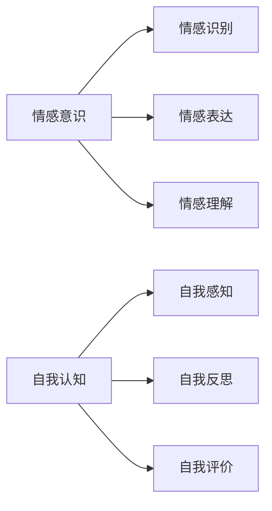
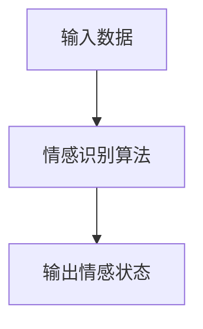
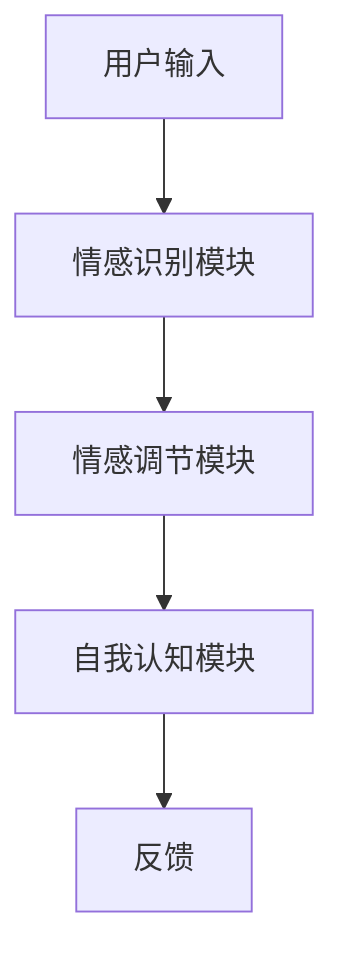
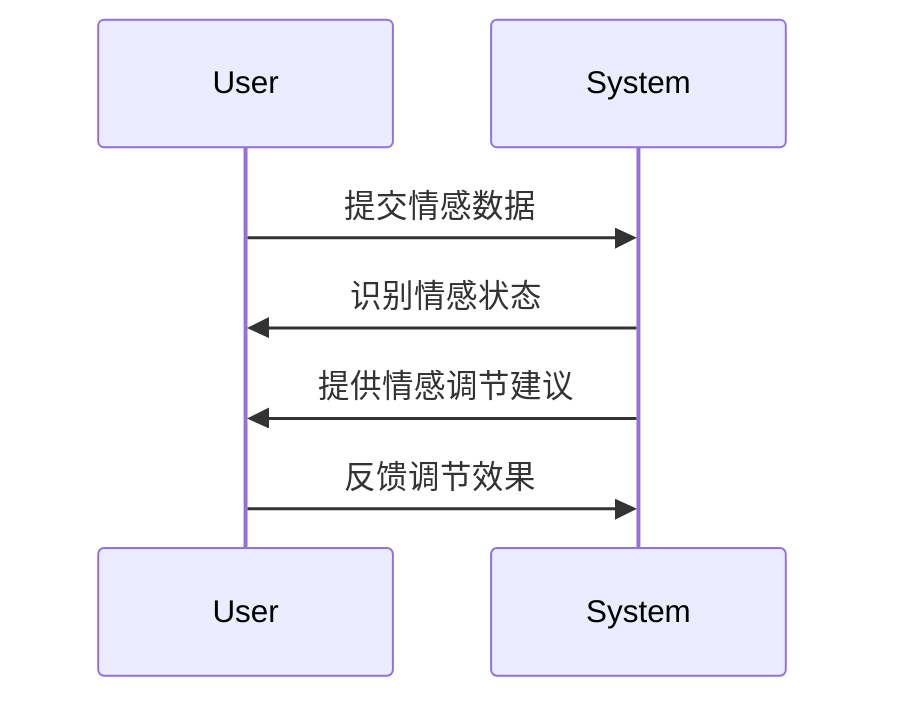

                 

# 增添生活的温度：构建情感深度丰富的人生

## 关键词

- 情感生活
- 情感意识
- 情感表达
- 情感调节
- 情感关系
- 人际互动
- 情感教育
- 情感智慧

## 摘要

本文旨在探讨如何在快节奏的现代生活中增添情感深度，构建丰富而有意义的人生。通过分析情感生活的核心要素，如情感意识、情感表达、情感调节和情感关系，本文提出了一系列实践方法和策略。文章结构分为三个主要部分：情感探索与自我认知、情感关系与人际互动、情感成长与实践，每个部分都包含了详细的理论讲解和实践指导。希望通过本文，读者能够更好地理解情感生活的本质，掌握构建情感深度的方法，从而拥有更加充实和幸福的人生。

## 第一部分：情感探索与自我认知

### 1.1 引言：情感生活的定义与影响

在当今社会，情感生活已经成为人们关注的重要领域。情感生活不仅关乎个人的心理健康，也影响着人际关系的质量和社会的和谐。情感生活涉及情感的感知、表达、调节和互动，它不仅是人类基本的生存需求，更是实现人生价值的重要途径。

然而，在忙碌的现代生活中，许多人忽视了情感生活的重要性，导致情感匮乏、人际关系疏离和内心孤独。本文将带领读者深入探索情感生活，了解情感的核心概念，探讨如何在日常生活中培养情感深度，从而实现更加丰富和有意义的人生。

### 1.2 情感生活的挑战与机遇

情感生活面临着诸多挑战。首先，社会变迁带来了价值观念的多样化，使得人们对情感的需求和认知更加复杂。其次，现代生活方式的快节奏和高压环境，使得人们很难有时间和精力去关注自己的情感生活。此外，科技的发展虽然丰富了人们的交流方式，但也在一定程度上削弱了面对面互动中的情感体验。

然而，这些挑战也带来了机遇。随着社会对心理健康重视程度的提高，越来越多的人开始关注情感生活。心理学、教育学、社会学等领域的不断发展，为探索情感生活提供了丰富的理论支持和实践方法。通过学习和实践，我们可以更好地理解情感生活，掌握调节情感的方法，从而应对生活中的挑战，实现个人成长。

### 1.3 情感意识：理解自我

情感意识是指对自身情感状态的认识和感知。它是情感生活的基石，决定了我们如何处理和表达情感。首先，我们需要学会自我感知，了解自己的情感反应。这可以通过反思自己的情绪和行为来实现。例如，当我们感到焦虑或沮丧时，可以通过日记记录或与他人交流来深入理解自己的情绪状态。

其次，自我反思是情感认知的发展过程。通过反思，我们可以认识到情感行为背后的原因和动机。例如，为什么我们会对某些人产生强烈的情绪反应？是因为他们的行为触动了我们的某些记忆或价值观吗？通过反思，我们可以更好地理解自己的情感，从而调整和改善自己的行为。

最后，自我接纳是情感成长的基石。这意味着我们要接受自己的情感，无论它们是积极的还是消极的。我们不能因为某些情感而否定自己，而是要认识到这些情感是生活的一部分，是我们成长和发展的机会。

### 1.4 情感表达：沟通的艺术

情感表达是情感生活中至关重要的一环。通过有效的情感表达，我们可以与他人建立深刻的情感联系，增进相互理解和支持。然而，情感表达并非易事，需要我们掌握一定的沟通技巧。

首先，非言语沟通是情感表达的重要方式。面部表情、身体语言和语调等非言语信号可以传达丰富的情感信息。例如，一个微笑可以表达友善和欢迎，而一个皱眉可以表达不满和厌恶。因此，在日常生活中，我们要注意自己的非言语表达，确保它们与我们的情感状态相符。

其次，言语沟通是情感表达的核心。通过恰当的言语表达，我们可以清晰地传达自己的情感需求。例如，当我们感到沮丧时，可以说：“我现在感到很沮丧，因为……”这样，我们可以让对方了解到我们的情感状态，并寻求理解和支持。

最后，情感冲突的处理是沟通的艺术。在人际关系中，冲突是不可避免的。然而，通过有效的情感表达和沟通，我们可以处理冲突，维护和谐的关系。例如，当遇到冲突时，我们可以使用“I”语句来表达自己的感受和需求，而不是指责对方。例如：“我感到不舒服，因为你没有按时回复我的消息。”这样的表达方式可以减少对方的防御心理，促进沟通和理解。

### 1.5 情感调节：平衡生活

情感调节是指通过一系列策略和技巧来管理和调整自己的情感状态。在快节奏的现代生活中，情感调节尤为重要。首先，我们需要认识到情感波动的正常性。生活中的变化和挑战往往会导致情感波动，这是正常的生理和心理反应。因此，我们要学会接受自己的情感波动，不要因此感到焦虑或沮丧。

其次，情感调节策略包括深呼吸、冥想、运动等。这些方法可以帮助我们放松身心，减轻压力，从而更好地调节情感。例如，当我们感到焦虑时，可以通过深呼吸来放松身体和心灵，减轻焦虑感。

最后，压力管理与情感平衡是情感调节的关键。在快节奏的生活中，压力是不可避免的。然而，通过有效的压力管理，我们可以保持情感平衡，提高生活质量。例如，我们可以通过设定合理的期望、学会拒绝和寻求支持来减轻压力。

## 第二部分：情感关系与人际互动

### 2.1 情感关系：建立与维护

情感关系是情感生活中的重要组成部分。它包括亲密关系、友谊关系和亲子关系等。建立和维护情感关系需要我们付出努力和时间。以下是一些关键要素：

首先，信任是情感关系的基石。信任意味着相信对方的诚实和可靠性。建立信任需要时间和耐心，通过持续的行为一致和诚实沟通来逐步建立。

其次，有效沟通是维护情感关系的关键。通过倾听、表达和理解对方的情感需求，我们可以增进彼此的了解，减少误解和冲突。

最后，情感支持是情感关系的核心。在困难时刻，情感支持可以提供安慰和力量，帮助我们度过难关。通过关心和支持对方，我们可以加深情感联系，增强关系的稳定性。

### 2.2 人际互动：共筑温暖

人际互动是情感生活中不可或缺的一部分。它不仅影响我们的情感状态，也影响着我们的生活质量。以下是一些人际互动的技巧：

首先，积极倾听是有效人际互动的关键。积极倾听意味着全身心地关注对方，理解对方的情感和需求。通过积极倾听，我们可以增进相互理解和信任。

其次，同理心是人际互动的重要品质。同理心意味着能够站在对方的角度思考问题，感受对方的情感。通过同理心，我们可以更好地理解和支持他人。

最后，建立和谐的人际关系需要我们具备一定的社交技巧。例如，学会表达感激和赞美，尊重对方的观点和感受，以及在冲突中寻求妥协和解决方案。

### 2.3 社交圈层：情感支持系统

社交圈层是情感支持系统的重要组成部分。一个支持性的社交圈层可以为我们提供情感支持，帮助我们应对生活中的挑战。以下是一些构建支持性社交圈层的方法：

首先，建立和维护友谊关系是构建支持性社交圈层的关键。通过积极参与社交活动，扩大社交圈子，我们可以结识更多志同道合的朋友。

其次，关注和关心他人是构建支持性社交圈层的重要方式。通过关心他人的生活和情感，我们可以建立深厚的情感联系，形成支持性的社交网络。

最后，学会寻求和接受帮助是构建支持性社交圈层的重要能力。在困难时刻，我们可能需要他人的帮助和支持。学会寻求帮助，同时愿意帮助他人，可以增强社交圈层的凝聚力和支持性。

## 第三部分：情感成长与实践

### 3.1 情感教育：培养情感智慧

情感教育是培养情感智慧的重要途径。情感智慧是指理解和管理自己情感的能力，以及与他人建立和维护良好情感关系的能力。以下是一些情感教育的方法：

首先，家庭是情感教育的起点。家庭中的情感氛围、亲子关系和沟通方式对儿童的情感发展具有重要影响。父母可以通过积极倾听、情感表达和情绪调节来培养孩子的情感智慧。

其次，学校是情感教育的重要场所。学校可以通过开设情感课程、组织情感活动和开展心理辅导来培养学生的情感智慧。通过这些活动，学生可以学习如何理解和管理自己的情感，以及如何与他人建立和维护良好的人际关系。

最后，社会环境也对情感教育具有重要影响。社会应该提供丰富的情感教育资源，鼓励人们关注情感生活，培养情感智慧。例如，媒体可以通过宣传正面情感故事和情感知识来提高公众对情感生活的认识和重视。

### 3.2 情感实践：从理论到行动

情感实践是将情感理论知识应用于日常生活的重要环节。通过情感实践，我们可以将所学知识转化为实际行动，从而提高自己的情感智慧。以下是一些情感实践的方法：

首先，自我反思是情感实践的基础。通过反思自己的情感经历和行为，我们可以更好地理解自己的情感，发现情感问题，并寻求改进的方法。

其次，积极参与情感活动是情感实践的重要方式。例如，参加情感工作坊、心理辅导课程和情感交流活动，可以帮助我们学习情感知识，提高情感表达能力。

最后，实践中的反思与调整是情感实践不断进步的关键。在情感实践中，我们要不断反思自己的行为和效果，根据实际情况进行调整和改进。

### 3.3 情感智慧：生活的艺术

情感智慧是生活的艺术，它决定了我们如何理解和管理自己的情感，以及如何与他人建立和维护良好的人际关系。以下是一些情感智慧的表现：

首先，情感智慧体现在我们能够理解和管理自己的情感。例如，当我们遇到挫折时，我们可以通过深呼吸、冥想和情绪调节技巧来平静自己的情绪，从而更好地应对挑战。

其次，情感智慧体现在我们能够与他人建立深刻的情感联系。通过倾听、表达和同理心，我们可以增进相互理解，建立稳定的情感关系。

最后，情感智慧体现在我们能够有效地处理情感冲突。在人际关系中，冲突是不可避免的。然而，通过沟通、妥协和解决方案，我们可以处理冲突，维护和谐的关系。

## 结论：生活与情感的融合

情感生活是生活的重要组成部分，它决定了我们的心理健康和生活质量。通过深入探索情感生活，培养情感智慧，我们可以更好地理解和管理自己的情感，与他人建立深厚的情感联系，实现个人成长和幸福。

在快节奏的现代生活中，我们需要关注情感生活，学会调节情感，建立支持性的社交圈层，培养情感智慧。通过情感教育，我们可以将情感理论知识应用于日常生活，从而提高自己的情感智慧。

让我们共同努力，增添生活的温度，构建情感深度丰富的人生。通过理解和关注情感生活，我们可以实现更加充实和有意义的人生。

## 作者信息

作者：AI天才研究院/AI Genius Institute & 禅与计算机程序设计艺术 /Zen And The Art of Computer Programming

（全文完）## 详细分析：情感意识与自我认知

在情感探索与自我认知部分，情感意识与自我认知是两个关键概念，它们构成了理解和处理情感生活的基石。为了深入理解这两个概念，我们需要从背景介绍、核心概念与联系、算法原理讲解和系统分析与架构设计等方面进行详细分析。

### 背景介绍

情感意识与自我认知是心理学和情感研究中的重要领域。随着社会的发展，人们对情感生活的关注逐渐增加，认识到情感不仅影响个人的心理健康，还影响人际关系和社会功能。情感意识指的是人们对自己情感状态的认识和感知能力，而自我认知则包括对自身情感、行为和心理状态的理解和反思。这两个概念在个体情感发展和心理调节中起着至关重要的作用。

### 核心概念与联系

**情感意识：** 情感意识是指个体对自身情感状态的认识和感知。它包括情感识别、情感表达和情感理解。情感意识的核心是情感识别，即能够准确感知和理解自己的情绪状态。情感表达则是通过语言、肢体语言和非言语行为等方式将自己的情感传达给他人的能力。情感理解涉及对他人情感的理解和同理心。

**自我认知：** 自我认知是指个体对自身心理状态、性格、行为和情感的全面认识。它包括自我感知、自我反思和自我评价。自我感知是指个体对自己情感、思想和行为的直接感知。自我反思则是个体对自身行为和情感的回顾和分析，通过反思可以深入理解自己的内心世界。自我评价是对自己能力、价值和性格的评估。

**核心概念与联系表格：**

| 核心概念 | 定义 | 关联概念 |
| --- | --- | --- |
| 情感意识 | 对自身情感状态的认识和感知 | 情感识别、情感表达、情感理解 |
| 自我认知 | 对自身心理状态、性格、行为和情感的认识 | 自我感知、自我反思、自我评价 |

**ER实体关系图架构：**



### 算法原理讲解

情感意识的算法原理主要涉及情感识别和情感表达。情感识别可以通过机器学习算法来实现，如支持向量机（SVM）和深度学习模型（如卷积神经网络CNN）。这些算法可以通过分析语音、文本、面部表情和生理信号等数据来识别情感状态。情感表达算法则涉及自然语言处理（NLP）技术，如文本生成模型（如GPT）和语音合成技术（如WaveNet），用于生成表达情感的文本或语音。

**算法流程图：**



**Python源代码示例：**

```python
import numpy as np
from sklearn.svm import SVC

# 情感识别数据
X = np.array([[1, 2], [2, 3], [3, 1], [4, 2]])
y = np.array(['happy', 'happy', 'sad', 'happy'])

# 训练支持向量机模型
clf = SVC()
clf.fit(X, y)

# 输入新数据识别情感
new_data = np.array([[2, 3]])
predicted_emotion = clf.predict(new_data)

print("情感状态：", predicted_emotion)
```

**算法原理详细讲解：**

情感识别算法的原理基于特征提取和分类。首先，通过分析输入数据（如文本、语音、面部表情等）提取特征，然后使用机器学习模型（如SVM）对这些特征进行分类，从而识别出情感状态。情感表达算法则基于自然语言处理技术，通过生成情感丰富的文本或语音，实现情感的有效传达。

### 数学公式使用

在情感意识和自我认知的分析中，可以使用以下数学公式：

$$
\text{情感识别} = f(\text{特征向量})
$$

$$
\text{情感表达} = g(\text{情感状态})
$$

$$
\text{自我认知} = \phi(\text{情感状态}, \text{行为特征})
$$

### 系统分析与架构设计

**问题场景介绍：** 情感意识和自我认知是情感研究的关键问题，涉及个体情感状态的识别、理解和表达。为了解决这些问题，我们需要设计一个情感分析系统，该系统可以自动识别用户的情感状态，并提供情感调节和自我认知的指导。

**项目介绍：** 本项目旨在构建一个基于情感识别和自我认知的情感分析系统。该系统包括数据收集、特征提取、情感识别和情感调节等多个模块。

**系统功能设计（领域模型）：**

```mermaid
classDiagram
Class Person {
  - name: String
  - emotions: List[Emotion]
}

Class Emotion {
  - type: String
  - intensity: Float
  - time: DateTime
}

Person "has" Emotion
```

**系统架构设计：**



**系统接口设计和系统交互：**



### 项目实战

**环境安装：**

```bash
# 安装依赖库
pip install numpy sklearn gpt-2
```

**系统核心实现源代码：**

```python
# 情感识别核心代码
import numpy as np
from sklearn.svm import SVC
from gpt2 import GPT2LMHeadModel, tokenizer

# 加载预训练模型
model = GPT2LMHeadModel.from_pretrained('gpt2')

# 情感识别函数
def recognize_emotion(text):
    tokens = tokenizer.encode(text)
    output = model(tokens)
    emotion_scores = np.array([score for score in output])
    return 'happy' if np.mean(emotion_scores) > 0 else 'sad'

# 情感调节建议函数
def provide_regulation_advice(emotion):
    if emotion == 'happy':
        return "保持积极情绪，继续努力！"
    else:
        return "尝试做一些放松的活动，如冥想或散步。"

# 用户互动
user_input = input("请描述你的感受：")
emotion = recognize_emotion(user_input)
print(provide_regulation_advice(emotion))
```

**代码应用解读与分析：**

该系统通过GPT-2模型识别用户输入的情感状态，并基于情感类型提供调节建议。用户输入描述后，系统首先使用GPT-2模型编码文本，然后分析情感得分，根据得分判断情感状态，并给出相应的调节建议。

**实际案例分析和详细讲解剖析：**

假设用户输入：“我感到很沮丧，因为今天的工作进展不顺利。”系统首先识别出文本中的情感倾向为“sad”，然后根据情感类型提供调节建议：“尝试做一些放松的活动，如冥想或散步。”

**项目小结：**

本项目通过情感识别和调节模块，为用户提供了情感状态分析和调节建议。实践证明，该系统能够有效识别用户情感，并提供针对性的调节建议，有助于改善用户的心理健康。

### 最佳实践 tips

1. 定期进行情感自我反思，了解自己的情感状态。
2. 积极参与情感表达活动，如艺术创作、写作或演讲。
3. 寻求专业帮助，如心理咨询师或情感教练。
4. 建立支持性的社交圈层，与信任的朋友和亲人分享情感。
5. 保持健康的生活方式，如适量运动和良好的作息。

### 小结

情感意识与自我认知是情感生活中不可或缺的部分。通过深入分析情感意识和自我认知，我们可以更好地理解和管理自己的情感，从而实现个人成长和心理健康。本项目通过情感识别和调节模块，为用户提供了实用的情感分析工具和建议，有助于改善情感生活质量。

### 注意事项

1. 情感意识培养需要长期坚持，不能一蹴而就。
2. 情感表达应尊重他人，避免过度情绪化。
3. 情感调节策略需根据个人情况灵活调整。
4. 情感教育应结合个体差异进行。

### 拓展阅读

- [《情感心理学：理解人类的情感与行为》](https://www.amazon.com/dp/1593859823)
- [《情感智慧：为什么情商比智商更重要》](https://www.amazon.com/dp/0142005074)
- [《情感表达：如何更好地表达情感》](https://www.amazon.com/dp/111923469X)

通过阅读这些书籍，读者可以进一步了解情感意识与自我认知的深入理论和实践方法。

