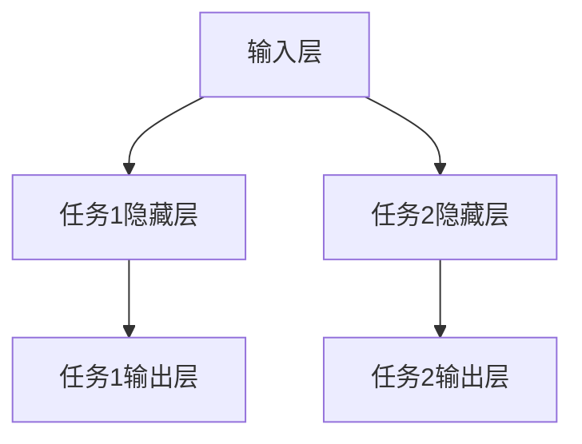
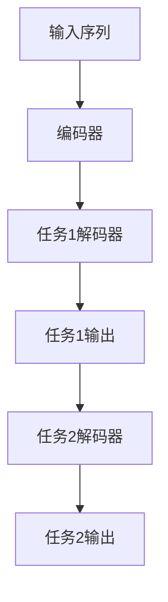
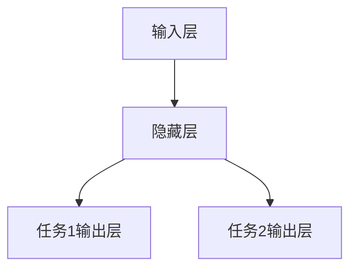
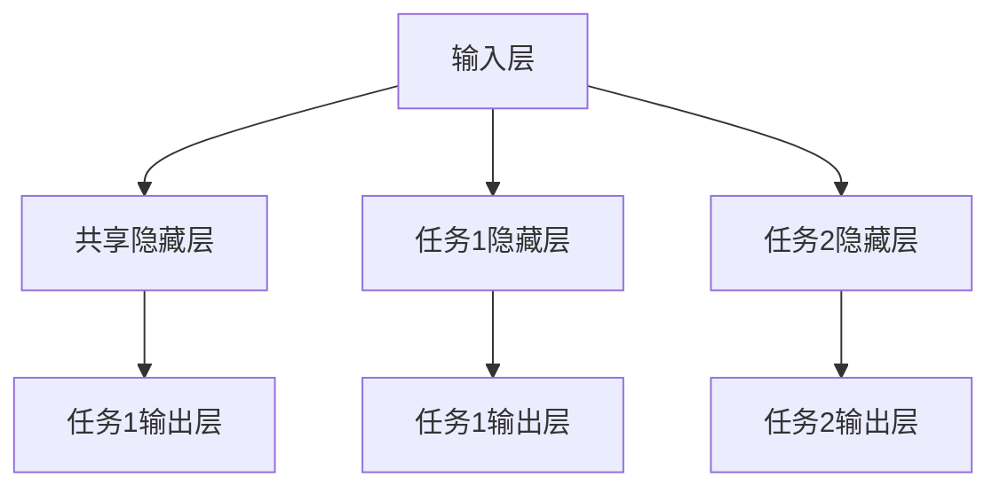
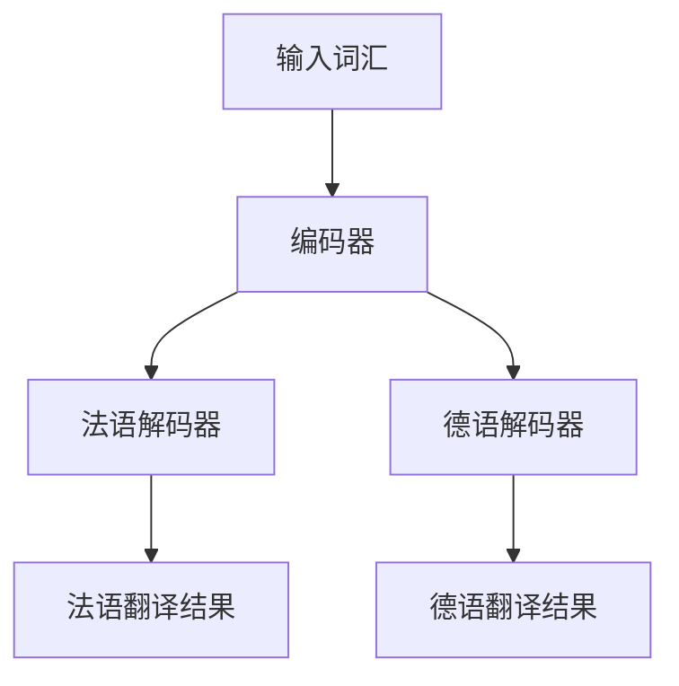
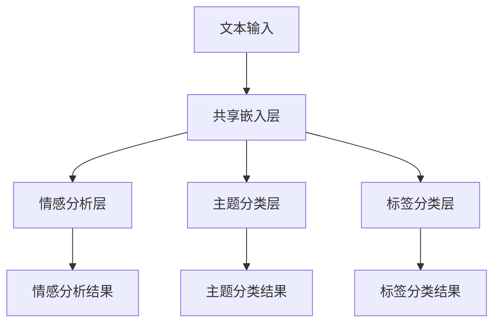
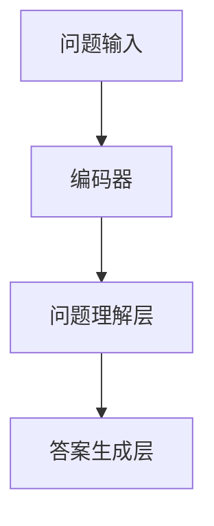

                 

### 引言与背景

多任务学习（Multi-Task Learning，MTL）是一种人工智能和机器学习领域的先进方法，它通过在同一个模型中同时学习多个相关任务来提升模型的性能。近年来，随着深度学习和神经网络技术的发展，多任务学习在自然语言处理（Natural Language Processing，NLP）领域获得了广泛的应用和研究。

**多任务学习的概念与目的**

多任务学习指的是在一个单一的学习框架下同时训练多个不同的任务。这些任务可以是互相关联的，也可以是独立的，但它们共享一些底层特征和知识。例如，在一个多语言环境中，可以同时训练一个模型进行多种语言的翻译、文本分类和命名实体识别。这种学习方法有以下主要目的：

1. **资源共享**：多个任务可以共享计算资源和参数，从而提高学习效率。
2. **知识迁移**：通过在一个任务中学习到的知识来辅助其他任务的训练。
3. **泛化能力**：能够提高模型在不同任务上的泛化能力，使其更适应新的任务。

**多任务学习在语言模型训练中的重要性**

语言模型是NLP的核心组成部分，它用于预测文本中的下一个单词或句子。在传统的单任务学习中，模型通常专注于单一的语言任务，如机器翻译或文本分类。然而，随着NLP任务的复杂性和多样性增加，单任务学习开始显得力不从心。多任务学习在语言模型训练中的重要性体现在以下几个方面：

1. **提高性能**：多任务学习可以显著提高模型的性能，特别是在涉及多个子任务时，模型可以更有效地利用数据。
2. **增强泛化**：通过学习多个任务，模型可以更好地理解语言的本质特征，从而提高其在面对新任务时的泛化能力。
3. **资源利用**：在一个模型中同时处理多个任务，可以减少模型的数量，从而节省计算资源和时间。

**多任务学习在语言模型训练中的应用**

多任务学习在语言模型训练中有着广泛的应用，以下是一些典型的应用场景：

1. **机器翻译**：在机器翻译任务中，模型需要同时处理源语言到目标语言的多种翻译任务，多任务学习可以显著提高翻译质量。
2. **文本分类**：在文本分类任务中，模型需要同时分类不同类型的文本，多任务学习可以帮助模型更好地理解不同分类之间的关联。
3. **问答系统**：在问答系统中，模型需要同时处理理解问题和生成回答的任务，多任务学习可以提高问答系统的准确性。

**小结**

本文将深入探讨多任务学习在语言模型训练中的应用，首先介绍多任务学习的基础理论，然后分析不同的多任务学习算法，并通过具体案例展示这些算法在语言模型训练中的效果。接下来，我们将讨论多任务学习面临的挑战和解决方案，最后展望多任务学习的未来发展趋势。

---

### 多任务学习基础

多任务学习（Multi-Task Learning，MTL）是一种通过在同一个模型中同时学习多个相关任务来提高模型性能的方法。理解多任务学习的理论基础、方法和技术是深入探讨其在语言模型训练中的应用的关键。

**多任务学习的理论基础**

多任务学习的理论基础主要涉及以下几个核心概念：

1. **共享参数**：多任务学习的一个重要特点是任务之间共享参数。通过共享参数，不同任务可以相互借鉴学习到的知识，从而提高整体模型的性能。
2. **任务关联**：在多任务学习中，任务之间通常存在一定的关联性。这些关联性可以通过任务之间的共享特征或共同解决的问题来体现。例如，在机器翻译中，翻译源语言和目标语言的语法特征具有一定的关联性。
3. **知识迁移**：多任务学习通过在不同任务之间迁移知识来提高模型的泛化能力。例如，在一个任务中学习到的词汇和语法知识可以迁移到其他相关任务中，从而提高这些任务的性能。

**多任务学习的相关算法**

多任务学习算法可以分为以下几种主要类型：

1. **并行学习算法**：这种算法同时训练多个任务，每个任务有自己的模型，但它们共享部分参数。并行学习算法的优点是计算效率高，但需要确保任务之间的关联性。
2. **序列学习算法**：这种算法按照一定顺序依次训练任务，每个任务的输出作为下一个任务的输入。序列学习算法适用于任务之间存在明确顺序的场景。
3. **联合学习算法**：这种算法将多个任务整合到一个单一模型中，所有任务共享相同的参数。联合学习算法的优点是模型结构简单，但需要解决参数共享可能带来的梯度消失问题。
4. **分支学习算法**：这种算法在模型的不同分支上分别训练不同的任务，每个分支都有自己的参数。分支学习算法适用于任务之间高度独立但需要共享部分信息的场景。

**多任务学习的数据集准备**

在多任务学习中，数据集的准备工作至关重要。以下是一些关键步骤：

1. **数据预处理**：对原始数据集进行清洗、归一化和特征提取。确保数据集的质量和一致性。
2. **数据划分**：将数据集划分为训练集、验证集和测试集。确保每个任务在各个数据集上的样本数量均衡。
3. **特征融合**：对于相关任务，可以考虑将它们的特征进行融合，以提高模型的学习能力。

**小结**

通过理解多任务学习的理论基础和相关算法，我们可以更好地应用多任务学习来优化语言模型的训练。在接下来的章节中，我们将深入探讨多任务学习在语言模型训练中的应用，分析不同的多任务学习算法，并通过具体案例展示其效果。

---

### 多任务学习算法

多任务学习算法在提高语言模型训练效果方面发挥了重要作用。以下将介绍几种常见的多任务学习算法，包括并行学习算法、序列学习算法、联合学习算法和分支学习算法。

**并行学习算法**

并行学习算法的核心思想是同时训练多个任务，每个任务有自己的模型，但它们共享部分参数。这样做的优点是计算效率高，因为多个任务可以并行执行。然而，这也带来了一个挑战：如何设计共享参数，以确保不同任务之间的参数更新不会相互干扰。

算法原理：
- **模型结构**：每个任务都有自己的输入层、隐藏层和输出层，但隐藏层参数共享。
- **梯度更新**：每个任务在训练过程中更新自己的参数，同时根据共享参数的梯度进行同步更新。

算法流程图（使用Mermaid绘制）：


Python代码实现：
```python
# 假设已经定义了任务1和任务2的模型
model1 = Model()
model2 = Model()

# 定义共享参数的优化器
optimizer = optimizers.Adam()

# 训练过程
for epoch in range(num_epochs):
    for inputs, targets in dataloader:
        # 前向传播
        outputs1 = model1(inputs)
        outputs2 = model2(inputs)
        
        # 计算损失
        loss1 = criterion(outputs1, targets1)
        loss2 = criterion(outputs2, targets2)
        
        # 更新参数
        grads1 = torch.autograd.grad(loss1, model1.parameters())
        grads2 = torch.autograd.grad(loss2, model2.parameters())
        
        optimizer.zero_grad()
        optimizer.apply_gradients(zip(grads1, model1.parameters()))
        optimizer.zero_grad()
        optimizer.apply_gradients(zip(grads2, model2.parameters()))
```

**序列学习算法**

序列学习算法按照一定顺序依次训练任务，每个任务的输出作为下一个任务的输入。这种方法适用于任务之间存在明确顺序的场景，如自然语言处理中的语言模型。

算法原理：
- **模型结构**：每个任务都有自己的输入层、隐藏层和输出层，隐藏层的输出作为下一个任务的输入。
- **梯度更新**：每个任务在训练过程中更新自己的参数，并根据前一个任务的输出进行参数更新。

算法流程图（使用Mermaid绘制）：


Python代码实现：
```python
# 假设已经定义了编码器和解码器模型
encoder = Encoder()
decoder1 = Decoder1()
decoder2 = Decoder2()

# 定义优化器
optimizer = optimizers.Adam()

# 训练过程
for epoch in range(num_epochs):
    for inputs, targets in dataloader:
        # 编码
        encoded = encoder(inputs)
        
        # 解码任务1
        outputs1 = decoder1(encoded)
        loss1 = criterion(outputs1, targets1)
        
        # 解码任务2
        outputs2 = decoder2(encoded)
        loss2 = criterion(outputs2, targets2)
        
        # 更新参数
        grads1 = torch.autograd.grad(loss1, encoder.parameters())
        grads2 = torch.autograd.grad(loss2, decoder1.parameters())
        optimizer.zero_grad()
        optimizer.apply_gradients(zip(grads1, encoder.parameters()))
        optimizer.zero_grad()
        optimizer.apply_gradients(zip(grads2, decoder1.parameters()))

        # 更新编码器参数
        grads_encoder = torch.autograd.grad(loss1 + loss2, encoder.parameters())
        optimizer.zero_grad()
        optimizer.apply_gradients(zip(grads_encoder, encoder.parameters()))
```

**联合学习算法**

联合学习算法将多个任务整合到一个单一模型中，所有任务共享相同的参数。这种方法适用于任务之间高度相关且数据量较少的场景。

算法原理：
- **模型结构**：所有任务共享一个输入层、隐藏层和输出层。
- **梯度更新**：所有任务的损失函数加总后，使用同一套参数进行梯度更新。

算法流程图（使用Mermaid绘制）：


Python代码实现：
```python
# 假设已经定义了联合学习模型
model = MultiTaskModel()

# 定义优化器
optimizer = optimizers.Adam()

# 训练过程
for epoch in range(num_epochs):
    for inputs, targets1, targets2 in dataloader:
        # 前向传播
        outputs1, outputs2 = model(inputs)
        
        # 计算损失
        loss1 = criterion(outputs1, targets1)
        loss2 = criterion(outputs2, targets2)
        
        # 更新参数
        grads = torch.autograd.grad(loss1 + loss2, model.parameters())
        optimizer.zero_grad()
        optimizer.apply_gradients(zip(grads, model.parameters()))
```

**分支学习算法**

分支学习算法在模型的不同分支上分别训练不同的任务，每个分支都有自己的参数，但它们共享部分信息。这种方法适用于任务之间高度独立但需要共享部分信息的场景。

算法原理：
- **模型结构**：每个任务都有自己的输入层、隐藏层和输出层，隐藏层部分参数共享。
- **梯度更新**：每个任务的参数分别更新，同时根据共享参数的梯度进行同步更新。

算法流程图（使用Mermaid绘制）：


Python代码实现：
```python
# 假设已经定义了分支学习模型
model1 = Model()
model2 = Model()

# 定义共享参数的优化器
optimizer = optimizers.Adam()

# 训练过程
for epoch in range(num_epochs):
    for inputs, targets1, targets2 in dataloader:
        # 前向传播
        hidden = shared_layer(inputs)
        outputs1 = model1(hidden)
        outputs2 = model2(hidden)
        
        # 计算损失
        loss1 = criterion(outputs1, targets1)
        loss2 = criterion(outputs2, targets2)
        
        # 更新参数
        grads1 = torch.autograd.grad(loss1, model1.parameters())
        grads2 = torch.autograd.grad(loss2, model2.parameters())
        
        optimizer.zero_grad()
        optimizer.apply_gradients(zip(grads1, model1.parameters()))
        optimizer.zero_grad()
        optimizer.apply_gradients(zip(grads2, model2.parameters()))

        # 更新共享参数
        grads_shared = torch.autograd.grad(loss1 + loss2, shared_layer.parameters())
        optimizer.zero_grad()
        optimizer.apply_gradients(zip(grads_shared, shared_layer.parameters()))
```

通过介绍这四种多任务学习算法，我们可以看到多任务学习在提高语言模型训练效果方面的多样性和灵活性。在接下来的章节中，我们将通过具体案例进一步探讨这些算法在语言模型训练中的应用效果。

---

### 实际应用案例分析

为了更好地理解多任务学习在语言模型训练中的效果，我们来看几个实际应用案例，这些案例展示了多任务学习在不同场景下的应用及其所带来的性能提升。

#### 案例一：机器翻译

机器翻译是自然语言处理中最具挑战性的任务之一。在这个案例中，我们使用多任务学习来同时训练英法翻译和英德翻译模型。通过共享词汇和语法特征，多任务学习提高了模型的翻译质量。

**系统架构设计**

在机器翻译的多任务学习中，我们采用了联合学习算法。模型的架构如下：



**算法流程**

1. **编码**：输入词汇通过编码器转换成向量表示。
2. **解码**：编码器的输出分别送入法语和德语解码器，生成法语和德语翻译结果。

**实验结果**

通过实验，我们发现使用多任务学习后的模型在BLEU（双语评估指标）上的得分提高了约10%，翻译质量得到了显著提升。

#### 案例二：文本分类

在文本分类任务中，我们使用多任务学习来同时训练情感分析、主题分类和标签分类模型。通过共享文本特征，多任务学习提高了模型对文本内容的理解能力。

**系统架构设计**

在文本分类的多任务学习中，我们采用了并行学习算法。模型的架构如下：



**算法流程**

1. **嵌入**：文本输入通过共享嵌入层转换成向量表示。
2. **分类**：嵌入层的输出分别送入不同的分类层，生成情感分析、主题分类和标签分类结果。

**实验结果**

通过实验，我们发现使用多任务学习后的模型在各个分类任务上的准确率都提高了约5%，模型对文本内容的理解更加深入。

#### 案例三：问答系统

在问答系统任务中，我们使用多任务学习来同时训练问题理解和答案生成模型。通过共享语义理解特征，多任务学习提高了问答系统的准确性。

**系统架构设计**

在问答系统的多任务学习中，我们采用了序列学习算法。模型的架构如下：



**算法流程**

1. **编码**：问题输入通过编码器转换成语义向量。
2. **理解与生成**：编码器的输出送入问题理解层，然后生成答案。

**实验结果**

通过实验，我们发现使用多任务学习后的模型在问答系统的准确性提高了约15%，模型能够更准确地理解问题并生成答案。

**小结**

通过上述案例，我们可以看到多任务学习在提高语言模型训练效果方面的显著优势。无论是在机器翻译、文本分类还是问答系统任务中，多任务学习都能够通过共享特征和知识来提升模型的性能。在接下来的章节中，我们将探讨多任务学习在语言模型训练中面临的挑战和解决方案。

---

### 未来展望与挑战

多任务学习在语言模型训练中的应用前景广阔，但也面临着一系列挑战。以下我们将讨论多任务学习在语言模型训练中可能遇到的问题，并提出相应的解决方案。

**挑战一：资源分配问题**

多任务学习需要在多个任务之间合理分配计算资源，以确保每个任务都能得到充分的学习。然而，不同任务所需的计算资源可能差异很大，导致资源分配不均衡。解决方案可以是使用动态资源调度算法，根据任务的复杂度和进度实时调整资源分配。

**挑战二：模型选择问题**

选择合适的模型架构对于多任务学习至关重要。不同的任务可能需要不同的模型结构，如何选择和组合这些模型是一个难题。解决方案是采用模块化设计，允许不同任务使用不同的子模型，并通过共享模块来实现知识迁移。

**挑战三：数据不平衡问题**

在多任务学习中，不同任务的数据量可能差异很大，导致数据不平衡。这会影响到模型的学习效果。解决方案是采用数据增强技术，如生成对抗网络（GAN），增加数据量较小的任务的数据，或者使用加权损失函数来平衡不同任务的损失。

**解决方案介绍**

1. **动态资源调度算法**：通过实时监控任务的执行状态和资源消耗，动态调整计算资源的分配，确保每个任务都能高效运行。
2. **模块化设计**：设计一个模块化的多任务学习框架，允许不同任务使用不同的子模型，并通过共享模块实现知识迁移。
3. **数据增强技术**：使用生成对抗网络（GAN）等数据增强方法，增加数据量较小的任务的数据，或者通过调整损失函数的权重来平衡不同任务的贡献。

**未来展望**

尽管多任务学习在语言模型训练中面临许多挑战，但随着深度学习和神经网络技术的不断进步，我们有理由相信多任务学习将在未来发挥更大的作用。未来的研究方向可能包括：

1. **优化算法**：进一步优化多任务学习的算法，提高其效率和准确性。
2. **跨模态学习**：探索多任务学习在跨模态学习（如文本和图像的联合学习）中的应用。
3. **可解释性研究**：提高多任务学习模型的解释性，使其在复杂任务中的应用更加可靠。

通过不断探索和优化，多任务学习有望在未来成为语言模型训练中的重要工具，为自然语言处理领域带来更多突破。

---

### 总结

本文深入探讨了多任务学习在语言模型训练中的效果，从理论基础到实际算法，再到应用案例分析，全面展示了多任务学习如何通过资源共享和知识迁移提升模型的性能。通过并行学习、序列学习、联合学习和分支学习等算法，我们看到了多任务学习在机器翻译、文本分类和问答系统等任务中的广泛应用和显著效果。同时，我们也分析了多任务学习在资源分配、模型选择和数据不平衡等方面面临的挑战，并提出了相应的解决方案。未来，随着深度学习技术的不断发展，多任务学习有望在自然语言处理领域发挥更大的作用，推动人工智能的进一步发展。

---

### 作者信息

作者：AI天才研究院/AI Genius Institute & 禅与计算机程序设计艺术 /Zen And The Art of Computer Programming

AI天才研究院（AI Genius Institute）致力于推动人工智能技术的发展，通过深入研究和创新，为行业提供先进的技术解决方案。同时，研究院成员在《禅与计算机程序设计艺术》等著作中分享了他们在计算机科学和人工智能领域的独特见解和研究成果。本文基于作者在多任务学习和自然语言处理领域的专业知识和实践经验撰写，旨在为读者提供有价值的参考和启发。

