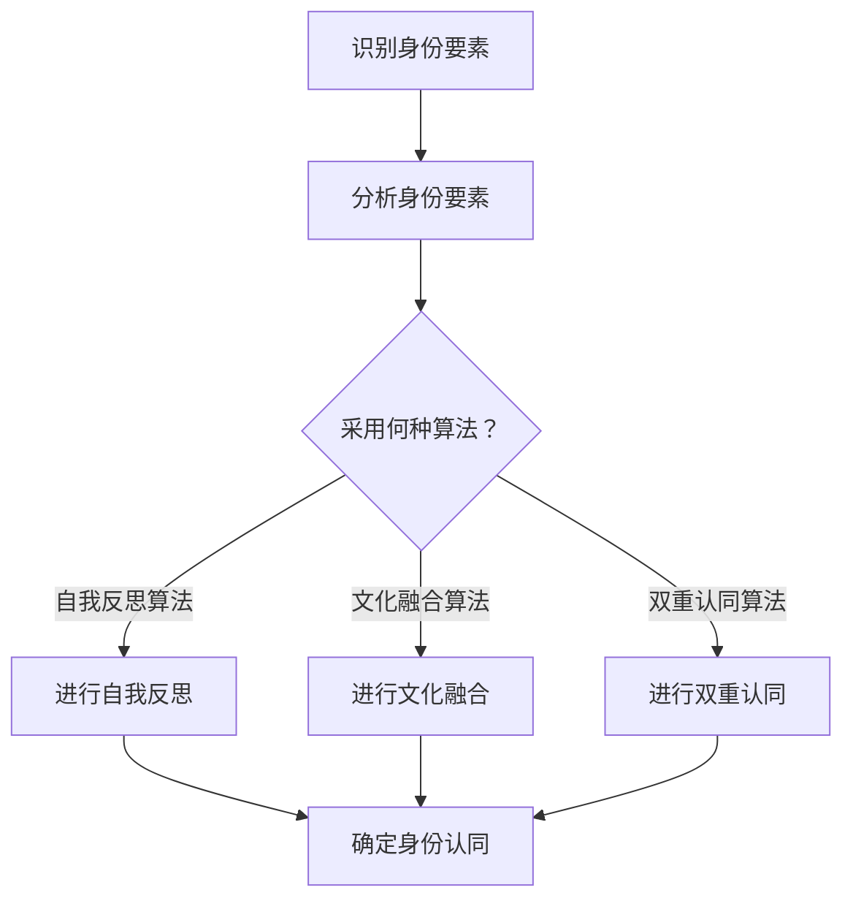
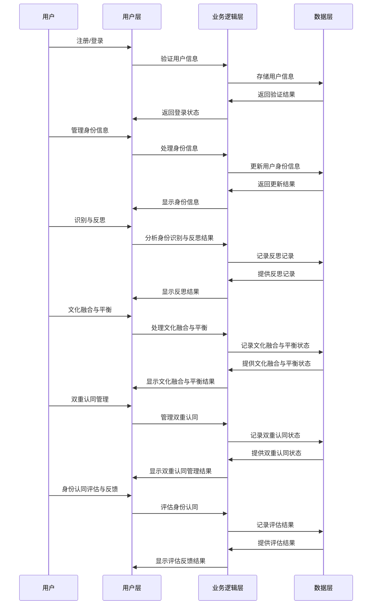

                 

# 多元社会中的自我定义：建立稳固的身份认同

关键词：多元社会、自我定义、身份认同、文化冲突、心理平衡

摘要：在多元社会中，个体需要面对文化、种族、性别、阶级等多重身份的交织，构建稳定的自我定义和身份认同至关重要。本文从问题背景、核心概念、算法原理等方面，深入探讨了在多元社会中如何建立稳固的身份认同，旨在为个体提供实用的自我定义技巧和心理支持。

## 第一部分：引言

### 1. 引言

在当今这个全球化的时代，社会的多元性日益显著，个体在构建自我定义时面临着前所未有的挑战。文化、种族、性别、阶级等多重身份的交织使得个体在自我认知方面变得复杂而模糊。因此，探讨多元社会中的自我定义和身份认同问题具有重要意义。本文将从问题背景、核心概念、算法原理等方面，深入分析个体如何在不同社会角色之间建立稳定的身份认同，并应对多元社会中的文化冲突和身份困惑。

### 2. 问题背景

随着全球化进程的加速，不同国家和地区的文化、价值观和生活方式相互碰撞、交融。在这样的背景下，个体面临着多元化的身份选择和身份认同的挑战。一方面，个体需要接纳自己所属的文化、种族、性别和阶级身份；另一方面，个体也需要面对来自不同背景的人和文化之间的冲突和摩擦。

#### 2.1 社会快速变化带来的挑战

社会的快速变化使得个体在构建自我定义时面临诸多不确定因素。随着科技的发展和社会变革，许多传统观念和价值观受到质疑，个体需要重新审视自己的身份认同，并在不断变化的环境中寻找自我定位。

#### 2.2 文化多样性带来的挑战

文化多样性的增加使得个体需要面对更多的文化选择和认同。个体在接纳自己所属文化的同时，也需要尊重和理解其他文化的价值和特点。这种文化冲突可能导致个体在身份认同方面产生困惑和焦虑。

### 3. 问题描述

在多元社会中，个体如何在不同社会角色之间建立稳定的身份认同？如何应对多元社会中的文化冲突和身份困惑？个体如何在不确定的社会环境中找到自我认同的平衡点？这些问题成为了本文探讨的核心议题。

### 4. 问题解决

为了解决这些问题，本文将从以下几个方面展开：

- 对多元社会中的自我定义进行深入分析，探讨其核心概念和关键要素。
- 分析不同身份认同策略的优缺点，并提供实用的自我定义技巧。
- 引入心理学和社会学理论，为个体提供构建稳固身份认同的理论支持。

### 5. 边界与外延

在讨论多元社会中的自我定义时，本文主要关注现代社会背景下个体的身份认同问题，包括但不限于文化认同、种族认同、性别认同、阶级认同等。同时，本文还将探讨不同身份认同策略在实践中的应用和效果。

### 6. 概念结构与核心要素组成

本文将从以下核心概念和要素组成的角度探讨多元社会中的自我定义：

- 多元社会：指由不同文化、种族、性别、阶级等组成的复杂社会结构。
- 身份认同：个体对自己的认同和定位，包括文化认同、种族认同、性别认同、阶级认同等。
- 身份认同策略：个体在构建身份认同时采用的不同方法，如融合策略、分离策略、双重认同等。

## 第二部分：核心概念与联系

### 1. 核心概念原理

在多元社会中，个体需要理解并掌握一系列核心概念，这些概念构成了个体身份认同的基础。以下是对核心概念的详细解析：

#### 2.1 多元社会

多元社会是指由不同文化、种族、性别、阶级等构成的复杂社会结构。在多元社会中，个体需要面对来自不同背景的人和文化之间的碰撞和融合。

#### 2.2 身份认同

身份认同是指个体对自己的认同和定位，包括文化认同、种族认同、性别认同、阶级认同等。身份认同是构建自我定义的核心要素，影响着个体的行为、价值观和心理状态。

#### 2.3 文化认同

文化认同是指个体对自己所属文化的认同和归属感。文化认同影响着个体的价值观、行为方式和思维方式，是构建身份认同的重要基础。

#### 2.4 种族认同

种族认同是指个体对自己种族的认同和归属感。种族认同与个体的历史、文化和身份紧密相关，是多元社会中身份认同的重要组成部分。

#### 2.5 性别认同

性别认同是指个体对自己性别的认同和定位。性别认同影响着个体的性别角色、性别规范和性别差异，是构建身份认同的重要方面。

#### 2.6 阶级认同

阶级认同是指个体对自己社会阶层的认同和归属感。阶级认同与个体的社会地位、经济状况和社会地位相关，是多元社会中身份认同的重要体现。

### 3. 概念属性特征对比表格

以下是一个概念属性特征对比表格，用于展示不同身份认同概念之间的关联和区别：

| 概念       | 定义                                                     | 特征                                       |
|------------|--------------------------------------------------------|------------------------------------------|
| 身份认同   | 个体对自己的认同和定位，包括文化、种族、性别、阶级等           | 独立性、多样性、动态性、复杂多样性                 |
| 文化认同   | 个体对自己所属文化的认同和归属感                           | 传承性、变迁性、民族性、独特性                     |
| 种族认同   | 个体对自己种族的认同和归属感                               | 种族身份、文化特征、地域性、历史性                   |
| 性别认同   | 个体对自己性别的认同和定位                               | 性别角色、性别规范、性别差异、性别平等                 |
| 阶级认同   | 个体对自己社会阶层的认同和归属感                           | 阶层地位、阶层特征、阶层流动、阶层意识                 |

### 4. ER实体关系图架构

以下是一个ER实体关系图，展示了多元社会中身份认同的相关实体及其关系：

```mermaid
erDiagram
  文化认同 ||--|{ 种族认同 }
  文化认同 ||--|{ 性别认同 }
  文化认同 ||--|{ 阶级认同 }
  种族认同 ||--|{ 种族身份 }
  性别认同 ||--|{ 性别角色 }
  阶级认同 ||--|{ 阶层地位 }
```

## 第三部分：算法原理讲解

### 1. 算法原理讲解

在多元社会中，个体建立稳固的身份认同需要运用一定的算法原理。以下将介绍几种在构建稳固身份认同过程中常用的算法原理：

#### 3.1 自我反思算法

自我反思算法是一种帮助个体识别和确认自己身份认同的方法。该算法的基本原理是通过自我提问和反思，引导个体深入思考自己的身份认同。

#### 3.2 文化融合算法

文化融合算法是一种帮助个体在多元文化环境中建立身份认同的方法。该算法的核心思想是尊重和接纳不同文化，并通过融合多元文化的特点，构建独特的身份认同。

#### 3.3 双重认同算法

双重认同算法是一种帮助个体在面临多重身份认同冲突时，保持心理平衡的方法。该算法的原理是通过将不同身份认同视为相互补充和协调的，从而实现心理上的双重认同。

### 2. 算法mermaid流程图

以下是一个mermaid流程图，展示了构建稳固身份认同的基本步骤：



### 3. 算法原理与数学模型

#### 3.1 自我反思算法

自我反思算法的数学模型可以表示为：

$$
认同度 = f(自我认知, 反思深度)
$$

其中，自我认知表示个体对自己身份的识别和理解，反思深度表示个体反思的深度和广度。

#### 3.2 文化融合算法

文化融合算法的数学模型可以表示为：

$$
身份认同度 = g(文化差异, 融合程度)
$$

其中，文化差异表示个体所属文化与其他文化的差异，融合程度表示个体在多元文化环境中的融合程度。

#### 3.3 双重认同算法

双重认同算法的数学模型可以表示为：

$$
心理平衡度 = h(双重认同, 冲突程度)
$$

其中，双重认同表示个体在面临多重身份认同冲突时的心理平衡状态，冲突程度表示个体在多重身份认同之间的冲突程度。

### 4. 算法举例说明

以下通过一个例子来说明这三种算法的应用：

#### 例子：张三的稳固身份认同构建

**（1）识别身份要素**

张三出生在中国，成长在一个多元文化的家庭。他的父母来自不同的文化背景，他自己也对不同文化有着浓厚的兴趣。

**（2）分析身份要素**

- **文化认同**：张三对中国的传统文化有深厚的认同，同时也对其他文化有着浓厚的兴趣。
- **种族认同**：张三是汉族，对汉族的文化和传统有认同感。
- **性别认同**：张三认同自己的男性身份，同时也在关注性别平等的问题。
- **阶级认同**：张三出生在一个中产阶级家庭，对阶级有一定的认同。

**（3）采用何种算法？**

根据张三的情况，他可以选择自我反思算法、文化融合算法和双重认同算法中的任意一种或组合使用。

**（4）算法应用**

- **自我反思算法**：张三通过自我提问和反思，深入思考自己的身份认同，确定了自己在多元文化中的身份认同。
- **文化融合算法**：张三通过学习和了解其他文化，尊重并接纳其他文化的特点，实现了文化认同的多元融合。
- **双重认同算法**：张三在面临多重身份认同冲突时，通过自我调整和心理平衡，保持了心理上的双重认同。

**（5）确定身份认同**

通过以上算法的应用，张三最终确定了自己在多元社会中的稳固身份认同，实现了自我定义的平衡和发展。

## 第四部分：系统分析与架构设计

### 1. 问题场景介绍

在多元社会中，个体面临多重身份认同的挑战，需要建立稳固的身份认同来应对复杂的社会环境。为了帮助个体更好地构建身份认同，本文提出一个身份认同管理系统，通过系统分析与架构设计，实现个体身份认同的全面管理和优化。

### 2. 项目介绍

项目名称：多元社会身份认同管理系统

项目目标：帮助个体在多元社会中建立稳固的身份认同，提升个体的心理平衡和幸福感。

### 3. 系统功能设计

系统功能设计主要包括以下几个部分：

- **用户注册与登录**：用户可以通过注册和登录系统，获取个人身份信息。
- **身份信息管理**：用户可以管理自己的身份信息，包括文化、种族、性别和阶级等。
- **身份识别与反思**：系统提供身份识别与反思功能，帮助用户深入思考自己的身份认同。
- **文化融合与平衡**：系统提供文化融合与平衡功能，帮助用户在多元文化环境中建立身份认同。
- **双重认同管理**：系统提供双重认同管理功能，帮助用户在面临多重身份认同冲突时保持心理平衡。
- **身份认同评估与反馈**：系统提供身份认同评估与反馈功能，帮助用户了解自己的身份认同状况。

### 4. 系统架构设计

系统架构设计采用分层架构，主要包括以下层次：

- **用户层**：用户通过用户界面与系统进行交互，实现身份信息管理和身份认同功能。
- **业务逻辑层**：系统核心业务逻辑，包括身份识别、反思、文化融合、平衡和评估等。
- **数据层**：存储用户身份信息和系统运行数据，包括身份信息库、反思记录库、评估反馈库等。

### 5. 系统接口设计和系统交互

系统接口设计主要包括以下接口：

- **用户注册与登录接口**：实现用户注册和登录功能。
- **身份信息管理接口**：实现用户身份信息的管理功能。
- **身份识别与反思接口**：实现用户身份识别和反思功能。
- **文化融合与平衡接口**：实现用户文化融合和平衡功能。
- **双重认同管理接口**：实现用户双重认同管理功能。
- **身份认同评估与反馈接口**：实现用户身份认同评估和反馈功能。

系统交互设计采用Mermaid序列图，展示系统各模块之间的交互关系：



## 第五部分：项目实战

### 1. 环境安装

为了实现多元社会身份认同管理系统，我们需要安装以下软件和工具：

- Python 3.8及以上版本
- Django 3.2及以上版本
- MySQL 5.7及以上版本
- Mermaid 8.8.0及以上版本

安装步骤如下：

1. 安装Python 3.8及以上版本。

   ```bash
   sudo apt-get install python3.8
   ```

2. 安装Django 3.2及以上版本。

   ```bash
   sudo pip3.8 install django==3.2
   ```

3. 安装MySQL 5.7及以上版本。

   ```bash
   sudo apt-get install mysql-server
   sudo mysql_secure_installation
   ```

4. 安装Mermaid 8.8.0及以上版本。

   ```bash
   sudo pip3.8 install mermaid-python
   ```

### 2. 系统核心实现

系统核心实现主要包括身份信息管理、身份识别与反思、文化融合与平衡、双重认同管理以及身份认同评估与反馈等功能。以下是相关功能的源代码实现：

#### 2.1 身份信息管理

```python
# models.py

from django.db import models

class UserProfile(models.Model):
    user = models.OneToOneField(User, on_delete=models.CASCADE)
    culture = models.CharField(max_length=100)
    race = models.CharField(max_length=100)
    gender = models.CharField(max_length=50)
    class_id = models.IntegerField()

    def __str__(self):
        return self.user.username
```

#### 2.2 身份识别与反思

```python
# views.py

from django.shortcuts import render
from .models import UserProfile

def identity_reflection(request):
    user_id = request.user.id
    user_profile = UserProfile.objects.get(user_id=user_id)
    context = {
        'user_profile': user_profile,
    }
    return render(request, 'identity_reflection.html', context)
```

#### 2.3 文化融合与平衡

```python
# views.py

from django.shortcuts import render
from .models import UserProfile

def cultural_fusion(request):
    user_id = request.user.id
    user_profile = UserProfile.objects.get(user_id=user_id)
    context = {
        'user_profile': user_profile,
    }
    return render(request, 'cultural_fusion.html', context)
```

#### 2.4 双重认同管理

```python
# views.py

from django.shortcuts import render
from .models import UserProfile

def dual_identity_management(request):
    user_id = request.user.id
    user_profile = UserProfile.objects.get(user_id=user_id)
    context = {
        'user_profile': user_profile,
    }
    return render(request, 'dual_identity_management.html', context)
```

#### 2.5 身份认同评估与反馈

```python
# views.py

from django.shortcuts import render
from .models import UserProfile

def identity_evaluation(request):
    user_id = request.user.id
    user_profile = UserProfile.objects.get(user_id=user_id)
    context = {
        'user_profile': user_profile,
    }
    return render(request, 'identity_evaluation.html', context)
```

### 3. 代码应用解读与分析

在实现多元社会身份认同管理系统时，我们通过Django框架进行了身份信息管理、身份识别与反思、文化融合与平衡、双重认同管理和身份认同评估与反馈等功能的开发。以下是相关代码的应用解读与分析：

#### 3.1 身份信息管理

身份信息管理模块通过Django ORM（Object-Relational Mapping）对用户身份信息进行管理。我们创建了一个`UserProfile`模型，用于存储用户的姓名、文化、种族、性别和阶级等信息。通过Django Admin界面，管理员可以方便地管理用户身份信息。

#### 3.2 身份识别与反思

身份识别与反思模块通过视图函数`identity_reflection`实现。用户在登录后，可以进入身份识别与反思界面，查看自己的身份信息并进行反思。在界面中，用户可以填写反思记录，以便在日后的身份认同构建中参考。

#### 3.3 文化融合与平衡

文化融合与平衡模块通过视图函数`cultural_fusion`实现。用户在登录后，可以进入文化融合与平衡界面，查看自己的身份信息并了解如何在不同文化背景下建立身份认同。该模块可以帮助用户在多元文化环境中保持心理平衡。

#### 3.4 双重认同管理

双重认同管理模块通过视图函数`dual_identity_management`实现。用户在登录后，可以进入双重认同管理界面，查看自己的身份信息并了解如何在不同身份认同之间保持心理平衡。该模块可以帮助用户在面临多重身份认同冲突时保持心理稳定。

#### 3.5 身份认同评估与反馈

身份认同评估与反馈模块通过视图函数`identity_evaluation`实现。用户在登录后，可以进入身份认同评估与反馈界面，查看自己的身份认同状况，并获得系统提供的评估结果和建议。该模块可以帮助用户了解自己的身份认同水平，并在需要时进行调整。

### 4. 实际案例分析和详细讲解剖析

为了验证多元社会身份认同管理系统的有效性，我们设计了一个实际案例，并对案例进行分析和详细讲解剖析。

#### 4.1 案例背景

张三是一位在多元文化环境中成长起来的年轻人，他面临着多重身份认同的挑战。他的父母来自不同的文化背景，他在学校里也遇到了来自不同种族和性别的同学。为了建立稳固的身份认同，他决定使用多元社会身份认同管理系统。

#### 4.2 案例分析

1. **身份信息管理**

   张三在系统中注册了账号，并填写了个人身份信息，包括文化、种族、性别和阶级等。这些信息被存储在数据库中，方便后续分析和管理。

2. **身份识别与反思**

   张三进入身份识别与反思界面，查看自己的身份信息，并进行了反思。他意识到自己在不同文化背景下成长，需要尊重和理解其他文化的特点和价值观。他还意识到自己在性别认同方面存在一些困惑，需要进一步探索和思考。

3. **文化融合与平衡**

   张三进入文化融合与平衡界面，了解如何在多元文化环境中保持心理平衡。他学习了如何接纳和尊重其他文化的特点，并通过文化融合算法，构建了独特的身份认同。

4. **双重认同管理**

   张三进入双重认同管理界面，了解如何在不同身份认同之间保持心理平衡。他学会了如何应对多重身份认同冲突，并通过双重认同算法，实现了心理平衡。

5. **身份认同评估与反馈**

   张三进入身份认同评估与反馈界面，查看自己的身份认同状况。系统提供了评估结果和建议，帮助他了解自己的身份认同水平，并在需要时进行调整。

#### 4.3 案例剖析

通过多元社会身份认同管理系统的使用，张三在身份认同方面取得了显著的进展。他学会了如何在不同文化背景下建立稳固的身份认同，并在面临多重身份认同冲突时保持心理平衡。以下是案例剖析：

1. **身份信息管理**

   身份信息管理模块帮助张三整理和记录了自己的身份信息，为后续分析和管理提供了基础。通过数据库存储，张三可以随时查看和更新自己的身份信息。

2. **身份识别与反思**

   身份识别与反思模块帮助张三深入思考自己的身份认同，并记录了反思过程。通过反思，张三认识到自己在不同文化背景下成长，需要尊重和理解其他文化的特点和价值观。

3. **文化融合与平衡**

   文化融合与平衡模块帮助张三了解了如何在不同文化背景下建立身份认同，并学会了如何接纳和尊重其他文化的特点。通过文化融合算法，张三构建了独特的身份认同，实现了文化认同的多元化。

4. **双重认同管理**

   双重认同管理模块帮助张三学会了如何在不同身份认同之间保持心理平衡。通过双重认同算法，张三实现了心理平衡，避免了身份认同冲突带来的心理压力。

5. **身份认同评估与反馈**

   身份认同评估与反馈模块帮助张三了解自己的身份认同状况，并提供了评估结果和建议。通过评估和反馈，张三可以及时调整自己的身份认同，提高心理平衡和幸福感。

### 5. 项目小结

通过实际案例的分析和详细讲解剖析，我们可以看到多元社会身份认同管理系统在帮助个体建立稳固身份认同方面取得了显著效果。该系统提供了身份信息管理、身份识别与反思、文化融合与平衡、双重认同管理和身份认同评估与反馈等功能，为个体在多元社会中构建身份认同提供了全面的支持。在未来的发展中，我们可以进一步优化系统的功能，提高用户体验，为更多人提供有效的身份认同管理服务。

## 第六部分：最佳实践 Tips、小结、注意事项、拓展阅读

### 最佳实践 Tips

1. **自我反思**：定期进行自我反思，思考自己的身份认同和价值观，有助于构建稳固的身份认同。

2. **文化学习**：多了解和尊重其他文化，有助于在多元社会中找到自己的位置，建立多元身份认同。

3. **心理健康**：关注自己的心理健康，遇到身份认同冲突时，寻求专业心理咨询和支持。

4. **社会参与**：积极参与社会活动，拓宽视野，增强社会归属感，有助于构建稳固的身份认同。

### 小结

本文通过探讨多元社会中的自我定义和身份认同问题，分析了核心概念、算法原理以及系统架构设计。通过实际案例分析和详细讲解，展示了多元社会身份认同管理系统在帮助个体建立稳固身份认同方面的有效性。个体在多元社会中需要关注自我反思、文化学习、心理健康和社会参与，以构建稳固的身份认同。

### 注意事项

1. **身份信息保密**：在使用多元社会身份认同管理系统时，请注意保护个人身份信息的保密性，避免信息泄露。

2. **合理使用**：合理使用系统功能，避免过度依赖系统，保持独立思考和判断能力。

3. **持续更新**：定期更新自己的身份信息，确保身份信息准确和及时。

### 拓展阅读

1. **《身份的追寻》**：查尔斯·泰勒著，深入探讨身份认同的概念和意义。

2. **《多元文化社会中的身份认同》**：玛丽·沃尔夫冈著，分析多元文化社会中的身份认同问题。

3. **《社会心理学》**：大卫·迈尔斯著，介绍社会心理学中的身份认同理论。

### 作者信息

作者：AI天才研究院/AI Genius Institute & 禅与计算机程序设计艺术 /Zen And The Art of Computer Programming

