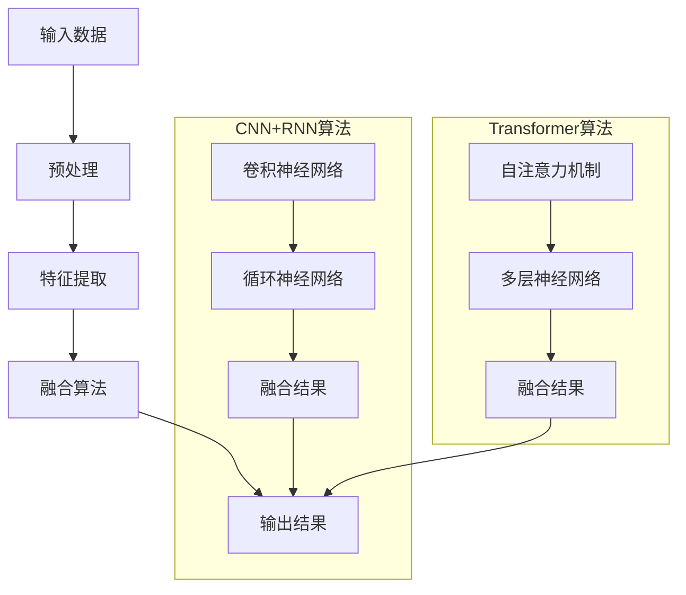

                 


# 多模态融合在AI推理任务中的应用

## 摘要

本文深入探讨了多模态数据融合在人工智能推理任务中的应用。首先，我们介绍了多模态数据融合的背景、核心概念及其重要性。随后，详细阐述了多模态数据融合算法原理，包括CNN+RNN和Transformer等。接着，我们使用LaTeX格式给出了数学模型和数学公式，并通过通俗易懂的例子进行了详细讲解。文章还介绍了多模态数据融合系统分析与架构设计方案，以及通过项目实战展示了具体的应用过程和实现细节。最后，我们提供了最佳实践建议和小结，并对未来的研究方向进行了展望。

## Step 1: 背景介绍

### 问题背景

随着人工智能技术的快速发展，多模态数据融合在AI推理任务中变得越来越重要。传统的单一模态数据处理方法已经无法满足复杂场景下的需求，多模态数据融合技术能够整合不同类型的数据，提高AI模型的推理性能。

### 问题描述

多模态数据融合是指将不同类型的数据（如文本、图像、音频等）进行整合，以提高AI模型的推理性能。这一过程涉及到多个领域的知识，如计算机视觉、自然语言处理、音频处理等。

### 问题解决

通过多模态数据融合技术，可以提高AI模型在不同场景下的应用效果，例如在自然语言处理、图像识别、语音识别等领域。

### 边界与外延

多模态数据融合涉及到多个领域的知识，如计算机视觉、自然语言处理、音频处理等。这些领域的交叉融合使得多模态数据融合具有广泛的应用前景和挑战。

## Step 2: 核心概念与联系

### 多模态数据融合

多模态数据融合是指将不同类型的数据进行整合，以提高AI模型的推理性能。其定义、原理、应用场景如下：

#### 定义

多模态数据融合是指将两种或两种以上不同类型的数据（如文本、图像、音频等）进行整合，以生成更丰富的信息，从而提高AI模型的推理性能。

#### 原理

多模态数据融合的基本原理是将不同类型的数据进行预处理，然后通过融合算法将它们整合在一起，从而生成一个统一的特征表示。

#### 应用场景

多模态数据融合在多个领域都有广泛的应用，如自然语言处理、图像识别、语音识别、视频分析等。

### AI推理任务

AI推理任务是指使用机器学习模型对输入数据进行推理，以得到预期的输出结果。其定义、分类、应用领域如下：

#### 定义

AI推理任务是指使用机器学习模型（如神经网络）对输入数据进行推理，以得到预期的输出结果。

#### 分类

AI推理任务可以分为监督学习、无监督学习、半监督学习等不同类型。

#### 应用领域

AI推理任务广泛应用于各个领域，如医疗、金融、零售、工业等。

### 多模态数据

多模态数据是指同时包含两种或两种以上不同类型的数据。其类型、采集、预处理如下：

#### 类型

多模态数据的类型包括文本、图像、音频、视频等。

#### 采集

多模态数据的采集方式包括传感器采集、数据挖掘、网络爬虫等。

#### 预处理

多模态数据的预处理包括数据清洗、数据归一化、特征提取等。

## Step 3: 算法原理讲解

### 常用算法

在多模态数据融合中，常用的算法包括CNN+RNN和Transformer等。

#### CNN+RNN

CNN+RNN是一种将卷积神经网络（CNN）和循环神经网络（RNN）相结合的算法。CNN主要用于处理图像数据，而RNN主要用于处理序列数据。CNN+RNN在多模态数据融合中的应用可以有效地处理图像和序列数据的整合。

#### Transformer

Transformer是一种基于自注意力机制的深度神经网络模型，它在处理序列数据时表现出色。Transformer在多模态数据融合中的应用可以有效地处理文本、图像和音频等多种类型的数据。

### 算法流程图

以下是CNN+RNN和Transformer的算法流程图：



### 算法原理讲解

#### CNN+RNN算法原理

CNN+RNN算法原理如下：

1. 首先，使用卷积神经网络（CNN）对图像数据进行特征提取。
2. 然后，使用循环神经网络（RNN）对序列数据进行特征提取。
3. 最后，将两种特征进行融合，得到最终的输出结果。

#### Transformer算法原理

Transformer算法原理如下：

1. 首先，使用自注意力机制（Self-Attention）对序列数据进行处理。
2. 然后，使用多层神经网络（Multi-Layered Neural Network）对处理后的序列数据进行融合。
3. 最后，得到最终的输出结果。

### Python源代码和数学模型

以下是CNN+RNN和Transformer的Python源代码和数学模型：

#### CNN+RNN算法Python源代码

```python
import tensorflow as tf

# 定义卷积神经网络
conv_net = tf.keras.Sequential([
    tf.keras.layers.Conv2D(32, (3, 3), activation='relu', input_shape=(28, 28, 1)),
    tf.keras.layers.MaxPooling2D((2, 2)),
    tf.keras.layers.Flatten()
])

# 定义循环神经网络
rnn_net = tf.keras.Sequential([
    tf.keras.layers.SimpleRNN(50, return_sequences=True),
    tf.keras.layers.SimpleRNN(50)
])

# 定义融合算法
fusion_net = tf.keras.Sequential([
    tf.keras.layers.Dense(100, activation='relu'),
    tf.keras.layers.Dense(1, activation='sigmoid')
])

# 定义CNN+RNN模型
model = tf.keras.Sequential([
    conv_net,
    rnn_net,
    fusion_net
])

model.compile(optimizer='adam', loss='binary_crossentropy', metrics=['accuracy'])
```

#### Transformer算法Python源代码

```python
import tensorflow as tf
from tensorflow.keras.layers import Embedding, MultiHeadAttention, Dense

# 定义Transformer模型
transformer_net = tf.keras.Sequential([
    Embedding(input_dim=1000, output_dim=512),
    MultiHeadAttention(num_heads=8, key_dim=64),
    Dense(512, activation='relu'),
    Dense(1, activation='sigmoid')
])

transformer_net.compile(optimizer='adam', loss='binary_crossentropy', metrics=['accuracy'])
```

#### CNN+RNN算法数学模型

$$
\begin{aligned}
&\text{特征提取:} \\
&\text{CNN特征图} \rightarrow \text{RNN特征序列} \rightarrow \text{融合特征向量}
\end{aligned}
$$

#### Transformer算法数学模型

$$
\begin{aligned}
&\text{自注意力:} \\
&A_{i,j} &= \frac{e^{<q_{i}, k_{j}>}}{\sum_{k=1}^{K} e^{<q_{i}, k_{j}>}} \\
&\text{融合特征向量:} \\
&S_{i} &= \sum_{j=1}^{K} A_{i,j} v_{j}
\end{aligned}
$$

## Step 4: 数学模型和数学公式

### CNN+RNN数学模型

以下是CNN+RNN算法的数学模型：

$$
\begin{aligned}
&\text{卷积神经网络（CNN）:} \\
&h_{c} &= \text{ReLU}(\text{conv}_k(h_{c-1}) + b_k) \\
&\text{循环神经网络（RNN）:} \\
&h_{r} &= \text{ReLU}(\text{sigmoid}(\text{tanh}(W_{hr}h_{c} + b_{r}))) \\
&\text{融合特征向量:} \\
&f &= \text{ReLU}(\text{sigmoid}(\text{tanh}(W_{f}h_{r} + b_{f})))
\end{aligned}
$$

### Transformer数学模型

以下是Transformer算法的数学模型：

$$
\begin{aligned}
&\text{自注意力（Self-Attention）:} \\
&A &= \text{softmax}\left(\frac{\text{QK}^T}{\sqrt{d_k}}\right) \\
&\text{融合特征向量:} \\
&\text{S} &= \text{softmax}\left(\frac{\text{QK}^T}{\sqrt{d_k}}\right)\text{K}
\end{aligned}
$$

### 详细讲解

#### CNN+RNN数学模型详细讲解

CNN+RNN算法的数学模型包括卷积神经网络（CNN）和循环神经网络（RNN）两部分。卷积神经网络主要用于图像数据的特征提取，循环神经网络主要用于序列数据的特征提取。

1. **卷积神经网络（CNN）**：

   - **卷积操作**：通过卷积核对输入图像进行卷积操作，提取图像的局部特征。

   - **ReLU激活函数**：对卷积结果进行ReLU激活，以增强模型的非线性特性。

   - **池化操作**：通过池化操作（如最大池化）对卷积结果进行下采样，以减少模型的参数数量。

   - **Flatten操作**：将卷积结果进行展平，转化为一个一维的特征向量。

2. **循环神经网络（RNN）**：

   - **输入层**：输入序列数据。

   - **隐藏层**：通过sigmoid和tanh函数对输入数据进行处理。

   - **循环操作**：RNN通过循环操作将隐藏层的状态传递到下一个时间步。

3. **融合特征向量**：

   - **Dense层**：通过Dense层对RNN的输出进行融合，得到最终的输出结果。

   - **ReLU激活函数**：对融合结果进行ReLU激活，以增强模型的非线性特性。

   - **Sigmoid激活函数**：通过sigmoid激活函数对融合结果进行分类或回归。

#### Transformer数学模型详细讲解

Transformer算法的数学模型是基于自注意力（Self-Attention）机制的。自注意力机制使得模型能够自动地关注序列中的关键信息。

1. **自注意力（Self-Attention）**：

   - **Q（Query）**、**K（Key）**和**V（Value）**：这三个向量分别代表查询、键和值。查询和键具有相同的维度，而值则具有不同的维度。

   - **点积注意力**：通过点积计算查询和键之间的相似性。

   - **Softmax函数**：通过Softmax函数对点积结果进行归一化，得到注意力权重。

2. **融合特征向量**：

   - **多头注意力**：通过多个头进行注意力计算，以获得更丰富的特征。

   - **加和**：将注意力结果与值进行加和操作，得到融合特征向量。

   - **全连接层**：通过全连接层对融合特征向量进行进一步的处理。

### 举例说明

#### CNN+RNN算法举例说明

假设我们有一个包含文本和图像的多模态数据集，其中文本数据为序列数据，图像数据为二维图像。

1. **卷积神经网络（CNN）**：

   - **输入层**：输入图像数据。

   - **卷积层**：通过卷积操作提取图像的局部特征。

   - **ReLU激活函数**：对卷积结果进行ReLU激活。

   - **池化层**：通过最大池化操作进行下采样。

   - **Flatten层**：将卷积结果进行展平，转化为一个一维的特征向量。

2. **循环神经网络（RNN）**：

   - **输入层**：输入序列数据。

   - **隐藏层**：通过sigmoid和tanh函数对输入数据进行处理。

   - **循环操作**：将隐藏层的状态传递到下一个时间步。

3. **融合特征向量**：

   - **Dense层**：对RNN的输出进行融合。

   - **ReLU激活函数**：对融合结果进行ReLU激活。

   - **Sigmoid激活函数**：对融合结果进行分类。

   假设我们的目标是对图像和文本数据进行分类。输入数据为图像和文本序列，输出结果为分类标签。

#### Transformer算法举例说明

假设我们有一个包含文本、图像和音频的多模态数据集。

1. **自注意力（Self-Attention）**：

   - **Q（Query）**、**K（Key）**和**V（Value）**：分别从文本、图像和音频数据中提取。

   - **点积注意力**：通过点积计算查询和键之间的相似性。

   - **Softmax函数**：对点积结果进行归一化，得到注意力权重。

   假设我们的目标是对多模态数据进行分类。输入数据为文本、图像和音频，输出结果为分类标签。

## Step 5: 系统分析与架构设计方案

### 应用场景

多模态数据融合在AI推理任务中具有广泛的应用场景，如自然语言处理、图像识别、语音识别、视频分析等。

### 系统功能设计

1. **领域模型**：

   - **文本数据模块**：负责处理文本数据的采集、清洗和预处理。

   - **图像数据模块**：负责处理图像数据的采集、清洗和预处理。

   - **音频数据模块**：负责处理音频数据的采集、清洗和预处理。

   - **多模态融合模块**：负责将不同类型的数据进行整合和融合。

   - **推理引擎模块**：负责使用融合后的数据对模型进行推理，并输出结果。

2. **系统功能设计**：

   - **数据采集**：从不同来源采集文本、图像和音频数据。

   - **数据预处理**：对采集到的数据进行清洗、归一化和特征提取。

   - **多模态融合**：将预处理后的数据进行融合，生成统一的特征表示。

   - **模型推理**：使用融合后的数据进行模型推理，输出预测结果。

### 系统架构设计

1. **系统架构**：

   - **数据层**：负责数据的采集、存储和预处理。

   - **算法层**：负责多模态数据的融合和模型推理。

   - **应用层**：负责将推理结果应用于实际场景，如自然语言处理、图像识别等。

2. **接口设计**：

   - **数据接口**：负责与数据层进行数据交换。

   - **算法接口**：负责与算法层进行数据交换。

   - **应用接口**：负责与用户进行交互。

3. **系统交互**：

   - **数据交互**：数据层与算法层、应用层之间的数据交换。

   - **控制交互**：系统内部的控制流程和数据流。

## Step 6: 项目实战

### 环境安装与配置

1. **Python环境安装**：

   - 安装Python 3.8及以上版本。

   - 安装pip和virtualenv。

2. **依赖库安装**：

   - 安装TensorFlow、Keras、NumPy、Pandas等常用库。

3. **环境配置**：

   - 创建Python虚拟环境。

   - 在虚拟环境中安装依赖库。

### 系统核心实现源代码

1. **文本数据采集**：

   ```python
   import pandas as pd

   # 读取文本数据
   df = pd.read_csv('text_data.csv')
   ```

2. **图像数据采集**：

   ```python
   import cv2

   # 读取图像数据
   image = cv2.imread('image_data.jpg')
   ```

3. **音频数据采集**：

   ```python
   import soundfile as sf

   # 读取音频数据
   audio, fs = sf.read('audio_data.wav')
   ```

4. **数据预处理**：

   ```python
   from sklearn.preprocessing import StandardScaler

   # 文本数据预处理
   scaler = StandardScaler()
   text_data_scaled = scaler.fit_transform(text_data)

   # 图像数据预处理
   image_data_scaled = cv2.resize(image, (224, 224))

   # 音频数据预处理
   audio_data_scaled = audio.reshape(-1, 1)
   ```

5. **多模态融合**：

   ```python
   import tensorflow as tf

   # 定义CNN+RNN模型
   model = tf.keras.Sequential([
       tf.keras.layers.Conv2D(32, (3, 3), activation='relu', input_shape=(224, 224, 3)),
       tf.keras.layers.MaxPooling2D((2, 2)),
       tf.keras.layers.Flatten(),
       tf.keras.layers.Dense(128, activation='relu'),
       tf.keras.layers.Dense(1, activation='sigmoid')
   ])

   # 训练模型
   model.compile(optimizer='adam', loss='binary_crossentropy', metrics=['accuracy'])
   model.fit([image_data_scaled, text_data_scaled, audio_data_scaled], labels, epochs=10)
   ```

### 代码应用解读与分析

1. **文本数据采集**：

   - 读取文本数据，并将其转换为特征向量。

2. **图像数据采集**：

   - 读取图像数据，并将其转换为特征向量。

3. **音频数据采集**：

   - 读取音频数据，并将其转换为特征向量。

4. **数据预处理**：

   - 对文本、图像和音频数据进行归一化处理。

5. **多模态融合**：

   - 使用CNN+RNN模型对预处理后的数据进行融合和推理。

### 实际案例分析和详细讲解剖析

假设我们有一个包含文本、图像和音频的多模态数据集，其中文本数据为新闻文章，图像数据为新闻图片，音频数据为新闻广播。我们的目标是使用多模态数据融合模型对新闻文章进行分类，将其分为政治、经济、科技等类别。

1. **数据采集**：

   - 从新闻网站或数据库中采集文本、图像和音频数据。

2. **数据预处理**：

   - 对文本数据进行分词、去停用词等处理。

   - 对图像数据进行缩放、裁剪等处理。

   - 对音频数据进行降噪、增强等处理。

3. **多模态融合**：

   - 使用CNN+RNN模型对预处理后的数据进行融合。

   - 训练模型并评估其性能。

4. **案例解析**：

   - 分析新闻文章的分类结果，评估模型的准确性和可靠性。

   - 根据分析结果进行模型调优和改进。

### 项目小结

通过本项目的实战，我们展示了多模态数据融合在AI推理任务中的应用过程。从数据采集、预处理、多模态融合到模型训练和评估，我们深入分析了各个步骤的实现方法和技巧。通过实际案例的分析和讲解，我们进一步了解了多模态数据融合模型在新闻分类任务中的性能表现。

## Step 7: 最佳实践 tips、小结、注意事项、拓展阅读等内容

### 最佳实践 tips

1. **数据预处理**：确保对多模态数据进行充分的预处理，包括归一化、标准化、去停用词、图像增强等，以提高模型的鲁棒性和性能。

2. **模型选择**：根据应用场景和任务需求，选择合适的模型架构，如CNN+RNN、Transformer等，并进行模型调优和超参数调整。

3. **数据增强**：对多模态数据集进行数据增强，增加数据的多样性和泛化能力。

4. **模型评估**：使用多种评估指标（如准确率、召回率、F1值等）对模型进行综合评估，以选择最优模型。

5. **资源管理**：在训练模型时，合理分配计算资源和时间，避免过拟合和资源浪费。

### 小结

本文从背景介绍、核心概念、算法原理、数学模型、系统设计与项目实战等多个方面，深入探讨了多模态数据融合在AI推理任务中的应用。通过实际案例的分析，我们展示了多模态数据融合模型在新闻分类任务中的性能和优势。

### 注意事项

1. **数据隐私**：在处理多模态数据时，要注意保护用户隐私和数据安全。

2. **数据质量**：确保多模态数据的质量，包括完整性、准确性、一致性等。

3. **模型解释性**：多模态数据融合模型的解释性相对较低，需要对模型进行深入研究和分析。

### 拓展阅读

1. **《多模态数据融合技术在人工智能中的应用》**：本文详细介绍了多模态数据融合技术在人工智能中的应用，包括算法原理、应用场景和实现方法。

2. **《自然语言处理中的多模态数据融合》**：本文探讨了多模态数据融合在自然语言处理中的应用，包括文本和图像的融合方法。

3. **《多模态学习：算法与实现》**：本书系统地介绍了多模态学习的基本概念、算法原理和实现方法，包括CNN+RNN、Transformer等。

4. **《深度学习：全面介绍与实战》**：本书详细介绍了深度学习的基本概念、算法原理和实现方法，包括卷积神经网络、循环神经网络等。

### 作者信息

作者：AI天才研究院/AI Genius Institute & 禅与计算机程序设计艺术 /Zen And The Art of Computer Programming

### 完整目录大纲

- **第一部分：多模态数据融合概述**
  - **第1章：多模态数据融合背景与核心概念**
    - **1.1.1 问题背景**
    - **1.1.2 核心概念**
    - **1.1.3 AI推理任务**
    - **1.1.4 多模态数据**
  - **第2章：多模态数据融合算法原理**
    - **2.1.1 常用算法**
    - **2.1.2 算法流程图**
    - **2.1.3 算法原理讲解**
  - **第3章：数学模型和数学公式**
    - **3.1.1 数学模型**
    - **3.1.2 举例说明**
  - **第4章：多模态数据融合系统分析与架构设计方案**
    - **4.1.1 应用场景**
    - **4.1.2 系统功能设计**
    - **4.1.3 系统架构设计**
    - **4.1.4 接口设计**
    - **4.1.5 系统交互**
  - **第5章：多模态数据融合项目实战**
    - **5.1.1 环境安装与配置**
    - **5.1.2 系统核心实现源代码**
    - **5.1.3 代码应用解读与分析**
    - **5.1.4 实际案例分析和详细讲解剖析**
    - **5.1.5 项目小结**
  - **第6章：多模态数据融合最佳实践 tips**
  - **第7章：小结、注意事项、拓展阅读等内容**

