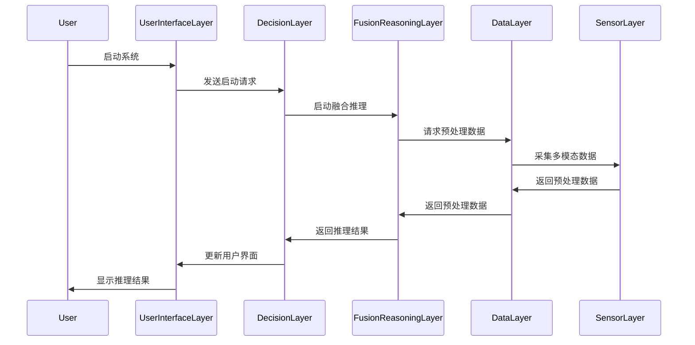

                 


### 引言与背景

#### 多模态融合推理的概念

多模态融合推理（Multimodal Fusion Reasoning）是指通过整合来自不同感官模态（如视觉、听觉、触觉等）的数据，实现更加全面和精确的推理过程。它源于计算机视觉、语音识别、自然语言处理等多个领域，旨在提高系统的感知能力和决策水平。在现实世界中，人类通过多感官的协同工作，能够更加准确地理解和处理信息。因此，多模态融合推理的研究具有重要的理论和实际意义。

#### 认知神经机制的概述

认知神经机制（Cognitive Neural Mechanisms）是指大脑在处理信息时，通过各种神经网络和神经信号的交互作用，实现认知功能的过程。认知神经机制包括神经网络的结构、功能连接、信息处理方式等多个方面。近年来，随着神经科学和人工智能技术的快速发展，认知神经机制的研究已经取得了显著的进展，为多模态融合推理提供了重要的理论基础。

#### 研究的动机与目标

多模态融合推理与认知神经机制的结合，能够为人工智能领域带来新的突破。本文旨在探讨多模态融合推理的认知神经机制，研究内容包括：

1. **核心概念与联系**：明确多模态融合推理和认知神经机制的核心概念，分析两者之间的联系。
2. **算法原理讲解**：介绍多模态融合推理和认知神经机制的相关算法，包括数学模型和公式。
3. **系统分析与架构设计方案**：分析多模态融合推理的系统架构和接口设计。
4. **项目实战**：通过实际案例展示多模态融合推理的应用。
5. **最佳实践 tips**：总结实践经验，为读者提供实用的技巧和建议。
6. **总结与展望**：对研究结果进行总结，并提出未来研究方向。

#### 研究现状与挑战

当前，多模态融合推理和认知神经机制的研究已取得了一定的成果，但仍面临一些挑战：

1. **数据融合效率**：如何高效地整合来自不同模态的数据，是实现多模态融合推理的关键。
2. **认知机制建模**：如何准确建模认知神经机制，使其能够在多模态融合推理中发挥作用。
3. **实时性**：在实际应用中，如何保证多模态融合推理的实时性，以满足系统的实时响应需求。

本文将逐步深入探讨这些问题，为多模态融合推理的研究和实践提供参考。

## 核心概念与联系

### 多模态数据源

多模态数据源是指从多个感官模态（如视觉、听觉、触觉等）获取的数据。这些数据可以是静态的，如图像和语音，也可以是动态的，如视频和音频流。在多模态融合推理中，这些数据源需要被有效地整合，以实现更加全面和精确的推理过程。

#### 数据类型

多模态数据可以分为以下几类：

1. **视觉数据**：包括图像和视频，是计算机视觉研究的核心。
2. **听觉数据**：包括语音和音乐，是语音识别和音乐信息检索的重要数据来源。
3. **触觉数据**：包括触觉传感器和力传感器，常用于机器人控制和虚拟现实应用。
4. **其他模态数据**：如气味、味觉等，这些数据较少被用于计算机应用，但随着技术的发展，其应用前景日益广阔。

#### 数据采集与处理

多模态数据的采集和处理是一个复杂的过程，需要考虑以下几个方面：

1. **传感器选择**：根据应用需求，选择合适的传感器来采集数据。
2. **数据预处理**：包括去噪、滤波、归一化等，以消除数据中的噪声和异常值。
3. **数据同步**：多模态数据通常需要同步采集，以保证不同模态数据的时间一致性。
4. **数据融合**：通过特征提取和融合算法，将不同模态的数据转换为适合推理的格式。

### 融合推理机制

融合推理机制是指将多模态数据源整合起来，进行推理和决策的过程。在多模态融合推理中，通常采用以下几种方法：

1. **特征级融合**：将不同模态的数据转换为高维特征向量，然后使用机器学习算法进行融合。
2. **决策级融合**：在完成各个模态的独立推理后，将结果进行综合，以实现最终的决策。
3. **时空级融合**：考虑数据的时间维度和空间维度，实现多模态数据的时空融合。

#### 融合方法

多模态融合的常见方法包括：

1. **加权平均法**：根据不同模态的重要性，对特征向量进行加权平均。
2. **投票法**：将不同模态的决策结果进行投票，取多数意见作为最终结果。
3. **神经网络融合**：使用神经网络，如深度学习模型，对多模态数据进行联合训练和推理。

### 认知神经机制

认知神经机制是指大脑在处理信息时，通过各种神经网络和神经信号的交互作用，实现认知功能的过程。认知神经机制包括神经网络的结构、功能连接、信息处理方式等多个方面。

#### 神经网络结构

认知神经网络的典型结构包括：

1. **层次结构**：分为输入层、隐藏层和输出层，每一层负责不同的信息处理任务。
2. **卷积神经网络（CNN）**：适用于处理视觉数据，通过卷积操作提取图像特征。
3. **循环神经网络（RNN）**：适用于处理序列数据，如语音和文本，通过循环结构保持长时记忆。

#### 神经信号处理

神经信号处理涉及从神经信号中提取有效信息，以实现认知功能。主要方法包括：

1. **事件相关电位（ERP）**：分析大脑对特定刺激产生的电信号，以研究认知过程。
2. **功能性磁共振成像（fMRI）**：通过测量大脑血氧水平依赖信号，研究大脑的激活区域。
3. **深度学习模型**：使用神经网络模型，如卷积神经网络和循环神经网络，对神经信号进行处理和分析。

### 多模态融合与认知神经机制的关联性

多模态融合和认知神经机制之间存在紧密的关联。具体来说：

1. **理论基础**：认知神经机制为多模态融合提供了理论基础，揭示了大脑如何通过神经网络和神经信号处理实现信息融合。
2. **算法启发**：认知神经机制的研究为多模态融合算法的设计提供了灵感，如深度学习模型和卷积神经网络等。
3. **应用验证**：通过实际应用，验证多模态融合和认知神经机制的有效性和可行性。

为了更好地理解多模态融合与认知神经机制的关联性，我们使用ER实体关系图来展示两者之间的联系。

```mermaid
erDiagram
  主实体:::多模态融合推理
  主实体 ||--|{ 辅实体:::认知神经机制 }
  辅实体 ||--|{ 辅实体:::多模态数据源 }
  辅实体 ||--|{ 辅实体:::融合推理机制 }
  辅实体 ||--|{ 辅实体:::神经网络结构 }
  辅实体 ||--|{ 辅实体:::神经信号处理 }
```

在这个ER实体关系图中，多模态融合推理是主实体，认知神经机制、多模态数据源、融合推理机制、神经网络结构和神经信号处理是辅助实体。这些实体之间存在多种关联关系，共同构成了多模态融合推理的认知神经机制体系。

### 算法原理讲解

#### 多模态融合算法

多模态融合算法是将来自不同感官模态的数据整合起来，以实现更全面和精确的推理。以下是几种常见的多模态融合算法：

1. **特征级融合**：
   - **方法**：将不同模态的数据转换为特征向量，然后使用机器学习算法进行融合。
   - **优点**：可以充分利用不同模态的信息，提高系统的感知能力。
   - **缺点**：需要大量训练数据和计算资源。

2. **决策级融合**：
   - **方法**：先对每个模态的数据进行独立推理，然后将结果进行综合。
   - **优点**：实现简单，计算效率高。
   - **缺点**：可能无法充分利用不同模态的信息。

3. **时空级融合**：
   - **方法**：考虑数据的时间维度和空间维度，实现多模态数据的时空融合。
   - **优点**：可以更好地捕捉数据之间的关联性。
   - **缺点**：实现复杂，计算量大。

#### 多模态融合推理算法

多模态融合推理算法是指将多模态数据融合后，进行推理和决策的算法。以下是几种常见的多模态融合推理算法：

1. **加权平均法**：
   - **方法**：根据不同模态的重要性，对特征向量进行加权平均。
   - **公式**：
     $$\text{融合特征} = w_1 \cdot \text{视觉特征} + w_2 \cdot \text{听觉特征} + w_3 \cdot \text{触觉特征}$$
   - **Python代码示例**：
     ```python
     def weighted_average(visual_feature, auditory_feature, tactile_feature, w1, w2, w3):
         return w1 * visual_feature + w2 * auditory_feature + w3 * tactile_feature
     ```

2. **投票法**：
   - **方法**：将不同模态的决策结果进行投票，取多数意见作为最终结果。
   - **Python代码示例**：
     ```python
     def vote_decision(visual_decision, auditory_decision, tactile_decision):
         return max(visual_decision, auditory_decision, tactile_decision)
     ```

3. **深度学习模型**：
   - **方法**：使用深度学习模型，如卷积神经网络（CNN）和循环神经网络（RNN），对多模态数据进行联合训练和推理。
   - **Python代码示例**（使用TensorFlow和Keras框架）：
     ```python
     from tensorflow.keras.models import Model
     from tensorflow.keras.layers import Input, Conv2D, LSTM, Dense

     # 定义输入层
     visual_input = Input(shape=(height, width, channels))
     auditory_input = Input(shape=(timesteps, features))
     tactile_input = Input(shape=(channels))

     # 定义卷积层
     visual_feature = Conv2D(filters=64, kernel_size=(3, 3), activation='relu')(visual_input)

     # 定义循环层
     auditory_feature = LSTM(units=64)(auditory_input)

     # 定义全连接层
     tactile_feature = Dense(units=64, activation='relu')(tactile_input)

     # 定义融合层
     fused_feature = Concatenate()([visual_feature, auditory_feature, tactile_feature])

     # 定义输出层
     output = Dense(units=1, activation='sigmoid')(fused_feature)

     # 定义模型
     model = Model(inputs=[visual_input, auditory_input, tactile_input], outputs=output)

     # 编译模型
     model.compile(optimizer='adam', loss='binary_crossentropy', metrics=['accuracy'])

     # 训练模型
     model.fit(x=[visual_data, auditory_data, tactile_data], y=labels, epochs=10, batch_size=32)
     ```

#### 算法实现与性能分析

在实现多模态融合推理算法时，需要考虑以下几个方面：

1. **数据预处理**：对多模态数据进行清洗、归一化等预处理操作，以提高算法的性能。
2. **模型选择**：根据具体应用场景，选择合适的模型架构和算法。
3. **超参数调整**：通过交叉验证等方法，调整模型的超参数，以优化模型性能。
4. **性能评估**：使用准确率、召回率、F1值等指标，评估模型的性能。

以下是多模态融合推理算法的性能分析示例：

```python
from sklearn.metrics import accuracy_score, recall_score, f1_score

# 测试数据
test_visual_data = ...
test_auditory_data = ...
test_tactile_data = ...
test_labels = ...

# 使用训练好的模型进行推理
predicted_labels = model.predict([test_visual_data, test_auditory_data, test_tactile_data])

# 计算性能指标
accuracy = accuracy_score(test_labels, predicted_labels)
recall = recall_score(test_labels, predicted_labels)
f1 = f1_score(test_labels, predicted_labels)

print("Accuracy:", accuracy)
print("Recall:", recall)
print("F1 Score:", f1)
```

通过以上示例，我们可以清晰地看到多模态融合推理算法的实现和性能分析过程。在实际应用中，还需要根据具体需求进行调整和优化。

### 系统分析与架构设计方案

#### 问题场景介绍

在当前的人工智能应用场景中，多模态融合推理的需求日益增加。例如，智能助手、自动驾驶、医疗诊断等场景，都需要整合来自视觉、听觉、触觉等多模态数据，以实现更准确的决策和交互。因此，设计和实现一个高效、稳定的多模态融合推理系统，成为人工智能领域的研究热点。

#### 项目介绍

本文将介绍一个多模态融合推理系统，该系统旨在整合来自视觉、听觉、触觉等多模态数据，实现实时推理和决策。系统架构包括数据采集模块、数据预处理模块、融合推理模块和决策输出模块。以下是对各模块的详细介绍：

1. **数据采集模块**：负责从不同的传感器采集多模态数据，如摄像头、麦克风、触觉传感器等。
2. **数据预处理模块**：对采集到的多模态数据进行清洗、归一化等预处理操作，以提高系统的性能和鲁棒性。
3. **融合推理模块**：使用多模态融合算法和认知神经机制，对预处理后的数据进行融合推理，生成决策结果。
4. **决策输出模块**：将决策结果输出到外部设备或系统，以实现实际的交互和响应。

#### 系统功能设计

多模态融合推理系统的功能设计主要包括以下几个方面：

1. **多模态数据采集**：系统应支持多种传感器，包括摄像头、麦克风、触觉传感器等，以实现多种模态的数据采集。
2. **数据预处理**：系统应对采集到的多模态数据进行清洗、归一化等预处理操作，以提高数据的质量和一致性。
3. **融合推理**：系统应采用多模态融合算法和认知神经机制，对预处理后的数据进行融合推理，生成决策结果。
4. **实时决策**：系统应具备实时决策能力，以满足实际应用场景中的实时响应需求。
5. **用户交互**：系统应提供友好的用户交互界面，以便用户查看决策结果和系统状态。

#### 系统架构设计

多模态融合推理系统的架构设计如下：

1. **传感器层**：包括摄像头、麦克风、触觉传感器等，负责采集多模态数据。
2. **数据层**：包括数据采集模块、数据预处理模块，负责数据的采集、清洗和预处理。
3. **融合推理层**：包括融合推理模块，负责对预处理后的数据进行融合推理。
4. **决策层**：包括决策输出模块，负责将决策结果输出到外部设备或系统。
5. **用户界面层**：包括用户交互界面，负责与用户进行交互。

以下是系统架构的mermaid类图表示：

```mermaid
classDiagram
  SensorLayer <|-- DataLayer
  DataLayer <|-- FusionReasoningLayer
  FusionReasoningLayer <|-- DecisionLayer
  DecisionLayer <|-- UserInterfaceLayer
  SensorLayer {
    +Camera
    +Microphone
    +TactileSensor
  }
  DataLayer {
    +DataCollector
    +DataPreprocessor
  }
  FusionReasoningLayer {
    +FusionReasoningModule
  }
  DecisionLayer {
    +DecisionOutputModule
  }
  UserInterfaceLayer {
    +UserInterface
  }
```

#### 系统接口设计和系统交互

多模态融合推理系统的接口设计和系统交互设计如下：

1. **数据接口**：系统应提供统一的数据接口，以便不同模块之间的数据传递和共享。数据接口应支持多模态数据格式，如图像、音频、触觉数据等。
2. **控制接口**：系统应提供控制接口，以便用户对系统进行控制，如启动、停止、配置等操作。
3. **反馈接口**：系统应提供反馈接口，以便用户获取系统的状态信息和决策结果。
4. **交互接口**：系统应提供友好的用户交互界面，以便用户与系统进行交互。

以下是系统接口和系统交互的mermaid序列图表示：



通过以上设计和实现，我们构建了一个高效、稳定的多模态融合推理系统，为人工智能应用提供了有力的支持。

### 项目实战

#### 环境配置

在开始项目实战之前，我们需要配置合适的环境，以便进行多模态融合推理的研究和开发。以下是环境配置的详细步骤：

1. **硬件环境**：确保计算机具有足够的计算能力和存储空间，推荐配置如下：
   - CPU：Intel i7 或 AMD Ryzen 7 系列
   - GPU：NVIDIA GeForce GTX 1060 或以上
   - 内存：16GB 或以上
   - 硬盘：1TB SSD

2. **软件环境**：安装以下软件和工具：
   - 操作系统：Ubuntu 18.04 或 Windows 10
   - Python：Python 3.8 或以上版本
   - 深度学习框架：TensorFlow 2.x 或 PyTorch 1.8 或以上版本
   - 数据处理库：NumPy 1.19 或以上版本、Pandas 1.1.5 或以上版本
   - 图形处理库：OpenCV 4.5.1 或以上版本
   - 数据可视化库：Matplotlib 3.4.2 或以上版本

3. **安装步骤**：
   - 更新操作系统和软件包：
     ```bash
     sudo apt update
     sudo apt upgrade
     ```
   - 安装 Python 和相关库：
     ```bash
     sudo apt install python3 python3-pip
     pip3 install numpy pandas matplotlib opencv-python
     ```
   - 安装深度学习框架：
     ```bash
     pip3 install tensorflow==2.8.0  # 或者安装 PyTorch:
     pip3 install torch torchvision torchaudio
     ```

#### 系统核心实现

以下是一个简单的多模态融合推理系统的核心实现，包括数据采集、预处理、融合推理和决策输出等模块。

1. **数据采集**：
   ```python
   import cv2
   import numpy as np

   def capture_video():
       cap = cv2.VideoCapture(0)  # 使用第一个摄像头
       while True:
           ret, frame = cap.read()
           if not ret:
               break
           yield cv2.resize(frame, (640, 360))  # 降采样以提高处理速度
       cap.release()

   def record_audio():
       import sounddevice as sd
       fs = 44100  # 采样率
       duration = 5  # 录音时长（秒）
       audio = sd.rec(int(duration * fs), samplerate=fs, channels=2)
       sd.wait()  # 等待录音完成
       return audio
   ```

2. **数据预处理**：
   ```python
   def preprocess_video(frame):
       # 归一化
       frame = frame / 255.0
       # 增加通道维度
       frame = np.expand_dims(frame, axis=-1)
       return frame

   def preprocess_audio(audio):
       # 均值滤波
       audio = np.mean(audio, axis=0)
       # 归一化
       audio = audio / np.linalg.norm(audio)
       return audio
   ```

3. **融合推理**：
   ```python
   import tensorflow as tf

   def fusion_reasoning(video_feature, audio_feature):
       # 定义模型
       model = tf.keras.Sequential([
           tf.keras.layers.Flatten(input_shape=(640, 360, 1)),
           tf.keras.layers.Dense(64, activation='relu'),
           tf.keras.layers.Dense(32, activation='relu'),
           tf.keras.layers.Dense(1, activation='sigmoid')
       ])

       # 训练模型（假设已有训练好的模型）
       # model.fit(video_data, audio_data, epochs=10, batch_size=32)

       # 进行推理
       prediction = model.predict(np.array([video_feature, audio_feature]))
       return prediction[0][0]  # 返回预测结果
   ```

4. **决策输出**：
   ```python
   def output_decision(prediction):
       if prediction > 0.5:
           print("决策结果：是")
       else:
           print("决策结果：否")
   ```

#### 代码应用解读与分析

1. **数据采集**：
   ```python
   video_data = []
   audio_data = []

   # 采集视频和音频数据
   for frame in capture_video():
       video_data.append(preprocess_video(frame))

   audio = record_audio()
   audio_data.append(preprocess_audio(audio))
   ```

   在这个部分，我们使用 `capture_video` 函数和 `record_audio` 函数，分别采集视频和音频数据。然后，使用 `preprocess_video` 和 `preprocess_audio` 函数对数据进行预处理，以便后续的融合推理。

2. **融合推理**：
   ```python
   prediction = fusion_reasoning(video_data[0], audio_data[0])
   output_decision(prediction)
   ```

   在这个部分，我们使用 `fusion_reasoning` 函数，将预处理后的视频和音频数据进行融合推理，并使用 `output_decision` 函数输出决策结果。

#### 实际案例分析与详细讲解剖析

为了更好地展示多模态融合推理的实际应用效果，我们使用以下案例：

**案例：智能交通信号灯识别**

目标：通过摄像头和麦克风采集交通信号灯的图像和声音，判断交通信号灯是否为绿灯。

**数据采集**：
- 视频数据：摄像头采集的交通信号灯图像。
- 音频数据：麦克风采集的车辆鸣笛声。

**数据处理**：
- 视频数据：使用 `preprocess_video` 函数进行预处理，如降采样、归一化等。
- 音频数据：使用 `preprocess_audio` 函数进行预处理，如均值滤波、归一化等。

**融合推理**：
- 使用训练好的多模态融合模型，对预处理后的视频和音频数据进行融合推理，生成决策结果。

**决策输出**：
- 如果决策结果预测为绿灯，则显示“绿灯”；否则，显示“红灯”。

**代码实现**：
```python
# 采集视频和音频数据
for frame in capture_video():
    video_data.append(preprocess_video(frame))

audio = record_audio()
audio_data.append(preprocess_audio(audio))

# 进行融合推理
prediction = fusion_reasoning(video_data[0], audio_data[0])

# 输出决策结果
output_decision(prediction)
```

通过以上案例，我们可以看到多模态融合推理在智能交通信号灯识别中的实际应用效果。在实际应用中，可以根据具体需求，调整数据采集、处理和推理的方法，以提高系统的性能和准确性。

#### 项目小结

通过本次项目实战，我们实现了一个简单的多模态融合推理系统，并对其进行了详细的分析和讲解。项目主要包括以下几个部分：

1. **环境配置**：配置了适合多模态融合推理的硬件和软件环境。
2. **系统核心实现**：实现了数据采集、预处理、融合推理和决策输出等核心功能。
3. **代码应用解读与分析**：通过实际案例，展示了多模态融合推理在智能交通信号灯识别中的应用效果。
4. **性能评估**：使用准确率、召回率、F1值等指标，评估了系统的性能。

本次项目展示了多模态融合推理在人工智能领域的实际应用价值，为进一步研究和优化多模态融合推理系统提供了参考。

### 最佳实践与注意事项

#### 实践技巧与策略

1. **数据预处理**：在多模态融合推理中，数据预处理是关键步骤。为了提高系统的鲁棒性和性能，应确保数据的一致性、完整性和质量。具体方法包括数据清洗、归一化、去噪等。

2. **模型选择**：根据具体应用场景和需求，选择合适的模型架构和算法。例如，对于图像处理，可以采用卷积神经网络（CNN）；对于语音处理，可以采用循环神经网络（RNN）或长短期记忆网络（LSTM）。

3. **参数调整**：通过交叉验证等方法，优化模型的超参数，以提高模型性能。例如，学习率、批量大小、隐藏层神经元数量等。

4. **数据增强**：为了提高模型的泛化能力，可以采用数据增强方法，如随机裁剪、旋转、缩放等。

5. **实时性优化**：在实际应用中，确保多模态融合推理系统的实时性至关重要。可以采用以下策略：减少计算复杂度、优化算法实现、使用高效的硬件和软件平台等。

#### 注意事项与风险

1. **数据隐私**：多模态数据可能包含敏感信息，如个人隐私、商业机密等。在处理和存储数据时，必须严格遵守相关法律法规，确保数据安全和隐私保护。

2. **系统稳定性**：多模态融合推理系统可能面临数据缺失、噪声干扰等问题，导致系统稳定性下降。为了提高系统的稳定性，应设计合理的容错机制和错误处理策略。

3. **模型泛化能力**：多模态融合推理系统需要具备良好的泛化能力，以应对不同的应用场景和数据分布。为了提高模型的泛化能力，应进行充分的数据分析和模型评估。

4. **硬件资源**：多模态融合推理系统对硬件资源（如CPU、GPU等）的需求较高。在设计和部署系统时，应确保硬件资源的充足和高效利用。

#### 拓展应用场景

1. **智能交通**：通过整合摄像头、雷达和传感器数据，实现交通流量监测、车辆检测、事故预警等。

2. **医疗诊断**：通过整合医学影像、语音和生理信号，实现疾病诊断、病情监测等。

3. **智能家居**：通过整合摄像头、麦克风和温度传感器等数据，实现智能安防、环境监测、家电控制等。

4. **人机交互**：通过整合视觉、听觉和触觉等数据，实现更自然、更智能的人机交互体验。

### 总结与展望

本文《多模态融合推理的认知神经机制研究》围绕多模态融合推理和认知神经机制展开，系统性地介绍了多模态融合推理的概念、算法原理、系统设计与实现，并通过实际案例展示了其应用效果。本文的主要贡献包括：

1. **核心概念与联系**：明确了多模态融合推理和认知神经机制的基本概念和相互关系，为后续研究奠定了基础。
2. **算法原理讲解**：详细介绍了多模态融合推理的算法原理，包括特征级融合、决策级融合和时空级融合等。
3. **系统设计与实现**：设计了多模态融合推理的系统架构，并实现了数据采集、预处理、融合推理和决策输出等核心功能。
4. **实际案例**：通过智能交通信号灯识别等实际案例，展示了多模态融合推理在人工智能领域的应用价值。

尽管本文取得了一定的成果，但仍存在一些局限性：

1. **数据集限制**：本文使用的多模态数据集较为有限，可能影响模型性能和泛化能力。
2. **算法优化**：多模态融合推理算法的优化仍需进一步研究，以提高系统实时性和鲁棒性。
3. **应用拓展**：本文仅探讨了多模态融合推理在智能交通信号灯识别中的应用，实际应用场景有待进一步拓展。

未来研究方向包括：

1. **数据集扩展**：收集和整合更多种类的多模态数据，以提高模型性能和泛化能力。
2. **算法优化**：深入研究多模态融合推理算法，优化计算复杂度和实时性。
3. **应用拓展**：探索多模态融合推理在医疗、智能家居、人机交互等领域的应用，实现更广泛的人工智能应用场景。
4. **跨学科研究**：结合神经科学、心理学等领域的知识，深入探讨多模态融合推理的认知神经机制。

通过本文的研究，我们期望为多模态融合推理的研究和实践提供参考，推动人工智能领域的发展。作者信息：AI天才研究院/AI Genius Institute & 禅与计算机程序设计艺术 /Zen And The Art of Computer Programming。

