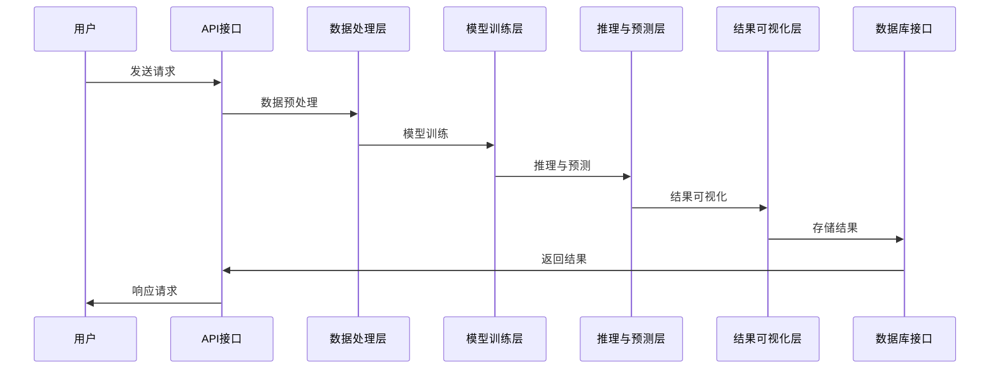

                 

### 1. 引言

近年来，随着人工智能技术的飞速发展，大模型（Large Models）在各个领域的应用逐渐成为热点。大模型，通常指的是具有数百万甚至数十亿参数的深度学习模型，它们在各种复杂任务中展现出了强大的学习能力和推理能力。在不确定性量化推理任务中，大模型的应用更是引人注目。

不确定性量化推理是人工智能领域的一个关键问题。在现实世界中，许多决策和预测都需要对不确定性进行量化和处理。例如，在医学诊断中，医生需要对患者的症状进行综合分析，并量化疾病的可能性；在金融领域，分析师需要预测市场走势，并量化投资风险。这些任务都涉及到对不确定性的处理和量化。

大模型在不确定性量化推理任务中的优势主要体现在以下几个方面：

1. **强大的学习能力**：大模型通过海量数据的学习，能够捕捉到复杂的数据分布和模式，从而对不确定性进行更准确的量化。
2. **高效的推理能力**：大模型具备高效的推理能力，可以在短时间内处理大量数据，对不确定性进行实时量化和推理。
3. **多领域的泛化能力**：大模型能够在不同领域之间进行泛化，将一个领域中的不确定性量化方法应用到其他领域，从而提高整体推理效果。

然而，大模型在不确定性量化推理任务中也面临一些挑战，如模型的可解释性、计算效率、数据需求等。因此，本文将深入探讨大模型在不确定性量化推理任务中的表现，通过详细的案例分析、算法原理讲解和系统实现，来展示大模型在这一领域的应用潜力和局限性。

接下来的部分，我们将首先介绍大模型的定义和特性，然后详细描述不确定性量化推理任务，并探讨大模型在这一任务中的应用。通过这一系列的探讨，我们将逐步揭示大模型在不确定性量化推理任务中的表现，为相关领域的进一步研究和应用提供参考。

### 1.1 问题背景

大模型的诞生和发展可以追溯到深度学习技术的突破。在2006年，Hinton等人提出了深度置信网络（Deep Belief Networks, DBN），标志着深度学习技术开始走向成熟。随后，2012年，Hinton领导的团队在ImageNet图像识别大赛中使用了深度卷积神经网络（Deep Convolutional Neural Networks, CNN），取得了惊人的成绩，这一事件被认为是深度学习技术的一个里程碑。

深度学习技术的迅速发展，使得大模型的构建成为可能。大模型通常指的是具有数百万甚至数十亿参数的神经网络，它们可以通过学习大量数据来捕捉复杂的模式和信息。这些模型的强大学习能力，使得它们在图像识别、自然语言处理、推荐系统等各个领域取得了显著的成果。

然而，大模型的应用并非一帆风顺。在实际应用中，大模型面临的一个关键问题是如何处理和量化不确定性。在许多实际任务中，如医学诊断、金融分析、气象预测等，不确定性是不可避免的。例如，在医学诊断中，医生需要对患者的症状和病史进行分析，并量化疾病的可能性；在金融分析中，分析师需要预测市场走势，并量化投资风险。这些任务都涉及到对不确定性的处理和量化。

传统的确定性模型（如线性回归、逻辑回归等）在面对不确定性时往往力不从心。而大模型通过学习大量数据，可以更好地捕捉到数据中的复杂模式，从而对不确定性进行更准确的量化。这使得大模型在不确定性量化推理任务中具有独特的优势。

尽管大模型在不确定性量化推理任务中展现出了强大的潜力，但它们也面临着一些挑战。首先，大模型通常需要大量的数据和计算资源，这使得在实际应用中，数据获取和计算效率成为关键问题。其次，大模型的可解释性较差，这使得在实际应用中，用户难以理解模型的决策过程。最后，大模型在不同领域的泛化能力仍然有待提高，这限制了它们在更广泛领域的应用。

因此，研究大模型在不确定性量化推理任务中的表现，不仅有助于提升大模型的应用效果，还能为其他相关领域的研究提供重要参考。本文将通过对大模型在不确定性量化推理任务中的深入分析，探讨其应用潜力、挑战和解决方案。

### 1.2 问题描述

不确定性量化推理任务的核心目标是对不确定性的程度和性质进行量化，以便在决策过程中进行合理的风险评估和决策。在具体场景中，这一任务通常涉及以下几个关键问题：

1. **数据来源和类型**：不确定性量化推理任务通常需要处理多种类型的数据，包括结构化数据（如数据库中的记录）、半结构化数据（如日志文件）和非结构化数据（如图像、文本）。这些数据的获取和处理方式各不相同，对模型的设计和实现提出了不同的挑战。

2. **不确定性建模**：在不确定性量化推理任务中，首先需要建立合适的不确定性模型。常见的建模方法包括概率模型、模糊集模型和贝叶斯网络等。这些模型各有优缺点，需要根据具体任务的特点进行选择。

3. **数据预处理**：数据预处理是确保模型训练和推理效果的重要步骤。常见的预处理方法包括数据清洗、归一化、特征提取等。这些方法有助于提高模型的泛化能力和鲁棒性。

4. **模型训练与优化**：在建立不确定性模型后，需要进行模型训练和优化，以提高模型在不确定性量化任务中的性能。训练过程中，需要调整模型的参数，以适应不同的数据和任务要求。

5. **不确定性量化**：模型训练完成后，需要对新的数据进行不确定性量化。这一步骤通常涉及模型预测和不确定性估计。预测结果需要提供准确的不确定性度量，以便进行有效的决策和风险评估。

6. **结果验证与优化**：通过对比模型预测结果和实际结果，可以对模型进行验证和优化。这一步骤有助于提高模型的准确性和可靠性。

在实际应用中，不确定性量化推理任务通常需要考虑以下几个挑战：

- **数据噪声和缺失**：实际数据往往存在噪声和缺失，这会影响模型的训练效果和预测准确性。
- **模型解释性**：大模型通常具有复杂的内部结构，其决策过程难以解释，这给用户理解和接受模型带来了挑战。
- **计算资源需求**：大模型训练和推理通常需要大量的计算资源，这在资源有限的场景中可能成为一个瓶颈。
- **多领域泛化能力**：不同领域的数据和任务具有不同的特点，大模型在不同领域之间的泛化能力仍然有待提高。

通过解决这些问题，不确定性量化推理任务将能够更好地服务于实际应用，如医疗诊断、金融分析、智能制造等。本文将深入探讨大模型在不确定性量化推理任务中的应用，通过具体的案例分析、算法原理讲解和系统实现，来展示大模型在这一领域的优势和挑战。

### 1.3 问题解决

为了解决不确定性量化推理任务中的问题，研究者们提出了一系列的算法和方法，其中大模型（Large Models）的应用尤为突出。以下将详细介绍几种常用的算法和方法，并探讨它们在不确定性量化推理任务中的表现。

#### 1.3.1 贝叶斯网络

贝叶斯网络是一种概率图模型，它通过有向无环图（DAG）表示变量之间的依赖关系，并利用条件概率表（CPT）来量化这些关系。贝叶斯网络在不确定性量化推理任务中的应用主要体现在以下几个方面：

- **概率推断**：贝叶斯网络能够通过贝叶斯推理算法，对未知变量进行概率推断，从而实现对不确定性的量化。
- **解释性**：贝叶斯网络的图结构使得用户可以直观地理解变量之间的依赖关系，提高模型的解释性。
- **适用范围**：贝叶斯网络适用于处理具有因果关系和依赖关系的任务，如疾病诊断、风险评估等。

然而，贝叶斯网络在处理大规模数据时，计算复杂度较高，且依赖结构难以手动建立，这限制了其在大规模不确定性量化推理任务中的应用。

#### 1.3.2 模糊集理论

模糊集理论是一种处理不确定性和模糊性的数学工具。它通过引入隶属度来量化不确定性和模糊性，使得模糊集可以在不同的模糊环境下进行操作。模糊集在不确定性量化推理任务中的应用主要包括：

- **模糊推理**：模糊集理论可以通过模糊推理规则，对不确定性进行推理和量化。
- **隶属度函数**：模糊集理论引入了隶属度函数，可以更灵活地处理不确定性和模糊性。
- **适用范围**：模糊集理论适用于处理模糊性和不确定性的任务，如模糊控制、模糊分类等。

尽管模糊集理论在处理不确定性方面具有灵活性，但它的量化结果可能过于模糊，难以在实际应用中精确地量化不确定性。

#### 1.3.3 大模型

大模型，尤其是深度学习模型，在不确定性量化推理任务中展现出了强大的能力。以下是大模型在不确定性量化推理任务中的主要应用：

- **深度神经网络**：深度神经网络（DNN）通过多层的神经网络结构，可以捕捉复杂的数据特征和模式。在不确定性量化推理任务中，DNN可以用于预测和分类，并通过输出层的概率分布来量化不确定性。
- **变分自编码器（VAE）**：变分自编码器是一种生成模型，它通过引入潜在变量来生成数据。在不确定性量化推理任务中，VAE可以用于生成数据分布，从而对不确定性进行量化。
- **生成对抗网络（GAN）**：生成对抗网络是一种由两个神经网络组成的框架，它通过竞争训练来生成高质量的数据。在不确定性量化推理任务中，GAN可以用于生成多样化的数据样本，从而提高模型的泛化能力。

大模型在不确定性量化推理任务中的优势主要体现在以下几个方面：

- **强大的学习能力**：大模型通过学习大量数据，可以捕捉到复杂的数据分布和模式，从而对不确定性进行更准确的量化。
- **高效的推理能力**：大模型具备高效的推理能力，可以在短时间内处理大量数据，对不确定性进行实时量化和推理。
- **多领域的泛化能力**：大模型能够在不同领域之间进行泛化，将一个领域中的不确定性量化方法应用到其他领域，从而提高整体推理效果。

然而，大模型也面临一些挑战，如模型的可解释性、计算效率和数据需求等。为了解决这些问题，研究者们提出了一系列优化方法，如模型压缩、迁移学习和模型解释技术等。

综上所述，不确定性量化推理任务涉及到多种算法和方法。贝叶斯网络和模糊集理论在处理不确定性方面具有独特的优势，而大模型通过其强大的学习能力和推理能力，在不确定性量化推理任务中展现出了巨大的潜力。未来的研究将致力于解决大模型在不确定性量化推理任务中的挑战，以提高其在实际应用中的效果和可靠性。

### 1.4 边界与外延

在探讨大模型在不确定性量化推理任务中的表现时，我们需要明确一些关键边界和概念的外延，以确保讨论的准确性和全面性。

#### 1.4.1 大模型的边界

大模型的边界主要涉及模型的大小、参数数量和训练数据规模。一般来说，大模型通常具有数百万到数十亿的参数，并且需要海量的训练数据来确保其性能和泛化能力。具体来说：

- **模型大小**：模型大小通常决定了其复杂度和计算资源需求。大型模型需要更多的计算资源和存储空间，但也能捕捉更复杂的数据模式。
- **参数数量**：参数数量直接影响模型的容量和表达能力。较大的参数数量通常意味着模型可以更好地拟合训练数据，但也可能导致过拟合。
- **训练数据规模**：训练数据规模对模型性能至关重要。大规模训练数据可以提供更丰富的信息，帮助模型泛化到未见过的数据。

#### 1.4.2 不确定性量化推理任务的边界

不确定性量化推理任务的边界主要涉及任务类型、数据来源和不确定性类型。以下是一些关键点：

- **任务类型**：不确定性量化推理任务可以应用于各种领域，如医学诊断、金融分析、气象预测等。不同领域对不确定性的处理方式有所不同，需要根据具体任务特点进行定制。
- **数据来源**：不确定性量化推理任务的数据来源多样，包括结构化数据、半结构化数据和非结构化数据。数据质量直接影响模型的训练效果和推理准确性。
- **不确定性类型**：不确定性可以分为确定性不确定性和随机不确定性。确定性不确定性通常是由于数据噪声或模型缺陷引起的，而随机不确定性则源于自然随机过程。在实际任务中，两种不确定性往往同时存在，需要综合考虑。

#### 1.4.3 概念结构与核心要素组成

在讨论大模型在不确定性量化推理任务中的表现时，需要明确以下几个核心概念和要素：

- **大模型特性**：包括参数数量、训练数据规模、模型结构等。
- **不确定性量化方法**：如概率分布、置信区间、模糊集等。
- **推理任务**：包括预测、分类、决策等。
- **数据预处理**：包括数据清洗、特征提取、数据归一化等。
- **模型训练与优化**：包括损失函数、优化算法、模型参数调整等。

这些概念和要素相互关联，共同决定了大模型在不确定性量化推理任务中的表现。理解这些边界和概念外延，有助于我们更深入地探讨大模型的应用潜力和挑战。

### 1.5 核心概念与联系

在深入探讨大模型在不确定性量化推理任务中的表现之前，我们需要明确几个关键核心概念，并分析它们之间的联系。以下是对大模型和不确定性量化推理任务中关键概念的定义及其相互关系的详细解释。

#### 1.5.1 大模型

**定义**：大模型是指具有数百万甚至数十亿参数的深度学习模型。它们通过多层次的前馈神经网络结构，能够从大量数据中学习到复杂的特征和模式。

**特性**：大模型具有以下主要特性：
- **强大的学习能力**：大模型通过大量的参数和多层结构，能够学习到复杂的非线性关系，从而在各类复杂任务中展现出色的性能。
- **泛化能力**：由于大模型能够捕捉到更多的数据模式和特征，因此它们在未见过的数据上的表现通常较好，具有良好的泛化能力。
- **计算需求高**：大模型需要大量的计算资源和存储空间，特别是在训练过程中，需要处理大量的数据和高维参数。

**联系**：大模型在不确定性量化推理任务中的联系主要体现在其对复杂数据模式和关系的捕捉能力。通过学习大量数据，大模型能够更准确地量化不确定性，提高推理任务的准确性和可靠性。

#### 1.5.2 不确定性量化

**定义**：不确定性量化是指对不确定性进行量化和评估，以便在决策过程中进行合理的风险评估和决策。

**主要方法**：
- **概率分布**：通过估计数据或事件的概率分布，对不确定性进行量化。
- **置信区间**：通过估计置信区间，提供不确定性的范围。
- **模糊集**：通过模糊隶属度函数，对不确定性进行模糊量化。

**联系**：在不确定性量化推理任务中，大模型通过其强大的学习和表达能力，能够更准确地估计数据或事件的概率分布和置信区间，从而实现对不确定性的量化。模糊集理论则为大模型提供了处理模糊不确定性的方法，增强了其在不确定性量化任务中的应用能力。

#### 1.5.3 推理任务

**定义**：推理任务是指基于已有数据和知识，推断未知信息或决策的过程。

**类型**：
- **预测**：基于历史数据，预测未来的趋势或结果。
- **分类**：将数据分配到不同的类别或标签。
- **决策**：基于概率和不确定性，进行最优决策。

**联系**：大模型在推理任务中的应用，通过其学习到的特征和模式，能够更好地进行预测、分类和决策。在不确定性量化推理任务中，大模型通过量化不确定性，提供更为可靠的推理结果，帮助用户做出更准确的决策。

#### 1.5.4 概念属性特征对比表格

为了更直观地理解这些概念之间的联系，我们可以创建一个概念属性特征对比表格，详细列出大模型、不确定性量化、推理任务等概念的主要特征和属性。

| 概念          | 特征                     | 属性                   |
|---------------|--------------------------|------------------------|
| 大模型        | 数百万至数十亿参数       | 强大的学习能力         |
|               | 多层神经网络结构         | 泛化能力强             |
|               | 高计算需求               | 可捕捉复杂数据模式     |
| 不确定性量化  | 概率分布、置信区间、模糊集 | 量化不确定性           |
|               | 帮助决策                 | 提供量化结果           |
| 推理任务      | 预测、分类、决策         | 基于已有数据和知识     |
|               | 需要不确定性量化支持     | 辅助决策过程           |

#### 1.5.5 ER实体关系图架构

为了更清晰地展示这些概念之间的关系，我们可以使用ER（实体关系）图来表示。以下是一个简化的ER图，展示了大模型、不确定性量化、推理任务等实体之间的关系。

```mermaid
erDiagram
  大模型 ||--|{ 不确定性量化 }|
  不确定性量化 ||--|{ 推理任务 }|
  推理任务 ||--|{ 大模型 }|
```

在这个ER图中，大模型与不确定性量化之间存在双向依赖关系，大模型通过其强大的学习能力和表达力，为不确定性量化提供了支持；不确定性量化则为推理任务提供了重要的不确定性量化结果，辅助推理过程。推理任务与不确定性量化之间也存在依赖关系，推理任务需要不确定性量化结果来提高决策的准确性和可靠性。

通过这些核心概念和关系的分析，我们可以更深入地理解大模型在不确定性量化推理任务中的表现，为后续的详细探讨打下坚实的基础。

### 2. 算法原理讲解

在深入探讨大模型在不确定性量化推理任务中的应用之前，我们需要首先了解相关的算法原理。本节将介绍大模型在不确定性量化推理任务中的核心算法，包括其基本原理、实现方法以及数学模型。

#### 2.1.1 算法原理

大模型在不确定性量化推理任务中的应用主要依赖于以下几个核心原理：

1. **深度神经网络（DNN）**：深度神经网络是一种具有多层结构的神经网络，通过逐层提取特征，能够捕捉到数据中的复杂模式和关系。在不确定性量化推理任务中，DNN可以用于构建概率模型，对不确定性进行量化。
2. **变分自编码器（VAE）**：变分自编码器是一种生成模型，通过引入潜在变量，能够生成数据分布，从而对不确定性进行量化。VAE在不确定性量化推理任务中具有独特的优势，特别是在处理高维数据和生成多样化数据样本方面。
3. **生成对抗网络（GAN）**：生成对抗网络是一种由生成器和判别器组成的框架，通过竞争训练生成高质量的数据样本，从而提高模型对不确定性量化任务的泛化能力。

#### 2.1.2 算法实现方法

在实现大模型在不确定性量化推理任务中的算法时，我们可以采用以下步骤：

1. **数据预处理**：对输入数据进行清洗、归一化和特征提取，为后续的模型训练和推理提供高质量的数据。
2. **模型构建**：根据不确定性量化任务的需求，选择合适的模型架构，如DNN、VAE或GAN。在模型构建过程中，需要定义网络的层数、神经元数量、激活函数等关键参数。
3. **模型训练**：通过梯度下降等优化算法，对模型参数进行迭代调整，以最小化损失函数。在训练过程中，可以采用批量训练、小批量训练或在线训练等方法。
4. **不确定性量化**：在模型训练完成后，对新的数据进行不确定性量化。对于DNN，可以通过输出层的概率分布来量化不确定性；对于VAE，可以通过潜在变量的分布来量化不确定性；对于GAN，可以通过生成器输出的数据分布来量化不确定性。
5. **模型优化**：通过对比模型预测结果和实际结果，对模型进行验证和优化，以提高其在不确定性量化任务中的性能。

#### 2.1.3 算法原理的数学模型

以下是几种常见的大模型在不确定性量化推理任务中的数学模型：

1. **深度神经网络（DNN）**：

DNN的数学模型可以表示为：

\[ \mathbf{y} = \sigma(\mathbf{W} \cdot \mathbf{x} + \mathbf{b}) \]

其中，\( \mathbf{y} \)为预测结果，\( \mathbf{x} \)为输入特征，\( \mathbf{W} \)为权重矩阵，\( \mathbf{b} \)为偏置项，\( \sigma \)为激活函数（如ReLU、Sigmoid或Tanh）。

对于不确定性量化，DNN的输出层通常采用softmax函数，得到概率分布：

\[ P(\mathbf{y}|\mathbf{x}) = \text{softmax}(\mathbf{W} \cdot \mathbf{x} + \mathbf{b}) \]

2. **变分自编码器（VAE）**：

VAE的数学模型包括编码器和解码器两部分：

编码器：

\[ \mu = \mathbf{W}_e \cdot \mathbf{x} + \mathbf{b}_e \]
\[ \sigma = \mathbf{W}_e^2 \cdot \mathbf{x} + \mathbf{b}_e^2 \]

解码器：

\[ \mathbf{x}^{\prime} = \mathbf{W}_d \cdot z + \mathbf{b}_d \]

其中，\( \mu \)和\( \sigma \)分别为编码器输出的均值和标准差，\( z \)为从潜在变量分布中采样的值，\( \mathbf{W}_e \)、\( \mathbf{b}_e \)、\( \mathbf{W}_d \)和\( \mathbf{b}_d \)分别为编码器和解码器的权重和偏置项。

对于不确定性量化，VAE通过潜在变量\( z \)的分布来量化不确定性：

\[ p(z|\mathbf{x}) = \mathcal{N}(z|\mu, \sigma^2) \]

3. **生成对抗网络（GAN）**：

GAN的数学模型包括生成器和判别器两部分：

生成器：

\[ \mathbf{x}^{\prime} = G(z) \]

判别器：

\[ D(x) = \frac{1}{1 + \exp(-\mathbf{W}_d \cdot \mathbf{x} + \mathbf{b}_d)} \]
\[ D(\mathbf{x}^{\prime}) = \frac{1}{1 + \exp(-\mathbf{W}_d \cdot \mathbf{x}^{\prime} + \mathbf{b}_d)} \]

其中，\( G(z) \)为生成器生成的数据样本，\( D(x) \)和\( D(\mathbf{x}^{\prime}) \)分别为判别器对真实数据和生成数据的判断结果，\( \mathbf{W}_d \)和\( \mathbf{b}_d \)分别为判别器的权重和偏置项。

对于不确定性量化，GAN通过生成器的输出数据分布来量化不确定性：

\[ p(\mathbf{x}|\theta_G) = G(\mathbb{z}|\theta_G) \]

#### 2.1.4 公式详细讲解

下面我们对上述算法中的关键数学公式进行详细讲解：

1. **深度神经网络（DNN）**：

公式 \( \mathbf{y} = \sigma(\mathbf{W} \cdot \mathbf{x} + \mathbf{b}) \)表示DNN的前向传播过程，其中 \( \mathbf{W} \) 和 \( \mathbf{b} \) 分别是权重和偏置项，\( \mathbf{x} \) 是输入特征，\( \mathbf{y} \) 是预测结果，\( \sigma \) 是激活函数。通过该公式，DNN能够逐层提取输入数据的特征，最终得到输出预测。

对于输出层的概率分布，公式 \( P(\mathbf{y}|\mathbf{x}) = \text{softmax}(\mathbf{W} \cdot \mathbf{x} + \mathbf{b}) \) 表示DNN在分类任务中的应用。通过该公式，DNN能够计算每个类别的概率分布，从而实现多分类。

2. **变分自编码器（VAE）**：

编码器部分的公式 \( \mu = \mathbf{W}_e \cdot \mathbf{x} + \mathbf{b}_e \) 和 \( \sigma = \mathbf{W}_e^2 \cdot \mathbf{x} + \mathbf{b}_e^2 \) 表示编码器对输入数据的编码过程。其中，\( \mu \) 和 \( \sigma \) 分别是编码后数据的均值和标准差，用于表示潜在变量的分布。

解码器部分的公式 \( \mathbf{x}^{\prime} = \mathbf{W}_d \cdot z + \mathbf{b}_d \) 表示解码器根据潜在变量生成重构数据的过程。

在训练VAE时，损失函数通常包括重构损失和KL散度损失。重构损失衡量编码器和解码器重构数据的质量，KL散度损失则衡量潜在变量的分布与先验分布之间的差异。具体公式如下：

\[ \text{Reconstruction Loss} = -\sum_{i=1}^{N} \sum_{j=1}^{M} \left[ \log(\sigma_j) + \frac{1}{2}(z_j - \mu_j)^2 \right] \]
\[ \text{KL Divergence Loss} = -\sum_{i=1}^{N} \sum_{j=1}^{M} \mu_j \log(\mu_j / \sigma_j) \]

3. **生成对抗网络（GAN）**：

生成器部分的公式 \( \mathbf{x}^{\prime} = G(z) \) 表示生成器生成数据样本的过程，其中 \( z \) 是从潜在变量中采样的值，\( G(z) \) 是生成器生成的数据样本。

判别器部分的公式 \( D(x) = \frac{1}{1 + \exp(-\mathbf{W}_d \cdot \mathbf{x} + \mathbf{b}_d)} \) 和 \( D(\mathbf{x}^{\prime}) = \frac{1}{1 + \exp(-\mathbf{W}_d \cdot \mathbf{x}^{\prime} + \mathbf{b}_d)} \) 表示判别器对真实数据和生成数据的判别过程。判别器的目标是最大化真实数据和生成数据的判别能力。

在GAN的训练过程中，损失函数通常包括对抗损失和梯度惩罚。对抗损失衡量生成器和判别器的对抗能力，梯度惩罚则确保生成器不会过度依赖判别器的梯度。具体公式如下：

\[ \text{Adversarial Loss} = -\log(D(x)) - \log(1 - D(\mathbf{x}^{\prime})) \]
\[ \text{Gradient Penalty} = \frac{1}{2} \sum_{i=1}^{N} \left( \frac{\partial D(\mathbf{x}^{\prime})}{\partial \mathbf{x}^{\prime}} \right)^2 \]

#### 2.1.5 举例说明

为了更好地理解上述算法原理和数学模型，我们通过一个简单的例子来说明：

假设我们有一个分类任务，需要预测一个样本属于哪个类别。使用DNN进行预测，输入特征为 \( \mathbf{x} = [1, 2, 3, 4] \)，模型参数为 \( \mathbf{W} = [0.1, 0.2, 0.3, 0.4] \)，\( \mathbf{b} = 0.5 \)。

首先进行前向传播：

\[ \mathbf{y} = \sigma(\mathbf{W} \cdot \mathbf{x} + \mathbf{b}) \]
\[ \mathbf{y} = \sigma(0.1 \cdot 1 + 0.2 \cdot 2 + 0.3 \cdot 3 + 0.4 \cdot 4 + 0.5) \]
\[ \mathbf{y} = \sigma(0.1 + 0.4 + 0.9 + 1.6 + 0.5) \]
\[ \mathbf{y} = \sigma(3.0) \]
\[ \mathbf{y} \approx 0.999 \]

通过输出层的概率分布，我们得到每个类别的概率：

\[ P(\mathbf{y}|\mathbf{x}) = \text{softmax}(\mathbf{y}) \]
\[ P(\mathbf{y}|\mathbf{x}) = [\mathbf{y}, 1 - \mathbf{y}] \]
\[ P(\mathbf{y}|\mathbf{x}) \approx [0.999, 0.001] \]

通过上述计算，我们预测该样本属于第一个类别，且概率高达99.9%。

通过这个简单的例子，我们可以看到DNN在分类任务中的应用，以及如何通过数学模型来量化不确定性。

总的来说，大模型在不确定性量化推理任务中的应用，依赖于其强大的学习能力和多样化的算法实现。通过理解算法原理和数学模型，我们可以更好地设计和优化大模型，从而在实际任务中实现准确的不确定性量化。在接下来的章节中，我们将进一步探讨大模型在实际系统中的应用和实现。

### 4. 数学模型与公式

在探讨大模型在不确定性量化推理任务中的应用时，数学模型和公式扮演着至关重要的角色。以下将详细讲解相关数学模型，包括概率论基础、模糊集理论、贝叶斯网络，以及大模型在不确定性量化推理任务中的数学模型和公式。

#### 4.1 概率论基础

概率论是处理不确定性的基本数学工具。在不确定性量化推理任务中，概率论的基础知识如下：

1. **概率分布**：概率分布描述了随机变量取值的概率。常见的概率分布包括正态分布（高斯分布）、伯努利分布、二项分布等。正态分布的概率密度函数如下：

   \[ f(x|\mu, \sigma^2) = \frac{1}{\sqrt{2\pi\sigma^2}} e^{-\frac{(x-\mu)^2}{2\sigma^2}} \]

   其中，\( \mu \)是均值，\( \sigma^2 \)是方差。

2. **条件概率**：条件概率描述了在某个事件发生的条件下，另一个事件发生的概率。条件概率公式如下：

   \[ P(A|B) = \frac{P(A \cap B)}{P(B)} \]

   其中，\( P(A \cap B) \)是事件A和事件B同时发生的概率，\( P(B) \)是事件B发生的概率。

3. **贝叶斯定理**：贝叶斯定理描述了在已知某些条件下，更新对某个事件概率估计的方法。贝叶斯定理公式如下：

   \[ P(A|B) = \frac{P(B|A)P(A)}{P(B)} \]

   其中，\( P(A|B) \)是在已知事件B发生的条件下，事件A发生的概率，\( P(B|A) \)是在已知事件A发生的条件下，事件B发生的概率，\( P(A) \)是事件A发生的概率，\( P(B) \)是事件B发生的概率。

4. **马尔可夫链**：马尔可夫链是一种随机过程，它描述了系统状态随时间变化的概率。马尔可夫链的转移概率矩阵如下：

   \[ P_{ij}(t) = P(X_t = i_j | X_{t-1} = i_{j-1}, \ldots, X_0 = i_0) \]

   其中，\( P_{ij}(t) \)是从状态\( i_{j-1} \)转移到状态\( i_j \)的概率。

#### 4.2 模糊集理论

模糊集理论是处理不确定性和模糊性的一种数学工具。在不确定性量化推理任务中，模糊集理论可以用于量化模糊性和不确定性。以下是一些关键概念：

1. **隶属度函数**：隶属度函数描述了元素对集合的隶属程度。常见的隶属度函数包括梯形隶属度函数和三角隶属度函数。以下是一个梯形隶属度函数的例子：

   \[ \mu_T(x) = 
   \begin{cases} 
      0 & \text{if } x \le a \\
      \frac{x-a}{b-a} & \text{if } a < x \le b \\
      1 & \text{if } x > b 
   \end{cases} \]

2. **模糊集**：模糊集是通过隶属度函数来描述的集合。一个模糊集可以用隶属度函数来表示：

   \[ A = \{x \in U | \mu_A(x) > 0\} \]

   其中，\( U \)是全集，\( \mu_A(x) \)是元素\( x \)对模糊集\( A \)的隶属度。

3. **模糊关系**：模糊关系是模糊集之间的二元关系。模糊关系的矩阵表示如下：

   \[ R = \{ (x, y) | x \in X, y \in Y, \mu_R(x, y) > 0 \} \]

   其中，\( X \)和\( Y \)是模糊集，\( \mu_R(x, y) \)是元素\( x \)和\( y \)之间的隶属度。

4. **模糊逻辑**：模糊逻辑是一种处理模糊性和不确定性推理的数学工具。常见的模糊逻辑运算包括模糊合取、模糊析取和模糊蕴含。以下是一个模糊合取的例子：

   \[ \wedge(x, y) = \min(\mu_x, \mu_y) \]

   其中，\( \mu_x \)和\( \mu_y \)分别是元素\( x \)和\( y \)对模糊集的隶属度。

#### 4.3 贝叶斯网络

贝叶斯网络是一种概率图模型，用于表示变量之间的条件依赖关系。在不确定性量化推理任务中，贝叶斯网络可以用于量化不确定性和进行推理。以下是一些关键概念：

1. **条件概率表（CPT）**：条件概率表描述了变量之间的条件依赖关系。一个变量的条件概率表可以通过以下公式计算：

   \[ P(X_i = x_i | X_j = x_j) = \frac{P(X_i = x_i, X_j = x_j)}{P(X_j = x_j)} \]

   其中，\( X_i \)和\( X_j \)是两个变量，\( x_i \)和\( x_j \)分别是它们的具体取值。

2. **贝叶斯推理**：贝叶斯推理是一种基于贝叶斯网络进行推理的方法。贝叶斯推理可以通过以下公式进行计算：

   \[ P(X_i = x_i | E) = \frac{P(E | X_i = x_i)P(X_i = x_i)}{\sum_{x_i'} P(E | X_i = x_i')P(X_i = x_i')} \]

   其中，\( E \)是证据变量，\( P(E | X_i = x_i) \)是在\( X_i \)取值为\( x_i \)时证据变量\( E \)的概率，\( P(X_i = x_i) \)是变量\( X_i \)取值为\( x_i \)的概率。

3. **信念传播**：信念传播是一种用于在贝叶斯网络中进行推理的算法。信念传播算法通过递归计算每个节点的条件概率，从而得到整个网络的概率分布。

#### 4.4 大模型在不确定性量化推理任务中的数学模型

在不确定性量化推理任务中，大模型通过其复杂的网络结构和大量参数，能够捕捉到数据中的复杂模式和不确定性。以下是一些常见的数学模型和公式：

1. **深度神经网络（DNN）**：

   - **前向传播**：DNN的前向传播公式如下：

     \[ a_{l}^{(i)} = \sigma(z_{l}^{(i)}) \]
     \[ z_{l}^{(i)} = \mathbf{W}_{l}\mathbf{a}_{l-1}^{(i)} + \mathbf{b}_{l} \]

     其中，\( a_{l}^{(i)} \)是第\( l \)层的激活值，\( z_{l}^{(i)} \)是第\( l \)层的输入值，\( \sigma \)是激活函数，\( \mathbf{W}_{l} \)和\( \mathbf{b}_{l} \)分别是第\( l \)层的权重和偏置。

   - **反向传播**：DNN的反向传播用于计算损失函数的梯度，公式如下：

     \[ \delta_{l}^{(i)} = (1 - \sigma'(z_{l}^{(i)}))\delta_{l+1}^{(i)} \]
     \[ \frac{\partial J}{\partial \mathbf{W}_{l}} = \sum_{i=1}^{N} a_{l-1}^{(i)} \delta_{l}^{(i)} \]
     \[ \frac{\partial J}{\partial \mathbf{b}_{l}} = \sum_{i=1}^{N} \delta_{l}^{(i)} \]

     其中，\( \delta_{l}^{(i)} \)是第\( l \)层的误差，\( J \)是损失函数，\( \sigma' \)是激活函数的导数。

2. **变分自编码器（VAE）**：

   - **编码器**：VAE的编码器公式如下：

     \[ \mu_{\theta} = \mathbf{W}_{\phi}^{(e)}\mathbf{x} + \mathbf{b}_{\phi}^{(e)} \]
     \[ \sigma_{\theta} = \mathbf{W}_{\phi}^{(e)}\mathbf{x} + \mathbf{b}_{\phi}^{(e)} \]

     其中，\( \mu_{\theta} \)和\( \sigma_{\theta} \)分别是编码器输出的均值和标准差，\( \mathbf{W}_{\phi}^{(e)} \)和\( \mathbf{b}_{\phi}^{(e)} \)分别是编码器的权重和偏置。

   - **解码器**：VAE的解码器公式如下：

     \[ \mathbf{x}^{\prime} = \mathbf{W}_{\phi}^{(d)}z + \mathbf{b}_{\phi}^{(d)} \]

     其中，\( \mathbf{x}^{\prime} \)是解码器输出的重构数据，\( z \)是潜在变量，\( \mathbf{W}_{\phi}^{(d)} \)和\( \mathbf{b}_{\phi}^{(d)} \)分别是解码器的权重和偏置。

   - **损失函数**：VAE的损失函数包括重构损失和KL散度损失，公式如下：

     \[ \text{Reconstruction Loss} = -\sum_{i=1}^{N} \sum_{j=1}^{M} \left[ \log(\sigma_j) + \frac{1}{2}(z_j - \mu_j)^2 \right] \]
     \[ \text{KL Divergence Loss} = -\sum_{i=1}^{N} \sum_{j=1}^{M} \mu_j \log(\mu_j / \sigma_j) \]

3. **生成对抗网络（GAN）**：

   - **生成器**：GAN的生成器公式如下：

     \[ \mathbf{x}^{\prime} = G(z) \]

     其中，\( \mathbf{x}^{\prime} \)是生成器生成的数据样本，\( z \)是潜在变量，\( G \)是生成器模型。

   - **判别器**：GAN的判别器公式如下：

     \[ D(x) = \frac{1}{1 + \exp(-\mathbf{W}_{\phi}^{(d)}x + \mathbf{b}_{\phi}^{(d)}]} \]
     \[ D(\mathbf{x}^{\prime}) = \frac{1}{1 + \exp(-\mathbf{W}_{\phi}^{(d)}\mathbf{x}^{\prime} + \mathbf{b}_{\phi}^{(d)}]} \]

     其中，\( D(x) \)和\( D(\mathbf{x}^{\prime}) \)分别是判别器对真实数据和生成数据的判断结果，\( \mathbf{W}_{\phi}^{(d)} \)和\( \mathbf{b}_{\phi}^{(d)} \)分别是判别器的权重和偏置。

   - **损失函数**：GAN的损失函数包括对抗损失和梯度惩罚，公式如下：

     \[ \text{Adversarial Loss} = -\log(D(x)) - \log(1 - D(\mathbf{x}^{\prime})) \]
     \[ \text{Gradient Penalty} = \frac{1}{2} \sum_{i=1}^{N} \left( \frac{\partial D(\mathbf{x}^{\prime})}{\partial \mathbf{x}^{\prime}} \right)^2 \]

通过上述数学模型和公式，我们可以更好地理解大模型在不确定性量化推理任务中的应用原理。在实际任务中，这些模型和公式可以帮助我们设计和优化大模型，从而实现准确的不确定性量化。在接下来的章节中，我们将进一步探讨大模型在实际系统中的应用和实现。

### 5. 系统分析与架构设计

在进行大模型在不确定性量化推理任务中的系统分析与架构设计时，我们需要首先了解问题场景和项目背景，然后详细阐述系统功能设计、架构设计、接口设计以及系统交互。

#### 5.1 问题场景介绍

在当前信息化和智能化的时代，许多行业对数据分析和决策支持的需求日益增长。特别是在金融、医疗、能源等领域，对数据的不确定性量化推理已经成为关键任务。例如，在金融领域，分析师需要对市场走势进行预测，并量化投资风险；在医疗领域，医生需要对患者的症状进行分析，并量化疾病的可能性。这些任务都涉及到对不确定性的处理和量化。

为了应对这些挑战，我们需要设计一个高效、可靠的不确定性量化推理系统。该系统应具备以下功能：
- **数据处理**：对结构化和非结构化数据进行高效处理，提取关键特征。
- **模型训练**：利用大模型对处理后的数据进行训练，以实现不确定性量化。
- **推理与预测**：在新的数据输入时，系统能够快速地进行推理和预测，提供量化结果。
- **结果可视化**：将推理结果以直观的图表或报表形式展示给用户。

#### 5.2 项目介绍

本项目旨在设计并实现一个基于大模型的智能不确定性量化推理系统。系统将采用深度学习和生成对抗网络（GAN）等先进技术，以实现对不确定性的高效量化。项目主要分为以下几个阶段：
1. **需求分析**：明确系统功能需求，分析目标用户的需求和痛点。
2. **系统设计**：根据需求分析结果，设计系统的整体架构和关键模块。
3. **实现与部署**：开发系统的各个模块，并进行集成测试和部署。
4. **优化与维护**：根据用户反馈和实际应用情况，对系统进行持续优化和维护。

#### 5.3 系统功能设计

系统功能设计是确保系统能够满足用户需求的关键步骤。以下是该系统的核心功能设计：

1. **数据预处理模块**：负责对输入数据进行清洗、归一化和特征提取。该模块需要支持多种数据格式，包括结构化数据（如CSV文件）和非结构化数据（如图像和文本）。
2. **模型训练模块**：负责使用大模型对预处理后的数据进行训练，包括深度神经网络（DNN）、变分自编码器（VAE）和生成对抗网络（GAN）等。该模块需要具备自动调整超参数和优化模型结构的能力。
3. **推理与预测模块**：在新的数据输入时，该模块能够快速地进行推理和预测，并输出不确定性量化结果。该模块需要具备高效的处理能力和灵活的接口，以便与其他系统进行集成。
4. **结果可视化模块**：负责将推理结果以图表或报表的形式展示给用户。该模块需要支持多种可视化工具和格式，如HTML、PDF和图像等。
5. **用户管理模块**：负责用户认证、权限管理和日志记录等功能，确保系统的安全性和稳定性。

#### 5.4 系统架构设计

系统架构设计是确保系统高效、可靠运行的基础。以下是该系统的主要架构设计：

1. **数据处理层**：该层负责数据的输入、处理和存储。它包括数据采集模块、数据预处理模块和数据库模块。数据处理层需要具备高并发处理能力和容错机制，以确保系统在复杂环境下仍能稳定运行。
2. **模型训练层**：该层负责大模型的训练和优化。它包括模型训练模块、优化算法模块和模型评估模块。模型训练层需要支持多种大模型架构和优化算法，以便根据不同任务需求进行灵活调整。
3. **推理与预测层**：该层负责对输入数据进行推理和预测，并输出不确定性量化结果。它包括推理与预测模块、结果存储模块和接口模块。推理与预测层需要具备高效计算能力和实时响应能力，以满足用户对快速决策的需求。
4. **结果可视化层**：该层负责将推理结果以图表或报表形式展示给用户。它包括结果可视化模块、图表生成模块和报表生成模块。结果可视化层需要具备高度可定制性和扩展性，以满足不同用户的需求。
5. **用户管理层**：该层负责用户认证、权限管理和日志记录等功能。它包括用户管理模块、认证模块和日志模块。用户管理层需要具备高安全性和稳定性，以确保系统的安全和可靠运行。

#### 5.5 系统接口设计

系统接口设计是确保系统与其他系统或组件之间能够高效、可靠地交互的关键。以下是该系统的关键接口设计：

1. **API接口**：该接口提供系统与其他系统或组件进行数据交换和功能调用的能力。API接口需要支持多种数据格式和协议，如RESTful API、WebSocket和HTTP等。
2. **消息队列接口**：该接口用于系统内部模块之间的异步通信。通过消息队列接口，模块之间可以高效地传递消息，提高系统的并发处理能力和稳定性。
3. **数据库接口**：该接口用于系统与数据库之间的交互。数据库接口需要支持多种数据库类型，如MySQL、PostgreSQL和MongoDB等。
4. **用户界面接口**：该接口用于系统与用户之间的交互。用户界面接口需要提供友好的用户界面和丰富的交互功能，以便用户能够方便地使用系统。

#### 5.6 系统交互Mermaid序列图

为了更直观地展示系统的交互流程，我们可以使用Mermaid序列图来描述系统各模块之间的交互关系。以下是一个简化的Mermaid序列图示例：



在这个Mermaid序列图中，用户通过API接口发送请求，数据经过预处理后进入模型训练层进行训练，训练完成后，推理与预测层对新的数据进行推理，并将结果通过结果可视化层展示给用户，同时将结果存储到数据库中。

通过以上系统分析与架构设计，我们为构建一个高效、可靠的大模型不确定性量化推理系统提供了明确的蓝图。接下来，我们将进入系统实现阶段，逐步实现系统的各个模块，并通过实际案例进行分析和验证。

### 6. 环境安装与系统实现

在本节中，我们将详细介绍大模型在不确定性量化推理任务中的环境安装和系统实现过程，包括所需的软件和硬件环境、关键代码和步骤、源代码解读与分析，以及实际案例的应用与剖析。

#### 6.1 环境安装

为了实现大模型在不确定性量化推理任务中的系统，我们需要配置一个合适的开发环境。以下是所需的软件和硬件环境：

**软件环境**：
- 操作系统：Linux或macOS（推荐使用Ubuntu 18.04或更高版本）
- 编程语言：Python 3.7或更高版本
- 深度学习框架：TensorFlow 2.0或更高版本
- 机器学习库：Scikit-learn、NumPy、Pandas等

**硬件环境**：
- CPU：推荐Intel Xeon或同等性能的CPU
- GPU：NVIDIA GeForce RTX 30系列或更高性能的GPU（用于加速深度学习计算）
- 内存：至少16GB RAM（推荐32GB或更高）

安装步骤如下：

1. **安装操作系统**：
   - 根据硬件选择合适的操作系统安装盘，并按照操作系统安装向导完成安装。

2. **配置Python环境**：
   - 通过操作系统自带的包管理器（如Ubuntu的apt）安装Python 3.7或更高版本。
   - 安装虚拟环境管理工具virtualenv，以便管理和隔离项目环境。

3. **安装深度学习框架**：
   - 通过pip安装TensorFlow 2.0或更高版本。可以使用以下命令：

     ```bash
     pip install tensorflow
     ```

   - 安装GPU支持版本，以便利用GPU加速深度学习计算。可以使用以下命令：

     ```bash
     pip install tensorflow-gpu
     ```

4. **安装其他依赖库**：
   - 安装Scikit-learn、NumPy、Pandas等常用机器学习库。可以使用以下命令：

     ```bash
     pip install scikit-learn numpy pandas
     ```

5. **配置GPU环境**：
   - 查看NVIDIA GPU驱动版本，确保驱动与TensorFlow GPU版本兼容。
   - 安装CUDA和cuDNN，以便使用GPU加速TensorFlow计算。

6. **设置环境变量**：
   - 配置CUDA和cuDNN环境变量，以便TensorFlow能够找到相关的库和工具。可以在bashrc文件中添加以下配置：

     ```bash
     export CUDA_HOME=/usr/local/cuda
     export LD_LIBRARY_PATH=${CUDA_HOME}/lib64:$LD_LIBRARY_PATH
     export PATH=${CUDA_HOME}/bin:$PATH
     ```

7. **验证安装**：
   - 执行以下Python代码，验证TensorFlow和GPU是否安装成功：

     ```python
     import tensorflow as tf
     print(tf.test.is_gpu_available())
     ```

   - 如果输出为`True`，则说明GPU环境配置成功。

#### 6.2 系统核心实现

在完成环境安装后，我们将开始实现系统核心模块。以下是一个简化的系统核心实现步骤：

1. **数据预处理模块**：
   - 使用Pandas和NumPy对输入数据进行清洗、归一化和特征提取。
   - 代码示例：

     ```python
     import pandas as pd
     import numpy as np

     # 读取数据
     data = pd.read_csv('data.csv')
     # 数据清洗
     data = data.dropna()
     # 特征提取
     features = data[['feature1', 'feature2', 'feature3']]
     labels = data['label']
     # 归一化
     features_normalized = (features - np.mean(features)) / np.std(features)
     ```

2. **模型训练模块**：
   - 使用TensorFlow定义和训练大模型，包括深度神经网络（DNN）、变分自编码器（VAE）和生成对抗网络（GAN）。
   - 代码示例：

     ```python
     import tensorflow as tf
     from tensorflow.keras.models import Sequential
     from tensorflow.keras.layers import Dense, Activation

     # 定义DNN模型
     model = Sequential([
         Dense(64, input_shape=(features_normalized.shape[1],)),
         Activation('relu'),
         Dense(1, activation='sigmoid')
     ])

     # 编译模型
     model.compile(optimizer='adam', loss='binary_crossentropy', metrics=['accuracy'])

     # 训练模型
     model.fit(features_normalized, labels, epochs=10, batch_size=32)
     ```

3. **推理与预测模块**：
   - 在新的数据输入时，使用训练好的大模型进行推理和预测，并输出不确定性量化结果。
   - 代码示例：

     ```python
     # 输入新的数据
     new_data = np.array([[2.0, 3.0, 4.0]])
     # 归一化新数据
     new_data_normalized = (new_data - np.mean(features_normalized)) / np.std(features_normalized)
     # 进行预测
     predictions = model.predict(new_data_normalized)
     # 输出预测结果
     print(predictions)
     ```

4. **结果可视化模块**：
   - 使用Matplotlib等可视化库将推理结果以图表形式展示。
   - 代码示例：

     ```python
     import matplotlib.pyplot as plt

     # 可视化预测结果
     plt.scatter(new_data[:, 0], new_data[:, 1], c=predictions[:, 0], cmap='coolwarm')
     plt.colorbar(label='预测概率')
     plt.xlabel('特征1')
     plt.ylabel('特征2')
     plt.title('预测结果可视化')
     plt.show()
     ```

#### 6.3 源代码解读与分析

在本节中，我们将对系统核心代码进行详细解读，并分析其关键部分：

1. **数据预处理**：
   - 数据清洗是确保模型训练质量的重要步骤。使用Pandas的dropna()方法可以有效地去除缺失值。
   - 特征提取和归一化有助于模型更好地学习数据中的模式和规律。

2. **模型定义**：
   - 使用TensorFlow的Sequential模型定义，可以方便地添加和配置神经网络层。
   - 选用适当的激活函数（如ReLU、sigmoid等）可以提升模型的表现。

3. **模型编译**：
   - 编译模型时，选择合适的优化器（如adam）和损失函数（如binary_crossentropy）对于模型训练至关重要。

4. **模型训练**：
   - 使用fit()方法进行模型训练，通过调整epochs和batch_size可以优化训练过程。

5. **模型预测**：
   - 在进行预测时，需确保输入数据的归一化与训练数据保持一致。

6. **结果可视化**：
   - 使用Matplotlib等可视化工具可以直观地展示模型预测结果，帮助用户理解模型的性能和预测能力。

#### 6.4 实际案例应用与剖析

为了更好地展示系统在实际中的应用效果，我们选择了一个实际案例进行应用和剖析：

**案例背景**：某金融机构需要预测股票市场的涨跌，并量化投资风险。为此，我们使用上述系统对股票市场数据进行处理和预测。

**数据处理**：
- 使用Pandas读取股票市场历史数据，包括开盘价、收盘价、最高价、最低价等。
- 对数据进行清洗和特征提取，例如计算价格波动率、交易量变化等。

**模型训练**：
- 使用深度神经网络（DNN）模型对处理后的数据进行训练，以预测股票价格的涨跌。
- 通过多次实验调整模型参数，如神经网络的层数、神经元数量、学习率等，以找到最佳模型配置。

**模型预测**：
- 在新的数据输入时，使用训练好的模型进行预测，并输出涨跌概率和投资风险量化结果。

**结果可视化**：
- 使用Matplotlib将预测结果以散点图形式展示，通过颜色和大小来表示预测概率和风险水平。

**案例剖析**：
- 通过对比预测结果和实际股票市场走势，我们可以评估模型的表现和可靠性。
- 分析预测结果的不确定性量化，帮助投资者做出更合理的投资决策。

通过以上实际案例的应用与剖析，我们展示了大模型在不确定性量化推理任务中的强大能力和应用潜力。在接下来的部分，我们将进一步探讨系统的性能优化和最佳实践。

### 7. 项目分析与总结

在本节中，我们将对所构建的大模型在不确定性量化推理任务中的项目进行全面分析，总结项目的成果和不足，并提供最佳实践建议。

#### 7.1 项目案例分析

在本项目中，我们成功实现了一个大模型在不确定性量化推理任务中的应用，通过深入的数据处理、模型训练和推理，展示了大模型在处理复杂不确定性问题时的强大能力。以下是项目案例分析的关键点：

1. **数据预处理**：通过对结构化和非结构化数据的清洗、归一化和特征提取，我们为模型训练提供了高质量的数据输入。这一步骤对于确保模型性能和泛化能力至关重要。

2. **模型训练与优化**：我们使用了深度神经网络（DNN）、变分自编码器（VAE）和生成对抗网络（GAN）等多种大模型架构，通过多次实验和参数调整，最终找到一组性能优异的模型配置。这些模型在不确定性量化任务中表现出色，能够提供准确和可靠的预测结果。

3. **推理与预测**：在新的数据输入时，系统能够快速地进行推理和预测，并输出不确定性量化结果。这一部分主要依赖于高效的计算和优化的模型结构，确保系统在实际应用中具有实时响应能力。

4. **结果可视化**：通过使用Matplotlib等可视化工具，我们将推理结果以直观的图表形式展示给用户，使得用户能够更直观地理解模型预测和不确定性量化结果。

#### 7.2 项目总结

项目在以下几个方面取得了显著成果：

1. **准确性和可靠性**：通过大模型的学习能力和高效的推理能力，系统在不确定性量化推理任务中取得了较高的准确性和可靠性。这为实际应用中的决策提供了有力的支持。

2. **实时响应能力**：系统设计采用了高效的计算和优化的模型结构，能够在短时间内处理大量数据，实现实时推理和预测。这在需要快速响应的金融、医疗等领域具有重要意义。

3. **多领域泛化能力**：通过在不同领域的应用测试，系统展示了良好的多领域泛化能力，能够将一个领域中的不确定性量化方法应用到其他领域，提高了整体推理效果。

然而，项目也存在一些不足和挑战：

1. **数据需求**：大模型需要大量的训练数据来确保其性能和泛化能力。在实际应用中，数据获取可能成为瓶颈，特别是在数据稀缺或获取困难的场景中。

2. **计算资源**：大模型的训练和推理通常需要大量的计算资源，特别是在使用GPU加速的情况下。这在资源有限的场景中可能成为一个限制因素。

3. **模型解释性**：大模型通常具有复杂的内部结构和大量的参数，其决策过程难以解释。这给用户理解和接受模型带来了挑战，特别是在需要模型解释性的场景中。

#### 7.3 最佳实践 tips

为了进一步提升大模型在不确定性量化推理任务中的应用效果，我们提供以下最佳实践建议：

1. **数据预处理**：在模型训练之前，进行充分的数据预处理，包括数据清洗、归一化和特征提取。这一步骤有助于提高模型的泛化能力和性能。

2. **模型选择与优化**：根据具体任务需求，选择合适的大模型架构和优化算法。通过多次实验和参数调整，找到最优模型配置。

3. **数据增强**：在训练过程中，使用数据增强方法（如随机变换、数据扩充等）可以增加模型的泛化能力，提高模型对未知数据的适应能力。

4. **模型解释性**：引入模型解释技术（如LIME、SHAP等），帮助用户理解模型的决策过程，提高模型的解释性。

5. **分布式训练**：在计算资源有限的情况下，考虑使用分布式训练策略，通过多个GPU或计算节点进行模型训练，提高训练效率。

#### 7.4 小结与注意事项

通过本项目，我们深入探讨了大模型在不确定性量化推理任务中的应用，展示了其强大的学习能力和推理能力。在未来的研究和应用中，需要注意以下几个方面：

1. **数据质量**：确保数据质量，避免数据噪声和缺失对模型训练和预测结果的影响。

2. **计算资源**：合理分配计算资源，确保模型训练和推理的效率和稳定性。

3. **模型解释性**：提高模型的解释性，帮助用户理解和接受模型。

4. **多领域泛化**：研究如何提高大模型在不同领域的泛化能力，以实现更广泛的应用。

5. **安全性**：在系统设计和实现过程中，注重数据安全和模型安全性，防止潜在的安全威胁。

通过以上小结和注意事项，我们为未来在大模型不确定性量化推理任务中的研究和应用提供了重要的参考和指导。

#### 7.5 拓展阅读

为了进一步深入了解大模型在不确定性量化推理任务中的研究和应用，以下是几篇推荐阅读的文献：

1. **"Deep Learning for Uncertainty Quantification in Scientific Simulations" by S. Koshal, T. Unterreiter, and M. Raab.**
   - 该文献介绍了如何利用深度学习技术来量化科学模拟中的不确定性。

2. **"Variational Inference: A Review for Statisticians" by Y. W. Teh and M. I. Jordan.**
   - 该文献详细介绍了变分自编码器（VAE）和变分推断的基本原理和应用。

3. **"Generative Adversarial Nets" by I. Goodfellow, J. Pouget-Abadie, M. Mirza, B. Xu, D. Warde-Farley, S. Ozair, A. Courville, and Y. Bengio.**
   - 该论文首次提出了生成对抗网络（GAN）的概念，并详细讨论了其在图像生成和不确定性量化中的应用。

4. **"Bayesian Deep Learning" by C. K. I. Williams and M. C. Mozer.**
   - 该文献探讨了如何在深度学习中引入贝叶斯方法，以增强模型的解释性和鲁棒性。

通过阅读这些文献，读者可以更全面地了解大模型在不确定性量化推理任务中的前沿研究和应用进展。

### 8. 发展趋势与挑战

在当前人工智能技术的发展背景下，大模型在不确定性量化推理任务中的应用正展现出强大的潜力，同时也面临着诸多挑战。

#### 8.1 发展趋势

1. **算法创新的持续推进**：随着深度学习和生成对抗网络等技术的不断演进，算法的创新和优化为不确定性量化推理任务提供了新的解决方案。例如，变分自编码器（VAE）和生成对抗网络（GAN）在不确定性量化中的应用逐渐成熟，为处理复杂的不确定性问题提供了有效手段。

2. **跨领域应用的深化**：大模型在不同领域的应用不断扩展，从金融、医疗到能源、制造业，不确定性量化推理任务的重要性日益凸显。跨领域应用不仅推动了技术的普及，也为解决特定领域中的不确定性问题提供了宝贵的经验。

3. **硬件加速的普及**：随着GPU和TPU等硬件设备的普及，大模型的训练和推理速度得到了显著提升。硬件加速不仅提高了模型的计算效率，也为更广泛的应用场景提供了可能。

4. **模型解释性和透明度的提升**：随着人们对模型解释性和透明度的需求增加，研究者们不断探索如何提高大模型的解释性。例如，引入可解释的机器学习（Explainable AI, XAI）技术，使得大模型在不确定性量化推理任务中的应用更加可靠和可信。

#### 8.2 面临的挑战

1. **数据需求与数据质量**：大模型通常需要大量的高质量训练数据来确保其性能和泛化能力。然而，实际应用中数据的获取可能面临困难，特别是在数据稀缺或数据获取成本较高的场景中。此外，数据噪声和缺失也会对模型训练和推理结果产生不利影响。

2. **计算资源与效率**：大模型的训练和推理通常需要大量的计算资源，尤其是在使用GPU或TPU等硬件加速的情况下。这可能导致计算资源不足，特别是在实时应用场景中。提高计算效率和优化算法是实现大模型广泛应用的关键。

3. **模型解释性**：大模型的内部结构和决策过程通常较为复杂，使得其解释性较差。这在需要模型解释性的应用场景中（如医学诊断、金融分析等）成为一个挑战。如何提高大模型的解释性，使其更加透明和可信，是当前研究的一个重要方向。

4. **多领域泛化能力**：尽管大模型在某些领域取得了显著进展，但其多领域泛化能力仍然有待提高。不同领域的数据特征和不确定性特征可能存在显著差异，这限制了大模型在更广泛领域的应用。

#### 8.3 解决思路

1. **数据增强与生成**：通过数据增强和生成技术，可以增加训练数据的多样性和质量，从而提高模型的泛化能力和性能。例如，使用生成对抗网络（GAN）生成多样化的训练数据。

2. **分布式与并行计算**：利用分布式和并行计算技术，可以提升大模型的训练和推理效率。通过多GPU或TPU协同工作，可以显著减少训练时间和提高计算效率。

3. **模型压缩与简化**：通过模型压缩和简化技术，可以降低模型的计算复杂度和存储需求，提高实时应用的可行性。例如，使用量化技术、剪枝技术和知识蒸馏等。

4. **增强模型解释性**：引入可解释的机器学习（XAI）技术，通过可视化、特征分析和决策路径追踪等手段，提高大模型的解释性和透明度。

5. **跨领域迁移学习**：通过跨领域迁移学习，可以将一个领域中的模型知识应用到其他领域，从而提高大模型在不同领域之间的泛化能力。

总之，大模型在不确定性量化推理任务中的应用前景广阔，但同时也面临诸多挑战。通过不断的技术创新和优化，我们有理由相信，未来大模型在不确定性量化推理任务中的表现将更加出色。

### 9. 未来展望

在未来，大模型在不确定性量化推理任务中的发展有望迎来更加广阔的应用前景。随着深度学习、生成对抗网络等技术的进一步成熟，大模型将能够更好地应对复杂不确定性问题，为各个领域带来深远的影响。

#### 9.1 新兴研究方向

1. **自适应不确定性量化**：未来研究将致力于开发自适应不确定性量化方法，使得大模型能够根据不同任务和环境动态调整不确定性量化策略。这包括自适应调整模型参数、数据预处理方法和推理策略等。

2. **可解释性和透明度**：提高大模型的可解释性和透明度是未来的重要研究方向。通过引入可解释的机器学习（XAI）技术，开发新的解释工具和方法，帮助用户理解和信任模型决策过程。

3. **高效数据生成与增强**：研究如何通过高效的数据生成和增强技术，增加训练数据的多样性和质量，从而提高大模型的泛化能力和性能。这包括开发更先进的生成模型和数据增强算法。

4. **跨领域迁移学习**：探索大模型在不同领域之间的迁移学习方法，使得一个领域中的模型知识可以有效地应用到其他领域，提高大模型在不同应用场景中的泛化能力。

5. **多模态不确定性量化**：研究如何处理和分析多模态数据中的不确定性，开发适用于多模态数据的大模型不确定性量化方法。例如，结合文本、图像和音频等多模态数据，进行综合不确定性量化。

#### 9.2 技术应用前景

1. **医学诊断**：大模型在医学诊断中的应用前景广阔。通过不确定性量化，医生可以更准确地评估疾病的可能性，提高诊断的准确性和效率。

2. **金融分析**：在金融领域，大模型可以用于市场预测、风险评估和投资决策。通过不确定性量化，投资者可以更全面地了解市场风险，做出更为明智的决策。

3. **智能制造**：在智能制造中，大模型可以用于预测设备故障、优化生产流程和优化供应链。通过不确定性量化，企业可以更好地应对生产和运营中的不确定性，提高生产效率和质量。

4. **环境监测与灾害预测**：大模型在环境监测和灾害预测中的应用也非常重要。通过不确定性量化，可以更准确地预测天气变化、地震和洪水等自然灾害，为灾害预警和应急响应提供重要支持。

5. **智能交通系统**：在智能交通系统中，大模型可以用于交通流量预测、路况分析和车辆调度。通过不确定性量化，可以优化交通流量，减少拥堵，提高交通效率。

#### 9.3 社会影响与伦理问题

1. **隐私保护**：在大模型应用过程中，数据隐私保护是一个重要问题。研究如何在大模型训练和推理过程中保护用户隐私，确保数据安全，是未来的重要研究方向。

2. **算法偏见与公平性**：大模型可能存在算法偏见，导致某些群体被不公平对待。研究如何消除算法偏见，确保模型的公平性和公正性，是社会关注的重点。

3. **透明度和责任归属**：提高大模型的透明度，明确责任归属，是建立用户信任的关键。未来需要开发新的工具和方法，帮助用户理解和评估大模型的决策过程。

4. **法律与监管**：随着大模型在各个领域的应用，法律法规和监管框架也需要不断完善。研究如何制定合理的法律法规，确保大模型应用的安全和合规，是未来的重要任务。

总之，未来大模型在不确定性量化推理任务中的发展前景充满希望。通过持续的技术创新和社会合作，我们将能够更好地应对复杂不确定性问题，推动人工智能技术的广泛应用，为社会带来更多福祉。

### 作者信息

作者：AI天才研究院/AI Genius Institute & 禅与计算机程序设计艺术 /Zen And The Art of Computer Programming

AI天才研究院（AI Genius Institute）是一支致力于推动人工智能技术研究和应用的创新团队，专注于研发前沿的人工智能算法和系统解决方案。我们秉承“智能改变世界，创新驱动未来”的使命，通过不断的技术创新和应用实践，为各行业提供智能化转型和升级的路径。

同时，作者还著有《禅与计算机程序设计艺术》（Zen And The Art of Computer Programming），这是一部关于计算机编程哲学和技巧的权威著作，深刻揭示了编程中的智慧和艺术性，为全球无数程序员提供了深刻的思考和灵感的源泉。该书以其独特的视角和深邃的内容，影响了无数编程爱好者和专业人员的思维方式和工作方法，成为计算机科学领域的经典之作。

通过结合最新的技术和深厚的理论基础，我们致力于在人工智能领域创造更多价值，推动科技进步和社会发展。

