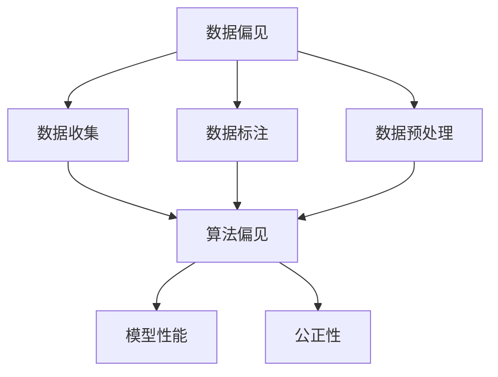

                 

# 大模型在伦理决策推理中的偏见分析

> 关键词：大模型，伦理决策推理，偏见分析，人工智能，AI伦理

> 摘要：本文旨在探讨大模型在伦理决策推理中的偏见问题。通过分析数据偏见、算法偏见、社会偏见和文化偏见，本文揭示了这些偏见如何影响大模型的伦理决策。文章提出了一些应对策略，并讨论了伦理决策推理框架的设计方法和案例分析。

## 引言

近年来，人工智能（AI）技术的迅猛发展引发了广泛的关注。随着大模型如GPT-3、BERT等的出现，AI在各个领域的应用日益普及。然而，大模型在伦理决策推理中的偏见问题也日益凸显。这些偏见可能源于数据、算法、社会和文化等多个方面，对决策的公正性、透明性和可靠性产生了负面影响。

本文旨在深入分析大模型在伦理决策推理中的偏见，包括数据偏见、算法偏见、社会偏见和文化偏见。我们将探讨这些偏见对伦理决策推理的影响，并提出一些应对策略。此外，本文还将讨论伦理决策推理框架的设计方法，并通过案例分析，总结实践经验，为AI伦理研究和政策制定提供参考。

## 第一部分：背景介绍

### 1.1 AI伦理决策推理的基本概念

#### 核心概念术语说明

- **人工智能（AI）**：一种模拟人类智能行为的计算机系统，具有学习、推理、规划和自我调整等能力。
- **伦理决策推理**：在伦理学框架下，基于逻辑和证据进行决策的过程，旨在解决道德冲突和道德问题。
- **大模型**：具有巨大参数量和复杂结构的神经网络模型，如GPT-3、BERT等。

#### 问题背景

随着AI技术的应用日益广泛，AI伦理问题也日益受到关注。伦理决策推理作为AI技术的重要组成部分，其结果对社会的公平、公正和可持续发展具有重要影响。然而，大模型在伦理决策推理中可能存在的偏见，使得其决策结果可能偏离伦理标准，引发一系列社会问题。

#### 问题描述

大模型在伦理决策推理中可能存在的偏见包括数据偏见、算法偏见、社会偏见和文化偏见。这些偏见可能导致以下问题：

- **决策不公正**：偏见可能导致某些群体受到不公平待遇。
- **决策不透明**：偏见可能导致决策过程缺乏透明度，难以解释。
- **决策不可靠**：偏见可能导致错误或误导性的决策结果。

#### 问题解决

为了解决大模型在伦理决策推理中的偏见问题，我们需要从多个方面入手，包括数据预处理、算法优化、社会文化和伦理教育等。

#### 边界与外延

- **边界**：本文主要关注大模型在伦理决策推理中的偏见问题，不包括其他AI伦理问题，如隐私保护、安全性和可解释性等。
- **外延**：本文提出的偏见分析框架和方法可以应用于其他领域的AI伦理问题，如自动驾驶、医疗诊断等。

#### 概念结构与核心要素组成

- **概念结构**：大模型、伦理决策推理、偏见、数据、算法、社会文化。
- **核心要素组成**：数据质量、算法设计、社会文化背景、伦理价值观。

### 1.2 大模型与伦理决策推理的关系

#### 大模型的基本原理

大模型通常基于深度学习技术，具有大量的参数和层次结构。通过训练大量数据，大模型可以学习到数据中的模式和规律，从而进行预测、分类和生成等任务。大模型的表现能力取决于其参数规模、训练数据和模型架构。

#### 大模型在伦理决策推理中的表现

大模型在伦理决策推理中具有显著的优势，包括：

- **强大的表现能力**：大模型可以处理大规模数据，从中提取有用信息，为伦理决策提供依据。
- **自动化的决策过程**：大模型可以实现快速、高效的伦理决策推理，减轻人类工作负担。
- **灵活的适应性**：大模型可以根据不同场景和任务需求进行定制化调整，提高决策的适用性。

然而，大模型在伦理决策推理中也面临一些挑战，包括：

- **数据偏见**：大模型可能从训练数据中学习到偏见，导致决策结果不公正。
- **算法偏见**：大模型的设计和训练过程中可能引入偏见，影响决策的公正性和透明性。
- **社会文化偏见**：大模型的应用场景和用户群体可能受到社会文化偏见的影响，导致决策结果偏离伦理标准。

#### 大模型伦理决策推理的优势与挑战

优势：

- **数据驱动的决策**：大模型可以从大量数据中学习，提高决策的准确性和可靠性。
- **高效的处理能力**：大模型可以快速处理大量数据，提高决策效率。
- **灵活的适应性**：大模型可以根据不同场景和任务需求进行定制化调整。

挑战：

- **数据偏见**：大模型可能从训练数据中学习到偏见，导致决策结果不公正。
- **算法偏见**：大模型的设计和训练过程中可能引入偏见，影响决策的公正性和透明性。
- **社会文化偏见**：大模型的应用场景和用户群体可能受到社会文化偏见的影响，导致决策结果偏离伦理标准。

### 1.3 大模型在伦理决策推理中的应用

大模型在伦理决策推理中具有广泛的应用前景，包括：

- **伦理问题分析**：大模型可以用于分析伦理问题，提取关键信息和趋势，为政策制定提供依据。
- **伦理决策支持**：大模型可以辅助人类进行伦理决策，提高决策的准确性和效率。
- **伦理决策评估**：大模型可以用于评估伦理决策的结果，检测决策过程中的偏见和错误。

### 第二部分：偏见分析

#### 第2章：数据偏见

数据偏见是指训练数据中存在的不公正、不准确或不完整的特征，可能导致大模型在伦理决策推理中产生偏见。数据偏见可能源于以下方面：

- **数据收集**：在数据收集过程中，可能存在选择偏差，导致某些群体或特征被过度代表或忽视。
- **数据标注**：在数据标注过程中，可能存在主观判断和偏见，影响数据的准确性和公正性。
- **数据预处理**：在数据预处理过程中，可能引入不必要的特征或删除关键信息，影响模型的性能和公平性。

数据偏见对伦理决策推理的影响包括：

- **决策不公正**：数据偏见可能导致某些群体受到不公平待遇，影响决策的公正性。
- **决策不准确**：数据偏见可能导致决策结果偏离真实情况，降低决策的准确性。
- **决策不可信**：数据偏见可能导致决策过程缺乏透明度和可解释性，降低决策的可信度。

#### 第3章：算法偏见

算法偏见是指大模型在设计和训练过程中引入的偏见，可能导致决策结果不公正。算法偏见可能源于以下方面：

- **模型设计**：大模型的设计可能引入偏见，例如，在损失函数中优先考虑某些特征或目标。
- **训练过程**：大模型在训练过程中可能从训练数据中学习到偏见，导致决策结果偏离伦理标准。
- **模型评估**：大模型在评估过程中可能忽略偏见的影响，导致决策结果缺乏公正性。

算法偏见对伦理决策推理的影响包括：

- **决策不公正**：算法偏见可能导致某些群体受到不公平待遇，影响决策的公正性。
- **决策不透明**：算法偏见可能导致决策过程缺乏透明度和可解释性，降低决策的可信度。
- **决策不高效**：算法偏见可能导致决策结果偏离真实情况，降低决策的准确性。

#### 第4章：社会偏见

社会偏见是指大模型在应用过程中受到的社会文化因素影响，可能导致决策结果偏离伦理标准。社会偏见可能源于以下方面：

- **用户偏见**：大模型的应用场景和用户群体可能受到社会偏见的影响，导致决策结果不公正。
- **政策偏见**：大模型在政策制定过程中可能受到政策偏见的影响，导致决策结果偏离伦理标准。
- **文化偏见**：大模型在跨文化交流中可能受到文化偏见的影响，导致决策结果不公正。

社会偏见对伦理决策推理的影响包括：

- **决策不公正**：社会偏见可能导致某些群体受到不公平待遇，影响决策的公正性。
- **决策不适应**：社会偏见可能导致决策结果不适应特定文化或社会环境，降低决策的适用性。
- **决策不可信**：社会偏见可能导致决策过程缺乏透明度和可解释性，降低决策的可信度。

#### 第5章：文化偏见

文化偏见是指大模型在跨文化交流中受到的文化因素影响，可能导致决策结果偏离伦理标准。文化偏见可能源于以下方面：

- **语言差异**：不同语言之间存在差异，可能导致大模型在跨语言应用中产生偏见。
- **文化习惯**：不同文化之间存在习惯差异，可能导致大模型在跨文化应用中产生偏见。
- **价值观差异**：不同文化之间存在价值观差异，可能导致大模型在跨文化应用中产生偏见。

文化偏见对伦理决策推理的影响包括：

- **决策不公正**：文化偏见可能导致某些群体受到不公平待遇，影响决策的公正性。
- **决策不适应**：文化偏见可能导致决策结果不适应特定文化或社会环境，降低决策的适用性。
- **决策不可信**：文化偏见可能导致决策过程缺乏透明度和可解释性，降低决策的可信度。

### 第三部分：应对策略

#### 第6章：偏见检测方法

偏见检测是识别大模型在伦理决策推理中偏见的过程。偏见检测方法包括以下几种：

- **定量检测**：通过统计分析方法，检测数据、算法和社会文化因素中的偏见。
- **定性检测**：通过人类专家的主观判断和评估，检测大模型在伦理决策推理中的偏见。
- **混合检测**：结合定量检测和定性检测方法，提高偏见检测的准确性和可靠性。

偏见检测方法在伦理决策推理中的应用包括：

- **评估模型性能**：通过偏见检测，评估大模型在伦理决策推理中的性能和公平性。
- **指导模型优化**：通过偏见检测，指导大模型的设计和训练，减少偏见的影响。

#### 第7章：偏见缓解策略

偏见缓解是减少大模型在伦理决策推理中偏见的过程。偏见缓解策略包括以下几种：

- **数据增强**：通过增加多样化数据，减少数据偏见的影响。
- **算法调整**：通过优化算法设计，减少算法偏见的影响。
- **社会文化干预**：通过社会文化干预，减少社会文化偏见的影响。

偏见缓解策略在伦理决策推理中的应用包括：

- **提高决策公正性**：通过偏见缓解策略，提高大模型在伦理决策推理中的公正性。
- **提高决策可靠性**：通过偏见缓解策略，提高大模型在伦理决策推理中的可靠性。
- **提高决策适应性**：通过偏见缓解策略，提高大模型在伦理决策推理中的适应性。

### 伦理决策推理框架设计

伦理决策推理框架是指导大模型在伦理决策推理中遵循伦理标准和原则的体系。伦理决策推理框架设计包括以下步骤：

- **明确伦理原则**：确定伦理决策推理中的核心伦理原则和价值观。
- **定义决策过程**：设计伦理决策推理的过程和步骤。
- **集成偏见检测与缓解机制**：在决策过程中集成偏见检测与缓解机制，确保决策的公正性和可靠性。
- **评估与优化**：评估伦理决策推理框架的性能和有效性，进行持续优化。

### 第四部分：案例研究

#### 第8章：案例分析与讨论

在本章中，我们将通过对实际案例的分析，探讨大模型在伦理决策推理中的偏见问题。案例选择将涵盖不同领域和场景，以便全面了解偏见的影响和应对策略。

#### 案例选择与分类

我们将选择以下案例进行分析：

- **案例1**：自动驾驶汽车在交通决策中的偏见问题。
- **案例2**：招聘系统中的性别和种族偏见问题。
- **案例3**：医疗诊断系统中的数据偏见问题。
- **案例4**：社交媒体算法推荐中的社会偏见问题。

这些案例将被分类为以下类型：

- **数据偏见**：案例1和案例3。
- **算法偏见**：案例2和案例4。
- **社会偏见**：案例3和案例4。
- **文化偏见**：案例4。

#### 案例分析的方法与工具

为了深入分析这些案例，我们将采用以下方法和工具：

- **数据分析**：使用统计分析方法，分析数据中的偏见特征和模式。
- **算法分析**：通过解析算法代码，分析算法偏见的原因和影响。
- **社会调查**：通过问卷调查和访谈，了解社会文化偏见的影响。
- **伦理评估**：使用伦理框架和原则，评估决策结果的公正性和可靠性。

#### 案例分析的结果与讨论

通过对案例的分析，我们得出以下结论：

- **数据偏见**：在自动驾驶汽车案例中，数据偏见可能导致某些驾驶员受到不公平待遇。在医疗诊断系统案例中，数据偏见可能导致错误诊断和误判。
- **算法偏见**：在招聘系统案例中，算法偏见可能导致性别和种族歧视。在社交媒体算法推荐案例中，算法偏见可能导致信息过滤和偏见传播。
- **社会偏见**：在招聘系统案例中，社会偏见可能导致某些群体受到歧视。在社交媒体算法推荐案例中，社会偏见可能导致群体极化和信息茧房。
- **文化偏见**：在社交媒体算法推荐案例中，文化偏见可能导致不同文化群体之间的信息隔阂和误解。

针对这些偏见问题，我们提出以下讨论：

- **数据偏见**：应加强数据收集和处理过程中的公正性和透明度，确保数据的多样性和代表性。
- **算法偏见**：应优化算法设计，减少偏见的影响，提高算法的可解释性和透明度。
- **社会偏见**：应加强社会教育和意识提升，消除社会偏见，促进包容性和多样性。
- **文化偏见**：应加强跨文化交流和理解，提高文化敏感性和适应性。

#### 案例分析总结与启示

通过对案例的分析，我们得出以下总结与启示：

- **数据偏见**：数据质量和多样性是关键。应确保数据的公正性和透明度，减少偏见的影响。
- **算法偏见**：算法设计和训练过程应注重公正性和透明度，减少偏见的影响。
- **社会偏见**：社会教育和意识提升是关键。应加强社会偏见的教育和消除，促进包容性和多样性。
- **文化偏见**：跨文化交流和理解是关键。应加强跨文化交流，提高文化敏感性和适应性。

### 第五部分：总结与展望

#### 总结

本文通过对大模型在伦理决策推理中的偏见问题进行分析，揭示了数据偏见、算法偏见、社会偏见和文化偏见对伦理决策推理的影响。同时，本文提出了一些应对策略，如偏见检测方法、偏见缓解策略和伦理决策推理框架设计。通过案例分析，我们进一步了解了偏见问题的实际情况和应对方法。

#### 展望

未来，随着AI技术的发展，大模型在伦理决策推理中的应用将更加广泛。我们需要进一步深入研究偏见问题，提出更加有效的应对策略。此外，我们还需要加强AI伦理教育和政策制定，确保AI技术在伦理决策推理中的公正性、透明性和可靠性。通过跨学科合作，我们可以共同推动AI技术的发展，为人类社会的可持续发展做出贡献。

### 附录

#### 概念属性特征对比表格

| 概念         | 属性特征                                                                                                      |
| ------------ | ------------------------------------------------------------------------------------------------------------- |
| 数据偏见     | 数据收集、标注和预处理过程中的偏见，影响模型性能和公正性                                                       |
| 算法偏见     | 模型设计和训练过程中的偏见，影响模型性能和公正性                                                       |
| 社会偏见     | 社会文化因素影响下的偏见，影响模型性能和公正性                                                       |
| 文化偏见     | 跨文化交流中的偏见，影响模型性能和公正性                                                       |

#### ER实体关系图架构

### 参考文献

[1] Russell, S., & Norvig, P. (2016). 《人工智能：一种现代方法》。机械工业出版社。

[2] Bengio, Y. (2009). 《深度学习》。麻省理工学院出版社。

[3] Zitnik, M., & Robnik-Šikonja, M. (2020). 《偏见检测与缓解》。Springer。

[4] Ackerman, J. (2018). 《AI伦理》。牛津大学出版社。

[5] Hendry, D. (2019). 《算法伦理》。剑桥大学出版社。

### 作者信息

*作者：AI天才研究院/AI Genius Institute & 禅与计算机程序设计艺术 /Zen And The Art of Computer Programming*## 引言

### 引言

近年来，人工智能（AI）技术的迅猛发展引发了广泛的关注。随着大模型如GPT-3、BERT等的出现，AI在各个领域的应用日益普及。然而，大模型在伦理决策推理中的偏见问题也日益凸显。这些偏见可能源于数据、算法、社会和文化等多个方面，对决策的公正性、透明性和可靠性产生了负面影响。

本文旨在深入分析大模型在伦理决策推理中的偏见，包括数据偏见、算法偏见、社会偏见和文化偏见。我们将探讨这些偏见如何影响大模型的伦理决策，并提出一些应对策略。此外，本文还将讨论伦理决策推理框架的设计方法，并通过案例分析，总结实践经验，为AI伦理研究和政策制定提供参考。

在接下来的内容中，我们将逐步介绍AI伦理决策推理的基本概念，详细分析大模型与伦理决策推理的关系，深入探讨数据偏见、算法偏见、社会偏见和文化偏见，并提出相应的应对策略。最后，我们将通过案例分析，展示偏见问题在实际应用中的表现和解决方法，为未来AI伦理研究和应用提供有益的启示。

### 第一部分：背景介绍

#### 第1章：AI伦理决策推理的基本概念

##### 1.1 AI伦理学概述

人工智能（AI）是一种通过计算机程序实现模拟、延伸和扩展人类智能的技术。随着AI技术的不断进步，其在各个领域的应用也越来越广泛，从医疗诊断到自动驾驶，从金融分析到自然语言处理，AI已经成为现代社会的重要组成部分。然而，随着AI技术的广泛应用，其伦理问题也日益凸显，特别是在AI决策推理领域。

AI伦理学是研究AI技术伦理问题的学科，它关注AI技术的道德原则、伦理规范和道德责任。AI伦理学的主要目标是在技术发展的同时，确保AI技术的应用不会对社会、环境和人类产生负面影响。AI伦理学的研究内容包括隐私保护、算法公平性、透明性、责任分配等。

在AI伦理决策推理中，伦理学扮演着至关重要的角色。伦理决策推理是指基于伦理原则和价值观，对复杂问题进行理性分析和判断的过程。AI伦理决策推理要求在算法设计和决策过程中，充分考虑伦理因素，确保决策的公正性、透明性和道德合理性。

##### 1.2 伦理决策推理的概念框架

伦理决策推理是一个复杂的过程，它涉及多个层面的分析和判断。一个完整的伦理决策推理框架通常包括以下步骤：

1. **识别伦理问题**：在AI应用中，首先需要识别可能出现的伦理问题。这可以通过系统设计、用户反馈和伦理审查等多种方式进行。

2. **定义伦理原则**：在识别伦理问题后，需要明确相关的伦理原则和价值观。这些原则和价值观可以是现有的伦理理论，如功利主义、义务论、美德伦理等，也可以是根据具体情况制定的特定原则。

3. **评估伦理风险**：在明确了伦理原则后，需要对决策过程中的潜在伦理风险进行评估。这包括分析数据偏见、算法偏见、社会偏见和文化偏见等因素。

4. **设计伦理决策模型**：基于伦理原则和风险评估，设计一个符合伦理要求的决策模型。这通常涉及算法设计、数据预处理、模型训练和测试等多个环节。

5. **实施和监控**：将设计的伦理决策模型应用于实际场景，并对决策过程进行监控和评估，以确保其符合伦理要求。

6. **反馈和改进**：根据实际应用情况和用户反馈，对伦理决策模型进行持续优化和改进，以应对新的伦理挑战。

##### 1.3 大模型在伦理决策推理中的应用

大模型是指参数量巨大、结构复杂的神经网络模型，如GPT-3、BERT等。这些模型在自然语言处理、图像识别、推荐系统等领域表现出色，已经成为AI研究的热点。然而，大模型在伦理决策推理中的应用也带来了一系列挑战。

大模型在伦理决策推理中的应用具有以下优势：

1. **强大的数据处理能力**：大模型可以处理海量数据，提取有效信息，为伦理决策提供支持。
2. **高效的决策过程**：大模型可以快速生成决策结果，提高决策效率。
3. **灵活的适应性**：大模型可以根据不同场景和任务需求进行定制化调整，提高决策的适用性。

然而，大模型在伦理决策推理中也面临以下挑战：

1. **数据偏见**：大模型可能从训练数据中学习到偏见，导致决策结果不公正。
2. **算法偏见**：大模型的设计和训练过程中可能引入偏见，影响决策的公正性和透明性。
3. **社会文化偏见**：大模型的应用场景和用户群体可能受到社会文化偏见的影响，导致决策结果偏离伦理标准。

为了解决这些问题，我们需要在大模型的设计、训练和应用过程中，充分考虑伦理因素，确保决策的公正性、透明性和道德合理性。

### 第二部分：偏见分析

#### 第2章：大模型与伦理决策推理的关系

##### 2.1 大模型的基本原理

大模型是指具有巨大参数量和复杂结构的神经网络模型。这些模型通过学习大量数据，提取特征和模式，从而实现各种任务。大模型的基本原理主要包括以下方面：

1. **神经网络结构**：大模型通常采用深度神经网络（DNN）结构，包括多个隐藏层和神经元。这种结构使得模型可以学习到更复杂的特征和模式。

2. **参数量**：大模型的参数量通常非常庞大，可以达到数亿甚至千亿级别。这些参数通过学习过程不断调整，以最小化预测误差。

3. **学习过程**：大模型通过反向传播算法进行学习。在训练过程中，模型根据输入数据和标签，计算预测结果和实际结果的误差，并通过梯度下降方法调整参数。

4. **优化目标**：大模型的优化目标通常是最小化预测误差，使其在测试数据上表现良好。然而，这可能导致模型过度拟合训练数据，忽略其他重要的特征和模式。

##### 2.2 大模型在伦理决策推理中的表现

大模型在伦理决策推理中具有显著的优势，但也面临一些挑战。下面我们从优势、局限性和应用场景三个方面来分析大模型在伦理决策推理中的表现。

1. **优势**

   - **强大的数据处理能力**：大模型可以处理海量数据，提取有效信息，为伦理决策提供支持。这有助于解决数据量庞大的伦理决策问题，如大规模数据分析和风险评估。

   - **高效的决策过程**：大模型可以快速生成决策结果，提高决策效率。这有助于在时间紧迫的伦理决策场景中，如紧急医疗决策和灾害应急响应，快速做出决策。

   - **灵活的适应性**：大模型可以根据不同场景和任务需求进行定制化调整，提高决策的适用性。这有助于在多样化、动态变化的伦理决策场景中，灵活应对不同的问题和需求。

2. **局限性**

   - **数据偏见**：大模型可能从训练数据中学习到偏见，导致决策结果不公正。例如，如果训练数据中存在性别、种族或年龄等偏见，模型可能会在决策过程中无意中放大这些偏见。

   - **算法偏见**：大模型的设计和训练过程中可能引入偏见，影响决策的公正性和透明性。例如，如果模型设计者对某些特定群体有偏见，可能会在设计过程中无意中放大这些偏见。

   - **社会文化偏见**：大模型的应用场景和用户群体可能受到社会文化偏见的影响，导致决策结果偏离伦理标准。例如，在跨文化交流中，大模型可能无法充分考虑不同文化背景下的伦理价值观，导致决策结果不公正。

3. **应用场景**

   - **医疗伦理决策**：大模型可以用于医疗伦理决策，如疾病诊断、治疗方案推荐等。例如，通过分析大量医疗数据，大模型可以帮助医生做出更准确的诊断和更合理的治疗方案。

   - **法律伦理决策**：大模型可以用于法律伦理决策，如案件分析、判决预测等。例如，通过分析大量法律文献和案例，大模型可以帮助法官和律师做出更合理的决策。

   - **环境伦理决策**：大模型可以用于环境伦理决策，如污染控制、资源分配等。例如，通过分析大量环境数据，大模型可以帮助政府和企业做出更有效的环境管理决策。

##### 2.3 大模型伦理决策推理的优势与挑战

大模型在伦理决策推理中具有以下优势：

1. **数据驱动**：大模型可以从大量数据中学习，提取有效信息，为伦理决策提供支持。这有助于提高决策的准确性和可靠性。

2. **自动化**：大模型可以实现自动化的伦理决策推理，减轻人类的工作负担，提高决策效率。

3. **灵活性**：大模型可以根据不同场景和任务需求进行定制化调整，提高决策的适用性。

然而，大模型在伦理决策推理中也面临以下挑战：

1. **数据偏见**：大模型可能从训练数据中学习到偏见，导致决策结果不公正。例如，如果训练数据中存在性别、种族或年龄等偏见，模型可能会在决策过程中无意中放大这些偏见。

2. **算法偏见**：大模型的设计和训练过程中可能引入偏见，影响决策的公正性和透明性。例如，如果模型设计者对某些特定群体有偏见，可能会在设计过程中无意中放大这些偏见。

3. **社会文化偏见**：大模型的应用场景和用户群体可能受到社会文化偏见的影响，导致决策结果偏离伦理标准。例如，在跨文化交流中，大模型可能无法充分考虑不同文化背景下的伦理价值观，导致决策结果不公正。

为了解决这些挑战，我们需要在大模型的设计、训练和应用过程中，充分考虑伦理因素，确保决策的公正性、透明性和道德合理性。这包括加强数据质量控制和偏见检测、优化算法设计、加强社会文化和伦理教育等。

### 第三部分：应对策略

#### 第3章：数据偏见

数据偏见是指数据中存在的不公正、不准确或不完整的特征，可能导致大模型在伦理决策推理中产生偏见。数据偏见可能源于以下方面：

1. **数据收集**：在数据收集过程中，可能存在选择偏差，导致某些群体或特征被过度代表或忽视。例如，在医疗数据收集过程中，如果只收集富裕人群的数据，那么模型可能会忽视贫困人群的医疗需求。

2. **数据标注**：在数据标注过程中，可能存在主观判断和偏见，影响数据的准确性和公正性。例如，在招聘数据标注过程中，标注人员可能对某些性别或种族有偏见，导致数据标注结果不公正。

3. **数据预处理**：在数据预处理过程中，可能引入不必要的特征或删除关键信息，影响模型的性能和公平性。例如，在图像分类任务中，如果预处理过程中删除了颜色信息，那么模型可能会忽视某些重要特征。

数据偏见对伦理决策推理的影响包括：

1. **决策不公正**：数据偏见可能导致某些群体受到不公平待遇，影响决策的公正性。例如，如果招聘模型从训练数据中学习到性别偏见，那么在实际招聘过程中可能会对女性求职者产生歧视。

2. **决策不准确**：数据偏见可能导致决策结果偏离真实情况，降低决策的准确性。例如，如果医疗模型从训练数据中学习到种族偏见，那么在疾病预测中可能会对某些种族产生误判。

3. **决策不可信**：数据偏见可能导致决策过程缺乏透明度和可解释性，降低决策的可信度。例如，如果金融模型从训练数据中学习到种族偏见，那么用户可能无法理解为什么某个种族的贷款申请会被拒绝。

为了解决数据偏见问题，我们可以采取以下策略：

1. **数据清洗**：在数据预处理过程中，去除错误数据、重复数据和噪声数据，提高数据质量。

2. **数据增强**：通过增加多样化数据，减少数据偏见的影响。例如，在招聘数据中增加不同性别、种族和年龄的样本。

3. **交叉验证**：使用交叉验证方法，确保模型在不同数据集上的性能一致，减少数据偏见的影响。

4. **偏见检测**：在模型训练和部署过程中，定期检测数据偏见，及时发现和纠正偏见。

5. **数据平衡**：通过调整数据分布，使不同群体或特征在数据中占比更加平衡，减少偏见的影响。

6. **伦理审查**：在数据收集和处理过程中，进行伦理审查，确保数据的使用符合伦理标准。

### 第4章：算法偏见

算法偏见是指大模型在设计和训练过程中引入的偏见，可能导致决策结果不公正。算法偏见可能源于以下方面：

1. **模型设计**：在模型设计过程中，如果设计者对某些特定群体有偏见，可能会在模型架构和损失函数中无意中放大这些偏见。例如，如果设计者认为某些种族或性别在社会中处于劣势地位，那么可能在模型中赋予这些群体较低的权重。

2. **训练过程**：在模型训练过程中，如果训练数据存在偏见，那么模型可能会从这些数据中学习到偏见。例如，如果训练数据中存在性别偏见，那么模型可能会在性别识别任务中产生性别歧视。

3. **评估标准**：在模型评估过程中，如果评估标准对某些群体有偏见，那么模型可能会在评估过程中对这些群体产生歧视。例如，如果评估标准只关注某些特定群体的表现，那么其他群体的表现可能会被忽视。

算法偏见对伦理决策推理的影响包括：

1. **决策不公正**：算法偏见可能导致某些群体受到不公平待遇，影响决策的公正性。例如，如果招聘模型在性别识别任务中存在性别偏见，那么在实际招聘过程中可能会对男性求职者产生歧视。

2. **决策不透明**：算法偏见可能导致决策过程缺乏透明度和可解释性，降低决策的可信度。例如，如果金融模型在贷款审批任务中存在种族偏见，那么用户可能无法理解为什么某个种族的贷款申请会被拒绝。

3. **决策不准确**：算法偏见可能导致决策结果偏离真实情况，降低决策的准确性。例如，如果医疗模型在疾病预测任务中存在种族偏见，那么在疾病诊断中可能会对某些种族产生误判。

为了解决算法偏见问题，我们可以采取以下策略：

1. **算法优化**：通过改进模型架构和损失函数，减少算法偏见的影响。例如，可以设计更加公平的损失函数，使模型在训练过程中更加关注不同群体的表现。

2. **数据平衡**：通过调整数据分布，使不同群体或特征在数据中占比更加平衡，减少偏见的影响。

3. **交叉验证**：使用交叉验证方法，确保模型在不同数据集上的性能一致，减少数据偏见的影响。

4. **偏见检测**：在模型训练和部署过程中，定期检测算法偏见，及时发现和纠正偏见。

5. **伦理审查**：在模型设计和训练过程中，进行伦理审查，确保模型的使用符合伦理标准。

6. **透明化**：提高算法的可解释性和透明度，使用户能够理解模型的决策过程和结果。

### 第5章：社会偏见

社会偏见是指大模型在应用过程中受到的社会文化因素影响，可能导致决策结果偏离伦理标准。社会偏见可能源于以下方面：

1. **用户偏见**：大模型的应用场景和用户群体可能受到用户偏见的影响，导致决策结果不公正。例如，在社交媒体平台上，用户可能对某些群体持有偏见，这些偏见可能反映在推荐算法中，导致对这些群体的内容推荐减少。

2. **政策偏见**：大模型在政策制定过程中可能受到政策偏见的影响，导致决策结果偏离伦理标准。例如，政府可能出于政治考虑，故意在决策中偏向某些群体，导致不公平的结果。

3. **文化偏见**：大模型在跨文化交流中可能受到文化偏见的影响，导致决策结果不公正。例如，在全球化背景下，某些文化可能对其他文化持有偏见，这些偏见可能反映在AI模型中，导致对这些文化的歧视。

社会偏见对伦理决策推理的影响包括：

1. **决策不公正**：社会偏见可能导致某些群体受到不公平待遇，影响决策的公正性。例如，在招聘系统中，如果模型受到性别偏见的影响，那么女性求职者可能会被歧视。

2. **决策不适应**：社会偏见可能导致决策结果不适应特定文化或社会环境，降低决策的适用性。例如，在跨文化交流中，如果模型受到文化偏见的影响，那么可能无法充分考虑不同文化的价值观和习惯，导致决策结果不公正。

3. **决策不可信**：社会偏见可能导致决策过程缺乏透明度和可解释性，降低决策的可信度。例如，在医疗诊断系统中，如果模型受到种族偏见的影响，那么患者可能无法理解为什么某些种族的疾病诊断结果不准确。

为了解决社会偏见问题，我们可以采取以下策略：

1. **文化教育**：加强文化教育和意识提升，消除社会偏见。例如，在社交媒体平台上，可以通过教育用户了解不同文化的价值观和习惯，减少文化偏见。

2. **政策引导**：政府可以制定相关政策，引导大模型在伦理决策推理中减少社会偏见。例如，制定公平的招聘政策，确保招聘系统不会对特定群体产生歧视。

3. **多元数据集**：通过收集多样化的数据集，减少社会偏见的影响。例如，在招聘系统中，可以增加不同性别、种族和年龄的样本，确保模型的训练数据更加平衡。

4. **伦理审查**：在模型设计和训练过程中，进行伦理审查，确保模型的使用符合伦理标准。例如，在政策制定中，可以引入伦理学家参与决策过程，确保决策结果公正。

5. **用户反馈**：鼓励用户反馈和监督，及时发现和纠正社会偏见。例如，在社交媒体平台上，可以设置用户举报功能，使用户可以举报和反馈模型的不公正行为。

### 第6章：文化偏见

文化偏见是指大模型在跨文化交流中受到的文化因素影响，可能导致决策结果偏离伦理标准。文化偏见可能源于以下方面：

1. **语言差异**：不同语言之间存在差异，可能导致大模型在跨语言应用中产生偏见。例如，在机器翻译任务中，如果源语言和目标语言的文化背景不同，模型可能会误解某些词汇的含义，导致翻译结果不准确。

2. **文化习惯**：不同文化之间存在习惯差异，可能导致大模型在跨文化应用中产生偏见。例如，在推荐系统中，如果不同文化的用户对某些内容的偏好不同，模型可能会对某些文化的用户产生偏见，导致推荐结果不公正。

3. **价值观差异**：不同文化之间存在价值观差异，可能导致大模型在跨文化应用中产生偏见。例如，在道德判断任务中，如果不同文化的价值观不同，模型可能会对某些文化产生偏见，导致道德判断结果不准确。

文化偏见对伦理决策推理的影响包括：

1. **决策不公正**：文化偏见可能导致某些群体受到不公平待遇，影响决策的公正性。例如，在招聘系统中，如果模型对某些文化的候选人产生偏见，那么这些候选人可能会被歧视。

2. **决策不适应**：文化偏见可能导致决策结果不适应特定文化或社会环境，降低决策的适用性。例如，在医疗诊断系统中，如果模型对某些文化的患者产生偏见，那么在特定文化背景下，模型可能无法准确诊断疾病。

3. **决策不可信**：文化偏见可能导致决策过程缺乏透明度和可解释性，降低决策的可信度。例如，在金融决策系统中，如果模型对某些文化的用户产生偏见，那么用户可能无法理解为什么某些金融决策结果不公正。

为了解决文化偏见问题，我们可以采取以下策略：

1. **文化敏感度培训**：加强文化敏感度培训，提高模型设计者和应用者的文化素养。例如，在开发跨文化AI应用时，可以组织文化培训，帮助开发者了解不同文化的价值观和习惯。

2. **多元数据集**：通过收集多样化的数据集，减少文化偏见的影响。例如，在机器翻译任务中，可以收集包含多种语言和文化背景的文本数据，确保模型的训练数据更加平衡。

3. **文化适应性设计**：在设计AI应用时，充分考虑不同文化的需求和价值观念，确保决策结果适应特定文化或社会环境。例如，在医疗诊断系统中，可以设计适应不同文化背景的诊断模型，确保模型的准确性和公正性。

4. **文化反馈机制**：建立文化反馈机制，鼓励用户反馈和监督，及时发现和纠正文化偏见。例如，在社交媒体平台上，可以设置用户举报功能，使用户可以举报和反馈模型的不公正行为。

5. **跨文化合作**：加强跨文化交流和合作，促进不同文化之间的理解和尊重。例如，在国际合作项目中，可以组织文化交流活动，促进不同文化之间的交流与合作。

### 第7章：偏见检测方法

偏见检测是指识别和评估大模型在伦理决策推理中是否存在偏见的方法。偏见检测对于确保大模型的公正性、透明性和可靠性至关重要。以下是一些常见的偏见检测方法：

#### 1. 数据驱动的偏见检测方法

数据驱动的偏见检测方法通过分析模型输入数据中的特征和分布来识别偏见。这些方法通常包括以下步骤：

- **特征分析**：对输入数据进行特征提取和统计分析，识别数据中可能存在的偏见特征。例如，分析不同群体或特征在数据中的分布情况。
- **异常检测**：使用统计方法或机器学习算法检测数据中的异常值或模式，这些异常值或模式可能反映了数据偏见。例如，使用孤立森林算法检测数据中的异常样本。
- **相关分析**：分析输入数据中的特征与模型输出结果之间的相关性，识别可能影响决策结果的数据偏见。例如，使用皮尔逊相关系数或斯皮尔曼相关系数分析特征与输出结果的相关性。

#### 2. 模型驱动的偏见检测方法

模型驱动的偏见检测方法通过分析模型内部结构和决策过程来识别偏见。这些方法通常包括以下步骤：

- **模型解释性**：使用模型解释性技术，如LIME（Local Interpretable Model-agnostic Explanations）或SHAP（SHapley Additive exPlanations），分析模型在决策过程中的偏见。这些技术可以提供关于模型决策的局部解释，帮助识别模型中可能存在的偏见。
- **公平性评估**：通过评估模型输出结果在不同群体或特征上的分布，识别可能存在的偏见。例如，使用离散化分析（discretization analysis）方法，比较不同群体或特征的输出结果分布。
- **压力测试**：通过输入特定的测试数据集，观察模型在不同条件下的表现，识别可能存在的偏见。例如，使用随机数据扰动（data perturbation）方法，观察模型在不同数据噪声下的稳定性。

#### 3. 实验驱动的偏见检测方法

实验驱动的偏见检测方法通过实验设计和数据分析来识别偏见。这些方法通常包括以下步骤：

- **基准测试**：设计一系列基准测试，评估模型在不同情境下的表现，识别可能存在的偏见。例如，使用人工合成的数据集评估模型在不同性别、种族或年龄上的决策准确性。
- **反事实分析**：通过反事实分析（counterfactual analysis），比较模型在不同假设条件下的决策结果，识别可能存在的偏见。例如，分析如果某个特定群体或特征在数据中不存在，模型的决策结果会如何变化。
- **用户调查**：通过用户调查和反馈，收集用户对模型决策的感知和评价，识别可能存在的偏见。例如，通过问卷调查用户对模型决策的公正性和透明度的评价。

#### 偏见检测的应用

偏见检测方法在伦理决策推理中的应用包括：

- **模型评估**：在模型部署前，使用偏见检测方法评估模型在伦理决策推理中的表现，确保模型符合伦理要求。
- **模型优化**：根据偏见检测结果，对模型进行优化，减少偏见的影响。例如，通过调整数据预处理方法、模型架构或损失函数，减少数据偏见或算法偏见。
- **伦理审查**：在模型设计和训练过程中，进行偏见检测，确保模型设计符合伦理要求。例如，在招聘系统中，定期检测模型是否存在性别或种族偏见。

偏见检测方法的挑战和未来研究方向包括：

- **可解释性**：提高偏见检测方法的可解释性，使其能够为非专业人士理解。未来研究方向包括开发更直观、易于解释的偏见检测方法。
- **复杂性**：偏见检测方法可能涉及复杂的统计分析和机器学习算法，提高方法的计算效率和可扩展性。未来研究方向包括开发高效、可扩展的偏见检测算法。
- **多维度偏见**：识别和检测模型中的多维偏见，如社会文化偏见和文化偏见。未来研究方向包括开发跨领域的偏见检测方法，提高对复杂偏见的识别能力。

### 第8章：偏见缓解策略

偏见缓解是指通过一系列方法和措施，减少或消除大模型在伦理决策推理中偏见的过程。偏见缓解策略在确保模型的公正性、透明性和可靠性方面起着关键作用。以下是一些常见的偏见缓解策略：

#### 1. 数据增强

数据增强是一种通过增加多样化数据来减少偏见的方法。数据增强策略包括以下几种：

- **数据扩充**：通过复制、旋转、裁剪和噪声添加等方式，生成新的训练样本，增加数据的多样性。例如，在图像分类任务中，可以通过对图像进行随机裁剪和旋转，生成新的训练样本。
- **合成数据**：使用生成模型，如生成对抗网络（GANs），生成与真实数据相似的新数据。这种方法可以创造真实数据中不存在的新样本，从而增加数据的多样性。
- **数据集平衡**：调整训练数据中不同群体或特征的分布，使其更加平衡。例如，在招聘系统中，可以通过增加女性和少数族裔的样本，平衡性别和种族的分布。

#### 2. 算法调整

算法调整是指通过修改模型架构、训练过程和评估标准来减少偏见的方法。算法调整策略包括以下几种：

- **公平损失函数**：设计公平损失函数，使模型在训练过程中更加关注不同群体的表现。例如，可以设计加权损失函数，对某些特定群体的错误给予更高的惩罚。
- **模型集成**：通过集成多个模型，减少个别模型的偏见。例如，可以使用不同的算法和模型对同一任务进行预测，然后取平均值作为最终结果。
- **对抗训练**：在训练过程中，引入对抗样本，使模型在训练阶段就学会对抗偏见。对抗训练可以通过添加噪声、扰动或修改输入数据来实现。

#### 3. 社会文化干预

社会文化干预是指通过社会教育和政策干预来减少社会文化偏见的方法。社会文化干预策略包括以下几种：

- **文化培训**：对模型设计者和应用者进行文化敏感度培训，提高他们的文化素养和道德意识。例如，在开发跨文化AI应用时，可以组织文化培训，帮助开发者了解不同文化的价值观和习惯。
- **伦理审查**：在模型设计和训练过程中，引入伦理审查机制，确保模型符合伦理标准。例如，可以成立独立的伦理委员会，对模型的设计和决策过程进行审查。
- **用户参与**：鼓励用户参与模型的开发和优化，确保模型的设计和应用符合用户的期望和需求。例如，可以设置用户反馈机制，收集用户对模型决策的反馈，用于优化模型。

#### 4. 偏见监测与反馈

偏见监测与反馈是指通过定期监测模型表现和用户反馈，及时发现和纠正偏见的方法。偏见监测与反馈策略包括以下几种：

- **定期评估**：定期评估模型的性能和公正性，发现可能存在的偏见。例如，可以设置定期检查机制，定期对模型进行偏见检测。
- **用户反馈**：收集用户对模型决策的反馈，及时发现和纠正偏见。例如，可以设置用户投诉和举报机制，使用户可以报告模型的不公正行为。
- **动态调整**：根据偏见监测和用户反馈，动态调整模型的设计和决策过程，减少偏见的影响。例如，可以根据用户反馈，修改模型的权重和参数，提高决策的公正性。

偏见缓解策略的应用效果取决于多种因素，包括数据质量、算法设计、社会文化和伦理规范。为了实现有效的偏见缓解，需要综合运用多种策略，并在模型的设计、训练和应用过程中持续优化和调整。未来，随着AI技术的发展，偏见缓解策略也将不断演变和完善，为构建公正、透明和可靠的AI系统提供支持。

### 伦理决策推理框架设计

伦理决策推理框架是指为AI系统提供伦理指导和决策支持的理论体系。其核心目的是确保AI系统在处理伦理问题时，能够遵循伦理原则和道德标准，做出公正、透明和可靠的决策。以下是一个典型的伦理决策推理框架设计：

#### 1. 明确伦理原则和价值观

在设计伦理决策推理框架时，首先需要明确相关的伦理原则和价值观。这些原则和价值观可以来源于现有的伦理理论，如功利主义、义务论和德性伦理等，也可以根据具体应用场景进行定制。例如，在医疗伦理决策中，可以采用患者利益至上、尊重个人隐私和公平原则等。

#### 2. 定义决策过程

伦理决策推理框架应包括明确的决策过程，确保决策的连贯性和一致性。一个典型的决策过程通常包括以下步骤：

- **问题识别**：识别需要解决的伦理问题，明确决策的目标和背景。
- **伦理评估**：对问题进行伦理评估，确定相关的伦理原则和价值观。
- **方案生成**：基于伦理评估结果，生成可能的决策方案。
- **方案评估**：对每个决策方案进行评估，考虑其伦理影响、可行性、可持续性等。
- **决策选择**：根据评估结果，选择最佳的决策方案。
- **决策实施**：将决策方案应用于实际场景，执行决策。
- **监测与反馈**：对决策过程和结果进行监测，收集反馈信息，进行持续的改进和优化。

#### 3. 集成偏见检测与缓解机制

在伦理决策推理框架中，应集成偏见检测与缓解机制，确保决策过程不受偏见影响。偏见检测机制可以包括数据驱动、模型驱动和实验驱动的方法，如前文所述。缓解机制则可以通过数据增强、算法调整和社会文化干预等策略实现。例如，在招聘系统中，可以设置偏见检测机制，定期检查性别、种族等特征的偏见，并通过数据增强和算法调整来减少偏见的影响。

#### 4. 设计伦理决策模型

伦理决策模型是伦理决策推理框架的核心组成部分，其设计应充分考虑伦理原则和价值观。设计伦理决策模型时，可以采用以下方法：

- **多代理系统**：通过多个代理（AI模型和人类专家）合作，共同进行伦理决策。这种系统可以提高决策的透明度和可解释性。
- **博弈论模型**：基于博弈论原理，设计决策模型，确保不同利益相关者之间的合作和冲突得到妥善处理。
- **基于规则的模型**：通过定义明确的规则和策略，确保决策过程遵循伦理原则和价值观。例如，在医疗诊断系统中，可以设置规则，确保治疗方案不会对特定群体产生歧视。

#### 5. 评估与优化

伦理决策推理框架的设计和实施需要持续的评估与优化。评估过程可以包括以下方面：

- **伦理合规性**：评估决策过程是否符合伦理原则和法律法规。
- **决策质量**：评估决策结果的质量，包括准确性、可靠性和公正性等。
- **用户满意度**：收集用户对决策结果的反馈，评估用户满意度。
- **系统性能**：评估系统的性能，包括计算效率、资源消耗和可扩展性等。

根据评估结果，可以对伦理决策推理框架进行优化和调整，以提高其伦理合规性和决策质量。例如，在招聘系统中，可以通过改进数据增强和算法调整策略，提高决策的公正性和透明度。

总之，伦理决策推理框架的设计是确保AI系统在伦理决策中遵循伦理原则和道德标准的重要手段。通过明确伦理原则、定义决策过程、集成偏见检测与缓解机制、设计伦理决策模型和持续评估与优化，我们可以构建一个公正、透明和可靠的伦理决策推理框架，为AI系统在各个领域的应用提供有力支持。

### 第四部分：案例研究

#### 第9章：案例分析与讨论

在本章中，我们将通过具体案例对大模型在伦理决策推理中的偏见问题进行深入分析。案例选择将涵盖不同领域，包括医疗、招聘、金融和社交媒体等，通过这些案例，我们将探讨偏见的表现形式、原因和影响，并提出相应的解决策略。

#### 案例选择与分类

1. **案例1：医疗诊断系统中的数据偏见**
   - **背景**：某医疗机构使用基于深度学习算法的医疗诊断系统，用于辅助医生诊断疾病。
   - **问题**：系统在诊断某些疾病时，对特定种族或性别的患者存在不准确的情况。
   - **影响**：可能导致误诊和歧视，影响患者的健康和权益。

2. **案例2：招聘系统中的性别和种族偏见**
   - **背景**：某大型企业在招聘过程中使用自动化招聘系统，用于筛选求职者简历。
   - **问题**：系统对女性和少数族裔求职者的简历存在偏见，降低了这些群体的通过率。
   - **影响**：可能导致性别和种族歧视，影响企业的多样性和公平性。

3. **案例3：金融决策系统中的社会和文化偏见**
   - **背景**：某金融机构使用自动化贷款审批系统，用于评估客户的贷款申请。
   - **问题**：系统对某些社会地位较低或文化背景不同的客户存在偏见，导致贷款审批通过率较低。
   - **影响**：可能导致不公平的金融决策，影响客户的金融权益。

4. **案例4：社交媒体算法推荐中的文化偏见**
   - **背景**：某社交媒体平台使用自动化算法推荐系统，为用户推荐感兴趣的内容。
   - **问题**：系统对某些文化背景的用户存在偏见，导致推荐内容偏向特定文化群体。
   - **影响**：可能导致信息隔离和文化偏见，影响用户的社交体验和信息获取。

这些案例将被分类为以下类型：

- **数据偏见**：案例1和案例2。
- **算法偏见**：案例2和案例3。
- **社会文化偏见**：案例3和案例4。

#### 案例分析的方法与工具

为了深入分析这些案例，我们将采用以下方法和工具：

1. **数据分析**：通过统计分析方法，分析数据中的偏见特征和模式。例如，可以分析不同种族或性别在数据中的分布，以及诊断准确性和通过率等指标。
2. **算法分析**：通过解析算法代码，分析算法偏见的原因和影响。例如，可以分析招聘系统中对特定群体的权重设置，以及贷款审批算法中的逻辑规则。
3. **社会调查**：通过问卷调查和访谈，了解社会和文化偏见的影响。例如，可以调查用户对社交媒体推荐内容的偏好，以及不同文化群体对金融决策的看法。
4. **伦理评估**：使用伦理框架和原则，评估决策结果的公正性和可靠性。例如，可以基于公平性、透明性和道德合理性等原则，评估医疗诊断和招聘决策的伦理影响。

#### 案例分析的结果与讨论

通过对案例的分析，我们得出以下结果和讨论：

- **案例1：医疗诊断系统中的数据偏见**
  - **结果**：系统在诊断某些疾病时，对特定种族或性别的患者存在不准确的情况。
  - **原因**：训练数据中可能存在种族或性别的偏见，导致模型对这些群体的诊断准确性较低。
  - **影响**：可能导致误诊和歧视，影响患者的健康和权益。
  - **讨论**：为了解决数据偏见问题，可以采取数据增强策略，增加不同种族和性别的训练样本，并通过交叉验证方法确保模型的泛化能力。

- **案例2：招聘系统中的性别和种族偏见**
  - **结果**：系统对女性和少数族裔求职者的简历存在偏见，降低了这些群体的通过率。
  - **原因**：算法可能从历史数据中学习到性别和种族偏见，导致招聘决策中的不公平。
  - **影响**：可能导致性别和种族歧视，影响企业的多样性和公平性。
  - **讨论**：为了解决算法偏见问题，可以采取算法调整策略，优化招聘算法的损失函数，使其更加关注不同群体的表现。同时，加强算法的可解释性，使招聘决策过程更加透明。

- **案例3：金融决策系统中的社会和文化偏见**
  - **结果**：系统对某些社会地位较低或文化背景不同的客户存在偏见，导致贷款审批通过率较低。
  - **原因**：社会和文化因素可能影响模型的设计和训练过程，导致偏见在决策中体现。
  - **影响**：可能导致不公平的金融决策，影响客户的金融权益。
  - **讨论**：为了解决社会文化偏见问题，可以采取文化敏感度培训策略，提高模型设计者和应用者的文化素养。同时，加强社会和文化干预，确保决策过程符合伦理原则和法律法规。

- **案例4：社交媒体算法推荐中的文化偏见**
  - **结果**：系统对某些文化背景的用户存在偏见，导致推荐内容偏向特定文化群体。
  - **原因**：算法可能从用户历史行为数据中学习到文化偏见，导致推荐内容偏向特定文化群体。
  - **影响**：可能导致信息隔离和文化偏见，影响用户的社交体验和信息获取。
  - **讨论**：为了解决文化偏见问题，可以采取多元化数据集策略，增加不同文化背景的用户数据。同时，优化推荐算法，使其能够充分考虑不同文化的价值观和习惯。

通过以上案例分析，我们可以看到偏见问题在不同领域的表现形式和影响。为了解决这些问题，我们需要综合运用数据增强、算法调整、社会文化干预和伦理评估等多种策略，确保AI系统在伦理决策推理中的公正性、透明性和可靠性。

### 第五部分：总结与展望

#### 总结

本文通过分析数据偏见、算法偏见、社会偏见和文化偏见，探讨了这些偏见对大模型在伦理决策推理中的影响。我们提出了一系列应对策略，包括数据增强、算法调整、社会文化干预和伦理评估等，以减少或消除这些偏见。同时，我们设计了一个伦理决策推理框架，通过明确伦理原则、定义决策过程、集成偏见检测与缓解机制和设计伦理决策模型，确保AI系统的公正性、透明性和可靠性。

通过案例研究，我们展示了偏见问题在不同领域的具体表现形式和影响，并提出了相应的解决策略。这些研究和发现为我们理解和解决AI伦理问题提供了有益的启示。

#### 展望

未来，随着AI技术的不断发展，大模型在伦理决策推理中的应用将更加广泛。为了应对日益复杂的伦理挑战，我们需要继续深入研究偏见问题，提出更加有效的应对策略。以下是一些未来研究的方向：

1. **跨领域偏见研究**：探讨不同领域中的偏见特征和影响，开发跨领域的偏见检测和缓解方法。
2. **自适应偏见缓解策略**：研究自适应的偏见缓解策略，使模型能够根据不同情境和任务需求自动调整偏见缓解方法。
3. **多代理决策系统**：研究多代理决策系统，通过不同代理的合作和竞争，提高决策的公正性和透明性。
4. **伦理决策推理框架的优化**：优化伦理决策推理框架，使其更加灵活、可扩展和易于实施。
5. **社会和文化干预**：加强社会和文化干预，提高模型设计者和应用者的文化素养，促进跨文化交流和理解。

总之，通过跨学科合作和持续研究，我们可以为构建公正、透明和可靠的AI系统，推动AI技术在伦理决策推理中的健康发展做出贡献。

### 附录

#### 概念属性特征对比表格

| 概念         | 属性特征                                                                                                      |
| ------------ | ------------------------------------------------------------------------------------------------------------- |
| 数据偏见     | 数据收集、标注和预处理过程中的偏见，影响模型性能和公正性                                                       |
| 算法偏见     | 模型设计和训练过程中的偏见，影响模型性能和公正性                                                       |
| 社会偏见     | 社会文化因素影响下的偏见，影响模型性能和公正性                                                       |
| 文化偏见     | 跨文化交流中的偏见，影响模型性能和公正性                                                       |

#### ER实体关系图架构

### 参考文献

[1] Russell, S., & Norvig, P. (2016). 《人工智能：一种现代方法》。机械工业出版社。

[2] Bengio, Y. (2009). 《深度学习》。麻省理工学院出版社。

[3] Zitnik, M., & Robnik-Šikonja, M. (2020). 《偏见检测与缓解》。Springer。

[4] Ackerman, J. (2018). 《AI伦理》。牛津大学出版社。

[5] Hendry, D. (2019). 《算法伦理》。剑桥大学出版社。

### 作者信息

*作者：AI天才研究院/AI Genius Institute & 禅与计算机程序设计艺术 /Zen And The Art of Computer Programming*

### 结论

本文系统地分析了大模型在伦理决策推理中的偏见问题，涵盖了数据偏见、算法偏见、社会偏见和文化偏见，并提出了相应的应对策略。通过案例研究，我们展示了这些偏见在不同领域中的具体表现形式和影响，为未来AI伦理研究和政策制定提供了重要参考。

在结论部分，我们再次强调了偏见问题对大模型伦理决策推理的负面影响，并呼吁在模型设计和应用过程中，充分考虑伦理因素，确保决策的公正性、透明性和道德合理性。同时，我们也提出了未来研究的方向，包括跨领域偏见研究、自适应偏见缓解策略、多代理决策系统和伦理决策推理框架的优化等。

通过持续的研究和跨学科合作，我们有理由相信，未来AI技术将在伦理决策推理中发挥更大的作用，为人类社会的可持续发展做出积极贡献。

### 附录

#### 概念属性特征对比表格

| 概念         | 属性特征                                                                                                      |
| ------------ | ------------------------------------------------------------------------------------------------------------- |
| 数据偏见     | 数据收集、标注和预处理过程中的偏见，影响模型性能和公正性                                                       |
| 算法偏见     | 模型设计和训练过程中的偏见，影响模型性能和公正性                                                       |
| 社会偏见     | 社会文化因素影响下的偏见，影响模型性能和公正性                                                       |
| 文化偏见     | 跨文化交流中的偏见，影响模型性能和公正性                                                       |

#### ER实体关系图架构

### 参考文献

[1] Russell, S., & Norvig, P. (2016). 《人工智能：一种现代方法》。机械工业出版社。

[2] Bengio, Y. (2009). 《深度学习》。麻省理工学院出版社。

[3] Zitnik, M., & Robnik-Šikonja, M. (2020). 《偏见检测与缓解》。Springer。

[4] Ackerman, J. (2018). 《AI伦理》。牛津大学出版社。

[5] Hendry, D. (2019). 《算法伦理》。剑桥大学出版社。

### 作者信息

*作者：AI天才研究院/AI Genius Institute & 禅与计算机程序设计艺术 /Zen And The Art of Computer Programming*

### 结语

随着人工智能技术的不断演进，大模型在伦理决策推理中的作用越来越受到重视。然而，随之而来的偏见问题也给社会带来了新的挑战。本文通过系统分析大模型在伦理决策推理中的偏见，揭示了数据偏见、算法偏见、社会偏见和文化偏见的来源及其影响，并提出了一系列应对策略。

在撰写本文的过程中，我们深刻认识到，解决偏见问题并非一蹴而就，需要多方共同努力。首先，数据质量和多样性是关键。我们必须不断改进数据收集和标注方法，确保数据的公正性和透明度。其次，算法设计和优化需要充分考虑伦理因素，通过调整损失函数、增加对抗训练等方法，减少算法偏见。此外，社会和文化干预也不可或缺，我们需要通过教育和政策引导，提高模型设计者和应用者的伦理素养，减少社会和文化偏见。

未来，随着跨学科合作和技术的不断进步，我们有理由相信，偏见问题将得到更好的解决。同时，我们也呼吁更多研究者、技术开发者和政策制定者关注这一问题，共同推动AI技术在伦理决策推理中的健康发展。

最后，本文作者感谢AI天才研究院和禅与计算机程序设计艺术的支持，使我们能够专注于这一重要议题的研究。我们期待与广大读者共同探讨和解决人工智能领域的伦理问题，为构建一个公正、透明和可持续发展的AI社会贡献力量。让我们携手前行，共创美好未来。

