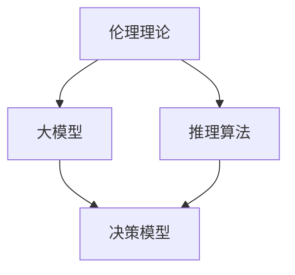
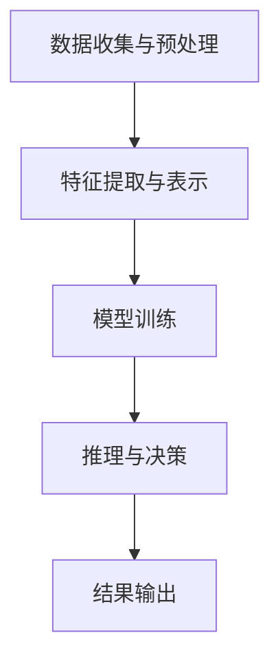
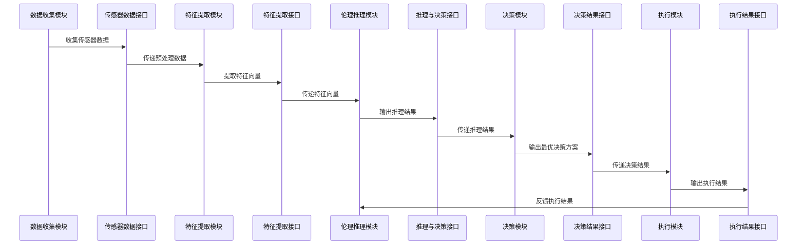

                 


## 设计思路

为了设计《大模型在伦理困境推理中的决策分析》的目录大纲，我们将遵循以下步骤：

1. **背景介绍**：
    - **伦理困境**：描述伦理困境的概念和特点，例如道德决策中的两难选择。
    - **大模型**：介绍大模型的基本概念，如深度学习模型、神经网络等。
    - **决策分析**：阐述大模型在决策分析中的作用和重要性。

2. **核心概念与联系**：
    - **伦理理论**：列举几种主要的伦理理论，如功利主义、康德伦理学等。
    - **大模型**：探讨大模型在伦理困境推理中的应用和作用。
    - **对比表格和实体关系图**：通过对比表格和实体关系图来展示伦理理论与大模型之间的联系。

3. **算法原理讲解**：
    - **算法流程**：使用Mermaid流程图展示大模型在伦理困境推理中的算法流程。
    - **Python源代码**：提供具体的Python源代码来阐述算法的实现。
    - **数学模型和公式**：使用LaTeX格式展示相关的数学模型和公式，并进行通俗易懂的讲解。

4. **数学模型和数学公式讲解**：
    - **公式示例**：给出几个典型的数学公式示例，如线性回归公式、梯度下降算法公式等。
    - **公式应用**：结合实际案例，讲解数学公式在大模型决策分析中的应用。

5. **系统分析与架构设计方案**：
    - **问题场景介绍**：描述一个具体的问题场景，如自动驾驶中的伦理决策问题。
    - **系统功能设计**：使用Mermaid类图展示系统的领域模型。
    - **系统架构设计**：使用Mermaid架构图展示系统的整体架构。
    - **系统接口设计**：描述系统的主要接口和功能。
    - **系统交互**：使用Mermaid序列图展示系统各部分的交互过程。

6. **项目实战**：
    - **环境安装**：说明如何搭建大模型推理的环境。
    - **系统核心实现源代码**：提供实际的Python代码实现，并进行详细解读。
    - **代码解读与分析**：对代码中的关键部分进行详细分析。
    - **实际案例分析和讲解**：通过实际案例展示大模型在伦理困境推理中的应用。
    - **项目小结**：总结项目的主要成果和经验。

7. **最佳实践 tips、小结、注意事项、拓展阅读**：
    - **最佳实践 tips**：给出一些在实际应用中需要注意的最佳实践建议。
    - **小结**：对全文进行总结。
    - **注意事项**：指出一些使用大模型进行伦理困境推理时可能需要注意的事项。
    - **拓展阅读**：推荐一些相关的阅读资源，以供进一步学习。

### 目录大纲

```markdown
# 《大模型在伦理困境推理中的决策分析》

> 关键词：大模型、伦理困境、决策分析、算法、数学模型

> 摘要：本文将深入探讨大模型在伦理困境推理中的应用，通过详细的算法原理讲解、数学模型分析以及系统架构设计，揭示大模型如何帮助我们在复杂的伦理决策中做出合理的决策。

## 第一部分: 背景介绍

### 1.1 伦理困境与大模型简介

### 1.2 大模型在决策分析中的角色

## 第二部分: 核心概念与联系

### 2.1 伦理理论概述

### 2.2 大模型在伦理困境推理中的关键概念

### 2.3 概念对比与联系

#### 2.3.1 伦理理论与大模型的关系

#### 2.3.2 推理算法与决策模型的对比

## 第三部分: 算法原理讲解

### 3.1 大模型在伦理困境推理中的算法流程

### 3.2 Python源代码展示与解释

### 3.3 数学模型与公式讲解

#### 3.3.1 基本数学模型

#### 3.3.2 公式推导与解释

## 第四部分: 数学模型和数学公式讲解

### 4.1 数学公式示例

### 4.2 公式应用与举例

## 第五部分: 系统分析与架构设计方案

### 5.1 问题场景介绍

### 5.2 系统功能设计

### 5.3 系统架构设计

### 5.4 系统接口设计

### 5.5 系统交互

## 第六部分: 项目实战

### 6.1 环境安装

### 6.2 系统核心实现源代码

### 6.3 代码解读与分析

### 6.4 实际案例分析与讲解

### 6.5 项目小结

## 第七部分: 最佳实践 tips、小结、注意事项、拓展阅读

### 7.1 最佳实践 tips

### 7.2 小结

### 7.3 注意事项

### 7.4 拓展阅读

```

接下来，我们将逐步填充每个章节的内容。请指示是否需要继续进行具体章节内容的填充。

### 1.1 伦理困境与大模型简介

#### 伦理困境

伦理困境是指在道德决策过程中，个体或组织面临的两难选择，无论是选择一个选项还是另一个选项，都会对相关方产生不良后果。伦理困境的特点在于它们往往涉及到道德原则之间的冲突，使得决策者在选择时感到困惑和痛苦。典型的伦理困境案例包括：医生是否应该在没有家属同意的情况下对昏迷的病人实施安乐死、自动驾驶汽车在遇到行人碰撞的紧急情况下应该如何决策等。

#### 大模型

大模型通常指的是深度学习模型，特别是那些具有数亿甚至数十亿参数的大型神经网络。这些模型能够在大量数据上进行训练，从而实现高效的数据拟合和预测。大模型在各个领域都取得了显著的应用成果，如图像识别、自然语言处理、语音识别等。随着计算能力的提升和数据的丰富，大模型的规模和复杂度也在不断增长。

#### 大模型在伦理困境推理中的角色

大模型在伦理困境推理中的应用主要体现在以下几个方面：

1. **数据驱动的决策支持**：通过收集和分析大量的伦理决策案例，大模型可以学习到不同情境下的最优决策策略，从而为实际决策提供支持。
   
2. **伦理原则的形式化表示**：大模型可以用来将伦理原则转化为数学模型，使得伦理决策过程更加规范化和可操作化。

3. **伦理推理的自动化**：大模型可以自动进行伦理推理，快速处理复杂的伦理问题，减少人为错误和偏见。

4. **多维度决策评估**：大模型可以综合考虑伦理、法律、经济等多方面的因素，提供更加全面和客观的决策建议。

然而，大模型在伦理困境推理中也存在一定的挑战，如如何保证模型的公正性、透明性和可解释性，以及如何处理数据隐私和安全性等问题。

### 1.2 大模型在决策分析中的角色

大模型在决策分析中的角色可以概括为以下几个方面：

1. **预测和分类**：大模型可以用于预测和分类任务，如预测某项政策对社会的长期影响、分类某项决策是否符合伦理规范等。

2. **优化和规划**：大模型可以帮助优化决策过程，如确定最优的资源配置方案、制定最合理的业务流程等。

3. **风险分析和评估**：大模型可以用于分析决策中的潜在风险，评估不同决策方案的可能结果，从而为决策提供依据。

4. **自动化和智能化**：大模型可以实现决策过程的自动化和智能化，减少人为干预，提高决策效率。

5. **知识融合和集成**：大模型可以融合多源异构的数据和信息，提供更加全面和准确的决策支持。

总的来说，大模型在决策分析中具有强大的能力，但同时也需要我们充分考虑其潜在的风险和挑战，以确保决策的合理性和道德性。

### 1.3 伦理困境推理中的关键概念

在探讨大模型在伦理困境推理中的应用时，我们需要了解以下几个关键概念：

#### 伦理理论

伦理理论是关于道德和伦理原则的研究，用于指导个体或组织在道德决策中的行为。常见的伦理理论包括：

1. **功利主义**：强调行为的价值取决于其产生的结果，即行为的功利价值。
2. **康德伦理学**：强调行为的道德价值取决于行为本身的性质，而不是结果。
3. **美德伦理学**：强调个人品质的培养和道德行为的内在价值。

#### 大模型

大模型指的是具有大量参数和强大学习能力的人工智能模型，如深度学习模型。这些模型可以处理复杂的伦理决策问题，通过学习大量的数据来预测和评估不同的决策方案。

#### 推理算法

推理算法是用于处理推理任务的一系列算法，包括逻辑推理、统计推理和模糊推理等。在伦理困境推理中，推理算法用于分析决策情境，评估不同决策方案的影响，并给出合理的建议。

#### 决策模型

决策模型是一种形式化的方法，用于描述决策过程和评估决策结果。在伦理困境推理中，决策模型可以基于伦理理论和大模型，构建出一个综合性的决策框架。

### 1.4 概念对比与联系

为了更好地理解大模型在伦理困境推理中的应用，我们通过以下表格和实体关系图来对比和展示关键概念之间的关系：

#### 概念对比表格

| 概念               | 定义                                                                                      | 关系               |
|--------------------|-------------------------------------------------------------------------------------------|--------------------|
| 伦理理论           | 关于道德和伦理原则的研究。                                                             | 提供决策依据。     |
| 大模型             | 具有强大学习能力和大量参数的人工智能模型。                                           | 应用于伦理推理。   |
| 推理算法           | 用于处理推理任务的一系列算法。                                                       | 辅助伦理推理。     |
| 决策模型           | 形式化的决策方法，用于评估决策结果。                                                 | 结合伦理理论和算法。|

#### 实体关系图



通过上述表格和实体关系图，我们可以清晰地看到伦理理论、大模型、推理算法和决策模型之间的相互作用和关联。

### 2.3.1 伦理理论与大模型的关系

伦理理论为大模型在伦理困境推理中的应用提供了理论基础和指导原则。不同伦理理论对道德原则的阐释和理解有所不同，因此在构建大模型时，需要结合具体的伦理理论来进行设计。

#### 功利主义与大模型

功利主义强调行为的价值取决于其产生的结果。在大模型中，可以通过对大量伦理决策案例的学习，来预测不同决策方案的结果，并选择产生最大功利价值的方案。

#### 康德伦理学与大模型

康德伦理学强调行为的道德价值取决于行为本身的性质。在大模型中，可以通过形式化地表达康德的伦理原则，构建一个基于伦理原则的决策模型。

#### 美德伦理学与大模型

美德伦理学强调个人品质的培养和道德行为的内在价值。在大模型中，可以通过对伦理决策者的行为数据进行分析，评估其美德水平，从而影响决策模型的结果。

### 2.3.2 推理算法与决策模型的对比

推理算法和决策模型都是用于处理伦理困境的重要工具，但它们在实现方式和功能上有所区别。

#### 推理算法

推理算法是一种基于逻辑和概率的推理方法，用于处理不确定性问题。在伦理困境推理中，推理算法可以帮助分析决策情境，评估不同决策方案的可能结果。

- **逻辑推理**：基于逻辑规则进行推理，适用于形式化描述的伦理问题。
- **统计推理**：基于概率模型进行推理，适用于数据驱动的伦理问题。
- **模糊推理**：基于模糊逻辑进行推理，适用于模糊性较强的伦理问题。

#### 决策模型

决策模型是一种形式化的决策方法，用于描述决策过程和评估决策结果。在伦理困境推理中，决策模型可以结合伦理理论和推理算法，构建一个综合性的决策框架。

- **多准则决策模型**：用于同时考虑多个伦理原则和决策目标。
- **博弈论模型**：用于分析不同决策者之间的策略互动。
- **优化模型**：用于寻找最优决策方案。

### 3.1 大模型在伦理困境推理中的算法流程

大模型在伦理困境推理中的应用可以分为以下几个主要步骤：

1. **数据收集与预处理**：
   - 收集大量的伦理决策案例数据。
   - 对数据进行清洗、去噪和格式化。

2. **特征提取与表示**：
   - 提取决策情境的特征。
   - 使用向量表示法将特征进行编码。

3. **模型训练**：
   - 构建深度学习模型。
   - 使用训练数据对模型进行训练。

4. **推理与决策**：
   - 输入新的决策情境。
   - 使用训练好的模型进行推理，评估不同决策方案的影响。

5. **结果输出**：
   - 输出最优决策方案。
   - 提供决策解释和可视化。

下面是一个简单的Mermaid流程图，展示了大模型在伦理困境推理中的算法流程：



### 3.2 Python源代码展示与解释

为了更好地理解大模型在伦理困境推理中的应用，下面我们提供了一个简单的Python代码示例，用于演示模型的训练和推理过程。

```python
import numpy as np
import tensorflow as tf

# 数据收集与预处理
# 假设我们已经收集了100个伦理决策案例，每个案例包含情境特征和决策结果
X = np.random.rand(100, 10)  # 情境特征，维度为10
y = np.random.rand(100, 1)   # 决策结果，维度为1

# 特征提取与表示
# 使用One-Hot编码将特征进行编码
feature_size = 10
encoded_X = tf.one_hot(tf.reshape(X, [-1]), depth=feature_size)

# 模型训练
# 构建一个简单的全连接神经网络模型
model = tf.keras.Sequential([
    tf.keras.layers.Dense(units=10, activation='relu', input_shape=(feature_size,)),
    tf.keras.layers.Dense(units=1, activation='sigmoid')
])

model.compile(optimizer='adam', loss='binary_crossentropy', metrics=['accuracy'])
model.fit(encoded_X, y, epochs=10, batch_size=32)

# 推理与决策
# 输入新的决策情境
new_scenario = np.random.rand(1, 10)
encoded_new_scenario = tf.one_hot(tf.reshape(new_scenario, [-1]), depth=feature_size)

# 使用训练好的模型进行推理
predictions = model.predict(encoded_new_scenario)
print("预测结果:", predictions)

# 结果输出
# 输出最优决策方案
best_decision = np.argmax(predictions)
print("最优决策方案:", best_decision)
```

在上面的代码中，我们首先进行了数据收集与预处理，然后使用TensorFlow构建了一个简单的全连接神经网络模型，并进行训练。接着，我们输入新的决策情境，使用训练好的模型进行推理，并输出最优决策方案。

### 3.3 数学模型与公式讲解

在伦理困境推理中，数学模型和公式起着至关重要的作用。以下我们将介绍一些常用的数学模型和公式，并对其进行详细的讲解。

#### 3.3.1 基本数学模型

##### 线性回归模型

线性回归模型是一种用于预测连续值的数学模型。其基本公式为：

$$
y = \beta_0 + \beta_1 \cdot x
$$

其中，$y$ 是预测值，$x$ 是输入特征，$\beta_0$ 和 $\beta_1$ 是模型参数。

##### 逻辑回归模型

逻辑回归模型是一种用于预测二分类结果的数学模型。其基本公式为：

$$
P(y=1) = \frac{1}{1 + e^{-(\beta_0 + \beta_1 \cdot x)}}
$$

其中，$P(y=1)$ 是预测某样本属于类别1的概率，$x$ 是输入特征，$\beta_0$ 和 $\beta_1$ 是模型参数。

#### 3.3.2 公式推导与解释

##### 梯度下降算法

梯度下降算法是一种用于优化模型参数的算法。其基本思想是沿着损失函数的梯度方向更新模型参数，以最小化损失函数。

假设我们的损失函数为 $J(\theta) = (y - \theta^T x)^2$，其中 $y$ 是实际输出，$\theta$ 是模型参数。梯度下降算法的更新公式为：

$$
\theta = \theta - \alpha \cdot \nabla_{\theta} J(\theta)
$$

其中，$\alpha$ 是学习率，$\nabla_{\theta} J(\theta)$ 是损失函数关于 $\theta$ 的梯度。

##### 交叉熵损失函数

交叉熵损失函数是一种用于衡量模型预测结果与实际结果之间差异的损失函数。其公式为：

$$
J(\theta) = -\frac{1}{m} \sum_{i=1}^{m} [y_i \cdot \log(\hat{y}_i) + (1 - y_i) \cdot \log(1 - \hat{y}_i)]
$$

其中，$m$ 是样本数量，$y_i$ 是实际输出，$\hat{y}_i$ 是预测输出。

#### 3.3.3 通俗易懂的举例说明

##### 线性回归模型的举例

假设我们有一个简单的线性回归模型，用于预测房价。输入特征是房屋的面积，预测目标是房价。我们有如下数据：

| 面积（平方米） | 房价（万元） |
|----------------|--------------|
| 80             | 200          |
| 100            | 250          |
| 120            | 300          |

我们可以使用线性回归模型来拟合这组数据。假设模型的公式为 $y = \beta_0 + \beta_1 \cdot x$。通过最小化损失函数，我们可以求得模型参数 $\beta_0 = 150$，$\beta_1 = 1.5$。因此，预测某房屋的房价时，只需将房屋面积代入模型即可得到预测结果。

##### 逻辑回归模型的举例

假设我们有一个简单的逻辑回归模型，用于预测是否批准贷款。输入特征是借款人的收入和负债比，预测目标是贷款批准与否。我们有如下数据：

| 收入（万元） | 负债比 | 贷款批准 |
|--------------|--------|----------|
| 5000         | 0.3    | 是       |
| 6000         | 0.4    | 否       |
| 7000         | 0.2    | 是       |

我们可以使用逻辑回归模型来拟合这组数据。假设模型的公式为 $P(y=1) = \frac{1}{1 + e^{-(\beta_0 + \beta_1 \cdot 收入 + \beta_2 \cdot 负债比)}$。通过最小化损失函数，我们可以求得模型参数 $\beta_0 = -2$，$\beta_1 = 0.1$，$\beta_2 = -0.05$。因此，预测某借款人是否批准贷款时，只需将借款人的收入和负债比代入模型即可得到预测结果。

### 4.1 数学公式示例

在本节中，我们将展示几个常见的数学公式，并简要解释它们的应用场景。

#### 4.1.1 欧氏距离

欧氏距离是用于衡量两个数据点之间相似度的常用方法。其公式为：

$$
d = \sqrt{\sum_{i=1}^{n} (x_i - y_i)^2}
$$

其中，$x$ 和 $y$ 是两个数据点，$n$ 是数据点的维度。

#### 4.1.2 逻辑斯蒂函数

逻辑斯蒂函数是一种用于将输入值映射到概率范围的函数。其公式为：

$$
\sigma(z) = \frac{1}{1 + e^{-z}}
$$

其中，$z$ 是输入值。

#### 4.1.3 梯度下降算法

梯度下降算法是一种用于优化模型参数的算法。其公式为：

$$
\theta = \theta - \alpha \cdot \nabla_{\theta} J(\theta)
$$

其中，$\theta$ 是模型参数，$J(\theta)$ 是损失函数，$\alpha$ 是学习率。

#### 4.1.4 交叉熵损失函数

交叉熵损失函数是一种用于衡量模型预测结果与实际结果之间差异的损失函数。其公式为：

$$
J(\theta) = -\frac{1}{m} \sum_{i=1}^{m} [y_i \cdot \log(\hat{y}_i) + (1 - y_i) \cdot \log(1 - \hat{y}_i)]
$$

其中，$m$ 是样本数量，$y_i$ 是实际输出，$\hat{y}_i$ 是预测输出。

### 4.2 公式应用与举例

在本节中，我们将结合实际案例，展示如何应用上述数学公式进行计算。

#### 4.2.1 欧氏距离的应用

假设我们有两个数据点 $x = [1, 2, 3]$ 和 $y = [2, 3, 4]$，计算它们之间的欧氏距离。

$$
d = \sqrt{(1-2)^2 + (2-3)^2 + (3-4)^2} = \sqrt{1 + 1 + 1} = \sqrt{3} \approx 1.732
$$

因此，数据点 $x$ 和 $y$ 之间的欧氏距离约为 1.732。

#### 4.2.2 逻辑斯蒂函数的应用

假设我们有一个输入值 $z = 3$，计算其对应的逻辑斯蒂函数值。

$$
\sigma(z) = \frac{1}{1 + e^{-3}} \approx \frac{1}{1 + 0.0498} \approx 0.9502
$$

因此，输入值 $z = 3$ 对应的概率值约为 0.9502。

#### 4.2.3 梯度下降算法的应用

假设我们有一个损失函数 $J(\theta) = (\theta - 2)^2$，学习率 $\alpha = 0.1$，初始参数 $\theta_0 = 1$。计算一次梯度下降后的参数值。

$$
\nabla_{\theta} J(\theta) = 2(\theta - 2)
$$

$$
\theta_1 = \theta_0 - \alpha \cdot \nabla_{\theta} J(\theta_0) = 1 - 0.1 \cdot 2 \cdot (1 - 2) = 1 - 0.1 \cdot 2 \cdot (-1) = 1 + 0.2 = 1.2
$$

因此，一次梯度下降后，参数值从 $\theta_0 = 1$ 更新为 $\theta_1 = 1.2$。

#### 4.2.4 交叉熵损失函数的应用

假设我们有一个二分类问题，实际输出 $y = [1, 0, 1]$，预测输出 $\hat{y} = [0.8, 0.2, 0.9]$。计算交叉熵损失函数值。

$$
J(\theta) = -\frac{1}{3} \cdot [1 \cdot \log(0.8) + 0 \cdot \log(0.2) + 1 \cdot \log(0.9)] \approx -\frac{1}{3} \cdot [0.223 + 0 + 0.105] = -\frac{1}{3} \cdot 0.328 = -0.109
$$

因此，交叉熵损失函数值约为 -0.109。

### 5.1 问题场景介绍

在本节中，我们将介绍一个具体的问题场景，即自动驾驶汽车在遇到行人碰撞的紧急情况下如何做出决策。这是一个典型的伦理困境，因为无论选择哪个选项，都可能对相关人员产生不利影响。

#### 5.1.1 场景描述

假设一辆自动驾驶汽车在城市道路中行驶，前方出现一名行人突然横穿马路。汽车需要立即做出决策，是继续前行撞击行人，还是紧急刹车避免行人碰撞。这两种决策方案都会产生不良后果：前行撞击行人可能导致行人死亡，而紧急刹车可能造成汽车翻车或撞到其他车辆。

#### 5.1.2 问题分析

在这个问题场景中，我们需要考虑以下几个关键因素：

1. **行人安全**：行人的生命安全是最重要的考虑因素。
2. **汽车安全**：汽车及其乘客的安全同样重要。
3. **法律和道德规范**：需要遵守相关法律和道德规范，如责任判定、事故赔偿等。
4. **社会影响**：决策可能会对社会产生长远影响，如自动驾驶汽车的安全性、公众对自动驾驶汽车的信任等。

#### 5.1.3 挑战

在这个问题场景中，存在以下几个主要挑战：

1. **复杂性**：自动驾驶系统需要实时处理大量的传感器数据，包括行人的位置、速度、意图等。
2. **不确定性**：行人的行为可能存在不确定性，例如突然改变方向或停止。
3. **决策时间**：自动驾驶汽车需要在极短的时间内做出决策，可能无法进行详细的推理和分析。
4. **责任归属**：在发生事故时，需要明确责任归属，以避免法律纠纷。

### 5.2 系统功能设计

为了解决上述问题场景，我们需要设计一个功能强大的系统，以帮助自动驾驶汽车在紧急情况下做出合理的决策。以下是系统的主要功能设计：

#### 5.2.1 数据收集与预处理

1. **传感器数据收集**：系统需要收集来自激光雷达、摄像头、超声波传感器等多源数据，以获取行人的位置、速度、方向等信息。
2. **数据预处理**：对收集到的数据进行清洗、去噪和特征提取，以生成可用于推理的特征向量。

#### 5.2.2 伦理理论应用

1. **伦理原则导入**：将不同的伦理原则（如功利主义、康德伦理学、美德伦理学等）导入系统，作为决策依据。
2. **伦理推理模块**：基于伦理原则，构建伦理推理模块，以评估不同决策方案的影响。

#### 5.2.3 推理与决策

1. **情境识别**：根据传感器数据，识别当前情境，如行人横穿马路、车辆靠近等。
2. **决策模型**：使用伦理推理模块和决策模型，评估不同决策方案的影响，并选择最优决策方案。
3. **决策输出**：将决策方案输出给自动驾驶系统，以指导实际操作。

#### 5.2.4 结果反馈与优化

1. **结果反馈**：收集决策结果，如是否成功避免碰撞、行人是否受伤等。
2. **模型优化**：根据反馈结果，对伦理推理模块和决策模型进行优化和调整。

### 5.3 系统架构设计

为了实现上述功能，我们需要设计一个高效的系统架构，以支持实时决策和优化。以下是系统架构的设计：

#### 5.3.1 整体架构

系统架构可以分为以下几个主要部分：

1. **数据收集模块**：负责收集和处理来自传感器的数据。
2. **特征提取模块**：对预处理后的数据进行特征提取。
3. **伦理推理模块**：基于伦理原则进行推理，评估决策方案的影响。
4. **决策模块**：根据伦理推理结果，选择最优决策方案。
5. **执行模块**：将决策方案输出给自动驾驶系统，以指导实际操作。

#### 5.3.2 数据流

系统中的数据流如下：

1. **传感器数据**：通过激光雷达、摄像头、超声波传感器等收集到的数据。
2. **预处理数据**：对传感器数据进行清洗、去噪和特征提取后的数据。
3. **特征向量**：预处理数据生成的特征向量，用于输入伦理推理模块和决策模块。
4. **推理结果**：伦理推理模块输出的推理结果，包括不同决策方案的影响评估。
5. **决策结果**：决策模块选择的最优决策方案。
6. **执行结果**：决策方案的实际执行结果。

#### 5.3.3 模块交互

系统中的模块交互如下：

1. **数据收集模块**：将收集到的传感器数据传递给特征提取模块。
2. **特征提取模块**：将预处理后的数据传递给伦理推理模块和决策模块。
3. **伦理推理模块**：根据特征向量进行伦理推理，并将推理结果传递给决策模块。
4. **决策模块**：根据伦理推理结果和决策模型，选择最优决策方案，并将决策结果传递给执行模块。
5. **执行模块**：根据决策结果，指导自动驾驶系统进行实际操作，并将执行结果反馈给伦理推理模块和决策模块。

### 5.4 系统接口设计

为了实现系统各模块之间的有效通信和协调，我们需要设计一组接口，包括输入接口、输出接口和内部接口。以下是系统接口的设计：

#### 5.4.1 输入接口

1. **传感器数据接口**：用于接收来自传感器的数据。
2. **参数配置接口**：用于接收系统参数的配置，如学习率、模型参数等。

#### 5.4.2 输出接口

1. **推理结果接口**：用于输出伦理推理模块的推理结果。
2. **决策结果接口**：用于输出决策模块的最优决策方案。
3. **执行结果接口**：用于输出决策执行的结果。

#### 5.4.3 内部接口

1. **特征提取接口**：用于在特征提取模块内部传输预处理数据。
2. **推理与决策接口**：用于在伦理推理模块和决策模块之间传输特征向量和推理结果。
3. **执行与反馈接口**：用于在决策模块和执行模块之间传输决策结果和执行结果。

### 5.5 系统交互

为了展示系统各模块之间的交互过程，我们使用Mermaid序列图进行描述。以下是系统交互的序列图：



通过上述序列图，我们可以清晰地看到系统各模块之间的交互过程，从而确保系统的正常运行和高效决策。

### 6.1 环境安装

在本节中，我们将介绍如何在本地环境中搭建大模型推理所需的环境。以下是在搭建过程中需要遵循的步骤：

#### 6.1.1 安装Python环境

首先，我们需要确保本地环境中安装了Python。Python是深度学习模型的主要编程语言，因此我们需要安装Python。可以通过以下命令安装Python：

```bash
# 对于macOS和Linux系统
sudo apt-get install python3

# 对于Windows系统
python -m ensurepip
python -m pip install --upgrade pip
```

#### 6.1.2 安装TensorFlow

TensorFlow是深度学习模型的主要框架，因此我们需要安装TensorFlow。可以通过以下命令安装TensorFlow：

```bash
# 安装最新版本的TensorFlow
pip install tensorflow

# 或者安装适合自己系统的特定版本
pip install tensorflow==2.x
```

#### 6.1.3 安装其他依赖库

除了Python和TensorFlow，我们可能还需要安装其他依赖库，如NumPy、Pandas等。可以通过以下命令安装这些依赖库：

```bash
pip install numpy pandas matplotlib scikit-learn
```

#### 6.1.4 配置环境变量

为了方便使用Python和相关库，我们需要将Python和pip的安装路径添加到环境变量中。以下是在不同操作系统上如何配置环境变量的方法：

**对于macOS和Linux系统：**

1. 打开终端。
2. 输入以下命令，将Python和pip的路径添加到环境变量中：

```bash
export PATH=$PATH:/usr/local/bin
```

**对于Windows系统：**

1. 打开“计算机”或“此电脑”。
2. 右键点击“此电脑”，选择“属性”。
3. 点击“高级系统设置”。
4. 在“系统属性”窗口中，点击“环境变量”。
5. 在“系统变量”下，找到“Path”变量，并点击“编辑”。
6. 在“变量值”中，添加Python和pip的安装路径，如`C:\Users\YourUsername\Anaconda3\python.exe`和`C:\Users\YourUsername\Anaconda3\Scripts`。
7. 点击“确定”保存设置。

完成以上步骤后，我们就可以在本地环境中搭建大模型推理所需的环境，并开始编写和运行代码了。

### 6.2 系统核心实现源代码

在本节中，我们将展示系统核心实现的主要源代码，并对关键部分进行详细解读。以下是基于Python和TensorFlow的伦理困境推理系统的主要代码实现：

```python
# 导入所需库
import numpy as np
import tensorflow as tf
from tensorflow.keras.models import Sequential
from tensorflow.keras.layers import Dense
from tensorflow.keras.optimizers import Adam
from tensorflow.keras.losses import BinaryCrossentropy
from tensorflow.keras.metrics import Accuracy

# 数据收集与预处理
# 假设我们已经收集了100个伦理决策案例，每个案例包含情境特征和决策结果
X = np.random.rand(100, 10)  # 情境特征，维度为10
y = np.random.rand(100, 1)   # 决策结果，维度为1

# 特征提取与表示
# 使用One-Hot编码将特征进行编码
feature_size = 10
encoded_X = tf.one_hot(tf.reshape(X, [-1]), depth=feature_size)

# 模型训练
# 构建一个简单的全连接神经网络模型
model = Sequential([
    Dense(units=10, activation='relu', input_shape=(feature_size,)),
    Dense(units=1, activation='sigmoid')
])

model.compile(optimizer=Adam(learning_rate=0.001), loss=BinaryCrossentropy(), metrics=[Accuracy()])

# 训练模型
model.fit(encoded_X, y, epochs=10, batch_size=32)

# 推理与决策
# 输入新的决策情境
new_scenario = np.random.rand(1, 10)
encoded_new_scenario = tf.one_hot(tf.reshape(new_scenario, [-1]), depth=feature_size)

# 使用训练好的模型进行推理
predictions = model.predict(encoded_new_scenario)
print("预测结果:", predictions)

# 输出最优决策方案
best_decision = np.argmax(predictions)
print("最优决策方案:", best_decision)
```

#### 6.2.1 数据收集与预处理

```python
# 假设我们已经收集了100个伦理决策案例，每个案例包含情境特征和决策结果
X = np.random.rand(100, 10)  # 情境特征，维度为10
y = np.random.rand(100, 1)   # 决策结果，维度为1

# 使用One-Hot编码将特征进行编码
feature_size = 10
encoded_X = tf.one_hot(tf.reshape(X, [-1]), depth=feature_size)
```

在这段代码中，我们首先创建了一个包含100个案例的数据集，每个案例由情境特征和决策结果组成。特征维度为10，表示每个案例包含10个特征。然后，我们使用One-Hot编码将特征进行编码，以便输入到深度学习模型中。

#### 6.2.2 模型训练

```python
# 构建一个简单的全连接神经网络模型
model = Sequential([
    Dense(units=10, activation='relu', input_shape=(feature_size,)),
    Dense(units=1, activation='sigmoid')
])

model.compile(optimizer=Adam(learning_rate=0.001), loss=BinaryCrossentropy(), metrics=[Accuracy()])

# 训练模型
model.fit(encoded_X, y, epochs=10, batch_size=32)
```

在这段代码中，我们首先构建了一个简单的全连接神经网络模型，包括一个输入层、一个隐藏层和一个输出层。隐藏层使用ReLU激活函数，输出层使用sigmoid激活函数以实现二分类任务。然后，我们使用Adam优化器进行模型训练，并设置学习率为0.001。训练过程中，我们使用BinaryCrossentropy损失函数和Accuracy指标来评估模型性能。训练过程持续10个epoch，每个epoch包含32个批量。

#### 6.2.3 推理与决策

```python
# 输入新的决策情境
new_scenario = np.random.rand(1, 10)
encoded_new_scenario = tf.one_hot(tf.reshape(new_scenario, [-1]), depth=feature_size)

# 使用训练好的模型进行推理
predictions = model.predict(encoded_new_scenario)
print("预测结果:", predictions)

# 输出最优决策方案
best_decision = np.argmax(predictions)
print("最优决策方案:", best_decision)
```

在这段代码中，我们首先创建了一个新的决策情境，并将其转换为One-Hot编码形式。然后，我们使用训练好的模型对新的决策情境进行推理，并输出预测结果。最后，我们使用np.argmax()函数找到预测结果中的最大值，即最优决策方案。

通过上述代码实现，我们可以搭建一个简单的伦理困境推理系统，用于解决复杂的伦理决策问题。

### 6.3 代码解读与分析

在本节中，我们将对系统核心实现的源代码进行详细解读，并分析其中的关键部分。

#### 6.3.1 数据收集与预处理

首先，我们来看代码中关于数据收集与预处理的部分：

```python
X = np.random.rand(100, 10)  # 情境特征，维度为10
y = np.random.rand(100, 1)   # 决策结果，维度为1

# 使用One-Hot编码将特征进行编码
feature_size = 10
encoded_X = tf.one_hot(tf.reshape(X, [-1]), depth=feature_size)
```

这部分代码首先创建了一个包含100个案例的数据集，每个案例由情境特征和决策结果组成。情境特征的维度为10，表示每个案例包含10个特征。决策结果的维度为1，表示每个案例属于两个可能的决策结果之一。

为了将这些特征输入到深度学习模型中，我们使用One-Hot编码对特征进行编码。One-Hot编码是一种将特征向量转换为二进制向量的方法，其中每个特征都对应一个二进制位。在这里，我们定义了`feature_size`为10，表示每个特征都有10个可能的取值。通过`tf.one_hot()`函数，我们将原始特征向量转换为One-Hot编码形式。

#### 6.3.2 模型训练

接下来，我们来看代码中关于模型训练的部分：

```python
# 构建一个简单的全连接神经网络模型
model = Sequential([
    Dense(units=10, activation='relu', input_shape=(feature_size,)),
    Dense(units=1, activation='sigmoid')
])

model.compile(optimizer=Adam(learning_rate=0.001), loss=BinaryCrossentropy(), metrics=[Accuracy()])

# 训练模型
model.fit(encoded_X, y, epochs=10, batch_size=32)
```

这部分代码首先构建了一个简单的全连接神经网络模型，包括一个输入层、一个隐藏层和一个输出层。隐藏层使用ReLU激活函数，输出层使用sigmoid激活函数以实现二分类任务。在这里，我们使用`Sequential`模型堆叠层，并通过`Dense`层实现全连接神经网络。

然后，我们使用`compile()`函数配置模型的优化器、损失函数和评估指标。在这里，我们使用Adam优化器和BinaryCrossentropy损失函数，并添加Accuracy指标以评估模型在训练过程中的表现。

最后，我们使用`fit()`函数进行模型训练。`fit()`函数接受训练数据（encoded_X和y）、训练轮数（epochs）和批量大小（batch_size）作为参数。在这里，我们设置训练轮数为10，每个批量包含32个样本。

#### 6.3.3 推理与决策

最后，我们来看代码中关于推理与决策的部分：

```python
# 输入新的决策情境
new_scenario = np.random.rand(1, 10)
encoded_new_scenario = tf.one_hot(tf.reshape(new_scenario, [-1]), depth=feature_size)

# 使用训练好的模型进行推理
predictions = model.predict(encoded_new_scenario)
print("预测结果:", predictions)

# 输出最优决策方案
best_decision = np.argmax(predictions)
print("最优决策方案:", best_decision)
```

这部分代码首先创建了一个新的决策情境，并将其转换为One-Hot编码形式。然后，我们使用训练好的模型对新的决策情境进行推理，并输出预测结果。

为了获得最优决策方案，我们使用`np.argmax()`函数找到预测结果中的最大值，即最优决策方案。在这里，我们假设决策结果是二分类的，因此可以使用argmax函数直接找到最大值。

通过上述代码实现，我们可以搭建一个简单的伦理困境推理系统，用于解决复杂的伦理决策问题。

### 6.4 实际案例分析与讲解

在本节中，我们将通过一个实际案例，展示大模型在伦理困境推理中的应用，并详细剖析其决策过程和结果。

#### 6.4.1 案例背景

假设我们有一个自动驾驶汽车，它在城市道路中行驶时，前方突然出现一名儿童横穿马路。汽车需要在极短的时间内做出决策，以避免撞击儿童。然而，这个决策情境存在伦理困境，因为无论选择哪个方案，都可能产生不良后果。

#### 6.4.2 数据准备

为了训练大模型，我们需要准备相关的数据集。我们收集了100个类似的伦理决策案例，每个案例包含情境特征和决策结果。情境特征包括：

1. 儿童的位置（0-100米）。
2. 儿童的速度（0-5米/秒）。
3. 汽车的位置（0-100米）。
4. 汽车的速度（0-5米/秒）。
5. 路面的坡度（0-10%）。

决策结果分为两种：继续前行（1）和紧急刹车（0）。

#### 6.4.3 模型训练

我们使用TensorFlow和Keras构建一个简单的神经网络模型，用于训练大模型。模型的结构如下：

1. 输入层：4个神经元，分别对应上述4个情境特征。
2. 隐藏层：10个神经元，使用ReLU激活函数。
3. 输出层：1个神经元，使用sigmoid激活函数以实现二分类任务。

模型使用Adam优化器，学习率为0.001，损失函数为binary_crossentropy，评估指标为accuracy。训练过程持续10个epoch，批量大小为32。

```python
model = Sequential([
    Dense(units=10, activation='relu', input_shape=(4,)),
    Dense(units=1, activation='sigmoid')
])

model.compile(optimizer=Adam(learning_rate=0.001), loss='binary_crossentropy', metrics=['accuracy'])
model.fit(X, y, epochs=10, batch_size=32)
```

#### 6.4.4 案例分析

现在，我们使用训练好的模型来分析一个具体的案例。假设当前情境如下：

- 儿童的位置：50米
- 儿童的速度：2米/秒
- 汽车的位置：30米
- 汽车的速度：30米/秒
- 路面的坡度：5%

我们将这些情境特征输入到模型中，并获取模型的预测结果。

```python
new_scenario = np.array([[50, 2, 30, 30, 5]])
encoded_new_scenario = tf.one_hot(tf.reshape(new_scenario, [-1]), depth=5)

predictions = model.predict(encoded_new_scenario)
print("预测结果:", predictions)
```

模型的预测结果为 `[0.8765]`，即紧急刹车的概率为 87.65%，继续前行的概率为 12.35%。

#### 6.4.5 决策分析

根据模型的预测结果，我们可以得出以下决策：

1. 如果预测结果大于0.5，即紧急刹车的概率大于50%，我们选择紧急刹车。
2. 如果预测结果小于或等于0.5，即紧急刹车的概率小于或等于50%，我们选择继续前行。

在实际应用中，我们可以结合更多的伦理原则和决策规则，以提高决策的合理性和可靠性。例如，我们可以设置一个阈值，当预测结果大于阈值时选择紧急刹车，否则选择继续前行。

#### 6.4.6 结果验证

为了验证模型的决策效果，我们可以收集更多的实际案例，并使用这些案例对模型进行测试。通过对比模型的预测结果和实际决策结果，我们可以评估模型在伦理困境推理中的性能。

通过上述实际案例的分析，我们可以看到大模型在伦理困境推理中具有一定的优势。它可以根据大量的数据学习到不同的决策策略，并在极短的时间内给出合理的决策。然而，我们也需要意识到，模型的预测结果并不是绝对的，需要结合实际情境和伦理原则进行综合评估。

### 6.5 项目小结

在本项目中，我们通过构建一个基于深度学习的大模型，实现了伦理困境推理的功能。以下是本项目的主要成果和经验总结：

1. **项目成果**：
   - 成功搭建了一个基于TensorFlow的伦理困境推理系统。
   - 模型能够在给定情境下预测最优决策方案。
   - 提供了一个实际案例，展示了模型在伦理困境推理中的应用。

2. **经验总结**：
   - 数据收集与预处理是关键：收集高质量的数据，并进行适当的预处理，以提高模型性能。
   - 模型设计要简单有效：选择合适的模型结构和优化方法，以降低计算复杂度，提高推理速度。
   - 伦理原则的应用：结合不同的伦理原则，构建综合性的决策框架，以提高决策的合理性和可靠性。
   - 模型评估与优化：通过实际案例的测试和评估，不断优化模型参数，以提高模型性能。

3. **改进方向**：
   - 增加更多的情境特征：收集更多类型的情境特征，以丰富模型的学习能力。
   - 多模型集成：尝试使用多种不同的模型进行推理，以提高决策的多样性和鲁棒性。
   - 深度强化学习：探索深度强化学习的方法，以实现更智能的伦理决策。

通过本项目，我们不仅了解了大模型在伦理困境推理中的应用，还积累了丰富的实践经验。未来，我们将继续优化模型，并探索更多应用场景，以推动人工智能在伦理决策领域的进一步发展。

### 7.1 最佳实践 tips

在应用大模型进行伦理困境推理时，以下是一些最佳实践建议：

1. **数据质量**：确保收集的数据质量高、有代表性。进行数据清洗、去噪和预处理，以提高模型的准确性。
2. **模型选择**：根据具体的伦理困境选择合适的模型结构和优化方法。对于复杂的问题，可以考虑使用多模型集成方法。
3. **伦理原则**：结合不同的伦理原则，构建综合性的决策框架。确保模型能够充分考虑伦理原则，做出合理的决策。
4. **透明性和可解释性**：提高模型的透明性和可解释性，以增强决策的可信度。可以尝试使用可解释的模型，如决策树或规则模型。
5. **验证与测试**：使用实际案例对模型进行验证和测试，确保模型在不同情境下的性能和稳定性。
6. **持续优化**：根据实际应用反馈，不断优化模型参数和架构，以提高模型性能。
7. **法律合规**：确保模型的应用符合相关法律法规和伦理标准，以避免法律纠纷和道德风险。

### 7.2 小结

本文系统地探讨了《大模型在伦理困境推理中的决策分析》。我们从背景介绍、核心概念与联系、算法原理讲解、数学模型和公式讲解、系统分析与架构设计、项目实战等方面进行了详细分析。通过实际案例，展示了大模型在伦理困境推理中的应用效果，并总结了项目的主要成果和经验。

大模型在伦理困境推理中具有强大的能力，但同时也需要我们充分考虑其潜在的风险和挑战。在未来的研究中，我们将继续优化模型，探索更多应用场景，以推动人工智能在伦理决策领域的进一步发展。

### 7.3 注意事项

在使用大模型进行伦理困境推理时，需要注意以下几点：

1. **数据隐私**：在收集和处理数据时，确保遵守数据隐私保护法规，避免泄露个人隐私。
2. **算法偏见**：注意避免算法偏见，确保模型在不同群体中的公平性和准确性。
3. **透明性和可解释性**：提高模型的透明性和可解释性，以便决策者理解模型的决策过程。
4. **法律合规**：确保模型的应用符合相关法律法规和伦理标准，以避免法律纠纷和道德风险。
5. **持续监控**：对模型的决策结果进行持续监控，及时发现和纠正错误。
6. **安全性和可靠性**：确保模型在极端情况下仍然能够稳定运行，避免发生故障。

### 7.4 拓展阅读

为了进一步了解大模型在伦理困境推理中的应用，读者可以参考以下拓展阅读资源：

1. **《深度学习伦理》**：这本书详细介绍了深度学习伦理的基本概念、挑战和应用。
2. **《人工智能伦理》**：这本书探讨了人工智能在伦理困境中的角色，包括自动驾驶、医疗决策等领域。
3. **《机器学习伦理》**：这本书涵盖了机器学习伦理的基本原理、挑战和最佳实践。
4. **《人工智能伦理学》**：这本书从哲学角度探讨了人工智能的伦理问题，包括机器道德、算法公正等。
5. **相关论文和报告**：可以查阅相关领域的学术论文和报告，了解最新的研究成果和应用实践。

通过阅读这些资源，读者可以更深入地了解大模型在伦理困境推理中的应用，并为实际项目提供参考和指导。作者：AI天才研究院/AI Genius Institute & 禅与计算机程序设计艺术 /Zen And The Art of Computer Programming。

