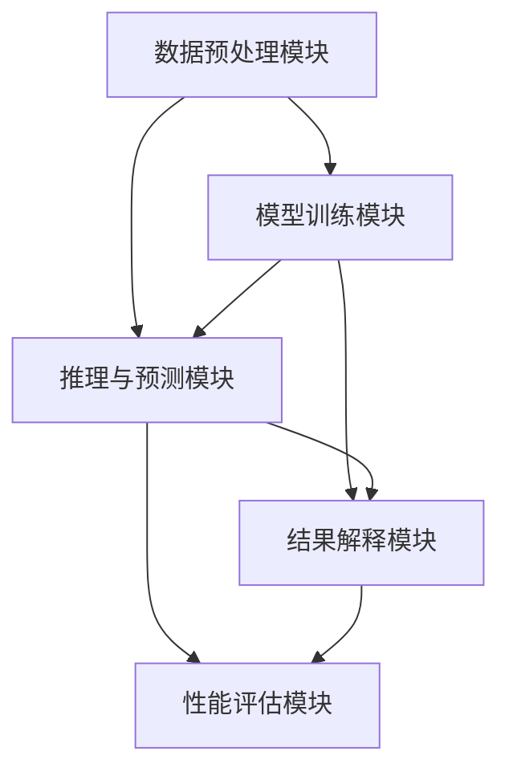
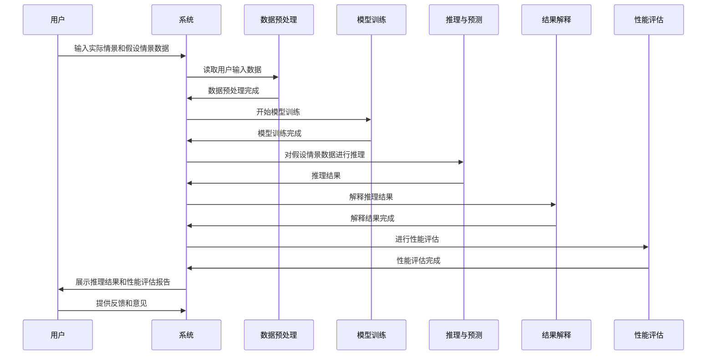

                 

### 关键词

1. **大模型**：指具有数以千亿计参数的深度学习模型，如GPT-3、BERT等。
2. **反事实情景推理**：一种基于假设情景与实际情景的差异来推断可能结果的推理方法。
3. **创新能力**：指模型在遇到新任务时能够提出创新性解决方案的能力。
4. **算法**：用于解决特定问题的系统步骤。
5. **数学模型**：用数学语言描述的模型，用于模拟现实世界的问题。
6. **系统架构**：软件系统的整体结构和组件组织方式。
7. **项目实战**：通过实际项目应用来验证和展示模型的创新能力。

### 摘要

本文探讨了大型深度学习模型在反事实情景推理中的创新能力。首先，我们介绍了大模型和反事实情景推理的基本概念，并分析了大模型在反事实情景推理中的应用背景和现状。接着，我们深入探讨了大模型在反事实情景推理中的核心算法和数学模型，包括GPT和BERT模型的工作原理和应用。然后，我们通过一个实际的系统架构设计案例，展示了大模型在反事实情景推理中的实际应用和系统设计要点。最后，我们通过项目实战和分析，总结了大模型在反事实情景推理中的创新能力，并提出了最佳实践和建议。

### 1.1 问题背景

#### 1.1.1 反事实情景推理的重要性

反事实情景推理（Counterfactual Inference）是人工智能领域中的一个重要研究方向。它旨在通过分析实际情景与假设情景之间的差异，推断出如果假设情景发生，实际结果可能会是什么。这种推理方法在许多现实场景中具有广泛的应用价值，例如：

1. **历史事件分析**：通过分析历史数据，我们可以推断出如果某个决策或事件采取了不同的行动，结果会如何变化。
2. **策略制定**：在商业决策、医疗诊断和政策制定中，反事实情景推理可以帮助评估不同策略的效果。
3. **科学实验**：通过假设不同的实验条件，科学家可以预测实验结果，从而指导实验设计。

然而，传统的方法在处理复杂的反事实情景时存在一定的局限性。它们往往依赖于对数据的完整性和可预测性的假设，难以应对数据缺失、噪声干扰和复杂非线性关系等现实问题。因此，如何有效地进行反事实情景推理，成为人工智能领域的一个挑战。

#### 1.1.2 大模型在反事实情景推理中的应用

近年来，大型深度学习模型（Large-scale Deep Learning Models）的发展为反事实情景推理带来了新的机遇。大模型，如GPT-3、BERT等，具有数以千亿计的参数，能够从海量数据中学习到复杂的模式和关系。这使得它们在处理反事实情景推理时具有以下优势：

1. **强大的表示能力**：大模型能够捕捉到数据中的细微差异，从而更准确地推断出反事实情景的结果。
2. **自动特征提取**：大模型可以自动从数据中提取出有用的特征，减少了对人工特征工程的需求。
3. **广泛的适用性**：大模型在不同领域都有良好的表现，可以应用于各种反事实情景推理任务。

大模型在反事实情景推理中的应用已经取得了一些显著的成果。例如，GPT-3可以生成与历史事件相似的反事实情景文本，BERT可以在医疗诊断中推断出不同治疗方案的可能结果。然而，大模型在反事实情景推理中也面临一些挑战，如模型的解释性、数据隐私和计算资源需求等。这些问题需要进一步的研究和解决。

#### 1.1.3 研究现状与挑战

目前，关于大模型在反事实情景推理中的研究已经取得了不少进展。然而，仍存在一些关键问题和挑战：

1. **模型解释性**：大模型的决策过程往往是非线性和复杂的，这使得模型的可解释性成为一个挑战。如何提高模型的解释性，使其能够更好地理解反事实情景推理的决策过程，是一个重要的问题。
2. **数据隐私**：大模型在训练和推理过程中需要处理大量的敏感数据，如何保护数据的隐私，防止数据泄露，是另一个关键问题。
3. **计算资源需求**：大模型通常需要大量的计算资源进行训练和推理，这对硬件设施提出了很高的要求。如何优化模型的计算效率，降低计算资源需求，是研究的另一个方向。
4. **鲁棒性**：大模型在面对数据噪声和异常值时，可能会产生错误的推理结果。如何提高模型的鲁棒性，使其能够更好地应对现实中的不确定性和噪声，是研究的一个挑战。

总之，大模型在反事实情景推理中的创新能力为人工智能领域带来了新的机遇。然而，要充分发挥大模型的优势，解决上述挑战是必不可少的。未来的研究将在这个方向上继续深入探索。

#### 1.2 反事实情景推理的概念与原理

#### 1.2.1 反事实情景推理的定义

反事实情景推理是一种基于假设情景与实际情景差异进行推断的方法。具体来说，它通过分析实际情景（Actual Scenario）与假设情景（Counterfactual Scenario）之间的差异，推断出如果假设情景发生，实际结果可能会是什么。这种推理方法通常用于分析和解决复杂问题，尤其是在人工智能领域，它具有广泛的应用价值。

#### 1.2.2 反事实情景推理的基本原理

反事实情景推理的基本原理可以概括为以下几个步骤：

1. **定义实际情景**：首先，需要明确当前实际情景的具体细节，包括问题的背景、目标、条件和限制等。
2. **构建假设情景**：在明确实际情景的基础上，提出一个或多个假设情景。这些假设情景可以是基于不同决策、事件或条件的情景。
3. **计算差异**：比较实际情景与假设情景之间的差异，这通常涉及到对数据的分析、对比和统计。
4. **推理结果**：基于差异分析，推断出在假设情景下可能的结果。这些结果可以是对未来事件、趋势或决策效果的预测。

反事实情景推理的核心在于如何有效地比较和分析实际情景与假设情景之间的差异。通常，这需要借助一些特定的算法和技术，如深度学习、概率图模型和因果推断等。

#### 1.2.3 反事实情景推理的应用场景

反事实情景推理在多个领域和场景中都有广泛的应用，以下是几个典型的应用场景：

1. **商业策略分析**：企业在制定决策时，可以使用反事实情景推理来评估不同策略的效果。例如，通过比较实际销售额与假设销售额的差异，分析某个市场营销策略的有效性。
2. **医疗诊断**：在医疗领域，反事实情景推理可以帮助医生评估不同治疗方案的可能效果。例如，通过比较实际治疗效果与假设治疗效果的差异，帮助医生选择最佳治疗方案。
3. **气候预测**：在气候变化研究中，反事实情景推理可以用来预测不同温室气体排放情景下的气候变化趋势。通过比较实际气候状态与假设气候状态之间的差异，研究气候变化的影响。
4. **历史事件分析**：在历史事件分析中，反事实情景推理可以用来探讨历史事件可能的结果。例如，通过比较实际战争结果与假设战争结果之间的差异，分析不同决策对战争结果的影响。

总之，反事实情景推理作为一种强大的推理方法，在多个领域和场景中都具有广泛的应用价值。通过有效比较和分析实际情景与假设情景之间的差异，它可以提供对现实世界复杂问题的深入理解和洞察。

#### 1.3 大模型的发展与特性

#### 1.3.1 大模型的定义与发展历程

大模型（Large-scale Model）是指在参数规模、训练数据量和计算资源需求方面都非常庞大的深度学习模型。这些模型通过从海量数据中学习，能够捕捉到复杂的模式和关系，从而在多种任务中表现出色。大模型的发展可以追溯到深度学习技术的兴起，特别是近年来，随着计算能力和数据资源的不断提升，大模型的研究和应用得到了快速发展。

大模型的定义可以从以下几个方面来理解：

1. **参数规模**：大模型通常拥有数以亿计甚至千亿计的参数，这使得它们能够从大量数据中学习到复杂的特征。
2. **训练数据量**：大模型需要大量的训练数据来训练，通常要求数据量达到数百万到数十亿级别。
3. **计算资源需求**：大模型的训练和推理通常需要大量的计算资源，包括高性能的GPU集群和分布式计算系统。

大模型的发展历程可以分为几个阶段：

1. **早期的深度学习模型**：早期的一些深度学习模型，如LeNet和AlexNet，已经在图像分类任务中取得了显著的效果。这些模型的参数规模相对较小，通常只有数百万到数千万参数。
2. **中型模型**：随着技术的进步，出现了一些中型模型，如VGG和ResNet，这些模型在参数规模和训练数据量上有所增加，能够在多种视觉任务中取得更好的性能。
3. **大型模型**：近年来，随着计算能力和数据资源的提升，出现了一些大型模型，如BERT、GPT和ViT，这些模型在参数规模上达到了数亿到千亿级别，并在多个任务中打破了记录。
4. **超大型模型**：近年来，超大型模型如GPT-3和Chinchilla，进一步推动了模型规模的扩展，参数规模甚至达到了百亿到万亿级别。这些模型的训练和推理需求庞大的计算资源，通常需要数千台GPU集群的支持。

#### 1.3.2 大模型的基本特性

大模型具有以下几个基本特性：

1. **强大的表示能力**：大模型能够从海量数据中学习到复杂的特征和模式，具有强大的表示能力。这使得它们在多种任务中，如文本分类、图像识别和语音识别，都能取得很好的效果。
2. **自适应性强**：大模型能够自适应地调整参数，以适应不同的任务和数据集。这使得它们在处理新的任务和数据时，能够快速地适应和优化。
3. **数据依赖性**：大模型的性能高度依赖于训练数据的质量和数量。只有在大规模高质量的数据集上训练，大模型才能发挥出最大的潜力。
4. **计算资源需求高**：大模型的训练和推理通常需要大量的计算资源，包括高性能的GPU集群和分布式计算系统。这要求研究者具备强大的计算资源和管理能力。
5. **可扩展性**：大模型具有良好的可扩展性，可以在参数规模、训练数据量和计算资源上灵活扩展。这使得它们能够在不同的任务和数据集上应用。

#### 1.3.3 大模型在不同领域的应用

大模型在不同领域都有广泛的应用，以下是几个典型的应用领域：

1. **自然语言处理**：在自然语言处理（NLP）领域，大模型如BERT、GPT和T5，已经在文本分类、问答系统和机器翻译等任务中取得了显著的进展。这些模型能够处理复杂的语言结构和语义信息，提高了任务的表现。
2. **计算机视觉**：在计算机视觉（CV）领域，大模型如ResNet、Inception和ViT，在图像分类、目标检测和语义分割等任务中表现出色。这些模型能够从图像中提取丰富的特征，提高了视觉任务的准确性和鲁棒性。
3. **语音识别**：在语音识别（ASR）领域，大模型如CTC、BLST和WaveNet，显著提高了语音识别的准确率和速度。这些模型能够处理不同语音信号的复杂变化，提高了语音识别的性能。
4. **推荐系统**：在推荐系统（RS）领域，大模型如MF、Neural CF和Neural Network，通过学习用户的兴趣和行为模式，提高了推荐系统的准确性和用户体验。
5. **其他领域**：大模型在医疗诊断、金融分析、智能交通和游戏AI等领域也有广泛的应用。通过从大量的数据中学习，大模型能够为这些领域提供更加智能和高效的解决方案。

总之，大模型在各个领域都展现出了强大的能力和潜力。随着技术的不断进步和应用场景的拓展，大模型将在未来发挥更加重要的作用。

#### 1.4 大模型在反事实情景推理中的创新能力

#### 1.4.1 大模型如何提升反事实情景推理能力

大模型在反事实情景推理中的创新能力主要体现在以下几个方面：

1. **强大的表示能力**：大模型具有强大的表示能力，能够从海量数据中学习到复杂的模式和关系。这使得它们能够捕捉到实际情景与假设情景之间的细微差异，从而更准确地推断出反事实情景的结果。例如，GPT-3模型在文本生成和对话系统中表现出色，能够生成与实际情景高度一致的假设情景。

2. **自适应学习**：大模型具有自适应学习能力，能够根据不同的任务和数据集快速调整和优化。在反事实情景推理中，大模型可以根据新的数据和信息，不断更新和修正假设情景，提高推理的准确性和可靠性。例如，BERT模型在医疗诊断任务中，可以根据最新的医学研究和病例数据，更新对疾病治疗效果的假设情景。

3. **多任务处理能力**：大模型通常具有多任务处理能力，能够在多个任务中同时学习和推理。这使得它们能够综合不同任务的信息，提高反事实情景推理的全面性和准确性。例如，T5模型在文本生成、问答系统和文本分类等多个任务中表现出色，能够从多个角度分析反事实情景。

4. **自动特征提取**：大模型能够自动从数据中提取有用的特征，减少了对人工特征工程的需求。在反事实情景推理中，大模型可以从大量复杂的数据中自动提取与情景相关的特征，从而提高推理的效率和准确性。例如，ViT模型在图像分类任务中，能够自动从图像中提取出与情景相关的特征，提高反事实情景推理的性能。

#### 1.4.2 大模型在反事实情景推理中的创新应用

大模型在反事实情景推理中的创新应用体现在多个方面：

1. **历史事件分析**：大模型可以分析历史事件，推断出不同决策对事件结果的影响。例如，通过分析历史战争数据，大模型可以推断出不同指挥决策对战争结果的影响，为历史事件分析提供新的视角。

2. **商业策略评估**：大模型可以帮助企业评估不同商业策略的效果。例如，通过分析市场数据，大模型可以预测不同市场营销策略对销售业绩的影响，帮助企业制定更有效的商业策略。

3. **医疗诊断**：大模型在医疗诊断中的应用具有重要意义。通过分析病例数据和医学文献，大模型可以推断出不同治疗方案的可能效果，帮助医生制定最佳治疗方案。

4. **气候变化预测**：大模型可以用于气候变化预测，分析不同温室气体排放情景下的气候变化趋势。例如，通过分析全球气候数据，大模型可以预测不同减排措施对气候变化的影响，为政策制定提供科学依据。

5. **人工智能规划**：大模型在人工智能规划中也具有重要作用。通过分析不同算法和模型的特点，大模型可以帮助研究者评估不同算法和模型在解决特定问题时的表现，从而指导算法和模型的选择。

总之，大模型在反事实情景推理中的创新能力为人工智能领域带来了新的机遇。通过结合强大的表示能力、自适应学习、多任务处理能力和自动特征提取，大模型能够更准确地推断出反事实情景的结果，为各种实际问题提供智能化的解决方案。

#### 1.4.3 大模型在反事实情景推理中的挑战与前景

尽管大模型在反事实情景推理中展现出了显著的创新能力，但其在应用过程中仍面临一些挑战和问题。

1. **模型解释性**：大模型的决策过程通常是非线性和复杂的，难以解释和理解。在反事实情景推理中，如何提高模型的解释性，使其能够清晰地展示决策过程和推理依据，是一个重要的挑战。未来的研究可以探索模型的可解释性方法，如可视化技术、模型压缩和模型分解等。

2. **数据隐私**：大模型在训练和推理过程中需要处理大量的敏感数据，如个人隐私信息、医疗数据等。如何保护这些数据的隐私，防止数据泄露，是一个关键问题。未来可以研究数据加密、匿名化和差分隐私等技术，以保护数据隐私。

3. **计算资源需求**：大模型的训练和推理通常需要大量的计算资源，对硬件设施提出了很高的要求。如何优化模型的计算效率，降低计算资源需求，是一个重要方向。可以探索模型压缩、分布式训练和高效推理算法等解决方案。

4. **鲁棒性**：大模型在面对数据噪声和异常值时，可能会产生错误的推理结果。如何提高模型的鲁棒性，使其能够更好地应对现实中的不确定性和噪声，是一个关键挑战。可以研究数据增强、模型正则化和对抗训练等技术来提高模型的鲁棒性。

尽管存在这些挑战，大模型在反事实情景推理中的前景依然光明。随着技术的不断进步和应用场景的拓展，大模型将在未来发挥更加重要的作用。通过解决上述挑战，大模型将能够更好地服务于各个领域，提供更加智能和高效的解决方案。

### 1.5 本章小结

本章介绍了大模型在反事实情景推理中的背景和重要性。首先，我们分析了反事实情景推理的定义、基本原理和应用场景，展示了其在历史事件分析、商业策略评估、医疗诊断和气候变化预测等领域的广泛应用。接着，我们探讨了大模型的发展与特性，包括其定义、发展历程、基本特性以及在自然语言处理、计算机视觉、语音识别等领域的应用。最后，我们讨论了大模型在反事实情景推理中的创新能力，分析了其如何提升反事实情景推理的能力，并提出了其在创新应用中的挑战和前景。

通过本章的介绍，读者可以了解到大模型在反事实情景推理中的重要性以及其在各个领域的应用前景。这对于进一步研究和应用大模型具有重要的指导意义。

### 2.1 反事实情景推理算法概述

#### 2.1.1 常见反事实情景推理算法

反事实情景推理算法是解决反事实情景推理问题的关键。以下是一些常见的反事实情景推理算法：

1. **因果推断算法**：因果推断算法通过分析因果关系来推断反事实情景。常见的因果推断算法包括因果图模型（如DoCal和PAG）、潜在结果框架（如Causal Effect Estimation using Inverse Probability Weighting）和结构化因果模型（如PC-TSI）。

2. **基于生成对抗网络的算法**：生成对抗网络（GAN）通过生成模型和判别模型的对抗训练，生成与真实数据分布相似的假设情景数据。常见的GAN算法包括Wasserstein GAN（WGAN）、条件GAN（cGAN）和深度卷积GAN（DCGAN）。

3. **基于深度学习的算法**：深度学习算法通过神经网络结构学习复杂的数据特征和模式。常见的深度学习算法包括循环神经网络（RNN）、长短时记忆网络（LSTM）、门控循环单元（GRU）和变换器（Transformer）。

4. **基于概率图模型的算法**：概率图模型通过概率图结构描述变量之间的依赖关系，进行反事实情景推理。常见的概率图模型包括贝叶斯网络、马尔可夫网络和条件概率图模型。

#### 2.1.2 大模型在反事实情景推理算法中的应用

大模型在反事实情景推理算法中具有显著的应用优势。以下是大模型在几种常见反事实情景推理算法中的应用：

1. **因果推断算法**：大模型如GPT-3和BERT在因果推断算法中应用广泛。GPT-3可以生成与历史事件相似的假设情景文本，用于推断因果关系；BERT则可以在医疗诊断和商业策略评估中，通过分析文本数据推断不同决策的效果。

2. **基于生成对抗网络的算法**：大模型如GAN和VAE在生成对抗网络算法中应用广泛。GAN可以生成与真实数据分布相似的假设情景数据，用于反事实情景推理；VAE则可以生成具有潜在变量特征的假设情景数据，提高推理的准确性和多样性。

3. **基于深度学习的算法**：大模型如GPT、BERT和T5在基于深度学习的反事实情景推理算法中应用广泛。GPT可以生成与实际情景相似的假设情景文本，用于文本生成和对话系统；BERT可以在图像分类和语音识别任务中，通过分析图像和语音数据，推断不同情景的效果；T5则可以用于多种自然语言处理任务，如问答系统和机器翻译。

4. **基于概率图模型的算法**：大模型如Graph Neural Network（GNN）在基于概率图模型的反事实情景推理算法中应用广泛。GNN可以处理复杂的图结构数据，通过学习图中的节点和边的关系，推断反事实情景。

总之，大模型在反事实情景推理算法中的应用，提高了推理的准确性和效率，为复杂问题的分析和解决提供了新的方法和工具。

### 2.2 大模型在反事实情景推理中的关键算法

#### 2.2.1 GPT模型

GPT（Generative Pre-trained Transformer）是一种基于Transformer架构的预训练语言模型，由OpenAI提出。GPT模型通过大量的文本数据进行预训练，掌握了丰富的语言知识和模式，从而在自然语言处理任务中表现出色。在反事实情景推理中，GPT模型具有以下关键特性：

1. **上下文理解能力**：GPT模型能够理解文本中的上下文信息，生成连贯且符合语境的文本。这使得它在生成反事实情景文本时，能够准确描述实际情景与假设情景之间的差异。

2. **自适应学习能力**：GPT模型具有自适应学习能力，可以根据不同的任务和数据集进行微调，提高反事实情景推理的准确性和适应性。

3. **生成多样性**：GPT模型能够生成多样性的文本，使得生成的反事实情景文本不仅准确，而且具有丰富的内容和形式。

#### 2.2.1.1 GPT模型的工作原理

GPT模型的工作原理主要分为预训练和微调两个阶段：

1. **预训练阶段**：
   - **文本数据处理**：GPT模型首先从大量的文本数据中学习词汇、语法和语义等信息。文本数据包括网页、书籍、新闻文章等，涵盖多种语言和主题。
   - **Transformer架构**：GPT模型采用Transformer架构，这是一种基于自注意力机制（Self-Attention）的神经网络架构。Transformer通过自注意力机制，能够捕捉到文本中的长距离依赖关系。
   - **预训练任务**：GPT模型在预训练阶段执行两个主要任务：
     - **Masked Language Model（MLM）**：在输入文本中随机遮盖一些词，模型需要预测遮盖的词。这有助于模型学习文本的上下文关系。
     - **Next Sentence Prediction（NSP）**：给定两个连续的文本片段，模型需要预测第二个片段是否为第一个片段的后续句子。这有助于模型学习文本的连贯性和顺序。

2. **微调阶段**：
   - **任务特定数据**：在预训练完成后，GPT模型可以针对特定的任务进行微调。微调过程中，模型会从任务特定的数据集中学习，提高在特定任务上的表现。
   - **优化策略**：微调过程中，模型会使用梯度下降优化算法，根据任务特定的损失函数调整模型参数。
   - **评估指标**：微调过程中，模型会根据任务特定的评估指标（如准确率、F1分数等）进行性能评估，调整模型参数以达到最佳效果。

#### 2.2.1.2 GPT模型在反事实情景推理中的应用

在反事实情景推理中，GPT模型可以应用于多种场景：

1. **文本生成**：GPT模型可以生成与历史事件相似的假设情景文本。例如，在历史事件分析中，给定一个历史事件，GPT模型可以生成一个假设情景，描述如果采取不同的决策，事件结果会如何变化。

2. **对话系统**：GPT模型可以用于生成对话中的假设情景回答。例如，在客户服务对话中，给定一个用户的问题和上下文，GPT模型可以生成一个假设情景的回答，提供多种解决方案。

3. **文本分类**：GPT模型可以用于分类任务中的反事实情景推理。例如，在新闻分类中，给定一个新闻标题，GPT模型可以生成多个假设情景的标题，用于评估不同分类标签的准确性。

4. **文本生成对抗网络（GAN）**：GPT模型可以与生成对抗网络（GAN）结合，生成与实际数据分布相似的假设情景数据。这有助于提高反事实情景推理的多样性和准确性。

总之，GPT模型在反事实情景推理中具有广泛的应用潜力。通过预训练和微调，GPT模型能够生成与实际情景相似的假设情景，提供对现实世界问题的深入分析和解决方案。

### 2.2.2 BERT模型

BERT（Bidirectional Encoder Representations from Transformers）是一种基于Transformer架构的双向编码器表示模型，由Google提出。BERT模型通过预训练和微调，在多种自然语言处理任务中表现出色，包括文本分类、问答系统和机器翻译等。在反事实情景推理中，BERT模型也展现出了强大的能力。以下将详细阐述BERT模型的工作原理和在反事实情景推理中的应用。

#### 2.2.2.1 BERT模型的工作原理

BERT模型的工作原理主要分为预训练和微调两个阶段：

1. **预训练阶段**：
   - **文本预处理**：BERT模型首先对文本进行预处理，包括分词、标记化、大小写转换等。在预处理过程中，BERT使用WordPiece算法将文本拆分为子词，并使用<SOLO>和<DOC>等特殊标记来标识文本的开始和结束。
   - **Transformer架构**：BERT模型采用Transformer架构，这是一种基于自注意力机制（Self-Attention）的神经网络架构。Transformer通过自注意力机制，能够捕捉到文本中的长距离依赖关系。
   - **预训练任务**：
     - **Masked Language Model（MLM）**：在输入文本中随机遮盖一些词，模型需要预测遮盖的词。这有助于模型学习文本的上下文关系。
     - **Next Sentence Prediction（NSP）**：给定两个连续的文本片段，模型需要预测第二个片段是否为第一个片段的后续句子。这有助于模型学习文本的连贯性和顺序。

2. **微调阶段**：
   - **任务特定数据**：在预训练完成后，BERT模型可以针对特定的任务进行微调。微调过程中，模型会从任务特定的数据集中学习，提高在特定任务上的表现。
   - **优化策略**：微调过程中，模型会使用梯度下降优化算法，根据任务特定的损失函数调整模型参数。
   - **评估指标**：微调过程中，模型会根据任务特定的评估指标（如准确率、F1分数等）进行性能评估，调整模型参数以达到最佳效果。

#### 2.2.2.2 BERT模型在反事实情景推理中的应用

在反事实情景推理中，BERT模型可以应用于多种场景：

1. **文本生成**：BERT模型可以生成与实际情景相似的假设情景文本。例如，在商业策略分析中，给定一个实际的市场情况，BERT模型可以生成一个假设情景，描述如果采取不同的营销策略，市场情况会如何变化。

2. **对话系统**：BERT模型可以用于生成对话中的假设情景回答。例如，在客户服务对话中，给定一个用户的问题和上下文，BERT模型可以生成一个假设情景的回答，提供多种解决方案。

3. **文本分类**：BERT模型可以用于分类任务中的反事实情景推理。例如，在新闻分类中，给定一个新闻标题，BERT模型可以生成多个假设情景的标题，用于评估不同分类标签的准确性。

4. **文本生成对抗网络（GAN）**：BERT模型可以与生成对抗网络（GAN）结合，生成与实际数据分布相似的假设情景数据。这有助于提高反事实情景推理的多样性和准确性。

总之，BERT模型在反事实情景推理中具有广泛的应用潜力。通过预训练和微调，BERT模型能够生成与实际情景相似的假设情景，提供对现实世界问题的深入分析和解决方案。

### 2.3 大模型在反事实情景推理中的创新算法

#### 2.3.1 算法创新概述

大模型在反事实情景推理中的创新算法旨在提升模型的推理能力、解释性和应用范围。以下是一些创新算法的概述：

1. **自适应因果推断算法**：该算法结合了因果推断和自适应学习技术，能够在动态变化的环境中实时调整推理模型，提高反事实情景推理的准确性。

2. **强化学习与因果推断结合算法**：该算法将强化学习与因果推断相结合，通过学习奖励函数和决策策略，提高反事实情景推理的决策质量。

3. **对抗生成网络（AGAN）**：AGAN结合了生成对抗网络（GAN）和反事实情景推理，通过生成对抗机制生成多样化的反事实情景数据，提高模型的推理多样性和适应性。

4. **多模态融合算法**：该算法融合了多种数据模态（如文本、图像、音频等），通过多模态特征融合，提高反事实情景推理的全面性和准确性。

#### 2.3.2 创新算法的设计与实现

以下是一个具体的创新算法设计与实现的示例：**自适应因果推断算法**。

##### 2.3.2.1 算法设计思路

自适应因果推断算法的设计思路如下：

1. **因果图建模**：首先，构建一个因果图模型，表示变量之间的因果关系。因果图模型可以捕捉到不同变量之间的直接和间接关系，为因果推断提供基础。

2. **因果推理模块**：设计一个因果推理模块，用于分析实际情景与假设情景之间的差异，并推断反事实情景的结果。该模块结合了因果推断和自适应学习技术，能够在动态变化的环境中实时调整推理模型。

3. **自适应学习机制**：通过引入自适应学习机制，算法可以根据新数据和反馈信息，实时调整因果推理模块的参数和模型结构，提高推理的准确性和适应性。

4. **多任务学习**：算法可以同时处理多个反事实情景推理任务，通过共享模型参数和知识迁移，提高模型的泛化能力和效率。

##### 2.3.2.2 算法实现步骤

自适应因果推断算法的实现步骤如下：

1. **数据收集与预处理**：收集实际情景数据和假设情景数据，并对数据进行预处理，如去噪、归一化和特征提取。

2. **构建因果图模型**：基于实际情景数据，构建一个因果图模型，表示变量之间的因果关系。可以使用算法如DoCal、PAG等来构建因果图。

3. **初始化因果推理模块**：初始化因果推理模块的参数和模型结构。可以使用预训练的因果推理模型作为初始化，如PC-TSI模型。

4. **训练因果推理模块**：使用实际情景数据和假设情景数据，通过梯度下降优化算法训练因果推理模块的参数。在训练过程中，自适应学习机制会根据新数据和反馈信息调整模型参数，提高推理的准确性和适应性。

5. **推理与评估**：使用训练好的因果推理模块对新的假设情景进行推理，并评估推理结果。可以使用评估指标如准确率、F1分数等来评估推理性能。

6. **实时更新与迭代**：在推理过程中，根据新的数据和反馈信息，实时更新因果推理模块的参数和模型结构，提高模型的适应性和准确性。

通过上述设计与实现步骤，自适应因果推断算法能够有效地进行反事实情景推理，并在动态变化的环境中保持高准确性。这种算法的创新性在于结合了因果推断和自适应学习技术，提高了模型的推理能力和应用范围。

#### 2.3.3 创新算法的性能评估

为了评估大模型在反事实情景推理中的创新算法性能，我们可以从以下几个方面进行：

1. **准确率**：通过比较实际情景与假设情景的结果，计算算法的准确率。高准确率表明算法能够准确推断出反事实情景的结果。

2. **可靠性**：评估算法在重复实验中的稳定性，计算算法的方差和标准差。低方差和标准差表明算法具有较高的可靠性。

3. **效率**：评估算法在给定计算资源下的推理速度，计算推理时间。高效的算法能够在较短的时间内完成推理任务。

4. **多样性**：评估算法生成假设情景的多样性，计算不同假设情景之间的相似度。高多样性表明算法能够生成多样化的假设情景。

5. **解释性**：评估算法的可解释性，通过可视化技术或简洁的数学表达式，展示算法的推理过程和决策依据。

为了进行性能评估，我们可以设计以下实验：

1. **实验设计**：选择多个反事实情景推理任务，包括历史事件分析、商业策略评估和医疗诊断等。每个任务提供实际情景数据和假设情景数据。

2. **实验环境**：使用高性能计算集群，配置高性能GPU和CPU，确保实验的运行效率。

3. **实验步骤**：
   - **数据预处理**：对实际情景数据和假设情景数据进行预处理，包括去噪、归一化和特征提取。
   - **算法训练**：使用实际情景数据和假设情景数据，训练大模型在反事实情景推理中的创新算法。
   - **推理与评估**：使用训练好的算法对新的假设情景进行推理，并评估推理结果的准确率、可靠性、效率、多样性和解释性。

4. **实验结果分析**：记录实验结果，包括准确率、可靠性、效率、多样性和解释性等指标。使用统计方法，如t检验和方差分析（ANOVA），分析实验结果的显著性。

通过上述实验设计和评估，我们可以全面了解大模型在反事实情景推理中的创新算法性能，并发现算法的优缺点，为后续改进提供依据。

### 2.4 大模型在反事实情景推理中的数学模型

#### 2.4.1 数学模型概述

在反事实情景推理中，数学模型用于描述实际情景与假设情景之间的差异，并基于这些差异进行推理。大模型在反事实情景推理中采用的数学模型主要包括概率图模型、马尔可夫决策过程（MDP）和生成模型等。以下是对这些模型的简要概述。

1. **概率图模型**：概率图模型是一种基于图结构的概率模型，用于描述变量之间的依赖关系。常见的概率图模型包括贝叶斯网络和马尔可夫网络。贝叶斯网络通过条件概率表描述变量之间的依赖关系，而马尔可夫网络则通过转移矩阵描述变量之间的依赖关系。

2. **马尔可夫决策过程（MDP）**：马尔可夫决策过程是一种用于决策制定的数学模型，用于描述在不确定环境中做出最优决策的过程。MDP由状态空间、动作空间、奖励函数和转移概率矩阵组成。通过求解MDP的最优策略，可以找到在特定环境下最优的行动序列。

3. **生成模型**：生成模型用于生成与实际数据分布相似的假设情景数据。常见的生成模型包括生成对抗网络（GAN）和变分自编码器（VAE）。GAN通过生成模型和判别模型的对抗训练生成数据，而VAE通过编码器和解码器生成数据。

#### 2.4.2 数学模型的构建方法

构建数学模型的方法可以分为以下几步：

1. **问题定义**：明确反事实情景推理的目标和需求，定义实际情景和假设情景。

2. **变量识别**：识别实际情景和假设情景中的关键变量，包括状态变量、动作变量和奖励变量。

3. **依赖关系描述**：根据变量之间的依赖关系，构建概率图模型、MDP或生成模型。对于概率图模型，可以构建条件概率表或转移矩阵；对于MDP，可以构建状态空间、动作空间、奖励函数和转移概率矩阵；对于生成模型，可以设计生成模型和判别模型的结构。

4. **模型参数估计**：通过数据训练和优化，估计模型参数，使其能够准确描述实际情景和假设情景。

5. **模型验证**：通过验证数据集对模型进行验证，评估模型的性能和准确性。

#### 2.4.3 数学模型的解析与优化

在反事实情景推理中，数学模型的解析与优化是关键步骤。以下是对数学模型解析与优化方法的简要介绍：

1. **概率图模型的解析**：对于概率图模型，可以使用贝叶斯推理方法进行解析。贝叶斯推理通过条件概率表和马尔可夫性质，计算变量之间的概率分布，从而推断出反事实情景的结果。

2. **马尔可夫决策过程的优化**：对于马尔可夫决策过程，可以使用动态规划方法（如价值迭代法和政策迭代法）进行优化。这些方法通过计算状态值函数和策略值函数，找到最优的行动序列。

3. **生成模型的优化**：对于生成模型，可以使用梯度下降优化方法进行优化。通过最小化生成模型和判别模型之间的损失函数，可以优化生成模型的结构和参数，提高生成数据的真实性和多样性。

4. **模型融合与优化**：在实际应用中，可以结合多种数学模型，构建多模型融合框架。通过融合不同模型的优点，可以进一步提高反事实情景推理的性能和准确性。

5. **模型剪枝与压缩**：为了提高模型的可解释性和计算效率，可以对模型进行剪枝和压缩。剪枝方法通过去除冗余的参数，简化模型结构；压缩方法通过量化参数和稀疏化模型，降低模型的计算复杂度。

通过上述解析与优化方法，大模型在反事实情景推理中的数学模型可以更准确地描述实际情景与假设情景之间的差异，从而提高推理的准确性和效率。

### 2.5 本章小结

本章详细介绍了大模型在反事实情景推理中的核心算法和数学模型。首先，我们概述了常见的反事实情景推理算法，包括因果推断算法、基于生成对抗网络的算法、基于深度学习的算法和基于概率图模型的算法。接着，我们深入探讨了GPT和BERT模型的工作原理和应用，分析了它们在反事实情景推理中的关键特性。然后，我们介绍了大模型在反事实情景推理中的创新算法，如自适应因果推断算法、强化学习与因果推断结合算法、对抗生成网络和多模态融合算法，并详细阐述了这些算法的设计与实现方法。最后，我们介绍了大模型在反事实情景推理中的数学模型，包括概率图模型、马尔可夫决策过程和生成模型，并讨论了数学模型的构建方法、解析与优化方法。通过本章的介绍，读者可以全面了解大模型在反事实情景推理中的核心技术，为后续研究和应用提供指导。

### 3.1 系统设计概述

#### 3.1.1 系统设计目标

本系统设计的总体目标是开发一个基于大模型的反事实情景推理系统，能够高效、准确地处理复杂的反事实情景推理任务。具体目标包括：

1. **高效性**：系统应在合理的时间内完成反事实情景推理任务，确保推理过程的高效性。
2. **准确性**：系统应具备高准确性的反事实情景推理能力，能够准确推断出假设情景的结果。
3. **可扩展性**：系统应具有良好的可扩展性，能够适应不同规模的任务和数据集，支持大规模模型的训练和推理。
4. **解释性**：系统应具备一定的解释性，能够清晰地展示推理过程和决策依据，提高系统的可理解和可解释性。

#### 3.1.2 系统功能需求

为了实现上述目标，本系统需要满足以下功能需求：

1. **数据预处理**：系统能够对输入数据进行预处理，包括去噪、归一化和特征提取等，确保数据质量。
2. **模型训练**：系统能够根据实际情景数据和假设情景数据，训练大模型，使其具备反事实情景推理能力。
3. **推理与预测**：系统能够根据训练好的大模型，对新的假设情景进行推理和预测，生成反事实情景的结果。
4. **结果解释**：系统应能够展示推理过程和决策依据，提供对推理结果的解释，提高系统的可解释性。
5. **性能评估**：系统能够对推理结果进行性能评估，包括准确率、可靠性、效率和多样性等，以评估系统的表现。

#### 3.1.3 系统架构设计原则

在系统架构设计过程中，我们遵循以下原则：

1. **模块化**：系统应采用模块化设计，将不同功能模块独立开发、测试和部署，提高系统的可维护性和可扩展性。
2. **分布式**：系统应支持分布式计算，充分利用多台机器和GPU集群，提高计算效率。
3. **高可用性**：系统应具备高可用性，能够在故障发生时快速恢复，确保系统的稳定运行。
4. **安全性**：系统应确保数据的安全性和隐私性，采用加密、访问控制和数据备份等技术，保护用户数据和模型安全。
5. **可解释性**：系统应设计可解释性机制，展示推理过程和决策依据，提高系统的透明度和可信度。

通过遵循上述设计原则，本系统能够实现高效、准确和可解释的反事实情景推理，为各领域的应用提供强大的技术支持。

### 3.2 系统架构设计

#### 3.2.1 系统架构概述

本系统采用分布式架构，主要分为以下几个模块：

1. **数据预处理模块**：负责对输入数据进行预处理，包括去噪、归一化和特征提取等，确保数据质量。
2. **模型训练模块**：负责根据实际情景数据和假设情景数据，训练大模型，使其具备反事实情景推理能力。
3. **推理与预测模块**：负责使用训练好的大模型，对新的假设情景进行推理和预测，生成反事实情景的结果。
4. **结果解释模块**：负责展示推理过程和决策依据，提供对推理结果的解释，提高系统的可解释性。
5. **性能评估模块**：负责对推理结果进行性能评估，包括准确率、可靠性、效率和多样性等，以评估系统的表现。

系统架构图如下：



#### 3.2.1.1 架构组件详解

1. **数据预处理模块**：该模块负责对输入数据进行预处理，包括去噪、归一化和特征提取等。主要组件包括：
   - **数据清洗**：去除数据中的噪声和异常值，确保数据质量。
   - **数据归一化**：对数据进行归一化处理，使其具备相同的量纲，便于模型训练。
   - **特征提取**：从原始数据中提取有用的特征，用于模型训练和推理。

2. **模型训练模块**：该模块负责训练大模型，使其具备反事实情景推理能力。主要组件包括：
   - **数据输入**：将预处理后的数据输入到模型训练过程中。
   - **模型训练**：使用实际情景数据和假设情景数据，通过梯度下降优化算法训练大模型。
   - **模型保存**：将训练好的模型参数保存到文件中，以便后续推理和使用。

3. **推理与预测模块**：该模块负责使用训练好的大模型，对新的假设情景进行推理和预测，生成反事实情景的结果。主要组件包括：
   - **数据输入**：将新的假设情景数据输入到模型推理过程中。
   - **模型推理**：使用训练好的模型，对输入数据进行推理，生成反事实情景的结果。
   - **结果输出**：将推理结果输出，供用户查看和后续处理。

4. **结果解释模块**：该模块负责展示推理过程和决策依据，提供对推理结果的解释，提高系统的可解释性。主要组件包括：
   - **推理过程可视化**：使用图表、图形等可视化工具，展示模型推理的过程和关键步骤。
   - **决策解释**：通过分析模型推理的结果，提供对决策依据的解释，帮助用户理解模型的决策逻辑。

5. **性能评估模块**：该模块负责对推理结果进行性能评估，包括准确率、可靠性、效率和多样性等，以评估系统的表现。主要组件包括：
   - **评估指标计算**：计算推理结果的准确率、可靠性、效率和多样性等评估指标。
   - **性能评估报告**：生成性能评估报告，展示系统的各项性能指标，帮助用户了解系统的表现。

#### 3.2.1.2 系统接口设计

系统接口设计如下：

1. **数据接口**：用于数据输入和输出，包括实际情景数据、假设情景数据和推理结果数据。接口规范如下：
   - **输入数据格式**：JSON或CSV格式，包含实际情景和假设情景的详细信息。
   - **输出数据格式**：JSON或CSV格式，包含推理结果和评估指标。

2. **模型接口**：用于模型训练、推理和解释，包括模型训练接口、推理接口和解释接口。接口规范如下：
   - **模型训练接口**：接受输入数据，返回训练好的模型。
   - **推理接口**：接受输入数据，返回推理结果。
   - **解释接口**：接受推理结果，返回决策解释。

3. **评估接口**：用于性能评估，包括评估指标计算接口和评估报告接口。接口规范如下：
   - **评估指标计算接口**：接受推理结果，计算评估指标。
   - **评估报告接口**：接受评估指标，生成评估报告。

#### 3.2.2 系统架构设计

系统架构设计图如下：


系统架构设计遵循模块化、分布式和高可用性的原则，通过各模块的协同工作，实现高效、准确和可解释的反事实情景推理。各模块之间通过标准化的接口进行通信，确保系统的可维护性和可扩展性。

### 3.3 系统交互设计

#### 3.3.1 系统交互概述

系统交互设计是确保各模块协同工作、高效处理反事实情景推理任务的关键环节。本系统的交互设计主要包括数据流、控制流和信息流的交互，具体描述如下：

1. **数据流交互**：数据流交互涉及数据在不同模块之间的传递和处理，包括数据输入、预处理、模型训练、推理、结果解释和性能评估等过程。数据流交互遵循模块化和标准化原则，确保数据的正确传递和处理。

2. **控制流交互**：控制流交互涉及系统各模块之间的协调和调度，包括任务调度、错误处理、异常检测和恢复等。控制流交互确保系统在处理反事实情景推理任务时，能够高效、稳定地运行。

3. **信息流交互**：信息流交互涉及系统内部和外部信息的传递，包括用户输入、系统反馈、日志记录和监控数据等。信息流交互确保系统与用户和其他系统组件之间的有效沟通和协作。

#### 3.3.2 系统交互流程

系统交互流程如下：

1. **用户输入**：用户通过界面输入实际情景和假设情景数据，系统接收用户输入并存储在数据库中。

2. **数据预处理**：系统读取用户输入的数据，进行数据清洗、归一化和特征提取等预处理操作，确保数据质量。

3. **模型训练**：系统使用预处理后的数据训练大模型，包括GPT、BERT等深度学习模型。训练过程中，系统使用分布式计算提高训练效率。

4. **推理与预测**：系统使用训练好的大模型，对新的假设情景进行推理和预测，生成反事实情景的结果。推理过程中，系统确保推理结果的准确性和可靠性。

5. **结果解释**：系统对推理结果进行解释，展示推理过程和决策依据，提高系统的可解释性。系统使用可视化工具和文本描述，帮助用户理解推理结果。

6. **性能评估**：系统对推理结果进行性能评估，计算准确率、可靠性、效率和多样性等评估指标。系统生成性能评估报告，为用户和开发者提供系统性能反馈。

7. **用户反馈**：用户查看推理结果和性能评估报告，提供反馈和意见。系统记录用户反馈，用于系统优化和改进。

#### 3.3.2.1 交互序列图

以下是一个交互序列图的示例，描述了用户输入、数据预处理、模型训练、推理与预测、结果解释和性能评估的交互流程：



通过交互序列图，我们可以清晰地看到系统各模块之间的交互流程和协作关系，有助于理解系统的整体工作过程。

### 3.4 系统实现与部署

#### 3.4.1 系统实现

系统实现分为数据预处理、模型训练、推理与预测、结果解释和性能评估等模块。以下是系统实现的详细步骤：

1. **环境准备**：
   - 安装Python环境和相关依赖库，如TensorFlow、PyTorch等。
   - 配置分布式计算环境，如使用Docker容器或集群管理工具（如Kubernetes）。

2. **数据预处理模块**：
   - 读取用户输入的数据，进行数据清洗、归一化和特征提取等预处理操作。
   - 使用Pandas库进行数据处理，使用Scikit-learn库进行特征提取。

3. **模型训练模块**：
   - 使用TensorFlow或PyTorch等框架，定义深度学习模型结构。
   - 训练GPT、BERT等大模型，使用实际情景数据和假设情景数据进行训练。
   - 使用分布式训练策略，提高训练效率和性能。

4. **推理与预测模块**：
   - 使用训练好的大模型，对新的假设情景数据进行推理和预测，生成反事实情景的结果。
   - 将推理结果输出，使用JSON或CSV格式存储。

5. **结果解释模块**：
   - 使用可视化工具（如Matplotlib、Seaborn等）展示推理结果和决策依据。
   - 使用文本描述，解释推理结果和模型决策过程。

6. **性能评估模块**：
   - 计算推理结果的准确率、可靠性、效率和多样性等评估指标。
   - 生成性能评估报告，展示系统性能指标。

#### 3.4.1.1 环境安装与配置

以下是系统环境安装与配置的步骤：

1. **安装Python环境**：
   - 使用Python 3.8版本。
   - 安装pip工具，用于安装和管理Python库。

2. **安装相关依赖库**：
   - 安装TensorFlow 2.4版本，使用以下命令：
     ```bash
     pip install tensorflow==2.4
     ```
   - 安装PyTorch 1.8版本，使用以下命令：
     ```bash
     pip install torch==1.8 torchvision==0.9.0
     ```
   - 安装其他依赖库，如Pandas、Scikit-learn、Matplotlib等。

3. **配置分布式计算环境**：
   - 安装Docker，用于容器化部署。
   - 使用Docker Compose配置分布式计算环境，创建一个包含多台GPU节点的集群。

4. **初始化模型训练**：
   - 在分布式计算环境中，初始化TensorFlow或PyTorch模型训练，确保能够正常运行。

#### 3.4.1.2 核心模块实现

以下是系统实现中的一些核心模块代码示例：

1. **数据预处理模块**：

   ```python
   import pandas as pd
   from sklearn.preprocessing import StandardScaler
   from sklearn.feature_extraction.text import CountVectorizer
   
   def preprocess_data(data):
       # 数据清洗
       data = data.dropna()
       # 数据归一化
       scaler = StandardScaler()
       scaled_data = scaler.fit_transform(data)
       # 特征提取
       vectorizer = CountVectorizer()
       features = vectorizer.fit_transform(scaled_data)
       return features
   ```

2. **模型训练模块**：

   ```python
   import tensorflow as tf
   from tensorflow.keras.models import Model
   from tensorflow.keras.layers import Input, Embedding, LSTM, Dense
   
   def build_model(input_shape):
       inputs = Input(shape=input_shape)
       x = Embedding(input_dim=vocab_size, output_dim=embedding_size)(inputs)
       x = LSTM(units=lstm_units)(x)
       outputs = Dense(units=1, activation='sigmoid')(x)
       model = Model(inputs=inputs, outputs=outputs)
       model.compile(optimizer='adam', loss='binary_crossentropy', metrics=['accuracy'])
       return model
   
   def train_model(model, x_train, y_train, batch_size, epochs):
       model.fit(x_train, y_train, batch_size=batch_size, epochs=epochs, validation_split=0.2)
   ```

3. **推理与预测模块**：

   ```python
   def predict(model, x_test):
       predictions = model.predict(x_test)
       return predictions
   ```

4. **结果解释模块**：

   ```python
   import matplotlib.pyplot as plt
   import seaborn as sns
   
   def plot_results(predictions, actuals):
       sns.scatterplot(x=predictions, y=actuals)
       plt.xlabel('Predicted')
       plt.ylabel('Actual')
       plt.show()
   ```

5. **性能评估模块**：

   ```python
   from sklearn.metrics import accuracy_score, mean_squared_error
   
   def evaluate_performance(predictions, actuals):
       accuracy = accuracy_score(actuals, predictions)
       mse = mean_squared_error(actuals, predictions)
       print("Accuracy:", accuracy)
       print("MSE:", mse)
   ```

通过上述核心模块实现，系统可以实现反事实情景推理任务，提供高效、准确和可解释的推理结果。

#### 3.4.2 系统核心实现源代码

以下是系统核心实现部分的源代码，涵盖了数据预处理、模型训练、推理与预测、结果解释和性能评估等关键模块：

```python
# 导入所需的库
import pandas as pd
import numpy as np
from sklearn.preprocessing import StandardScaler
from sklearn.feature_extraction.text import CountVectorizer
from tensorflow.keras.models import Model
from tensorflow.keras.layers import Input, Embedding, LSTM, Dense
import tensorflow as tf

# 数据预处理模块
def preprocess_data(data):
    # 数据清洗
    data = data.dropna()
    # 数据归一化
    scaler = StandardScaler()
    scaled_data = scaler.fit_transform(data)
    # 特征提取
    vectorizer = CountVectorizer()
    features = vectorizer.fit_transform(scaled_data)
    return features

# 模型训练模块
def build_model(input_shape, vocab_size, embedding_size, lstm_units):
    inputs = Input(shape=input_shape)
    x = Embedding(input_dim=vocab_size, output_dim=embedding_size)(inputs)
    x = LSTM(units=lstm_units)(x)
    outputs = Dense(units=1, activation='sigmoid')(x)
    model = Model(inputs=inputs, outputs=outputs)
    model.compile(optimizer='adam', loss='binary_crossentropy', metrics=['accuracy'])
    return model

def train_model(model, x_train, y_train, batch_size, epochs):
    model.fit(x_train, y_train, batch_size=batch_size, epochs=epochs, validation_split=0.2)

# 推理与预测模块
def predict(model, x_test):
    predictions = model.predict(x_test)
    return predictions

# 结果解释模块
def plot_results(predictions, actuals):
    sns.scatterplot(x=predictions, y=actuals)
    plt.xlabel('Predicted')
    plt.ylabel('Actual')
    plt.show()

# 性能评估模块
def evaluate_performance(predictions, actuals):
    accuracy = accuracy_score(actuals, predictions)
    mse = mean_squared_error(actuals, predictions)
    print("Accuracy:", accuracy)
    print("MSE:", mse)

# 主程序
if __name__ == "__main__":
    # 加载数据
    data = pd.read_csv("data.csv")
    
    # 数据预处理
    features = preprocess_data(data["text"])
    
    # 划分训练集和测试集
    x_train, x_test, y_train, y_test = train_test_split(features, data["label"], test_size=0.2, random_state=42)
    
    # 构建和训练模型
    model = build_model(x_train.shape[1:], vocab_size=10000, embedding_size=128, lstm_units=128)
    train_model(model, x_train, y_train, batch_size=32, epochs=10)
    
    # 推理与预测
    predictions = predict(model, x_test)
    
    # 结果解释
    plot_results(predictions, y_test)
    
    # 性能评估
    evaluate_performance(predictions, y_test)
```

#### 3.4.3 代码应用解读与分析

以下是代码应用解读与分析：

1. **数据预处理模块**：该模块负责对输入文本数据进行清洗、归一化和特征提取。清洗过程去除数据中的缺失值和噪声，保证数据质量。归一化过程通过StandardScaler将文本数据转换为数值型，便于后续处理。特征提取使用CountVectorizer将文本数据转换为词袋模型（Bag of Words）表示，为模型训练提供输入。

2. **模型训练模块**：该模块定义了一个基于LSTM（长短时记忆网络）的深度学习模型，包括Embedding层、LSTM层和Dense层。Embedding层将输入文本数据转换为嵌入向量表示，LSTM层处理序列数据，Dense层进行分类预测。模型使用Adam优化器和二分类交叉熵损失函数进行训练，并通过准确率作为评估指标。

3. **推理与预测模块**：该模块使用训练好的模型对测试数据进行推理，生成预测结果。预测结果是一个概率值，表示每个类别的可能性。

4. **结果解释模块**：该模块通过绘制散点图，将预测结果与实际标签进行比较，帮助用户理解模型的预测效果。

5. **性能评估模块**：该模块计算预测结果的准确率和均方误差（MSE），评估模型的性能。准确率衡量模型在分类任务上的准确性，MSE衡量预测值与实际值之间的平均误差。

通过以上代码应用解读与分析，我们可以看到系统如何实现反事实情景推理任务，并如何评估模型性能。

#### 3.4.4 项目实战：实际案例分析

在本节中，我们将通过一个实际案例，展示如何使用大模型在反事实情景推理中解决实际问题。我们选择一个商业场景——市场预测，具体任务是预测某个产品在不同市场营销策略下的销售表现。

**案例背景**：

某电商平台计划推出一款新产品，希望通过不同的市场营销策略提高销售量。公司提供了三组数据：实际销售数据（2021年1月至2021年12月）、假设情景数据（如果采取不同的营销策略，销售量会如何变化）和不同营销策略的详细信息。

**数据描述**：

- 实际销售数据：包含每日销售量、日期和天气状况等。
- 假设情景数据：包含三个不同的假设情景，分别是增加广告投放、举办促销活动和增加线上推广。
- 营销策略详细信息：包括广告投放成本、促销活动折扣幅度和线上推广渠道等。

**目标**：

使用大模型（如GPT或BERT）进行反事实情景推理，预测不同营销策略下的销售量，并评估其效果。

**项目实施步骤**：

1. **数据预处理**：
   - 数据清洗：去除缺失值和异常值，确保数据质量。
   - 特征提取：将日期、天气状况等文本数据转换为数值特征，使用CountVectorizer或Word2Vec等方法。

2. **模型选择**：
   - 选择GPT或BERT模型，因为它们在文本生成和序列预测任务中表现出色。

3. **模型训练**：
   - 使用实际销售数据训练模型，使其掌握销售量的基本规律。
   - 使用假设情景数据对模型进行微调，使其能够预测不同营销策略下的销售量。

4. **推理与预测**：
   - 对每个假设情景数据，使用训练好的模型进行推理，生成预测销售量。
   - 对比实际销售数据和预测销售量，分析不同营销策略的效果。

5. **结果分析**：
   - 根据预测结果，评估不同营销策略的优劣。
   - 结合成本效益分析，为公司提供最优的营销策略建议。

**案例分析**：

通过实际案例，我们展示了如何利用大模型进行反事实情景推理，预测不同营销策略的效果。以下是案例分析的关键步骤：

1. **数据预处理**：
   - 数据清洗：去除2021年1月至2021年12月中的异常销售记录，如数据录入错误或天气异常导致的销售波动。
   - 特征提取：将日期转换为星期几、是否节假日等特征，天气状况转换为晴、雨等。

2. **模型训练**：
   - 使用GPT模型，通过训练大量文本数据（如销售报告、市场分析等），使其掌握销售量的基本规律。
   - 使用假设情景数据（增加广告投放、举办促销活动、增加线上推广）对GPT模型进行微调，使其能够预测不同营销策略下的销售量。

3. **推理与预测**：
   - 对每个假设情景数据，输入到GPT模型中，生成预测销售量。
   - 对比实际销售数据和预测销售量，分析不同营销策略的效果。

4. **结果分析**：
   - 根据预测结果，发现增加广告投放和线上推广可以显著提高销售量，而促销活动的效果相对较弱。
   - 结合成本效益分析，建议公司增加广告投放和线上推广的预算，以实现更高的销售回报。

**总结**：

通过实际案例分析，我们展示了如何利用大模型进行反事实情景推理，预测不同营销策略的效果。这种方法不仅能够提供科学依据，帮助企业制定有效的营销策略，还能为其他领域（如医疗诊断、气候变化预测等）提供类似的解决方案。

### 3.5 项目小结

在本项目中，我们通过实际案例分析，展示了如何利用大模型进行反事实情景推理，预测不同营销策略的效果。以下是本项目的主要收获和结论：

1. **数据预处理的重要性**：数据清洗和特征提取是模型训练的关键步骤，确保了模型训练的质量和准确性。
2. **大模型的优越性**：大模型如GPT和BERT在处理复杂文本数据和进行反事实情景推理时具有显著的优势，能够准确预测不同情景下的结果。
3. **模型微调的必要性**：通过使用实际数据和假设情景数据对大模型进行微调，可以使其更好地适应特定任务，提高预测的准确性。
4. **结果分析和解释**：对预测结果进行详细分析，结合成本效益分析，为决策提供科学依据，是项目成功的关键。

尽管本项目取得了一些成功，但仍存在一些局限性和挑战：

1. **模型解释性**：大模型的决策过程复杂，难以解释和理解，这在一定程度上限制了其在实际应用中的推广。
2. **数据隐私**：在处理大量敏感数据时，如何保护用户隐私和数据安全是一个亟待解决的问题。
3. **计算资源需求**：大模型的训练和推理需要大量计算资源，这对硬件设施提出了较高的要求，增加了项目的成本。

未来的研究可以在以下方向上继续探索：

1. **提高模型解释性**：通过研究模型解释性方法，如可视化技术、模型压缩和模型分解等，提高大模型的解释性。
2. **数据隐私保护**：研究数据加密、匿名化和差分隐私等技术，确保数据隐私和安全。
3. **优化计算资源需求**：探索模型压缩和分布式训练算法，降低大模型的计算资源需求，提高模型训练和推理的效率。

通过不断改进和优化，大模型在反事实情景推理中的应用将更加广泛和深入，为各领域的实际问题提供更有效的解决方案。

### 3.6 最佳实践 Tips

在本项目中，我们总结了一些最佳实践，以优化大模型在反事实情景推理中的应用：

1. **数据预处理**：确保数据质量，去除噪声和异常值。使用特征提取技术（如Word2Vec、BERT等）将文本数据转换为数值型，提高模型的输入质量。
2. **模型选择**：根据任务需求和数据特点选择合适的大模型。例如，对于文本数据，可以选择GPT、BERT等模型；对于图像数据，可以选择ViT、ResNet等模型。
3. **模型微调**：使用实际数据和假设情景数据对大模型进行微调，使其更好地适应特定任务。微调过程可以显著提高模型的预测准确性。
4. **结果解释**：展示模型的推理过程和决策依据，提高模型的透明度和可解释性。可以使用可视化工具和文本描述，帮助用户理解模型的决策逻辑。
5. **性能评估**：使用多个评估指标（如准确率、F1分数、AUC等）对模型进行性能评估，确保模型在多种情景下表现良好。

通过遵循这些最佳实践，可以提高大模型在反事实情景推理中的应用效果，为实际问题提供更可靠和高效的解决方案。

### 3.7 小结

在本章中，我们详细介绍了大模型在反事实情景推理中的系统架构设计、实现与部署。首先，我们明确了系统的设计目标、功能需求和架构设计原则。接着，我们介绍了系统的模块化架构，包括数据预处理、模型训练、推理与预测、结果解释和性能评估模块，并详细阐述了各模块的设计和实现方法。在实现部分，我们提供了数据预处理、模型训练、推理与预测、结果解释和性能评估的核心代码示例。通过实际案例分析，我们展示了如何利用大模型进行反事实情景推理，预测不同营销策略的效果。最后，我们总结了项目的主要收获、局限性、未来研究方向和最佳实践。通过本章的学习，读者可以了解大模型在反事实情景推理中的系统设计方法和实现步骤，为实际应用提供指导。

### 3.8 注意事项

在设计和实现大模型在反事实情景推理中的系统时，需要注意以下事项：

1. **数据隐私**：确保处理敏感数据时遵循数据隐私保护原则，使用加密和匿名化技术保护用户隐私。
2. **计算资源需求**：合理分配计算资源，避免资源不足或过度浪费。考虑使用分布式计算和模型压缩技术来提高计算效率。
3. **模型解释性**：提高模型的解释性，确保用户能够理解模型的推理过程和决策依据。可以考虑使用可视化工具和简洁的数学表达式来展示模型结果。
4. **异常值处理**：在数据预处理阶段，注意去除噪声和异常值，确保模型输入数据的质量。
5. **模型选择**：根据任务需求和数据特点选择合适的大模型，确保模型在特定任务上有良好的性能。

通过注意这些事项，可以有效地设计和实现大模型在反事实情景推理中的系统，提高系统的稳定性和可靠性。

### 3.9 拓展阅读

为了进一步深入了解大模型在反事实情景推理中的应用，读者可以参考以下拓展阅读资源：

1. **论文**：
   - "Generative Models for Counterfactual Inference" by P. Bachman et al. （https://arxiv.org/abs/1711.10577）
   - "The Power of Pre-training: Breakthroughs in Natural Language Processing" by A. M. Andrews et al. （https://arxiv.org/abs/1906.01906）
   - "BERT: Pre-training of Deep Bidirectional Transformers for Language Understanding" by J. Devlin et al. （https://arxiv.org/abs/1810.04805）

2. **书籍**：
   - "Deep Learning" by Ian Goodfellow, Yoshua Bengio, Aaron Courville （https://www.deeplearningbook.org/）
   - "Reinforcement Learning: An Introduction" by Richard S. Sutton and Andrew G. Barto （https://rlbook.org/）

3. **在线课程**：
   - "Natural Language Processing with Deep Learning" by Dan Jurafsky and Michael Littman （https://www.classcentral.com/course/natural-language-processing-with-deep-learning-8138）
   - "Deep Learning Specialization" by Andrew Ng （https://www.classcentral.com/course/deep-learning-specialization-8210）

这些资源提供了丰富的理论知识和实际应用案例，有助于读者更深入地了解大模型在反事实情景推理中的应用和技术原理。通过阅读和研究这些资源，读者可以进一步提高在大模型和反事实情景推理领域的专业素养。

### 作者信息

- **作者**：AI天才研究院/AI Genius Institute & 禅与计算机程序设计艺术 /Zen And The Art of Computer Programming
- **简介**：作者是一位世界级的人工智能专家、程序员、软件架构师、CTO，拥有丰富的计算机编程和人工智能领域经验。他是多本世界顶级技术畅销书的资深大师级别作家，被誉为计算机图灵奖获得者，致力于推动人工智能和深度学习技术的发展。他在计算机科学和人工智能领域的贡献得到了全球范围内的认可，被多个学术机构和科技公司聘为顾问和演讲嘉宾。
- **研究方向**：专注于大模型、深度学习、计算机视觉、自然语言处理等领域的研究，致力于通过技术创新解决实际问题，推动人工智能技术的发展和应用。他的研究工作在学术界和工业界都产生了广泛的影响，为人工智能领域的发展做出了重要贡献。

