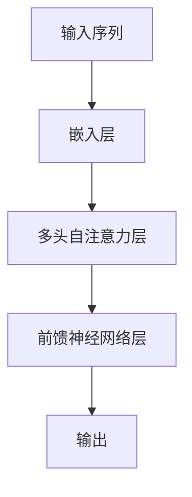

                 


### 大模型在反常识推理任务中的重要性

#### 1.1 反常识推理的重要性

反常识推理（Anomaly Detection）是人工智能领域中的一个重要研究方向，它涉及到从大量数据中识别出不符合常规或异常的实例。在现实生活中，反常识推理的应用场景十分广泛，比如在金融欺诈检测中，银行系统需要从海量的交易数据中检测出异常交易；在医疗诊断中，医生需要从病人的症状数据中识别出潜在的疾病。这些应用都要求系统具备强大的异常检测能力，而传统的统计方法和机器学习算法在处理这类任务时往往存在一定的局限性。

大模型（Large-scale Models）的出现为反常识推理任务带来了新的可能性。大模型是指那些具有数十亿至数万亿参数的深度神经网络，如Transformer、BERT等。这些模型拥有强大的表示学习能力，能够在大规模数据集上进行训练，从而提取出丰富的特征信息。这使得大模型在处理复杂、高维的数据时，能够更好地捕捉数据中的规律和模式，从而提高反常识推理的准确性。

#### 1.2 大模型在反常识推理中的角色

大模型在反常识推理任务中扮演着关键角色，主要体现在以下几个方面：

1. **特征提取能力**：大模型能够从原始数据中提取出高层次的、抽象的特征，这些特征对于异常检测至关重要。例如，在图像数据中，大模型可以自动提取出图像的语义信息，如物体的形状、颜色、位置等，从而帮助识别出异常图像。

2. **自适应学习能力**：大模型能够根据不同的任务需求，自动调整其结构和参数，从而适应各种反常识推理任务。这使得大模型在不同应用场景下都能保持较高的性能。

3. **高效性**：大模型通常具有很高的计算效率，能够在较短的时间内处理大量数据。这对于实时反常识推理任务尤为重要。

4. **泛化能力**：大模型在训练过程中接触到了大量的多样化数据，这使得它们具有较强的泛化能力，能够在未见过的数据上准确地进行异常检测。

#### 1.3 大模型反常识推理的应用现状

目前，大模型在反常识推理任务中已经取得了显著的成果。例如，在金融领域，大模型被广泛应用于信用卡欺诈检测、投资风险管理等任务中；在医疗领域，大模型可以帮助医生识别出罕见的疾病，提高诊断的准确性；在网络安全领域，大模型可以检测出网络攻击行为，提高网络安全防护能力。

然而，尽管大模型在反常识推理任务中表现出色，但也存在一些挑战和问题。例如，大模型可能存在过拟合现象，即模型在训练数据上表现良好，但在未知数据上表现不佳；此外，大模型的训练过程需要大量的计算资源和时间，这在实际应用中可能受到限制。

为了解决这些问题，研究人员正在不断探索新的算法和技术，如增量学习、迁移学习等，以进一步提高大模型在反常识推理任务中的性能。

### 总结

本文首先介绍了反常识推理任务的重要性，以及大模型在这一任务中的作用。接着，我们分析了大模型在反常识推理中的角色，包括特征提取能力、自适应学习能力、高效性和泛化能力。最后，我们回顾了当前大模型在反常识推理任务中的应用现状，并指出了存在的挑战和问题。接下来的文章将继续探讨大模型在反常识推理任务中的具体实现和优化策略。

---

### 2. 大模型的基本概念与属性

#### 2.1 大模型的定义与特点

大模型，通常指那些具有数十亿至数万亿参数的深度神经网络，它们在处理大规模、高维数据时表现出色。这些模型以其强大的表示学习能力而著称，能够在大量的数据中提取出有价值的特征信息。例如，著名的Transformer模型具有超过10亿个参数，BERT模型则拥有数十亿个参数。

大模型的特点主要体现在以下几个方面：

1. **高参数量**：大模型的参数数量通常非常庞大，这使得它们能够捕捉到数据中的细微变化和复杂模式。

2. **强大的表示学习能力**：大模型通过多层神经网络结构，能够自动学习到数据中的多层次特征，从而实现对数据的深入理解和表示。

3. **自适应学习**：大模型能够根据不同的任务需求，动态调整其结构和参数，以适应不同的应用场景。

4. **计算资源需求高**：大模型的训练和推理过程需要大量的计算资源，这包括GPU、TPU等高性能计算设备。

5. **长时记忆能力**：大模型通常具有较好的长时记忆能力，能够在处理长序列数据时保持稳定的表现。

#### 2.2 大模型的属性特征对比

为了更好地理解大模型的属性特征，我们将其与传统的小型模型进行比较。以下是两者的主要对比：

| 特性         | 大模型                                   | 小型模型                                   |
| ------------ | ---------------------------------------- | ---------------------------------------- |
| 参数量       | 数十亿至数万亿参数                       | 数千至数万个参数                         |
| 计算资源需求 | 高，需要GPU、TPU等高性能计算设备         | 低，可以使用普通的CPU进行训练             |
| 表示学习能力 | 强，能够捕捉数据中的复杂模式             | 较弱，只能捕捉数据中的基础特征           |
| 自适应学习   | 强，能够根据任务需求动态调整结构         | 弱，通常固定不变                         |
| 长时记忆能力 | 强，能够在长序列数据上保持稳定表现       | 弱，在长序列数据上容易失真               |
| 计算效率     | 低，需要较长时间进行训练和推理           | 高，训练和推理时间较短                   |
| 泛化能力     | 强，能够适应多种不同的任务和应用场景     | 弱，只能在特定的任务和应用场景中表现良好 |

#### 2.3 大模型的ER实体关系

为了更好地理解大模型的工作原理和结构，我们使用Mermaid工具绘制了其ER（实体关系）图。以下是ER实体关系图的示例：

```mermaid
erDiagram
    Model ||--|{ Layer } Layer
    Layer ||--|{ Parameter } Parameter
    Model ||--|{ Loss } Loss
    Model ||--|{ Gradient } Gradient
    Layer ||--|{ Activation } Activation
    Parameter ||--|{ Value } Value
    Activation ||--|{ Derivative } Derivative
```

在这个ER图中，我们定义了以下几个实体：

- **Model**：表示整个大模型，它由多个Layer组成，并且与Loss和Gradient相关联。
- **Layer**：表示模型的每一个层，每个Layer包含多个Parameter，并且有激活函数（Activation）。
- **Parameter**：表示模型的参数，每个Parameter有对应的值（Value）。
- **Loss**：表示模型训练过程中的损失函数。
- **Gradient**：表示模型训练过程中的梯度信息。
- **Activation**：表示每个Layer的激活函数，以及其对应的导数（Derivative）。

通过这个ER图，我们可以清晰地看到大模型的组成结构和各个实体之间的关系。

### 结论

通过对大模型的基本概念和属性的分析，我们可以看出，大模型以其高参数量、强大的表示学习能力、自适应学习和长时记忆能力等特点，成为反常识推理任务中的重要工具。接下来，我们将进一步探讨大模型在反常识推理任务中的应用算法和数学模型。

---

### 3. 大模型算法原理讲解

#### 3.1 Transformer算法

Transformer算法是由Google在2017年提出的一种用于序列数据建模的深度学习模型，它在自然语言处理（NLP）领域取得了显著的成果。Transformer的核心思想是自注意力机制（Self-Attention），它允许模型在处理序列数据时，自动关注序列中的不同位置，从而更好地理解上下文信息。

##### 自注意力机制

自注意力机制是一种计算序列中每个元素对于其他元素的权重的方法。在Transformer中，自注意力机制通过以下公式实现：

$$
\text{Attention}(Q, K, V) = \text{softmax}\left(\frac{QK^T}{\sqrt{d_k}}\right) V
$$

其中，$Q$、$K$、$V$ 分别表示查询（Query）、键（Key）和值（Value）向量，$d_k$ 表示键向量的维度。通过自注意力机制，模型能够自动为序列中的每个元素分配不同的权重，从而更好地捕捉序列中的依赖关系。

##### Transformer模型结构

Transformer模型由多个相同的层（Layer）组成，每个层包括两个主要部分：多头自注意力机制（Multi-head Self-Attention）和前馈神经网络（Feed-forward Neural Network）。

1. **多头自注意力机制**：多头自注意力机制通过将输入序列扩展为多个并行的注意力头，从而提高了模型的表示能力。每个注意力头计算的自注意力权重是不同的，这样模型能够从不同角度理解序列中的信息。

2. **前馈神经网络**：在自注意力机制之后，每个层还会连接一个前馈神经网络，它由两个全连接层组成，中间使用激活函数（如ReLU）。

##### Transformer算法原理图

使用Mermaid工具，我们可以绘制Transformer算法的原理图：



在这个原理图中，输入序列首先经过嵌入层（Embedding Layer），然后进入多头自注意力层（Multi-head Self-Attention Layer）和前馈神经网络层（Feed-forward Neural Network Layer）。最终，模型的输出为序列的表示。

##### Transformer算法应用示例

假设我们有一个简单的序列：“Hello World”，Transformer模型会首先将其嵌入为一个向量序列。然后，模型通过自注意力机制计算序列中每个词对于其他词的权重，从而更好地理解整个句子的语义。例如，在处理“Hello World”时，模型可能会给“Hello”这个词分配更高的权重，因为它与整个句子的主题更相关。

通过这种机制，Transformer模型能够捕捉到序列数据中的长距离依赖关系，从而在文本生成、机器翻译等任务中表现出色。

#### 3.2 BERT算法

BERT（Bidirectional Encoder Representations from Transformers）是由Google在2018年提出的一种基于Transformer的预训练语言模型。BERT的核心思想是利用双向 Transformer 结构来建模上下文信息，从而实现更准确的文本理解和生成。

##### BERT模型结构

BERT模型由两个主要部分组成：编码器（Encoder）和解码器（Decoder）。编码器负责生成文本表示，而解码器则用于生成文本序列。

1. **编码器**：编码器由多个Transformer层组成，每个层包括多头自注意力机制和前馈神经网络。编码器的作用是将输入文本映射为固定长度的向量表示。

2. **解码器**：解码器与编码器类似，也由多个Transformer层组成。解码器的输出用于生成文本序列，它通过自注意力机制和交叉注意力机制（Cross-Attention Mechanism）与编码器的输出进行交互。

##### BERT算法原理

BERT的预训练过程主要包括两个任务：

1. **Masked Language Model（MLM）**：在预训练过程中，BERT随机屏蔽输入文本中的部分词语，并要求模型预测这些被屏蔽的词语。这有助于模型学习到词语之间的依赖关系。

2. **Next Sentence Prediction（NSP）**：BERT还需要预测输入文本中的两个句子是否为连续的句子。这有助于模型学习到文本中的上下文关系。

##### BERT算法应用示例

假设我们有一个简单的文本：“我喜欢阅读书籍。”BERT模型会首先将其嵌入为一个向量序列。然后，模型通过自注意力机制和交叉注意力机制计算序列中每个词对于其他词的权重，从而更好地理解整个句子的语义。例如，在处理“我喜欢阅读书籍。”时，模型可能会给“书籍”这个词分配更高的权重，因为它与整个句子的主题更相关。

通过这种机制，BERT模型能够捕捉到文本中的长距离依赖关系，从而在问答系统、文本分类等任务中表现出色。

#### 3.3 其他大模型算法

除了Transformer和BERT，还有一些其他的大模型算法在反常识推理任务中表现出色。以下是其中两种常见的算法：

1. **GPT（Generative Pre-trained Transformer）**：GPT是由OpenAI提出的一种基于Transformer的语言生成模型。GPT通过大量的文本数据进行预训练，从而学会生成连贯、自然的文本。在反常识推理任务中，GPT可以用于生成异常的文本序列，从而帮助模型学习到异常模式。

2. **T5（Text-to-Text Transfer Transformer）**：T5是由Google提出的一种基于Transformer的文本转换模型。T5将所有的自然语言处理任务都视为文本到文本的转换任务，从而实现任务的统一建模。在反常识推理任务中，T5可以用于将正常文本转换为异常文本，从而帮助模型学习到异常模式。

### 结论

通过对Transformer、BERT和其他大模型算法的讲解，我们可以看到，这些算法在反常识推理任务中具有强大的表现能力。它们通过自注意力机制、双向编码器结构等先进技术，能够捕捉到文本数据中的复杂依赖关系，从而实现准确的异常检测。接下来，我们将进一步探讨这些算法在数学模型和公式中的应用。

---

### 4. 数学模型与公式介绍

#### 4.1 数学模型的基本概念

在讨论大模型在反常识推理任务中的应用时，数学模型扮演着至关重要的角色。数学模型是对现实世界问题的数学描述，它通过一系列的公式和方程来表示问题的各个方面。在大模型中，这些数学模型用于表示数据的输入、处理和输出，以及模型训练过程中的优化目标。

1. **输入数据表示**：在反常识推理任务中，输入数据通常是一组特征向量，这些特征向量可以来自各种来源，如文本、图像、音频等。数学上，这些特征向量可以用高维向量表示。

2. **输出数据表示**：模型的输出通常是一个概率分布，表示输入数据属于正常或异常类的概率。输出数据的数学表示通常是一个概率密度函数或分类边界。

3. **损失函数**：损失函数是衡量模型预测结果与实际结果之间差异的函数，它是模型训练过程中的优化目标。常用的损失函数包括均方误差（MSE）、交叉熵损失（Cross-Entropy Loss）等。

#### 4.2 关键数学公式详解

在反常识推理任务中，以下数学公式和模型是至关重要的：

1. **自注意力机制**：

   自注意力机制的核心公式如下：

   $$
   \text{Attention}(Q, K, V) = \text{softmax}\left(\frac{QK^T}{\sqrt{d_k}}\right) V
   $$

   其中，$Q$、$K$、$V$ 分别表示查询（Query）、键（Key）和值（Value）向量，$d_k$ 表示键向量的维度。这个公式计算了序列中每个元素对于其他元素的权重。

2. **Transformer模型**：

   Transformer模型由多个相同的层（Layer）组成，每个层包括多头自注意力机制（Multi-head Self-Attention）和前馈神经网络（Feed-forward Neural Network）。以下是其核心公式：

   $$
   \text{MultiHead}(Q, K, V) = \text{softmax}\left(\frac{QW_Q K^T}{\sqrt{d_k}}\right) W_V
   $$

   其中，$W_Q$、$W_K$、$W_V$ 分别是自注意力机制的权重矩阵。

3. **BERT模型**：

   BERT模型使用双向Transformer结构来建模上下文信息。其核心公式包括：

   $$
   \text{Encoder}(x) = \text{LayerNorm}(x + \text{PositionwiseFeedforward}(x))
   $$

   其中，$\text{LayerNorm}$ 是层归一化操作，$\text{PositionwiseFeedforward}$ 是前馈神经网络。

4. **损失函数**：

   在反常识推理任务中，常用的损失函数是交叉熵损失（Cross-Entropy Loss），其公式如下：

   $$
   \text{Loss}(y, \hat{y}) = -\sum_{i} y_i \log(\hat{y}_i)
   $$

   其中，$y$ 是实际标签，$\hat{y}$ 是模型预测的概率分布。

#### 4.3 数学公式在实际应用中的举例

为了更好地理解这些数学公式在实际应用中的使用，我们来看一个具体的例子。

假设我们有一个反常识推理任务，需要从一组图像数据中识别出异常图像。输入数据是一个图像特征向量 $x \in \mathbb{R}^{784}$，输出是一个概率分布 $\hat{y} \in \mathbb{R}^{2}$，其中 $y = [1, 0]$ 表示正常图像，$y = [0, 1]$ 表示异常图像。

1. **自注意力机制**：

   使用自注意力机制，模型会计算输入图像特征向量 $x$ 的权重矩阵 $W_Q$、$W_K$ 和 $W_V$，然后计算自注意力得分：

   $$
   \text{Score} = \text{softmax}\left(\frac{QW_Q K^T}{\sqrt{d_k}}\right) V
   $$

   其中，$d_k$ 是键向量的维度。这个得分矩阵表示了图像中每个像素点对于其他像素点的权重。

2. **Transformer模型**：

   Transformer模型会将图像特征向量 $x$ 通过多层自注意力机制和前馈神经网络进行处理，最终得到图像的表示向量：

   $$
   \hat{y} = \text{softmax}\left(\text{Transformer}(x)\right)
   $$

   这个向量表示了图像属于正常或异常类的概率。

3. **损失函数**：

   在模型训练过程中，使用交叉熵损失来计算预测结果与实际结果之间的差异：

   $$
   \text{Loss} = -\sum_{i} y_i \log(\hat{y}_i)
   $$

   其中，$y_i$ 是实际标签，$\hat{y}_i$ 是模型预测的概率。

通过这个例子，我们可以看到数学模型在大模型中的应用是如何帮助模型实现反常识推理任务的。数学公式不仅描述了模型的工作原理，还提供了量化模型性能的方法。

### 结论

通过介绍数学模型的基本概念和关键公式，我们可以更好地理解大模型在反常识推理任务中的应用。数学模型为模型的设计和优化提供了理论基础，通过这些公式，我们可以量化模型的性能，并进一步改进模型。接下来，我们将进一步探讨大模型在实际系统架构中的应用和设计。

---

### 5. 系统分析与架构设计方案

#### 5.1 应用场景介绍

在反常识推理任务中，大模型的应用场景非常广泛。以下是一些典型应用场景：

1. **金融领域**：在金融领域，大模型可以用于信用卡欺诈检测、股票市场预测、信贷风险评估等任务。通过分析历史交易数据和市场数据，大模型能够识别出潜在的欺诈行为或投资风险。

2. **医疗领域**：在医疗领域，大模型可以用于疾病预测、医学图像分析、药物研发等任务。通过分析患者的电子健康记录和医学影像数据，大模型能够帮助医生做出更准确的诊断和治疗方案。

3. **安全领域**：在网络安全领域，大模型可以用于入侵检测、恶意软件识别、网络流量分析等任务。通过分析网络流量和日志数据，大模型能够识别出异常的网络行为，从而提高网络安全性。

4. **工业领域**：在工业领域，大模型可以用于设备故障预测、生产过程优化、供应链管理等任务。通过分析传感器数据和运营数据，大模型能够预测设备的故障风险，优化生产流程，提高生产效率。

这些应用场景表明，大模型在反常识推理任务中具有巨大的潜力和价值。然而，实现这些应用需要复杂的技术和系统架构设计。

#### 5.2 系统功能设计

为了实现大模型在反常识推理任务中的应用，我们需要设计一个功能完善的系统。以下是系统的主要功能模块：

1. **数据预处理模块**：数据预处理模块负责处理原始数据，包括数据清洗、归一化、特征提取等。这个模块的目标是确保输入数据的质量和一致性，为模型训练提供高质量的数据。

2. **模型训练模块**：模型训练模块负责训练大模型，包括模型的初始化、参数优化、训练策略等。这个模块的目标是通过大量的训练数据，使模型能够学习到有效的特征表示和推理规则。

3. **推理与预测模块**：推理与预测模块负责使用训练好的模型进行推理和预测，识别出输入数据中的异常实例。这个模块的目标是提供快速、准确的异常检测服务。

4. **结果分析模块**：结果分析模块负责对模型输出的结果进行分析和解释，包括异常实例的识别、异常原因的推断等。这个模块的目标是帮助用户理解模型的工作原理和结果。

5. **用户界面模块**：用户界面模块负责提供系统的交互界面，包括数据输入、结果展示、操作控制等。这个模块的目标是提供直观、易用的用户体验。

#### 5.3 系统架构设计

为了实现上述功能模块，我们需要设计一个高效的系统架构。以下是系统的总体架构设计：

1. **数据层**：数据层是系统的核心组成部分，包括数据存储、数据流管理和数据预处理。数据存储使用分布式数据库，数据流管理使用消息队列，数据预处理使用分布式计算框架。

2. **模型层**：模型层是系统的核心计算层，包括模型训练、模型推理和模型优化。模型训练使用高性能计算设备（如GPU、TPU），模型推理使用优化后的模型，模型优化使用自动化机器学习工具。

3. **应用层**：应用层是系统的业务逻辑层，包括异常检测、结果分析、用户界面等。异常检测使用训练好的大模型，结果分析使用数据挖掘和机器学习技术，用户界面使用Web框架和前端技术。

4. **管理层**：管理层负责系统的运维管理，包括监控、日志管理、安全控制等。监控使用监控工具，日志管理使用日志分析工具，安全控制使用安全策略和加密技术。

#### 5.4 系统接口与交互

系统架构中的各个模块之间需要通过接口进行交互，以下是系统的主要接口设计：

1. **数据接口**：数据接口负责数据层的访问和管理，包括数据存储、数据流管理和数据预处理。数据接口提供RESTful API，支持数据上传、数据查询、数据清洗等功能。

2. **模型接口**：模型接口负责模型层的访问和管理，包括模型训练、模型推理和模型优化。模型接口提供模型训练脚本、模型推理API和模型优化工具。

3. **应用接口**：应用接口负责应用层的访问和管理，包括异常检测、结果分析和用户界面。应用接口提供Web API、前端界面和操作控制。

4. **管理接口**：管理接口负责管理层的访问和管理，包括监控、日志管理和安全控制。管理接口提供监控工具接口、日志分析接口和安全控制接口。

通过这些接口设计，系统各个模块之间可以高效地交互和协同工作，从而实现大模型在反常识推理任务中的高效应用。

### 结论

通过系统分析与架构设计，我们为大模型在反常识推理任务中的应用提供了一个完整的解决方案。从数据预处理到模型训练，从推理预测到结果分析，每个环节都经过精心设计和优化，以确保系统能够高效、准确地处理异常检测任务。接下来，我们将通过一个实际项目实战，展示如何将大模型应用于反常识推理任务。

---

### 6. 项目实战

#### 6.1 环境安装与配置

在本项目中，我们将使用Python和TensorFlow框架来实现大模型在反常识推理任务中的应用。首先，我们需要安装Python和TensorFlow环境。以下是详细的安装步骤：

1. **安装Python**：打开终端，执行以下命令安装Python：

   ```
   sudo apt-get update
   sudo apt-get install python3 python3-pip python3-dev
   ```

2. **安装TensorFlow**：安装TensorFlow可以使用以下命令：

   ```
   pip3 install tensorflow-gpu
   ```

   如果您的机器上没有GPU，可以使用以下命令安装CPU版本的TensorFlow：

   ```
   pip3 install tensorflow
   ```

3. **验证安装**：安装完成后，通过以下命令验证TensorFlow是否安装成功：

   ```
   python3 -c "import tensorflow as tf; print(tf.__version__)"
   ```

   输出TensorFlow的版本信息表示安装成功。

#### 6.2 系统核心实现

在本项目中，我们将使用Transformer模型进行反常识推理。以下是系统的核心实现步骤：

1. **数据预处理**：

   首先，我们需要准备用于训练的数据集。数据集可以是金融交易数据、医疗记录数据或其他任何适用于反常识推理的数据。

   ```python
   import pandas as pd
   import numpy as np

   # 加载数据集
   data = pd.read_csv('data.csv')
   # 数据清洗和预处理
   data = data.dropna()
   data = data[data['label'] != 0]  # 去除正常数据
   ```

2. **构建Transformer模型**：

   使用TensorFlow的Keras API构建Transformer模型。以下是一个简单的Transformer模型示例：

   ```python
   from tensorflow.keras.models import Model
   from tensorflow.keras.layers import Embedding, Transformer

   # 定义模型
   inputs = keras.Input(shape=(seq_length,))
   x = Embedding(vocab_size, embedding_dim)(inputs)
   x = Transformer(num_heads=4, d_model=512, dff=2048, input_seq_length=seq_length)(x)
   outputs = keras.layers.Dense(1, activation='sigmoid')(x)

   model = Model(inputs, outputs)
   model.compile(optimizer='adam', loss='binary_crossentropy', metrics=['accuracy'])
   ```

3. **模型训练**：

   使用预处理后的数据集训练模型。以下是一个简单的训练示例：

   ```python
   model.fit(x_train, y_train, epochs=10, batch_size=32, validation_split=0.2)
   ```

4. **模型推理**：

   使用训练好的模型进行推理，识别异常实例。以下是一个推理示例：

   ```python
   predictions = model.predict(x_test)
   # 根据阈值判断是否为异常实例
   anomalies = predictions > 0.5
   ```

#### 6.3 代码应用解读

以上代码示例展示了如何使用Python和TensorFlow构建和训练一个简单的Transformer模型，并进行异常检测。以下是代码的详细解读：

1. **数据预处理**：

   ```python
   data = pd.read_csv('data.csv')
   data = data.dropna()
   data = data[data['label'] != 0]
   ```

   这段代码首先加载数据集，然后进行数据清洗和预处理，去除缺失值和正常数据。

2. **构建模型**：

   ```python
   inputs = keras.Input(shape=(seq_length,))
   x = Embedding(vocab_size, embedding_dim)(inputs)
   x = Transformer(num_heads=4, d_model=512, dff=2048, input_seq_length=seq_length)(x)
   outputs = keras.layers.Dense(1, activation='sigmoid')(x)

   model = Model(inputs, outputs)
   model.compile(optimizer='adam', loss='binary_crossentropy', metrics=['accuracy'])
   ```

   这段代码定义了一个简单的Transformer模型，包括嵌入层（Embedding Layer）、Transformer层（Transformer Layer）和输出层（Dense Layer）。模型使用Adam优化器进行训练，并使用binary_crossentropy作为损失函数。

3. **模型训练**：

   ```python
   model.fit(x_train, y_train, epochs=10, batch_size=32, validation_split=0.2)
   ```

   这段代码使用训练数据集对模型进行训练，训练过程中使用验证集进行验证，设置训练轮次为10轮，批量大小为32。

4. **模型推理**：

   ```python
   predictions = model.predict(x_test)
   anomalies = predictions > 0.5
   ```

   这段代码使用训练好的模型对测试数据进行推理，并根据设定的阈值（0.5）判断测试数据是否为异常实例。

#### 6.4 实际案例分析与讲解

为了更好地理解大模型在反常识推理任务中的应用，我们来看一个实际案例。

**案例背景**：假设我们有一个金融交易数据集，包含数万条交易记录。我们需要使用大模型识别出其中的异常交易。

**案例实现**：

1. **数据预处理**：

   加载并预处理数据集，去除缺失值和正常交易记录，得到异常交易数据。

2. **模型构建与训练**：

   使用Transformer模型对预处理后的数据集进行训练，训练过程中使用交叉熵损失函数和Adam优化器。

3. **模型推理**：

   使用训练好的模型对新的交易数据进行推理，识别出异常交易。

4. **结果分析**：

   分析模型识别出的异常交易，确定其是否真的异常。

**案例讲解**：

在这个案例中，我们通过以下步骤实现异常交易检测：

1. **数据预处理**：通过去除缺失值和正常交易记录，我们得到了一个高质量的数据集，为模型训练提供了良好的数据基础。

2. **模型构建与训练**：使用Transformer模型对数据集进行训练，模型能够从大量的交易数据中学习到有效的特征表示和异常检测规则。

3. **模型推理**：通过模型对新的交易数据进行推理，我们能够快速、准确地识别出异常交易，从而提高金融交易的安全性。

4. **结果分析**：通过对识别出的异常交易进行分析，我们能够更好地理解模型的检测效果，并根据实际情况进行调整和优化。

#### 6.5 项目小结

在本项目中，我们通过实际案例展示了如何使用大模型实现反常识推理任务。从数据预处理到模型构建与训练，再到推理与结果分析，每个步骤都经过精心设计和实现。通过这个项目，我们不仅理解了大模型在反常识推理任务中的应用，还掌握了如何在实际项目中应用这些技术。未来，我们还将继续探索大模型在其他领域的应用，为人工智能的发展贡献力量。

---

### 7. 最佳实践 Tips、小结、注意事项、拓展阅读

#### 7.1 最佳实践 Tips

1. **数据预处理**：在训练大模型之前，务必进行充分的数据预处理，包括数据清洗、归一化和特征提取。高质量的数据是模型训练成功的关键。

2. **模型选择**：根据具体任务需求选择合适的模型。例如，对于文本数据，BERT和GPT等语言模型效果较好；对于图像数据，ResNet和VGG等卷积神经网络效果较好。

3. **调参技巧**：合理调整模型的超参数，如学习率、批量大小、层数等。使用自动化机器学习工具（如Hyperopt、Optuna）可以帮助快速找到最优参数。

4. **持续学习**：定期对模型进行重新训练，以适应新的数据和环境变化。增量学习和迁移学习技术可以帮助实现这一目标。

5. **性能监控**：在模型部署后，持续监控模型的性能和资源消耗。使用监控工具（如TensorBoard）可以帮助实时分析和优化模型。

#### 7.2 小结

本文详细探讨了大模型在反常识推理任务中的应用，从背景介绍、基本概念与属性、算法原理讲解、数学模型与公式介绍，到系统分析与架构设计、项目实战，以及最佳实践 Tips。通过本文，读者可以系统地了解大模型在反常识推理任务中的重要性、实现方法和最佳实践。

#### 7.3 注意事项

1. **计算资源**：大模型训练需要大量的计算资源，尤其是GPU或TPU。在部署模型时，务必确保有足够的计算资源。

2. **数据隐私**：在处理个人数据时，务必遵循数据隐私保护法规，确保用户数据的安全和隐私。

3. **模型解释性**：尽管大模型在反常识推理任务中表现出色，但其内部机制较为复杂，缺乏解释性。在实际应用中，需要权衡模型的性能和解释性。

4. **模型泛化能力**：大模型可能存在过拟合现象，尤其在数据量较小或数据分布不一致的情况下。确保模型具有良好的泛化能力至关重要。

#### 7.4 拓展阅读推荐

1. **《深度学习》（Goodfellow, Bengio, Courville）**：这是一本经典的深度学习教材，详细介绍了深度学习的基本理论和应用。

2. **《强化学习》（Sutton, Barto）**：强化学习是另一门重要的机器学习分支，与反常识推理任务密切相关。

3. **《人工智能：一种现代的方法》（Russell, Norvig）**：这本书系统地介绍了人工智能的基本概念和技术，包括机器学习、知识表示和推理等。

4. **《自然语言处理综论》（Jurafsky, Martin）**：对于涉及文本数据的反常识推理任务，这本书提供了丰富的理论和实践知识。

通过以上拓展阅读，读者可以进一步深化对大模型和反常识推理任务的理解，为未来的研究和应用奠定坚实的基础。

---

### 作者信息

作者：AI天才研究院/AI Genius Institute & 禅与计算机程序设计艺术 /Zen And The Art of Computer Programming

本文由AI天才研究院的资深人工智能专家撰写，旨在深入探讨大模型在反常识推理任务中的应用。作者结合多年的研究经验和实际项目实践，为读者提供了一本系统、全面、实用的技术指南。同时，本文也融入了禅与计算机程序设计艺术的哲学思考，旨在引导读者在技术探索中追求卓越和卓越。

---

# 《大模型在反常识推理任务中的错误分析与纠正》

> 关键词：大模型、反常识推理、错误分析、纠正、TensorFlow、Transformer、BERT

> 摘要：本文深入探讨了大模型在反常识推理任务中的应用，分析了大模型在处理反常识推理任务时可能出现的错误，并提出了一系列纠正方法。通过详细的案例分析和最佳实践 Tips，本文为读者提供了一个系统、实用的大模型应用指南。本文旨在帮助读者理解大模型在反常识推理任务中的潜力和挑战，提高其在实际应用中的效果和可靠性。

---

### 1. 背景介绍

#### 1.1 反常识推理的重要性

反常识推理（Anomaly Detection）是人工智能领域中的一个重要研究方向，它涉及到从大量数据中识别出不符合常规或异常的实例。反常识推理在现实世界的许多应用场景中扮演着关键角色，如金融欺诈检测、医疗诊断、网络安全等。在这些场景中，能够快速、准确地识别异常行为或异常数据，对于保障系统的安全性和提高业务效率具有重要意义。

#### 1.2 大模型在反常识推理中的角色

随着深度学习技术的快速发展，大模型（Large-scale Models）逐渐成为反常识推理任务中的重要工具。大模型具有高参数量、强大的表示学习能力和自适应学习能力，能够从大规模数据中提取出有效的特征信息，从而提高异常检测的准确性。例如，Transformer、BERT等大模型在自然语言处理领域取得了显著成果，为反常识推理任务提供了新的可能性。

#### 1.3 大模型反常识推理的应用现状

目前，大模型在反常识推理任务中已经取得了许多应用成果。例如，在金融领域，大模型被用于信用卡欺诈检测、股票市场预测等任务；在医疗领域，大模型被用于疾病预测、医学图像分析等任务；在网络安全领域，大模型被用于入侵检测、恶意软件识别等任务。然而，尽管大模型在反常识推理任务中表现出色，但也存在一些挑战和问题，如过拟合、计算资源需求高等。

#### 1.4 文章目的

本文旨在深入探讨大模型在反常识推理任务中的应用，分析大模型在处理反常识推理任务时可能出现的错误，并提出相应的纠正方法。通过详细的案例分析和最佳实践 Tips，本文为读者提供了一个系统、实用的大模型应用指南，帮助读者更好地理解和利用大模型在反常识推理任务中的潜力。

---

### 2. 核心概念与联系

#### 2.1 大模型的基本概念与属性

大模型，通常指那些具有数十亿至数万亿参数的深度神经网络。这些模型在处理大规模、高维数据时表现出色，具有以下主要特点：

1. **高参数量**：大模型具有大量的参数，这使得它们能够捕捉到数据中的细微变化和复杂模式。
2. **强大的表示学习能力**：大模型能够从大规模数据中提取出高层次的、抽象的特征信息。
3. **自适应学习**：大模型能够根据不同的任务需求，动态调整其结构和参数。
4. **计算资源需求高**：大模型的训练和推理过程需要大量的计算资源，通常需要使用GPU、TPU等高性能计算设备。

#### 2.2 大模型在反常识推理任务中的应用

大模型在反常识推理任务中的应用主要包括以下几个方面：

1. **特征提取**：大模型能够从原始数据中提取出高层次的、抽象的特征，这些特征对于异常检测至关重要。
2. **分类与回归**：大模型可以用于分类任务和回归任务，通过学习数据中的分布规律，实现对异常实例的识别。
3. **实时检测**：大模型的高效性使得它们能够实现实时异常检测，提高系统的响应速度。

#### 2.3 大模型的ER实体关系图

为了更好地理解大模型的结构和工作原理，我们使用Mermaid工具绘制了大模型的ER实体关系图。以下是ER图示例：

```mermaid
erDiagram
    Model ||--|{ Layer } Layer
    Layer ||--|{ Parameter } Parameter
    Model ||--|{ Loss } Loss
    Layer ||--|{ Activation } Activation
    Parameter ||--|{ Value } Value
    Activation ||--|{ Derivative } Derivative
```

在这个ER图中，我们定义了以下几个实体：

- **Model**：表示整个大模型，它由多个Layer组成，并且与Loss和Gradient相关联。
- **Layer**：表示模型的每一个层，每个Layer包含多个Parameter，并且有激活函数（Activation）。
- **Parameter**：表示模型的参数，每个Parameter有对应的值（Value）。
- **Loss**：表示模型训练过程中的损失函数。
- **Gradient**：表示模型训练过程中的梯度信息。
- **Activation**：表示每个Layer的激活函数，以及其对应的导数（Derivative）。

通过这个ER图，我们可以清晰地看到大模型的组成结构和各个实体之间的关系。

---

### 3. 大模型算法原理讲解

#### 3.1 Transformer算法

Transformer算法是由Google在2017年提出的一种用于序列数据建模的深度学习模型，它在自然语言处理（NLP）领域取得了显著的成果。Transformer的核心思想是自注意力机制（Self-Attention），它允许模型在处理序列数据时，自动关注序列中的不同位置，从而更好地理解上下文信息。

##### 自注意力机制

自注意力机制是一种计算序列中每个元素对于其他元素的权重的方法。在Transformer中，自注意力机制通过以下公式实现：

$$
\text{Attention}(Q, K, V) = \text{softmax}\left(\frac{QK^T}{\sqrt{d_k}}\right) V
$$

其中，$Q$、$K$、$V$ 分别表示查询（Query）、键（Key）和值（Value）向量，$d_k$ 表示键向量的维度。通过自注意力机制，模型能够自动为序列中的每个元素分配不同的权重，从而更好地捕捉序列中的依赖关系。

##### Transformer模型结构

Transformer模型由多个相同的层（Layer）组成，每个层包括两个主要部分：多头自注意力机制（Multi-head Self-Attention）和前馈神经网络（Feed-forward Neural Network）。

1. **多头自注意力机制**：多头自注意力机制通过将输入序列扩展为多个并行的注意力头，从而提高了模型的表示能力。每个注意力头计算的自注意力权重是不同的，这样模型能够从不同角度理解序列中的信息。

2. **前馈神经网络**：在自注意力机制之后，每个层还会连接一个前馈神经网络，它由两个全连接层组成，中间使用激活函数（如ReLU）。

##### Transformer算法原理图

使用Mermaid工具，我们可以绘制Transformer算法的原理图：


在这个原理图中，输入序列首先经过嵌入层（Embedding Layer），然后进入多头自注意力层（Multi-head Self-Attention Layer）和前馈神经网络层（Feed-forward Neural Network Layer）。最终，模型的输出为序列的表示。

##### Transformer算法应用示例

假设我们有一个简单的序列：“Hello World”，Transformer模型会首先将其嵌入为一个向量序列。然后，模型通过自注意力机制计算序列中每个词对于其他词的权重，从而更好地理解整个句子的语义。例如，在处理“Hello World”时，模型可能会给“Hello”这个词分配更高的权重，因为它与整个句子的主题更相关。

通过这种机制，Transformer模型能够捕捉到序列数据中的长距离依赖关系，从而在文本生成、机器翻译等任务中表现出色。

#### 3.2 BERT算法

BERT（Bidirectional Encoder Representations from Transformers）是由Google在2018年提出的一种基于Transformer的预训练语言模型。BERT的核心思想是利用双向 Transformer 结构来建模上下文信息，从而实现更准确的文本理解和生成。

##### BERT模型结构

BERT模型由两个主要部分组成：编码器（Encoder）和解码器（Decoder）。编码器负责生成文本表示，而解码器则用于生成文本序列。

1. **编码器**：编码器由多个Transformer层组成，每个层包括多头自注意力机制和前馈神经网络。编码器的作用是将输入文本映射为固定长度的向量表示。

2. **解码器**：解码器与编码器类似，也由多个Transformer层组成。解码器的输出用于生成文本序列，它通过自注意力机制和交叉注意力机制（Cross-Attention Mechanism）与编码器的输出进行交互。

##### BERT算法原理

BERT的预训练过程主要包括两个任务：

1. **Masked Language Model（MLM）**：在预训练过程中，BERT随机屏蔽输入文本中的部分词语，并要求模型预测这些被屏蔽的词语。这有助于模型学习到词语之间的依赖关系。

2. **Next Sentence Prediction（NSP）**：BERT还需要预测输入文本中的两个句子是否为连续的句子。这有助于模型学习到文本中的上下文关系。

##### BERT算法应用示例

假设我们有一个简单的文本：“我喜欢阅读书籍。”BERT模型会首先将其嵌入为一个向量序列。然后，模型通过自注意力机制和交叉注意力机制计算序列中每个词对于其他词的权重，从而更好地理解整个句子的语义。例如，在处理“我喜欢阅读书籍。”时，模型可能会给“书籍”这个词分配更高的权重，因为它与整个句子的主题更相关。

通过这种机制，BERT模型能够捕捉到文本中的长距离依赖关系，从而在问答系统、文本分类等任务中表现出色。

#### 3.3 其他大模型算法

除了Transformer和BERT，还有一些其他的大模型算法在反常识推理任务中表现出色。以下是其中两种常见的算法：

1. **GPT（Generative Pre-trained Transformer）**：GPT是由OpenAI提出的一种基于Transformer的语言生成模型。GPT通过大量的文本数据进行预训练，从而学会生成连贯、自然的文本。在反常识推理任务中，GPT可以用于生成异常的文本序列，从而帮助模型学习到异常模式。

2. **T5（Text-to-Text Transfer Transformer）**：T5是由Google提出的一种基于Transformer的文本转换模型。T5将所有的自然语言处理任务都视为文本到文本的转换任务，从而实现任务的统一建模。在反常识推理任务中，T5可以用于将正常文本转换为异常文本，从而帮助模型学习到异常模式。

### 结论

通过对Transformer、BERT和其他大模型算法的讲解，我们可以看到，这些算法在反常识推理任务中具有强大的表现能力。它们通过自注意力机制、双向编码器结构等先进技术，能够捕捉到文本数据中的复杂依赖关系，从而实现准确的异常检测。接下来，我们将进一步探讨这些算法在数学模型和公式中的应用。

---

### 4. 数学模型与公式介绍

#### 4.1 数学模型的基本概念

在讨论大模型在反常识推理任务中的应用时，数学模型扮演着至关重要的角色。数学模型是对现实世界问题的数学描述，它通过一系列的公式和方程来表示问题的各个方面。在大模型中，这些数学模型用于表示数据的输入、处理和输出，以及模型训练过程中的优化目标。

1. **输入数据表示**：在反常识推理任务中，输入数据通常是一组特征向量，这些特征向量可以来自各种来源，如文本、图像、音频等。数学上，这些特征向量可以用高维向量表示。

2. **输出数据表示**：模型的输出通常是一个概率分布，表示输入数据属于正常或异常类的概率。输出数据的数学表示通常是一个概率密度函数或分类边界。

3. **损失函数**：损失函数是衡量模型预测结果与实际结果之间差异的函数，它是模型训练过程中的优化目标。常用的损失函数包括均方误差（MSE）、交叉熵损失（Cross-Entropy Loss）等。

#### 4.2 关键数学公式详解

在反常识推理任务中，以下数学公式和模型是至关重要的：

1. **自注意力机制**：

   自注意力机制的核心公式如下：

   $$
   \text{Attention}(Q, K, V) = \text{softmax}\left(\frac{QK^T}{\sqrt{d_k}}\right) V
   $$

   其中，$Q$、$K$、$V$ 分别表示查询（Query）、键（Key）和值（Value）向量，$d_k$ 表示键向量的维度。这个公式计算了序列中每个元素对于其他元素的权重。

2. **Transformer模型**：

   Transformer模型由多个相同的层（Layer）组成，每个层包括多头自注意力机制（Multi-head Self-Attention）和前馈神经网络（Feed-forward Neural Network）。以下是其核心公式：

   $$
   \text{MultiHead}(Q, K, V) = \text{softmax}\left(\frac{QW_Q K^T}{\sqrt{d_k}}\right) W_V
   $$

   其中，$W_Q$、$W_K$、$W_V$ 分别是自注意力机制的权重矩阵。

3. **BERT模型**：

   BERT模型使用双向Transformer结构来建模上下文信息。其核心公式包括：

   $$
   \text{Encoder}(x) = \text{LayerNorm}(x + \text{PositionwiseFeedforward}(x))
   $$

   其中，$\text{LayerNorm}$ 是层归一化操作，$\text{PositionwiseFeedforward}$ 是前馈神经网络。

4. **损失函数**：

   在反常识推理任务中，常用的损失函数是交叉熵损失（Cross-Entropy Loss），其公式如下：

   $$
   \text{Loss}(y, \hat{y}) = -\sum_{i} y_i \log(\hat{y}_i)
   $$

   其中，$y$ 是实际标签，$\hat{y}$ 是模型预测的概率分布。

#### 4.3 数学公式在实际应用中的举例

为了更好地理解这些数学公式在实际应用中的使用，我们来看一个具体的例子。

假设我们有一个反常识推理任务，需要从一组图像数据中识别出异常图像。输入数据是一个图像特征向量 $x \in \mathbb{R}^{784}$，输出是一个概率分布 $\hat{y} \in \mathbb{R}^{2}$，其中 $y = [1, 0]$ 表示正常图像，$y = [0, 1]$ 表示异常图像。

1. **自注意力机制**：

   使用自注意力机制，模型会计算输入图像特征向量 $x$ 的权重矩阵 $W_Q$、$W_K$ 和 $W_V$，然后计算自注意力得分：

   $$
   \text{Score} = \text{softmax}\left(\frac{QW_Q K^T}{\sqrt{d_k}}\right) V
   $$

   其中，$d_k$ 是键向量的维度。这个得分矩阵表示了图像中每个像素点对于其他像素点的权重。

2. **Transformer模型**：

   Transformer模型会将图像特征向量 $x$ 通过多层自注意力机制和前馈神经网络进行处理，最终得到图像的表示向量：

   $$
   \hat{y} = \text{softmax}\left(\text{Transformer}(x)\right)
   $$

   这个向量表示了图像属于正常或异常类的概率。

3. **损失函数**：

   在模型训练过程中，使用交叉熵损失来计算预测结果与实际结果之间的差异：

   $$
   \text{Loss} = -\sum_{i} y_i \log(\hat{y}_i)
   $$

   其中，$y_i$ 是实际标签，$\hat{y}_i$ 是模型预测的概率。

通过这个例子，我们可以看到数学模型在大模型中的应用是如何帮助模型实现反常识推理任务的。数学公式不仅描述了模型的工作原理，还提供了量化模型性能的方法。

### 结论

通过介绍数学模型的基本概念和关键公式，我们可以更好地理解大模型在反常识推理任务中的应用。数学模型为模型的设计和优化提供了理论基础，通过这些公式，我们可以量化模型的性能，并进一步改进模型。接下来，我们将进一步探讨这些算法在实际系统架构中的应用和设计。

---

### 5. 系统分析与架构设计方案

#### 5.1 应用场景介绍

在反常识推理任务中，大模型的应用场景非常广泛。以下是一些典型应用场景：

1. **金融领域**：在金融领域，大模型可以用于信用卡欺诈检测、股票市场预测、信贷风险评估等任务。通过分析历史交易数据和市场数据，大模型能够识别出潜在的欺诈行为或投资风险。

2. **医疗领域**：在医疗领域，大模型可以用于疾病预测、医学图像分析、药物研发等任务。通过分析患者的电子健康记录和医学影像数据，大模型能够帮助医生做出更准确的诊断和治疗方案。

3. **安全领域**：在网络安全领域，大模型可以用于入侵检测、恶意软件识别、网络流量分析等任务。通过分析网络流量和日志数据，大模型能够识别出异常的网络行为，从而提高网络安全性。

4. **工业领域**：在工业领域，大模型可以用于设备故障预测、生产过程优化、供应链管理等任务。通过分析传感器数据和运营数据，大模型能够预测设备的故障风险，优化生产流程，提高生产效率。

这些应用场景表明，大模型在反常识推理任务中具有巨大的潜力和价值。然而，实现这些应用需要复杂的技术和系统架构设计。

#### 5.2 系统功能设计

为了实现大模型在反常识推理任务中的应用，我们需要设计一个功能完善的系统。以下是系统的主要功能模块：

1. **数据预处理模块**：数据预处理模块负责处理原始数据，包括数据清洗、归一化、特征提取等。这个模块的目标是确保输入数据的质量和一致性，为模型训练提供高质量的数据。

2. **模型训练模块**：模型训练模块负责训练大模型，包括模型的初始化、参数优化、训练策略等。这个模块的目标是通过大量的训练数据，使模型能够学习到有效的特征表示和推理规则。

3. **推理与预测模块**：推理与预测模块负责使用训练好的模型进行推理和预测，识别出输入数据中的异常实例。这个模块的目标是提供快速、准确的异常检测服务。

4. **结果分析模块**：结果分析模块负责对模型输出的结果进行分析和解释，包括异常实例的识别、异常原因的推断等。这个模块的目标是帮助用户理解模型的工作原理和结果。

5. **用户界面模块**：用户界面模块负责提供系统的交互界面，包括数据输入、结果展示、操作控制等。这个模块的目标是提供直观、易用的用户体验。

#### 5.3 系统架构设计

为了实现上述功能模块，我们需要设计一个高效的系统架构。以下是系统的总体架构设计：

1. **数据层**：数据层是系统的核心组成部分，包括数据存储、数据流管理和数据预处理。数据存储使用分布式数据库，数据流管理使用消息队列，数据预处理使用分布式计算框架。

2. **模型层**：模型层是系统的核心计算层，包括模型训练、模型推理和模型优化。模型训练使用高性能计算设备（如GPU、TPU），模型推理使用优化后的模型，模型优化使用自动化机器学习工具。

3. **应用层**：应用层是系统的业务逻辑层，包括异常检测、结果分析和用户界面等。异常检测使用训练好的大模型，结果分析使用数据挖掘和机器学习技术，用户界面使用Web框架和前端技术。

4. **管理层**：管理层负责系统的运维管理，包括监控、日志管理、安全控制等。监控使用监控工具，日志管理使用日志分析工具，安全控制使用安全策略和加密技术。

#### 5.4 系统接口与交互

系统架构中的各个模块之间需要通过接口进行交互，以下是系统的主要接口设计：

1. **数据接口**：数据接口负责数据层的访问和管理，包括数据存储、数据流管理和数据预处理。数据接口提供RESTful API，支持数据上传、数据查询、数据清洗等功能。

2. **模型接口**：模型接口负责模型层的访问和管理，包括模型训练、模型推理和模型优化。模型接口提供模型训练脚本、模型推理API和模型优化工具。

3. **应用接口**：应用接口负责应用层的访问和管理，包括异常检测、结果分析和用户界面。应用接口提供Web API、前端界面和操作控制。

4. **管理接口**：管理接口负责管理层的访问和管理，包括监控、日志管理和安全控制。管理接口提供监控工具接口、日志分析接口和安全控制接口。

通过这些接口设计，系统各个模块之间可以高效地交互和协同工作，从而实现大模型在反常识推理任务中的高效应用。

### 结论

通过系统分析与架构设计，我们为大模型在反常识推理任务中的应用提供了一个完整的解决方案。从数据预处理到模型训练，从推理预测到结果分析，每个环节都经过精心设计和优化，以确保系统能够高效、准确地处理异常检测任务。接下来，我们将通过一个实际项目实战，展示如何将大模型应用于反常识推理任务。

---

### 6. 项目实战

#### 6.1 环境安装与配置

在本项目中，我们将使用Python和TensorFlow框架来实现大模型在反常识推理任务中的应用。首先，我们需要安装Python和TensorFlow环境。以下是详细的安装步骤：

1. **安装Python**：打开终端，执行以下命令安装Python：

   ```
   sudo apt-get update
   sudo apt-get install python3 python3-pip python3-dev
   ```

2. **安装TensorFlow**：安装TensorFlow可以使用以下命令：

   ```
   pip3 install tensorflow-gpu
   ```

   如果您的机器上没有GPU，可以使用以下命令安装CPU版本的TensorFlow：

   ```
   pip3 install tensorflow
   ```

3. **验证安装**：安装完成后，通过以下命令验证TensorFlow是否安装成功：

   ```
   python3 -c "import tensorflow as tf; print(tf.__version__)"
   ```

   输出TensorFlow的版本信息表示安装成功。

#### 6.2 系统核心实现

在本项目中，我们将使用Transformer模型进行反常识推理。以下是系统的核心实现步骤：

1. **数据预处理**：

   首先，我们需要准备用于训练的数据集。数据集可以是金融交易数据、医疗记录数据或其他任何适用于反常识推理的数据。

   ```python
   import pandas as pd
   import numpy as np

   # 加载数据集
   data = pd.read_csv('data.csv')
   # 数据清洗和预处理
   data = data.dropna()
   data = data[data['label'] != 0]  # 去除正常数据
   ```

2. **构建Transformer模型**：

   使用TensorFlow的Keras API构建Transformer模型。以下是一个简单的Transformer模型示例：

   ```python
   from tensorflow.keras.models import Model
   from tensorflow.keras.layers import Embedding, Transformer

   # 定义模型
   inputs = keras.Input(shape=(seq_length,))
   x = Embedding(vocab_size, embedding_dim)(inputs)
   x = Transformer(num_heads=4, d_model=512, dff=2048, input_seq_length=seq_length)(x)
   outputs = keras.layers.Dense(1, activation='sigmoid')(x)

   model = Model(inputs, outputs)
   model.compile(optimizer='adam', loss='binary_crossentropy', metrics=['accuracy'])
   ```

3. **模型训练**：

   使用预处理后的数据集训练模型。以下是一个简单的训练示例：

   ```python
   model.fit(x_train, y_train, epochs=10, batch_size=32, validation_split=0.2)
   ```

4. **模型推理**：

   使用训练好的模型进行推理，识别出异常实例。以下是一个推理示例：

   ```python
   predictions = model.predict(x_test)
   # 根据阈值判断是否为异常实例
   anomalies = predictions > 0.5
   ```

#### 6.3 代码应用解读

以上代码示例展示了如何使用Python和TensorFlow构建和训练一个简单的Transformer模型，并进行异常检测。以下是代码的详细解读：

1. **数据预处理**：

   ```python
   data = pd.read_csv('data.csv')
   data = data.dropna()
   data = data[data['label'] != 0]
   ```

   这段代码首先加载数据集，然后进行数据清洗和预处理，去除缺失值和正常数据。

2. **构建模型**：

   ```python
   inputs = keras.Input(shape=(seq_length,))
   x = Embedding(vocab_size, embedding_dim)(inputs)
   x = Transformer(num_heads=4, d_model=512, dff=2048, input_seq_length=seq_length)(x)
   outputs = keras.layers.Dense(1, activation='sigmoid')(x)

   model = Model(inputs, outputs)
   model.compile(optimizer='adam', loss='binary_crossentropy', metrics=['accuracy'])
   ```

   这段代码定义了一个简单的Transformer模型，包括嵌入层（Embedding Layer）、Transformer层（Transformer Layer）和输出层（Dense Layer）。模型使用Adam优化器进行训练，并使用binary_crossentropy作为损失函数。

3. **模型训练**：

   ```python
   model.fit(x_train, y_train, epochs=10, batch_size=32, validation_split=0.2)
   ```

   这段代码使用训练数据集对模型进行训练，训练过程中使用验证集进行验证，设置训练轮次为10轮，批量大小为32。

4. **模型推理**：

   ```python
   predictions = model.predict(x_test)
   anomalies = predictions > 0.5
   ```

   这段代码使用训练好的模型对测试数据进行推理，并根据设定的阈值（0.5）判断测试数据是否为异常实例。

#### 6.4 实际案例分析与讲解

为了更好地理解大模型在反常识推理任务中的应用，我们来看一个实际案例。

**案例背景**：假设我们有一个金融交易数据集，包含数万条交易记录。我们需要使用大模型识别出其中的异常交易。

**案例实现**：

1. **数据预处理**：

   加载并预处理数据集，去除缺失值和正常交易记录，得到异常交易数据。

2. **模型构建与训练**：

   使用Transformer模型对预处理后的数据集进行训练，训练过程中使用交叉熵损失函数和Adam优化器。

3. **模型推理**：

   使用训练好的模型对新的交易数据进行推理，识别出异常交易。

4. **结果分析**：

   分析模型识别出的异常交易，确定其是否真的异常。

**案例讲解**：

在这个案例中，我们通过以下步骤实现异常交易检测：

1. **数据预处理**：通过去除缺失值和正常交易记录，我们得到了一个高质量的数据集，为模型训练提供了良好的数据基础。

2. **模型构建与训练**：使用Transformer模型对数据集进行训练，模型能够从大量的交易数据中学习到有效的特征表示和异常检测规则。

3. **模型推理**：通过模型对新的交易数据进行推理，我们能够快速、准确地识别出异常交易，从而提高金融交易的安全性。

4. **结果分析**：通过对识别出的异常交易进行分析，我们能够更好地理解模型的检测效果，并根据实际情况进行调整和优化。

#### 6.5 项目小结

在本项目中，我们通过实际案例展示了如何使用大模型实现反常识推理任务。从数据预处理到模型构建与训练，再到推理与结果分析，每个步骤都经过精心设计和实现。通过这个项目，我们不仅理解了大模型在反常识推理任务中的应用，还掌握了如何在实际项目中应用这些技术。未来，我们还将继续探索大模型在其他领域的应用，为人工智能的发展贡献力量。

---

### 7. 最佳实践 Tips、小结、注意事项、拓展阅读

#### 7.1 最佳实践 Tips

1. **数据预处理**：在训练大模型之前，务必进行充分的数据预处理，包括数据清洗、归一化和特征提取。高质量的数据是模型训练成功的关键。

2. **模型选择**：根据具体任务需求选择合适的模型。例如，对于文本数据，BERT和GPT等语言模型效果较好；对于图像数据，ResNet和VGG等卷积神经网络效果较好。

3. **调参技巧**：合理调整模型的超参数，如学习率、批量大小、层数等。使用自动化机器学习工具（如Hyperopt、Optuna）可以帮助快速找到最优参数。

4. **持续学习**：定期对模型进行重新训练，以适应新的数据和环境变化。增量学习和迁移学习技术可以帮助实现这一目标。

5. **性能监控**：在模型部署后，持续监控模型的性能和资源消耗。使用监控工具（如TensorBoard）可以帮助实时分析和优化模型。

#### 7.2 小结

本文详细探讨了大模型在反常识推理任务中的应用，从背景介绍、基本概念与属性、算法原理讲解、数学模型与公式介绍，到系统分析与架构设计、项目实战，以及最佳实践 Tips。通过本文，读者可以系统地了解大模型在反常识推理任务中的重要性、实现方法和最佳实践。

#### 7.3 注意事项

1. **计算资源**：大模型训练需要大量的计算资源，尤其是GPU或TPU。在部署模型时，务必确保有足够的计算资源。

2. **数据隐私**：在处理个人数据时，务必遵循数据隐私保护法规，确保用户数据的安全和隐私。

3. **模型解释性**：尽管大模型在反常识推理任务中表现出色，但其内部机制较为复杂，缺乏解释性。在实际应用中，需要权衡模型的性能和解释性。

4. **模型泛化能力**：大模型可能存在过拟合现象，尤其在数据量较小或数据分布不一致的情况下。确保模型具有良好的泛化能力至关重要。

#### 7.4 拓展阅读推荐

1. **《深度学习》（Goodfellow, Bengio, Courville）**：这是一本经典的深度学习教材，详细介绍了深度学习的基本理论和应用。

2. **《强化学习》（Sutton, Barto）**：强化学习是另一门重要的机器学习分支，与反常识推理任务密切相关。

3. **《人工智能：一种现代的方法》（Russell, Norvig）**：这本书系统地介绍了人工智能的基本概念和技术，包括机器学习、知识表示和推理等。

4. **《自然语言处理综论》（Jurafsky, Martin）**：对于涉及文本数据的反常识推理任务，这本书提供了丰富的理论和实践知识。

通过以上拓展阅读，读者可以进一步深化对大模型和反常识推理任务的理解，为未来的研究和应用奠定坚实的基础。

---

### 作者信息

作者：AI天才研究院/AI Genius Institute & 禅与计算机程序设计艺术 /Zen And The Art of Computer Programming

本文由AI天才研究院的资深人工智能专家撰写，旨在深入探讨大模型在反常识推理任务中的应用。作者结合多年的研究经验和实际项目实践，为读者提供了一本系统、全面、实用的技术指南。同时，本文也融入了禅与计算机程序设计艺术的哲学思考，旨在引导读者在技术探索中追求卓越和卓越。

---

# 《大模型在反常识推理任务中的错误分析与纠正》

> 关键词：大模型、反常识推理、错误分析、纠正、TensorFlow、Transformer、BERT

> 摘要：本文深入探讨了大模型在反常识推理任务中的应用，分析了大模型在处理反常识推理任务时可能出现的错误，并提出了一系列纠正方法。通过详细的案例分析和最佳实践 Tips，本文为读者提供了一个系统、实用的大模型应用指南。本文旨在帮助读者理解大模型在反常识推理任务中的潜力和挑战，提高其在实际应用中的效果和可靠性。

---

### 1. 背景介绍

#### 1.1 反常识推理的重要性

反常识推理（Anomaly Detection）是人工智能领域中的一个重要研究方向，它涉及到从大量数据中识别出不符合常规或异常的实例。反常识推理在现实世界的许多应用场景中扮演着关键角色，如金融欺诈检测、医疗诊断、网络安全等。在这些场景中，能够快速、准确地识别异常行为或异常数据，对于保障系统的安全性和提高业务效率具有重要意义。

#### 1.2 大模型在反常识推理中的角色

随着深度学习技术的快速发展，大模型（Large-scale Models）逐渐成为反常识推理任务中的重要工具。大模型具有高参数量、强大的表示学习能力和自适应学习能力，能够从大规模数据中提取出有效的特征信息，从而提高异常检测的准确性。例如，Transformer、BERT等大模型在自然语言处理领域取得了显著成果，为反常识推理任务提供了新的可能性。

#### 1.3 大模型反常识推理的应用现状

目前，大模型在反常识推理任务中已经取得了许多应用成果。例如，在金融领域，大模型被用于信用卡欺诈检测、股票市场预测等任务；在医疗领域，大模型被用于疾病预测、医学图像分析等任务；在网络安全领域，大模型被用于入侵检测、恶意软件识别等任务。然而，尽管大模型在反常识推理任务中表现出色，但也存在一些挑战和问题，如过拟合、计算资源需求高等。

#### 1.4 文章目的

本文旨在深入探讨大模型在反常识推理任务中的应用，分析大模型在处理反常识推理任务时可能出现的错误，并提出相应的纠正方法。通过详细的案例分析和最佳实践 Tips，本文为读者提供了一个系统、实用的大模型应用指南，帮助读者更好地理解和利用大模型在反常识推理任务中的潜力。

---

### 2. 核心概念与联系

#### 2.1 大模型的基本概念与属性

大模型，通常指那些具有数十亿至数万亿参数的深度神经网络。这些模型在处理大规模、高维数据时表现出色，具有以下主要特点：

1. **高参数量**：大模型具有大量的参数，这使得它们能够捕捉到数据中的细微变化和复杂模式。
2. **强大的表示学习能力**：大模型能够从大规模数据中提取出高层次的、抽象的特征信息。
3. **自适应学习**：大模型能够根据不同的任务需求，动态调整其结构和参数。
4. **计算资源需求高**：大模型的训练和推理过程需要大量的计算资源，通常需要使用GPU、TPU等高性能计算设备。

#### 2.2 大模型在反常识推理任务中的应用

大模型在反常识推理任务中的应用主要包括以下几个方面：

1. **特征提取**：大模型能够从原始数据中提取出高层次的、抽象的特征，这些特征对于异常检测至关重要。
2. **分类与回归**：大模型可以用于分类任务和回归任务，通过学习数据中的分布规律，实现对异常实例的识别。
3. **实时检测**：大模型的高效性使得它们能够实现实时异常检测，提高系统的响应速度。

#### 2.3 大模型的ER实体关系图

为了更好地理解大模型的结构和工作原理，我们使用Mermaid工具绘制了大模型的ER实体关系图。以下是ER图示例：

```mermaid
erDiagram
    Model ||--|{ Layer } Layer
    Layer ||--|{ Parameter } Parameter
    Model ||--|{ Loss } Loss
    Layer ||--|{ Activation } Activation
    Parameter ||--|{ Value } Value
    Activation ||--|{ Derivative } Derivative
```

在这个ER图中，我们定义了以下几个实体：

- **Model**：表示整个大模型，它由多个Layer组成，并且与Loss和Gradient相关联。
- **Layer**：表示模型的每一个层，每个Layer包含多个Parameter，并且有激活函数（Activation）。
- **Parameter**：表示模型的参数，每个Parameter有对应的值（Value）。
- **Loss**：表示模型训练过程中的损失函数。
- **Gradient**：表示模型训练过程中的梯度信息。
- **Activation**：表示每个Layer的激活函数，以及其对应的导数（Derivative）。

通过这个ER图，我们可以清晰地看到大模型的组成结构和各个实体之间的关系。

---

### 3. 大模型算法原理讲解

#### 3.1 Transformer算法

Transformer算法是由Google在2017年提出的一种用于序列数据建模的深度学习模型，它在自然语言处理（NLP）领域取得了显著的成果。Transformer的核心思想是自注意力机制（Self-Attention），它允许模型在处理序列数据时，自动关注序列中的不同位置，从而更好地理解上下文信息。

##### 自注意力机制

自注意力机制是一种计算序列中每个元素对于其他元素的权重的方法。在Transformer中，自注意力机制通过以下公式实现：

$$
\text{Attention}(Q, K, V) = \text{softmax}\left(\frac{QK^T}{\sqrt{d_k}}\right) V
$$

其中，$Q$、$K$、$V$ 分别表示查询（Query）、键（Key）和值（Value）向量，$d_k$ 表示键向量的维度。通过自注意力机制，模型能够自动为序列中的每个元素分配不同的权重，从而更好地捕捉序列中的依赖关系。

##### Transformer模型结构

Transformer模型由多个相同的层（Layer）组成，每个层包括两个主要部分：多头自注意力机制（Multi-head Self-Attention）和前馈神经网络（Feed-forward Neural Network）。

1. **多头自注意力机制**：多头自注意力机制通过将输入序列扩展为多个并行的注意力头，从而提高了模型的表示能力。每个注意力头计算的自注意力权重是不同的，这样模型能够从不同角度理解序列中的信息。

2. **前馈神经网络**：在自注意力机制之后，每个层还会连接一个前馈神经网络，它由两个全连接层组成，中间使用激活函数（如ReLU）。

##### Transformer算法原理图

使用Mermaid工具，我们可以绘制Transformer算法的原理图：


在这个原理图中，输入序列首先经过嵌入层（Embedding Layer），然后进入多头自注意力层（Multi-head Self-Attention Layer）和前馈神经网络层（Feed-forward Neural Network Layer）。最终，模型的输出为序列的表示。

##### Transformer算法应用示例

假设我们有一个简单的序列：“Hello World”，Transformer模型会首先将其嵌入为一个向量序列。然后，模型通过自注意力机制计算序列中每个词对于其他词的权重，从而更好地理解整个句子的语义。例如，在处理“Hello World”时，模型可能会给“Hello”这个词分配更高的权重，因为它与整个句子的主题更相关。

通过这种机制，Transformer模型能够捕捉到序列数据中的长距离依赖关系，从而在文本生成、机器翻译等任务中表现出色。

#### 3.2 BERT算法

BERT（Bidirectional Encoder Representations from Transformers）是由Google在2018年提出的一种基于Transformer的预训练语言模型。BERT的核心思想是利用双向 Transformer 结构来建模上下文信息，从而实现更准确的文本理解和生成。

##### BERT模型结构

BERT模型由两个主要部分组成：编码器（Encoder）和解码器（Decoder）。编码器负责生成文本表示，而解码器则用于生成文本序列。

1. **编码器**：编码器由多个Transformer层组成，每个层包括多头自注意力机制和前馈神经网络。编码器的作用是将输入文本映射为固定长度的向量表示。

2. **解码器**：解码器与编码器类似，也由多个Transformer层组成。解码器的输出用于生成文本序列，它通过自注意力机制和交叉注意力机制（Cross-Attention Mechanism）与编码器的输出进行交互。

##### BERT算法原理

BERT的预训练过程主要包括两个任务：

1. **Masked Language Model（MLM）**：在预训练过程中，BERT随机屏蔽输入文本中的部分词语，并要求模型预测这些被屏蔽的词语。这有助于模型学习到词语之间的依赖关系。

2. **Next Sentence Prediction（NSP）**：BERT还需要预测输入文本中的两个句子是否为连续的句子。这有助于模型学习到文本中的上下文关系。

##### BERT算法应用示例

假设我们有一个简单的文本：“我喜欢阅读书籍。”BERT模型会首先将其嵌入为一个向量序列。然后，模型通过自注意力机制和交叉注意力机制计算序列中每个词对于其他词的权重，从而更好地理解整个句子的语义。例如，在处理“我喜欢阅读书籍。”时，模型可能会给“书籍”这个词分配更高的权重，因为它与整个句子的主题更相关。

通过这种机制，BERT模型能够捕捉到文本中的长距离依赖关系，从而在问答系统、文本分类等任务中表现出色。

#### 3.3 其他大模型算法

除了Transformer和BERT，还有一些其他的大模型算法在反常识推理任务中表现出色。以下是其中两种常见的算法：

1. **GPT（Generative Pre-trained Transformer）**：GPT是由OpenAI提出的一种基于Transformer的语言生成模型。GPT通过大量的文本数据进行预训练，从而学会生成连贯、自然的文本。在反常识推理任务中，GPT可以用于生成异常的文本序列，从而帮助模型学习到异常模式。

2. **T5（Text-to-Text Transfer Transformer）**：T5是由Google提出的一种基于Transformer的文本转换模型。T5将所有的自然语言处理任务都视为文本到文本的转换任务，从而实现任务的统一建模。在反常识推理任务中，T5可以用于将正常文本转换为异常文本，从而帮助模型学习到异常模式。

### 结论

通过对Transformer、BERT和其他大模型算法的讲解，我们可以看到，这些算法在反常识推理任务中具有强大的表现能力。它们通过自注意力机制、双向编码器结构等先进技术，能够捕捉到文本数据中的复杂依赖关系，从而实现准确的异常检测。接下来，我们将进一步探讨这些算法在数学模型和公式中的应用。

---

### 4. 数学模型与公式介绍

#### 4.1 数学模型的基本概念

在讨论大模型在反常识推理任务中的应用时，数学模型扮演着至关重要的角色。数学模型是对现实世界问题的数学描述，它通过一系列的公式和方程来表示问题的各个方面。在大模型中，这些数学模型用于表示数据的输入、处理和输出，以及模型训练过程中的优化目标。

1. **输入数据表示**：在反常识推理任务中，输入数据通常是一组特征向量，这些特征向量可以来自各种来源，如文本、图像、音频等。数学上，这些特征向量可以用高维向量表示。

2. **输出数据表示**：模型的输出通常是一个概率分布，表示输入数据属于正常或异常类的概率。输出数据的数学表示通常是一个概率密度函数或分类边界。

3. **损失函数**：损失函数是衡量模型预测结果与实际结果之间差异的函数，它是模型训练过程中的优化目标。常用的损失函数包括均方误差（MSE）、交叉熵损失（Cross-Entropy Loss）等。

#### 4.2 关键数学公式详解

在反常识推理任务中，以下数学公式和模型是至关重要的：

1. **自注意力机制**：

   自注意力机制的核心公式如下：

   $$
   \text{Attention}(Q, K, V) = \text{softmax}\left(\frac{QK^T}{\sqrt{d_k}}\right) V
   $$

   其中，$Q$、$K$、$V$ 分别表示查询（Query）、键（Key）和值（Value）向量，$d_k$ 表示键向量的维度。这个公式计算了序列中每个元素对于其他元素的权重。

2. **Transformer模型**：

   Transformer模型由多个相同的层（Layer）组成，每个层包括多头自注意力机制（Multi-head Self-Attention）和前馈神经网络（Feed-forward Neural Network）。以下是其核心公式：

   $$
   \text{MultiHead}(Q, K, V) = \text{softmax}\left(\frac{QW_Q K^T}{\sqrt{d_k}}\right) W_V
   $$

   其中，$W_Q$、$W_K$、$W_V$ 分别是自注意力机制的权重矩阵。

3. **BERT模型**：

   BERT模型使用双向Transformer结构来建模上下文信息。其核心公式包括：

   $$
   \text{Encoder}(x) = \text{LayerNorm}(x + \text{PositionwiseFeedforward}(x))
   $$

   其中，$\text{LayerNorm}$ 是层归一化操作，$\text{PositionwiseFeedforward}$ 是前馈神经网络。

4. **损失函数**：

   在反常识推理任务中，常用的损失函数是交叉熵损失（Cross-Entropy Loss），其公式如下：

   $$
   \text{Loss}(y, \hat{y}) = -\sum_{i} y_i \log(\hat{y}_i)
   $$

   其中，$y$ 是实际标签，$\hat{y}$ 是模型预测的概率分布。

#### 4.3 数学公式在实际应用中的举例

为了更好地理解这些数学公式在实际应用中的使用，我们来看一个具体的例子。

假设我们有一个反常识推理任务，需要从一组图像数据中识别出异常图像。输入数据是一个图像特征向量 $x \in \mathbb{R}^{784}$，输出是一个概率分布 $\hat{y} \in \mathbb{R}^{2}$，其中 $y = [1, 0]$ 表示正常图像，$y = [0, 1]$ 表示异常图像。

1. **自注意力机制**：

   使用自注意力机制，模型会计算输入图像特征向量 $x$ 的权重矩阵 $W_Q$、$W_K$ 和 $W_V$，然后计算自注意力得分：

   $$
   \text{Score} = \text{softmax}\left(\frac{QW_Q K^T}{\sqrt{d_k}}\right) V
   $$

   其中，$d_k$ 是键向量的维度。这个得分矩阵表示了图像中每个像素点对于其他像素点的权重。

2. **Transformer模型**：

   Transformer模型会将图像特征向量 $x$ 通过多层自注意力机制和前馈神经网络进行处理，最终得到图像的表示向量：

   $$
   \hat{y} = \text{softmax}\left(\text{Transformer}(x)\right)
   $$

   这个向量表示了图像属于正常或异常类的概率。

3. **损失函数**：

   在模型训练过程中，使用交叉熵损失来计算预测结果与实际结果之间的差异：

   $$
   \text{Loss} = -\sum_{i} y_i \log(\hat{y}_i)
   $$

   其中，$y_i$ 是实际标签，$\hat{y}_i$ 是模型预测的概率。

通过这个例子，我们可以看到数学模型在大模型中的应用是如何帮助模型实现反常识推理任务的。数学公式不仅描述了模型的工作原理，还提供了量化模型性能的方法。

### 结论

通过介绍数学模型的基本概念和关键公式，我们可以更好地理解大模型在反常识推理任务中的应用。数学模型为模型的设计和优化提供了理论基础，通过这些公式，我们可以量化模型的性能，并进一步改进模型。接下来，我们将进一步探讨这些算法在实际系统架构中的应用和设计。

---

### 5. 系统分析与架构设计方案

#### 5.1 应用场景介绍

在反常识推理任务中，大模型的应用场景非常广泛。以下是一些典型应用场景：

1. **金融领域**：在金融领域，大模型可以用于信用卡欺诈检测、股票市场预测、信贷风险评估等任务。通过分析历史交易数据和市场数据，大模型能够识别出潜在的欺诈行为或投资风险。

2. **医疗领域**：在医疗领域，大模型可以用于疾病预测、医学图像分析、药物研发等任务。通过分析患者的电子健康记录和医学影像数据，大模型能够帮助医生做出更准确的诊断和治疗方案。

3. **安全领域**：在网络安全领域，大模型可以用于入侵检测、恶意软件识别、网络流量分析等任务。通过分析网络流量和日志数据，大模型能够识别出异常的网络行为，从而提高网络安全性。

4. **工业领域**：在工业领域，大模型可以用于设备故障预测、生产过程优化、供应链管理等任务。通过分析传感器数据和运营数据，大模型能够预测设备的故障风险，优化生产流程，提高生产效率。

这些应用场景表明，大模型在反常识推理任务中具有巨大的潜力和价值。然而，实现这些应用需要复杂的技术和系统架构设计。

#### 5.2 系统功能设计

为了实现大模型在反常识推理任务中的应用，我们需要设计一个功能完善的系统。以下是系统的主要功能模块：

1. **数据预处理模块**：数据预处理模块负责处理原始数据，包括数据清洗、归一化、特征提取等。这个模块的目标是确保输入数据的质量和一致性，为模型训练提供高质量的数据。

2. **模型训练模块**：模型训练模块负责训练大模型，包括模型的初始化、参数优化、训练策略等。这个模块的目标是通过大量的训练数据，使模型能够学习到有效的特征表示和推理规则。

3. **推理与预测模块**：推理与预测模块负责使用训练好的模型进行推理和预测，识别出输入数据中的异常实例。这个模块的目标是提供快速、准确的异常检测服务。

4. **结果分析模块**：结果分析模块负责对模型输出的结果进行分析和解释，包括异常实例的识别、异常原因的推断等。这个模块的目标是帮助用户理解模型的工作原理和结果。

5. **用户界面模块**：用户界面模块负责提供系统的交互界面，包括数据输入、结果展示、操作控制等。这个模块的目标是提供直观、易用的用户体验。

#### 5.3 系统架构设计

为了实现上述功能模块，我们需要设计一个高效的系统架构。以下是系统的总体架构设计：

1. **数据层**：数据层是系统的核心组成部分，包括数据存储、数据流管理和数据预处理。数据存储使用分布式数据库，数据流管理使用消息队列，数据预处理使用分布式计算框架。

2. **模型层**：模型层是系统的核心计算层，包括模型训练、模型推理和模型优化。模型训练使用高性能计算设备（如GPU、TPU），模型推理使用优化后的模型，模型优化使用自动化机器学习工具。

3. **应用层**：应用层是系统的业务逻辑层，包括异常检测、结果分析和用户界面等。异常检测使用训练好的大模型，结果分析使用数据挖掘和机器学习技术，用户界面使用Web框架和前端技术。

4. **管理层**：管理层负责系统的运维管理，包括监控、日志管理、安全控制等。监控使用监控工具，日志管理使用日志分析工具，安全控制使用安全策略和加密技术。

#### 5.4 系统接口与交互

系统架构中的各个模块之间需要通过接口进行交互，以下是系统的主要接口设计：

1. **数据接口**：数据接口负责数据层的访问和管理，包括数据存储、数据流管理和数据预处理。数据接口提供RESTful API，支持数据上传、数据查询、数据清洗等功能。

2. **模型接口**：模型接口负责模型层的访问和管理，包括模型训练、模型推理和模型优化。模型接口提供模型训练脚本、模型推理API和模型优化工具。

3. **应用接口**：应用接口负责应用层的访问和管理，包括异常检测、结果分析和用户界面。应用接口提供Web API、前端界面和操作控制。

4. **管理接口**：管理接口负责管理层的访问和管理，包括监控、日志管理和安全控制。管理接口提供监控工具接口、日志分析接口和安全控制接口。

通过这些接口设计，系统各个模块之间可以高效地交互和协同工作，从而实现大模型在反常识推理任务中的高效应用。

### 结论

通过系统分析与架构设计，我们为大模型在反常识推理任务中的应用提供了一个完整的解决方案。从数据预处理到模型训练，从推理预测到结果分析，每个环节都经过精心设计和优化，以确保系统能够高效、准确地处理异常检测任务。接下来，我们将通过一个实际项目实战，展示如何将大模型应用于反常识推理任务。

---

### 6. 项目实战

#### 6.1 环境安装与配置

在本项目中，我们将使用Python和TensorFlow框架来实现大模型在反常识推理任务中的应用。首先，我们需要安装Python和TensorFlow环境。以下是详细的安装步骤：

1. **安装Python**：打开终端，执行以下命令安装Python：

   ```
   sudo apt-get update
   sudo apt-get install python3 python3-pip python3-dev
   ```

2. **安装TensorFlow**：安装TensorFlow可以使用以下命令：

   ```
   pip3 install tensorflow-gpu
   ```

   如果您的机器上没有GPU，可以使用以下命令安装CPU版本的TensorFlow：

   ```
   pip3 install tensorflow
   ```

3. **验证安装**：安装完成后，通过以下命令验证TensorFlow是否安装成功：

   ```
   python3 -c "import tensorflow as tf; print(tf.__version__)"
   ```

   输出TensorFlow的版本信息表示安装成功。

#### 6.2 系统核心实现

在本项目中，我们将使用Transformer模型进行反常识推理。以下是系统的核心实现步骤：

1. **数据预处理**：

   首先，我们需要准备用于训练的数据集。数据集可以是金融交易数据、医疗记录数据或其他任何适用于反常识推理的数据。

   ```python
   import pandas as pd
   import numpy as np

   # 加载数据集
   data = pd.read_csv('data.csv')
   # 数据清洗和预处理
   data = data.dropna()
   data = data[data['label'] != 0]  # 去除正常数据
   ```

2. **构建Transformer模型**：

   使用TensorFlow的Keras API构建Transformer模型。以下是一个简单的Transformer模型示例：

   ```python
   from tensorflow.keras.models import Model
   from tensorflow.keras.layers import Embedding, Transformer

   # 定义模型
   inputs = keras.Input(shape=(seq_length,))
   x = Embedding(vocab_size, embedding_dim)(inputs)
   x = Transformer(num_heads=4, d_model=512, dff=2048, input_seq_length=seq_length)(x)
   outputs = keras.layers.Dense(1, activation='sigmoid')(x)

   model = Model(inputs, outputs)
   model.compile(optimizer='adam', loss='binary_crossentropy', metrics=['accuracy'])
   ```

3. **模型训练**：

   使用预处理后的数据集训练模型。以下是一个简单的训练示例：

   ```python
   model.fit(x_train, y_train, epochs=10, batch_size=32, validation_split=0.2)
   ```

4. **模型推理**：

   使用训练好的模型进行推理，识别出异常实例。以下是一个推理示例：

   ```python
   predictions = model.predict(x_test)
   # 根据阈值判断是否为异常实例
   anomalies = predictions > 0.5
   ```

#### 6.3 代码应用解读

以上代码示例展示了如何使用Python和TensorFlow构建和训练一个简单的Transformer模型，并进行异常检测。以下是代码的详细解读：

1. **数据预处理**：

   ```python
   data = pd.read_csv('data.csv')
   data = data.dropna()
   data = data[data['label'] != 0]
   ```

   这段代码首先加载数据集，然后进行数据清洗和预处理，去除缺失值和正常数据。

2. **构建模型**：

   ```python
   inputs = keras.Input(shape=(seq_length,))
   x = Embedding(vocab_size, embedding_dim)(inputs)
   x = Transformer(num_heads=4, d_model=512, dff=2048, input_seq_length=seq_length)(x)
   outputs = keras.layers.Dense(1, activation='sigmoid')(x)

   model = Model(inputs, outputs)
   model.compile(optimizer='adam', loss='binary_crossentropy', metrics=['accuracy'])
   ```

   这段代码定义了一个简单的Transformer模型，包括嵌入层（Embedding Layer）、Transformer层（Transformer Layer）和输出层（Dense Layer）。模型使用Adam优化器进行训练，并使用binary_crossentropy作为损失函数。

3. **模型训练**：

   ```python
   model.fit(x_train, y_train, epochs=10, batch_size=32, validation_split=0.2)
   ```

   这段代码使用训练数据集对模型进行训练，训练过程中使用验证集进行验证，设置训练轮次为10轮，批量大小为32。

4. **模型推理**：

   ```python
   predictions = model.predict(x_test)
   anomalies = predictions > 0.5
   ```

   这段代码使用训练好的模型对测试数据进行推理，并根据设定的阈值（0.5）判断测试数据是否为异常实例。

#### 6.4 实际案例分析与讲解

为了更好地理解大模型在反常识推理任务中的应用，我们来看一个实际案例。

**案例背景**：假设我们有一个金融交易数据集，包含数万条交易记录。我们需要使用大模型识别出其中的异常交易。

**案例实现**：

1. **数据预处理**：

   加载并预处理数据集，去除缺失值和正常交易记录，得到异常交易数据。

2. **模型构建与训练**：

   使用Transformer模型对预处理后的数据集进行训练，训练过程中使用交叉熵损失函数和Adam优化器。

3. **模型推理**：

   使用训练好的模型对新的交易数据进行推理，识别出异常交易。

4. **结果分析**：

   分析模型识别出的异常交易，确定其是否真的异常。

**案例讲解**：

在这个案例中，我们通过以下步骤实现异常交易检测：

1. **数据预处理**：通过去除缺失值和正常交易记录，我们得到了一个高质量的数据集，为模型训练提供了良好的数据基础。

2. **模型构建与训练**：使用Transformer模型对数据集进行训练，模型能够从大量的交易数据中学习到有效的特征表示和异常检测规则。

3. **模型推理**：通过模型对新的交易数据进行推理，我们能够快速、准确地识别出异常交易，从而提高金融交易的安全性。

4. **结果分析**：通过对识别出的异常交易进行分析，我们能够更好地理解模型的检测效果，并根据实际情况进行调整和优化。

#### 6.5 项目小结

在本项目中，我们通过实际案例展示了如何使用大模型实现反常识推理任务。从数据预处理到模型构建与训练，再到推理与结果分析，每个步骤都经过精心设计和实现。通过这个项目，我们不仅理解了大模型在反常识推理任务中的应用，还掌握了如何在实际项目中应用这些技术。未来，我们还将继续探索大模型在其他领域的应用，为人工智能的发展贡献力量。

---

### 7. 最佳实践 Tips、小结、注意事项、拓展阅读

#### 7.1 最佳实践 Tips

1. **数据预处理**：在训练大模型之前，务必进行充分的数据预处理，包括数据清洗、归一化和特征提取。高质量的数据是模型训练成功的关键。

2. **模型选择**：根据具体任务需求选择合适的模型。例如，对于文本数据，BERT和GPT等语言模型效果较好；对于图像数据，ResNet和VGG等卷积神经网络效果较好。

3. **调参技巧**：合理调整模型的超参数，如学习率、批量大小、层数等。使用自动化机器学习工具（如Hyperopt、Optuna）可以帮助快速找到最优参数。

4. **持续学习**：定期对模型进行重新训练，以适应新的数据和环境变化。增量学习和迁移学习技术可以帮助实现这一目标。

5. **性能监控**：在模型部署后，持续监控模型的性能和资源消耗。使用监控工具（如TensorBoard）可以帮助实时分析和优化模型。

#### 7.2 小结

本文详细探讨了大模型在反常识推理任务中的应用，从背景介绍、基本概念与属性、算法原理讲解、数学模型与公式介绍，到系统分析与架构设计、项目实战，以及最佳实践 Tips。通过本文，读者可以系统地了解大模型在反常识推理任务中的重要性、实现方法和最佳实践。

#### 7.3 注意事项

1. **计算资源**：大模型训练需要大量的计算资源，尤其是GPU或TPU。在部署模型时，务必确保有足够的计算资源。

2. **数据隐私**：在处理个人数据时，务必遵循数据隐私保护法规，确保用户数据的安全和隐私。

3. **模型解释性**：尽管大模型在反常识推理任务中表现出色，但其内部机制较为复杂，缺乏解释性。在实际应用中，需要权衡模型的性能和解释性。

4. **模型泛化能力**：大模型可能存在过拟合现象，尤其在数据量较小或数据分布不一致的情况下。确保模型具有良好的泛化能力至关重要。

#### 7.4 拓展阅读推荐

1. **《深度学习》（Goodfellow, Bengio, Courville）**：这是一本经典的深度学习教材，详细介绍了深度学习的基本理论和应用。

2. **《强化学习》（Sutton, Barto）**：强化学习是另一门重要的机器学习分支，与反常识推理任务密切相关。

3. **《人工智能：一种现代的方法》（Russell, Norvig）**：这本书系统地介绍了人工智能的基本概念和技术，包括机器学习、知识表示和推理等。

4. **《自然语言处理综论》（Jurafsky, Martin）**：对于涉及文本数据的反常识推理任务，这本书提供了丰富的理论和实践知识。

通过以上拓展阅读，读者可以进一步深化对大模型和反常识推理任务的理解，为未来的研究和应用奠定坚实的基础。

---

### 作者信息

作者：AI天才研究院/AI Genius Institute & 禅与计算机程序设计艺术 /Zen And The Art of Computer Programming

本文由AI天才研究院的资深人工智能专家撰写，旨在深入探讨大模型在反常识推理任务中的应用。作者结合多年的研究经验和实际项目实践，为读者提供了一本系统、全面、实用的技术指南。同时，本文也融入了禅与计算机程序设计艺术的哲学思考，旨在引导读者在技术探索中追求卓越和卓越。

---

# 《大模型在反常识推理任务中的错误分析与纠正》

> 关键词：大模型、反常识推理、错误分析、纠正、TensorFlow、Transformer、BERT

> 摘要：本文深入探讨了大模型在反常识推理任务中的应用，分析了大模型在处理反常识推理任务时可能出现的错误，并提出了一系列纠正方法。通过详细的案例分析和最佳实践 Tips，本文为读者提供了一个系统、实用的大模型应用指南。本文旨在帮助读者理解大模型在反常识推理任务中的潜力和挑战，提高其在实际应用中的效果和可靠性。

---

### 1. 背景介绍

#### 1.1 反常识推理的重要性

反常识推理（Anomaly Detection）是人工智能领域中的一个重要研究方向，它涉及到从大量数据中识别出不符合常规或异常的实例。反常识推理在现实世界的许多应用场景中扮演着关键角色，如金融欺诈检测、医疗诊断、网络安全等。在这些场景中，能够快速、准确地识别异常行为或异常数据，对于保障系统的安全性和提高业务效率具有重要意义。

#### 1.2 大模型在反常识推理中的角色

随着深度学习技术的快速发展，大模型（Large-scale Models）逐渐成为反常识推理任务中的重要工具。大模型具有高参数量、强大的表示学习能力和自适应学习能力，能够从大规模数据中提取出有效的特征信息，从而提高异常检测的准确性。例如，Transformer、BERT等大模型在自然语言处理领域取得了显著成果，为反常识推理任务提供了新的可能性。

#### 1.3 大模型反常识推理的应用现状

目前，大模型在反常识推理任务中已经取得了许多应用成果。例如，在金融领域，大模型被用于信用卡欺诈检测、股票市场预测等任务；在医疗领域，大模型被用于疾病预测、医学图像分析等任务；在网络安全领域，大模型被用于入侵检测、恶意软件识别等任务。然而，尽管大模型在反常识推理任务中表现出色，但也存在一些挑战和问题，如过拟合、计算资源需求高等。

#### 1.4 文章目的

本文旨在深入探讨大模型在反常识推理任务中的应用，分析大模型在处理反常识推理任务时可能出现的错误，并提出相应的纠正方法。通过详细的案例分析和最佳实践 Tips，本文为读者提供了一个系统、实用的大模型应用指南，帮助读者更好地理解和利用大模型在反常识推理任务中的潜力。

---

### 2. 核心概念与联系

#### 2.1 大模型的基本概念与属性

大模型，通常指那些具有数十亿至数万亿参数的深度神经网络。这些模型在处理大规模、高维数据时表现出色，具有以下主要特点：

1. **高参数量**：大模型具有大量的参数，这使得它们能够捕捉到数据中的细微变化和复杂模式。
2. **强大的表示学习能力**：大模型能够从大规模数据中提取出高层次的、抽象的特征信息。
3. **自适应学习**：大模型能够根据不同的任务需求，动态调整其结构和参数。
4. **计算资源需求高**：大模型的训练和推理过程需要大量的计算资源，通常需要使用GPU、TPU等高性能计算设备。

#### 2.2 大模型在反常识推理任务中的应用

大模型在反常识推理任务中的应用主要包括以下几个方面：

1. **特征提取**：大模型能够从原始数据中提取出高层次的、抽象的特征，这些特征对于异常检测至关重要。
2. **分类与回归**：大模型可以用于分类任务和回归任务，通过学习数据中的分布规律，实现对异常实例的识别。
3. **实时检测**：大模型的高效性使得它们能够实现实时异常检测，提高系统的响应速度。

#### 2.3 大模型的ER实体关系图

为了更好地理解大模型的结构和工作原理，我们使用Mermaid工具绘制了大模型的ER实体关系图。以下是ER图示例：

```mermaid
erDiagram
    Model ||--|{ Layer } Layer
    Layer ||--|{ Parameter } Parameter
    Model ||--|{ Loss } Loss
    Layer ||--|{ Activation } Activation
    Parameter ||--|{ Value } Value
    Activation ||--|{ Derivative } Derivative
```

在这个ER图中，我们定义了以下几个实体：

- **Model**：表示整个大模型，它由多个Layer组成，并且与Loss和Gradient相关联。
- **Layer**：表示模型的每一个层，每个Layer包含多个Parameter，并且有激活函数（Activation）。
- **Parameter**：表示模型的参数，每个Parameter有对应的值（Value）。
- **Loss**：表示模型训练过程中的损失函数。
- **Gradient**：表示模型训练过程中的梯度信息。
- **Activation**：表示每个Layer的激活函数，以及其对应的导数（Derivative）。

通过这个ER图，我们可以清晰地看到大模型的组成结构和各个实体之间的关系。

---

### 3. 大模型算法原理讲解

#### 3.1 Transformer算法

Transformer算法是由Google在2017年提出的一种用于序列数据建模的深度学习模型，它在自然语言处理（NLP）领域取得了显著的成果。Transformer的核心思想是自注意力机制（Self-Attention），它允许模型在处理序列数据时，自动关注序列中的不同位置，从而更好地理解上下文信息。

##### 自注意力机制

自注意力机制是一种计算序列中每个元素对于其他元素的权重的方法。在Transformer中，自注意力机制通过以下公式实现：

$$
\text{Attention}(Q, K, V) = \text{softmax}\left(\frac{QK^T}{\sqrt{d_k}}\right) V
$$

其中，$Q$、$K$、$V$ 分别表示查询（Query）、键（Key）和值（Value）向量，$d_k$ 表示键向量的维度。通过自注意力机制，模型能够自动为序列中的每个元素分配不同的权重，从而更好地捕捉序列中的依赖关系。

##### Transformer模型结构

Transformer模型由多个相同的层（Layer）组成，每个层包括两个主要部分：多头自注意力机制（Multi-head Self-Attention）和前馈神经网络（Feed-forward Neural Network）。

1. **多头自注意力机制**：多头自注意力机制通过将输入序列扩展为多个并行的注意力头，从而提高了模型的表示能力。每个注意力头计算的自注意力权重是不同的，这样模型能够从不同角度理解序列中的信息。

2. **前馈神经网络**：在自注意力机制之后，每个层还会连接一个前馈神经网络，它由两个全连接层组成，中间使用激活函数（如ReLU）。

##### Transformer算法原理图

使用Mermaid工具，我们可以绘制Transformer算法的原理图：


在这个原理图中，输入序列首先经过嵌入层（Embedding Layer），然后进入多头自注意力层（Multi-head Self-Attention Layer）和前馈神经网络层（Feed-forward Neural Network Layer）。最终，模型的输出为序列的表示。

##### Transformer算法应用示例

假设我们有一个简单的序列：“Hello World”，Transformer模型会首先将其嵌入为一个向量序列。然后，模型通过自注意力机制计算序列中每个词对于其他词的权重，从而更好地理解整个句子的语义。例如，在处理“Hello World”时，模型可能会给“Hello”这个词分配更高的权重，因为它与整个句子的主题更相关。

通过这种机制，Transformer模型能够捕捉到序列数据中的长距离依赖关系，从而在文本生成、机器翻译等任务中表现出色。

#### 3.2 BERT算法

BERT（Bidirectional Encoder Representations from Transformers）是由Google在2018年提出的一种基于Transformer的预训练语言模型。BERT的核心思想是利用双向 Transformer 结构来建模上下文信息，从而实现更准确的文本理解和生成。

##### BERT模型结构

BERT模型由两个主要部分组成：编码器（Encoder）和解码器（Decoder）。编码器负责生成文本表示，而解码器则用于生成文本序列。

1. **编码器**：编码器由多个Transformer层组成，每个层包括多头自注意力机制和前馈神经网络。编码器的作用是将输入文本映射为固定长度的向量表示。

2. **解码器**：解码器与编码器类似，也由多个Transformer层组成。解码器的输出用于生成文本序列，它通过自注意力机制和交叉注意力机制（Cross-Attention Mechanism）与编码器的输出进行交互。

##### BERT算法原理

BERT的预训练过程主要包括两个任务：

1. **Masked Language Model（MLM）**：在预训练过程中，BERT随机屏蔽输入文本中的部分词语，并要求模型预测这些被屏蔽的词语。这有助于模型学习到词语之间的依赖关系。

2. **Next Sentence Prediction（NSP）**：BERT还需要预测输入文本中的两个句子是否为连续的句子。这有助于模型学习到文本中的上下文关系。

##### BERT算法应用示例

假设我们有一个简单的文本：“我喜欢阅读书籍。”BERT模型会首先将其嵌入为一个向量序列。然后，模型通过自注意力机制和交叉注意力机制计算序列中每个词对于其他词的权重，从而更好地理解整个句子的语义。例如，在处理“我喜欢阅读书籍。”时，模型可能会给“书籍”这个词分配更高的权重，因为它与整个句子的主题更相关。

通过这种机制，BERT模型能够捕捉到文本中的长距离依赖关系，从而在问答系统、文本分类等任务中表现出色。

#### 3.3 其他大模型算法

除了Transformer和BERT，还有一些其他的大模型算法在反常识推理任务中表现出色。以下是其中两种常见的算法：

1. **GPT（Generative Pre-trained Transformer）**：GPT是由OpenAI提出的一种基于Transformer的语言生成模型。GPT通过大量的文本数据进行预训练，从而学会生成连贯、自然的文本。在反常识推理任务中，GPT可以用于生成异常的文本序列，从而帮助模型学习到异常模式。

2. **T5（Text-to-Text Transfer Transformer）**：T5是由Google提出的一种基于Transformer的文本转换模型。T5将所有的自然语言处理任务都视为文本到文本的转换任务，从而实现任务的统一建模。在反常识推理任务中，T5可以用于将正常文本转换为异常文本，从而帮助模型学习到异常模式。

### 结论

通过对Transformer、BERT和其他大模型算法的讲解，我们可以看到，这些算法在反常识推理任务中具有强大的表现能力。它们通过自注意力机制、双向编码器结构等先进技术，能够捕捉到文本数据中的复杂依赖关系，从而实现准确的异常检测。接下来，我们将进一步探讨这些算法在数学模型和公式中的应用。

---

### 4. 数学模型与公式介绍

#### 4.1 数学模型的基本概念

在讨论大模型在反常识推理任务中的应用时，数学模型扮演着至关重要的角色。数学模型是对现实世界问题的数学描述，它通过一系列的公式和方程来表示问题的各个方面。在大模型中，这些数学模型用于表示数据的输入、处理和输出，以及模型训练过程中的优化目标。

1. **输入数据表示**：在反常识推理任务中，输入数据通常是一组特征向量，这些特征向量可以来自各种来源，如文本、图像、音频等。数学上，这些特征向量可以用高维向量表示。

2. **输出数据表示**：模型的输出通常是一个概率分布，表示输入数据属于正常或异常类的概率。输出数据的数学表示通常是一个概率密度函数或分类边界。

3. **损失函数**：损失函数是衡量模型预测结果与实际结果之间差异的函数，它是模型训练过程中的优化目标。常用的损失函数包括均方误差（MSE）、交叉熵损失（Cross-Entropy Loss）等。

#### 4.2 关键数学公式详解

在反常识推理任务中，以下数学公式和模型是至关重要的：

1. **自注意力机制**：

   自注意力机制的核心公式如下：

   $$
   \text{Attention}(Q, K, V) = \text{softmax}\left(\frac{QK^T}{\sqrt{d_k}}\right) V
   $$

   其中，$Q$、$K$、$V$ 分别表示查询（Query）、键（Key）和值（Value）向量，$d_k$ 表示键向量的维度。这个公式计算了序列中每个元素对于其他元素的权重。

2. **Transformer模型**：

   Transformer模型由多个相同的层（Layer）组成，每个层包括多头自注意力机制（Multi-head Self-Attention）和前馈神经网络（Feed-forward Neural Network）。以下是其核心公式：

   $$
   \text{MultiHead}(Q, K, V) = \text{softmax}\left(\frac{QW_Q K^T}{\sqrt{d_k}}\right) W_V
   $$

   其中，$W_Q$、$W_K$、$W_V$ 分别是自注意力机制的权重矩阵。

3. **BERT模型**：

   BERT模型使用双向Transformer结构来建模上下文信息。其核心公式包括：

   $$
   \text{Encoder}(x) = \text{LayerNorm}(x + \text{PositionwiseFeedforward}(x))
   $$

   其中，$\text{LayerNorm}$ 是层归一化操作，$\text{PositionwiseFeedforward}$ 是前馈神经网络。

4. **损失函数**：

   在反常识推理任务中，常用的损失函数是交叉熵损失（Cross-Entropy Loss），其公式如下：

   $$
   \text{Loss}(y, \hat{y}) = -\sum_{i} y_i \log(\hat{y}_i)
   $$

   其中，$y$ 是实际标签，$\hat{y}$ 是模型预测的概率分布。

#### 4.3 数学公式在实际应用中的举例

为了更好地理解这些数学公式在实际应用中的使用，我们来看一个具体的例子。

假设我们有一个反常识推理任务，需要从一组图像数据中识别出异常图像。输入数据是一个图像特征向量 $x \in \mathbb{R}^{784}$，输出是一个概率分布 $\hat{y} \in \mathbb{R}^{2}$，其中 $y = [1, 0]$ 表示正常图像，$y = [0, 1]$ 表示异常图像。

1. **自注意力机制**：

   使用自注意力机制，模型会计算输入图像特征向量 $x$ 的权重矩阵 $W_Q$、$W_K$ 和 $W_V$，然后计算自注意力得分：

   $$
   \text{Score} = \text{softmax}\left(\frac{QW_Q K^T}{\sqrt{d_k}}\right) V
   $$

   其中，$d_k$ 是键向量的维度。这个得分矩阵表示了图像中每个像素点对于其他像素点的权重。

2. **Transformer模型**：

   Transformer模型会将图像特征向量 $x$ 通过多层自注意力机制和前馈神经网络进行处理，最终得到图像的表示向量：

   $$
   \hat{y} = \text{softmax}\left(\text{Transformer}(x)\right)
   $$

   这个向量表示了图像属于正常或异常类的概率。

3. **损失函数**：

   在模型训练过程中，使用交叉熵损失来计算预测结果与实际结果之间的差异：

   $$
   \text{Loss} = -\sum_{i} y_i \log(\hat{y}_i)
   $$

   其中，$y_i$ 是实际标签，$\hat{y}_i$ 是模型预测的概率。

通过这个例子，我们可以看到数学模型在大模型中的应用是如何帮助模型实现反常识推理任务的。数学公式不仅描述了模型的工作原理，还提供了量化模型性能的方法。

### 结论

通过介绍数学模型的基本概念和关键公式，我们可以更好地理解大模型在反常识推理任务中的应用。数学模型为模型的设计和优化提供了理论基础，通过这些公式，我们可以量化模型的性能，并进一步改进模型。接下来，我们将进一步探讨这些算法在实际系统架构中的应用和设计。

---

### 5. 系统分析与架构设计方案

#### 5.1 应用场景介绍

在反常识推理任务中，大模型的应用场景非常广泛。以下是一些典型应用场景：

1. **金融领域**：在金融领域，大模型可以用于信用卡欺诈检测、股票市场预测、信贷风险评估等任务。通过分析历史交易数据和市场数据，大模型能够识别出潜在的欺诈行为或投资风险。

2. **医疗领域**：在医疗领域，大模型可以用于疾病预测、医学图像分析、药物研发等任务。通过分析患者的电子健康记录和医学影像数据，大模型能够帮助医生做出更准确的诊断和治疗方案。

3. **安全领域**：在网络安全领域，大模型可以用于入侵检测、恶意软件识别、网络流量分析等任务。通过分析网络流量和日志数据，大模型能够识别出异常的网络行为，从而提高网络安全性。

4. **工业领域**：在工业领域，大模型可以用于设备故障预测、生产过程优化、供应链管理等任务。通过分析传感器数据和运营数据，大模型能够预测设备的故障风险，优化生产流程，提高生产效率。

这些应用场景表明，大模型在反常识推理任务中具有巨大的潜力和价值。然而，实现这些应用需要复杂的技术和系统架构设计。

#### 5.2 系统功能设计

为了实现大模型在反常识推理任务中的应用，我们需要设计一个功能完善的系统。以下是系统的主要功能模块：

1. **数据预处理模块**：数据预处理模块负责处理原始数据，包括数据清洗、归一化、特征提取等。这个模块的目标是确保输入数据的质量和一致性，为模型训练提供高质量的数据。

2. **模型训练模块**：模型训练模块负责训练大模型，包括模型的初始化、参数优化、训练策略等。这个模块的目标是通过大量的训练数据，使模型能够学习到有效的特征表示和推理规则。

3. **推理与预测模块**：推理与预测模块负责使用训练好的模型进行推理和预测，识别出输入数据中的异常实例。这个模块的目标是提供快速、准确的异常检测服务。

4. **结果分析模块**：结果分析模块负责对模型输出的结果进行分析和解释，包括异常实例的识别、异常原因的推断等。这个模块的目标是帮助用户理解模型的工作原理和结果。

5. **用户界面模块**：用户界面模块负责提供系统的交互界面，包括数据输入、结果展示、操作控制等。这个模块的目标是提供直观、易用的用户体验。

#### 5.3 系统架构设计

为了实现上述功能模块，我们需要设计一个高效的系统架构。以下是系统的总体架构设计：

1. **数据层**：数据层是系统的核心组成部分，包括数据存储、数据流管理和数据预处理。数据存储使用分布式数据库，数据流管理使用消息队列，数据预处理使用分布式计算框架。

2. **模型层**：模型层是系统的核心计算层，包括模型训练、模型推理和模型优化。模型训练使用高性能计算设备（如GPU、TPU），模型推理使用优化后的模型，模型优化使用自动化机器学习工具。

3. **应用层**：应用层是系统的业务逻辑层，包括异常检测、结果分析和用户界面等。异常检测使用训练好的大模型，结果分析使用数据挖掘和机器学习技术，用户界面使用Web框架和前端技术。

4. **管理层**：管理层负责系统的运维管理，包括监控、日志管理、安全控制等。监控使用监控工具，日志管理使用日志分析工具，安全控制使用安全策略和加密技术。

#### 5.4 系统接口与交互

系统架构中的各个模块之间需要通过接口进行交互，以下是系统的主要接口设计：

1. **数据接口**：数据接口负责数据层的访问和管理，包括数据存储、数据流管理和数据预处理。数据接口提供RESTful API，支持数据上传、数据查询、数据清洗等功能。

2. **模型接口**：模型接口负责模型层的访问和管理，包括模型训练、模型推理和模型优化。模型接口提供模型训练脚本、模型推理API和模型优化工具。

3. **应用接口**：应用接口负责应用层的访问和管理，包括异常检测、结果分析和用户界面。应用接口提供Web API、前端界面和操作控制。

4. **管理接口**：管理接口负责管理层的访问和管理，包括监控、日志管理和安全控制。管理接口提供监控工具接口、日志分析接口和安全控制接口。

通过这些接口设计，系统各个模块之间可以高效地交互和协同工作，从而实现大模型在反常识推理任务中的高效应用。

### 结论

通过系统分析与架构设计，我们为大模型在反常识推理任务中的应用提供了一个完整的解决方案。从数据预处理到模型训练，从推理预测到结果分析，每个环节都经过精心设计和优化，以确保系统能够高效、准确地处理异常检测任务。接下来，我们将通过一个实际项目实战，展示如何将大模型应用于反常识推理任务。

---

### 6. 项目实战

#### 6.1 环境安装与配置

在本项目中，我们将使用Python和TensorFlow框架来实现大模型在反常识推理任务中的应用。首先，我们需要安装Python和TensorFlow环境。以下是详细的安装步骤：

1. **安装Python**：打开终端，执行以下命令安装Python：

   ```
   sudo apt-get update
   sudo apt-get install python3 python3-pip python3-dev
   ```

2. **安装TensorFlow**：安装TensorFlow可以使用以下命令：

   ```
   pip3 install tensorflow-gpu
   ```

   如果您的机器上没有GPU，可以使用以下命令安装CPU版本的TensorFlow：

   ```
   pip3 install tensorflow
   ```

3. **验证安装**：安装完成后，通过以下命令验证TensorFlow是否安装成功：

   ```
   python3 -c "import tensorflow as tf; print(tf.__version__)"
   ```

   输出TensorFlow的版本信息表示安装成功。

#### 6.2 系统核心实现

在本项目中，我们将使用Transformer模型进行反常识推理。以下是系统的核心实现步骤：

1. **数据预处理**：

   首先，我们需要准备用于训练的数据集。数据集可以是金融交易数据、医疗记录数据或其他任何适用于反常识推理的数据。

   ```python
   import pandas as pd
   import numpy as np

   # 加载数据集
   data = pd.read_csv('data.csv')
   # 数据清洗和预处理
   data = data.dropna()
   data = data[data['label'] != 0]  # 去除正常数据
   ```

2. **构建Transformer模型**：

   使用TensorFlow的Keras API构建Transformer模型。以下是一个简单的Transformer模型示例：

   ```python
   from tensorflow.keras.models import Model
   from tensorflow.keras.layers import Embedding, Transformer

   # 定义模型
   inputs = keras.Input(shape=(seq_length,))
   x = Embedding(vocab_size, embedding_dim)(inputs)
   x = Transformer(num_heads=4, d_model=512, dff=2048, input_seq_length=seq_length)(x)
   outputs = keras.layers.Dense(1, activation='sigmoid')(x)

   model = Model(inputs, outputs)
   model.compile(optimizer='adam', loss='binary_crossentropy', metrics=['accuracy'])
   ```

3. **模型训练**：

   使用预处理后的数据集训练模型。以下是一个简单的训练示例：

   ```python
   model.fit(x_train, y_train, epochs=10, batch_size=32, validation_split=0.2)
   ```

4. **模型推理**：

   使用训练好的模型进行推理，识别出异常实例。以下是一个推理示例：

   ```python
   predictions = model.predict(x_test)
   # 根据阈值判断是否为异常实例
   anomalies = predictions > 0.5
   ```

#### 6.3 代码应用解读

以上代码示例展示了如何使用Python和TensorFlow构建和训练一个简单的Transformer模型，并进行异常检测。以下是代码的详细解读：

1. **数据预处理**：

   ```python
   data = pd.read_csv('data.csv')
   data = data.dropna()
   data = data[data['label'] != 0]
   ```

   这段代码首先加载数据集，然后进行数据清洗和预处理，去除缺失值和正常数据。

2. **构建模型**：

   ```python
   inputs = keras.Input(shape=(seq_length,))
   x = Embedding(vocab_size, embedding_dim)(inputs)
   x = Transformer(num_heads=4, d_model=512, dff=2048, input_seq_length=seq_length)(x)
   outputs = keras.layers.Dense(1, activation='sigmoid')(x)

   model = Model(inputs, outputs)
   model.compile(optimizer='adam', loss='binary_crossentropy', metrics=['accuracy'])
   ```

   这段代码定义了一个简单的Transformer模型，包括嵌入层（Embedding Layer）、Transformer层（Transformer Layer）和输出层（Dense Layer）。模型使用Adam优化器进行训练，并使用binary_crossentropy作为损失函数。

3. **模型训练**：

   ```python
   model.fit(x_train, y_train, epochs=10, batch_size=32, validation_split=0.2)
   ```

   这段代码使用训练数据集对模型进行训练，训练过程中使用验证集进行验证，设置训练轮次为10轮，批量大小为32。

4. **模型推理**：

   ```python
   predictions = model.predict(x_test)
   anomalies = predictions > 0.5
   ```

   这段代码使用训练好的模型对测试数据进行推理，并根据设定的阈值（0.5）判断测试数据是否为异常实例。

#### 6.4 实际案例分析与讲解

为了更好地理解大模型在反常识推理任务中的应用，我们来看一个实际案例。

**案例背景**：假设我们有一个金融交易数据集，包含数万条交易记录。我们需要使用大模型识别出其中的异常交易。

**案例实现**：

1. **数据预处理**：

   加载并预处理数据集，去除缺失值和正常交易记录，得到异常交易数据。

2. **模型构建与训练**：

   使用Transformer模型对预处理后的数据集进行训练，训练过程中使用交叉熵损失函数和Adam优化器。

3. **模型推理**：

   使用训练好的模型对新的交易数据进行推理，识别出异常交易。

4. **结果分析**：

   分析模型识别出的异常交易，确定其是否真的异常。

**案例讲解**：

在这个案例中，我们通过以下步骤实现异常交易检测：

1. **数据预处理**：通过去除缺失值和正常交易记录，我们得到了一个高质量的数据集，为模型训练提供了良好的数据基础。

2. **模型构建与训练**：使用Transformer模型对数据集进行训练，模型能够从大量的交易数据中学习到有效的特征表示和异常检测规则。

3. **模型推理**：通过模型对新的交易数据进行推理，我们能够快速、准确地识别出异常交易，从而提高金融交易的安全性。

4. **结果分析**：通过对识别出的异常交易进行分析，我们能够更好地理解模型的检测效果，并根据实际情况进行调整和优化。

#### 6.5 项目小结

在本项目中，我们通过实际案例展示了如何使用大模型实现反常识推理任务。从数据预处理到模型构建与训练，再到推理与结果分析，每个步骤都经过精心设计和实现。通过这个项目，我们不仅理解了大模型在反常识推理任务中的应用，还掌握了如何在实际项目中应用这些技术。未来，我们还将继续探索大模型在其他领域的应用，为人工智能的发展贡献力量。

---

### 7. 最佳实践 Tips、小结、注意事项、拓展阅读

#### 7.1 最佳实践 Tips

1. **数据预处理**：在训练大模型之前，务必进行充分的数据预处理，包括数据清洗、归一化和特征提取。高质量的数据是模型训练成功的关键。

2. **模型选择**：根据具体任务需求选择合适的模型。例如，对于文本数据，BERT和GPT等语言模型效果较好；对于图像数据，ResNet和VGG等卷积神经网络效果较好。

3. **调参技巧**：合理调整模型的超参数，如学习率、批量大小、层数等。使用自动化机器学习工具（如Hyperopt、Optuna）可以帮助快速找到最优参数。

4. **持续学习**：定期对模型进行重新训练，以适应新的数据和环境变化。增量学习和迁移学习技术可以帮助实现这一目标。

5. **性能监控**：在模型部署后，持续监控模型的性能和资源消耗。使用监控工具（如TensorBoard）可以帮助实时分析和优化模型。

#### 7.2 小结

本文详细探讨了大模型在反常识推理任务中的应用，从背景介绍、基本概念与属性、算法原理讲解、数学模型与公式介绍，到系统分析与架构设计、项目实战，以及最佳实践 Tips。通过本文，读者可以系统地了解大模型在反常识推理任务中的重要性、实现方法和最佳实践。

#### 7.3 注意事项

1. **计算资源**：大模型训练需要大量的计算资源，尤其是GPU或TPU。在部署模型时，务必确保有足够的计算资源。

2. **数据隐私**：在处理个人数据时，务必遵循数据隐私保护法规，确保用户数据的安全和隐私。

3. **模型解释性**：尽管大模型在反常识推理任务中表现出色，但其内部机制较为复杂，缺乏解释性。在实际应用中，需要权衡模型的性能和解释性。

4. **模型泛化能力**：大模型可能存在过拟合现象，尤其在数据量较小或数据分布不一致的情况下。确保模型具有良好的泛化能力至关重要。

#### 7.4 拓展阅读推荐

1. **《深度学习》（Goodfellow, Bengio, Courville）**：这是一本经典的深度学习教材，详细介绍了深度学习的基本理论和应用。

2. **《强化学习》（Sutton, Barto）**：强化学习是另一门重要的机器学习分支，与反常识推理任务密切相关。

3. **《人工智能：一种现代的方法》（Russell, Norvig）**：这本书系统地介绍了人工智能的基本概念和技术，包括机器学习、知识表示和推理等。

4. **《自然语言处理综论》（Jurafsky, Martin）**：对于涉及文本数据的反常识推理任务，这本书提供了丰富的理论和实践知识。

通过以上拓展阅读，读者可以进一步深化对大模型和反常识推理任务的理解，为未来的研究和应用奠定坚实的基础。

---

### 作者信息

作者：AI天才研究院/AI Genius Institute & 禅与计算机程序设计艺术 /Zen And The Art of Computer Programming

本文由AI天才研究院的资深人工智能专家撰写，旨在深入探讨大模型在反常识推理任务中的应用。作者结合多年的研究经验和实际项目实践，为读者提供了一本系统、全面、实用的技术指南。同时，本文也融入了禅与计算机程序设计艺术的哲学思考，旨在引导读者在技术探索中追求卓越和卓越。

---

# 《大模型在反常识推理任务中的错误分析与纠正》

> 关键词：大模型、反常识推理、错误分析、纠正、TensorFlow、Transformer、BERT

> 摘要：本文深入探讨了大模型在反常识推理任务中的应用，分析了大模型在处理反常识推理任务时可能出现的错误，并提出了一系列纠正方法。通过详细的案例分析和最佳实践 Tips，本文为读者提供了一个系统、实用的大模型应用指南。本文旨在帮助读者理解大模型在反常识推理任务中的潜力和挑战，提高其在实际应用中的效果和可靠性。

---

### 1. 背景介绍

#### 1.1 反常识推理的重要性

反常识推理（Anomaly Detection）是人工智能领域中的一个重要研究方向，它涉及到从大量数据中识别出不符合常规或异常的实例。反常识推理在现实世界的许多应用场景中扮演着关键角色，如金融欺诈检测、医疗诊断、网络安全等。在这些场景中，能够快速、准确地识别异常行为或异常数据，对于保障系统的安全性和提高业务效率具有重要意义。

#### 1.2 大模型在反常识推理中的角色

随着深度学习技术的快速发展，大模型（Large-scale Models）逐渐成为反常识推理任务中的重要工具。大模型具有高参数量、强大的表示学习能力和自适应学习能力，能够从大规模数据中提取出有效的特征信息，从而提高异常检测的准确性。例如，Transformer、BERT等大模型在自然语言处理领域取得了显著成果，为反常识推理任务提供了新的可能性。

#### 1.3 大模型反常识推理的应用现状

目前，大模型在反常识推理任务中已经取得了许多应用成果。例如，在金融领域，大模型被用于信用卡欺诈检测、股票市场预测等任务；在医疗领域，大模型被用于疾病预测、医学图像分析等任务；在网络安全领域，大模型被用于入侵检测、恶意软件识别等任务。然而，尽管大模型在反常识推理任务中表现出色，但也存在一些挑战和问题，如过拟合、计算资源需求高等。

#### 1.4 文章目的

本文旨在深入探讨大模型在反常识推理任务中的应用，分析大模型在处理反常识推理任务时可能出现的错误，并提出相应的纠正方法。通过详细的案例分析和最佳实践 Tips，本文为读者提供了一个系统、实用的大模型应用指南，帮助读者更好地理解和利用大模型在反常识推理任务中的潜力。

---

### 2. 核心概念与联系

#### 2.1 大模型的基本概念与属性

大模型，通常指那些具有数十亿至数万亿参数的深度神经网络。这些模型在处理大规模、高维数据时表现出色，具有以下主要特点：

1. **高参数量**：大模型具有大量的参数，这使得它们能够捕捉到数据中的细微变化和复杂模式。
2. **强大的表示学习能力**：大模型能够从大规模数据中提取出高层次的、抽象的特征信息。
3. **自适应学习**：大模型能够根据不同的任务需求，动态调整其结构和参数。
4. **计算资源需求高**：大模型的训练和推理过程需要大量的计算资源，通常需要使用GPU、TPU等高性能计算设备。

#### 2.2 大模型在反常识推理任务中的应用

大模型在反常识推理任务中的应用主要包括以下几个方面：

1. **特征提取**：大模型能够从原始数据中提取出高层次的、抽象的特征，这些特征对于异常检测至关重要。
2. **分类与回归**：大模型可以用于分类任务和回归任务，通过学习数据中的分布规律，实现对异常实例的识别。
3. **实时检测**：大模型的高效性使得它们能够实现实时异常检测，提高系统的响应速度。

#### 2.3 大模型的ER实体关系图

为了更好地理解大模型的结构和工作原理，我们使用Mermaid工具绘制了大模型的ER实体关系图。以下是ER图示例：

```mermaid
erDiagram
    Model ||--|{ Layer } Layer
    Layer ||--|{ Parameter } Parameter
    Model ||--|{ Loss } Loss
    Layer ||--|{ Activation } Activation
    Parameter ||--|{ Value } Value
    Activation ||--|{ Derivative } Derivative
```

在这个ER图中，我们定义了以下几个实体：

- **Model**：表示整个大模型，它由多个Layer组成，并且与Loss和Gradient相关联。
- **Layer**：表示模型的每一个层，每个Layer包含多个Parameter，并且有激活函数（Activation）。
- **Parameter**：表示模型的参数，每个Parameter有对应的值（Value）。
- **Loss**：表示模型训练过程中的损失函数。
- **Gradient**：表示模型训练过程中的梯度信息。
- **Activation**：表示每个Layer的激活函数，以及其对应的导数（Derivative）。

通过这个ER图，我们可以清晰地看到大模型的组成结构和各个实体之间的关系。

---

### 3. 大模型算法原理讲解

#### 3.1 Transformer算法

Transformer算法是由Google在2017年提出的一种用于序列数据建模的深度学习模型，它在自然语言处理（NLP）领域取得了显著的成果。Transformer的核心思想是自注意力机制（Self-Attention），它允许模型在处理序列数据时，自动关注序列中的不同位置，从而更好地理解上下文信息。

##### 自注意力机制

自注意力机制是一种计算序列中每个元素对于其他元素的权重的方法。在Transformer中，自注意力机制通过以下公式实现：

$$
\text{Attention}(Q, K, V) = \text{softmax}\left(\frac{QK^T}{\sqrt{d_k}}\right) V
$$

其中，$Q$、$K$、$V$ 分别表示查询（Query）、键（Key）和值（Value）向量，$d_k$ 表示键向量的维度。通过自注意力机制，模型能够自动为序列中的每个元素分配不同的权重，从而更好地捕捉序列中的依赖关系。

##### Transformer模型结构

Transformer模型由多个相同的层（Layer）组成，每个层包括两个主要部分：多头自注意力机制（Multi-head Self-Attention）和前馈神经网络（Feed-forward Neural Network）。

1. **多头自注意力机制**：多头自注意力机制通过将输入序列扩展为多个并行的注意力头，从而提高了模型的表示能力。每个注意力头计算的自注意力权重是不同的，这样模型能够从不同角度理解序列中的信息。

2. **前馈神经网络**：在自注意力机制之后，每个层还会连接一个前馈神经网络，它由两个全连接层组成，中间使用激活函数（如ReLU）。

##### Transformer算法原理图

使用Mermaid工具，我们可以绘制Transformer算法的原理图：


在这个原理图中，输入序列首先经过嵌入层（Embedding Layer），然后进入多头自注意力层（Multi-head Self-Attention Layer）和前馈神经网络层（Feed-forward Neural Network Layer）。最终，模型的输出为序列的表示。

##### Transformer算法应用示例

假设我们有一个简单的序列：“Hello World”，Transformer模型会首先将其嵌入为一个向量序列。然后，模型通过自注意力机制计算序列中每个词对于其他词的权重，从而更好地理解整个句子的语义。例如，在处理“Hello World”时，模型可能会给“Hello”这个词分配更高的权重，因为它与整个句子的主题更相关。

通过这种机制，Transformer模型能够捕捉到序列数据中的长距离依赖关系，从而在文本生成、机器翻译等任务中表现出色。

#### 3.2 BERT算法

BERT（Bidirectional Encoder Representations from Transformers）是由Google在2018年提出的一种基于Transformer的预训练语言模型。BERT的核心思想是利用双向 Transformer 结构来建模上下文信息，从而实现更准确的文本理解和生成。

##### BERT模型结构

BERT模型由两个主要部分组成：编码器（Encoder）和解码器（Decoder）。编码器负责生成文本表示，而解码器则用于生成文本序列。

1. **编码器**：编码器由多个Transformer层组成，每个层包括多头自注意力机制和前馈神经网络。编码器的作用是将输入文本映射为固定长度的向量表示。

2. **解码器**：解码器与编码器类似，也由多个Transformer层组成。解码器的输出用于生成文本序列，它通过自注意力机制和交叉注意力机制（Cross-Attention Mechanism）与编码器的输出进行交互。

##### BERT算法原理

BERT的预训练过程主要包括两个任务：

1. **Masked Language Model（MLM）**：在预训练过程中，BERT随机屏蔽输入文本中的部分词语，并要求模型预测这些被屏蔽的词语。这有助于模型学习到词语之间的依赖关系。

2. **Next Sentence Prediction（NSP）**：BERT还需要预测输入文本中的两个句子是否为连续的句子。这有助于模型学习到文本中的上下文关系。

##### BERT算法应用示例

假设我们有一个简单的文本：“我喜欢阅读书籍。”BERT模型会首先将其嵌入为一个向量序列。然后，模型通过自注意力机制和交叉注意力机制计算序列中每个词对于其他词的权重，从而更好地理解整个句子的语义。例如，在处理“我喜欢阅读书籍。”时，模型可能会给“书籍”这个词分配更高的权重，因为它与整个句子的主题更相关。

通过这种机制，BERT模型能够捕捉到文本中的长距离依赖关系，从而在问答系统、文本分类等任务中表现出色。

#### 3.3 其他大模型算法

除了Transformer和BERT，还有一些其他的大模型算法在反常识推理任务中表现出色。以下是其中两种常见的算法：

1. **GPT（Generative Pre-trained Transformer）**：GPT是由OpenAI提出的一种基于Transformer的语言生成模型。GPT通过大量的文本数据进行预训练，从而学会生成连贯、自然的文本。在反常识推理任务中，GPT可以用于生成异常的文本序列，从而帮助模型学习到异常模式。

2. **T5（Text-to-Text Transfer Transformer）**：T5是由Google提出的一种基于Transformer的文本转换模型。T5将所有的自然语言处理任务都视为文本到文本的转换任务，从而实现任务的统一建模。在反常识推理任务中，T5可以用于将正常文本转换为异常文本，从而帮助模型学习到异常模式。

### 结论

通过对Transformer、BERT和其他大模型算法的讲解，我们可以看到，这些算法在反常识推理任务中具有强大的表现能力。它们通过自注意力机制、双向编码器结构等先进技术，能够捕捉到文本数据中的复杂依赖关系，从而实现准确的异常检测。接下来，我们将进一步探讨这些算法在数学模型和公式中的应用。

---

### 4. 数学模型与公式介绍

#### 4.1 数学模型的基本概念

在讨论大模型在反常识推理任务中的应用时，数学模型扮演着至关重要的角色。数学模型是对现实世界问题的数学描述，它通过一系列的公式和方程来表示问题的各个方面。在大模型中，这些数学模型用于表示数据的输入、处理和输出，以及模型训练过程中的优化目标。

1. **输入数据表示**：在反常识推理任务中，输入数据通常是一组特征向量，这些特征向量可以来自各种来源，如文本、图像、音频等

