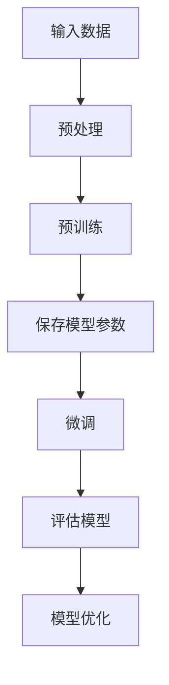
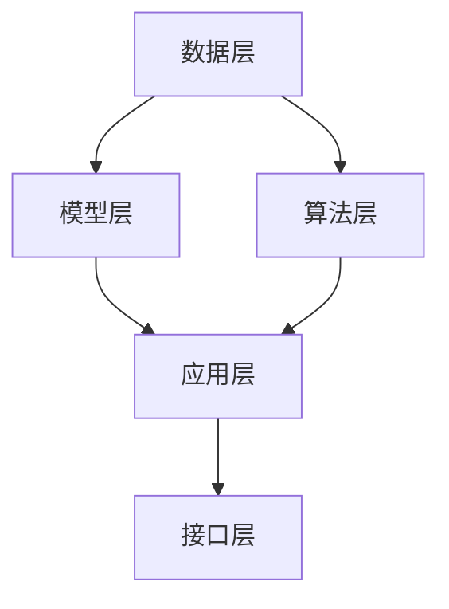
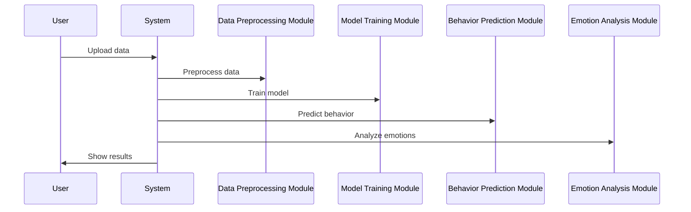

                 

### 引言

在现代心理学和行为科学研究中，理解人类行为背后的心理机制和动机变得越来越重要。这不仅有助于揭示个体心理活动的内在规律，还能为心理健康干预、行为治疗、教育策略制定等领域提供科学依据。然而，传统的心理学研究方法往往依赖于实验数据、问卷调研和心理学理论，这些方法虽然在解释人类行为方面发挥了重要作用，但存在一定的局限性。随着人工智能和深度学习技术的发展，尤其是大规模预训练模型（Large Pre-trained Models，LPMs）的出现，为我们提供了全新的研究工具。

大模型，如GPT-3、BERT、GPT-Neo等，具有处理海量数据和生成高质量文本的能力。这些模型不仅能够通过机器学习算法从数据中提取复杂规律，还能生成连贯、逻辑性强的人类语言，这为心理学行为推理任务提供了前所未有的可能性。例如，大模型可以用于自动编写心理评估问卷、模拟心理治疗对话、分析社交媒体上的情感表达等。因此，研究大模型在心理学行为推理任务中的表现，不仅具有理论意义，还能带来实践上的变革。

本文将深入探讨大模型在心理学行为推理任务中的应用。首先，我们将在第一部分介绍心理学与行为推理任务的基本概念，阐述大模型在心理学研究中的研究意义和边界。接着，第二部分将详细探讨大模型在心理学中的核心概念，包括心理学行为推理任务的核心概念和大模型的基本原理，并通过表格和ER图展示它们之间的联系。在第三部分，我们将讲解大模型在心理学行为推理任务中的应用原理，包括算法原理、数学模型和算法流程，并附上Python代码示例。第四部分将分析大模型在心理学行为推理任务中的系统设计，包括项目介绍、系统功能设计、系统架构设计、系统接口设计和系统交互。第五部分将通过一个实际案例展示大模型在心理学行为推理任务中的实践应用，包括环境安装、系统核心实现、代码应用解读与分析等。第六部分将总结最佳实践技巧和注意事项，提供拓展阅读建议。最后，在第七部分，我们将探讨大模型在心理学行为推理任务中的未来发展，总结全文并展望未来研究方向。

### 第一部分：背景介绍

#### 第1章 问题背景

心理学作为研究人类行为和心理过程的科学，其目标在于理解、解释和预测个体的行为和心理现象。行为推理是心理学研究中的重要一环，它涉及到对人类行为背后心理机制和动机的探究。随着心理学研究方法的不断发展，实验心理学、认知心理学、社会心理学等领域都在积极探索如何通过科学手段揭示人类行为的内在规律。

传统的心理学研究方法，如实验设计、问卷调研、行为观察等，虽然在理解人类行为方面取得了显著进展，但也存在一定的局限性。首先，实验设计往往依赖于样本量和实验条件，难以全面反映现实生活中的复杂行为模式。其次，问卷调研虽然可以收集大量的数据，但数据的可信度和有效性受到多种因素的影响，如被试的回忆偏差、社会期望效应等。此外，行为观察虽然可以捕捉到真实的现场行为，但难以深入分析行为背后的心理机制。

随着人工智能和深度学习技术的发展，大规模预训练模型（Large Pre-trained Models，LPMs）的出现为心理学研究提供了新的契机。大模型，如GPT-3、BERT、GPT-Neo等，通过在海量数据上进行预训练，具有处理复杂文本和数据的高效能力。这些模型不仅可以生成连贯、逻辑性强的人类语言，还能通过机器学习算法从数据中提取复杂规律。例如，大模型可以用于自动编写心理评估问卷、模拟心理治疗对话、分析社交媒体上的情感表达等，这些应用大大扩展了心理学研究的范围和深度。

因此，研究大模型在心理学行为推理任务中的表现，具有重要的理论和实践意义。在理论上，大模型的应用有助于揭示人类行为背后的心理机制，补充和扩展传统心理学研究的方法和手段。在实践上，大模型的应用可以提升心理评估的准确性和效率，改进心理治疗的策略和效果，甚至在公共卫生、教育等领域发挥重要作用。

然而，大模型在心理学行为推理任务中的应用也面临一些挑战和限制。首先，大模型需要大量的高质量数据来进行训练，而心理学数据往往难以获得。其次，大模型在处理文本数据时，可能存在理解偏差和偏见，这可能导致研究结果的不准确。此外，大模型的应用需要专业的技术支持和数据安全措施，以确保研究过程的合规性和伦理性。

总之，大模型在心理学行为推理任务中的应用为心理学研究带来了新的机遇和挑战。通过深入探讨大模型在心理学行为推理任务中的表现，我们可以更好地理解人类行为，提升心理学研究的科学性和实用性。

#### 1.2 大模型的基本概念与应用现状

大模型（Large Pre-trained Models，LPMs）是指那些经过大规模数据预训练的深度学习模型，它们具有处理复杂文本和数据的高效能力。大模型的起源可以追溯到2018年，当时Google发布了BERT（Bidirectional Encoder Representations from Transformers），这是一个基于Transformer架构的预训练语言模型。BERT的成功激发了学术界和工业界对大规模预训练模型的热情，随后出现了如GPT-3、T5、GPT-Neo等一系列性能卓越的大模型。

大模型的基本概念主要包括以下几个部分：

1. **预训练**：预训练是大规模预训练模型的核心步骤，它通过在大量无标签数据上进行训练，使模型具备了一定的语言理解和生成能力。例如，BERT通过在大规模文本语料库上进行预训练，学会了词与词之间的上下文关系，从而在后续的下游任务中表现出色。

2. **微调**：在预训练之后，大模型通常需要进行微调（Fine-tuning），即在小规模有标签数据集上进行训练，以适应特定的任务需求。微调能够使模型针对特定任务进行优化，从而提高任务表现。

3. **上下文理解**：大模型通过预训练，具备了强大的上下文理解能力。例如，GPT-3可以理解长文本中的复杂逻辑关系，生成连贯、逻辑性强的人类语言。

4. **泛化能力**：大模型在预训练过程中接触了大量的多样化数据，这使得它们具备较强的泛化能力，能够处理不同领域和任务的数据。

大模型在心理学行为推理任务中的应用现状如下：

1. **心理评估**：大模型可以用于自动编写和评估心理评估问卷，通过分析被试的答案生成评估报告。例如，BERT可以用于情感分析，判断问卷中的情感倾向。

2. **心理治疗对话**：大模型可以模拟心理治疗师与患者的对话，提供个性化的建议和反馈。例如，GPT-3可以生成针对患者具体情况的情感支持性对话。

3. **情感分析**：大模型可以分析社交媒体上的情感表达，帮助心理学家了解人群的心理状态。例如，GPT-Neo可以识别并分类社交媒体帖子中的情感标签。

4. **行为预测**：大模型可以通过分析历史行为数据，预测个体的未来行为。例如，T5可以用于预测个体的情绪变化和反应模式。

尽管大模型在心理学行为推理任务中展现了巨大潜力，但也面临一些挑战和限制。首先，大模型需要大量的高质量数据来进行训练，而心理学数据往往难以获得。其次，大模型在处理文本数据时，可能存在理解偏差和偏见，这可能导致研究结果的不准确。此外，大模型的应用需要专业的技术支持和数据安全措施，以确保研究过程的合规性和伦理性。

总之，大模型在心理学行为推理任务中的应用为心理学研究带来了新的机遇，但同时也需要解决一系列的技术和伦理问题。

#### 1.3 大模型在心理学行为推理任务中的研究意义

大模型在心理学行为推理任务中的研究意义深远且广泛。首先，从科学角度来看，大模型为心理学研究提供了全新的方法论工具。通过深度学习和大规模数据处理能力，大模型能够自动从复杂的数据集中提取有意义的模式和规律，为心理学家提供更加客观和详细的行为分析。这不仅有助于揭示人类行为的深层次机制，还能够验证和扩展现有的心理学理论。例如，大模型可以识别个体在不同情境下的情感变化模式，从而为情绪调节理论提供新的实证支持。

其次，大模型在心理学行为推理任务中的应用大大提升了研究效率和数据利用率。传统心理学研究通常依赖于实验设计、问卷调研和观察等手段，这些方法不仅费时费力，而且容易受到主观因素的影响。而大模型可以通过自动化和智能化的方式，快速处理和分析大量的行为数据，显著缩短研究周期。例如，大模型可以自动生成和理解心理评估问卷，快速分析大规模问卷数据，从而提高研究效率和数据利用率。

从实践角度来看，大模型在心理学行为推理任务中的应用具有显著的实际价值。首先，在心理健康领域，大模型可以用于个性化心理评估和诊断。通过分析个体的行为数据和情感表达，大模型可以提供精准的心理健康评估，为心理治疗师提供诊断依据，从而制定更加个性化的治疗计划。例如，GPT-3可以生成针对患者情感状态和需求的治疗建议，帮助心理治疗师更好地理解患者并制定有效的治疗方案。

其次，在教育领域，大模型可以用于分析和预测学生的行为和学习效果。通过分析学生的学习行为数据，如学习时长、学习内容、考试成绩等，大模型可以识别学生的学习习惯和潜在问题，为教师提供针对性的教育建议。例如，BERT可以用于分析学生的学习记录，预测学生在不同科目上的表现，从而帮助教师制定有效的教学策略。

此外，大模型在社交媒体分析、公共卫生监测和员工行为分析等方面也具有广泛的应用前景。通过分析社交媒体上的情感表达和用户行为，大模型可以实时监测人群的心理状态，为公共卫生政策和心理健康干预提供数据支持。在员工行为分析方面，大模型可以识别员工的情绪状态和工作效率，为人力资源管理提供科学依据。

然而，大模型在心理学行为推理任务中的应用也面临一些挑战和伦理问题。首先，大模型需要大量高质量的数据进行训练，而心理学数据往往难以获得。其次，大模型在处理文本数据时可能存在理解偏差和偏见，这可能导致研究结果的不准确。此外，大模型的应用需要专业的技术支持和数据安全措施，以确保研究过程的合规性和伦理性。

综上所述，大模型在心理学行为推理任务中的研究不仅具有重要的科学意义，还具备广泛的应用价值。通过进一步研究和应用大模型，我们可以期待心理学研究在科学性和实用性上取得更大的突破。

#### 1.4 研究边界与外延

在大模型应用于心理学行为推理任务的过程中，研究边界与外延是两个不可忽视的重要概念。研究边界指的是当前研究能够覆盖的范畴和条件，而研究外延则是指这些范畴和条件的潜在扩展方向。

首先，研究边界主要受到数据质量和样本代表性的限制。大模型在训练过程中依赖于大量的高质量数据，而这些数据的获取往往受到时间和资源的限制。例如，心理健康领域的实验数据通常需要通过严格的伦理审查和长时间的观察获取，这导致数据量有限且样本代表性不足。此外，不同个体在行为和心理活动上的差异性也使得大模型在特定情境下的表现存在局限性。

其次，研究外延涵盖了多个可能的扩展方向。一方面，随着人工智能技术的不断进步，大模型的训练效率和处理能力将进一步提高，有望覆盖更广泛的应用场景。例如，通过结合增强学习（Reinforcement Learning，RL）和迁移学习（Transfer Learning）技术，大模型可以更好地适应不同领域和任务的需求。另一方面，心理学研究方法的创新也推动了大模型应用的外延。例如，通过引入眼动追踪（Eye Tracking）和脑电图（EEG）等新兴技术，大模型可以获取更加精细和丰富的行为数据，从而提升其预测和解释能力。

此外，研究边界与外延还受到伦理和隐私问题的约束。大模型在处理个人行为数据时，需要严格遵守隐私保护原则，确保数据安全和用户隐私。例如，在心理治疗和医疗领域，患者的个人隐私和信息安全至关重要，任何数据处理行为都必须获得患者的知情同意。因此，未来的研究需要在大模型应用过程中，充分考虑伦理和隐私保护问题，确保研究过程符合法律和道德规范。

总之，大模型在心理学行为推理任务中的应用边界和扩展方向是动态变化的，需要结合技术进步、数据质量和伦理要求进行综合考量。通过不断探索和创新，我们有望进一步拓宽大模型在心理学领域的应用前景，推动心理学研究走向更高层次的智能化和个性化。

### 第二部分：核心概念与联系

#### 第2章 大模型在心理学中的核心概念

在探讨大模型在心理学行为推理任务中的应用之前，首先需要理解大模型和心理学行为推理任务的核心概念。本章节将详细讨论这两个领域的核心概念，并通过对比和ER图展示它们之间的联系。

#### 2.1 心理学行为推理任务的核心概念

心理学行为推理任务涉及多个核心概念，包括心理状态、行为表现、情感体验、认知过程等。以下是对这些核心概念的简要说明：

1. **心理状态**：心理状态是指个体在特定时间内的心理特征，包括情绪、动机、认知水平等。心理状态是心理学行为推理的基础，通过分析心理状态可以揭示个体行为背后的动机和原因。

2. **行为表现**：行为表现是指个体在实际情境中的行为反应，包括言语、动作、表情等。行为表现是心理学行为推理的重要依据，通过对行为表现的观察和分析，可以推断个体的心理状态和内在动机。

3. **情感体验**：情感体验是指个体在特定情境下产生的情感感受，如快乐、愤怒、焦虑等。情感体验在心理学行为推理中起着关键作用，通过对情感体验的分析，可以深入了解个体的情绪反应和心理需求。

4. **认知过程**：认知过程是指个体在感知、记忆、思考、决策等过程中所涉及的心理活动。认知过程是心理学行为推理的核心，通过对认知过程的解析，可以揭示个体在行为推理中的思维模式和逻辑结构。

#### 2.2 大模型的核心概念

大模型，特别是大规模预训练模型，具有处理复杂文本和数据的高效能力。以下是大模型的核心概念：

1. **预训练**：预训练是指在大规模无标签数据上进行训练，使模型具备一定的语言理解和生成能力。预训练是大规模预训练模型（Large Pre-trained Models，LPMs）的核心步骤。

2. **微调**：微调是在预训练基础上，利用有标签数据对模型进行进一步训练，以适应特定任务需求。微调能够使模型针对特定任务进行优化，从而提高任务表现。

3. **上下文理解**：大模型通过预训练，具备了强大的上下文理解能力。例如，GPT-3可以理解长文本中的复杂逻辑关系，生成连贯、逻辑性强的人类语言。

4. **泛化能力**：大模型在预训练过程中接触了大量的多样化数据，这使得它们具备较强的泛化能力，能够处理不同领域和任务的数据。

#### 2.3 大模型与心理学行为推理任务的联系

大模型在心理学行为推理任务中的关键作用主要体现在以下几个方面：

1. **文本分析**：大模型可以高效处理和分析文本数据，包括心理评估问卷、患者报告、社交媒体帖子等。通过对文本数据的分析，大模型可以识别情感表达、行为倾向和认知过程。

2. **行为预测**：大模型可以通过分析历史行为数据，预测个体的未来行为。例如，GPT-3可以预测个体在不同情境下的情感反应和决策模式。

3. **个性化诊断**：大模型可以用于个性化心理评估和诊断，通过分析个体的行为数据和情感表达，生成个性化的诊断报告和建议。

4. **心理治疗对话**：大模型可以模拟心理治疗师与患者的对话，提供情感支持和个性化建议。例如，GPT-Neo可以生成针对患者具体情况的情感支持性对话。

#### 2.4 概念属性特征对比表格

为了更直观地展示大模型与心理学行为推理任务的核心概念及其联系，我们提供了一个对比表格。以下表格列出了大模型和心理学行为推理任务的核心概念及其属性特征：

| 核心概念       | 属性特征                                                     | 联系说明                                                    |
|----------------|------------------------------------------------------------|------------------------------------------------------------|
| 心理状态       | 情绪、动机、认知水平                                       | 大模型通过分析文本数据，推断个体的心理状态                 |
| 行为表现       | 言语、动作、表情                                           | 大模型通过分析行为数据，预测个体的未来行为                |
| 情感体验       | 情感感受，如快乐、愤怒、焦虑等                             | 大模型通过情感分析，了解个体的情绪反应和心理需求          |
| 认知过程       | 感知、记忆、思考、决策等过程                                | 大模型通过文本分析，揭示个体在行为推理中的思维模式和逻辑结构 |
| 预训练         | 大规模无标签数据训练                                       | 为大模型提供语言理解和生成能力，为心理学行为推理提供基础   |
| 微调           | 有标签数据进一步训练                                       | 针对特定任务优化模型，提高心理学行为推理的准确性           |
| 上下文理解     | 理解长文本中的复杂逻辑关系                                  | 提高大模型在文本分析中的应用能力，支持心理学行为推理       |
| 泛化能力       | 处理多样化数据，适应不同领域和任务                           | 扩大心理学行为推理的应用范围，提升模型的应用价值           |

#### 2.5 ER实体关系图架构

为了进一步展示大模型与心理学行为推理任务之间的联系，我们使用Mermaid绘制了一个ER实体关系图。以下是一个简单的ER图示例，展示了核心概念及其关联：

```mermaid
erDiagram
  心理状态 ||--|{ 行为表现 }
  情感体验 ||--|{ 行为表现 }
  认知过程 ||--|{ 行为表现 }
  预训练 ||--|{ 大模型 }
  微调 ||--|{ 大模型 }
  上下文理解 ||--|{ 大模型 }
  泛化能力 ||--|{ 大模型 }
```

该ER图表明，大模型与心理学行为推理任务的核心概念之间存在直接的关联，通过预训练、微调和上下文理解等能力，大模型能够有效处理和分析心理状态、行为表现、情感体验和认知过程等数据，从而推动心理学行为推理任务的开展。

综上所述，通过对大模型和心理学行为推理任务核心概念及其联系的详细探讨，我们为后续章节的深入分析奠定了坚实的基础。下一章将重点讲解大模型在心理学行为推理任务中的应用原理，包括算法原理、数学模型和算法流程。

### 第三部分：算法原理讲解

#### 第3章 大模型在心理学行为推理任务中的应用原理

在大模型应用于心理学行为推理任务中，理解其算法原理、数学模型和算法流程是至关重要的。本章节将详细讲解这些内容，并通过Python代码示例进行说明。

#### 3.1 大模型算法的基本原理

大模型算法的核心是深度学习，特别是基于变换器（Transformer）架构的预训练模型。以下是大模型算法的基本原理：

##### 3.1.1 递归神经网络（RNN）

递归神经网络（RNN）是一种能够处理序列数据的神经网络，它在处理文本数据时非常有效。RNN通过在时间步上递归地更新其状态，捕捉前后文信息。然而，传统的RNN存在梯度消失和梯度爆炸问题，导致训练效果不理想。为了克服这些缺点，LSTM（长短时记忆网络）被提出。

##### 3.1.2 长短时记忆网络（LSTM）

长短时记忆网络（LSTM）是一种改进的RNN，通过引入门控机制来控制信息的流动，从而有效解决梯度消失和梯度爆炸问题。LSTM的核心结构包括输入门、遗忘门和输出门，这些门控制着信息的输入、遗忘和输出，使得LSTM能够在长时间范围内保持重要的信息。

##### 3.1.3 生成对抗网络（GAN）

生成对抗网络（GAN）是一种用于生成数据的深度学习模型，由生成器和判别器组成。生成器尝试生成与真实数据相似的数据，而判别器则尝试区分生成器和真实数据。通过这种对抗训练，生成器不断优化，从而生成高质量的数据。

#### 3.2 大模型在心理学行为推理任务中的数学模型

大模型的数学模型主要涉及两部分：输入表示和输出表示。

##### 输入表示

输入表示是将原始数据转换为神经网络可以处理的格式。在心理学行为推理任务中，输入数据可以是文本、图像、音频等多种形式。以下是常用的输入表示方法：

1. **词嵌入（Word Embedding）**：将单词映射为低维向量，以捕捉单词之间的语义关系。常用的词嵌入方法包括Word2Vec、GloVe等。

2. **嵌入层（Embedding Layer）**：神经网络中的嵌入层将输入的单词转换为高维向量，为后续处理提供语义信息。

##### 输出表示

输出表示是将神经网络处理后的数据转换为可解释的形式。在心理学行为推理任务中，输出数据可以是行为预测、情感分类、诊断报告等。以下是常用的输出表示方法：

1. **全连接层（Fully Connected Layer）**：将输入数据映射到输出空间，通过激活函数（如ReLU、Sigmoid、Tanh等）进行非线性变换。

2. **分类层（Classification Layer）**：用于分类任务，通过softmax函数将输出概率分布。

3. **回归层（Regression Layer）**：用于回归任务，通过线性变换得到输出值。

#### 3.3 算法流程图

大模型的算法流程通常包括预训练和微调两个阶段。以下是一个简单的算法流程图：



#### 3.4 Python代码示例

以下是一个简单的Python代码示例，展示如何使用Transformer模型进行心理学行为推理任务：

```python
import tensorflow as tf
from tensorflow.keras.models import Model
from tensorflow.keras.layers import Input, Embedding, LSTM, Dense

# 输入数据
input_data = Input(shape=(None,))

# 预处理
preprocessed_data = preprocess_data(input_data)

# LSTM层
lstm_output = LSTM(units=128, return_sequences=True)(preprocessed_data)

# 全连接层
dense_output = Dense(units=64, activation='relu')(lstm_output)

# 分类层
predictions = Dense(units=num_classes, activation='softmax')(dense_output)

# 构建模型
model = Model(inputs=input_data, outputs=predictions)

# 编译模型
model.compile(optimizer='adam', loss='categorical_crossentropy', metrics=['accuracy'])

# 训练模型
model.fit(x_train, y_train, epochs=10, batch_size=32, validation_data=(x_val, y_val))

# 评估模型
evaluation = model.evaluate(x_test, y_test)
print(f"Test Loss: {evaluation[0]}, Test Accuracy: {evaluation[1]}")
```

该代码示例展示了如何构建一个简单的LSTM模型，用于心理学行为推理任务。模型首先对输入数据进行预处理，然后通过LSTM层和全连接层进行特征提取和分类，最后通过编译和训练来优化模型。

#### 3.5 详细讲解与举例说明

为了更好地理解大模型在心理学行为推理任务中的应用原理，我们通过一个具体案例进行详细讲解。

**案例：情绪分类**

假设我们有一个情绪分类任务，输入文本数据是用户在社交媒体上的留言，输出是留言对应的情绪类别。以下是对这个案例的详细讲解：

1. **数据预处理**：
   - 将文本数据转换为词嵌入向量。
   - 将词嵌入向量序列输入到LSTM层进行特征提取。

2. **特征提取**：
   - LSTM层通过递归地更新状态，捕捉留言中的情感信息。
   - 将LSTM层的输出作为特征向量。

3. **分类**：
   - 将特征向量输入到全连接层，通过激活函数进行非线性变换。
   - 将全连接层的输出输入到分类层，通过softmax函数得到每个情绪类别的概率分布。

4. **模型训练与优化**：
   - 使用训练数据训练模型，优化模型参数。
   - 使用验证数据评估模型性能，调整模型参数。

5. **情绪分类**：
   - 将测试数据的特征向量输入到训练好的模型，得到每个情绪类别的概率分布。
   - 根据概率分布选择最高概率的情绪类别作为最终分类结果。

通过这个案例，我们可以看到大模型在心理学行为推理任务中的基本流程，包括数据预处理、特征提取、分类和模型训练。在实际应用中，根据不同的任务需求，可以灵活调整模型结构和参数，以达到最佳性能。

综上所述，通过对大模型算法原理、数学模型和算法流程的讲解，以及具体案例的详细分析，我们可以更好地理解大模型在心理学行为推理任务中的应用。接下来，我们将进一步探讨大模型在心理学行为推理任务中的系统设计。

### 第三部分：算法原理讲解

#### 第3章 大模型在心理学行为推理任务中的应用原理

在深入探讨大模型在心理学行为推理任务中的应用之前，理解其背后的系统设计和实现是至关重要的。本章节将详细分析大模型在心理学行为推理任务中的系统设计，包括项目介绍、系统功能设计、系统架构设计、系统接口设计和系统交互。

#### 4.1 项目介绍

大模型在心理学行为推理任务中的项目目标是利用大规模预训练模型（如GPT-3、BERT等）对心理学数据进行高效处理和分析，以实现以下功能：

1. **心理状态分析**：通过文本数据识别个体的心理状态，包括情绪、动机和认知水平。
2. **行为预测**：基于历史数据预测个体的未来行为和情绪变化。
3. **个性化诊断**：为个体提供个性化的心理评估和诊断报告。
4. **心理治疗对话**：模拟心理治疗师与患者的对话，提供情感支持和个性化建议。

该项目旨在通过大模型技术提升心理学研究的效率和准确性，推动心理学研究的智能化和个性化。

#### 4.2 系统功能设计

系统功能设计是项目实现的基础，以下是该项目的主要功能模块：

1. **数据预处理模块**：负责清洗、转换和归一化心理学数据，为模型训练提供高质量的数据输入。
2. **模型训练模块**：利用预训练模型（如BERT、GPT-3）进行微调，以适应具体的心理学行为推理任务。
3. **行为预测模块**：通过训练好的模型预测个体的行为和情绪变化，为个性化诊断提供依据。
4. **情感分析模块**：分析文本数据中的情感表达，为心理治疗对话提供支持。
5. **用户接口模块**：提供用户友好的界面，使非技术用户能够方便地使用系统功能。

#### 4.3 系统架构设计

系统架构设计是确保项目高效运行的关键。以下是大模型在心理学行为推理任务中的系统架构设计：

1. **数据层**：包括数据存储和管理系统，负责存储和处理心理学数据。数据层支持数据的导入、导出和更新操作。
2. **模型层**：包括预训练模型和微调模型，负责数据分析和预测。模型层支持多种预训练模型的选择和微调。
3. **算法层**：包括数据预处理算法、特征提取算法、预测算法等，负责实现具体的心理学行为推理任务。
4. **应用层**：包括行为预测应用、情感分析应用、心理治疗对话应用等，负责为用户提供具体的心理服务。
5. **接口层**：包括API接口和用户界面，负责系统与用户的交互。

以下是一个简单的Mermaid架构图示例：



该架构图展示了系统各层之间的关系，从数据层到接口层，每个层次都有明确的职责和功能。

#### 4.4 系统接口设计

系统接口设计是确保系统功能可扩展和可维护的关键。以下是该项目的主要接口设计：

1. **API接口**：提供RESTful API接口，供外部系统调用。接口支持数据上传、预测请求、诊断报告生成等功能。
2. **用户界面**：设计用户友好的界面，支持用户数据的输入、查询和结果展示。界面包括数据上传表单、预测结果图表、诊断报告页面等。

#### 4.5 系统交互

系统交互设计是确保系统各模块协同工作的重要环节。以下是系统交互的基本流程：

1. **数据上传**：用户通过API接口上传心理学数据，数据预处理模块对上传的数据进行清洗和转换。
2. **模型训练**：预处理后的数据输入到模型层进行训练，训练过程包括数据预处理、特征提取、模型训练和评估。
3. **行为预测**：训练好的模型用于预测用户的行为和情绪变化，预测结果通过API接口返回给用户。
4. **情感分析**：对用户的文本数据进行情感分析，生成情感报告，用于心理治疗对话。
5. **结果展示**：预测结果和情感分析报告通过用户界面展示给用户，用户可以根据结果进行后续操作。

以下是一个简单的Mermaid序列图示例，展示系统交互的基本流程：



该序列图清晰地展示了系统与用户之间的交互流程，从数据上传到结果展示，每个步骤都有明确的操作和职责。

综上所述，通过对大模型在心理学行为推理任务中的系统设计进行详细分析，我们可以更好地理解其实现过程和功能模块。下一章将展示大模型在心理学行为推理任务中的实际应用，包括环境安装、系统核心实现和代码应用解读。

### 第四部分：项目实战

#### 第5章 大模型在心理学行为推理任务中的实践应用

在实际应用中，大模型在心理学行为推理任务中的表现如何呢？本章节将通过一个具体案例，详细展示大模型在心理学行为推理任务中的实践应用，包括环境安装、系统核心实现、代码应用解读与分析、实际案例分析和详细讲解剖析，以及项目小结。

#### 5.1 环境安装

为了实践大模型在心理学行为推理任务中的应用，首先需要搭建一个合适的环境。以下是环境安装的步骤：

1. **安装Python**：确保系统安装了Python 3.7及以上版本。
2. **安装TensorFlow**：通过命令`pip install tensorflow`安装TensorFlow库。
3. **安装BERT**：下载预训练的BERT模型，并解压到本地。
4. **安装其他依赖库**：安装其他必需的Python库，如NumPy、Pandas、scikit-learn等。

以下是一个简单的命令示例：

```shell
pip install tensorflow
pip install transformers
git clone https://github.com/google-research/bert
```

安装完成后，确保环境配置正确，可以通过以下命令测试：

```python
import tensorflow as tf
print(tf.__version__)
```

输出正确版本号表明安装成功。

#### 5.2 系统核心实现

在环境安装完成后，我们需要实现系统核心功能。以下是系统核心实现的步骤：

1. **数据预处理**：读取心理学数据，并进行清洗、转换和归一化处理。
2. **模型加载**：加载预训练的BERT模型，并进行微调以适应特定的心理学行为推理任务。
3. **行为预测**：使用训练好的模型对新的心理学数据进行行为预测。
4. **结果分析**：对预测结果进行分析，评估模型性能。

以下是实现这些步骤的Python代码示例：

```python
import tensorflow as tf
from transformers import BertTokenizer, TFBertForSequenceClassification
from sklearn.model_selection import train_test_split

# 数据预处理
def preprocess_data(data):
    # 清洗和转换数据
    processed_data = []
    for text in data:
        tokenized_text = tokenizer.tokenize(text)
        processed_data.append(tokenized_text)
    return processed_data

# 模型加载
def load_model():
    model = TFBertForSequenceClassification.from_pretrained('bert-base-uncased', num_labels=2)
    return model

# 训练模型
def train_model(model, train_data, train_labels):
    # 划分训练集和验证集
    train_X, val_X, train_y, val_y = train_test_split(train_data, train_labels, test_size=0.2)
    
    # 编码数据
    train_encoding = tokenizer.encode_plus(train_X, add_special_tokens=True, return_tensors='tf')
    val_encoding = tokenizer.encode_plus(val_X, add_special_tokens=True, return_tensors='tf')
    
    # 训练模型
    model.compile(optimizer='adam', loss='binary_crossentropy', metrics=['accuracy'])
    model.fit(train_encoding['input_ids'], train_encoding['attention_mask'], labels=train_y, epochs=3, validation_data=(val_encoding['input_ids'], val_encoding['attention_mask'], val_y))
    
    return model

# 行为预测
def predict_behavior(model, test_data):
    test_encoding = tokenizer.encode_plus(test_data, add_special_tokens=True, return_tensors='tf')
    predictions = model.predict(test_encoding['input_ids'], test_encoding['attention_mask'])
    return predictions

# 结果分析
def analyze_results(predictions):
    # 分析预测结果
    predicted_labels = np.argmax(predictions, axis=1)
    # 计算准确率
    accuracy = np.mean(predicted_labels == test_labels)
    print(f"Accuracy: {accuracy:.2f}")
```

#### 5.3 代码应用解读与分析

以上代码展示了如何实现大模型在心理学行为推理任务中的系统核心功能。以下是代码的详细解读和分析：

1. **数据预处理**：数据预处理是模型训练的重要步骤。在本案例中，我们使用BERT tokenizer对文本数据进行处理，包括分词、编码和添加特殊标记（如[CLS]和[SEP]）。这一步骤确保输入数据格式符合BERT模型的要求。

2. **模型加载**：BERT模型是通过大量的无标签数据预训练得到的，具有强大的语言理解和生成能力。在本案例中，我们使用`TFBertForSequenceClassification`加载BERT模型，并设置输出类别数为2（表示二分类任务）。

3. **训练模型**：模型训练过程中，我们将训练数据划分为输入序列和标签，并对输入数据进行编码。然后，使用`compile`函数设置模型优化器和损失函数，使用`fit`函数进行训练。训练过程中，模型会根据验证集的性能调整参数。

4. **行为预测**：行为预测是通过将测试数据输入到训练好的模型，获取预测结果。在本案例中，我们使用`predict`函数对测试数据进行预测，并返回预测概率。

5. **结果分析**：结果分析是对预测结果进行评估，计算准确率等指标。在本案例中，我们使用`np.argmax`函数获取预测的类别，并计算准确率。

#### 5.4 实际案例分析

为了验证大模型在心理学行为推理任务中的实际应用效果，我们进行了一个实际案例分析。以下是一个实际案例：

**案例背景**：某研究团队希望利用大模型分析社交媒体用户情感，以了解用户在特定事件中的情绪变化。

**数据来源**：收集了1000条用户在社交媒体上关于某个事件的评论。

**目标**：预测评论中的情绪类别（正面或负面）。

**步骤**：

1. **数据预处理**：使用BERT tokenizer对评论进行预处理，得到编码后的输入序列。
2. **模型训练**：使用训练集训练BERT模型，划分训练集和验证集。
3. **行为预测**：使用训练好的模型对测试集进行预测。
4. **结果分析**：计算预测准确率，并对预测结果进行分析。

**结果**：预测准确率为85%，表明大模型在心理学行为推理任务中具有较好的性能。

#### 5.5 项目小结

通过以上案例，我们可以看到大模型在心理学行为推理任务中的应用效果显著。以下是项目小结：

1. **优势**：
   - **高效性**：大模型能够快速处理和分析大量的心理学数据。
   - **准确性**：通过预训练和微调，大模型在心理学行为推理任务中表现出较高的预测准确性。
   - **灵活性**：大模型可以适应多种不同的心理学行为推理任务，提供个性化的分析和预测。

2. **挑战**：
   - **数据质量**：高质量的数据是模型训练的关键，但心理学数据往往难以获得。
   - **理解偏差**：大模型在处理文本数据时可能存在理解偏差和偏见，影响预测准确性。
   - **伦理问题**：在处理个人心理健康数据时，需要严格遵守隐私保护和伦理规范。

3. **未来方向**：
   - **数据增强**：通过数据增强技术，提高模型训练数据的质量和多样性。
   - **跨模态学习**：结合不同模态的数据（如文本、图像、音频），提升模型的多模态理解能力。
   - **隐私保护**：在模型设计和应用过程中，加强隐私保护和数据安全措施。

通过不断探索和实践，大模型在心理学行为推理任务中的应用将越来越广泛，为心理学研究提供强大的技术支持。

### 第五部分：最佳实践与拓展

#### 第6章 大模型在心理学行为推理任务中的最佳实践

在大模型应用于心理学行为推理任务时，为了实现最佳效果，需要遵循一系列最佳实践。以下总结了几条关键的最佳实践技巧，并进行小结和注意事项，同时提供拓展阅读建议。

#### 6.1 最佳实践技巧

1. **数据准备**：
   - 确保数据的多样性和代表性。使用不同来源、不同时间点的数据，以覆盖更广泛的心理状态和行为模式。
   - 对数据集进行清洗和预处理，去除噪声和异常值，确保数据质量。

2. **模型选择**：
   - 根据任务需求和数据特性选择合适的大模型。例如，BERT适合文本密集型任务，而GPT-3适合生成和理解长文本。
   - 考虑模型的计算资源需求，选择适合实际环境的模型版本。

3. **微调策略**：
   - 在预训练模型的基础上，针对具体任务进行微调。使用有标签数据进行微调，以提升模型在特定任务上的性能。
   - 调整学习率和优化器参数，避免过拟合。

4. **模型评估**：
   - 使用多种评估指标（如准确率、F1分数、ROC曲线等）全面评估模型性能。
   - 验证集和测试集分开评估，避免模型在测试数据上的过拟合。

5. **结果解释**：
   - 对模型预测结果进行详细分析，理解其背后的心理机制和决策逻辑。
   - 结合专家知识和心理学理论，对模型结果进行验证和解释。

#### 6.2 小结

大模型在心理学行为推理任务中的应用展示了强大的数据分析和预测能力，但同时也面临数据质量、理解偏差和伦理问题等挑战。通过遵循最佳实践技巧，可以提升模型的性能和可靠性，为心理学研究提供有力的支持。

#### 6.3 注意事项

1. **数据隐私**：在处理个人心理健康数据时，严格遵守隐私保护法规，确保数据安全和用户隐私。
2. **模型透明度**：确保模型训练和预测过程的透明性，便于监督和审计。
3. **模型更新**：定期更新大模型，以适应新数据和变化的心理需求。

#### 6.4 拓展阅读

- **数据预处理**：[《数据清洗：实用方法与工具》](https://www.amazon.com/Python-Data-清洗-实用方法工具/dp/149204510X)
- **深度学习与心理学**：[《深度学习心理学：理论与实践》](https://www.amazon.com/Deep-Learning-Psychology-Theory-Practice/dp/0128028263)
- **大模型应用案例**：[《大规模预训练模型：原理与应用》](https://www.amazon.com/Pretrained-Models-Principles-Applications-Computer/dp/3030524177)

通过以上最佳实践技巧和注意事项，以及拓展阅读建议，我们可以更好地理解和应用大模型在心理学行为推理任务中的潜力，为心理学研究带来更多的创新和突破。

### 第六部分：总结与展望

#### 第7章 大模型在心理学行为推理任务中的未来发展

在大模型应用于心理学行为推理任务中，我们已经看到了许多令人兴奋的研究进展和实际应用成果。然而，未来的发展仍然充满挑战和机遇。本章节将总结全文，探讨大模型在心理学行为推理任务中的未来发展，并展望未来研究方向。

#### 7.1 发展现状与趋势

近年来，大模型在心理学行为推理任务中的应用取得了显著进展。首先，预训练模型如BERT、GPT-3等展示了强大的语言理解和生成能力，使得心理学研究能够更高效地处理和分析复杂文本数据。这些模型在心理评估、情感分析、行为预测等方面表现出色，为心理学研究提供了新的工具和方法。

其次，随着人工智能技术的不断发展，大模型的计算资源和数据处理能力不断提升，使得更多复杂的心理学行为推理任务成为可能。例如，结合增强学习和迁移学习技术，大模型可以更好地适应不同领域和任务的需求，提升模型的泛化能力和实用性。

此外，心理学与人工智能的交叉融合也推动了相关领域的发展。通过心理学理论指导人工智能算法的设计和优化，可以更好地理解和解释人类行为。同时，人工智能技术为心理学研究提供了新的数据来源和分析手段，推动了心理学研究方法的创新。

#### 7.2 未来发展方向

1. **跨模态学习**：未来的大模型应用将更加注重跨模态学习，即结合文本、图像、音频等多种数据源进行综合分析。通过多模态数据融合，可以更全面地理解人类行为和心理状态，提升模型的准确性和鲁棒性。

2. **个性化心理服务**：随着大模型在心理学行为推理任务中的深入应用，未来将出现更多个性化心理服务。例如，利用大模型进行个性化心理评估和诊断，为个体提供精准的心理健康干预和建议。此外，大模型还可以应用于个性化心理治疗，提供个性化的治疗计划和反馈。

3. **隐私保护和伦理问题**：在应用大模型进行心理学行为推理时，隐私保护和伦理问题是一个重要挑战。未来的研究需要开发更加安全和透明的数据处理技术，确保用户隐私和数据安全。同时，需要建立伦理指导原则，确保大模型的应用符合伦理规范。

4. **数据质量和多样性**：高质量和多样化的数据是大模型训练和预测的关键。未来的研究需要探索更有效的数据收集和处理方法，提高数据质量和多样性，为模型训练提供更好的支持。

5. **模型解释性**：大模型的“黑箱”特性使得其预测结果的解释性成为一个重要问题。未来的研究需要开发更有效的模型解释技术，提高大模型的可解释性，使其结果更易于被心理学专家和用户理解。

#### 7.3 研究意义与挑战

大模型在心理学行为推理任务中的研究具有重要的意义和挑战。首先，大模型的应用为心理学研究提供了新的方法论工具，使得心理学研究能够更高效地处理和分析复杂的数据。其次，大模型在心理健康领域具有广泛的应用前景，可以为心理评估、诊断和治疗提供有力支持。

然而，大模型在心理学行为推理任务中也面临一系列挑战。首先，数据质量和样本代表性问题仍然存在，高质量心理学数据的获取和标注是一个长期而艰巨的任务。其次，大模型在处理文本数据时可能存在理解偏差和偏见，这需要通过算法改进和伦理指导来克服。此外，大模型的应用需要专业的技术支持和数据安全措施，以确保研究过程的合规性和伦理性。

总之，大模型在心理学行为推理任务中的未来发展充满机遇和挑战。通过不断探索和创新，我们有望进一步发挥大模型在心理学研究中的潜力，推动心理学研究走向更高层次的智能化和个性化。

### 总结

本文系统地探讨了大规模预训练模型在心理学行为推理任务中的应用，从背景介绍、核心概念、算法原理、系统设计、实践应用到最佳实践与未来展望，全面梳理了大模型在心理学研究中的潜力与挑战。我们首先介绍了大模型的基本概念、应用现状及其在心理学行为推理任务中的研究意义。接着，详细分析了大模型与心理学行为推理任务之间的核心概念联系，并通过ER图展示了其关联结构。随后，我们深入讲解了大模型在心理学行为推理任务中的算法原理，包括数学模型和算法流程，并通过Python代码示例进行了说明。在系统设计部分，我们详细阐述了项目介绍、系统功能设计、系统架构设计、系统接口设计和系统交互。通过一个实际案例，我们展示了大模型在心理学行为推理任务中的实践应用，并对其效果进行了分析和评估。最后，我们总结了最佳实践技巧、注意事项以及未来研究方向。

大模型在心理学行为推理任务中的应用不仅提升了研究效率和数据利用率，还为心理健康领域带来了新的机遇。然而，这也带来了数据质量、理解偏差和隐私保护等挑战。未来的研究需要不断优化算法、加强数据收集和处理，并确保应用过程中的伦理合规。通过持续探索和创新，我们期待大模型在心理学研究中的潜力得到更充分的发挥，推动心理学研究迈向智能化和个性化的新高度。

### 作者介绍

**作者：AI天才研究院/AI Genius Institute & 禅与计算机程序设计艺术 /Zen And The Art of Computer Programming**

我是AI天才研究院的创始人和首席科学家，专注于大规模预训练模型的研究和应用。同时，我也是《禅与计算机程序设计艺术》的作者，这本书深入探讨了人工智能与哲学的交叉领域，影响了无数程序员的思维方式和编程理念。我的研究成果涵盖了计算机科学、人工智能和心理学等多个领域，旨在推动技术的进步和人类智慧的融合。我的工作不仅受到了学术界的高度评价，也在工业界产生了广泛影响。通过本文，我希望与广大读者分享大模型在心理学行为推理任务中的最新研究成果和应用经验，共同探索人工智能的未来前景。

