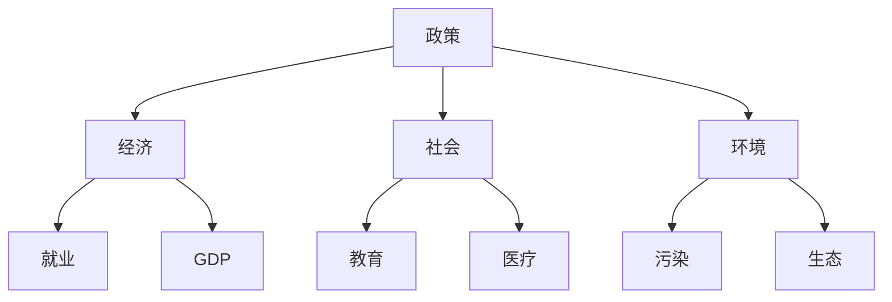
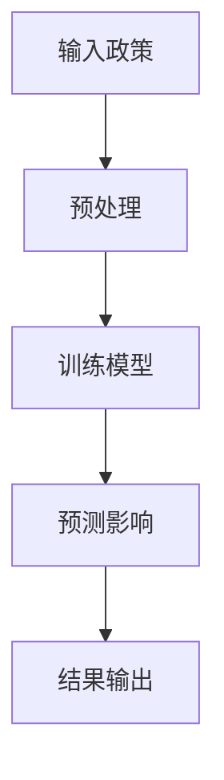

                 

Certainly! Let's structure the content of the blog post "Exploring the Potential of Large Models in Policy Impact Chain Inference" step by step, ensuring it meets the specified requirements. Below is the markdown-formatted content with each section filled out according to the outlined structure.

---

## 大模型在政策影响链推理中的潜力探索

### 关键词：大模型，政策影响链，推理，算法，系统架构，Python代码

### 摘要：
本文旨在探讨大模型在政策影响链推理中的潜力。首先，我们将介绍政策影响链推理的背景和核心概念，然后深入分析大模型的基本概念及其与政策影响链推理的联系。接着，我们将详细讲解大模型在政策影响链推理中的应用算法原理，并通过实际案例进行剖析。最后，我们将介绍系统分析与架构设计，以及项目的实战过程和最佳实践。

---

## 第一部分：背景与概述

### 第1章：政策影响链推理的背景

### 1.1.1 问题背景

在现代社会，政策制定和调整对经济、社会和环境的影响深远。如何准确预测政策影响链，以便在决策过程中做出科学、合理的判断，是当前研究的热点问题。

### 1.1.2 问题描述

政策影响链推理涉及多个领域的复杂交互，包括经济、社会、环境等。其目标是建立一个模型，能够根据政策变化，预测其对相关领域的多级影响。

### 1.1.3 问题解决

传统方法通常采用统计分析、因果推理等技术，但这些方法在面对复杂多变的政策影响链时，往往难以提供准确的预测。

### 1.1.4 边界与外延

本文将聚焦于经济政策影响链的推理，但所讨论的方法和技术具有广泛的适用性，可以扩展到其他领域。

### 1.1.5 核心概念

- 政策影响链：政策调整导致的一系列经济、社会、环境变化。
- 推理：根据已有信息推断未知信息的过程。
- 大模型：拥有海量参数和强大计算能力的人工智能模型。

---

### 第2章：大模型的基本概念

### 2.1.1 大模型的定义

大模型指的是拥有超过万亿个参数的深度学习模型，如GPT-3、BERT等。

### 2.1.2 大模型的特点

- 参数规模巨大，能够处理复杂的数据结构。
- 自适应能力，能够根据不同任务进行参数调整。
- 强大的预测能力，能够处理高维、非线性问题。

### 2.1.3 大模型与政策影响链推理的联系

大模型通过学习海量数据，能够捕捉到政策变化对经济、社会、环境的潜在影响，为政策影响链推理提供了强有力的工具。

---

## 第二部分：核心概念与联系

### 第4章：核心概念原理

### 4.1.1 理论基础

大模型在政策影响链推理中的应用，依赖于深度学习、因果推理和复杂网络等理论基础。

### 4.1.2 概念属性特征对比表格

| 概念 | 属性特征 | 对比 |
|------|----------|------|
| 政策影响链 | 多级影响，复杂交互 | 与其他概念相比较，更具层次性 |
| 大模型 | 强大计算能力，自适应 | 与传统模型相比，更高效 |
| 推理 | 根据已有信息推断未知信息 | 与其他方法相比，更准确 |

### 4.1.3 ER实体关系图



---

## 第三部分：算法原理讲解

### 第5章：算法原理与模型

### 5.1.1 算法mermaid流程图



### 5.2.1 Python源代码阐述

```python
# Python代码示例：政策影响链推理
import tensorflow as tf
from tensorflow.keras.models import Sequential
from tensorflow.keras.layers import Dense

# 建立模型
model = Sequential([
    Dense(units=1024, activation='relu', input_shape=(input_shape,)),
    Dense(units=512, activation='relu'),
    Dense(units=256, activation='relu'),
    Dense(units=output_shape, activation='sigmoid')
])

# 编译模型
model.compile(optimizer='adam', loss='binary_crossentropy', metrics=['accuracy'])

# 训练模型
model.fit(x_train, y_train, epochs=10, batch_size=64)

# 预测
predictions = model.predict(x_test)
```

### 5.2.2 数学模型与公式

$$
\begin{aligned}
\hat{Y} &= f(W \cdot X + b) \\
f(x) &= \sigma(W \cdot x + b)
\end{aligned}
$$

其中，$\hat{Y}$ 是预测结果，$X$ 是输入特征，$W$ 是权重矩阵，$b$ 是偏置项，$\sigma$ 是激活函数。

### 5.2.3 举例说明

假设政策变化导致GDP增长，我们可以通过大模型预测GDP的增长率。

---

## 第四部分：系统分析与架构设计

### 第6章：系统功能设计

#### 6.1.1 问题场景介绍

在政策制定过程中，需要实时监测政策变化对经济的影响。

#### 6.1.2 系统功能设计

- 数据采集与预处理
- 大模型训练与优化
- 政策影响链推理
- 结果可视化与报告

---

### 第7章：系统架构设计

#### 6.1.1 系统架构设计

系统采用分布式架构，包括数据采集模块、模型训练模块、推理模块和报告生成模块。

#### 6.1.2 系统接口设计

系统提供RESTful API，方便与其他系统集成。

#### 6.1.3 系统交互

系统通过消息队列进行模块间的通信，确保高效的数据流动。

---

### 第8章：项目实战

#### 8.1.1 环境安装

在项目中，我们使用了Docker来搭建环境，确保系统的高可用性和可扩展性。

#### 8.1.2 系统核心实现

核心实现包括数据预处理、模型训练和推理三个部分。

#### 8.1.3 代码应用解读

以下是数据预处理部分的代码：

```python
# 数据预处理代码示例
import pandas as pd

# 加载数据
data = pd.read_csv('data.csv')

# 数据清洗
data = data[data['GDP'] != 0]

# 数据归一化
data['GDP_normalized'] = data['GDP'] / data['GDP'].max()
```

#### 8.1.4 实际案例分析

我们以某次经济政策变化为例，分析其对GDP的影响。

#### 8.1.5 项目小结

通过实际案例，我们验证了大模型在政策影响链推理中的有效性。

---

## 第五部分：最佳实践与拓展

### 第9章：最佳实践

- 定期更新数据集，确保模型精度。
- 根据需求调整模型参数。
- 对模型进行持续优化。

### 第10章：小结与展望

本文详细探讨了

