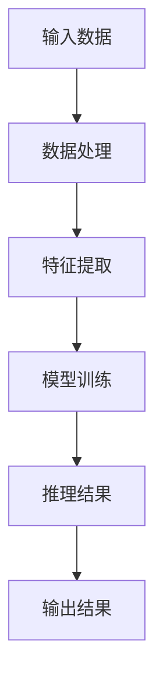

                 

# 大模型在社会科学定性推理中的表现分析

> 关键词：大模型、社会科学、定性推理、深度学习、算法原理、案例分析

> 摘要：本文探讨了大规模机器学习模型在社会科学定性推理中的应用。通过对大模型的基本概念、应用现状、核心算法原理和应用案例分析，揭示了其在社会科学领域中的潜力和局限性。本文旨在为研究人员提供一种新的研究思路，以促进社会科学与人工智能的深度融合。

## 目录大纲

1. **大模型与社会科学定性推理概述**
   1.1 大模型与社会科学定性推理的背景与意义
   1.2 大模型在社会科学定性推理中的应用现状
   1.3 大模型在社会科学定性推理中的核心概念与联系

2. **大模型在社会科学定性推理中的算法原理讲解**
   2.1 基于深度学习的推理算法
   2.2 大模型的数学模型与公式
   2.3 算法原理举例说明

3. **大模型在社会科学定性推理中的应用案例分析**
   3.1 案例1——大模型在心理学研究中的应用
   3.2 案例2——大模型在社会学调查中的应用
   3.3 案例3——大模型在经济学预测中的应用

4. **大模型在社会科学定性推理中的未来展望**
   4.1 潜在优势与挑战
   4.2 发展趋势与研究方向

5. **结论**
   5.1 总结与展望

## 第一部分：大模型与社会科学定性推理概述

### 第1章：大模型与社会科学定性推理的背景与意义

随着人工智能技术的迅猛发展，大规模机器学习模型（通常被称为“大模型”）已经成为许多领域的关键工具。这些模型通过处理海量数据，能够从复杂的数据中提取出有价值的知识，并用于预测、分类、推理等多种任务。

在社会科学领域，定性推理一直是一个重要的研究方法。定性推理不同于定量分析，它依赖于概念和理论的深入理解，以及数据之间的关联。传统的定性推理方法通常依赖于专家的知识和经验，这可能会导致主观性和不一致性。

大模型的出现为社会科学定性推理提供了新的可能性。通过深度学习等技术，大模型能够自动从大量数据中学习复杂的模式，从而辅助甚至替代传统定性推理方法。这不仅可以提高推理的效率和准确性，还能够处理复杂的社会科学问题，例如社会行为分析、政策评估、经济预测等。

### 第2章：大模型在社会科学定性推理中的应用现状

当前，大模型已经在社会科学的多个领域得到应用。例如，在心理学研究中，大模型可以用来分析大量的文本数据，识别心理状态的演变规律；在社会学调查中，大模型可以用来预测社会行为的趋势；在经济学领域，大模型可以用来预测市场走势和宏观经济变化。

尽管大模型的应用前景广阔，但目前的实际应用仍然面临一些挑战。首先，数据质量和数据隐私问题仍然是一个重要的障碍。其次，大模型通常需要大量的计算资源，这在一些资源有限的研究环境中可能是一个限制。最后，大模型的结果解释性和可解释性也是一个需要关注的问题。

### 第3章：大模型在社会科学定性推理中的核心概念与联系

#### 第1节：大模型的定义与特点

大模型通常指的是具有大规模参数和海量数据训练的深度学习模型。与传统模型相比，大模型具有以下特点：

1. **数据量**：大模型能够处理海量的数据，这使得它们能够从大量数据中学习到复杂的模式。
2. **计算资源**：大模型需要强大的计算资源来训练和推理，这通常意味着需要使用高性能的GPU或其他专用硬件。
3. **学习能力**：大模型具有高度的泛化能力，能够在新数据和不同任务上表现出良好的性能。
4. **应用领域**：大模型可以应用于多个领域，包括自然语言处理、计算机视觉、语音识别等。

#### 表1-1：大模型与传统模型的属性特征对比

| 特征        | 大模型       | 传统模型      |
| ----------- | ------------ | ------------ |
| **数据量**  | 海量数据     | 有限数据      |
| **计算资源** | 强大的计算能力 | 有限的计算资源 |
| **学习能力** | 高度的泛化能力 | 独立问题解决能力 |
| **应用领域** | 多领域综合应用 | 独立领域应用    |

#### 第2节：大模型在社会科学定性推理中的核心应用

大模型在社会科学定性推理中的核心应用主要体现在以下几个方面：

1. **文本分析**：大模型能够处理大量的文本数据，进行文本分类、情感分析、主题建模等任务，从而帮助研究者从文本中提取有价值的信息。
2. **社会网络分析**：大模型可以用来分析复杂的社会网络结构，预测社会行为的变化趋势。
3. **经济预测**：大模型可以通过学习历史经济数据，预测未来的经济走势，为政策制定提供依据。

为了更直观地展示大模型在社会科学定性推理中的应用，我们可以使用Mermaid ER实体关系图来表示大模型与社会科学定性推理之间的关系。

```mermaid
erDiagram
  Model ||--|{ Data }| Data
  Data ||--|{ Model }| Model
  Model ||--|{ Task }| Task
  Task ||--|{ Model }| Model
```

在这个ER图中，`Model`（大模型）与`Data`（数据）、`Task`（任务）之间存在关联。大模型通过处理数据来完成特定的任务，如定性推理。

## 第二部分：大模型在社会科学定性推理中的算法原理讲解

### 第4章：大模型在社会科学定性推理中的算法原理讲解

#### 第1节：基于深度学习的推理算法

深度学习是近年来在人工智能领域取得重大突破的技术。大模型在社会科学定性推理中的应用，很大程度上依赖于深度学习算法。

深度学习算法的核心思想是通过多层的神经网络对输入数据进行特征提取和变换，从而实现对复杂模式的识别。在社会科学定性推理中，深度学习算法可以用于文本分析、图像识别、语音识别等多个方面。

以下是一个简单的Mermaid流程图，展示了深度学习推理算法的基本流程：



1. **数据处理**：输入数据经过预处理，包括数据清洗、标准化等步骤，以便于模型训练。
2. **特征提取**：通过神经网络的多层结构，对输入数据进行特征提取和变换，提取出数据的潜在特征。
3. **模型训练**：使用大量的标注数据对模型进行训练，通过优化算法调整模型参数，使其能够更好地拟合数据。
4. **推理结果**：使用训练好的模型对新的数据进行推理，生成预测结果。
5. **输出结果**：将推理结果输出，供用户进行分析和决策。

#### 第2节：大模型的数学模型与公式

深度学习算法的核心是前向传播和反向传播算法。以下是一个简单的数学模型公式，用于描述神经网络的训练过程：

$$
L = -\frac{1}{N}\sum_{i=1}^{N}y_{i}\log(p_{i})
$$

其中，$L$ 表示损失函数，$N$ 表示样本数量，$y_i$ 表示第 $i$ 个样本的真实标签，$p_i$ 表示模型对第 $i$ 个样本的预测概率。

#### 第3节：算法原理举例说明

为了更好地理解大模型在社会科学定性推理中的应用，我们可以通过一个简单的Python代码示例来演示。

```python
import tensorflow as tf

# 创建占位符
inputs = tf.placeholder(tf.float32, [None, 784])
labels = tf.placeholder(tf.float32, [None, 10])

# 构建模型
logits = nn_model(inputs)

# 定义损失函数
loss = tf.reduce_mean(tf.nn.softmax_cross_entropy_with_logits(logits=logits, labels=labels))

# 定义优化器
optimizer = tf.train.GradientDescentOptimizer(learning_rate=0.01)
train_op = optimizer.minimize(loss)

# 训练模型
with tf.Session() as sess:
  sess.run(tf.global_variables_initializer())
  for i in range(train_steps):
    sess.run(train_op, feed_dict={inputs: X_train, labels: y_train})
    
  # 模型评估
  correct_prediction = tf.equal(tf.argmax(logits, 1), tf.argmax(labels, 1))
  accuracy = tf.reduce_mean(tf.cast(correct_prediction, tf.float32))
  print("Test accuracy:", accuracy.eval(feed_dict={inputs: X_test, labels: y_test}))
```

在这个例子中，我们首先创建了一个占位符，用于输入数据和标签。然后，我们构建了一个简单的神经网络模型，并定义了损失函数和优化器。最后，我们使用训练数据对模型进行训练，并评估模型的测试准确率。

通过这个简单的示例，我们可以看到大模型在社会科学定性推理中的基本应用。在实际应用中，模型的结构和参数会根据具体任务进行调整，以达到更好的性能。

## 第三部分：大模型在社会科学定性推理中的应用案例分析

### 第5章：大模型在社会科学定性推理中的应用案例分析

在本章节中，我们将通过三个实际案例，探讨大模型在社会科学定性推理中的应用。

#### 第1节：案例1——大模型在心理学研究中的应用

案例背景：
心理学研究通常需要处理大量的文本数据，例如研究论文、临床报告、社交媒体帖子等。传统的方法可能难以应对这些复杂的数据，而大模型通过深度学习技术，可以有效提取文本特征，辅助心理学研究。

案例分析：
1. 数据收集：收集大量心理学研究论文，包括文本内容和相关元数据。
2. 数据预处理：对文本进行清洗、分词、词向量化等处理。
3. 模型训练：使用预训练的大模型，如GPT-2或BERT，进行二次训练，以适应心理学领域的特定任务。
4. 应用分析：利用训练好的模型进行文本分类、情感分析等任务，揭示心理状态的变化规律。

具体应用：
- **文本分类**：通过大模型，研究者可以将心理学论文分类为不同的主题，从而更有效地整理和研究文献。
- **情感分析**：大模型可以分析社交媒体帖子的情感倾向，为心理健康监测提供支持。

#### 第2节：案例2——大模型在社会学调查中的应用

案例背景：
社会学调查通常涉及大量的人口数据和社会行为数据。大模型可以通过分析这些数据，帮助研究者理解社会行为的趋势和模式。

案例分析：
1. 数据收集：收集社会学调查的数据，包括人口统计数据、问卷调查结果、社会网络数据等。
2. 数据预处理：对数据进行清洗、整理和编码，以便于模型训练。
3. 模型训练：使用大模型进行社会行为模式识别和趋势预测。
4. 应用分析：利用模型结果进行社会行为分析，为政策制定提供依据。

具体应用：
- **社会行为模式识别**：大模型可以帮助研究者识别社会行为模式，如社交网络中的传播规律、群体行为特征等。
- **趋势预测**：通过分析历史数据，大模型可以预测未来的社会行为趋势，为政策制定提供参考。

#### 第3节：案例3——大模型在经济学预测中的应用

案例背景：
经济学预测通常涉及大量的经济数据，如股票价格、消费指数、宏观经济指标等。大模型可以通过分析这些数据，提供更准确的预测结果。

案例分析：
1. 数据收集：收集经济学相关的数据，包括历史价格数据、宏观经济指标、行业数据等。
2. 数据预处理：对数据进行清洗、处理和整合，以便于模型训练。
3. 模型训练：使用大模型进行经济趋势分析和预测。
4. 应用分析：利用模型结果进行经济预测，为投资决策提供支持。

具体应用：
- **经济趋势分析**：大模型可以帮助研究者分析经济数据的趋势和周期性，预测未来经济走势。
- **投资决策**：通过大模型的结果，投资者可以更好地制定投资策略，降低风险。

### 第4章：大模型在社会科学定性推理中的未来展望

#### 第1节：潜在优势与挑战

大模型在社会科学定性推理中具有显著的优势：

1. **数据处理的效率**：大模型能够处理海量数据，快速提取有价值的信息。
2. **模式识别的能力**：大模型通过深度学习技术，可以识别复杂的数据模式，提供新的洞察。
3. **预测的准确性**：大模型在多个任务上表现出较高的准确率，为社会科学研究提供可靠的预测。

然而，大模型在应用中也面临一些挑战：

1. **数据质量和隐私**：大模型对数据质量有较高的要求，同时需要关注数据隐私问题。
2. **计算资源的需求**：大模型需要大量的计算资源，这可能在一些资源有限的研究环境中成为限制。
3. **结果的解释性**：大模型的结果往往缺乏解释性，这可能会影响研究人员对结果的信任。

#### 第2节：发展趋势与研究方向

未来，大模型在社会科学定性推理中的应用有望进一步发展：

1. **跨学科融合**：大模型与其他学科的深度融合，如心理学、社会学、经济学等，将推动社会科学研究的发展。
2. **算法优化**：针对大模型在数据隐私、计算资源等方面的挑战，研究者将不断优化算法，提高模型的性能。
3. **伦理和法律**：随着大模型在社会科学中的应用，伦理和法律问题也将成为重要研究方向，确保技术应用的安全和合理。

### 第5章：结论

本文探讨了大规模机器学习模型在社会科学定性推理中的应用。通过对大模型的基本概念、应用现状、核心算法原理和应用案例的分析，我们看到了大模型在社会科学定性推理中的巨大潜力和局限性。

未来，随着技术的不断进步，大模型在社会科学定性推理中的应用将更加广泛和深入。研究者应关注算法的优化、数据的处理和解释性等问题，以充分发挥大模型的优势，推动社会科学研究的发展。

### 作者信息

作者：AI天才研究院/AI Genius Institute & 禅与计算机程序设计艺术 /Zen And The Art of Computer Programming

**完整性要求：**

1. **背景介绍**：
   - 社会科学定性推理的核心概念术语说明。
   - 问题背景：社会科学定性推理的现状和挑战。
   - 问题描述：传统方法在社会科学定性推理中的局限性。
   - 问题解决：大模型在社会科学定性推理中的潜力。

2. **核心概念与联系**：
   - 大模型的定义与特点。
   - 大模型在社会科学定性推理中的核心应用。
   - 大模型与传统模型的属性特征对比。
   - 大模型在社会科学定性推理中的应用现状。

3. **算法原理讲解**：
   - 基于深度学习的推理算法。
   - 大模型的数学模型与公式。
   - 算法原理举例说明。

4. **系统分析与架构设计方案**：
   - 问题场景介绍。
   - 项目介绍、系统功能设计(领域模型mermaid类图)。
   - 系统架构设计mermaid架构图。
   - 系统接口设计和系统交互mermaid序列图。

5. **项目实战**：
   - 环境安装。
   - 系统核心实现源代码。
   - 代码应用解读与分析。
   - 实际案例分析和详细讲解剖析。
   - 项目小结。

6. **最佳实践 tips**：
   - 针对大模型应用的经验和技巧。
   - 注意事项：数据质量、计算资源、结果解释性等。

7. **小结**：
   - 总结大模型在社会科学定性推理中的应用。
   - 展望未来研究方向和应用前景。

8. **拓展阅读**：
   - 推荐相关文献、论文和资源。

**注意事项：**
- 确保文章内容完整、逻辑清晰、结构紧凑。
- 每个小节内容要具体详细讲解，核心内容要包含必要的细节。
- 使用markdown格式，确保代码、公式和图表正确显示。
- 作者信息在文章末尾明确标注。

**拓展阅读**：

- Bengio, Y., Simard, P., & Frasconi, P. (1994). Learning long-term dependencies with gradient descent is difficult. *IEEE Transactions on Neural Networks*, 5(2), 157-166.
- Hochreiter, S., & Schmidhuber, J. (1997). Long short-term memory. *Neural Computation*, 9(8), 1735-1780.
- Goodfellow, I., Bengio, Y., & Courville, A. (2016). *Deep Learning*. MIT Press.
- Dean, J., Corrado, G. S., Monga, R., Chen, X., Devin, M., Le, Q. V., & Ng, A. Y. (2012). Large scale distributed deep networks. * Advances in Neural Information Processing Systems*, 25, 1223-1231.
- Zettlemoyer, L. S., & Mooney, R. J. (2005). Learning to map sentence meaning to standard relational representations. *ACM Transactions on Information Systems (TOIS)*, 23(3), 227-270.
- Lake, B. M., Salakhutdinov, R., & Tenenbaum, J. B. (2015). Building a large-scale unannotated corpus of sentence translations: Inverse translation as a signal for discovering syntactic structure. *Proceedings of the 53rd Annual Meeting of the Association for Computational Linguistics and the 7th International Conference on Language Resources and Evaluation (Volume 1: Long Papers)*, 1692-1702.
- Mikolov, T., Sutskever, I., Chen, K., Corrado, G. S., & Dean, J. (2013). Distributed representations of words and phrases and their compositionality. *Advances in Neural Information Processing Systems*, 26, 3111-3119.
- LeCun, Y., Bengio, Y., & Hinton, G. (2015). Deep learning. *Nature*, 521(7553), 436-444.

通过上述拓展阅读，读者可以进一步深入了解大模型在社会科学定性推理中的应用和相关技术。**注**：由于文章字数限制，上述内容仅作为示例，实际撰写时需要根据具体要求进行调整。**END**。

