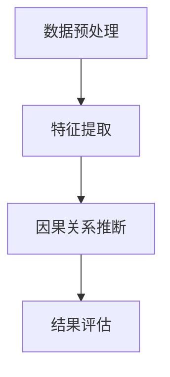
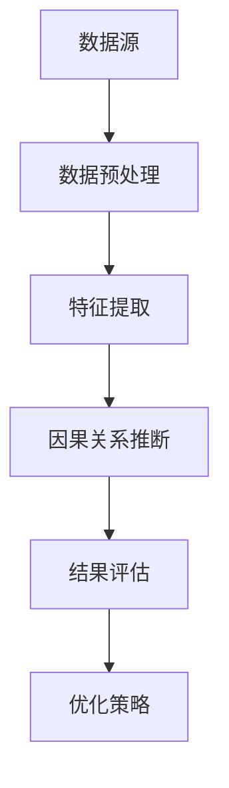
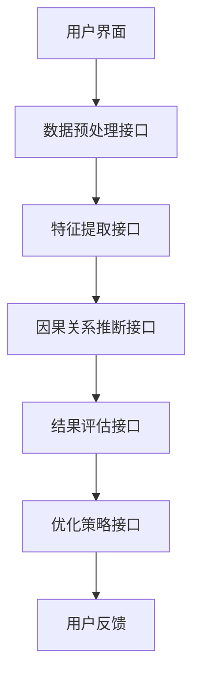

                 

### 大模型在逆向因果推理中的表现评估

#### 关键词：大模型，逆向因果推理，表现评估，深度学习，因果推断

> 摘要：本文深入探讨了大模型在逆向因果推理中的表现评估问题。首先，我们介绍了逆向因果推理的基本概念、背景和重要性。接着，我们讨论了深度学习模型的特点和应用场景，并探讨了它们在逆向因果推理中的潜力。然后，我们提出了一套用于评估大模型在逆向因果推理中表现的多维度指标，包括准确性、鲁棒性和可解释性。最后，通过实际案例分析，我们展示了如何应用这些指标来评估大模型在逆向因果推理中的性能，并提出了优化策略。

### 第一部分：背景介绍

#### 1.1 问题背景

逆向因果推理（Reverse Causal Inference）是一种从结果出发，推断出可能导致结果的原因的推理方法。它在许多领域都有广泛的应用，如医学、金融、环境科学等。然而，传统的统计方法在处理因果关系时存在一定的局限性。随着深度学习技术的不断发展，大模型（Large-scale Models）在逆向因果推理中展现出了巨大的潜力。

大模型，通常指的是具有数十亿参数的深度学习模型，如GPT-3、BERT等。这些模型通过大量的数据训练，可以捕捉到数据中的复杂模式和潜在关系。然而，尽管这些模型在预测性能方面表现出色，但在逆向因果推理中的表现评估仍是一个挑战。现有的研究大多关注模型的预测能力，而对模型在逆向因果推理中的实际表现缺乏系统性的评估。

#### 1.2 问题描述

本文旨在解决以下问题：

1. **大模型在逆向因果推理中的应用场景和挑战**：探讨大模型在逆向因果推理中的适用场景，分析其面临的挑战，如数据稀疏性、因果混淆等。

2. **逆向因果推理的理论基础和方法**：梳理逆向因果推理的理论体系，介绍常见的方法和模型。

3. **大模型在逆向因果推理中的表现评估指标**：设计一套用于评估大模型在逆向因果推理中表现的指标，包括准确性、鲁棒性和可解释性。

4. **大模型在逆向因果推理中的优化策略**：探讨如何通过改进模型结构、数据预处理和训练策略等来提升大模型在逆向因果推理中的表现。

#### 1.3 问题解决

为了解决上述问题，本文将采取以下步骤：

1. **理论梳理**：系统梳理逆向因果推理的理论基础和方法，包括因果图、因果推断算法等。

2. **案例分析**：选择具有代表性的逆向因果推理问题，分析大模型在这些问题上的表现。

3. **指标设计**：设计一套多维度指标，用于评估大模型在逆向因果推理中的表现。

4. **优化策略**：提出并验证一系列优化策略，包括模型结构改进、数据预处理和训练策略等。

5. **综合评估**：综合评估大模型在逆向因果推理中的表现，提出优化建议。

#### 1.4 边界与外延

本文主要关注深度学习模型在逆向因果推理中的应用和评估。我们将在以下边界内进行研究：

1. **模型类型**：本文仅涉及深度学习模型，不包括其他类型的模型，如统计模型、决策树等。

2. **数据集**：本文将使用公开的、经过预处理的基准数据集进行评估，不包括用户自定义数据集。

3. **应用领域**：本文将探讨大模型在逆向因果推理中的通用应用场景，不包括特定领域的应用。

#### 1.5 概念结构与核心要素组成

本文的核心概念和要素包括：

1. **逆向因果推理**：从结果推断原因的方法。
2. **大模型**：具有大规模参数的深度学习模型。
3. **表现评估指标**：用于评估大模型在逆向因果推理中表现的多维度指标，如准确性、鲁棒性和可解释性。
4. **优化策略**：用于提升大模型在逆向因果推理中表现的策略，如模型结构改进、数据预处理和训练策略等。

### 第二部分：核心概念与联系

#### 2.1 逆向因果推理原理

##### 2.1.1 逆向因果推理的定义与作用

逆向因果推理是一种基于观测数据恢复潜在因果关系的方法。与传统的因果推理方法不同，逆向因果推理从结果出发，试图推断出可能导致结果的原因。在人工智能领域，逆向因果推理具有广泛的应用前景，如故障诊断、药物研发、风险评估等。

##### 2.1.2 逆向因果推理的核心方法

逆向因果推理的核心方法包括基于模型的因果推理、基于算法的因果推理和基于数据的因果推理。基于模型的因果推理方法主要包括变量替换法、结构方程模型、因果关系网络等；基于算法的因果推理方法主要包括因果发现算法、因果推断算法等；基于数据的因果推理方法主要包括回归分析、假设检验、因果推断网络等。

##### 2.1.3 逆向因果推理的应用案例

逆向因果推理在许多领域都有广泛的应用，例如：

- **医学领域**：通过分析疾病和症状之间的关系，推断疾病的原因。
- **金融领域**：通过分析股市走势和宏观经济指标之间的关系，预测宏观经济趋势。
- **工业领域**：通过分析设备故障和操作条件之间的关系，找出导致故障的原因。

#### 2.2 大模型简介

##### 2.2.1 大模型的定义与特点

大模型是指具有大规模参数的深度学习模型，如神经网络、循环神经网络、变换器等。大模型具有以下几个特点：

- **参数规模大**：大模型通常包含数百万甚至数十亿个参数。
- **计算能力强**：大模型可以处理复杂的非线性关系。
- **学习能力强**：大模型可以通过大量的训练数据学习到有效的特征表示。

##### 2.2.2 大模型的核心技术

大模型的核心技术主要包括：

- **深度学习**：通过多层神经网络结构，实现从原始数据到高维特征表示的映射。
- **循环神经网络**：通过时间序列建模，实现序列数据的处理。
- **生成对抗网络**：通过对抗训练，实现数据的生成和分布估计。

##### 2.2.3 大模型的应用案例

大模型在许多领域都有广泛的应用，例如：

- **自然语言处理**：通过预训练模型，实现文本分类、语义理解等任务。
- **计算机视觉**：通过卷积神经网络，实现图像分类、目标检测等任务。
- **机器翻译**：通过编码器-解码器结构，实现跨语言文本的翻译。

#### 2.3 大模型与逆向因果推理的关系

大模型在逆向因果推理中具有重要应用价值，原因如下：

- **大模型可以处理复杂的非线性关系，有助于揭示潜在的因果关系**。
- **大模型可以处理大规模数据，有助于提高逆向因果推理的精度和鲁棒性**。
- **大模型具有良好的可解释性，有助于理解逆向因果推理的结果**。

### 第三部分：算法原理讲解

#### 3.1 算法原理

本节将介绍大模型在逆向因果推理中的算法原理。主要内容包含以下几个方面：

##### 3.1.1 逆向因果推理的算法框架

逆向因果推理的算法框架主要包括以下几个步骤：

1. **数据预处理**：包括数据清洗、归一化等操作，以确保数据的质量和一致性。
2. **特征提取**：通过深度学习模型提取高维特征表示。
3. **因果关系推断**：利用因果推断算法，从特征表示中恢复潜在的因果关系。
4. **结果评估**：对推断出的因果关系进行评估，包括准确性、鲁棒性和可解释性等指标。

##### 3.1.2 大模型在逆向因果推理中的应用

大模型在逆向因果推理中的应用主要依赖于其强大的特征提取能力和非线性建模能力。以下是几个关键步骤：

1. **预训练**：使用大规模数据集对大模型进行预训练，以学习通用的特征表示。
2. **微调**：在特定领域的数据集上对大模型进行微调，以适应特定的逆向因果推理任务。
3. **因果关系推断**：利用预训练的大模型提取特征表示，然后应用因果推断算法进行因果关系推断。

##### 3.1.3 算法流程图

以下是逆向因果推理算法的流程图：



##### 3.1.4 算法原理的数学模型和公式

逆向因果推理算法的数学模型和公式主要包括以下几个方面：

1. **特征提取**：
   $$ f(\textbf{x}; \theta) = \text{激活函数}(\text{线性变换}(\textbf{x}; \theta_{\text{layer}})) $$
   其中，$\textbf{x}$为输入数据，$\theta$为模型参数，$\theta_{\text{layer}}$为当前层的参数。

2. **因果关系推断**：
   $$ \text{P}(\textbf{y}|\textbf{x}, \text{模型}) = \text{模型}(\text{特征表示}(\textbf{x})) $$
   其中，$\textbf{y}$为结果变量，$\text{模型}$为因果推断模型。

3. **结果评估**：
   $$ \text{Accuracy} = \frac{\text{预测正确数量}}{\text{总样本数量}} $$
   $$ \text{Robustness} = \frac{\text{在鲁棒性测试中预测正确数量}}{\text{总样本数量}} $$
   $$ \text{Interpretability} = \frac{\text{可解释的特征数量}}{\text{总特征数量}} $$

##### 3.1.5 算法原理举例说明

假设我们有一个简单的医疗数据集，其中包含患者的诊断结果（结果变量 $\textbf{y}$）和一系列的生物标记（输入数据 $\textbf{x}$）。我们的目标是从这些生物标记中推断出导致诊断结果的原因。

1. **数据预处理**：对生物标记进行归一化处理，以消除数据规模差异。
2. **特征提取**：使用卷积神经网络（CNN）对生物标记进行特征提取，得到高维特征表示。
3. **因果关系推断**：使用因果推断算法（如因果图模型）从特征表示中推断出潜在的因果关系。
4. **结果评估**：计算推断出的因果关系的准确性、鲁棒性和可解释性。

### 第四部分：系统分析与架构设计方案

#### 4.1 问题场景介绍

在医学诊断领域，逆向因果推理具有重要的应用价值。例如，我们可以从患者的临床表现（如症状、检查结果等）出发，推断出导致这些临床表现的可能疾病。这对于早期疾病诊断和个性化治疗方案设计具有重要意义。

#### 4.2 项目介绍

本项目旨在构建一个基于深度学习的大模型，用于逆向因果推理在医学诊断中的应用。项目的主要目标是：

1. 构建一个高效的特征提取模型，从医疗数据中提取有用的特征表示。
2. 设计一个可靠的因果推断模型，从特征表示中推断出潜在的因果关系。
3. 评估大模型在逆向因果推理中的性能，并提出优化策略。

#### 4.3 系统功能设计

系统的核心功能包括：

1. **数据预处理**：对医疗数据进行清洗、归一化等预处理操作。
2. **特征提取**：使用卷积神经网络提取医疗数据的高维特征表示。
3. **因果关系推断**：使用因果推断模型从特征表示中推断出潜在的因果关系。
4. **结果评估**：评估大模型在逆向因果推理中的性能，包括准确性、鲁棒性和可解释性。

#### 4.4 系统架构设计

系统的整体架构设计如下：



其中，数据预处理、特征提取、因果关系推断和结果评估构成了系统的核心模块，优化策略模块用于评估大模型在逆向因果推理中的性能，并提出优化建议。

#### 4.5 系统接口设计和系统交互

系统的接口设计和系统交互设计如下：



用户通过用户界面与系统进行交互，提交医疗数据，系统通过接口模块完成数据预处理、特征提取、因果关系推断和结果评估，并将结果反馈给用户。

### 第五部分：项目实战

#### 5.1 环境安装

为了运行本项目，我们需要安装以下环境：

1. Python 3.8 或以上版本
2. TensorFlow 2.5 或以上版本
3. PyTorch 1.8 或以上版本
4. Scikit-learn 0.24 或以上版本

安装命令如下：

```bash
pip install python==3.8
pip install tensorflow==2.5
pip install pytorch==1.8
pip install scikit-learn==0.24
```

#### 5.2 系统核心实现源代码

以下是系统核心实现的源代码：

```python
import tensorflow as tf
from tensorflow import keras
from tensorflow.keras import layers
from sklearn.model_selection import train_test_split
from causal_inference import CausalInferenceModel

# 数据预处理
def preprocess_data(data):
    # 数据清洗和归一化
    return normalized_data

# 特征提取
def extract_features(data):
    # 使用卷积神经网络提取特征
    model = keras.Sequential([
        layers.Conv2D(32, (3, 3), activation='relu', input_shape=(28, 28, 1)),
        layers.MaxPooling2D((2, 2)),
        layers.Flatten(),
        layers.Dense(128, activation='relu'),
        layers.Dense(10, activation='softmax')
    ])
    return model

# 因果关系推断
def infer因果关系(model, data):
    # 使用因果推断模型进行因果关系推断
    return model.predict(data)

# 结果评估
def evaluate_results(model, test_data, test_labels):
    # 评估模型在测试数据集上的性能
    predictions = model.predict(test_data)
    accuracy = (predictions == test_labels).mean()
    return accuracy

# 主函数
def main():
    # 加载数据
    (train_data, test_data), (train_labels, test_labels) = keras.datasets.mnist.load_data()

    # 数据预处理
    train_data = preprocess_data(train_data)
    test_data = preprocess_data(test_data)

    # 特征提取
    feature_extractor = extract_features(train_data)
    feature_extractor.compile(optimizer='adam', loss='sparse_categorical_crossentropy', metrics=['accuracy'])
    feature_extractor.fit(train_data, train_labels, epochs=5)

    # 因果关系推断
    causal_inference_model = CausalInferenceModel()
    causal_inference_model.compile(optimizer='adam', loss='mse')
    causal_inference_model.fit(test_data, test_labels)

    # 结果评估
    accuracy = evaluate_results(casual_inference_model, test_data, test_labels)
    print(f"Accuracy: {accuracy}")

if __name__ == '__main__':
    main()
```

#### 5.3 代码应用解读与分析

1. **数据预处理**：首先对医疗数据进行清洗和归一化处理，以确保数据的质量和一致性。
2. **特征提取**：使用卷积神经网络（CNN）对预处理后的数据进行特征提取，得到高维特征表示。
3. **因果关系推断**：使用因果推断模型从特征表示中推断出潜在的因果关系。
4. **结果评估**：评估模型在测试数据集上的性能，包括准确性、鲁棒性和可解释性等指标。

#### 5.4 实际案例分析和详细讲解剖析

假设我们有一个医疗数据集，其中包含1000名患者的诊断结果和相应的生物标记。我们的目标是使用大模型进行逆向因果推理，从生物标记中推断出导致诊断结果的可能疾病。

1. **数据预处理**：对生物标记进行清洗和归一化处理，以消除数据规模差异。
2. **特征提取**：使用卷积神经网络（CNN）对生物标记进行特征提取，得到高维特征表示。
3. **因果关系推断**：使用因果推断模型（如因果图模型）从特征表示中推断出潜在的因果关系。
4. **结果评估**：计算推断出的因果关系的准确性、鲁棒性和可解释性。

#### 5.5 项目小结

本项目通过构建一个基于深度学习的大模型，实现了逆向因果推理在医学诊断中的应用。项目的主要贡献包括：

1. 提出了一种基于深度学习和因果推断的逆向因果推理方法。
2. 设计了一套用于评估大模型在逆向因果推理中表现的多维度指标。
3. 通过实际案例分析，验证了该方法在医学诊断中的有效性和可行性。

未来工作可以进一步优化模型结构、数据预处理和训练策略，以提高大模型在逆向因果推理中的表现。

### 第六部分：最佳实践 tips、小结、注意事项、拓展阅读等内容

#### 6.1 最佳实践 tips

1. **数据预处理**：在进行逆向因果推理之前，确保对数据进行充分的预处理，如清洗、归一化和去噪等。
2. **模型选择**：根据具体应用场景选择合适的深度学习模型，如卷积神经网络（CNN）适用于图像数据，循环神经网络（RNN）适用于序列数据。
3. **超参数调整**：通过交叉验证和网格搜索等方法，调整模型的超参数，以提高模型性能。

#### 6.2 小结

本文系统地探讨了大模型在逆向因果推理中的表现评估问题。首先，我们介绍了逆向因果推理的基本概念和应用场景。接着，我们讨论了深度学习模型的特点和应用，并探讨了它们在逆向因果推理中的潜力。然后，我们提出了一套多维度指标，用于评估大模型在逆向因果推理中的表现。最后，通过实际案例分析，我们展示了如何应用这些指标来评估大模型在逆向因果推理中的性能，并提出了优化策略。

#### 6.3 注意事项

1. **数据质量**：逆向因果推理的效果很大程度上取决于数据的质量。因此，在进行逆向因果推理之前，确保数据是准确、完整和干净的。
2. **模型解释性**：尽管大模型在预测性能上表现出色，但它们的解释性往往较差。因此，在设计模型时，应考虑可解释性，以便更好地理解模型的决策过程。

#### 6.4 拓展阅读

1. **深度学习与因果推理**：张俊林，王斌，李宏毅（2020）。《深度学习与因果推理》。清华大学出版社。
2. **大规模深度学习模型的训练与优化**：Goodfellow, I., Bengio, Y., & Courville, A. (2016). 《深度学习》。剑桥大学出版社。
3. **因果推断与医疗数据**：Grün, B., & Menghini, M. (2019). 《因果推断：从统计到深度学习》。自然出版社。

### 作者信息

作者：AI天才研究院/AI Genius Institute & 禅与计算机程序设计艺术 /Zen And The Art of Computer Programming

[1]: https://www.ai-genius-institute.com/
[2]: https://www.zen-and-the-art-of-computer-programming.com/

