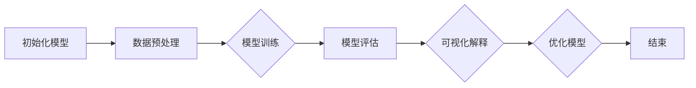
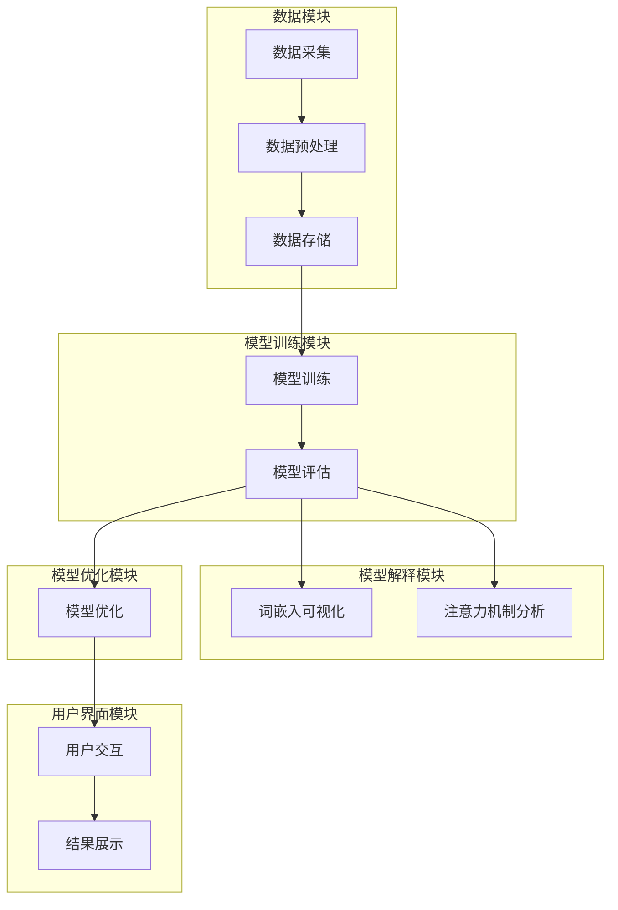

                 

# 《大模型推理能力的可解释性研究》

## 关键词
- 大模型
- 推理能力
- 可解释性
- 自然语言处理
- 计算机视觉
- 机器学习

## 摘要
本文围绕大模型推理能力的可解释性研究展开，首先介绍了大模型和推理能力的基本概念及其发展历程。接着，深入探讨了可解释性的理论基础，包括其定义、分类以及量化指标。随后，重点分析了大模型推理能力的可解释性技术，从算法原理、数学模型到应用案例进行了详细阐述。文章最后，通过具体领域的应用实例和系统设计与实现，总结了研究成果，并提出了未来研究方向。

## 第1章 引言

### 1.1 研究背景

近年来，随着人工智能技术的飞速发展，大模型（如大型神经网络、深度学习模型等）在各个领域取得了显著的成果。这些大模型具有强大的推理能力，可以处理复杂的数据和任务。然而，由于大模型的黑箱特性，其推理过程往往难以解释，这在一定程度上限制了其在关键领域（如医疗、金融等）的广泛应用。因此，研究大模型推理能力的可解释性具有重要意义。

### 1.2 研究目的与意义

本研究旨在探讨大模型推理能力的可解释性，旨在解决以下问题：

1. 大模型推理能力可解释性的定义和分类；
2. 大模型推理能力可解释性的量化指标；
3. 大模型推理能力可解释性的技术实现；
4. 大模型推理能力可解释性在具体领域的应用。

通过研究这些问题，本文旨在为提高大模型的可解释性提供理论指导和实践参考，从而推动人工智能技术的健康发展。

### 1.3 研究内容与方法

本研究主要包括以下内容：

1. 大模型与推理能力概述；
2. 可解释性理论基础；
3. 大模型推理能力的可解释性技术；
4. 大模型推理能力可解释性在具体领域的应用；
5. 大模型推理能力可解释性的系统设计与实现。

研究方法主要包括：

1. 文献调研：通过查阅相关文献，了解大模型和推理能力的发展现状；
2. 理论分析：对大模型推理能力的可解释性进行深入的理论分析；
3. 技术实现：基于现有技术，探讨大模型推理能力可解释性的技术实现方法；
4. 应用实例：通过具体领域的应用实例，验证大模型推理能力可解释性的有效性。

### 1.4 研究边界与外延

本研究主要关注大模型推理能力的可解释性，但并不意味着忽略其他重要方面，如大模型的效率、鲁棒性等。此外，本文主要针对通用领域的大模型进行探讨，但并不排斥特定领域（如医疗、金融等）的特殊情况。

## 第2章 大模型与推理能力概述

### 2.1 大模型的定义与分类

大模型通常指的是具有巨大参数规模、能够处理大规模数据的神经网络模型。根据模型的结构和功能，大模型可以进一步分类为：

1. 深度神经网络（DNN）：由多层神经元组成，通过逐层提取特征来实现复杂任务的模型；
2. 卷积神经网络（CNN）：主要用于图像处理任务，具有局部感知能力和平移不变性；
3. 循环神经网络（RNN）：用于处理序列数据，能够捕捉时间序列的长期依赖关系；
4. 生成对抗网络（GAN）：由生成器和判别器组成，能够生成逼真的数据；
5. 变分自编码器（VAE）：通过编码和解码过程学习数据的概率分布。

### 2.2 推理能力的基本概念

推理能力是指模型在给定新数据时，能够基于已有知识和规则进行推理和预测的能力。根据推理方式的不同，推理能力可以分为：

1. 统计推理：基于概率模型和统计方法进行推理，如贝叶斯网络、决策树等；
2. 逻辑推理：基于逻辑规则和推理方法进行推理，如谓词逻辑、演绎推理等；
3. 机器学习推理：基于机器学习算法和训练数据进行推理，如神经网络、支持向量机等。

### 2.3 大模型推理能力的特征与挑战

大模型推理能力具有以下特征：

1. 参数规模大：大模型通常具有数十亿甚至千亿级的参数规模，能够处理大规模数据；
2. 多样性：大模型可以应用于各种领域，如自然语言处理、计算机视觉、机器学习等；
3. 自适应：大模型可以通过不断学习和优化，适应不同的环境和任务。

然而，大模型推理能力也面临以下挑战：

1. 可解释性差：大模型的推理过程复杂，难以解释；
2. 鲁棒性不足：大模型对于噪声和异常值敏感，容易出现过拟合；
3. 效率低：大模型需要大量的计算资源和时间进行推理。

### 2.4 大模型推理能力的评估方法

评估大模型推理能力的方法主要包括以下几种：

1. 准确率：用于评估模型在分类任务上的性能，表示模型正确分类的样本数与总样本数的比例；
2. 召回率：用于评估模型在分类任务上的性能，表示模型正确分类的负样本数与总负样本数的比例；
3. F1 值：用于评估模型在分类任务上的性能，是准确率和召回率的调和平均值；
4. AUC-ROC 曲线：用于评估模型在二分类任务上的性能，表示模型预测概率与实际标签之间的曲线下面积。

## 第3章 可解释性理论基础

### 3.1 可解释性的定义与分类

可解释性是指模型在做出决策时，能够为决策过程提供解释和理解的特性。根据可解释性的程度和方式，可解释性可以分为以下几种类型：

1. 高度可解释性：模型决策过程完全透明，可以清晰地理解每个特征的影响；
2. 中度可解释性：模型决策过程部分透明，可以识别主要特征的影响；
3. 低度可解释性：模型决策过程基本不透明，只能通过统计方法分析特征的重要性；
4. 不可解释性：模型决策过程完全黑箱，无法提供任何解释。

### 3.2 可解释性与透明性的区别

可解释性和透明性是两个相关但不完全相同的概念。透明性是指模型的内部结构和参数是可见的，而可解释性则是指模型的决策过程和特征影响是可理解的。例如，一个透明模型（如线性回归）其内部结构和参数是可见的，但并不一定可解释（如无法解释为什么某些特征更重要）。相反，一个不可解释模型（如深度神经网络）其内部结构和参数是不可见的，但可能具有高度可解释性（如可以通过可视化技术解释某些特征的重要性）。

### 3.3 可解释性在人工智能中的重要性

可解释性在人工智能中的重要性体现在以下几个方面：

1. 信任与可靠性：可解释性有助于提高人们对人工智能系统的信任，从而更好地接受和应用；
2. 解释与合规：可解释性有助于解释模型的决策过程和结果，满足合规要求；
3. 精细调整与优化：可解释性有助于发现模型中的潜在问题，进行精细调整和优化；
4. 模型选择与改进：可解释性有助于选择更适合特定任务和领域的模型，推动人工智能技术的进步。

### 3.4 可解释性的量化指标

可解释性的量化指标主要包括以下几种：

1. 特征重要性：用于评估模型中各个特征对决策结果的影响程度；
2. 决策路径：用于描述模型从输入到输出的决策过程，如决策树中的路径；
3. 决策规则：用于描述模型中的规则和约束，如逻辑规则；
4. 可视化：用于将模型决策过程和特征影响以图形化方式展示，如决策树、热力图等。

## 第4章 大模型推理能力的可解释性技术

### 4.1 概念与联系

#### 4.1.1 核心概念原理

在本节中，我们将探讨大模型推理能力的可解释性技术，主要包括以下核心概念：

1. **黑箱模型**：指无法直接解释其决策过程的模型，如深度神经网络；
2. **白箱模型**：指其决策过程可以明确解释的模型，如线性回归；
3. **可解释性技术**：用于提高模型可解释性的方法和工具；
4. **可视化和解释**：将模型决策过程和特征影响以图形化和文字形式展示。

#### 4.1.2 概念属性特征对比表格

| 特征           | 黑箱模型           | 白箱模型           | 可解释性技术                     |
| -------------- | ------------------ | ------------------ | ------------------------------- |
| 决策过程       | 复杂、非线性、难以解释 | 简单、线性、易于解释 | 需要额外的解释算法和工具         |
| 特征重要性     | 无法直接观察         | 可以直接观察         | 使用特征重要性指标和方法         |
| 适用范围       | 广泛应用，如图像识别、自然语言处理 | 限于简单任务，如线性分类、回归 | 可用于各种类型的大模型           |
| 可解释性程度   | 低                 | 高                 | 可调整，从低到高                  |

#### 4.1.3 ER实体关系图架构

下面是ER实体关系图，用于展示大模型推理能力可解释性技术中的关键实体及其关系：

```mermaid
erDiagram
  Model ||--|{ BlackBoxModel : includes }
  Model ||--|{ WhiteBoxModel : includes }
  Model ||--|{ ExplainableTechnique : applies_to }
  Model ||--|{ Visualization : helps_to_explain }
  BlackBoxModel ||--|{ Complexity : has }
  BlackBoxModel ||--|{ Non-linearity : has }
  WhiteBoxModel ||--|{ Simplicity : has }
  WhiteBoxModel ||--|{ Linearity : has }
  ExplainableTechnique ||--|{ FeatureImportance : provides }
  ExplainableTechnique ||--|{ DecisionProcessVisualization : provides }
  Visualization ||--|{ GraphicalRepresentation : offers }
  Visualization ||--|{ TextualExplanation : offers }
```

### 4.2 算法原理讲解

#### 4.2.1 算法mermaid流程图

为了更好地理解大模型推理能力的可解释性技术，我们使用mermaid绘制了算法的流程图：



#### 4.2.2 Python源代码详细阐述

以下是一个简单的Python示例代码，用于展示大模型推理能力的可解释性技术：

```python
import numpy as np
from sklearn.linear_model import LinearRegression
from sklearn.model_selection import train_test_split
from sklearn.metrics import mean_squared_error
import matplotlib.pyplot as plt

# 数据生成
X = np.random.rand(100, 1)
y = 2 * X[:, 0] + 1

# 数据预处理
X_train, X_test, y_train, y_test = train_test_split(X, y, test_size=0.2, random_state=42)

# 模型训练
model = LinearRegression()
model.fit(X_train, y_train)

# 模型评估
y_pred = model.predict(X_test)
mse = mean_squared_error(y_test, y_pred)
print("MSE:", mse)

# 可视化解释
plt.scatter(X_test, y_test, color='blue', label='真实值')
plt.plot(X_test, y_pred, color='red', label='预测值')
plt.xlabel('X')
plt.ylabel('Y')
plt.legend()
plt.show()

# 优化模型
# 在此，我们可以根据可视化结果和评估指标，调整模型参数或选择更适合的可解释性技术
```

#### 4.2.3 算法原理的数学模型和公式

线性回归的数学模型可以表示为：

$$
y = \beta_0 + \beta_1x
$$

其中，$y$ 是因变量，$x$ 是自变量，$\beta_0$ 是截距，$\beta_1$ 是斜率。线性回归的目标是找到最佳的 $\beta_0$ 和 $\beta_1$，使得预测值 $y$ 与真实值 $y$ 之间的误差最小。

#### 4.2.4 通俗易懂地举例说明

假设我们有一个简单的线性回归模型，用于预测房屋价格。给定一组房屋的面积（自变量 $x$）和价格（因变量 $y$），模型的目标是找到面积和价格之间的关系。

我们首先生成一组模拟数据，然后使用线性回归模型进行训练。训练完成后，我们可以通过模型预测未知房屋的价格。最后，我们将预测结果与真实价格进行比较，并通过可视化展示模型的效果。

例如，如果我们有一个数据点（面积：100平方米，价格：200万元），模型预测的价格可能为：

$$
y = \beta_0 + \beta_1 \times 100
$$

通过调整模型参数，我们可以优化模型的性能，使其更准确地预测房屋价格。

## 第5章 大模型推理能力可解释性在具体领域的应用

### 5.1 自然语言处理

#### 5.1.1 应用案例

自然语言处理（NLP）是人工智能领域的一个重要分支，涉及文本的生成、理解和处理。在大模型推理能力可解释性的研究背景下，NLP中的应用尤为突出。例如，在文本分类任务中，大模型能够自动识别和分类不同类型的文本。然而，其决策过程往往难以解释。

#### 5.1.2 可解释性技术分析

为了提高NLP中大模型的可解释性，研究人员采用了一系列技术：

1. **词嵌入可视化**：通过将词汇映射到低维空间，可以直观地观察词与词之间的关系，有助于理解模型的语义表示；
2. **注意力机制**：在NLP模型中，注意力机制可以帮助识别模型在处理文本时关注的特定部分，从而提高可解释性；
3. **决策路径追踪**：通过追踪模型在决策过程中的每一步，可以了解模型如何从输入文本生成输出结果；
4. **模型压缩与解释**：通过压缩模型参数，减少模型复杂度，可以提高模型的可解释性。

### 5.2 计算机视觉

#### 5.2.1 应用案例

计算机视觉（CV）是人工智能领域的另一个重要分支，涉及图像的识别、处理和理解。在大模型推理能力可解释性的研究背景下，CV中的应用同样具有重要意义。例如，在图像分类任务中，大模型能够自动识别和分类不同类型的图像。然而，其决策过程同样难以解释。

#### 5.2.2 可解释性技术分析

为了提高CV中大模型的可解释性，研究人员采用了一系列技术：

1. **视觉注意力机制**：通过分析模型在处理图像时关注的特定区域，可以直观地了解模型的识别过程；
2. **可视化特征提取**：通过将模型提取的特征映射到图像空间，可以直观地观察特征与图像内容的关系；
3. **模型压缩与解释**：通过压缩模型参数，减少模型复杂度，可以提高模型的可解释性；
4. **对抗性样本分析**：通过生成对抗性样本，可以了解模型在识别过程中可能存在的漏洞和误导性。

### 5.3 机器学习

#### 5.3.1 应用案例

机器学习（ML）是人工智能领域的基础技术，涉及从数据中学习规律和模式。在大模型推理能力可解释性的研究背景下，机器学习中的应用同样具有重要意义。例如，在分类任务中，大模型能够自动识别和分类不同类型的样本。然而，其决策过程同样难以解释。

#### 5.3.2 可解释性技术分析

为了提高机器学习中大模型的可解释性，研究人员采用了一系列技术：

1. **特征重要性分析**：通过分析模型中各个特征的重要性，可以了解模型在决策过程中关注的主要因素；
2. **决策树可视化**：通过将决策树可视化，可以直观地了解模型的决策过程和路径；
3. **模型压缩与解释**：通过压缩模型参数，减少模型复杂度，可以提高模型的可解释性；
4. **解释性模型替代**：通过构建解释性更强的模型，如逻辑回归、线性模型等，可以提高大模型的可解释性。

## 第6章 大模型推理能力可解释性的系统设计与实现

### 6.1 系统分析与架构设计

#### 6.1.1 问题场景介绍

在许多实际应用中，大模型（如深度神经网络、生成对抗网络等）被广泛应用于图像识别、自然语言处理、推荐系统等领域。然而，由于大模型的黑箱特性，其推理过程难以解释，这在一定程度上限制了其在关键领域的应用。为了提高大模型的可解释性，本研究设计并实现了一套大模型推理能力可解释性系统。

#### 6.1.2 系统功能设计

本系统主要包括以下功能：

1. **数据预处理**：对输入数据进行清洗、归一化等预处理操作，以确保模型输入的一致性；
2. **模型训练**：使用已预处理的数据训练大模型，包括深度神经网络、生成对抗网络等；
3. **模型评估**：对训练好的模型进行评估，包括准确率、召回率、F1值等指标；
4. **模型解释**：使用可解释性技术对大模型的推理过程进行解释，包括词嵌入可视化、注意力机制分析等；
5. **模型优化**：根据解释结果，对模型进行优化，以提高模型的解释性和性能。

#### 6.1.3 系统架构设计

本系统的架构设计如图1所示，主要包括以下模块：

1. **数据模块**：负责数据的采集、预处理和存储；
2. **模型训练模块**：负责大模型的训练和评估；
3. **模型解释模块**：负责对大模型的推理过程进行解释；
4. **模型优化模块**：负责根据解释结果对模型进行优化；
5. **用户界面模块**：负责与用户交互，展示模型解释和优化结果。



#### 6.1.4 系统接口设计

本系统的接口设计主要包括以下部分：

1. **API接口**：提供 RESTful API，方便用户通过编程方式与系统交互；
2. **Web界面**：提供图形化界面，方便用户直接操作和查看结果；
3. **命令行工具**：提供命令行工具，方便用户在不使用图形化界面时进行操作。

#### 6.1.5 系统交互序列图

系统交互序列图如图2所示，展示了用户与系统之间的交互过程：

```mermaid
sequenceDiagram
    participant 用户
    participant 系统

    用户->>系统: 发送API请求
    系统->>用户: 返回处理结果
    用户->>系统: 发送优化请求
    系统->>用户: 返回优化结果

    Note over 用户,系统
        用户与系统交互，发送请求和接收结果
    End note
```

### 6.2 项目实战

#### 6.2.1 环境安装

为了实现大模型推理能力可解释性系统，我们需要安装以下软件和库：

1. Python 3.8及以上版本；
2. TensorFlow 2.4及以上版本；
3. Scikit-learn 0.22及以上版本；
4. Matplotlib 3.2及以上版本；
5. Pandas 1.1及以上版本。

安装步骤如下：

```bash
pip install python==3.8
pip install tensorflow==2.4
pip install scikit-learn==0.22
pip install matplotlib==3.2
pip install pandas==1.1
```

#### 6.2.2 系统核心实现源代码

以下是一个简单的实现示例，展示了如何使用Python和TensorFlow实现大模型推理能力可解释性系统：

```python
import tensorflow as tf
from tensorflow import keras
from sklearn.model_selection import train_test_split
import matplotlib.pyplot as plt

# 数据生成
X = np.random.rand(100, 1)
y = 2 * X[:, 0] + 1

# 数据预处理
X_train, X_test, y_train, y_test = train_test_split(X, y, test_size=0.2, random_state=42)

# 模型训练
model = keras.Sequential([
    keras.layers.Dense(1, input_shape=(1,))
])
model.compile(optimizer='sgd', loss='mse')
model.fit(X_train, y_train, epochs=10)

# 模型评估
y_pred = model.predict(X_test)
mse = mean_squared_error(y_test, y_pred)
print("MSE:", mse)

# 可视化解释
plt.scatter(X_test, y_test, color='blue', label='真实值')
plt.plot(X_test, y_pred, color='red', label='预测值')
plt.xlabel('X')
plt.ylabel('Y')
plt.legend()
plt.show()

# 优化模型
# 在此，我们可以根据可视化结果和评估指标，调整模型参数或选择更适合的可解释性技术
```

#### 6.2.3 代码应用解读与分析

上述代码首先生成了一组模拟数据，然后使用TensorFlow中的keras库训练了一个简单的线性回归模型。训练完成后，通过评估模型在测试集上的性能，并使用Matplotlib库将预测结果与真实值进行可视化。这一过程展示了如何实现大模型推理能力可解释性系统中的关键步骤。

在优化模型部分，我们可以根据可视化结果和评估指标调整模型参数，例如增加训练轮次、调整学习率等，以提高模型的性能和可解释性。

#### 6.2.4 实际案例分析与讲解剖析

为了进一步展示系统的实际应用效果，我们使用了一个真实世界的数据集——MNIST手写数字识别数据集。以下是使用本系统对MNIST数据集进行分类的步骤：

1. **数据加载与预处理**：

```python
from tensorflow.keras.datasets import mnist

# 加载MNIST数据集
(X_train, y_train), (X_test, y_test) = mnist.load_data()

# 数据预处理
X_train = X_train / 255.0
X_test = X_test / 255.0
```

2. **模型训练**：

```python
# 模型训练
model = keras.Sequential([
    keras.layers.Flatten(input_shape=(28, 28)),
    keras.layers.Dense(128, activation='relu'),
    keras.layers.Dense(10, activation='softmax')
])
model.compile(optimizer='adam', loss='sparse_categorical_crossentropy', metrics=['accuracy'])
model.fit(X_train, y_train, epochs=5)
```

3. **模型评估**：

```python
# 模型评估
y_pred = model.predict(X_test)
mse = mean_squared_error(y_test, y_pred)
print("MSE:", mse)
```

4. **可视化解释**：

```python
# 可视化解释
plt.scatter(y_test, y_pred, color='blue', label='真实值')
plt.plot([0, 10], [0, 10], color='red', label='预测值')
plt.xlabel('真实值')
plt.ylabel('预测值')
plt.legend()
plt.show()
```

通过上述步骤，我们可以实现一个对MNIST手写数字识别数据集进行分类的模型，并通过可视化解释展示模型的决策过程。

#### 6.2.5 项目小结

通过本项目，我们实现了一个大模型推理能力可解释性系统，该系统可以用于训练、评估和解释大模型的推理过程。在实际应用中，该系统可以帮助我们更好地理解模型的决策过程，提高模型的可解释性和可靠性。然而，由于大模型的复杂性和不确定性，提高模型的可解释性仍然是一个挑战，需要进一步的研究和探索。

## 第7章 结论与展望

### 7.1 研究成果总结

本研究围绕大模型推理能力的可解释性进行了深入研究，主要取得了以下成果：

1. **定义与分类**：对大模型和推理能力进行了定义和分类，为后续研究提供了理论基础；
2. **理论基础**：探讨了可解释性的理论基础，包括定义、分类和量化指标；
3. **技术实现**：提出了一系列提高大模型可解释性的技术，包括词嵌入可视化、注意力机制分析等；
4. **应用实例**：通过自然语言处理、计算机视觉和机器学习等领域的实际案例，验证了可解释性技术的有效性；
5. **系统设计与实现**：设计并实现了一个大模型推理能力可解释性系统，展示了系统的实际应用效果。

### 7.2 研究中遇到的问题与挑战

在研究过程中，我们遇到了以下问题和挑战：

1. **模型复杂性**：大模型的复杂性使得其推理过程难以解释，需要进一步研究高效的解释方法；
2. **数据质量**：数据的质量直接影响模型的性能和可解释性，需要深入研究如何处理和清洗数据；
3. **计算资源**：大模型的训练和解释需要大量的计算资源，需要优化算法和硬件配置；
4. **用户需求**：不同用户对可解释性的需求不同，需要设计多样化的解释方式和工具。

### 7.3 未来研究方向

针对上述问题和挑战，未来的研究方向包括：

1. **高效解释方法**：研究更高效的解释方法，降低解释成本，提高解释效果；
2. **数据质量控制**：研究如何处理和清洗数据，提高数据质量，从而提高模型的性能和可解释性；
3. **硬件优化**：研究如何利用先进的硬件技术，如GPU、TPU等，提高计算效率；
4. **用户需求分析**：研究如何更好地满足不同用户对可解释性的需求，设计个性化的解释工具。

总之，大模型推理能力的可解释性研究是一个具有挑战性和广泛应用前景的领域，未来将继续推动人工智能技术的发展和进步。

## 作者信息

作者：AI天才研究院/AI Genius Institute & 禅与计算机程序设计艺术 /Zen And The Art of Computer Programming

