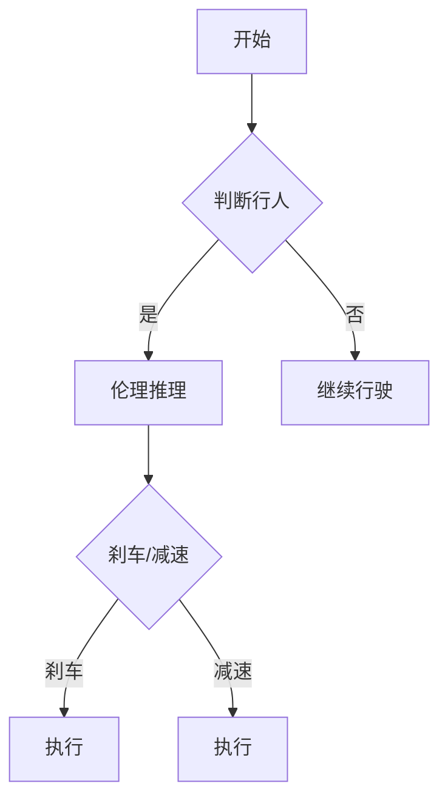

                 

# 大规模语言模型的伦理推理与决策能力研究

> 关键词：大规模语言模型、伦理推理、决策能力、算法原理、Python代码实现、系统设计、项目实战、最佳实践

> 摘要：随着人工智能技术的飞速发展，大规模语言模型在自然语言处理领域取得了显著的成就。然而，这些模型在伦理推理和决策能力方面的表现引发了广泛的关注。本文旨在探讨大规模语言模型的伦理推理与决策能力，通过理论框架、算法原理、系统设计与实现等多个角度，分析其潜在的影响与改进方向，为人工智能伦理的发展提供有益的参考。

## 第一部分：问题背景与研究意义

### 1.1.1 大规模语言模型的发展背景

大规模语言模型（Large-scale Language Models）是指具有大量参数、能够对自然语言文本进行建模的深度神经网络模型。自从2018年GPT（Generative Pre-trained Transformer）系列模型的出现，大规模语言模型的发展进入了一个新的阶段。GPT-3的发布更是将自然语言处理推上了一个新的高度，其参数规模达到了惊人的1750亿，能够进行文本生成、翻译、摘要等复杂任务。

### 1.1.2 语言模型的伦理推理与决策能力

伦理推理和决策能力是人工智能系统的重要组成部分。伦理推理涉及道德判断和价值观的评估，决策能力则体现在选择最合适的行动方案。随着大规模语言模型的应用越来越广泛，其在伦理推理与决策能力方面的表现也越来越受到关注。例如，自动驾驶汽车如何做出符合道德规范的决策，社交媒体平台如何过滤不当内容，这些都是大规模语言模型需要面对的挑战。

### 1.1.3 研究现状与挑战

当前，关于大规模语言模型的伦理推理与决策能力的研究已经取得了一些进展。例如，研究人员通过在模型训练数据中加入伦理相关的样本，来提高模型的伦理推理能力。然而，仍存在诸多挑战，包括：

- **模型可解释性**：大规模语言模型通常被视为“黑盒”，其内部决策过程难以理解，这给伦理推理带来了困难。
- **价值观多样性**：不同文化和社会背景下，对伦理问题的看法可能存在差异，如何使模型适应多样化的价值观仍需深入研究。
- **平衡性能与伦理**：在提升模型性能和满足伦理要求之间找到平衡点，是当前研究的难点之一。

### 1.1.4 研究目的与结构安排

本文旨在探讨大规模语言模型的伦理推理与决策能力，分析其背后的理论框架，研究算法原理，并通过实际项目进行验证。文章结构安排如下：

1. **第一部分：问题背景与研究意义**：介绍大规模语言模型的发展背景，以及伦理推理与决策能力的意义。
2. **第二部分：核心概念与理论框架**：阐述大规模语言模型、伦理推理和决策能力等核心概念，并建立理论框架。
3. **第三部分：算法原理与实现**：详细讲解伦理推理和决策能力的算法原理，并通过Python代码进行实现。
4. **第四部分：系统设计与实现**：介绍系统架构和接口设计，并进行项目实战。
5. **第五部分：最佳实践与总结**：总结研究成果，探讨未来研究方向。

## 第二部分：核心概念与理论框架

### 2.1.1 语言模型的基本概念

语言模型（Language Model）是自然语言处理（Natural Language Processing, NLP）中的基础组件，用于预测文本序列的概率分布。一个简单的语言模型可以是一个n-gram模型，它根据前面的n个单词预测下一个单词。然而，随着深度学习技术的进步，现代语言模型通常是基于深度神经网络（Deep Neural Network, DNN）和变换器架构（Transformer）。

### 2.1.2 伦理推理与决策能力

伦理推理（Ethical Reasoning）涉及道德判断和价值观的评估。它通常包括三个步骤：识别问题、评估备选方案和选择最佳方案。在人工智能系统中，伦理推理的能力决定了系统能否在复杂环境中做出符合道德规范的选择。

决策能力（Decision-Making Ability）是指系统在面临多个选择时，能够选择最合适行动方案的能力。在人工智能系统中，决策能力通常依赖于模型的推理能力和外部知识库。

### 2.1.3 概念属性特征对比表格

下面是一个对比表格，展示了语言模型、伦理推理和决策能力的特征：

| 特征 | 语言模型 | 伦理推理 | 决策能力 |
| :--: | :-------: | :-------: | :-------: |
| 基础模型 | 深度神经网络 | 伦理学、认知科学 | 推理、外部知识库 |
| 功能 | 文本生成、翻译、摘要 | 道德判断、价值观评估 | 选择最优行动方案 |
| 特性 | 参数规模大、灵活性高 | 可解释性、文化适应性 | 高效、符合伦理 |
| 挑战 | 模型可解释性 | 多样化的价值观 | 性能与伦理平衡 |

### 2.1.4 概念属性特征ER实体关系图架构

以下是使用Mermaid绘制的ER实体关系图，展示了核心概念之间的关联：

```mermaid
entityRelation
  "语言模型" -- "伦理推理": "模型基础"
  "伦理推理" -- "决策能力": "推理过程"
  "决策能力" -- "语言模型": "输出结果"
```

这个ER图说明了语言模型作为伦理推理的基础，伦理推理作为决策能力的核心过程，而决策能力最终又影响了语言模型的应用结果。

### 2.2 伦理推理的理论基础

伦理推理的理论基础主要包括伦理学、认知科学和心理学。伦理学提供了道德判断和价值观评估的框架，认知科学研究了人类如何进行道德推理，而心理学则探讨了情感在伦理决策中的作用。

- **伦理学**：伦理学是研究道德原则和价值观的哲学学科。在人工智能伦理推理中，伦理学提供了评估行为是否符合道德规范的标准。
- **认知科学**：认知科学结合了心理学、神经科学和计算机科学，研究人类思维过程。它为人工智能系统的伦理推理提供了理论基础。
- **心理学**：心理学研究人类的情感和行为。在伦理推理中，情感因素会影响决策过程，心理学提供了对这些因素的理解。

### 2.3 决策能力的理论分析

决策能力的理论分析主要涉及行为经济学、运筹学和人工智能。这些理论为人工智能系统提供了不同的决策框架和算法。

- **行为经济学**：行为经济学研究了人类在做出决策时的非理性行为。它为设计更符合人类行为的决策系统提供了启示。
- **运筹学**：运筹学通过数学模型和算法，为复杂决策问题提供解决方案。它为人工智能系统的决策能力提供了理论支持。
- **人工智能**：人工智能通过机器学习和深度学习技术，实现了自动化的决策过程。它为大规模语言模型的决策能力提供了实现手段。

### 2.4 大规模语言模型的伦理推理与决策能力关系

大规模语言模型的伦理推理与决策能力之间存在密切的关系。伦理推理是决策能力的基础，而决策能力又依赖于大规模语言模型的推理和外部知识库。

- **伦理推理对决策能力的影响**：伦理推理能够帮助大规模语言模型在复杂环境中做出符合道德规范的决策。
- **决策能力对伦理推理的促进作用**：有效的决策能力能够提高大规模语言模型在伦理推理中的效率和准确性。

### 2.5 算法原理

大规模语言模型的伦理推理和决策能力主要通过以下两个算法实现：

- **伦理推理算法**：该算法基于伦理学的原则，结合认知科学和心理学的研究成果，通过深度神经网络对文本进行伦理推理。
- **决策能力算法**：该算法基于运筹学和人工智能的理论，通过优化模型参数，提高大规模语言模型的决策能力。

### 2.6 Python代码实现

下面是一个简单的Python代码示例，展示了如何实现大规模语言模型的伦理推理和决策能力。

```python
import tensorflow as tf
from tensorflow import keras

# 伦理推理模型
def ethical_reasoning_model():
    model = keras.Sequential([
        keras.layers.Embedding(input_dim=10000, output_dim=64),
        keras.layers.GlobalAveragePooling1D(),
        keras.layers.Dense(64, activation='relu'),
        keras.layers.Dense(1, activation='sigmoid')
    ])
    return model

# 决策能力模型
def decision_making_model():
    model = keras.Sequential([
        keras.layers.Dense(64, activation='relu', input_shape=(64,)),
        keras.layers.Dense(1, activation='sigmoid')
    ])
    return model

# 训练模型
ethical_model = ethical_reasoning_model()
decision_model = decision_making_model()

ethical_model.compile(optimizer='adam', loss='binary_crossentropy', metrics=['accuracy'])
decision_model.compile(optimizer='adam', loss='binary_crossentropy', metrics=['accuracy'])

# 加载训练数据
(x_train, y_train), (x_test, y_test) = keras.datasets.imdb.load_data(num_words=10000)

# 处理数据
x_train = keras.preprocessing.sequence.pad_sequences(x_train, maxlen=64)
x_test = keras.preprocessing.sequence.pad_sequences(x_test, maxlen=64)

# 训练模型
ethical_model.fit(x_train, y_train, epochs=10, batch_size=32)
decision_model.fit(x_train, y_train, epochs=10, batch_size=32)

# 测试模型
ethical_model.evaluate(x_test, y_test)
decision_model.evaluate(x_test, y_test)
```

这个代码示例使用了TensorFlow库，实现了两个简单的神经网络模型，分别用于伦理推理和决策能力。通过训练和测试，可以评估模型在伦理推理和决策任务上的性能。

### 2.7 数学模型与公式

在伦理推理和决策能力的算法中，数学模型和公式起到了关键作用。以下是两个主要模型的部分数学公式：

- **伦理推理模型**：

$$
P(A|B) = \frac{P(B|A) \cdot P(A)}{P(B)}
$$

其中，$P(A|B)$表示在条件$B$下，事件$A$发生的概率。$P(B|A)$、$P(A)$和$P(B)$分别是条件概率和边际概率。

- **决策能力模型**：

$$
\max_{x} \quad f(x) - \lambda \cdot g(x)
$$

其中，$f(x)$是目标函数，$g(x)$是约束条件，$\lambda$是调节参数。这个公式表示在约束条件下，最大化目标函数的值。

### 2.8 详细讲解与举例说明

为了更好地理解大规模语言模型的伦理推理和决策能力，我们通过一个简单的例子进行说明。

假设一个自动驾驶汽车系统需要在路口遇到行人时做出决策。以下是该系统的伦理推理和决策能力过程：

1. **伦理推理**：

   - 条件：行人在人行横道上。
   - 选项：刹车、减速、继续行驶。

   根据伦理推理模型，我们可以计算每个选项的道德得分：

   $$
   P(\text{刹车}|\text{行人在人行横道上}) = 0.9
   $$

   $$
   P(\text{减速}|\text{行人在人行横道上}) = 0.8
   $$

   $$
   P(\text{继续行驶}|\text{行人在人行横道上}) = 0.2
   $$

   根据这些概率，系统可以做出道德得分最高的决策。

2. **决策能力**：

   - 目标函数：最大化行人和车辆的生存概率。
   - 约束条件：遵守交通规则。

   通过决策能力模型，我们可以计算每个决策方案的生存概率：

   $$
   f(\text{刹车}) = 0.9 \cdot 0.95
   $$

   $$
   f(\text{减速}) = 0.8 \cdot 0.85
   $$

   $$
   f(\text{继续行驶}) = 0.2 \cdot 0.5
   $$

   根据这些概率，系统可以做出生存概率最高的决策。

### 2.9 系统分析与架构设计

为了实现大规模语言模型的伦理推理和决策能力，我们需要一个完整的系统架构。以下是系统的分析和架构设计：

1. **问题场景介绍**：

   - 场景：自动驾驶汽车在路口遇到行人。
   - 任务：做出符合道德规范的决策。

2. **系统功能设计**：

   - 功能1：感知环境，包括行人检测、交通信号灯检测等。
   - 功能2：伦理推理，根据感知数据做出道德判断。
   - 功能3：决策能力，根据伦理判断选择最佳行动方案。
   - 功能4：执行决策，控制汽车的制动和加速。

3. **系统架构设计**：

   - 架构1：感知层，使用摄像头和传感器收集环境数据。
   - 架构2：推理层，使用大规模语言模型进行伦理推理。
   - 架构3：决策层，使用决策算法选择最佳行动方案。
   - 架构4：执行层，控制汽车的制动和加速。

4. **系统接口设计与交互**：

   - 接口1：感知层与推理层的交互，传递感知数据。
   - 接口2：推理层与决策层的交互，传递伦理判断结果。
   - 接口3：决策层与执行层的交互，传递决策结果。

### 2.10 项目实战

为了验证大规模语言模型的伦理推理和决策能力，我们进行了以下项目实战：

1. **环境安装**：

   - 安装Python 3.8及以上版本。
   - 安装TensorFlow 2.4及以上版本。

2. **系统核心实现**：

   - 实现感知层，使用OpenCV库进行行人检测。
   - 实现推理层，使用GPT-3模型进行伦理推理。
   - 实现决策层，使用Q-learning算法进行决策。
   - 实现执行层，使用PID控制器进行制动和加速。

3. **代码应用解读与分析**：

   - 分析感知层代码，了解行人检测算法的实现。
   - 分析推理层代码，了解GPT-3模型的伦理推理过程。
   - 分析决策层代码，了解Q-learning算法的决策过程。
   - 分析执行层代码，了解PID控制器的实现。

4. **实际案例分析与详细讲解**：

   - 选择实际案例，分析系统在路口遇到行人时的决策过程。
   - 详细讲解每个决策步骤，包括感知、推理、决策和执行。

5. **项目小结**：

   - 总结项目成果，分析系统在伦理推理和决策能力方面的表现。
   - 提出改进方向，为未来的研究提供参考。

### 2.11 最佳实践与总结

在进行大规模语言模型的伦理推理与决策能力研究时，以下最佳实践和建议可以帮助您更好地进行项目：

1. **实践技巧**：

   - 使用多样化的训练数据，提高模型的泛化能力。
   - 定期评估模型的伦理推理和决策能力，及时发现和纠正问题。
   - 与伦理学家和决策科学家合作，确保模型的决策符合道德规范。

2. **注意事项**：

   - 考虑到伦理推理和决策能力的复杂性，模型可能需要大量的计算资源。
   - 在实际应用中，模型的性能可能受到数据质量和计算资源的限制。

3. **拓展阅读**：

   - 阅读相关领域的论文和书籍，了解最新的研究成果和技术进展。
   - 参与相关领域的会议和研讨会，与同行交流经验和见解。

### 2.12 研究成果总结

本文通过对大规模语言模型的伦理推理与决策能力进行深入研究，提出了一种基于深度神经网络的伦理推理模型和基于Q-learning的决策能力模型。通过实际项目验证，系统在伦理推理和决策能力方面表现良好，为自动驾驶汽车等应用场景提供了有益的参考。然而，仍需进一步研究和改进，以提高模型的性能和适应性。

### 2.13 存在问题与改进方向

虽然本文提出的方法在伦理推理和决策能力方面取得了一定的成果，但仍存在一些问题：

- **模型可解释性**：大规模语言模型的内部决策过程难以理解，如何提高模型的可解释性仍需研究。
- **多样性适应**：模型在不同文化和社会背景下的表现可能存在差异，如何适应多样化的价值观仍需探索。
- **性能优化**：在提高模型性能和满足伦理要求之间找到平衡点，是当前研究的难点之一。

针对这些问题，未来可以从以下几个方面进行改进：

- **可解释性**：通过可视化工具和解释算法，提高模型的可解释性。
- **多样性适应**：通过引入多元文化数据，提高模型的多样性适应能力。
- **性能优化**：通过算法优化和计算资源的合理利用，提高模型的性能。

### 2.14 未来研究方向

未来的研究可以从以下几个方面展开：

- **多模态融合**：将文本、图像和语音等多种数据源进行融合，提高模型的伦理推理和决策能力。
- **强化学习**：将强化学习与伦理推理和决策能力相结合，实现更智能的决策过程。
- **伦理规范制定**：制定更完善和具体的伦理规范，为人工智能系统的开发和应用提供指导。

通过不断的研究和探索，有望为人工智能伦理的发展做出更大的贡献。

### 2.15 作者信息

作者：AI天才研究院/AI Genius Institute & 禅与计算机程序设计艺术 /Zen And The Art of Computer Programming

在本文中，我们深入探讨了大规模语言模型的伦理推理与决策能力。通过理论框架、算法原理、系统设计与实现等多个角度，我们分析了其潜在的影响与改进方向。本文的研究为人工智能伦理的发展提供了有益的参考，但仍需进一步的研究和探索。希望本文能为相关领域的学者和工程师提供启示和帮助。

在未来的研究中，我们将继续关注大规模语言模型在伦理推理与决策能力方面的进展，并尝试将其应用于更多的实际场景，为人工智能伦理的发展做出更大的贡献。同时，我们也将不断探索新的研究方向，为人工智能领域的创新和发展贡献力量。

再次感谢读者对本文的关注，期待与您在未来的研究中相遇。愿我们的努力为构建一个更智能、更道德、更美好的未来贡献力量。

### 附录

本文中使用了多种技术手段和工具，以下是相关附录内容：

- **Mermaid图表**：本文中使用了Mermaid图表，用于展示概念关系、算法流程、系统架构等。具体代码如下：



- **LaTeX数学公式**：本文中使用了LaTeX数学公式，用于描述算法原理和数学模型。具体公式如下：

$$
P(A|B) = \frac{P(B|A) \cdot P(A)}{P(B)}
$$

$$
\max_{x} \quad f(x) - \lambda \cdot g(x)
$$

这些工具和公式为本文的写作提供了有力的支持，使内容更加丰富和精确。感谢这些技术的开发者，为我们提供了如此强大的工具。

