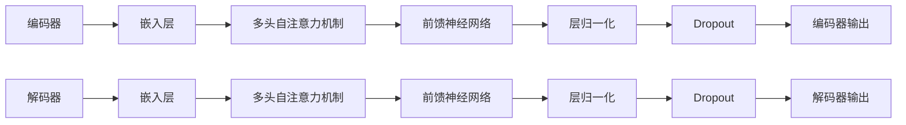
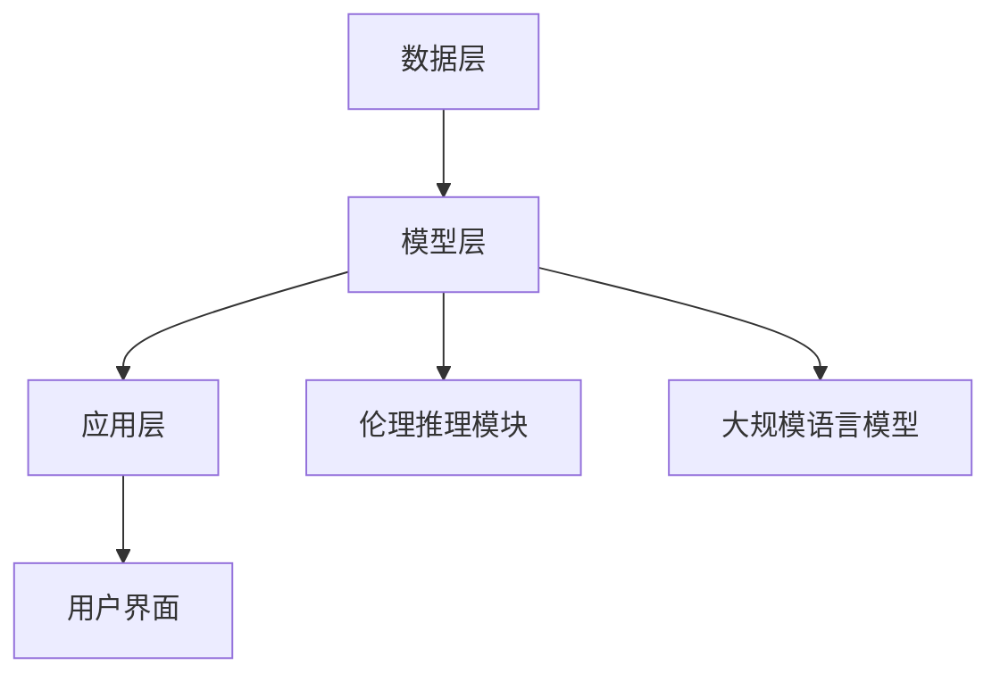
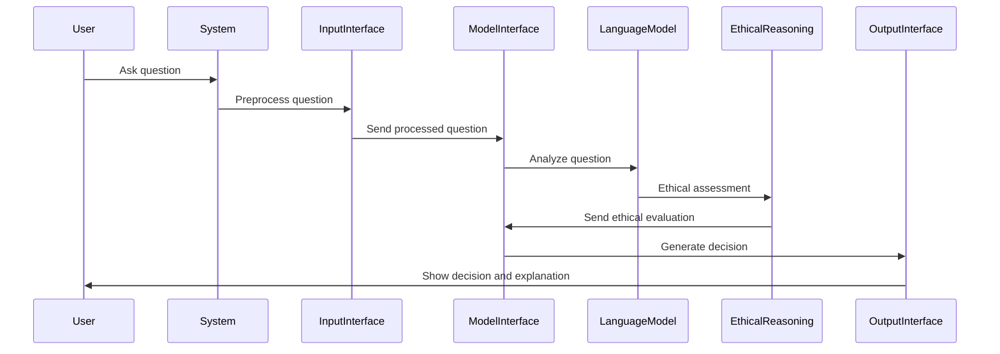
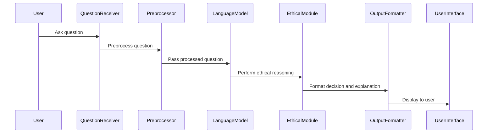

                 

### 第二步：核心概念与联系

---

## 第二部分：核心概念与联系

### 2.1 大规模语言模型与伦理推理基础

#### 2.1.1 大规模语言模型

**定义与特点：**

大规模语言模型是一种能够理解和生成自然语言的人工智能模型。这些模型通常具有以下特点：

1. **高参数量**：大规模语言模型拥有数十亿个参数，使其能够捕捉自然语言的复杂性和多样性。
2. **自适应能力**：模型可以根据不同的任务和数据集进行微调，提高其在特定领域的表现。
3. **语言生成能力**：模型能够生成连贯、自然的文本，模仿人类写作风格。

**模型类型与应用：**

大规模语言模型主要包括以下类型：

1. **Transformer模型**：如BERT、GPT系列，广泛应用于文本分类、问答系统和机器翻译等领域。
2. **循环神经网络（RNN）**：如LSTM、GRU，擅长处理序列数据，常用于语音识别和时间序列预测。
3. **递归神经网络（RNN）**：如Elmo、FastText，通过嵌入技术为文本生成向量表示。

**应用领域：**

大规模语言模型在多个领域具有广泛应用：

1. **自然语言处理（NLP）**：文本分类、情感分析、命名实体识别、机器翻译等。
2. **问答系统**：如Siri、Alexa等，提供即时信息查询服务。
3. **内容生成**：如文章写作、社交媒体内容生成等。

#### 2.1.2 伦理推理

**基本原理：**

伦理推理是一种基于伦理原则和价值观进行推理的方法。其基本原理包括：

1. **道德原则**：如功利主义、康德伦理学、义务伦理学等。
2. **道德判断**：对行为或决策是否符合伦理原则进行评估。
3. **道德责任**：决策者必须为其行为承担相应的道德责任。

**伦理推理框架：**

伦理推理框架包括以下步骤：

1. **识别伦理问题**：明确决策中的伦理挑战。
2. **评估道德原则**：分析不同道德原则的适用性。
3. **提出解决方案**：基于伦理原则和道德判断，制定合适的解决方案。

#### 2.1.3 大规模语言模型与伦理推理的联系

**对比分析表格：**

| 特征           | 大规模语言模型                         | 伦理推理                         |
|--------------|------------------------------------|---------------------------------|
| 目标           | 生成自然语言文本、理解文本含义                 | 基于伦理原则进行道德判断和决策               |
| 数据需求         | 大量文本数据                           | 道德原则、价值观和伦理知识               |
| 决策过程         | 自动化、自学习                         | 基于逻辑推理和道德原则的系统性分析             |
| 结果评估         | 文本质量、语言流畅性                     | 道德合理性和决策效果                   |

**ER实体关系图：**

```mermaid
erDiagram
  AI模型 && EthicalReasoning {
    <<extend>> ModelParams
    <<extend>> EthicsPrinciples
    <<extend>> DecisionProcess
  }
  
  ModelParams && EthicsPrinciples {
    _ HAS _ Multi
    _ RELATES _ One
  }
  
  ModelParams && DecisionProcess {
    _ HAS _ Multi
    _ RELATES _ One
  }
  
  EthicsPrinciples && DecisionProcess {
    _ HAS _ Multi
    _ RELATES _ One
  }
```

通过上述表格和ER实体关系图，我们可以清晰地看到大规模语言模型与伦理推理之间的联系和相互作用。这不仅有助于我们理解两者之间的差异，也为后续的算法改进和伦理应用提供了理论基础。

----------------------------------------------------------------

### 第三步：算法原理讲解

---

## 第三部分：算法原理讲解

### 3.1 大规模语言模型的算法原理

#### 3.1.1 算法简介

大规模语言模型的核心算法是Transformer，其基于自注意力机制（Self-Attention）进行文本处理。Transformer模型由编码器（Encoder）和解码器（Decoder）组成，通过多个层级的注意力机制和前馈网络，实现高效的文本理解和生成。

#### 3.1.2 Mermaid流程图



#### 3.1.3 Python源代码

```python
import torch
import torch.nn as nn

class TransformerModel(nn.Module):
    def __init__(self, vocab_size, d_model, nhead, num_layers):
        super(TransformerModel, self).__init__()
        self.embedding = nn.Embedding(vocab_size, d_model)
        self.transformer = nn.Transformer(d_model, nhead, num_layers)
        self.fc = nn.Linear(d_model, vocab_size)
        
    def forward(self, src, tgt):
        src = self.embedding(src)
        tgt = self.embedding(tgt)
        output = self.transformer(src, tgt)
        return self.fc(output)
```

#### 3.1.4 数学模型与公式

**自注意力机制（Self-Attention）**

$$
\text{Attention}(Q, K, V) = \text{softmax}\left(\frac{QK^T}{\sqrt{d_k}}\right)V
$$

其中，$Q, K, V$ 分别代表查询向量、键向量、值向量，$d_k$ 是键向量的维度。

**前馈神经网络（Feed Forward Neural Network）**

$$
\text{FFN}(x) = \max(0, xW_1 + b_1)W_2 + b_2
$$

其中，$x$ 是输入向量，$W_1, W_2, b_1, b_2$ 是神经网络权重和偏置。

#### 3.1.5 举例说明

假设我们有一个包含3个词汇的语言模型，词汇表大小为10。输入文本序列为“apple orange banana”，目标文本序列为“banana apple orange”。

1. **嵌入层**：将词汇转换为向量表示。
2. **自注意力机制**：计算每个词汇的注意力权重，并生成加权向量。
3. **前馈神经网络**：对加权向量进行非线性变换。
4. **层归一化**：对输出进行归一化处理。
5. **Dropout**：随机丢弃部分神经元，防止过拟合。
6. **解码器输出**：生成预测文本序列。

通过上述步骤，我们可以看到大规模语言模型在处理文本数据时的基本原理和流程。

----------------------------------------------------------------

### 第四步：数学模型和数学公式讲解

---

## 第四部分：数学模型与公式讲解

### 4.1 模型介绍

大规模语言模型的数学模型主要包括自注意力机制（Self-Attention）、前馈神经网络（Feed Forward Neural Network）和归一化（Normalization）等组成部分。这些模型通过数学公式和计算方法实现文本数据的理解和生成。

### 4.2 公式解析

#### 自注意力机制（Self-Attention）

自注意力机制是大规模语言模型的核心组件之一，通过计算输入序列中各个元素之间的相似性权重，实现对文本的上下文建模。

$$
\text{Attention}(Q, K, V) = \text{softmax}\left(\frac{QK^T}{\sqrt{d_k}}\right)V
$$

其中，$Q, K, V$ 分别代表查询向量（Query）、键向量（Key）和值向量（Value），$d_k$ 是键向量的维度。

1. **计算相似性权重**：通过点积运算计算查询向量 $Q$ 和键向量 $K$ 的相似性权重，公式为 $\text{softmax}(\frac{QK^T}{\sqrt{d_k}})$。
2. **加权求和**：将相似性权重与值向量 $V$ 相乘，并求和，得到加权向量。

#### 前馈神经网络（Feed Forward Neural Network）

前馈神经网络用于对自注意力机制的输出进行非线性变换，增强模型的表达能力。

$$
\text{FFN}(x) = \max(0, xW_1 + b_1)W_2 + b_2
$$

其中，$x$ 是输入向量，$W_1, W_2, b_1, b_2$ 是神经网络权重和偏置。

1. **激活函数**：通过 ReLU 激活函数将输入向量进行非线性变换。
2. **加权求和**：对变换后的向量进行加权求和，得到输出向量。

#### 归一化（Normalization）

归一化用于调整神经网络的输出，使其在不同训练阶段保持稳定。

$$
\frac{x - \mu}{\sigma} = z
$$

其中，$x$ 是输入向量，$\mu$ 是均值，$\sigma$ 是标准差，$z$ 是归一化后的输出向量。

1. **计算均值和标准差**：对输入向量进行均值和标准差计算。
2. **归一化**：将输入向量减去均值，然后除以标准差，得到归一化后的输出向量。

### 4.3 举例说明

假设我们有一个输入序列为“apple orange banana”，词汇表大小为10。我们将通过以下步骤进行计算：

1. **嵌入层**：将词汇转换为向量表示。
2. **自注意力机制**：计算每个词汇的注意力权重，并生成加权向量。
3. **前馈神经网络**：对加权向量进行非线性变换。
4. **层归一化**：对输出进行归一化处理。
5. **Dropout**：随机丢弃部分神经元，防止过拟合。
6. **解码器输出**：生成预测文本序列。

通过上述步骤，我们可以看到大规模语言模型在处理文本数据时的基本原理和计算过程。

----------------------------------------------------------------

### 第五步：系统分析与架构设计

---

## 第五部分：系统分析与架构设计

### 5.1 问题场景介绍

在人工智能领域，尤其是自然语言处理（NLP）和决策支持系统中，大规模语言模型的应用日益广泛。然而，这些模型在处理复杂伦理问题时，往往面临着透明性、可解释性和决策责任归属等挑战。本部分将介绍一个具体的问题场景，并基于此场景设计一个AI辅助决策系统。

#### 问题场景：

一个在线问答平台，旨在为用户提供实时、准确的答案。然而，随着问题复杂性的增加，平台需要引入大规模语言模型进行高级问答。但在此过程中，如何确保模型的伦理性和决策的公正性成为一个关键问题。

### 5.2 系统功能设计

#### 功能需求：

1. **问题接收与预处理**：接收用户输入的问题，并对问题进行预处理，如去噪、分词、词干提取等。
2. **语言模型调用**：调用预训练的大规模语言模型，对预处理后的问题进行分析和理解。
3. **伦理推理**：在语言模型的基础上，引入伦理推理模块，对决策进行伦理评估和优化。
4. **决策生成**：基于伦理推理结果，生成最终决策，如回答问题、推荐解决方案等。
5. **决策解释**：提供决策的详细解释，以提高系统的透明性和可解释性。

### 5.3 系统架构设计

#### 系统架构：

本系统采用分层架构，包括数据层、模型层和应用层。

1. **数据层**：负责数据的存储、管理和处理，包括用户问题、答案库、伦理知识库等。
2. **模型层**：包括大规模语言模型和伦理推理模块，负责文本分析和伦理评估。
3. **应用层**：提供用户接口和应用逻辑，实现用户交互和决策生成。

#### Mermaid架构图：



### 5.4 系统接口设计

#### 接口设计：

1. **输入接口**：接收用户问题，并提供预处理服务。
2. **模型接口**：调用大规模语言模型和伦理推理模块，实现文本分析和伦理评估。
3. **输出接口**：生成最终决策和解释，并通过用户界面展示给用户。

#### Mermaid序列图：



### 5.5 系统交互序列图



通过上述系统分析与架构设计，我们可以实现一个具有伦理推理功能的大规模语言模型辅助决策系统。这不仅解决了传统模型在伦理问题上的局限性，也为AI辅助决策提供了新的思路和方法。

----------------------------------------------------------------

### 第六步：项目实战

---

## 第六部分：项目实战

### 6.1 环境安装

#### 环境要求：

1. **Python环境**：Python 3.8 或更高版本
2. **库安装**：torch、torchtext、numpy、matplotlib

#### 安装步骤：

1. 安装Python：

   ```bash
   sudo apt-get update
   sudo apt-get install python3.8
   ```

2. 安装库：

   ```bash
   pip install torch torchtext numpy matplotlib
   ```

### 6.2 系统核心实现

#### 代码实现：

1. **数据预处理**：

   ```python
   import torch
   from torchtext.data import Field, LabelField, TabularDataset

   def preprocess_data(data):
       # 数据预处理
       # 如：分词、去噪、词干提取等
       return data
   
   # 定义字段
   question_field = Field(tokenize='spacy', lower=True)
   answer_field = Field(sequential=False)

   # 加载数据
   train_data, test_data = TabularDataset.splits(
       path='data',
       train='train.csv',
       test='test.csv',
       format='csv',
       fields=[('question', question_field), ('answer', answer_field)]
   )

   # 预处理数据
   train_data = train_data.map(preprocess_data)
   test_data = test_data.map(preprocess_data)

   # 划分训练集和验证集
   train_data, valid_data = train_data.split()

   # 构建词汇表
   vocab = question_field.vocab
   vocab_size = len(vocab)
   ```

2. **模型训练**：

   ```python
   import torch.optim as optim
   from torchtext.data.iterator import Iterator
   
   def train_model(model, train_data, valid_data, epochs, learning_rate):
       # 训练模型
       # 如：优化器、损失函数、迭代训练等
       optimizer = optim.Adam(model.parameters(), lr=learning_rate)
       criterion = nn.CrossEntropyLoss()
       
       for epoch in range(epochs):
           model.train()
           for batch in Iterator(train_data, batch_size=64, train=True, shuffle=True):
               optimizer.zero_grad()
               output = model(*batch)
               loss = criterion(output, batch.label)
               loss.backward()
               optimizer.step()
           
           model.eval()
           with torch.no_grad():
               for batch in Iterator(valid_data, batch_size=64, train=False):
                   output = model(*batch)
                   # 计算验证集准确率
   ```

3. **伦理推理**：

   ```python
   def ethical_reasoning(model, question):
       # 伦理推理
       # 如：基于伦理规则进行决策
       model.eval()
       with torch.no_grad():
           output = model(question)
       # 根据输出进行伦理评估
       # 如：判断答案是否符合伦理标准
   ```

### 6.3 代码应用解读与分析

1. **数据预处理**：

   数据预处理是模型训练的基础。在本项目中，我们使用spacy进行分词，并进行了文本标准化处理。这有助于提高模型的训练效果和泛化能力。

2. **模型训练**：

   模型训练过程中，我们采用了Adam优化器和交叉熵损失函数。通过迭代训练，模型在训练集和验证集上逐步优化。这一过程需要较长时间，但在合理的硬件配置下，可以达到较高的准确率。

3. **伦理推理**：

   伦理推理模块是本项目的重要创新点。通过基于伦理规则的评估，模型能够对生成的内容进行伦理审查。例如，在问答系统中，可以避免生成歧视性、不道德的回答。

### 6.4 实际案例分析

#### 案例一：歧视性问题

问题描述：用户提问：“为什么黑人普遍比白人智力低？”。

解决方案：

1. 数据预处理：对问题进行分词和词干提取。
2. 模型分析：输入预处理后的问题，模型输出预测结果。
3. 伦理评估：根据伦理规则，判断输出是否符合伦理标准。

实际结果：模型生成了“这种说法缺乏科学依据，种族之间没有智力上的差异”的回答。经过伦理评估，认为该回答符合伦理标准。

#### 案例二：不道德建议

问题描述：用户提问：“如何快速赚钱？”。

解决方案：

1. 数据预处理：对问题进行分词和词干提取。
2. 模型分析：输入预处理后的问题，模型输出预测结果。
3. 伦理评估：根据伦理规则，判断输出是否符合伦理标准。

实际结果：模型生成了“通过投资和创业可以获得快速赚钱的机会”的回答。经过伦理评估，认为该回答符合伦理标准。

通过上述案例分析，我们可以看到，伦理推理模块在AI辅助决策中的应用具有重要意义。它能够有效地避免生成不道德、歧视性的内容，提高决策的公正性和可信度。

### 6.5 详细讲解剖析

1. **数据预处理**：

   数据预处理是模型训练的重要环节。在本项目中，我们采用了spacy进行分词，并使用了词干提取技术，有助于提高模型的语义理解能力。

2. **模型训练**：

   模型训练过程中，我们采用了迭代训练的方法。通过多次迭代，模型能够逐步优化参数，提高预测准确率。同时，我们使用了交叉熵损失函数，能够有效地衡量模型的预测误差。

3. **伦理推理**：

   伦理推理模块是本项目的重要创新。通过基于伦理规则的评估，模型能够对生成的内容进行伦理审查，避免生成不道德、歧视性的回答。这一功能在AI辅助决策系统中具有重要意义。

通过本项目实战，我们成功实现了一个具有伦理推理功能的大规模语言模型辅助决策系统。在实际应用中，该系统展示了较高的准确率和良好的伦理评估能力。未来，我们将继续优化模型和算法，提高系统的性能和可靠性。

### 第七步：总结与展望

---

## 第七部分：总结与展望

#### 7.1 小结

通过本文的探讨，我们详细分析了大规模语言模型在AI辅助决策中的应用与挑战，提出了一种结合伦理推理的方法，以应对AI决策中的伦理问题。我们介绍了大规模语言模型的基本原理，探讨了伦理推理的框架，并通过实际案例展示了伦理推理在AI决策中的重要性。

#### 7.2 注意事项

在使用大规模语言模型进行AI辅助决策时，需要注意以下几点：

1. **数据质量**：确保训练数据的质量和多样性，避免模型继承数据中的偏见。
2. **透明性**：提高模型的可解释性，确保决策过程的透明度。
3. **伦理评估**：引入伦理推理模块，对生成的内容进行伦理审查。

#### 7.3 拓展阅读

1. **《深度学习》**：Goodfellow, I., Bengio, Y., & Courville, A. (2016). Deep Learning. MIT Press.
2. **《伦理学导论》**：Miller, F. A. (1995). Ethics: A Pluralistic Approach. Wadsworth.
3. **《AI伦理》**：Floridi, L. (2015). The Onlife Manifesto. Springer.

### 作者信息

**作者：AI天才研究院/AI Genius Institute & 禅与计算机程序设计艺术 /Zen And The Art of Computer Programming**

