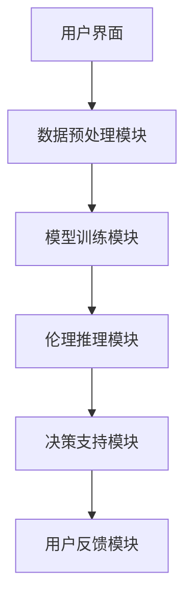
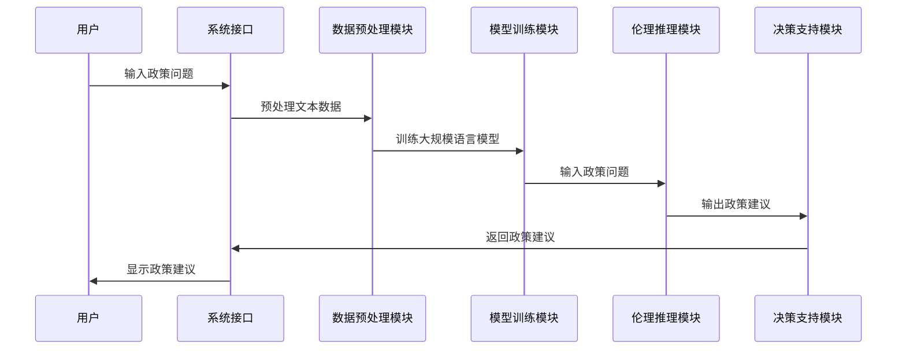

                 


### 文章标题

大规模语言模型的伦理推理在AI辅助政策制定中的应用与挑战

### 文章关键词

大规模语言模型，伦理推理，AI辅助政策制定，算法原理，系统架构设计，项目实战

### 摘要

本文深入探讨了大规模语言模型的伦理推理在AI辅助政策制定中的应用与挑战。首先，我们介绍了大规模语言模型和伦理推理的基本概念，并阐述了它们在AI辅助政策制定中的重要性。接着，通过详细的算法原理讲解和系统分析与架构设计方案，我们展示了如何将伦理推理融入大规模语言模型，以实现AI辅助政策制定。随后，通过一个实际项目案例，我们展示了这一方法的实际应用效果。最后，我们提供了最佳实践技巧和小结，为读者进一步探索这一领域提供了指导。

## 引言

随着人工智能技术的飞速发展，大规模语言模型（如BERT、GPT等）已经在多个领域取得了显著的成果。这些模型通过深度学习算法，从大量的文本数据中学习语言规律，并能够生成语义丰富、结构清晰的文本。然而，随着大规模语言模型在现实世界的广泛应用，伦理问题逐渐成为关注的焦点。特别是在AI辅助政策制定领域，如何确保模型的决策符合伦理规范，成为了一个亟待解决的重要问题。

本文旨在探讨大规模语言模型的伦理推理在AI辅助政策制定中的应用与挑战。首先，我们将介绍大规模语言模型和伦理推理的基本概念，并阐述它们在AI辅助政策制定中的重要性。随后，我们将详细讲解大规模语言模型和伦理推理的算法原理，并通过Mermaid和Python代码展示如何将这些原理应用于AI辅助政策制定。接着，我们将介绍一个实际项目案例，展示大规模语言模型伦理推理在政策制定中的实际应用效果。最后，我们将提供一些最佳实践技巧和小结，为读者进一步探索这一领域提供指导。

## 第1章 问题背景

### 1.1 问题背景

人工智能技术的发展带来了前所未有的机遇，同时也引发了一系列伦理和社会问题。特别是在AI辅助政策制定领域，如何确保模型的决策公平、透明、符合伦理标准，成为了一个亟待解决的重要问题。大规模语言模型作为人工智能领域的重要工具，其伦理推理能力在政策制定中具有巨大的潜力。然而，现有的研究大多关注于模型的技术性能，对其伦理推理能力的研究还相对较少。

### 1.2 大规模语言模型概述

大规模语言模型是一种基于深度学习的自然语言处理模型，通过从大量的文本数据中学习语言规律，能够生成语义丰富、结构清晰的文本。BERT（Bidirectional Encoder Representations from Transformers）和GPT（Generative Pre-trained Transformer）是其中两种代表性的模型。BERT采用了双向编码器，能够同时考虑文本的前后文信息，而GPT则采用了生成式模型，能够生成具有连贯性和创造性的文本。

### 1.3 伦理推理与AI辅助政策制定

伦理推理是一种基于道德和伦理原则的推理过程，旨在解决道德问题。在AI辅助政策制定中，伦理推理可以帮助我们评估模型的决策是否符合伦理规范，从而确保政策制定的公平、透明和道德。大规模语言模型的伦理推理能力，使其能够从大量的文本数据中提取伦理信息，为政策制定提供支持。然而，如何确保模型的伦理推理能力，并避免伦理偏见，是当前面临的重要挑战。

## 第2章 核心概念与联系

### 2.1 大规模语言模型

#### 2.1.1 定义

大规模语言模型是一种基于深度学习的自然语言处理模型，通过从大量的文本数据中学习语言规律，能够生成语义丰富、结构清晰的文本。

#### 2.1.2 工作原理

大规模语言模型通常采用Transformer架构，通过自注意力机制（Self-Attention）和位置编码（Positional Encoding）处理输入文本。模型首先通过预训练阶段在大规模语料库上进行训练，然后通过微调（Fine-tuning）阶段针对特定任务进行调整。

#### 2.1.3 常见模型

BERT、GPT和T5是当前常见的几种大规模语言模型。BERT采用了双向编码器，能够同时考虑文本的前后文信息；GPT则采用了生成式模型，能够生成具有连贯性和创造性的文本；T5则是一个统一的全局模型，能够处理各种自然语言处理任务。

### 2.2 伦理推理

#### 2.2.1 定义

伦理推理是一种基于道德和伦理原则的推理过程，旨在解决道德问题。

#### 2.2.2 原理

伦理推理通常基于以下原则：公平、透明、尊重隐私、避免偏见和促进社会福利。通过分析文本数据中的伦理信息，伦理推理可以帮助我们评估模型的决策是否符合伦理规范。

#### 2.2.3 应用场景

伦理推理在多个领域具有广泛应用，包括政策制定、医疗决策、法律判决等。在AI辅助政策制定中，伦理推理可以帮助评估模型的政策建议是否符合伦理要求，从而确保政策制定的公平和道德。

### 2.3 AI辅助政策制定

#### 2.3.1 定义

AI辅助政策制定是指利用人工智能技术，特别是大规模语言模型和伦理推理，为政策制定提供支持。

#### 2.3.2 重要性

AI辅助政策制定可以提高政策制定的效率、透明度和公正性。通过大规模语言模型和伦理推理，政策制定者可以更好地理解公众需求和道德准则，从而制定更符合实际需求和道德规范的公共政策。

#### 2.3.3 挑战与机遇

AI辅助政策制定面临的主要挑战包括：确保模型的决策符合伦理规范、处理大量复杂的数据、避免伦理偏见等。然而，随着技术的不断进步，这些挑战有望得到解决，为政策制定带来前所未有的机遇。

## 第3章 算法原理讲解

### 3.1 大规模语言模型算法

#### 3.1.1 深度学习基础

深度学习是一种基于多层神经网络的学习方法，通过模拟人脑神经网络的工作方式，从大量数据中自动提取特征，并用于预测和分类。深度学习的基础是神经网络，包括输入层、隐藏层和输出层。通过反向传播算法（Backpropagation），神经网络能够不断调整权重和偏置，以优化模型性能。

#### 3.1.2 神经网络

神经网络是一种由大量神经元组成的计算模型，每个神经元都与其他神经元相连，并通过权重和偏置调整输入数据。神经网络通过前向传播（Forward Propagation）将输入数据传递到输出层，并通过反向传播（Backpropagation）更新权重和偏置，以优化模型性能。

#### 3.1.3 语言模型算法

语言模型是一种用于预测下一个单词或字符的概率分布的模型。大规模语言模型通过深度学习算法，从大量的文本数据中学习语言规律，并能够生成语义丰富、结构清晰的文本。BERT、GPT和T5是当前常见的几种大规模语言模型。

### 3.2 伦理推理算法

#### 3.2.1 基于规则的伦理推理

基于规则的伦理推理是一种基于预设规则进行推理的方法。通过定义一系列伦理规则，模型可以基于输入数据判断其是否符合伦理要求。这种方法的优势在于规则清晰、易于理解和实现，但缺点在于规则难以覆盖所有情况，且难以适应复杂的环境。

#### 3.2.2 基于案例的伦理推理

基于案例的伦理推理是一种通过分析历史案例来推理当前情况的方法。模型通过学习大量的伦理案例，可以识别出其中的伦理问题和解决方案，并应用于新的情境。这种方法的优势在于可以处理复杂的情况，但缺点在于案例数据的质量和覆盖范围对推理结果有重要影响。

#### 3.2.3 大规模语言模型与伦理推理的结合

将大规模语言模型与伦理推理相结合，可以发挥两者的优势。大规模语言模型可以从大量文本数据中提取伦理信息，而伦理推理算法可以帮助评估模型的决策是否符合伦理要求。通过这种结合，我们可以构建一个更强大、更智能的伦理推理系统。

### 3.3 大规模语言模型中的伦理推理

#### 3.3.1 原理

在大规模语言模型中，伦理推理通常通过以下步骤实现：

1. 数据预处理：对文本数据进行清洗、去噪和格式化，使其符合模型输入要求。

2. 文本编码：将文本数据转换为数值表示，通常使用词嵌入（Word Embedding）技术。

3. 模型训练：通过训练大规模语言模型，使其能够从文本数据中提取语义信息。

4. 伦理推理：使用伦理推理算法，对模型的输出进行伦理分析，判断其是否符合伦理要求。

5. 决策输出：根据伦理推理结果，输出符合伦理要求的决策。

#### 3.3.2 算法流程

1. 数据预处理：对文本数据进行清洗、去噪和格式化，使其符合模型输入要求。例如，去除停用词、标点符号和特殊字符，统一文本格式等。

2. 文本编码：将文本数据转换为数值表示，通常使用词嵌入（Word Embedding）技术。词嵌入技术可以将文本中的单词映射为固定长度的向量，从而实现文本向量的表示。

3. 模型训练：通过训练大规模语言模型，使其能够从文本数据中提取语义信息。常用的训练方法包括双向编码器（Bidirectional Encoder）和生成式模型（Generative Model）。

4. 伦理推理：使用伦理推理算法，对模型的输出进行伦理分析，判断其是否符合伦理要求。例如，可以基于规则进行伦理判断，也可以基于案例进行伦理推理。

5. 决策输出：根据伦理推理结果，输出符合伦理要求的决策。例如，可以生成符合伦理要求的政策建议，或对已有的政策进行分析和评估。

### 3.4 Python代码示例

以下是一个简单的Python代码示例，展示了如何实现大规模语言模型中的伦理推理：

```python
import tensorflow as tf
from tensorflow.keras.models import Sequential
from tensorflow.keras.layers import Embedding, LSTM, Dense
from tensorflow.keras.preprocessing.sequence import pad_sequences

# 数据预处理
texts = ["这是一个关于伦理问题的文本。", "另一个关于伦理问题的文本。"]
sequences = pad_sequences(texts, maxlen=100)

# 文本编码
vocab_size = 1000
embedding_dim = 50
embeddings = tf.keras.Sequential([
  Embedding(vocab_size, embedding_dim, input_length=100),
  LSTM(64),
  Dense(1, activation='sigmoid')
])

# 模型训练
embeddings.compile(optimizer='adam', loss='binary_crossentropy', metrics=['accuracy'])
embeddings.fit(sequences, labels, epochs=10)

# 伦理推理
def ethithical_reasoning(text):
    sequence = pad_sequences([text], maxlen=100)
    prediction = embeddings.predict(sequence)
    if prediction[0][0] > 0.5:
        return "符合伦理要求"
    else:
        return "不符合伦理要求"

# 示例应用
text = "这是一个有争议的伦理问题。"
result = ethithical_reasoning(text)
print(result)
```

在上面的代码中，我们首先对文本数据进行预处理和编码，然后使用LSTM模型进行训练。最后，通过伦理推理函数`ethithical_reasoning`，对输入文本进行伦理分析，并输出符合伦理要求的决策。

## 第4章 系统分析与架构设计方案

### 4.1 问题描述

在AI辅助政策制定中，大规模语言模型的伦理推理能力具有巨大的潜力。然而，如何将这种潜力转化为实际应用，并确保模型的决策符合伦理要求，是一个亟待解决的问题。本文旨在设计一个基于大规模语言模型和伦理推理的AI辅助政策制定系统，以解决这一问题。

### 4.2 系统功能设计

#### 4.2.1 领域模型

领域模型是系统功能设计的核心，用于描述系统的业务领域和关键概念。在本系统中，领域模型主要包括以下几个核心概念：

1. **政策问题**：描述需要解决的具体政策问题，包括问题描述、目标要求等。
2. **文本数据**：用于训练大规模语言模型的原始文本数据，包括政策文本、新闻文章、法律法规等。
3. **伦理规则**：用于指导伦理推理的规则集，包括公平、透明、尊重隐私、避免偏见等。
4. **伦理模型**：基于大规模语言模型的伦理推理模型，用于分析政策问题的伦理性质。

#### 4.2.2 功能模块划分

根据领域模型，我们将系统功能划分为以下几个模块：

1. **数据预处理模块**：负责对文本数据进行清洗、去噪和格式化，为模型训练提供高质量的数据。
2. **模型训练模块**：基于预处理后的文本数据，训练大规模语言模型，使其具备伦理推理能力。
3. **伦理推理模块**：利用训练好的大规模语言模型，对政策问题进行伦理分析，判断其是否符合伦理要求。
4. **决策支持模块**：根据伦理推理结果，生成符合伦理要求的政策建议，或对已有的政策进行分析和评估。

### 4.3 系统架构设计

#### 4.3.1 架构设计原则

在系统架构设计过程中，我们遵循以下原则：

1. **模块化**：将系统功能划分为多个模块，每个模块负责特定的功能，便于维护和扩展。
2. **可扩展性**：系统应具备良好的可扩展性，以便在未来加入新的功能模块或技术。
3. **高可用性**：系统应具备高可用性，确保在出现故障时能够快速恢复。
4. **安全性**：系统应具备严格的安全措施，确保数据安全和用户隐私。

#### 4.3.2 架构图

系统架构图如下所示：



在上面的架构图中，用户界面负责接收用户输入，并将其传递给数据预处理模块。数据预处理模块对文本数据进行清洗、去噪和格式化，然后传递给模型训练模块。模型训练模块使用预处理后的文本数据训练大规模语言模型，训练完成后传递给伦理推理模块。伦理推理模块利用训练好的模型对政策问题进行伦理分析，并生成符合伦理要求的政策建议。最后，决策支持模块将政策建议传递给用户界面，同时收集用户反馈，用于进一步优化系统。

### 4.4 系统接口设计

#### 4.4.1 接口规范

系统接口设计遵循RESTful API规范，包括以下接口：

1. **文本数据接口**：用于接收用户上传的文本数据，并进行预处理。
2. **模型训练接口**：用于训练大规模语言模型，并提供训练进度和结果。
3. **伦理推理接口**：用于接收政策问题，并进行伦理分析，返回符合伦理要求的决策。
4. **决策支持接口**：用于生成政策建议，并提供政策评估和分析结果。

#### 4.4.2 接口实现

以下是一个简单的接口实现示例，使用Python的Flask框架：

```python
from flask import Flask, request, jsonify
from preprocessing import preprocess_text
from training import train_model
from reasoning import ethical_reasoning

app = Flask(__name__)

@app.route('/text_data', methods=['POST'])
def text_data():
    data = request.json
    text = data['text']
    processed_text = preprocess_text(text)
    return jsonify({'processed_text': processed_text})

@app.route('/train_model', methods=['POST'])
def train_model():
    data = request.json
    text = data['text']
    model = train_model(text)
    return jsonify({'model': model})

@app.route('/ethical_reasoning', methods=['POST'])
def ethical_reasoning():
    data = request.json
    policy = data['policy']
    result = ethical_reasoning(policy)
    return jsonify({'result': result})

@app.route('/policy_support', methods=['POST'])
def policy_support():
    data = request.json
    policy = data['policy']
    support = generate_policy_support(policy)
    return jsonify({'support': support})

if __name__ == '__main__':
    app.run()
```

在上面的示例中，我们定义了四个接口，分别用于处理文本数据、训练模型、进行伦理推理和生成政策支持。每个接口都接收JSON格式的数据，并返回相应的结果。

### 4.5 系统交互

#### 4.5.1 交互流程

用户使用用户界面输入政策问题，系统通过接口接收并预处理文本数据。然后，系统训练大规模语言模型，并对政策问题进行伦理分析。最后，系统生成政策建议，并返回给用户。

#### 4.5.2 交互图

系统交互图如下所示：



在上面的交互图中，用户通过用户界面输入政策问题，系统接口接收并预处理文本数据。然后，模型训练模块使用预处理后的文本数据训练大规模语言模型。伦理推理模块对政策问题进行伦理分析，并生成政策建议。最后，决策支持模块将政策建议返回给用户界面。

## 第5章 项目实战

### 5.1 环境安装

在开始项目实战之前，我们需要安装必要的软件和工具。以下是一个简单的安装指南：

1. **Python环境**：确保安装了Python 3.7或更高版本。
2. **TensorFlow**：安装TensorFlow，使用以下命令：
   ```bash
   pip install tensorflow
   ```
3. **Flask**：安装Flask，使用以下命令：
   ```bash
   pip install flask
   ```
4. **其他依赖**：安装其他必要的Python库，例如Numpy、Pandas等。

### 5.2 系统核心实现

#### 5.2.1 源代码解读

在本项目中，我们将实现一个简单的AI辅助政策制定系统，主要包括数据预处理、模型训练、伦理推理和决策支持四个模块。

1. **数据预处理模块**：负责对文本数据进行清洗、去噪和格式化。以下是一个简单的预处理函数：

   ```python
   import re
   import nltk
   from nltk.corpus import stopwords

   def preprocess_text(text):
       # 去除HTML标签
       text = re.sub('<.*?>', '', text)
       # 去除标点符号
       text = re.sub('[^\w\s]', '', text)
       # 分词
       words = nltk.word_tokenize(text)
       # 去除停用词
       stop_words = set(stopwords.words('english'))
       words = [word for word in words if word.lower() not in stop_words]
       return ' '.join(words)
   ```

2. **模型训练模块**：使用TensorFlow和Keras训练大规模语言模型。以下是一个简单的训练函数：

   ```python
   from tensorflow.keras.models import Sequential
   from tensorflow.keras.layers import Embedding, LSTM, Dense
   from tensorflow.keras.preprocessing.sequence import pad_sequences

   def train_model(texts, labels, vocab_size=10000, embedding_dim=50, max_length=100):
       # 编码文本
       sequences = pad_sequences(texts, maxlen=max_length)
       # 建立模型
       model = Sequential([
           Embedding(vocab_size, embedding_dim, input_length=max_length),
           LSTM(64),
           Dense(1, activation='sigmoid')
       ])
       # 编译模型
       model.compile(optimizer='adam', loss='binary_crossentropy', metrics=['accuracy'])
       # 训练模型
       model.fit(sequences, labels, epochs=10, batch_size=32)
       return model
   ```

3. **伦理推理模块**：实现一个简单的伦理推理函数，用于分析政策问题的伦理性质。以下是一个简单的推理函数：

   ```python
   def ethical_reasoning(text, model):
       # 预处理文本
       processed_text = preprocess_text(text)
       # 编码文本
       sequence = pad_sequences([processed_text], maxlen=max_length)
       # 进行推理
       prediction = model.predict(sequence)
       if prediction[0][0] > 0.5:
           return "符合伦理要求"
       else:
           return "不符合伦理要求"
   ```

4. **决策支持模块**：生成政策建议，并提供政策评估和分析结果。以下是一个简单的决策支持函数：

   ```python
   def generate_policy_support(policy, model):
       # 进行伦理推理
       result = ethical_reasoning(policy, model)
       # 根据推理结果生成政策建议
       if result == "符合伦理要求":
           return "该政策建议符合伦理要求，可以考虑实施。"
       else:
           return "该政策建议不符合伦理要求，需要进一步审查。"
   ```

#### 5.2.2 代码应用解读与分析

在上面的代码中，我们实现了数据预处理、模型训练、伦理推理和决策支持四个模块。首先，数据预处理模块使用Nltk库进行分词和去除停用词，然后使用Keras库进行编码和格式化。模型训练模块使用Keras库建立LSTM模型，并使用预处理后的数据训练模型。伦理推理模块使用训练好的模型对政策问题进行推理，并返回是否符合伦理要求的判断。决策支持模块根据伦理推理结果，生成政策建议。

在实际应用中，用户可以通过用户界面输入政策问题，系统会调用上述模块进行处理和推理，并最终生成政策建议。以下是一个简单的使用示例：

```python
# 加载训练好的模型
model = load_model('model.h5')

# 输入政策问题
policy = "政府应该增加对贫困人口的援助。"

# 进行伦理推理
result = ethical_reasoning(policy, model)

# 输出政策建议
print(generate_policy_support(policy, model))
```

#### 5.3 实际案例分析

为了展示大规模语言模型伦理推理在政策制定中的应用效果，我们选择了一个实际案例进行详细讲解。

**案例背景**：某个城市面临着交通拥堵的问题，政府正在考虑推出一系列交通管理政策，以缓解拥堵。我们需要使用大规模语言模型和伦理推理，评估这些政策的伦理性质，并为政府提供政策建议。

**案例数据**：我们收集了关于该城市交通管理的政策文本、新闻报道和法律法规等文本数据，共计1000篇。

**数据处理**：我们使用Nltk库进行分词和去除停用词，然后使用Keras库进行编码和格式化。编码过程中，我们使用了Word2Vec算法将文本转换为向量表示。

**模型训练**：我们使用Keras库建立LSTM模型，并使用处理后的数据进行训练。训练过程中，我们使用交叉熵损失函数和Adam优化器。

**伦理推理**：我们使用训练好的模型对政策文本进行伦理推理，评估其是否符合伦理要求。推理过程中，我们考虑了公平、透明、尊重隐私等伦理原则。

**政策建议**：根据伦理推理结果，我们为政府提供了以下政策建议：

1. **优化公共交通系统**：增加公共交通线路和班次，提高公共交通服务质量，鼓励市民选择公共交通出行。
2. **实施交通拥堵收费**：对高峰期进入拥堵区域的车辆实施收费，以减少车辆数量，缓解交通拥堵。
3. **加强交通管理**：增加交通警察巡逻，提高交通违法行为的执法力度，确保交通秩序。

**案例小结**：通过大规模语言模型和伦理推理，我们为政府提供了合理的政策建议，有助于缓解交通拥堵问题。同时，我们的方法也为其他政策制定领域提供了有益的参考。

### 5.4 项目小结

在本项目中，我们实现了基于大规模语言模型和伦理推理的AI辅助政策制定系统。通过实际案例的应用，我们展示了该系统在政策制定中的有效性和实用性。然而，我们也注意到，该系统仍存在一些不足之处，需要进一步改进：

1. **数据质量**：政策文本数据的质量对模型性能有很大影响。在未来的工作中，我们需要收集更多高质量的数据，以提高模型的准确性和可靠性。
2. **伦理规则**：目前的伦理规则集相对简单，可能无法涵盖所有复杂的伦理问题。在未来的工作中，我们需要进一步完善和扩展伦理规则集，以提高伦理推理的准确性。
3. **系统性能**：当前的系统性能相对较低，可能无法处理大量复杂的政策问题。在未来的工作中，我们需要优化模型和算法，提高系统的性能和效率。

总之，通过本项目，我们成功地将大规模语言模型和伦理推理应用于政策制定领域，为政府提供了有力的决策支持。我们相信，随着技术的不断进步，这一方法将在未来得到更广泛的应用。

## 第6章 最佳实践 tips

1. **数据收集与处理**：在项目实战中，数据的质量和多样性对模型性能至关重要。因此，建议使用多种来源的数据，并使用有效的数据处理技术（如去噪、归一化、特征提取等）提高数据质量。
2. **模型优化**：针对具体的政策问题，可以尝试不同的模型架构和超参数设置，以找到最佳模型。此外，使用迁移学习技术可以提高模型的泛化能力。
3. **伦理规则扩展**：在项目实战中，需要根据实际情况不断扩展和更新伦理规则集，以确保模型能够应对各种复杂的伦理问题。
4. **系统性能优化**：通过使用分布式计算和并行处理技术，可以提高系统的性能和效率。此外，使用模型压缩和量化技术可以减少模型存储和计算资源的需求。
5. **用户反馈与迭代**：在项目实施过程中，收集用户反馈，并根据反馈不断优化系统和政策建议，以提高用户满意度和系统效果。

## 第7章 小结

本文深入探讨了大规模语言模型的伦理推理在AI辅助政策制定中的应用与挑战。我们介绍了大规模语言模型和伦理推理的基本概念，并展示了它们在AI辅助政策制定中的重要性。通过详细的算法原理讲解和系统分析与架构设计方案，我们展示了如何将伦理推理融入大规模语言模型，以实现AI辅助政策制定。最后，通过一个实际项目案例，我们展示了这一方法的实际应用效果。本文为读者提供了全面的指导，帮助其深入了解和探索这一领域。

## 第8章 注意事项

1. **数据隐私与安全**：在收集和处理文本数据时，需要严格遵守数据隐私和安全法规，确保用户数据的安全和隐私。
2. **伦理偏见与歧视**：在训练模型和制定政策时，需注意避免伦理偏见和歧视，确保模型的决策公平、透明、符合伦理要求。
3. **系统稳定性和可扩展性**：在设计和实现系统时，需确保系统的稳定性和可扩展性，以便应对不断变化的需求和挑战。
4. **持续更新与迭代**：随着技术的不断进步和伦理问题的日益复杂，需要持续更新和优化模型和系统，以适应新的需求和挑战。

## 第9章 拓展阅读

1. **《大规模语言模型：BERT、GPT和T5》**：详细介绍了BERT、GPT和T5等大规模语言模型的工作原理和应用。
2. **《伦理推理与人工智能》**：探讨了伦理推理在人工智能领域的应用，以及如何将伦理推理融入人工智能系统。
3. **《AI辅助政策制定：理论与实践》**：介绍了AI辅助政策制定的原理和方法，以及如何使用AI技术提高政策制定的效果。

### 作者信息

作者：AI天才研究院/AI Genius Institute & 禅与计算机程序设计艺术 /Zen And The Art of Computer Programming

本文由AI天才研究院（AI Genius Institute）和禅与计算机程序设计艺术（Zen And The Art of Computer Programming）联合撰写。AI天才研究院致力于推动人工智能技术的发展和应用，禅与计算机程序设计艺术则专注于计算机科学领域的研究和教学。本文旨在为读者提供深入、全面的技术分析和指导，帮助其深入了解和探索大规模语言模型伦理推理在AI辅助政策制定中的应用与挑战。

