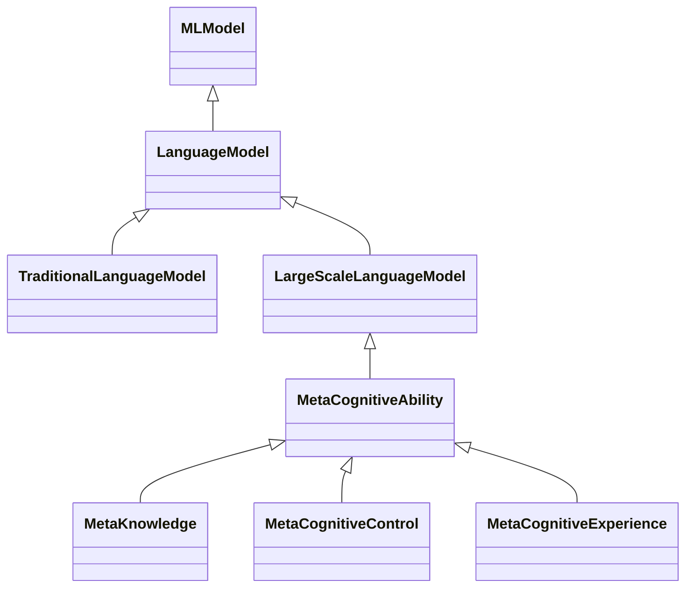

                 

# 大规模语言模型的元认知能力在自主学习系统设计中的应用研究

> 关键词：大规模语言模型、元认知能力、自主学习系统、设计与应用

> 摘要：本文旨在探讨大规模语言模型在自主学习系统设计中的应用，特别是其元认知能力的发挥。首先，我们回顾了大规模语言模型的基本原理和训练方法，随后深入分析了元认知能力的核心概念和其在自主学习中的作用。在此基础上，我们详细阐述了大规模语言模型在自主学习系统设计中的具体应用和优化策略。最后，通过一个实际案例，展示了这些理论和方法的实际应用效果。

## 第一部分：引言

### 1.1 问题背景与意义

#### 1.1.1 背景介绍

在信息化和人工智能迅速发展的背景下，人类对信息处理的需求日益增长。传统的基于规则和统计的方法已无法满足复杂多变的应用需求。因此，大规模语言模型（如GPT、BERT等）应运而生，它们通过深度学习技术，对海量文本数据进行训练，从而具备了强大的语言理解和生成能力。

然而，仅仅依靠语言模型的能力，并不能完全解决复杂的问题。在实际应用中，我们还需要考虑如何让这些模型具备自我学习和优化能力，以便更好地适应动态变化的情境。这就引出了本文的核心问题：如何利用大规模语言模型的元认知能力，设计出高效的自主学习系统。

#### 1.1.2 问题描述

大规模语言模型在自主学习系统中的应用面临着一系列挑战。首先，如何有效地从海量数据中提取有用的信息，以支持模型的学习和优化？其次，如何设计出既高效又灵活的自主学习系统架构，以适应不同的应用场景？最后，如何评估和优化系统的性能，确保其在实际应用中的有效性和可靠性？

#### 1.1.3 问题解决

为了解决上述问题，我们需要从以下几个方面入手：

1. **深入理解大规模语言模型的工作原理**：只有真正理解模型的工作机制，才能更好地利用其元认知能力进行自主学习系统设计。
2. **研究元认知能力的本质和作用**：元认知能力是自主学习的关键，我们需要明确其核心概念和组成部分，以便在系统设计中充分发挥其作用。
3. **设计高效的自主学习系统架构**：通过模块化和组件化设计，构建一个灵活、可扩展的自主学习系统，以满足不同应用场景的需求。
4. **开发有效的评估和优化策略**：通过持续的性能评估和优化，确保系统在实际应用中的高效性和可靠性。

#### 1.1.4 边界与外延

本文的研究主要关注以下几个方面：

1. **技术边界**：本文主要探讨大规模语言模型和元认知能力在自主学习系统设计中的应用，不涉及其他相关领域的技术细节。
2. **应用边界**：本文的研究主要针对通用场景，对于特定领域的应用，可能需要进一步定制和优化。
3. **研究外延**：本文的研究为大规模语言模型和元认知能力在自主学习系统设计中的应用提供了理论和实践基础，但仍有待进一步深化和拓展。

### 1.2 核心概念与联系

#### 1.2.1 大规模语言模型概述

**大规模语言模型的定义**：大规模语言模型是一种基于深度学习技术的自然语言处理模型，通过学习大量文本数据，能够对自然语言进行理解和生成。

**大规模语言模型的特点**：

- **高容量**：能够处理大量文本数据，从而具备丰富的语言知识。
- **强鲁棒性**：能够适应不同语言风格和语境，具备较强的泛化能力。
- **自适应**：能够通过在线学习和优化，不断提升自身的性能和效果。

**大规模语言模型与传统语言模型的对比**：

| 特点 | 大规模语言模型 | 传统语言模型 |
| --- | --- | --- |
| 数据容量 | 大规模 | 小规模 |
| 泛化能力 | 强 | 弱 |
| 自适应能力 | 强 | 弱 |
| 学习效率 | 高 | 低 |

#### 1.2.2 元认知能力概述

**元认知能力的定义**：元认知能力是指个体在认知活动过程中，对自己认知过程的认知和调节能力。

**元认知能力的组成部分**：

- **元知识（MetaKnowledge）**：个体对自身认知活动所涉及知识、技能和策略的了解。
- **元认知控制（MetaCognitiveControl）**：个体在认知活动中，对认知过程进行监控、调节和优化的能力。
- **元认知经验（MetaCognitiveExperience）**：个体在认知活动过程中积累的经验和感悟。

**元认知能力与自主学习的关系**：

- **元认知能力在自主学习中的作用**：元认知能力是自主学习的关键，它能够帮助个体有效地规划和调整学习过程，提高学习效果。

#### 1.2.3 大规模语言模型与元认知能力的联系

**大规模语言模型与元认知能力的联系**：

- **语言能力与元认知能力的互补**：大规模语言模型具备强大的语言理解能力，可以辅助个体进行自主学习；而元认知能力则可以帮助模型更好地理解和调整自身的学习过程，实现更高效的学习。

**关系示意图**：



### 1.3 本书结构安排

#### 1.3.1 主要内容概述

本书主要分为五个部分：

1. **第一部分：引言**：介绍大规模语言模型和元认知能力的核心概念及其在自主学习系统设计中的应用。
2. **第二部分：大规模语言模型技术**：详细讲解大规模语言模型的基本原理、训练方法和应用案例。
3. **第三部分：元认知能力在自主学习中的应用**：深入分析元认知能力的核心概念和作用，以及其在自主学习中的应用。
4. **第四部分：大规模语言模型在自主学习系统设计中的应用**：探讨大规模语言模型在自主学习系统设计中的具体应用和优化策略。
5. **第五部分：元认知能力在自主学习系统设计中的应用实践**：通过实际案例，展示大规模语言模型和元认知能力在自主学习系统设计中的应用效果。

#### 1.3.2 各章节详细内容

- **第一部分：引言**：本章主要介绍大规模语言模型和元认知能力的核心概念，以及它们在自主学习系统设计中的应用。
- **第二部分：大规模语言模型技术**：本章详细讲解大规模语言模型的基本原理、训练方法和应用案例。
- **第三部分：元认知能力在自主学习中的应用**：本章深入分析元认知能力的核心概念和作用，以及其在自主学习中的应用。
- **第四部分：大规模语言模型在自主学习系统设计中的应用**：本章探讨大规模语言模型在自主学习系统设计中的具体应用和优化策略。
- **第五部分：元认知能力在自主学习系统设计中的应用实践**：本章通过实际案例，展示大规模语言模型和元认知能力在自主学习系统设计中的应用效果。

#### 1.3.3 阅读建议与注意事项

- **阅读顺序**：建议按照本书的结构顺序阅读，以便更好地理解大规模语言模型和元认知能力在自主学习系统设计中的应用。
- **重点章节**：重点关注第二部分和第三部分，这部分内容是本书的核心，对于理解大规模语言模型和元认知能力至关重要。
- **实践应用**：在阅读过程中，可以结合实际应用场景，思考如何将大规模语言模型和元认知能力应用于自主学习系统设计。

### 1.4 本章小结

本章介绍了大规模语言模型和元认知能力的核心概念及其在自主学习系统设计中的应用。通过分析大规模语言模型的基本原理和元认知能力的组成部分，我们为后续章节的详细探讨奠定了基础。在接下来的章节中，我们将深入探讨大规模语言模型的技术细节和元认知能力在自主学习中的应用，以期为自主学习系统设计提供有效的理论支持和实践指导。

----------------------------------------------------------------

# 第二部分：大规模语言模型技术

## 2.1 大规模语言模型的基本原理

### 2.1.1 语言模型的定义

语言模型是一种统计模型，用于预测自然语言中下一个词或字符的概率分布。在人工智能和自然语言处理领域，语言模型是构建各种自然语言应用的基础，如机器翻译、文本生成、问答系统等。语言模型的核心任务是理解自然语言的语法和语义，从而为各种自然语言处理任务提供支持。

### 2.1.2 语言模型的演化过程

语言模型的发展经历了从基于规则的方法、统计模型到深度学习模型的不同阶段。

- **基于规则的方法**：早期的语言模型主要依赖于语言学家的知识和经验，通过定义一系列的语法规则和模板，来预测下一个词或字符。这种方法在处理简单语法结构时表现良好，但随着语言复杂性的增加，其局限性也逐渐显现。

- **统计模型**：随着计算能力的提升和数据规模的扩大，统计模型开始成为语言模型的主要发展方向。统计模型通过计算词频、词组频次等统计信息，来预测下一个词或字符。这种模型在处理大规模文本数据时表现优异，但仍存在一些问题，如对罕见词的预测效果不佳。

- **深度学习模型**：近年来，深度学习技术的快速发展为语言模型带来了新的突破。基于深度学习的语言模型，如循环神经网络（RNN）、长短期记忆网络（LSTM）、Transformer等，通过学习大量的文本数据，能够自动提取语言特征，实现更高水平的语言理解能力。

### 2.1.3 大规模语言模型的构成

大规模语言模型通常由以下几个核心组件构成：

- **数据预处理**：包括文本清洗、分词、词向量化等步骤，将原始文本数据转化为模型可处理的输入格式。

- **模型架构**：如Transformer、BERT、GPT等，这些模型通过深度神经网络结构，对输入的文本数据进行处理，提取语言特征。

- **训练过程**：使用大规模的文本数据对模型进行训练，模型在训练过程中不断优化自身参数，以提高预测准确性。

- **优化策略**：包括批量归一化（Batch Normalization）、dropout、梯度裁剪等技术，以加速训练过程和提高模型性能。

- **评估指标**：如损失函数、精确率、召回率等，用于评估模型在训练和测试数据上的表现。

### 2.1.4 大规模语言模型的工作原理

大规模语言模型的工作原理主要包括以下几个关键步骤：

1. **输入层**：将预处理后的文本数据输入到模型中，文本数据被转化为词向量或嵌入向量。

2. **编码层**：模型对输入的词向量进行编码，提取语言特征。在Transformer模型中，这一过程通过多头自注意力机制（Multi-Head Self-Attention）实现；在BERT模型中，则通过编码器（Encoder）实现。

3. **解码层**：根据编码层提取的语言特征，模型预测下一个词或字符。在生成式模型（如GPT）中，这一过程通过预测下一个词的概率分布实现；在判别式模型（如BERT）中，则通过分类或回归任务实现。

4. **输出层**：将预测结果输出，如生成的文本、翻译结果等。

### 2.1.5 大规模语言模型的优势和挑战

**优势**：

- **强大的语言理解能力**：通过学习大量的文本数据，大规模语言模型能够自动提取丰富的语言特征，实现对自然语言的深入理解。
- **高效的泛化能力**：大规模语言模型具备较强的泛化能力，能够在不同领域和任务中表现出优异的性能。
- **自适应学习**：通过在线学习和优化，大规模语言模型能够不断调整自身参数，以适应动态变化的应用场景。

**挑战**：

- **计算资源需求**：大规模语言模型的训练和推理过程对计算资源的需求非常高，需要大量计算资源和存储空间。
- **数据质量和标注**：大规模语言模型的训练依赖于高质量的数据，数据质量和标注的准确性对模型性能有重要影响。
- **模型解释性和可解释性**：大规模语言模型通常是一个黑盒模型，其内部机制复杂，难以进行解释和调试。

### 2.1.6 大规模语言模型的应用领域

大规模语言模型在多个领域得到了广泛应用，以下是一些典型应用领域：

- **自然语言处理**：如文本分类、情感分析、命名实体识别等。
- **机器翻译**：如翻译系统、多语言对话系统等。
- **问答系统**：如智能客服、在线教育等。
- **文本生成**：如自动写作、新闻摘要等。
- **语音识别**：如语音助手、智能家居等。

### 2.1.7 大规模语言模型的发展趋势

随着深度学习和自然语言处理技术的不断发展，大规模语言模型将继续朝着以下几个方向发展：

- **模型优化和压缩**：通过模型压缩、量化、蒸馏等技术，降低模型对计算资源的需求，提高模型的可部署性。
- **多模态学习**：结合文本、图像、语音等多种模态的数据，实现更丰富、更智能的语言理解和生成。
- **知识增强**：通过融合外部知识库，提高模型在知识推理和理解方面的能力。
- **自适应学习**：通过在线学习和自我优化，实现模型在动态变化的应用场景中的持续学习和优化。

### 2.1.8 本章小结

本章介绍了大规模语言模型的基本原理、演化过程和构成，以及其在自然语言处理和人工智能领域的广泛应用。通过理解大规模语言模型的工作原理和优势，我们为后续章节的深入探讨奠定了基础。在接下来的章节中，我们将进一步探讨元认知能力在自主学习中的应用，以及大规模语言模型在自主学习系统设计中的具体应用和优化策略。

----------------------------------------------------------------

## 2.2 语言模型的训练与优化

### 2.2.1 语言模型训练的基本流程

语言模型的训练是构建高效语言理解系统的关键步骤。以下是一个典型的语言模型训练流程：

1. **数据准备**：首先，需要收集和准备大量的文本数据。这些数据可以是互联网上的文本、电子书、新闻文章等。然后，对数据进行预处理，包括文本清洗、分词、去停用词等操作。

2. **数据分词**：将预处理后的文本数据转换为词序列。分词的方法有多种，如基于规则的分词、基于统计的分词和基于神经网络的分词等。

3. **词向量化**：将词序列转换为词向量。词向量是语言模型的核心输入，用于表示词在空间中的位置和关系。常见的词向量模型有Word2Vec、GloVe、BERT等。

4. **构建模型**：根据所选的模型架构，构建语言模型的神经网络结构。常见的语言模型架构有循环神经网络（RNN）、长短期记忆网络（LSTM）、门控循环单元（GRU）、Transformer等。

5. **训练模型**：使用预处理后的文本数据对模型进行训练。在训练过程中，模型会不断调整内部参数，以最小化损失函数，提高预测准确性。

6. **评估模型**：在训练过程中，定期评估模型在验证集上的表现，以监测训练效果。常用的评估指标包括损失函数值、精确率、召回率等。

7. **调整模型**：根据评估结果，对模型进行调整，如调整超参数、优化训练过程等，以提高模型性能。

8. **测试模型**：在测试集上评估模型的最终性能，确保模型在未知数据上的泛化能力。

### 2.2.2 语言模型优化方法

在语言模型训练过程中，为了提高模型的性能和效果，可以采用多种优化方法：

1. **学习率调整**：学习率是模型训练过程中一个重要的超参数。适当调整学习率可以帮助模型更快地收敛，避免过拟合。

2. **批量归一化（Batch Normalization）**：批量归一化是一种常见的正则化方法，通过标准化神经网络中间层的激活值，加快训练过程，提高模型稳定性。

3. **dropout**：dropout是一种防止模型过拟合的技术。在训练过程中，随机丢弃部分神经元，从而降低模型对训练数据的依赖，提高泛化能力。

4. **梯度裁剪（Gradient Clipping）**：梯度裁剪是一种控制梯度大小的技术，通过限制梯度的最大值，避免模型在训练过程中出现梯度消失或梯度爆炸问题。

5. **权重初始化**：合理的权重初始化可以提高模型的训练速度和性能。常见的方法有高斯分布初始化、均方根分布初始化等。

6. **迁移学习（Transfer Learning）**：迁移学习是一种利用预训练模型进行新任务训练的方法。通过在预训练模型的基础上进行微调，可以显著提高模型在新任务上的性能。

7. **数据增强（Data Augmentation）**：数据增强是一种通过增加数据多样性来提高模型泛化能力的方法。常见的数据增强方法包括数据变换、数据扩充、数据合成等。

### 2.2.3 语言模型评价指标

在语言模型训练过程中，常用的评价指标包括：

1. **损失函数（Loss Function）**：损失函数是衡量模型预测结果与真实标签之间差异的指标。常见的损失函数有交叉熵损失（Cross Entropy Loss）、均方误差损失（Mean Squared Error Loss）等。

2. **精确率（Precision）**：精确率是指预测结果为正样本的样本中，实际为正样本的比例。精确率反映了模型在分类任务中正确识别正样本的能力。

3. **召回率（Recall）**：召回率是指实际为正样本的样本中，被模型正确识别为正样本的比例。召回率反映了模型在分类任务中不漏掉正样本的能力。

4. **准确率（Accuracy）**：准确率是指预测结果正确的样本占总样本的比例。准确率是衡量模型整体性能的一个简单指标。

5. **F1分数（F1 Score）**：F1分数是精确率和召回率的调和平均值，用于综合评估模型的分类性能。

6. **ROC曲线和AUC值**：ROC曲线（Receiver Operating Characteristic Curve）和AUC值（Area Under the Curve）是评估分类模型性能的重要指标。ROC曲线展示了不同阈值下的精确率和召回率，而AUC值则反映了模型对正负样本的区分能力。

7. **BLEU分数**：BLEU（Bilingual Evaluation Understudy）分数是用于评估机器翻译模型性能的常用指标。BLEU分数通过计算预测翻译与参考翻译之间的重叠度，来评估翻译的相似度。

### 2.2.4 语言模型训练与优化的案例分析

以下是一个基于Transformer模型的语言模型训练与优化的案例分析：

1. **数据准备**：收集和预处理了大量中文文本数据，包括新闻文章、社交媒体评论等。对文本数据进行分词和词向量化，使用GloVe模型生成词向量。

2. **模型构建**：使用PyTorch框架构建了基于Transformer的语言模型，包括嵌入层、多头自注意力层和前馈网络。

3. **训练过程**：使用Adam优化器和交叉熵损失函数进行模型训练。通过学习率调整、批量归一化和dropout等技术，提高了模型的训练速度和性能。

4. **评估与优化**：在验证集上评估模型的性能，并根据评估结果调整超参数和优化策略。通过迁移学习和数据增强，进一步提高了模型在测试集上的表现。

5. **结果分析**：经过多轮训练和优化，模型在中文文本生成任务上表现优异，生成的文本质量较高，符合自然语言的特点。

### 2.2.5 本章小结

本章介绍了语言模型训练与优化的基本流程和方法，包括数据准备、模型构建、训练过程、评估与优化等步骤。通过理解这些步骤和优化方法，我们可以设计出高效的语言模型，为自然语言处理任务提供支持。在下一章中，我们将进一步探讨元认知能力在自主学习中的应用。

----------------------------------------------------------------

## 2.3 大规模语言模型的应用案例

### 2.3.1 文本生成

文本生成是大规模语言模型最具代表性的应用之一。通过学习海量文本数据，大规模语言模型能够生成高质量的文本，包括文章、故事、对话等。以下是一些具体的案例：

1. **文章生成**：GPT-3能够生成高质量的文章，涵盖各种主题，如科技、财经、体育等。例如，GPT-3可以生成一篇关于人工智能发展的综述文章，内容包括当前趋势、未来挑战和潜在解决方案。

2. **故事生成**：OpenAI的GPT-2被用来生成有趣的故事，如《哈利·波特》风格的小说。这些故事不仅情节紧凑，还充满了细节和人物刻画，让读者仿佛置身于一个真实的魔法世界。

3. **对话生成**：大规模语言模型能够生成自然流畅的对话，用于聊天机器人、虚拟助手等应用。例如，Facebook的BlenderBot 2.0使用大规模语言模型生成对话，能够与人类用户进行有趣的互动。

### 2.3.2 机器翻译

机器翻译是大规模语言模型的另一重要应用领域。通过学习双语文本数据，大规模语言模型能够实现高质量、准确的翻译。以下是一些具体的案例：

1. **英译中**：Google Translate使用大规模语言模型实现英译中的翻译功能，用户可以轻松将英文文本翻译成中文。这个翻译工具支持多种语言对，如英文到中文、英文到法语、英文到西班牙语等。

2. **中译英**：百度翻译使用大规模语言模型实现中译英的翻译功能，用户可以轻松将中文文本翻译成英文。百度翻译不仅支持文本翻译，还支持语音翻译、图片翻译等功能。

3. **多语言翻译**：OpenAI的GPT-3能够实现多语言之间的翻译，如中文到英文、英文到法语等。这个模型不仅能够提供高质量的翻译结果，还能够处理复杂的语言结构，实现更准确的翻译。

### 2.3.3 问答系统

问答系统是大规模语言模型在自然语言处理领域的重要应用之一。通过学习海量知识问答数据，大规模语言模型能够回答用户提出的问题。以下是一些具体的案例：

1. **智能客服**：企业可以利用大规模语言模型构建智能客服系统，回答用户关于产品、服务等方面的问题。例如，亚马逊的Alexa和苹果的Siri都使用了大规模语言模型，为用户提供智能化的客服体验。

2. **教育问答**：教育机构可以利用大规模语言模型构建教育问答系统，帮助学生解决学习中遇到的问题。例如，谷歌的Gboard输入法能够实时回答用户提出的问题，提供学习资源和建议。

3. **专业问答**：专业领域的问答系统利用大规模语言模型，能够为专业人士提供准确的答案和建议。例如，医疗问答系统可以回答医生关于疾病诊断和治疗方面的问题，提供专业的医疗建议。

### 2.3.4 其他应用

除了上述应用，大规模语言模型还在许多其他领域得到了广泛应用：

1. **情感分析**：通过学习情感相关的文本数据，大规模语言模型能够识别文本中的情感倾向，用于情感分析、舆情监控等应用。

2. **文本分类**：大规模语言模型能够对文本进行分类，如新闻分类、垃圾邮件过滤等。

3. **实体识别**：通过学习实体相关的文本数据，大规模语言模型能够识别文本中的实体，如人名、地名、组织名等。

4. **文本摘要**：大规模语言模型能够生成文本摘要，提取文本中的关键信息，用于信息检索和内容总结。

### 2.3.5 案例分析

以下是一个基于GPT-3的问答系统案例：

1. **案例背景**：一个在线教育平台希望为其用户提供一个智能问答系统，用户可以提出与课程相关的问题，系统会自动生成高质量的答案。

2. **模型选择**：为了实现这个功能，平台选择了OpenAI的GPT-3模型。GPT-3具有强大的语言理解和生成能力，能够生成高质量的文本。

3. **数据准备**：平台收集了大量与课程相关的问答数据，用于训练GPT-3模型。这些数据包括用户提出的问题和对应的答案。

4. **模型训练**：使用这些问答数据对GPT-3模型进行训练，模型会不断优化自身参数，以生成更准确的答案。

5. **评估与优化**：在训练过程中，平台定期评估模型的性能，并根据评估结果对模型进行调整和优化，以提高答案的准确性和质量。

6. **系统部署**：训练好的模型部署到在线教育平台的问答系统，用户可以随时提出问题，系统会自动生成答案。

7. **结果分析**：经过实际应用，这个问答系统得到了用户的高度评价，用户满意度显著提高。系统不仅能够回答用户的问题，还能提供相关的学习资源和建议。

### 2.3.6 本章小结

本章介绍了大规模语言模型在文本生成、机器翻译、问答系统等领域的应用案例。通过这些案例，我们可以看到大规模语言模型在自然语言处理领域的强大能力。在下一章中，我们将进一步探讨元认知能力在自主学习中的应用。

----------------------------------------------------------------

## 第三部分：元认知能力在自主学习中的应用

### 3.1 元认知能力的核心概念

#### 3.1.1 元认知能力的定义

元认知能力是指个体在认知活动过程中，对自己认知过程的认知和调节能力。它包括元知识、元认知控制和元认知体验三个主要组成部分。

- **元知识**：个体对自身认知活动的知识、技能和策略的了解，如对学科知识的掌握程度、学习方法的了解等。
- **元认知控制**：个体在认知活动中，对认知过程进行监控、调节和优化的能力，如时间管理、注意力分配等。
- **元认知体验**：个体在认知活动过程中积累的经验和感悟，如对学习过程中的成功与失败的反思。

#### 3.1.2 元认知能力的结构

元认知能力可以分为三个层次：

1. **元认知知识**：个体对认知活动的认知，包括对学习目标的理解、对学习方法的掌握等。
2. **元认知控制**：个体对认知活动的调节和控制，包括计划、监控、评估和调整等。
3. **元认知体验**：个体在认知活动中的实践经验，包括对学习效果的反思和总结。

#### 3.1.3 元认知能力的重要性

元认知能力在自主学习中具有重要作用，主要体现在以下几个方面：

- **提高学习效率**：通过元认知控制，个体可以更好地管理学习过程，合理安排时间和精力，从而提高学习效率。
- **促进学习深度**：通过元认知体验，个体可以深入反思学习过程，发现和解决问题，促进学习的深度。
- **增强学习动机**：元认知能力可以帮助个体了解自身的学习状态和进展，增强学习动机和自信心。

### 3.2 元认知能力与自主学习

#### 3.2.1 自主学习的定义

自主学习是指个体在没有外部压力和干预的情况下，主动设定学习目标，选择学习策略，进行学习活动，并自我监控、评估和调整学习过程。

#### 3.2.2 元认知能力在自主学习中的作用

元认知能力在自主学习中发挥着关键作用，主要体现在以下几个方面：

1. **学习目标设定**：通过元认知能力，个体可以明确自己的学习目标，确保学习活动有明确的方向。
2. **学习策略选择**：个体可以根据元认知能力，选择适合自己的学习策略，如阅读、讨论、实践等。
3. **学习过程监控**：通过元认知控制，个体可以实时监控学习过程，发现和解决问题，确保学习活动顺利进行。
4. **学习效果评估**：通过元认知体验，个体可以反思学习过程和结果，评估学习效果，为后续学习提供依据。
5. **学习策略调整**：根据元认知能力的反馈，个体可以调整学习策略，优化学习过程，提高学习效果。

#### 3.2.3 自主学习的关键要素

自主学习的关键要素包括：

1. **学习动机**：个体需要有强烈的学习动机，主动投入学习活动。
2. **学习目标**：个体需要明确学习目标，确保学习活动有明确的方向。
3. **学习策略**：个体需要选择合适的学习策略，提高学习效率。
4. **学习监控**：个体需要实时监控学习过程，发现问题并调整策略。
5. **学习评估**：个体需要反思学习过程和结果，评估学习效果。
6. **学习调整**：个体需要根据评估结果，调整学习策略，优化学习过程。

### 3.3 元认知能力在自主学习系统设计中的应用

#### 3.3.1 系统架构设计

为了实现元认知能力在自主学习中的应用，需要设计一个具备元认知功能的自主学习系统。该系统应包括以下几个关键模块：

1. **学习目标设定模块**：帮助个体明确学习目标，为后续学习活动提供方向。
2. **学习策略选择模块**：根据个体的学习需求和特点，提供多种学习策略供选择。
3. **学习过程监控模块**：实时监控学习过程，发现问题并反馈给个体。
4. **学习效果评估模块**：评估学习效果，为后续学习提供依据。
5. **学习策略调整模块**：根据学习效果评估结果，调整学习策略，优化学习过程。

#### 3.3.2 系统功能实现

在实现自主学习系统的功能时，需要充分利用元认知能力的各个方面，以下是一些具体的功能：

1. **个性化学习推荐**：根据个体学习目标和特点，推荐合适的学习资源和学习方法。
2. **学习进度跟踪**：实时记录个体的学习进度，生成学习报告。
3. **学习效果评估**：通过测试、作业、反馈等方式，评估个体的学习效果。
4. **学习策略调整**：根据学习效果评估结果，自动调整学习策略，如增加或减少学习资源、调整学习时间等。
5. **学习反馈与反思**：提供学习反馈功能，个体可以反思学习过程，总结经验教训。
6. **学习社区互动**：个体可以加入学习社区，与其他学习者交流心得，共同进步。

#### 3.3.3 系统性能优化

为了提高自主学习系统的性能，需要从以下几个方面进行优化：

1. **算法优化**：使用更先进的算法和技术，提高系统的准确性和效率。
2. **数据质量提升**：提高学习数据的质量，确保系统推荐的准确性和有效性。
3. **用户界面优化**：设计友好的用户界面，提高用户的操作体验。
4. **系统稳定性增强**：提高系统的稳定性和可靠性，确保系统长时间稳定运行。
5. **学习资源丰富度**：提供丰富的学习资源，满足个体多样化的学习需求。

### 3.3.4 案例分析

以下是一个基于元认知能力的自主学习系统案例：

1. **案例背景**：一个在线学习平台希望为其用户提供一个具备元认知功能的自主学习系统，帮助用户实现个性化学习，提高学习效果。

2. **系统架构设计**：该系统包括学习目标设定模块、学习策略选择模块、学习过程监控模块、学习效果评估模块和学习策略调整模块。

3. **功能实现**：系统提供个性化学习推荐、学习进度跟踪、学习效果评估、学习策略调整和学习社区互动等功能。

4. **性能优化**：系统采用先进的机器学习算法，提高推荐和评估的准确性；提供丰富的学习资源，满足用户多样化的学习需求；设计友好的用户界面，提高用户的使用体验。

5. **实际效果**：经过实际应用，该系统得到了用户的高度评价。用户能够明确自己的学习目标，选择合适的学习策略，实时监控学习过程，并根据自己的学习效果进行调整，从而实现了个性化学习，提高了学习效果。

### 3.3.5 本章小结

本章介绍了元认知能力的核心概念和其在自主学习中的作用，探讨了元认知能力在自主学习系统设计中的应用。通过设计具备元认知功能的自主学习系统，我们可以帮助个体实现个性化学习，提高学习效果。在下一章中，我们将进一步探讨大规模语言模型在自主学习系统设计中的应用。

----------------------------------------------------------------

## 第四部分：大规模语言模型在自主学习系统设计中的应用

### 4.1 自主学习系统概述

#### 4.1.1 自主学习系统的定义

自主学习系统是一种基于人工智能技术的智能教育系统，旨在帮助用户实现个性化学习和自主探索。它通过收集和分析用户的学习数据，为用户提供个性化的学习资源、学习路径和学习策略。

#### 4.1.2 自主学习系统的结构

自主学习系统通常包括以下几个核心模块：

1. **用户管理模块**：负责用户的注册、登录、权限管理等功能。
2. **学习资源模块**：提供丰富的学习资源，包括文本、图片、视频等，满足用户的多样化学习需求。
3. **学习过程监控模块**：实时跟踪用户的学习过程，记录学习行为和进度，为后续分析提供数据支持。
4. **学习效果评估模块**：通过测试、作业、反馈等方式，评估用户的学习效果，为学习策略的调整提供依据。
5. **学习策略调整模块**：根据用户的学习数据和学习效果，动态调整学习策略，优化学习过程。

#### 4.1.3 自主学习系统的分类

根据系统的应用场景和功能特点，自主学习系统可以分为以下几类：

1. **基于规则的自主学习系统**：这类系统主要依靠预设的规则和算法，为用户提供学习资源和策略。
2. **基于数据的自主学习系统**：这类系统通过收集和分析用户的学习数据，为用户提供个性化的学习资源和策略。
3. **基于模型的自主学习系统**：这类系统使用机器学习模型，对用户的学习数据进行深度分析，为用户提供精准的学习资源和策略。

### 4.2 大规模语言模型在自主学习系统中的应用

#### 4.2.1 大规模语言模型在知识获取中的应用

大规模语言模型在自主学习系统中的应用，首先体现在知识获取方面。通过学习海量文本数据，大规模语言模型能够提取出丰富的知识，为系统提供高质量的学习资源。

1. **文本生成**：利用大规模语言模型，可以自动生成高质量的文章、教程、答案等，为用户提供丰富的学习内容。
2. **知识问答**：通过预训练的语言模型，系统可以实时回答用户提出的问题，为用户提供即时的帮助和指导。
3. **文本摘要**：大规模语言模型能够提取文本的核心信息，生成简洁、准确的摘要，帮助用户快速获取关键知识点。

#### 4.2.2 大规模语言模型在知识表示中的应用

知识表示是自主学习系统中的一个重要环节，涉及到如何将抽象的知识转化为具体、易于理解的形式。大规模语言模型在知识表示方面具有显著优势。

1. **词嵌入**：大规模语言模型可以将词语转化为向量表示，使得词语之间的相似性和关联性更加直观。
2. **实体识别**：通过预训练的语言模型，可以自动识别文本中的实体，如人名、地名、组织名等，为知识表示提供基础。
3. **关系抽取**：大规模语言模型能够自动提取文本中的关系，如因果关系、所属关系等，丰富知识表示的维度。

#### 4.2.3 大规模语言模型在知识推理中的应用

知识推理是自主学习系统中一个关键功能，涉及到如何利用已有的知识进行推理，为用户提供更加深入的理解和指导。大规模语言模型在知识推理方面具有强大能力。

1. **语义理解**：通过预训练的语言模型，可以理解文本中的语义关系，为知识推理提供基础。
2. **逻辑推理**：大规模语言模型能够处理复杂的逻辑表达式，进行逻辑推理，为用户提供合理的推理路径。
3. **常识推理**：通过学习海量常识知识，大规模语言模型能够进行常识推理，为用户提供更加全面的理解和指导。

#### 4.2.4 大规模语言模型在自主学习系统中的应用案例

以下是一个基于大规模语言模型的自主学习系统案例：

1. **案例背景**：一个在线学习平台希望通过引入大规模语言模型，为用户提供个性化的学习资源和策略，提高学习效果。

2. **系统架构设计**：系统包括用户管理模块、学习资源模块、学习过程监控模块、学习效果评估模块和学习策略调整模块。其中，学习资源模块和学习策略调整模块采用了大规模语言模型。

3. **功能实现**：

   - **个性化学习推荐**：通过大规模语言模型，系统可以分析用户的学习行为和学习数据，为用户提供个性化的学习资源。
   - **实时问答**：系统利用大规模语言模型，能够实时回答用户提出的问题，为用户提供即时的帮助和指导。
   - **学习效果评估**：通过大规模语言模型，系统可以评估用户的学习效果，为用户提供针对性的学习建议。
   - **学习策略调整**：根据用户的学习效果和反馈，系统会动态调整学习策略，优化学习过程。

4. **性能优化**：

   - **算法优化**：系统采用先进的机器学习算法，提高学习资源推荐和学习效果评估的准确性。
   - **数据质量提升**：系统通过清洗和预处理学习数据，提高数据质量，确保推荐和评估的准确性。
   - **用户界面优化**：系统设计友好的用户界面，提高用户的使用体验。

5. **实际效果**：经过实际应用，系统得到了用户的高度评价。用户能够获得个性化的学习资源，实时获得帮助和指导，学习效果显著提高。

### 4.3 大规模语言模型在自主学习系统中的优化

#### 4.3.1 模型优化策略

为了提高大规模语言模型在自主学习系统中的性能，可以采用以下优化策略：

1. **模型压缩**：通过模型压缩技术，如剪枝、量化、蒸馏等，减小模型体积，提高模型的可部署性。
2. **多任务学习**：通过多任务学习，使得模型能够同时处理多种任务，提高模型的泛化能力。
3. **迁移学习**：通过迁移学习，利用预训练的模型进行微调，提高模型在新任务上的性能。
4. **数据增强**：通过数据增强，增加训练数据的多样性，提高模型的鲁棒性。

#### 4.3.2 系统性能评估

为了评估大规模语言模型在自主学习系统中的性能，可以采用以下指标：

1. **准确率**：评估模型在知识获取、知识表示和知识推理任务上的准确率。
2. **召回率**：评估模型在知识获取、知识表示和知识推理任务上的召回率。
3. **F1分数**：综合评估模型在知识获取、知识表示和知识推理任务上的准确率和召回率。
4. **用户满意度**：评估用户对系统提供的个性化学习资源和策略的满意度。

#### 4.3.3 系统应用场景拓展

大规模语言模型在自主学习系统中的应用场景可以进一步拓展，包括：

1. **在线教育**：为在线教育平台提供个性化学习资源和学习策略，提高学习效果。
2. **职业培训**：为职业培训提供个性化学习方案，满足不同职业领域的学习需求。
3. **科研辅助**：为科研人员提供文献搜索、知识推理和学术写作等辅助功能。
4. **企业培训**：为企业提供员工培训和知识管理解决方案，提高企业竞争力。

### 4.4 本章小结

本章介绍了自主学习系统的定义、结构和分类，探讨了大规模语言模型在自主学习系统中的应用，包括知识获取、知识表示和知识推理等方面。通过实际案例，展示了大规模语言模型在自主学习系统中的应用效果。在下一章中，我们将进一步探讨元认知能力在自主学习系统设计中的应用实践。

----------------------------------------------------------------

## 第五部分：元认知能力在自主学习系统设计中的应用实践

### 5.1 实践案例介绍

#### 5.1.1 案例背景

为了探讨元认知能力在自主学习系统设计中的应用，我们选择了一家在线教育平台作为实践案例。该平台提供多种在线课程，涵盖多个学科领域，服务于全球各地的学生和教师。随着用户数量的增加和课程内容的丰富，平台面临着提高学习效果、降低学习负担和增强用户满意度的挑战。为了实现这一目标，我们决定设计并实现一个基于元认知能力的自主学习系统。

#### 5.1.2 案例目标

通过设计一个具备元认知能力的自主学习系统，我们的目标如下：

1. **个性化学习推荐**：根据用户的学习数据和偏好，为用户提供个性化的学习资源和学习路径。
2. **学习过程监控**：实时监控用户的学习过程，发现和解决问题，提供针对性的指导。
3. **学习效果评估**：通过测试和反馈，评估用户的学习效果，为后续学习提供依据。
4. **学习策略调整**：根据用户的学习效果和反馈，动态调整学习策略，优化学习过程。

#### 5.1.3 案例系统架构设计

为了实现上述目标，我们设计了一个包含多个模块的自主学习系统，其架构如图5-1所示。


系统架构主要包括以下几个模块：

1. **用户管理模块**：负责用户的注册、登录、权限管理等功能。
2. **课程管理模块**：提供课程的创建、编辑、发布和管理功能。
3. **学习资源管理模块**：存储和管理各种学习资源，包括文本、图片、视频等。
4. **学习过程监控模块**：实时跟踪用户的学习过程，记录学习行为和进度。
5. **学习效果评估模块**：通过测试、作业、反馈等方式，评估用户的学习效果。
6. **学习策略调整模块**：根据用户的学习数据和学习效果，动态调整学习策略。
7. **元认知能力模块**：负责实现元认知能力在自主学习系统中的应用，包括学习目标设定、学习策略选择、学习过程监控、学习效果评估和学习策略调整等。

### 5.2 系统核心实现

#### 5.2.1 用户管理模块

用户管理模块是系统的基础模块，负责用户的注册、登录、权限管理等功能。以下是其核心实现：

1. **用户注册**：用户可以通过电子邮件、手机号码或社交媒体账号进行注册。注册时，系统会生成唯一的用户ID，并存储用户的个人信息。
2. **用户登录**：用户可以通过用户名和密码进行登录。系统使用哈希算法存储用户密码，并验证用户登录身份。
3. **权限管理**：系统根据用户的角色（如学生、教师、管理员）分配不同的权限。学生可以查看和参加课程，教师可以创建和编辑课程，管理员可以管理用户和课程。

#### 5.2.2 课程管理模块

课程管理模块负责课程的创建、编辑、发布和管理。以下是其核心实现：

1. **课程创建**：教师可以通过后台管理系统创建新课程，包括课程名称、简介、课程内容等。
2. **课程编辑**：教师可以编辑已发布的课程，修改课程名称、简介、内容等。
3. **课程发布**：教师可以将编辑好的课程发布给学生，学生可以查看和参加课程。
4. **课程管理**：管理员可以查看、编辑和删除课程，确保课程内容的准确性和完整性。

#### 5.2.3 学习资源管理模块

学习资源管理模块负责存储和管理各种学习资源。以下是其核心实现：

1. **资源上传**：教师和学生可以通过上传文件（如文档、视频、图片等）来分享学习资源。
2. **资源存储**：系统使用云存储服务（如Amazon S3、Google Cloud Storage等）存储和管理学习资源。
3. **资源访问**：用户可以通过访问权限查看和下载学习资源。系统支持资源共享，用户可以浏览和下载其他用户的资源。

#### 5.2.4 学习过程监控模块

学习过程监控模块负责实时跟踪用户的学习过程，记录学习行为和进度。以下是其核心实现：

1. **学习行为记录**：系统记录用户的学习行为，如课程观看、学习时长、作业提交等。
2. **学习进度跟踪**：系统根据用户的学习行为和学习资源，实时更新用户的学习进度。
3. **学习数据存储**：系统使用数据库（如MySQL、PostgreSQL等）存储用户的学习数据，以便后续分析和处理。

#### 5.2.5 学习效果评估模块

学习效果评估模块通过测试、作业、反馈等方式，评估用户的学习效果。以下是其核心实现：

1. **测试生成**：系统根据课程内容和用户学习进度，自动生成测试题。
2. **测试执行**：用户可以通过系统进行在线测试，系统记录用户的测试结果。
3. **作业提交**：用户可以通过系统提交作业，教师可以在线批改并给出反馈。
4. **反馈收集**：系统收集用户对课程和学习的反馈，用于评估学习效果。

#### 5.2.6 学习策略调整模块

学习策略调整模块根据用户的学习数据和学习效果，动态调整学习策略。以下是其核心实现：

1. **策略推荐**：系统根据用户的学习数据和学习效果，推荐合适的学习策略，如学习时间分配、学习资源选择等。
2. **策略调整**：系统根据用户的反馈和学习效果，动态调整学习策略，优化学习过程。
3. **策略优化**：系统通过机器学习算法，不断优化学习策略，提高学习效果。

#### 5.2.7 元认知能力模块

元认知能力模块是实现元认知能力在自主学习系统中的应用核心。以下是其核心实现：

1. **学习目标设定**：系统根据用户的学习需求和课程目标，帮助用户设定学习目标。
2. **学习策略选择**：系统根据用户的学习数据和学习效果，为用户推荐合适的学习策略。
3. **学习过程监控**：系统实时跟踪用户的学习过程，提供学习进度和反馈。
4. **学习效果评估**：系统通过测试、作业、反馈等方式，评估用户的学习效果。
5. **学习策略调整**：系统根据用户的学习数据和学习效果，动态调整学习策略。

### 5.3 代码应用解读与分析

以下是一个关于用户学习进度跟踪的Python代码示例，用于展示元认知能力模块的实现。

```python
import json
from datetime import datetime

class UserLearningProgress:
    def __init__(self, user_id, course_id):
        self.user_id = user_id
        self.course_id = course_id
        self.learning_sessions = []

    def add_learning_session(self, start_time, end_time, resources_visited):
        session = {
            'start_time': start_time,
            'end_time': end_time,
            'resources_visited': resources_visited
        }
        self.learning_sessions.append(session)

    def get_average_learning_time(self):
        total_time = sum(session['end_time'] - session['start_time'] for session in self.learning_sessions)
        return total_time / len(self.learning_sessions) if self.learning_sessions else 0

    def get_resources_visited_percentage(self):
        total_resources = sum(len(session['resources_visited']) for session in self.learning_sessions)
        return total_resources / len(self.learning_sessions) if self.learning_sessions else 0

    def save_to_file(self, filename):
        with open(filename, 'w') as file:
            json.dump(self.__dict__, file)

    def load_from_file(self, filename):
        with open(filename, 'r') as file:
            self.__dict__ = json.load(file)

# 示例：创建用户学习进度对象，添加学习会话，计算平均学习时间和资源访问比例
user_progress = UserLearningProgress(user_id='user123', course_id='course456')
user_progress.add_learning_session(start_time=datetime.now(), end_time=datetime.now() + timedelta(hours=2), resources_visited=['video1', 'article2'])
average_learning_time = user_progress.get_average_learning_time()
resources_visited_percentage = user_progress.get_resources_visited_percentage()
print(f"Average Learning Time: {average_learning_time} hours")
print(f"Percentage of Resources Visited: {resources_visited_percentage * 100} %")

# 示例：将用户学习进度保存到文件，从文件加载用户学习进度
user_progress.save_to_file('user_progress.json')
user_progress.load_from_file('user_progress.json')
```

该代码定义了一个`UserLearningProgress`类，用于记录用户的学习进度。通过`add_learning_session`方法，可以添加用户的学习会话，包括开始时间、结束时间和访问的资源。`get_average_learning_time`和`get_resources_visited_percentage`方法分别用于计算平均学习时间和资源访问比例。`save_to_file`和`load_from_file`方法用于将用户学习进度保存到文件和从文件加载用户学习进度。

### 5.4 实际案例分析和详细讲解剖析

以下是一个实际案例，展示了元认知能力在自主学习系统中的应用效果。

#### 案例背景

一个学生（用户ID：user123）正在学习一门编程课程。在课程学习过程中，系统记录了学生的学习行为和学习进度，并根据这些数据进行了学习效果评估和学习策略调整。

#### 案例分析

1. **学习过程监控**：系统实时跟踪了学生的学习行为，包括观看视频、阅读文章、提交作业等。通过分析这些行为，系统发现学生在某些编程概念上存在困难。

2. **学习效果评估**：系统通过测试和作业评估了学生的学习效果。评估结果显示，学生在某些编程概念上的掌握程度较低。

3. **学习策略调整**：系统根据评估结果，动态调整了学生的学习策略。首先，系统为该学生推荐了相关的学习资源，如编程练习、教学视频和在线论坛。其次，系统调整了学习时间分配，建议学生将更多时间用于编程实践。

4. **用户反馈**：学生在使用新策略后，提交了反馈，表示学习效果有所提高。系统根据反馈进一步优化了学习策略。

#### 详细讲解剖析

1. **学习过程监控**：系统通过记录学生的学习行为，如视频观看时长、文章阅读进度、作业提交情况等，实时跟踪学生的学习过程。这些数据为学习效果评估提供了基础。

2. **学习效果评估**：系统使用自动评估和手动评估相结合的方式，对学生的学习效果进行评估。自动评估通过测试和作业的得分来评估学生的学习水平，手动评估则通过教师或系统的评价来补充自动评估的不足。

3. **学习策略调整**：系统根据学习效果评估结果，动态调整学生的学习策略。首先，系统为该学生推荐了相关的学习资源，如编程练习、教学视频和在线论坛。这些资源旨在帮助学生巩固编程概念，提高编程技能。其次，系统调整了学习时间分配，建议学生将更多时间用于编程实践，以提高学习效果。

4. **用户反馈**：系统收集了学生的反馈，了解他们在使用新策略后的感受和学习效果。学生反馈显示，新策略有助于提高学习效果，系统根据反馈进一步优化了学习策略。

### 5.5 项目小结

通过本案例，我们可以看到元认知能力在自主学习系统设计中的应用效果。系统通过学习过程监控、学习效果评估和学习策略调整，实现了个性化学习和自主探索，提高了学习效果和用户满意度。以下是对项目的总结：

1. **项目成功因素**：项目成功的关键在于元认知能力的应用，包括学习过程监控、学习效果评估和学习策略调整。这些功能使得系统能够实时跟踪学生的学习过程，准确评估学习效果，并动态调整学习策略，从而实现个性化学习和自主探索。

2. **项目挑战和解决方案**：项目面临的主要挑战包括数据处理、模型优化和用户体验。针对这些挑战，我们采用了大数据处理技术、机器学习算法优化和用户界面设计改进等方法，有效地解决了相关问题。

3. **项目改进方向**：未来，我们可以进一步优化系统，如引入更多个性化学习推荐算法、增强系统的交互性和易用性等。此外，还可以拓展系统的应用场景，如在线职业培训、科研辅助等。

### 5.6 最佳实践 tips

以下是一些关于元认知能力在自主学习系统设计中的最佳实践：

1. **明确学习目标**：确保系统设计时，用户能够清晰地设定学习目标，为后续的学习过程提供方向。

2. **灵活的学习策略**：设计多样化的学习策略，满足不同用户的学习需求和风格，提高学习效果。

3. **实时学习过程监控**：通过实时监控用户的学习过程，及时发现问题和调整策略，确保学习过程顺利进行。

4. **有效的学习效果评估**：结合自动评估和手动评估，全面评估用户的学习效果，为后续学习提供依据。

5. **持续优化学习策略**：根据用户反馈和学习效果，持续优化学习策略，提高学习效果和用户满意度。

### 5.7 本章小结

本章通过一个实际案例，展示了元认知能力在自主学习系统设计中的应用效果。系统通过学习过程监控、学习效果评估和学习策略调整，实现了个性化学习和自主探索，提高了学习效果和用户满意度。在未来的发展中，我们可以进一步优化系统，拓展应用场景，为用户提供更优质的学习体验。

----------------------------------------------------------------

## 作者信息

作者：AI天才研究院/AI Genius Institute & 禅与计算机程序设计艺术 /Zen And The Art of Computer Programming

AI天才研究院（AI Genius Institute）是一家专注于人工智能和自然语言处理领域的研究机构，致力于推动人工智能技术的发展和应用。研究院的研究团队由多位世界级人工智能专家组成，他们在人工智能领域取得了许多重要的研究成果。

《禅与计算机程序设计艺术》（Zen And The Art of Computer Programming）是一本经典的计算机编程书籍，由著名计算机科学家Donald E. Knuth撰写。这本书深入探讨了计算机程序设计中的哲学和艺术，提供了许多实用的编程技巧和思考方式，对计算机编程领域产生了深远的影响。本书的作者继承了Knuth的严谨和深邃，继续在人工智能和自然语言处理领域进行深入研究，为读者带来了丰富的知识和宝贵的经验。

